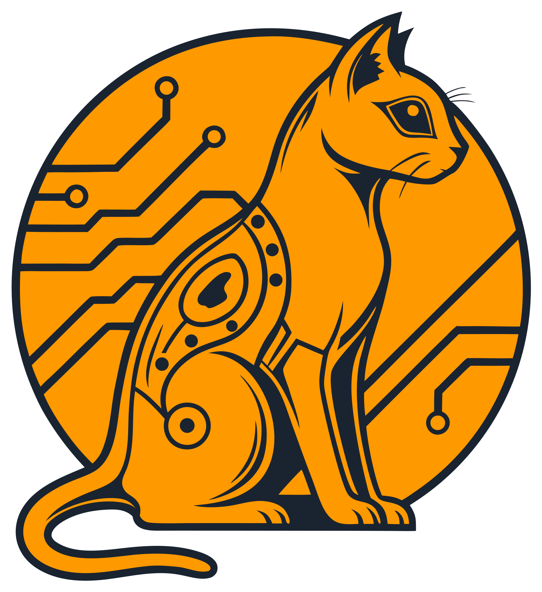

<div align="center">


# stdapi.ai

**OpenAI & Anthropic Compatible API Gateway for AWS Bedrock and AI Services**

Run your favorite OpenAI and Anthropic-compatible applications on AWS Bedrock—works out of the box with any app or tool that supports the OpenAI or Anthropic APIs. Access 80+ models from Claude, Llama, Nova, and more with enterprise-grade privacy, compliance controls, and AWS pricing.

[](https://aws.amazon.com/marketplace/pp/prodview-su2dajk5zawpo)
[](https://stdapi.ai)
[](LICENSE-AGPL)
</div>

---

## 🚀 What is stdapi.ai?

**stdapi.ai** is an OpenAI and Anthropic-compatible API gateway for AWS Bedrock and AI services. Drop-in replacement for OpenAI and Anthropic SDKs—works with LangChain, Continue.dev, Open WebUI, n8n, Claude SDK, and 1000+ tools without any modifications.

### Why Choose stdapi.ai?

- **🔌 Production-Ready OpenAI & Anthropic API Compatibility** – Full support for chat, embeddings, images, audio (speech/transcription/translation), and more. Applications designed for OpenAI's or Anthropic's API work instantly.
- **🔒 Enterprise Compliance & Data Sovereignty** – Configure allowed AWS regions to meet your compliance requirements. All inference stays in your AWS account—data never shared with model providers or used for training.
- **🌍 Multi-Region Bedrock Access** – Automatic cross-region inference profile selection for optimal availability and pricing. Access models across multiple AWS regions through one unified endpoint.
- **💰 AWS Direct Pricing, No Markup** – Pay-per-use pricing with no subscriptions. Pay only AWS Bedrock rates for exactly what you use—no monthly minimums or capacity commitments.
- **⚡ Advanced Model Capabilities** – Reasoning modes (Claude 4.6+, Nova 2), prompt caching, guardrails, prompt routers, application inference profiles, and service tiers built-in.

---

## 🎯 Key Features

### 🧠 Access to 80+ Leading Models
- **Anthropic** – Claude 4.6+ with extended reasoning capabilities
- **Amazon** – Nova 2 family for cost-effective performance
- **Meta** – Llama 4 for open-source flexibility
- **DeepSeek** – v3.2 for advanced code generation
- **OpenAI**, **Mistral AI**, **Google**, **Cohere**, **Stability AI**, **Qwen**, **Moonshot**, **Nvidia**, and more
- **Switch models instantly** without code changes—no vendor lock-in

### 🎙️ Comprehensive AWS AI Services
Unified under OpenAI API:
- **Amazon Polly** – Natural text-to-speech synthesis
- **Amazon Transcribe** – Accurate speech recognition with speaker diarization
- **Amazon Translate** – Multi-language translation support

### 🎨 Multi-Modal Capabilities
- Chat completions with reasoning modes
- Image generation and editing (Stable Diffusion)
- Audio speech, transcription, and translation
- Embeddings for semantic search and RAG
- Complete AI workflows in one API

---

## 💼 Who Uses stdapi.ai & Popular Use Cases

### 💬 Chat Interfaces - Private ChatGPT Alternative
Build ChatGPT-like experiences with AWS Bedrock models and complete privacy control.

**What you can build:**
- Private team chat with Open WebUI or LibreChat
- Customer support assistant with RAG-enabled document search
- Internal knowledge base with multi-modal capabilities (text, voice, images)

**Tools:** Open WebUI, LibreChat, Chatbot UI

---

### 🔄 Workflow Automation - AI-Powered Business Processes
Integrate AWS Bedrock into business processes through visual workflow builders.

**What you can automate:**
- Customer support ticket classification and response generation
- Automated content creation for blogs, social media, email campaigns
- Document workflows with AI summarization, translation, and classification
- Data extraction, transformation, and analysis

**Tools:** n8n, Make (Integromat), Zapier

---

### 💻 Developer Tools - AI Coding Assistants
Enhance development with AI-powered coding assistants in your IDE.

**What you can do:**
- Real-time code completion in VS Code, JetBrains IDEs, Cursor, Windsurf
- Natural language to code generation with Claude and specialized coding models
- Chat with your codebase, explain functions, refactor code
- Build with LangChain, LlamaIndex, Haystack using AWS Bedrock

**Tools:** Continue.dev, Cline, Cursor, Windsurf, Aider, LangChain, LlamaIndex

---

### 📝 Knowledge Management - AI-Enhanced Notes & Research
Transform knowledge bases with AI-powered insights and semantic search.

**What you can do:**
- AI writing assistance to generate, edit, and improve content
- Semantic search to find notes by meaning, not just keywords
- Auto-summarization to extract key points from long documents
- Smart organization with automatic tagging and linking

**Tools:** Obsidian, Notion AI integrations, Logseq, Roam Research

---

### 🤖 Team Chatbots & Assistants
Deploy intelligent AI assistants to Slack, Discord, Teams, and Telegram.

**What you can build:**
- Team Q&A bot for instant answers to common questions
- Documentation assistant that searches and cites internal docs
- Task automation via chat (create tickets, schedule meetings)
- Custom workflows with company-specific commands

**Tools:** Slack Bot, Discord Bot, Microsoft Teams Apps, Botpress

---

### 🧠 Autonomous Agents - Research & Task Automation
Build self-directed AI agents for complex multi-step tasks.

**What you can build:**
- Research agents for autonomous web research and analysis
- Multi-agent systems for collaborative problem-solving
- Self-improving workflows that adapt to results
- Autonomous development and testing systems

**Tools:** AutoGPT, BabyAGI, LangGraph, CrewAI, Semantic Kernel

---

## 🎯 Why Use stdapi.ai for Integrations?

- ✅ **Works out of the box** – Just update the API endpoint in your application settings
- ✅ **Access 80+ models** – Claude 4.6+, Nova 2, Llama 4, DeepSeek v3.2, Stable Diffusion, and more
- ✅ **Enterprise data control** – All processing stays in your AWS account
- ✅ **Pay-per-use pricing** – No subscriptions, pay only AWS Bedrock rates for actual usage
- ✅ **AWS-native features** – Leverage prompt caching, reasoning modes, and guardrails through standard OpenAI or Anthropic APIs

**📚 [View Complete Use Cases & Integration Guides →](https://stdapi.ai/use_cases/)**

---

## 🛒 AWS Marketplace

### Production-Ready Deployment

**stdapi.ai is available on AWS Marketplace** with commercial licensing, hardened containers, and streamlined deployment.

#### What's Included:
- ✅ **Commercial License** – Use in proprietary applications without AGPL obligations or source disclosure requirements
- ✅ **Hardened Container Images** – Security-optimized, regularly scanned for production workloads
- ✅ **Regular Security Updates** – Timely patches and vulnerability fixes to keep your deployment secure
- ✅ **Terraform Deployment Module** – Production-ready infrastructure following AWS Well-Architected Framework
- ✅ **Enterprise Support** – Professional support for deployment, configuration, and troubleshooting
- ✅ **OpenTelemetry & Observability** – Built-in monitoring and debugging capabilities

**[Deploy from AWS Marketplace →](https://aws.amazon.com/marketplace/pp/prodview-su2dajk5zawpo)**

**Community Edition:** Free Docker image available for local development and testing.

---

## 📖 Quick Start

### How It Works

**1. Deploy to AWS in minutes**
Launch via Terraform module on ECS, or run the Docker image locally for development.

**2. Point your application to stdapi.ai**
Update the `base_url` in your OpenAI or Anthropic client settings. All existing code, prompts, and workflows continue working.

**3. Access AWS Bedrock models immediately**
Use Claude, Nova, Llama, or any Bedrock model. Switch between models, regions, and providers instantly.

**Zero lock-in:** Standard OpenAI and Anthropic APIs mean you can switch back or to another provider anytime.

---

### Production Deployment

Deploy stdapi.ai to your AWS account in minutes using our Terraform module:

```hcl
module "stdapi_ai" {
  source  = "stdapi-ai/stdapi-ai/aws"
  version = "~> 1.0"
}
```

Then make your first API call:

```python
from openai import OpenAI

client = OpenAI(
    api_key="YOUR_API_KEY",
    base_url="https://YOUR_DEPLOYMENT_URL/v1"
)

response = client.chat.completions.create(
    model="anthropic.claude-sonnet-4-5-20250929-v1:0",
    messages=[{"role": "user", "content": "Hello from AWS!"}]
)

print(response.choices[0].message.content)
```

**📚 [Full Deployment Guide →](https://stdapi.ai/operations_getting_started/)**

---

## 🛠️ Local Development Setup

### Prerequisites

- Python 3.14 or higher
- [uv](https://github.com/astral-sh/uv) package manager
- AWS credentials configured

### Installation

1. **Clone the repository**
   ```bash
   git clone https://github.com/stdapi-ai/stdapi.ai.git
   cd stdapi.ai
   ```

2. **Install dependencies**
   ```bash
   uv sync --frozen --extra uvicorn
   ```

3. **Login to AWS**
   ```bash
   # Login using AWS SSO
   aws sso login --profile your-profile-name

   # Or configure your default profile
   aws configure sso
   ```

4. **Configure the application**
   ```bash
   # Core AWS Configuration (auto-detects current region if not set)
   export AWS_BEDROCK_REGIONS=us-east-1  # Optional: defaults to current AWS region

   # S3 Storage (required for certain features like image generation, audio)
   export AWS_S3_BUCKET=my-dev-bucket  # Create bucket in same region as AWS_BEDROCK_REGIONS

   # Enable API documentation (helpful for development)
   export ENABLE_DOCS=true

   # Logging Configuration
   export LOG_REQUEST_PARAMS=true  # Enable detailed request/response logging for debugging
   ```

5. **Run locally**
   ```bash
   uv run uvicorn stdapi.main:app --host 0.0.0.0 --port 8000
   ```

6. **Test the API**
   ```bash
   curl http://localhost:8000/v1/models
   ```

### Development Guidelines

- Follow existing code style and conventions
- Add tests for new features
- Update documentation for user-facing changes
- Ensure all tests pass before submitting PR

---

## 📚 Documentation

- **[Official Documentation](https://stdapi.ai)** – Complete guides and API reference
- **[Getting Started](https://stdapi.ai/operations_getting_started/)** – Deployment and configuration
- **[API Reference](https://stdapi.ai/api_overview/)** – Detailed API documentation
- **[Licensing](https://stdapi.ai/operations_licensing/)** – AGPL vs Commercial licensing

---

## 📜 License

This project is dual-licensed:

- **[AGPL-3.0-or-later](LICENSE-AGPL)** – Free for open-source projects that share alike
- **Commercial License** – Available via [AWS Marketplace](https://aws.amazon.com/marketplace/pp/prodview-su2dajk5zawpo) for proprietary applications

The AWS Marketplace version provides full commercial rights, no source disclosure requirements, and production-ready infrastructure.

[Learn more about licensing →](https://stdapi.ai/operations_licensing/)

---

## 🤝 Contributing

We welcome contributions! Whether it's:

- 🐛 Bug reports and fixes
- ✨ New features and enhancements
- 📖 Documentation improvements
- 💡 Ideas and suggestions

Please feel free to open issues or submit pull requests.

---

## 💬 Support

- **🐛 Issues:** [GitHub Issue Tracker](https://github.com/stdapi-ai/stdapi.ai/issues)
- **📖 Documentation:** [stdapi.ai](https://stdapi.ai)
- **💖 Sponsor:** [GitHub Sponsors](https://github.com/sponsors/JGoutin) – Support the project's development

Sponsorship benefits include priority support, feature prioritization, dedicated development time, SLA for critical issues, and influence on the project roadmap. [View sponsorship tiers →](https://github.com/sponsors/JGoutin)

---

## 🌟 Enterprise-Grade Features

- **🌍 Multi-region Bedrock access** – Automatic cross-region inference profile selection for optimal availability and pricing
- **⭐ Advanced model capabilities** – Reasoning modes (Claude 4.6+, Nova 2), prompt caching, guardrails, service tiers
- **🔌 Complete API coverage** – Chat, embeddings, image generation/editing, audio speech/transcription/translation
- **🎯 AWS AI services integration** – Amazon Polly (TTS), Transcribe (STT with diarization), Translate—unified under OpenAI API
- **📊 Observability & debugging** – OpenTelemetry, request/response logging, Swagger/ReDoc interfaces
- **🔒 Secure by default** – API keys in Systems Manager, CORS controls, SSRF protection, hardened containers

---

<div align="center">

**Get Started with AWS AI**

[Documentation](https://stdapi.ai) • [AWS Marketplace](https://aws.amazon.com/marketplace/pp/prodview-su2dajk5zawpo) • [GitHub Issues](https://github.com/stdapi-ai/stdapi.ai/issues)

Made with ❤️ for the AWS and AI community

</div>