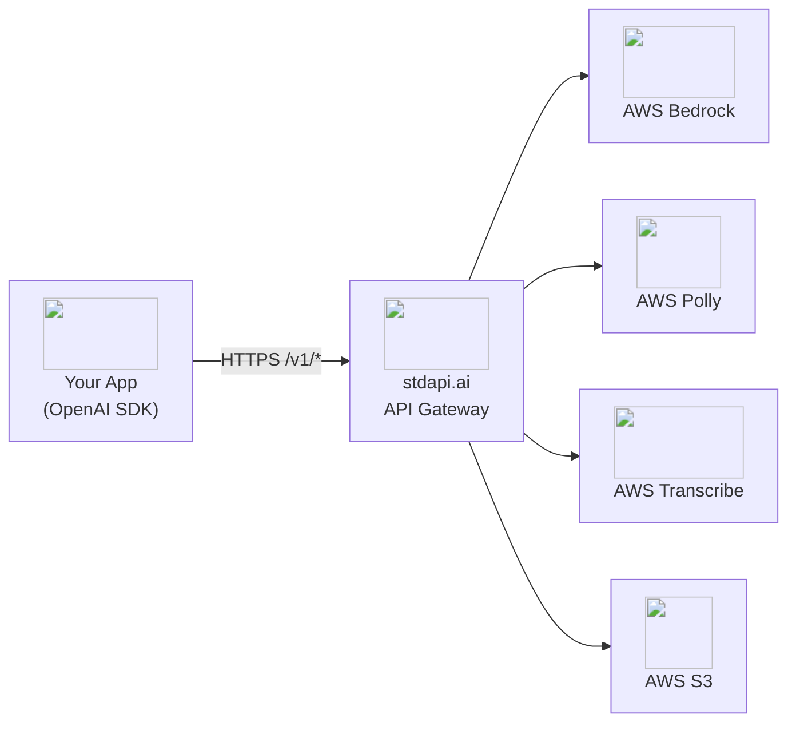

# API Overview

stdapi.ai provides the OpenAI API interface backed by AWS Bedrock foundation models and AWS AI services. Use your existing OpenAI SDKs by simply changing the base URL.

**Why this matters:**

- **No code rewrites** - Your existing OpenAI code works immediately
- **Access 80+ models** - Claude, Nova, Llama, DeepSeek, Stable Diffusion, and more through one API
- **Multi-modal AI** - Chat, images, audio, embeddings—all OpenAI-compatible
- **AWS-native features** - Prompt caching, reasoning modes, guardrails accessible through standard API

## Interactive Documentation

stdapi.ai provides multiple interfaces for exploring and testing the API—choose the one that fits your workflow:

### 📚 Documentation Resources

* **[Complete API Reference](api_reference.md)** – In-depth guides for every endpoint with parameter details
* **[OpenAPI Specification](openapi.yml)** – Full machine-readable schema for integration and tooling

### 🎮 Live API Playground

**When running the server**, access these interactive interfaces:

| Interface | URL | Best For |
|-----------|-----|----------|
| **Swagger UI** | `http://localhost/docs` | Testing endpoints directly in your browser with live request/response examples |
| **ReDoc** | `http://localhost/redoc` | Reading and searching through clean, organized documentation |
| **OpenAPI Schema** | `http://localhost/openapi.json` | Generating client code or importing into API tools like Postman |

## { style="height: 1.2em; vertical-align: text-bottom;" } OpenAI SDK-Compatible API

Access AWS-powered AI services through the OpenAI API interface. Use official OpenAI SDKs by simply changing the base URL—no custom clients needed.

**What you can build:**

- **Conversational AI** - Chatbots, assistants, customer support with multi-modal understanding
- **Content generation** - Images, articles, summaries, translations
- **Voice applications** - Speech-to-text transcription, text-to-speech synthesis
- **Semantic search** - RAG, document Q&A, knowledge bases with embeddings
- **Multi-modal apps** - Process text, images, audio, video, and documents together

**Supported Endpoints:**

| Category          | Endpoint                        | Capability                                                    | Documentation                                          |
|-------------------|---------------------------------|---------------------------------------------------------------|--------------------------------------------------------|
| **💬 Chat**       | `POST /v1/chat/completions`     | Multi-modal conversations with text, images, video, documents | [Chat Completions →](api_openai_chat_completions.md)   |
| **🎨 Images**     | `POST /v1/images/generations`   | Text-to-image generation                                      | [Generations →](api_openai_images_generations.md)      |
|                   | `POST /v1/images/edits`         | Image editing and transformations                             | [Edits →](api_openai_images_edits.md)                  |
|                   | `POST /v1/images/variations`    | Generate image variations                                     | [Variations →](api_openai_images_variations.md)        |
| **🔊 Audio**      | `POST /v1/audio/speech`         | Text-to-speech synthesis                                      | [Text to Speech →](api_openai_audio_speech.md)         |
|                   | `POST /v1/audio/transcriptions` | Speech-to-text transcription                                  | [Transcriptions →](api_openai_audio_transcriptions.md) |
|                   | `POST /v1/audio/translations`   | Speech-to-English translation                                 | [Translations →](api_openai_audio_translations.md)     |
| **🧠 Embeddings** | `POST /v1/embeddings`           | Vector embeddings for semantic search                         | [Embeddings →](api_openai_embeddings.md)               |
| **📋 Models**     | `GET /v1/models`                | List available models                                         | [Models →](api_openai_models.md)                       |

**Backend Services:**

- **AWS Bedrock** - 80+ foundation models (Claude, Nova, Llama, DeepSeek, Stable Diffusion, etc.)
- **AWS Polly** - Neural text-to-speech in 60+ languages
- **AWS Transcribe** - Speech-to-text with speaker diarization
- **AWS Translate** - Neural machine translation

**Compatible SDKs:** Official OpenAI SDKs (Python, Node.js, Go, Ruby, .NET, Java, etc.)

### Quick Start Guide

This guide shows how to use stdapi.ai with OpenAI SDKs.

stdapi.ai works with official OpenAI client libraries—no custom clients needed:

__Python__

```bash
pip install openai
```

```python
from openai import OpenAI

# Initialize client with your stdapi.ai endpoint
client = OpenAI(
    base_url="https://your-deployment-url/v1",
    api_key="your-api-key"
)

# Use AWS Bedrock models through the familiar OpenAI interface
response = client.chat.completions.create(
    model="amazon.nova-micro-v1:0",
    messages=[
        {"role": "system", "content": "You are a helpful assistant."},
        {"role": "user", "content": "Explain quantum computing in simple terms."}
    ]
)

print(response.choices[0].message.content)
```

```python
# Pass provider-specific parameter through `extra_body`:
response = client.chat.completions.create(
    model="anthropic.claude-sonnet-4-5-20250929-v1:0",
    messages=[{"role": "user", "content": "Solve this complex problem..."}],
    extra_body={
        "top_k": 0.5
    }
)
```

__Node.js__

```bash
npm install openai
```

```javascript
import OpenAI from 'openai';

// Initialize client with your stdapi.ai endpoint
const client = new OpenAI({
  baseURL: 'https://your-deployment-url/v1',
  apiKey: 'your-api-key'
});

// Use AWS Bedrock models through the familiar OpenAI interface
const response = await client.chat.completions.create({
  model: 'amazon.nova-micro-v1:0',
  messages: [
    { role: 'system', content: 'You are a helpful assistant.' },
    { role: 'user', content: 'Explain quantum computing in simple terms.' }
  ]
});

console.log(response.choices[0].message.content);
```

__cURL__

```bash
curl -X POST "https://your-deployment-url/v1/chat/completions" \
  -H "Authorization: Bearer your-api-key" \
  -H "Content-Type: application/json" \
  -d '{
    "model": "amazon.nova-micro-v1:0",
    "messages": [
      {"role": "system", "content": "You are a helpful assistant."},
      {"role": "user", "content": "Explain quantum computing in simple terms."}
    ]
  }'
```

## Understanding Compatibility

### What "Compatible" Means

stdapi.ai implements the API from source specification with AWS services as the backend. This means:

* ✅ **Same Request Format**: Use identical request bodies and parameters
* ✅ **Same Response Structure**: Receive responses in the expected format
* ✅ **Same SDKs**: Use official client libraries
* ✅ **Drop-in Replacement**: Change only the base URL and model ID

### Handling Parameter Differences

Different providers support different features. stdapi.ai handles this gracefully:

#### Silent Ignoring (Safe Parameters)
Parameters that don't affect output are accepted but ignored:

```python
# This works—unsupported parameters are silently ignored
response = client.chat.completions.create(
    model="amazon.nova-micro-v1:0",
    messages=[{"role": "user", "content": "Hello"}],
    user="user-123",  # Logged but doesn't affect AWS processing
)
```

#### Clear Errors (Behavior-Changing Parameters)
Parameters that would change output return helpful errors:

```python
# This returns HTTP 400 with a clear explanation
response = client.chat.completions.create(
    model="amazon.nova-micro-v1:0",
    messages=[{"role": "user", "content": "Hello"}],
    logit_bias={123: 100},  # Not supported—clear error returned
)
```

### Understanding the Architecture



**Request Flow:**

1. Your application uses the standard OpenAI SDK
2. Requests go to stdapi.ai's `/v1/*` endpoints instead of OpenAI
3. stdapi.ai translates OpenAI-format requests to AWS service APIs
4. AWS services process the requests
5. Responses are formatted as OpenAI-compatible responses
6. Your application receives familiar OpenAI response structures

---

## Discovering Available Models

To see all models available in your deployment:

**Using the API:**
```bash
curl https://your-deployment-url/v1/models \
  -H "Authorization: Bearer your-api-key"
```

**Using OpenAI SDK:**
```python
client = OpenAI(base_url="https://your-deployment-url/v1")
models = client.models.list()
for model in models:
    print(f"{model.id} - {model.owned_by}")
```

This returns all AWS Bedrock models available in your configured regions, including model IDs, providers, and capabilities.

See [Models API documentation](api_openai_models.md) for details.

---

## Next Steps

**Start building:**

- **[Chat Completions API](api_openai_chat_completions.md)** - Conversational AI with multi-modal support (text, images, video, documents)
- **[Images API](api_openai_images_generations.md)** - Text-to-image generation, editing, and variations
    - [Generations](api_openai_images_generations.md) - Create images from text
    - [Edits](api_openai_images_edits.md) - Modify existing images
    - [Variations](api_openai_images_variations.md) - Generate variations of images
- **[Audio APIs](api_openai_audio_speech.md)** - Text-to-speech, transcription, translation
    - [Speech](api_openai_audio_speech.md) - Text-to-speech synthesis
    - [Transcriptions](api_openai_audio_transcriptions.md) - Speech-to-text
    - [Translations](api_openai_audio_translations.md) - Speech-to-English translation
- **[Embeddings API](api_openai_embeddings.md)** - Vector embeddings for semantic search and RAG
- **[Models API](api_openai_models.md)** - List and discover available models

**Configure your deployment:**

- **[Configuration Guide](operations_configuration.md)** - Environment variables, AWS regions, security settings
- **[Monitoring & Logging](operations_logging_monitoring.md)** - Observability, debugging, CloudWatch integration

**Explore integrations:**

- **[Use Cases](use_cases.md)** - Open WebUI, n8n, Continue.dev, and more
- **[Getting Started](operations_getting_started.md)** - Deploy to AWS with Terraform
