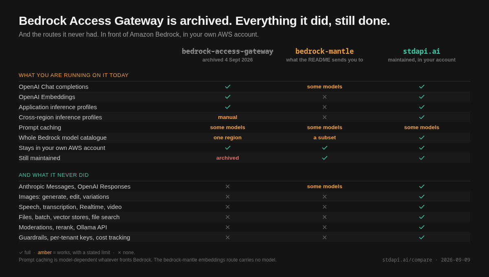

## TL;DR

On 4 September 2026 AWS deprecated and archived
[`aws-samples/bedrock-access-gateway`](https://github.com/aws-samples/bedrock-access-gateway),
the OpenAI-compatible proxy a lot of teams put in front of Amazon Bedrock. The
reason given is fair: Bedrock now serves those APIs itself.

<!-- more -->

Three things are worth knowing before you follow the migration note. It points at
`bedrock-mantle`, while AWS's endpoint page says to prefer `bedrock-runtime` for
most new applications, and the two trade real capabilities against each other. The
native surface reaches **55 of the 96 text models**, and **47 of those speak
exactly one** of Chat Completions, Responses or Messages, so changing model can
mean changing protocol. And embeddings have a route only on `bedrock-mantle`,
where no embedding model is available.

## What actually happened

The repository is archived, not merely marked. `archived: true`, last push
4 September 2026. The README now opens:

> **This project is deprecated.** Amazon Bedrock now serves OpenAI-compatible and
> Anthropic-compatible APIs natively, which is the reason this proxy existed. Call
> Amazon Bedrock directly instead of deploying this gateway.

That is an honest retirement. The sample existed to translate, Bedrock learned to
speak the protocol, and AWS retired the translator rather than leaving it to rot.
More projects should end this way.

One thing worth carrying, because it is what archiving actually costs you: the
last change before the deprecation was a security fix. **An archived repository
does not get the next one.** If you are running
the sample in production, that is the clock you are now on, and it is the only
genuinely urgent part of this.

## The migration note answers one side of the question

The README's instruction is "Point your SDK at the `bedrock-mantle` endpoint".

AWS's own endpoint documentation says something different:

> For most new applications, use the `bedrock-runtime` endpoint.

Both are AWS, and the README is the newer document: AWS moved its endpoint
guidance to `bedrock-runtime` in mid-August 2026, and the migration note was
written on 4 September. The README also links the comparison page, one line after
telling you which endpoint to pick.

So this is not AWS contradicting itself so much as a one-line answer to a question
that has two sides. Both endpoints serve the OpenAI-compatible Chat Completions
and Responses APIs and the Anthropic Messages API, and AWS says the two run the same
inference underneath. So the protocol is not what separates them. For someone moving
off the sample, two things do.

**Regions.** `bedrock-runtime` is available in every one of the 34 AWS regions
where Bedrock is offered. `bedrock-mantle` is in 14 of them. The OpenAI-compatible
routes are on both, so following the README literally costs you twenty regions and
buys nothing on the routes you were already using.

**Models.** Ten are reachable only on `bedrock-mantle`, GPT-5.4 and GPT-5.5 among
them. If one of those is your model, the README is right and the general advice is
wrong for you. AWS lists which endpoint serves each model, and that page is worth
one look before you choose.

Everything else in the endpoint comparison is narrow, and AWS's own recommendation
says as much: *"Use `bedrock-mantle` when you specifically need capabilities that
are currently available only there."* If none of those is what you are reaching
for, you are not choosing between the two on features.

**One thing not to infer.** Choosing `bedrock-runtime` does not mean giving up
the OpenAI API and rewriting against AWS's own SDK. The OpenAI-compatible routes
are on it too, under `/openai/v1`, and that is the point of using it.

And on those routes a cross-region inference profile is not something you opt
into, it is something AWS requires. From the same page: **"Name a cross-Region
inference profile as the model, not a foundation model ID. The OpenAI GPT models
use the `us.` and `global.` profiles in the commercial Regions ... In-Region
inference isn't available for these models on this endpoint."** So the model
string your application sends becomes `us.openai.gpt-5.6-sol` rather than the bare
ID, which is a change wherever your model names live.

## "Bedrock speaks OpenAI now" is three APIs, and your model picks one

This is the part that decides whether the migration is a config change or a
project. The deprecation note does give you the split: Claude to the Anthropic
Messages API, GPT and other models to Chat Completions and Responses, SDKs
unchanged. What it does not give you is the coverage, and for a Chat Completions
client the second half of that split is not reliably true.

AWS publishes a per-model API-compatibility table. It has 122 rows, but a quarter
of them are image, embedding, video and reranking models, which were never
candidates for a chat API and should not pad a denominator. **Ninety-six of the
122 return text. Of those 96, 55 are reachable on any of the OpenAI- or
Anthropic-shaped APIs**, so a little over half. The rest are there, but only
through AWS's own SDK.

Then the part that actually bites. Of those 55:

| What the model speaks | Models |
| --- | --- |
| Chat Completions only | 34 |
| Messages only | 9 |
| Chat Completions and Responses | 8 |
| Responses only | 4 |
| All three | **0** |

**Forty-seven of the fifty-five speak exactly one of the three, and not one model
speaks all three.** Which one you get is a property of the model, not a choice you
make.

That has consequences you can check in a minute:

- **Claude is not on the OpenAI Chat Completions API at all.** The nine Claude
  models that reach any of the three APIs are Anthropic Messages only, and no
  Claude model reaches Chat Completions. **For most teams coming off the sample
  this is the single biggest loss:** OpenAI-shaped code reached Claude through the
  proxy, and natively it does not reach it at all.
- **Four models speak Responses and not Chat Completions**, GPT-5.4 and GPT-5.5
  among them. Eight speak both. So even inside the OpenAI family, which API you
  get depends on which model you picked.
- **Most open-weight models are Chat Completions-only.** Qwen, Mistral, Gemma,
  DeepSeek and the rest.

So "call Bedrock directly" is not one API with a model parameter. It is three
APIs, and switching model can mean switching protocol. That is the thing Bedrock
Access Gateway was quietly doing for people: presenting one dialect over a
catalogue that does not have one.

Three caveats on the counting, and the first two are AWS's. It publishes no
headline figure, so these are row counts. Its two tables disagree about the
catalogue size, 122 against 127. And the 96 is this page's own filter, not AWS's:
the table mixes modalities and the split above only makes sense for models that
answer in text. Check the model you actually care about rather than trusting any
single "X of Y", this page's included.

The other gap is embeddings, and it is the one the migration note is quietest
about. AWS does document a `POST /v1/embeddings` route, on `bedrock-mantle` only,
and **no embedding model is available on that endpoint**. So the route exists
where the models are not, and the models exist where the route is not. On the
image, audio, video and moderation side, AWS's endpoint comparison simply lists no
such API at all: InvokeModel, Converse, Chat Completions, Responses, Messages, and
nothing else. It does not say those are unsupported; it documents no OpenAI-shaped
route for them.

That matters for exactly one group of people, and it is a large one.

## If you are running the sample today

Bedrock Access Gateway covered chat completions **and embeddings**, the latter on
its own `/v1/embeddings` route. Its source lists five embedding models it served:
Cohere Embed English and Embed Multilingual, Titan Embeddings G1 Text, Titan Text
Embeddings V2, and Nova Multimodal Embeddings. **The native OpenAI surface reaches
none of them.** So a deployment calling `/v1/embeddings` against the sample has no
documented like-for-like target, and the migration note does not mention it.

Nothing breaks today. Archived code keeps running, and the sample will keep
proxying until something underneath it changes. What you have lost is future
security fixes, and what you should do about it depends on what you actually call:

- **Chat only, one region, and you are on a model in the compatibility table.**
  Point at the native endpoint and delete the stack. This is the case AWS's note
  was written for and it is genuinely a drop-in.
- **Chat plus embeddings.** The embeddings call has to go somewhere else, either
  to Bedrock's native API directly or to something that fronts both.
- **Anything beyond text.** Images, transcription, speech, video, moderation. None
  of it was in the sample either, so you were already solving it elsewhere, and
  that part of your architecture does not change.

## What is left, if native is not enough

Three options, and they are genuinely different trades rather than variations.

**Bedrock's own endpoints.** No infrastructure, no patching, your existing AWS
support contract. Constrained to the models and APIs in the compatibility tables,
and to `bedrock-runtime` if you want all 34 regions, or Guardrails on Chat
Completions, since AWS says they do not apply to Responses on either endpoint. For
chat-shaped workloads on mainstream models this is now the obvious default, and it
is the right answer more often than it was a week ago.

**LiteLLM.** The multi-cloud answer, and the cleanest fork in the decision: if the
requirement is not AWS-only, an AWS-deep tool will be worse at it on purpose. It
reaches far more of the catalogue than the native surface does, adds request-time
spend limits, and costs you a service to run and more configuration than the
alternatives to reach the same place. A `bedrock/*` wildcard gets you the
catalogue, but spreading across regions means declaring each deployment per
region, with TPM and RPM on each entry if you want usage-based routing rather than
the default shuffle.

**A dedicated AWS-native gateway.** [stdapi.ai](../../index.md) publishes this
blog, so read this paragraph as disclosed rather than neutral. It runs in your own
AWS account and fronts Bedrock's catalogue, plus your own SageMaker AI endpoints,
on the OpenAI and Anthropic APIs. It is infrastructure you run, which is the cost. The four-way capability comparison, with
per-row sources and verification dates, is at
[stdapi.ai/compare](../../compare.md).

## The three questions that decide it

**1. Is it chat, on a model in the compatibility table that speaks your
application's dialect, in a region `bedrock-runtime` serves?** If yes, use the
native endpoint and own nothing. AWS is right to push this, and the dialect clause
is the one people discover late: your Chat Completions code does not reach Claude
natively.

**2. Is it only AWS?** If no, LiteLLM, and stop reading comparisons that assume
otherwise.

**3. Does it need what the native surface does not serve?** Embeddings on the
OpenAI API, where the route exists but no model does; images, transcription,
speech, video and moderation, which have no documented OpenAI-shaped route; or the
whole catalogue rather than a subset of it. If yes, something has to front Bedrock, and
the only question left is whether you build it or run someone else's.

## A table, since you were going to ask

The AWS columns were counted from AWS's own tables on 9 September 2026. The
LiteLLM and Access Gateway cells come from `stdapi.ai/compare/`, whose rows carry
their own verification dates, the most recent 9 September 2026. The stdapi.ai
column is this site's own product and carries no independent verification, so
weigh it accordingly. Check before committing; all of it moves.

| | Access Gateway | LiteLLM | Bedrock's own endpoints | stdapi.ai |
|---|---|---|---|---|
| Status | **deprecated, archived 2026-09-04** | active | active | active |
| Chat completions | yes | yes | 42 of the 96 text models (the 34 Chat-only plus the 8 that also speak Responses) | yes |
| One dialect over the catalogue | chat and embeddings only | yes | **no, 3 APIs and the model picks** | yes |
| Embeddings | yes, 5 models | yes | route documented on `bedrock-mantle`, no embedding model available there | yes |
| Images, audio, video, moderation | no | partial | not documented | yes |
| Guardrails | no | yes | `bedrock-runtime` only, and not on Responses | yes, on the classic endpoint |
| Cross-region inference | manual, no auto-selection | manual per model | required on the OpenAI routes for GPT models | yes |
| Regions | single, per deployment | yours | all 34 on `bedrock-runtime`, 14 on `bedrock-mantle` | yours |
| Multi-cloud | no | yes | no | no |
| Infrastructure to run | yours | yours | none | yours |
| Security fixes | **none, archived** | open source, paid Enterprise tier | AWS | open source, commercial support |

## Where to start

Try the native endpoint first, and try it today rather than planning to. For a
chat workload it is two strings of configuration, and if it fits you are done, you
own nothing, and you can stop reading about gateways.

Read the endpoint comparison page before you follow the README, because the README
answers one side of the question, and the difference is twenty regions in one
direction and ten models in the other.

If you are running the sample in production, the deadline is not functional, it is
the security fix that will not arrive. Nothing is on fire, but do not let it sit
for a year.

And if the native surface does not cover what you call, that is a genuinely
narrower surface rather than a failure of your architecture. It is documented as
such, and you now know exactly which of your calls fall outside it.

Which way are you going, and did the embeddings gap catch you too?
