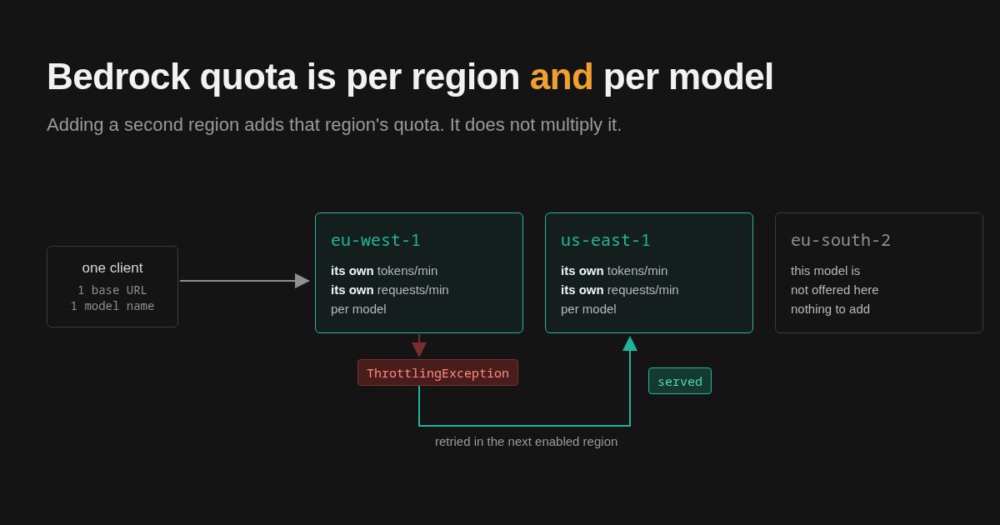

## TL;DR

Amazon Bedrock quota is per region and per model. If you are seeing
`ThrottlingException`, you are usually not at the limit of what AWS will sell you.
You are at the limit of the one region you deployed in. Adding a second region
brings that region's own quota with it, and it needs no conversation with your
account team.

<!-- more -->

You are most likely already on a cross-region inference profile, which has a
separate quota again, counted in the region you call from. After that, four limits
catch people: a stream cannot fail over once it has started, an asynchronous
invocation stays in the region that accepted it, more regions is not automatically
more throughput, and spreading works against your prompt cache.

## It is usually not a capacity problem

`ThrottlingException` reads like a wall. Most of the time it is a topology
detail.

Every AWS region maintains its own independent Bedrock quota. Not a shared pool
with regional views of it: separate numbers, tracked separately. Nothing you are
granted in `eu-west-1` has any effect on `us-east-1`, and a quota increase
approved for one is invisible to the other.

The quota is also per model. `anthropic.claude-*` and `amazon.nova-*` in the same
region have separate tokens-per-minute quotas, and separate requests-per-minute
quotas where the model has one at all, because AWS enforces RPM for some models and
not others. Burning through one leaves the other untouched.

Output tokens are also not counted one for one. AWS applies a burndown rate: "the
burndown rate for Anthropic Claude models version 4.8 is 15x for output tokens (1
output token consumes 15 tokens from your quotas) and the burndown rate for
Anthropic Claude Sonnet 5, Claude Opus 5, and Claude Fable 5.1 is 10x for output
tokens". A generation-heavy workload therefore reaches the ceiling far sooner than
a token count suggests.

So there are two dimensions, and the practical consequence is that capacity
planning which treats "our Bedrock quota" as a single number is planning against
a number that does not exist. The thing you actually have is a matrix.

## What a second region buys

The matrix is also the lever. Pointing traffic at a second region adds that
region's quota to what you can reach, without asking anyone.

It is the cheapest throughput increase available on Bedrock. A quota increase
request is a support ticket with a review and a wait. Provisioned throughput is a
commitment with a bill attached. Reaching a second region is an IAM policy and a
first call: serverless models enable themselves on first invocation given the AWS
Marketplace permissions, and the region's default quota is usually available from
that call. If it is an opt-in region, the account has to be opted in first.

Check the applied value in Service Quotas before you plan on it, because a new
account can carry a reduced one. AWS says the quotas assigned to an account "might
be updated depending on regional factors, payment history, fraudulent usage, and/or
approval of a quota increase request", so an approved request is one of four
triggers rather than the only one. That is not only theory here. On one new account the reduced quota did come up
without any increase request being filed, though support had been contacted about
it. Whether that was the conversation or simply the account ageing into normal use
cannot be separated after the fact, so treat it as a reason to check the number
rather than as a mechanism to rely on.

What it is not is a multiplier. Three regions does not mean three times the
throughput, for reasons in the section on limits below, and anyone selling it to
you that way is rounding off the part that matters.

It does buy something you were not asking for. The same spread that adds quota
also means one region having a bad afternoon stops being your outage. Treat that
as a side effect rather than as a design: a stream still cannot move mid-response
and an asynchronous invocation still does not migrate, so it covers the next
request rather than the one that was in flight.

## You are probably already on a cross-region inference profile

This is not advice, it is a fact about the current catalogue. For many of the
models people actually want there is no in-region on-demand path at all. Of the 135 Bedrock
models across 31 regions in the [catalogue](../../models.md) on 2026-09-08, 110 are
served through Bedrock Runtime, and 35 of those are reachable only through an
inference profile. That includes the current Claude line. The `us.`,
`eu.` or `global.` identifier is not an optimisation you opt into. It is the only
way in.

That one is checkable in a minute, and worth checking:

~~~console
$ aws bedrock list-foundation-models --region us-east-1 \
    --query "modelSummaries[?contains(modelId,'claude')].[modelId,inferenceTypesSupported]"
~~~

On a test account that returns 16 Claude models, and exactly one carries
`ON_DEMAND`: `anthropic.claude-3-haiku-20240307-v1:0`, from March 2024. Every
other Claude model comes back `INFERENCE_PROFILE` and nothing else. Run it in your
region before you plan around in-region capacity for Claude.

One scoping note, because it changes what the answer means: this call lists models
on the Bedrock Runtime endpoint. Models served only through `bedrock-mantle` do not
appear in it at all, so treat the output as the runtime catalogue rather than as
everything Bedrock will sell you.

That does not exempt you from quota, and this is the part that surprises people.
The profile has its own allowance: Bedrock counts *Cross-Region InvokeModel tokens
per minute* separately from *On-demand InvokeModel tokens per minute*. A separate
bucket, exhausted just as easily, and the `ThrottlingException` looks identical.

So where does extra quota come from, if you cannot leave the profile? Calling the
same profile from a second source region did yield more headroom. You are not
adding a destination, you are adding a source.

**The evidence for that sentence deserves stating plainly, because it is the most
useful line here and the most weakly sourced.** It came from testing rather than
from documentation, and the test is some months old. AWS scopes the quota *per model, per Region* in its own tables, and
for a caller-side quota that region is the one you call from, so the behaviour is
consistent with how the quota is described. But **AWS nowhere states that a second
source region gives you a second allowance**, and no third-party source appears to
either. It is one account's measurement against undocumented
behaviour, which means AWS is free to change it without telling anybody.

It gets shakier on *global* profiles, where AWS's own pages disagree with each
other: the global cross-region page says "This is a global limit", while the
General Reference lists the same quota as "Each supported Region: 10,000". Those
cannot both be operative, and the favourable reading is not the safe one.

So: try it on your own account and read the applied values in Service Quotas in
each source region. Do not put it in a capacity plan on the strength of this page alone.

**Provisioned Throughput is not the fallback.** AWS states that "inference profiles
currently don't support Provisioned Throughput", so on a profile-only model that
lever is closed. What remains is more source regions, an increase request, batch
inference, or the Flex tier.

Two properties of profiles still shape the design.

**A geography-scoped profile has a fixed destination list.** AWS states that a
profile tied to a geography such as US or EU will never change the regions it
routes to. It is a set you select, not a set you compose, so if your allowed
regions do not line up with a published geography, the profile is not expressing
your constraint.

**A global profile routes worldwide and its list grows** as AWS adds regions. If
you have a residency position this is the tier that breaks it: permitting it means
permitting `aws:RequestedRegion` to be unspecified in your policies, which is a
decision to take deliberately rather than to discover.

If one source region's profile quota covers your traffic, stop here. You do not
need anything else.

## When a profile is not enough, and why it gets postponed

The remaining case is real: your permitted regions are not a geography, or the
model has no profile, or you want to spread across profiles and on-demand
capacity at once. That is where the work appears.

**You declare the same model once per region.** Each entry carries its own
tokens-per-minute and requests-per-minute limits, so the config grows as the
product of models and regions rather than the sum. LiteLLM's router works exactly
this way: each model is declared once per region, and TPM and RPM go on each entry
if you want its usage-based routing rather than the default shuffle.

**You maintain an availability list that AWS keeps invalidating.** Model
availability by region changes on AWS's schedule, not yours. Every launch, every
regional expansion and every deprecation edits your config, and nothing tells you
it has happened except a failure.

**You write retry logic in the application, or in a proxy you configure and
operate.** Doing it in the application is the awkward one, because that layer has
the least idea which regions are currently healthy. It knows the call failed. It does not know whether the next region is any
better, and by the time it finds out it has spent the user's latency budget
discovering it.

## The four limits that catch people

**1. A stream cannot fail over once it has started.** Retry works before the
stream opens. Once bytes are flowing the region is locked, and nothing in front of
Bedrock changes that. So a mid-stream failure surfaces to the user, and if your
product is a chat UI, this is the failure mode you will actually see.

**2. An asynchronous invocation stays where it landed.** A `StartAsyncInvoke` job,
the API behind video and other long-running generation, selects its region when it
starts and nothing in front of Bedrock moves it afterwards. Batch inference is the
exception, not the rule: submit it through a cross-region inference profile and AWS
spreads the compute across the profile's regions itself, against batch's own
separate quota. Only the job record and its S3 input and output stay in the region
you submitted from.

**3. More regions is not automatically more throughput.** This is the one most
often skipped in "multi-region for resilience" write-ups. Quota is per region *and*
per model, and the model you want may exist in a handful of regions rather than all
of them. Adding a region that does not carry your model adds nothing at all. Check
[availability](../../models.md) first and plan capacity second, not the other way
round.

**4. Spreading regions works against your prompt cache.** AWS says this plainly
about cross-region inference: "at times of high demand, these optimizations may
lead to increased cache writes." The read is the cheap side of caching and the
write can be dearer than an ordinary input token, billed at 1.25× the uncached
input rate on the GPT-5.6 family. You cannot pin the routing to protect it either:
"You can't choose a specific Region to process your request. If you must process
your requests in a specific Region, then use on-demand models directly in that
Region." So on a workload with a large shared prefix, spreading can have you
re-paying for prompts you had already cached, and the bill moves before the
throughput does.

There is a corollary worth acting on before you add anything at all, and it holds
on both endpoints. On `bedrock-runtime` the quota is burned as
`InputTokenCount + CacheWriteInputTokenCount + (OutputTokenCount x burndown rate)`,
and `CacheReadInputTokenCount` values "don't contribute to this calculation and are
not counted toward your quota". On `bedrock-mantle` AWS states that "cached input
tokens read through prompt caching do not count against the input-tokens-per-minute
quota". So a better cache hit rate is itself a throughput lever, and a cheaper one
than a second region. It does not extend everywhere: "prompt caching is only
supported for on-demand inference endpoints. It is not supported with the batch
inference API."

## The constraint that comes first

Which regions you are allowed to enable is not a capacity decision. It is usually a
data-residency decision, made by someone who has never seen a `ThrottlingException`
and who is not going to be persuaded by one.

Get the allowed list before you design the routing. It is the outer constraint and
everything else works inside it. Encoding it as an IAM or SCP deny rather than as
team discipline is also what lets you show an auditor a policy instead of an
intention.

## Where a gateway fits, and where it stops

[stdapi.ai](../../index.md), the AI gateway this blog belongs to, runs in your
own AWS account and puts this in the routing layer: you enable the regions
you are allowed to use, requests route across them, and
[eligible failures](../../operations_resilience.md) retry on the next one.
Throttling, quota exhaustion, a temporary regional outage, or a region that cannot
currently serve the model. The application keeps sending one base URL and one model
name.

Three places it stops, and all three are properties of the problem rather than of
the implementation.

**A read timeout does not fail over.** Every other retryable error on a request
without S3 inputs escalates to the next region immediately, but on a read timeout
the model has already been invoked
and AWS bills it whatever the client does. Failing over there would pay a second
region for the same generation rather than recover it, so the request returns `503`
instead. That is a cost limit rather than a capability one, and it is the kind
worth stating plainly.

**Each candidate region is tried at most once per request.** A region that just
failed is under the backoff its own failure recorded, and a second error there
would only deepen it. So the number of attempts is bounded by how many regions can
serve the model, or by the configured retry cap, whichever runs out first: you
cannot buy more attempts than you have regions.

**A request carrying S3 inputs is pinned to one region.** An S3 reference is
resolved for the region that holds the data and cannot be replayed against another,
so those requests keep botocore's in-region retries and never move region at all.

None of those is unique to this gateway. Any honest router hits all three.

## What to check first

- Which regions is this model actually available in?
- Which of those are you permitted to use, and is that written as a policy?
- Is the model reachable at all without an inference profile, and if it is not,
  does the profile's geography match your permitted list?
- How many source regions do you call that profile from today?
- What is your prompt cache hit rate, and can the workload afford to fragment it?
- Are you reading the on-demand quota or the cross-region quota when you conclude
  you are throttled?
- What share of your traffic is streaming, given that streaming cannot fail over
  mid-response?
- Is anything on the critical path an asynchronous invocation, given that those do
  not move region once started?

How are you handling Bedrock throttling today? Cross-region inference profiles,
your own retry layer, or provisioned throughput?
