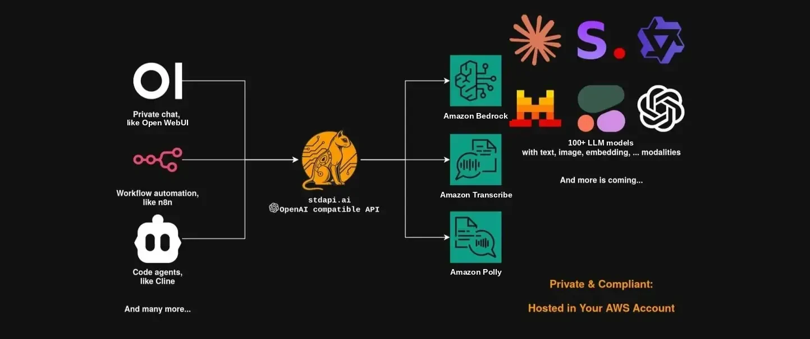

## TL;DR
Use your existing OpenAI-compatible tools (OpenWebUI, n8n, Cline, Cursor) with AWS Bedrock's 100+ models and AWS AI services (Polly, Transcribe). Point the client at your gateway instead of the vendor's. Deploy to your AWS account with Terraform. No third party sits between your users and your models.

<!-- more -->

!!! info "Published December 2025 — capability claims reviewed for v1.17.0 (September 2026)"

    The gateway has gained API surfaces since this post was written. See the
    [release notes](../../roadmap.md) for everything that shipped after it.

## The Solution in 30 Seconds

```python
from openai import OpenAI

# Just change this line ↓
client = OpenAI(base_url="https://your-aws-api/v1", api_key="your-key")

# Everything else stays the same ↓
response = client.chat.completions.create(
    model="anthropic.claude-sonnet-4-5-20250929-v1:0",  # Claude 4.5 on Bedrock
    messages=[{"role": "user", "content": "Hello from AWS!"}],
)
```

**What this enables:**

- Use OpenWebUI, n8n, Cline, Cursor with AWS Bedrock and AWS AI services
- Access Claude, Nova, Qwen, DeepSeek, Mistral, Cohere and 100+ more models
- Text-to-speech (Polly), speech-to-text (Transcribe), image generation, embeddings
- Inference runs on the AWS services you enable, in the regions you allow
- Multi-region model access from a single endpoint

## The Problem We Solved

Most modern AI tools are built for OpenAI's API, but AWS Bedrock uses a completely different SDK. This forces you to choose between using familiar tools or switching to AWS for compliance/cost reasons and rewriting everything.

We ran into this while working with a customer who needed:

- **Data control**: inference on the AWS services and regions they choose
- **Choice**: Multiple models (Claude, Nova, Qwen, Mistral, DeepSeek, Stability AI, Cohere)
- **Multi-region access**: Different Bedrock models available in different AWS regions
- **Standard tooling**: OpenWebUI, n8n, IDE coding agents (Cline, Cursor)
- **Full AWS AI stack**: Bedrock models plus Polly (TTS) and Transcribe (STT)

## Our Approach: An OpenAI-Compatible Translation Layer

**stdapi.ai** is an API gateway that sits in your AWS account and translates OpenAI API calls to AWS services.

### Key Features

**OpenAI API Compatibility**

Point the client at your gateway and your existing code keeps working:

```python
from openai import OpenAI

client = OpenAI(
    base_url="https://your-deployment.example.com/v1", api_key="your-api-key"
)

# Chat completions
response = client.chat.completions.create(
    model="amazon.nova-pro-v1:0",
    messages=[{"role": "user", "content": "Explain AWS Lambda"}],
)

# Text-to-speech with Polly
response = client.audio.speech.create(
    model="amazon.polly-neural", input="Welcome to the future of voice technology!"
)

# Speech-to-text with Transcribe
with open("meeting-recording.mp3", "rb") as audio_file:
    transcription = client.audio.transcriptions.create(
        model="amazon.transcribe", file=audio_file, response_format="json"
    )

# Image generation with Bedrock
response = client.images.generate(
    model="stability.stable-image-ultra-v1:1",
    prompt="A serene mountain landscape at sunset",
)

# Embeddings with Bedrock
response = client.embeddings.create(
    model="cohere.embed-v4:0",
    input="Semantic search transforms how we find information",
)
```

**Multi-Region Access**

Access models across multiple AWS Bedrock regions from a single endpoint. Different models are available in different regions. You can configure which regions to include based on your requirements. AWS Bedrock inference profiles handle automatic routing when needed.

**Multi-Modal Capabilities**

Process text, images, videos, and documents together in a single request. Supports HTTP URLs, S3 URLs (for direct access to your data), and base64 data URIs. Perfect for vision tasks, document analysis, and RAG applications.

## Deployment

**Deploy to your AWS account with two Terraform commands**, once you have a
domain, a certificate and the model access you want.

Sample configurations set up:

- Application Load Balancer with ECS/Fargate
- IAM roles with least-privilege access
- CloudWatch logging
- S3 storage
- Optional: Custom domain with ACM certificate

**Get started:** [Sample Terraform configurations](https://github.com/stdapi-ai/samples)

## Use Cases

- **Chat interfaces**: OpenWebUI or LibreChat for private ChatGPT alternatives
- **Workflow automation**: n8n connecting AI to 400+ services
- **Developer tools**: IDE coding agents (Cline, Cursor, Continue.dev)
- **Knowledge management**: AI-powered note-taking and semantic search
- **Internal AI tools**: Custom chatbots for Slack, Discord, Teams

## Technical Details

**How It Works:**

1. Converts OpenAI API format to Bedrock's format
2. Maps model IDs to appropriate AWS services and regions
3. Provides unified access to models across configured AWS regions
4. Converts Bedrock responses back to OpenAI format
5. Supports streaming via Server-Sent Events (SSE)

**Security:**

- All traffic stays within your AWS account
- IAM role-based access control
- Optional API key authentication
- VPC deployment supported
- Integrates with AWS Bedrock guardrails

**Performance:**

- Low latency translation layer
- Streaming response support
- Scales with ECS/Fargate auto-scaling

## Open Source & Commercial Options

**stdapi.ai** is available as open source (AGPL-3.0) for experimentation and internal use.

**For production deployments, we recommend the AWS Marketplace version**, which includes:

- Hardened container images
- Regular security updates
- Production support
- 14-day free trial

The commercial license also removes AGPL obligations for proprietary applications.

## Get Started

**🏢 Recommended:** [AWS Marketplace](https://aws.amazon.com/marketplace/pp/prodview-su2dajk5zawpo) (14-day free trial, production-ready)

**🚀 Open source:** [GitHub](https://github.com/stdapi-ai/stdapi.ai) (AGPL-3.0 for experimentation)

**📦 Sample deployments:** [Terraform configurations](https://github.com/stdapi-ai/samples)

**📚 Documentation:** [Full guides and API reference](../../index.md)

## Conclusion

This translation layer approach solves the AWS Bedrock compatibility gap while keeping everything AWS-native.

**Key benefits:**

- **Adoption is quick**: point the OpenAI SDK at your gateway, and name a
  different model only where the name differs
- **AWS-native**: Fully integrated with Bedrock, Polly, Transcribe
- **Multi-region**: Access models across AWS regions from one endpoint
- **Production-ready**: Terraform deployment, CloudWatch integration

## The Guides This Post Promised

All four have since shipped (as of v1.17.0, September 2026):

- [Open WebUI on AWS](../../use_cases_openwebui.md): private ChatGPT alternative with Bedrock
- [n8n workflows](../../use_cases_n8n.md): AWS AI services in automation pipelines
- [Coding assistants](../../use_cases_coding_assistants.md): IDE and terminal agents on Bedrock models
- [RAG applications](../../use_cases_rag.md): document search with Bedrock embeddings

**Want a guide that is not there, or solved this differently?**
[Open an issue on GitHub](https://github.com/stdapi-ai/stdapi.ai/issues).
