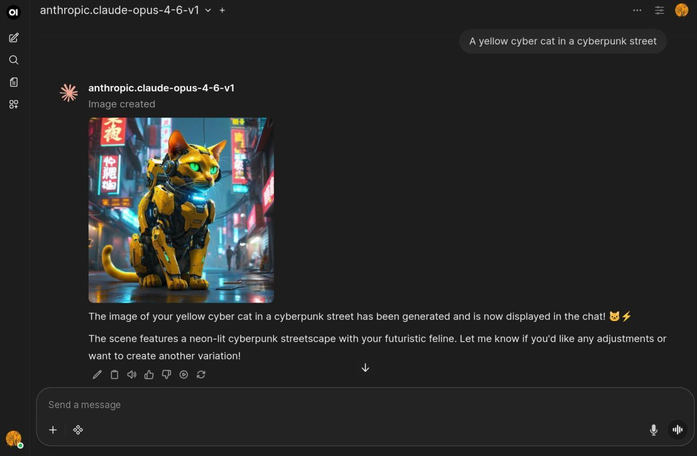

What if you could deploy a **fully private ChatGPT alternative** — on your own AWS infrastructure, with your own data sovereignty rules — in 30 minutes?

<!-- more -->

No third party between your users and your models. No per-seat fees. Two Terraform commands, once you have a domain, a certificate and the model access you want.

Here's how.

## The Stack

| Component | Role |
|-----------|------|
| [**Open WebUI**](https://github.com/open-webui/open-webui) | ChatGPT-like interface (100,000+ ⭐ on GitHub) |
| [**stdapi.ai**](../../index.md) | OpenAI-compatible API gateway for AWS |
| **AWS Bedrock** | Access to 100+ foundation models |

**stdapi.ai** sits between Open WebUI and AWS Bedrock, translating OpenAI API calls into native AWS requests. Standard SDKs connect on the base URL alone — Open WebUI, n8n, VS Code AI assistants, custom apps.

```
User → Open WebUI → stdapi.ai → AWS Bedrock → Claude Opus 4.6, DeepSeek, Kimi, Mistral…
                                             → AWS Polly (text-to-speech)
                                             → AWS Transcribe (speech-to-text)
```

## What You Get

- **100+ AI models** — Claude, DeepSeek, Kimi, Mistral, Cohere, Stability AI, and more
- **Full multi-modal support** — Chat, voice input/output, image generation/editing, document RAG
- **Multi-region access** — Configure multiple AWS regions for the widest model selection and availability
- **Pay-per-use** — No ChatGPT subscriptions, no per-seat fees. You pay only for actual AWS Bedrock usage
- **Production-ready infrastructure** — ECS Fargate with auto-scaling, Aurora PostgreSQL + pgvector for RAG, ElastiCache Valkey, dedicated VPC, HTTPS with ALB

## Data Sovereignty & Compliance

This is where it gets interesting for regulated industries:

- **Region allow-lists** — Pin inference to the AWS regions you approve. Whether that satisfies a given obligation is a judgement for you and your advisers; the gateway supplies the control, not the conclusion
- **No data shared with model providers** — AWS Bedrock does not share your inference data with model providers
- **No training on your data** — Your prompts and responses are never used for model training
- **No third party in the request path** — traffic goes from your application to your own deployment to AWS
- **Dedicated VPC** — Isolated network for your AI workloads

Whether you need to keep data in the EU, in specific US regions, or within national boundaries for government requirements — you configure the allowed regions and stdapi.ai enforces it.

## Deploy in 30 Minutes

```bash
git clone https://github.com/stdapi-ai/samples.git
cd samples/getting_started_openwebui/terraform

# ⚙️ Customize your settings (regions, models, scaling…)
# → Check the full documentation in the repo to tailor the deployment to your needs

terraform init && terraform apply
```

That's it.

### What Terraform deploys for you:

- Open WebUI on **ECS Fargate** with auto-scaling
- stdapi.ai as the **OpenAI-compatible AI gateway**
- **Aurora PostgreSQL** with pgvector extension for RAG
- **ElastiCache Valkey** for caching
- **Dedicated, isolated VPC** with HTTPS via ALB
- All environment variables pre-configured and ready to go

## How stdapi.ai Works Under the Hood

stdapi.ai is more than a simple proxy. It's an AI gateway purpose-built for AWS that:

- **Translates the OpenAI API** — Chat completions, embeddings, images (generation/editing/variations), audio (speech/transcription/translation), and model listing
- **Handles multi-region routing** — Automatically selects the best region and inference profile for each model
- **Exposes advanced Bedrock features** — Prompt caching, reasoning modes (extended thinking), guardrails, service tiers, and model-specific parameters
- **Integrates native AWS AI services** — Amazon Polly for TTS, Amazon Transcribe for STT with speaker diarization, Amazon Translate

Your existing OpenAI-powered tools work without modification. Change the base URL, and you're on AWS.

## Who Is This For?

- **Teams** that want a private ChatGPT with full data control
- **Regulated industries** (finance, healthcare, government) that need data residency guarantees
- **Companies** tired of paying per-seat ChatGPT subscriptions when usage varies wildly
- **Developers** who want to use the OpenAI ecosystem on AWS infrastructure
- **Ops engineers** who want production-grade AI infrastructure as code

## Get Started

📦 **Deployment repo:** [github.com/stdapi-ai/samples](https://github.com/stdapi-ai/samples/tree/main/getting_started_openwebui)

📖 **Documentation:** [stdapi.ai](../../index.md)

📩 **Need help?** We can help you deploy and customize this solution for your needs. Reach out to us.

---

*Two Terraform commands, and a private ChatGPT running in your own AWS account.*
