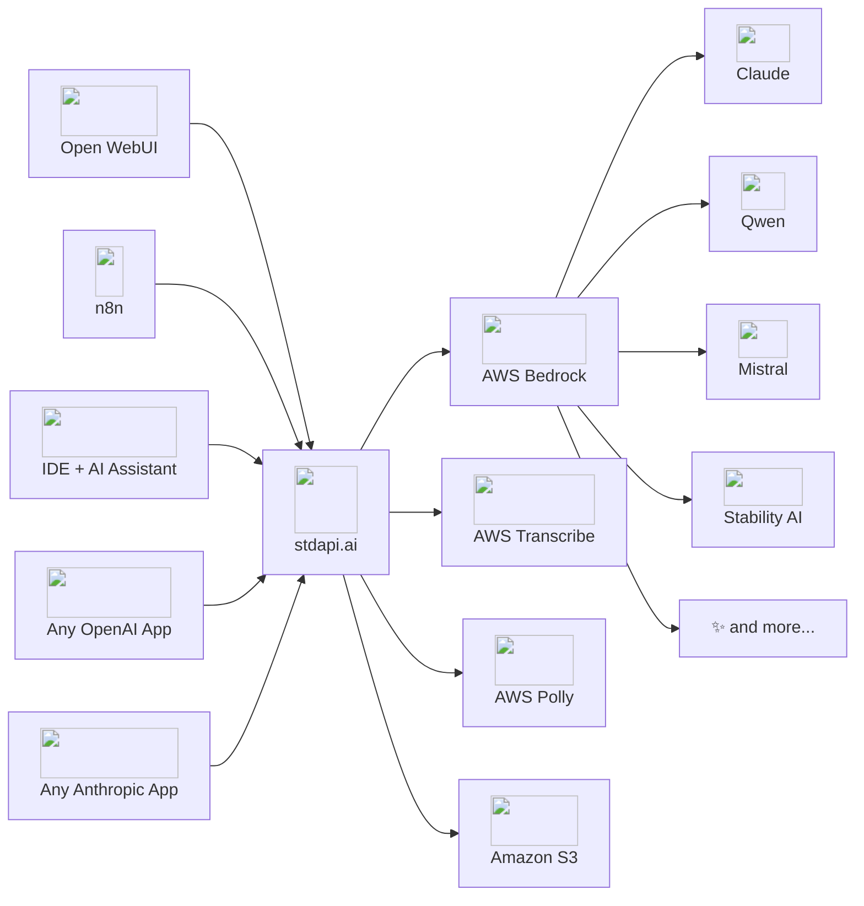

# Features — AI Gateway for AWS Bedrock

stdapi.ai is an **AI gateway purpose-built for AWS**. It brings full OpenAI and Anthropic API compatibility to AWS Bedrock and AWS AI services, so your team can use their favorite OpenAI and Anthropic-powered applications—ChatGPT-compatible UIs, Claude-compatible tools, coding assistants, automation platforms—on AWS infrastructure with zero friction.

Born from deep AWS Solutions Architecture and software engineering expertise—and a genuine passion for AI—stdapi.ai is designed to work seamlessly whether you're an end user, an ops engineer, or a developer: broad API parameter coverage, careful error handling, and deep AWS integration provide a smooth experience out of the box.

- :material-api: **Drop-in OpenAI & Anthropic replacement** — Change only the base URL
- :material-aws: **Optimized for AWS** — Built to leverage Bedrock, Polly, Transcribe, Translate
- :material-shield-check: **Broad compatibility** — Works with your favorite OpenAI and Anthropic-powered apps and SDKs
- :material-rocket-launch: **Deploy anywhere on AWS** — ECS via Terraform, Docker for local dev

---

## :material-sitemap: How It Works

stdapi.ai sits between your applications and AWS AI services, translating OpenAI and Anthropic API calls into native AWS requests. Any tool or SDK that speaks the OpenAI or Anthropic protocol connects instantly—no plugins, no custom integrations.

---

## :material-api: OpenAI & Anthropic API Compatibility

stdapi.ai provides **broad OpenAI and Anthropic API compatibility**, covering routes and parameters far beyond basic chat. Your existing applications, SDKs, and tools—from Open WebUI to Claude SDK to coding assistants—work immediately.

### Supported API Routes

**OpenAI-Compatible:**

| Endpoint                   | Capability                                   | AWS Backend                          |
|----------------------------|----------------------------------------------|--------------------------------------|
| `/v1/chat/completions`     | Conversational AI, tool calling, multi-modal | AWS Bedrock Converse API             |
| `/v1/embeddings`           | Vector embeddings for search & RAG           | AWS Bedrock Embedding Models         |
| `/v1/images/generations`   | Image generation                             | AWS Bedrock Image Models             |
| `/v1/images/edits`         | Image editing & inpainting                   | AWS Bedrock Image Models             |
| `/v1/images/variations`    | Image variations                             | AWS Bedrock Image Models             |
| `/v1/audio/speech`         | Text-to-speech                               | Amazon Polly                         |
| `/v1/audio/transcriptions` | Speech-to-text with diarization              | Amazon Transcribe                    |
| `/v1/audio/translations`   | Speech-to-English translation                | Amazon Transcribe + Amazon Translate |
| `/v1/models`               | Model discovery & listing                    | AWS Bedrock                          |

**Anthropic-Compatible:**

| Endpoint                    | Capability                                   | AWS Backend                 |
|-----------------------------|----------------------------------------------|-----------------------------|
| `/v1/messages`              | Conversational AI, tool calling, multi-modal | AWS Bedrock Converse API    |
| `/v1/messages/count_tokens` | Count tokens without sending a message       | AWS Bedrock CountTokens API |
| `/v1/models`                | Model discovery & listing                    | AWS Bedrock                 |
| `/v1/models/{model_id}`     | Model details                                | AWS Bedrock                 |

### Unified Multi-Modal API

Access **text, image, audio, and video** capabilities through a single, consistent API interface:

- **Text** — Chat completions, embeddings, and translation across 80+ models
- **Images** — Generation, editing, and variations via Stable Diffusion, Nova Canvas, and more
- **Audio** — Speech synthesis (Polly), transcription with speaker diarization (Transcribe), and translation
- **Video & Documents** — Multi-modal inputs in chat completions for models that support them

### Broad Parameter Coverage

Unlike minimal adapters, stdapi.ai works to map as many OpenAI API parameters as possible to their Bedrock equivalents—across all supported routes, not just chat completions:

- **Generation controls** — `temperature`, `max_tokens`, streaming, and many more specialized parameters
- **Tool/function calling** with OpenAI-compatible schema, including parallel tool calls
- **Streaming** via Server-Sent Events (SSE) with token usage reporting
- **All message roles** — System, developer, user, assistant, and tool
- **Image & audio parameters** — Size, quality, format, voice, speed, and other route-specific options
- **Model-specific features** — Support for capabilities unique to specific models (e.g., reasoning effort, prompt caching, system tools)
- **Extra parameters** — Pass additional model-specific or route-specific parameters beyond the standard OpenAI API via the `extra_body` field

!!! note "Bedrock & model differences"
    AWS Bedrock and its underlying models may not support every OpenAI parameter identically. stdapi.ai aims to maximize compatibility, but some parameters may behave differently or have limitations depending on the model. Check the [API documentation](api_openai_chat_completions.md) for details.

---

## :material-aws: Purpose-Built for AWS

stdapi.ai is **engineered specifically for AWS**, unlocking advanced Bedrock features and native AI services that generic gateways cannot provide.

### Multi-Region Bedrock Access

- **Configure multiple AWS regions** to access the widest selection of models and maximize availability
- **Multiply your effective quota** — Each AWS region has its own independent quota; adding regions scales your tokens-per-minute and daily token limits proportionally (3 regions = ~3× the quota)
- **Automatic cross-region inference profile selection** — stdapi.ai intelligently selects the best inference profile or falls back to direct model invocation
- **Region-aware optimization** — Models are routed to the optimal region based on availability and your configuration

### Resilience & Failover

stdapi.ai automatically handles service disruptions and model changes, with no client-side changes needed:

- **Automatic region routing** — Distribute requests across regions with ordered, lowest-latency, or round-robin strategies; automatically fails over on quota limits or regional unavailability
- **Deprecated model failover** — Requests to deprecated or retired models are transparently redirected to their replacements

[:octicons-arrow-right-24: Resilience & Failover](operations_resilience.md)

### Advanced Bedrock Features

stdapi.ai exposes Bedrock-specific capabilities through the familiar OpenAI API:

| Feature                            | Description                                                         |
|------------------------------------|---------------------------------------------------------------------|
| **Prompt Caching**                 | Cache prompts to reduce latency and cost on supported models        |
| **Reasoning Modes**                | Extended thinking with configurable effort (Claude, Nova 2)         |
| **Guardrails**                     | AWS Bedrock Guardrails for content filtering and safety policies    |
| **Service Tiers**                  | Optimized latency tiers for different workload priorities           |
| **Application Inference Profiles** | Use custom inference profiles for workload isolation                |
| **Prompt Routers**                 | Bedrock prompt routers for intelligent model selection              |
| **System Tools**                   | AWS Bedrock system tools (e.g., web grounding with citations)       |
| **Claude Server Tools**            | Bash, text editor, computer use, and memory tools for Claude models |
| **Extra Model Parameters**         | Pass model-specific parameters not covered by the OpenAI API        |

### AWS AI Services Integration

Beyond Bedrock, stdapi.ai integrates natively with AWS AI services—all accessible through OpenAI-compatible endpoints:

- **Amazon Polly** — High-quality text-to-speech with multiple voices and languages
- **Amazon Transcribe** — Speech-to-text with **speaker diarization** support
- **Amazon Translate** — Language translation for audio translation workflows
- **Amazon Comprehend** — Automatic language detection for routing

### S3 Integration

- **S3 bucket support** for file storage in image and audio operations
- **Regional S3 buckets** for multi-region deployments
- **S3 Transfer Acceleration** for faster file access via generated HTTP links

---

## :material-shield-lock: Compliance & Data Sovereignty

stdapi.ai gives you **full control over where your data is processed**, making it straightforward to meet regulatory requirements.

- **Region restrictions** — Configure exactly which AWS regions are allowed for inference, matching your GDPR, HIPAA, or FedRAMP requirements
- **Cross-region inference profile filtering** — Easily restrict cross-region profiles to only compliant regions
- **Data stays in your AWS account** — All inference runs within your own account; data is never shared with model providers or used for training
- **No external data transmission** — stdapi.ai processes requests locally and communicates only with AWS services

!!! info "AWS Bedrock Privacy Defaults"
    AWS Bedrock provides strong privacy guarantees by default: inference data is not shared with model providers and is not used for model training. stdapi.ai inherits and preserves these protections.

[:octicons-arrow-right-24: Data Sovereignty & Compliance](operations_compliance.md)

---

## :material-security: Security

Security is built into every layer of stdapi.ai:

| Feature | Description |
|---|---|
| **API Key via SSM / Secrets Manager** | Store API keys securely in AWS Systems Manager Parameter Store or Secrets Manager—never in environment variables or code |
| **CORS Controls** | Configurable Cross-Origin Resource Sharing policies |
| **Trusted Hosts** | Restrict which hostnames the service responds to |
| **Proxy Header Handling** | Secure forwarded header processing for load balancer deployments |
| **CSRF Protection** | Built-in Cross-Site Request Forgery protection |
| **Hardened Docker Image** | Minimal attack surface container image (commercial version) |

---

## :material-chart-line: Observability & Debugging

Monitor, debug, and audit your AI gateway with built-in tooling:

- **OpenTelemetry integration** — Export traces and metrics to AWS X-Ray, Datadog, or any OTLP-compatible backend
- **Request/response logging** — Optional detailed logging of full request and response payloads for debugging
- **Token usage tracking** — Accurate token consumption reporting in API responses
- **Swagger & ReDoc interfaces** — Interactive API documentation served directly by the application
- **Configurable log levels** — Fine-grained control over logging verbosity
- **Client IP logging** — Optional client IP tracking for audit trails

---

## :material-cog: Quality of Life

Features that make day-to-day operations smoother:

- **Model aliases & overrides** — Map custom model names to specific Bedrock model IDs for simplified client configuration
- **Claude model name aliases** — Use official Anthropic model names (e.g., `claude-opus-4-6`) that automatically resolve to the correct Bedrock model identifiers
- **Model auto-detection** — Automatically discovers available Bedrock models in your configured regions
- **Model list caching** — Cached model listings for fast responses without repeated AWS API calls
- **Token usage reporting** — Consistent usage statistics across all endpoints
- **Zero-configuration startup** — Works out of the box with automatic region and model detection

---

## :material-rocket-launch: Deployment

stdapi.ai offers flexible deployment options for every stage:

| Option                     | Best For                    | Details                                                                                                                                              |
|----------------------------|-----------------------------|------------------------------------------------------------------------------------------------------------------------------------------------------|
| **Community Docker Image** | Local development & testing | Free, open-source, quick to start                                                                                                                    |
| **Terraform Module (ECS)** | Production on AWS           | Ready-to-use infrastructure-as-code via [AWS Marketplace](https://aws.amazon.com/marketplace/pp/prodview-su2dajk5zawpo), includes hardened container |
| **Use Case Examples**      | Guided integration          | Pre-built deployment configurations for Open WebUI, n8n, coding assistants                                                                           |

- **Comprehensive documentation** — Detailed [Getting Started](operations_getting_started.md) guide, [Configuration Reference](operations_configuration.md), and [Use Case](use_cases.md) walkthroughs
- **High-performance runtime** — Powered by [Granian](https://github.com/emmett-framework/granian), a fast Python ASGI server, with configurable workers and threads

---

## :material-check-all: Feature Summary

A quick-reference checklist to find what you need at a glance:

### API & Compatibility

- :material-check-circle:{ .green-check } OpenAI Chat Completions API (`/v1/chat/completions`)
- :material-check-circle:{ .green-check } OpenAI Embeddings API (`/v1/embeddings`)
- :material-check-circle:{ .green-check } OpenAI Images API (generations, edits, variations)
- :material-check-circle:{ .green-check } OpenAI Audio API (speech, transcriptions, translations)
- :material-check-circle:{ .green-check } OpenAI Models API (`/v1/models`)
- :material-check-circle:{ .green-check } Anthropic Messages API (`/v1/messages`)
- :material-check-circle:{ .green-check } Anthropic Token Counting API (`/v1/messages/count_tokens`)
- :material-check-circle:{ .green-check } Anthropic Models API (`/v1/models`, `/v1/models/{model_id}`)
- :material-check-circle:{ .green-check } Streaming (Server-Sent Events)
- :material-check-circle:{ .green-check } Tool / function calling
- :material-check-circle:{ .green-check } Multi-modal inputs (text, image, audio, video, documents)
- :material-check-circle:{ .green-check } Broad parameter mapping (all routes)
- :material-check-circle:{ .green-check } Model-specific features & extra parameters

### AWS Integration

- :material-check-circle:{ .green-check } Multi-region Bedrock access
- :material-check-circle:{ .green-check } Automatic region routing (ordered, lowest-latency, round-robin)
- :material-check-circle:{ .green-check } Automatic cross-region inference profile selection
- :material-check-circle:{ .green-check } Prompt caching
- :material-check-circle:{ .green-check } Reasoning modes (extended thinking)
- :material-check-circle:{ .green-check } Bedrock Guardrails
- :material-check-circle:{ .green-check } Service tiers
- :material-check-circle:{ .green-check } Application inference profiles
- :material-check-circle:{ .green-check } Prompt routers
- :material-check-circle:{ .green-check } Claude server tools (bash, text editor, computer use, memory)
- :material-check-circle:{ .green-check } Amazon Polly (text-to-speech)
- :material-check-circle:{ .green-check } Amazon Transcribe (speech-to-text with diarization)
- :material-check-circle:{ .green-check } Amazon Translate
- :material-check-circle:{ .green-check } S3 integration with Transfer Acceleration

### Security & Compliance

- :material-check-circle:{ .green-check } API keys in SSM Parameter Store / Secrets Manager
- :material-check-circle:{ .green-check } Region-based data sovereignty controls
- :material-check-circle:{ .green-check } CORS, trusted hosts, proxy headers
- :material-check-circle:{ .green-check } CSRF protection
- :material-check-circle:{ .green-check } Hardened Docker image (commercial)
- :material-check-circle:{ .green-check } Data never leaves your AWS account

### Operations

- :material-check-circle:{ .green-check } OpenTelemetry integration
- :material-check-circle:{ .green-check } Request/response detail logging
- :material-check-circle:{ .green-check } Swagger & ReDoc API docs
- :material-check-circle:{ .green-check } Model aliases & overrides
- :material-check-circle:{ .green-check } Claude model name aliases (e.g., `claude-opus-4-6` → Bedrock ID)
- :material-check-circle:{ .green-check } Model auto-detection & caching
- :material-check-circle:{ .green-check } Token usage tracking
- :material-check-circle:{ .green-check } Zero-configuration startup
- :material-check-circle:{ .green-check } Terraform module for production (ECS)
- :material-check-circle:{ .green-check } Community Docker image for development

---

## Ready to Get Started?

- :material-rocket-launch: [**Get Started in Minutes**](operations_getting_started.md) — Deploy to AWS with Terraform or [run locally with Docker](operations_getting_started_local.md)
- :material-book-open-variant: [**Explore the API**](api_overview.md) — Full API reference and examples
- :material-puzzle: [**See Use Cases**](use_cases.md) — Open WebUI, n8n, coding assistants, and more
- :material-aws: [**Start 14-Day Free Trial**](https://aws.amazon.com/marketplace/pp/prodview-su2dajk5zawpo) — AWS Marketplace, no commitment

