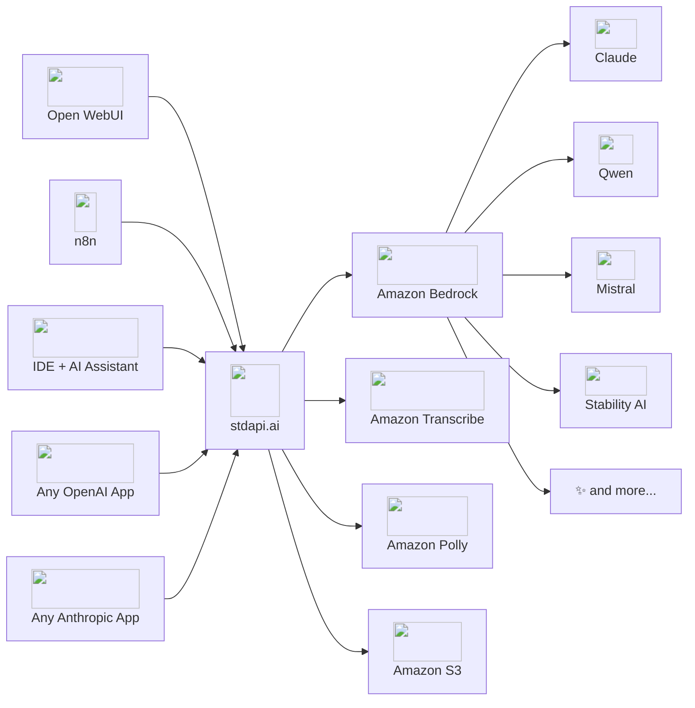

# :material-check-all: Features — AI Gateway for Amazon Bedrock

stdapi.ai is an **AI gateway purpose-built for AWS**. It brings full OpenAI, Anthropic, and Cohere API compatibility to Amazon Bedrock and AWS AI services — so the tools, SDKs, and applications your team already uses run against your own AWS account, from the moment they point at a new base URL.

---

## :material-sitemap: How It Works

stdapi.ai translates OpenAI, Anthropic and Cohere API calls into native AWS requests. A tool or SDK that speaks one of the three protocols connects on the base URL alone — no plugins, no custom integrations.

---

## :material-api: API Compatibility

### 80+ endpoints, all three protocols, every one on an AWS service

Not a chat proxy with a few extras: the OpenAI, Anthropic and Cohere surfaces are served in full, each endpoint backed by an AWS service running in your account.

| What your application calls it for                                                      | AWS service behind it                                            |
|-----------------------------------------------------------------------------------------|------------------------------------------------------------------|
| Chat completions, Responses, Messages, legacy completions, token counting                 | Amazon Bedrock Converse API · Bedrock Mantle                     |
| [Server-side conversations](api_openai_conversations.md) and stored responses             | Amazon Bedrock Sessions · Bedrock Mantle                         |
| [Embeddings](api_cohere_embed.md) and [reranking](api_cohere_rerank.md)                   | Amazon Bedrock embedding and rerank models                       |
| [Vector stores and file search](api_openai_vector_stores.md)                              | Amazon S3 Vectors · Amazon Bedrock Knowledge Bases               |
| [Batch inference](api_openai_batches.md)                                                  | Amazon Bedrock batch inference                                   |
| Image generation, editing and variations                                                  | Amazon Bedrock image models                                      |
| [Video generation](api_openai_videos.md)                                                  | Amazon Bedrock video models                                      |
| Text-to-speech                                                                            | Amazon Polly                                                     |
| Transcription and speech translation                                                      | Amazon Transcribe · Amazon Translate · Amazon Nova Sonic         |
| [Live speech-to-speech](api_openai_realtime.md)                                           | Amazon Bedrock                                                   |
| [Content moderation](api_openai_moderations.md)                                           | Amazon Bedrock Guardrails · Amazon Comprehend                    |
| Files and multipart uploads                                                               | Amazon S3                                                        |
| [Model discovery](api_search_models.md) and [pricing](api_model_pricing.md)                | Amazon Bedrock · AWS Price List                                  |

Anthropic and Cohere routes live under `/anthropic` and `/cohere`, so all three protocols are served side by side without colliding on `/v1` — and either prefix can become the path your clients already send ([Anthropic](operations_configuration.md#anthropic-routes-prefix), [Cohere](operations_configuration.md#cohere-routes-prefix)).

[:octicons-arrow-right-24: Every endpoint, with its parameters](api_overview.md)

### Parameter Coverage

stdapi.ai maps as many parameters as possible to Bedrock equivalents — across all routes, not just chat:

- **Generation controls** — `temperature`, `max_tokens`, `top_p`, `top_k`, `stop`, `seed`, `frequency_penalty`, `presence_penalty`, `logit_bias`, `top_logprobs`, streaming via SSE, token usage reporting
- **Reasoning** — `reasoning_effort` (none/minimal/low/medium/high/xhigh), `enable_thinking`, `thinking_budget`
- **Tool / function calling** — Full OpenAI and Anthropic schemas, parallel tool calls, tool choice modes
- **All content types** — System, developer, user, assistant, and tool roles; text, image, audio, video, and document content
- **Response formats** — JSON object, JSON schema, streaming chunks, `reasoning_content`, `annotations`
- **Model-specific extras** — Any parameter beyond the standard API via `extra_body` or top-level request fields

!!! note "Bedrock & model differences"
    Not every parameter maps identically across all models. Check the [API documentation](api_openai_chat_completions.md) for details.

---

## :material-brain: 100+ Models Across 20+ Providers

Access every model available on Amazon Bedrock through a single, consistent API — including OpenAI GPT, xAI Grok, and [other frontier models](#bedrock-mantle-models). [Browse the full list](models.md).

- { style="height: 1.2em; vertical-align: text-bottom;" } **Anthropic Claude**
   Claude Fable/Mythos, Claude Opus, Claude Sonnet, Claude Haiku — including reasoning models. Use official Anthropic model names (e.g., `claude-fable-5`) — they resolve automatically.

- { style="height: 1.2em; vertical-align: text-bottom;" } **OpenAI GPT**
   GPT frontier models plus open-weight gpt-oss, under OpenAI's own model names. The enrollment-gated Daybreak variants are served and priced with the rest of the family where your account is enrolled with OpenAI's Daybreak programme.

- { style="height: 1.2em; vertical-align: text-bottom;" } **Google Gemma**
   Gemma 4 and other Gemma open-weight variants.

- { style="height: 1.2em; vertical-align: text-bottom;" } **Amazon Nova**
   Nova — including reasoning-capable variants. Canvas for images. Multimodal embeddings. Built-in web grounding and code interpreter.

- { style="height: 1.2em; vertical-align: text-bottom;" } **Meta Llama**
   Llama Scout, Maverick, and earlier Llama variants.

- { style="height: 1.2em; vertical-align: text-bottom;" } **Alibaba Qwen**
   Qwen and Qwen3 Coder — including thinking mode.

- { style="height: 1.2em; vertical-align: text-bottom;" } **DeepSeek**
   Latest DeepSeek V3 models with automatic reasoning content surfacing.

- { style="height: 1.2em; vertical-align: text-bottom;" } **Moonshot Kimi**
   Kimi with optional thinking mode.

- { style="height: 1.2em; vertical-align: text-bottom;" } **Mistral AI**
   Mistral, Mixtral, and Mistral Large variants.

- { style="height: 1.2em; vertical-align: text-bottom;" } **Cohere**
   Command models for chat; Embed v4 for multimodal embeddings.

- { style="height: 1.2em; vertical-align: text-bottom;" } **Stability AI**
   Stable Diffusion 3.5, SD3 Ultra, and specialty models (upscale, style, search).

- { style="height: 1.2em; vertical-align: text-bottom;" } **MiniMax & more**
   MiniMax, xAI Grok, Writer Palmyra, AI21 Jamba, TwelveLabs Marengo video embeddings, and others.

This is a hand-picked sample, not the full roster — the [Models](models.md) page lists every model this gateway actually serves, generated from the live catalogue.

### Model Management

- **Automatic model discovery** — Configured regions are scanned at startup, so there is no model list to maintain by hand and nothing to keep in step with Bedrock's catalogue
- **Aliases** — A model is published under whichever names you choose, with Claude and OpenAI names resolving on their own; an alias can carry [its own service tier, guardrail, metadata and parameters](operations_configuration.md#model-aliases-configuration), so one model serves several policies under several names
- **Deprecation handled for you** — Models AWS has retired drop out of the list your users pick from, so nobody builds on a model about to be withdrawn, and requests naming one are redirected to its replacement; a workload that still depends on one can [keep it listed](operations_configuration.md#bedrock-legacy)
- **Capability discovery** — The [catalogue](api_search_models.md) advertises what each model can actually do — modality, route, streaming, speech to speech, transcription and translation, the search surfaces, and Batch API support — filterable over HTTP and through the same tool an agent reads before it calls anything
- **Published, not just discoverable** — The [Models](models.md) page lists every model this gateway serves on AWS, with modalities, regional availability, AWS prices and independent leaderboard scores

---

## :material-image-multiple: Multi-Modal Capabilities

### :material-chat: Text & Conversational AI

- [Server-side conversations](api_openai_conversations.md) — a thread is kept server-side and continued by id instead of resending the history, its items listed and managed, and a response attached to it through the Responses API `conversation` parameter; a long thread can be [compacted](api_openai_responses.md#conversation-compaction) into a reusable summary item rather than replayed in full
- Token counting before a call, so a prompt can be sized against a model's window without paying to generate
- Streaming over Server-Sent Events with tokens delivered as they arrive; reasoning content blocks on the models that produce them, and web search results as context
- Image, document, audio and video attachments on multimodal models — see [Attachment Size](#attachment-size) for how large ones are carried

### :material-image: Images

- **Generation** — Text-to-image in PNG, JPEG or WebP, at the size, aspect ratio, quality and compression asked for, with model-specific style presets and partial previews streamed while it renders
- **Editing** — Mask-based inpainting over a region you define, image-to-image transformation on style or structure, background removal, object search-and-replace, object recolor, and creative or conservative upscaling
- **Variations** — Alternative versions of an existing image
- **Nothing re-uploaded** — An input image is referenced by Files API `file_id` or by URL rather than sent again with every call

### :material-microphone: Audio

**Text-to-speech (Amazon Polly)**

- 60+ voices across 30+ languages, on the Standard, Neural, Long-Form and Generative engines, with the language detected automatically
- SSML control over pronunciation, emphasis, pauses and prosody, at 0.2× to 2.0× speed; MP3, PCM, Opus, AAC, FLAC and OGG Vorbis output
- Long input — up to 100,000 characters per request, 24× OpenAI's limit ([20,000 with a generative voice, which speaks it as the audio is delivered](api_openai_audio_speech.md#long-input))

**Speech-to-text (Amazon Transcribe)**

- 100+ languages, detected automatically when the request does not name one
- Speaker diarization, word-level and segment-level timestamps, and SRT/VTT subtitle export
- Vocabulary customization and custom language models, per language — so a request identifying between several applies the right resources to each one
- [Streamed results](api_openai_audio_transcriptions.md#streaming) — each phrase comes back as it is recognized instead of after the whole recording, whenever the request names the language to expect
- [Transcripts encrypted with your own KMS key](operations_configuration.md#aws-transcribe-output-encryption-key-arn), under a key policy scoped to this workload rather than to a whole bucket

**Speech translation** — Transcribe audio and translate to English in a single request; a language pair that cannot be served is refused as a request problem instead of failing after the audio has been transcribed.

**Speech-to-text (Amazon Nova Sonic)** — An alternative backend on both audio routes, at the lowest transcription cost available here — about $0.006 per minute of audio at current Amazon Bedrock rates. Punctuated transcripts in the language spoken, with automatic language detection, and translation to English produced by the model itself in one request. `json` and `text` output only, up to 10 minutes of audio per request — no timestamps, subtitles, diarization or detected-language reporting.

**Live speech-to-speech ([Realtime API](api_openai_realtime.md))**

- Bidirectional audio over a single WebSocket, OpenAI Realtime API compatible
- 24 kHz PCM, or G.711 at 8 kHz for telephony; server-side voice activity detection or manual turn control, with barge-in on the item the caller spoke over
- Ephemeral, browser-safe client secrets, minted by one instance behind a load balancer and verified by any other
- A configured guardrail is applied per turn — a written item is checked before it reaches the model, a spoken answer once it is complete ([guardrail coverage](api_openai_realtime.md#guardrail-coverage))
- **Its limits, up front** — a session lasts at most 8 minutes and calls no tools, and WebSocket is the only transport: upstream's WebRTC and SIP call route is not served. For WebRTC or telephony, LiveKit Agents and Pipecat terminate the media themselves and reach this API like any other client — see [transports](api_openai_realtime.md#transports) and the [feature compatibility table](api_openai_realtime.md#feature-compatibility)

### :material-file-document: Documents & Files

- PDF input with optional citations — the answer points back at the exact source passage
- Plain text and structured content blocks as context; a large PDF or document is carried by reference on a model that reads it from storage — see [Attachment Size](#attachment-size)
- Upload once and reference by ID across requests, with expiry anywhere from 1 hour to 30 days
- Multipart uploads for large files, backed by S3's own multipart

### :material-video: Video

- Text-to-video and image-to-video generation (Amazon Nova Reel, Luma Ray 2) through the OpenAI Videos API, as an asynchronous job — create, list, poll, download, delete
- Video as chat input on the models that read it (Amazon Nova among them); long clips follow the [Attachment Size](#attachment-size) policy
- `s3://` URLs as direct video input for multimodal embeddings

### :material-paperclip: Attachment Size

On chat completions, messages and responses served by Amazon Bedrock, every attachment — an image, document, audio or video sent as base64, a data URI, an HTTPS URL, an `s3://` URI or a Files API ID — is measured before the request is built, and carried the way that model accepts:

| Attachment size                                            | How it is sent                                                           |
|------------------------------------------------------------|--------------------------------------------------------------------------|
| Within the model's inline capacity                         | Embedded in the request                                                  |
| Above it, on a model that reads that kind from storage      | Staged in [a bucket of yours](operations_configuration.md#aws-s3-regional-buckets) in the region serving the request, and referenced |
| Above it, on a model that reads it inline only              | Refused with `413`, stating the size that model accepts                  |

Models differ in their per-attachment and per-request limits and in which kinds they read from storage — the Amazon Nova families read images, documents and video that way and TwelveLabs Pegasus reads video, while the rest read attachments from inside the request — so the same file can be inline for one model and staged for another, with nothing in the request changing either way. An attachment already in S3 is referenced as it stands whatever its size, on a model that reads that kind from storage. Bedrock Mantle-served models, image editing and variations, transcription and the embeddings routes keep their own input handling.

### :material-vector-polyline: Embeddings

- Text embeddings, single or batched, and multimodal embeddings over images, audio, video and PDF documents
- Dimension reduction where the model offers it, in float or Base64 encoding
- `s3://` input for large files, with oversized base64 payloads staged to S3 for you

### :material-database-search: Retrieval & Vector Stores

There is no embedding pipeline, chunker or vector database to run alongside the gateway. The [Vector Stores API](api_openai_vector_stores.md) takes an attached file, chunks it, embeds it and indexes it in the background, reports the indexing as it progresses, then searches it by meaning.

- **Search by meaning, with the passages** — Each result carries its file, its text, its score and the attributes stored with it
- **Attribute filters** — Tag a file with up to 16 attributes and restrict a search to the ones that match
- **File batches and expiration policies** — Attach many files under a single identifier; expire a store after a number of days without a search
- **Held in your own account** — Documents, passages and vectors live in an [Amazon S3 vector bucket](operations_configuration.md#aws-s3-vectors-bucket) in your account, not in an index somebody else runs

#### Point it at the knowledge base you already run

A store can equally be [an Amazon Bedrock knowledge base you already run](api_openai_vector_stores.md#knowledge-base-stores), addressed through the same endpoints — searched, its documents attached, listed and read. Bedrock-managed and customer-managed knowledge bases over documents are both served, whichever way you built yours; one built over a structured data store or an Amazon Kendra index is not, since it answers with database rows or search hits rather than passages.

It stays yours. Knowledge bases are **allowlisted one by one**, never created or deleted here, and anything that would reshape one — renaming, expiry, chunking strategy, rewriting a file's attributes — is refused, naming why. A request naming a knowledge base that is not on the allowlist answers exactly as one that does not exist, so the allowlist cannot be probed for what a deployment holds.

#### The model does the retrieving

[`file_search` on `/v1/responses`](api_openai_responses.md#file-search) gives **any chat model served on that route** the stores you name, whether managed or knowledge-base backed. The model decides when to search and with which query; each search is reported as a `file_search_call` item carrying the queries it used (and the passages themselves on request, plain or streamed), and the grounded answer carries a `file_citation` annotation for every file it drew on. A filter operator the serving store cannot apply, or a score threshold against a store whose scores have no defined scale, is refused with a `400` rather than quietly dropped — so an answer does not come back as though it had honoured a restriction it ignored.

---

## :material-aws: Purpose-Built for AWS

### Multi-Region Routing & Quota Headroom

A deployment spanning several AWS regions draws on more than one Bedrock quota and keeps serving when one region is degraded. How traffic spreads across them is yours to [choose](operations_configuration.md#bedrock-region-routing), and the choice trades throughput against prompt-cache hit rate:

| Routing across regions | What it gets you                                        | Prompt Caching |
|------------------------|---------------------------------------------------------|----------------|
| In order               | Deterministic placement; blocked regions skipped         | ✓ Compatible   |
| Lowest latency         | The fastest measured region for each call                | ✓ Compatible   |
| Round robin            | Load spread evenly, at the cost of cache locality        | —not compatible |
| Single region          | Every call to a model served from one place              | ✓ Compatible   |

- **Each region adds its own quota** — Bedrock tokens-per-minute and requests-per-minute limits are per region, so a multi-region deployment draws on several independent quotas rather than one. How much of that headroom a workload reaches depends on the quota granted per model in each region and on the routing strategy
- **Eligible failures retry elsewhere** — A throttle, quota or service error switches region transparently, under a backoff that widens while a region keeps failing. Streaming responses can only retry before the stream opens, and asynchronous jobs stay in the region that accepted them
- **Health is tracked per model** — A region that failed for one model is set aside for that model alone and brought back once it recovers, rather than taking the whole catalogue down with it

[:octicons-arrow-right-24: Resilience & Failover](operations_resilience.md)

### Advanced Bedrock Features

| Feature                            | Description                                                                                                            |
|------------------------------------|------------------------------------------------------------------------------------------------------------------------|
| **Prompt Caching**                 | Cache system prompts, messages and tools section by section, at the TTL you choose — a long system prompt is billed at the cache-read rate on later turns instead of in full, with cache metrics in the response |
| **Reasoning Modes**                | Extended thinking on Claude and Nova, driven by effort level or by a token budget                                      |
| **Bedrock Guardrails**             | Content filtering and safety policies applied to traffic from every client, with the trace detail you choose           |
| **Service Tiers**                  | Priority, default, flex and reserved tiers, per request or as a default per model — a latency-sensitive workload and a cheap bulk one share the deployment |
| **Application Inference Profiles** | Isolate a workload and see it separately on the AWS bill                                                               |
| **Prompt Routers**                 | Bedrock prompt routers for intelligent model selection                                                                 |
| **Cross-Region Inference**         | Geography-pinned (US, EU, APAC) and global profiles, so inference stays inside the geography your data residency requires |
| **Web Search / Grounding**         | Built-in web search with source citations, billed per query: Amazon Nova grounding (Chat Completions, Responses, and Messages) and OpenAI GPT built-in search (`/v1/responses` only). A deployment can [keep grounding off the open internet](operations_configuration.md#bedrock-external-web-access) entirely, and a request asking for what it forbids is refused rather than silently rewritten |
| **Server-side tools**              | Amazon Nova's code interpreter, and Claude's bash, text editor, computer use and memory tools on the generations that carry them |

### :material-tray-full: Asynchronous Batch Inference

Large request sets run asynchronously at Amazon Bedrock's discounted batch price, on both dialects — [`/v1/batches`](api_openai_batches.md) and the Anthropic [`/v1/messages/batches`](api_anthropic_batches.md). Submit, poll, collect, cancel.

- **Chat or a whole corpus** — On the OpenAI surface a batch is a JSONL file of chat completion *or* [embeddings](api_openai_embeddings.md) requests, each result carrying its own `custom_id`
- **A model per request** — An Anthropic batch may name a different model for each request and is still submitted, tracked and collected as a single batch, whatever it fans out to
- **Priced as batch** — Usage is recorded and priced at the tier that actually served the call, so a batched request is reported at the batch rate rather than the on-demand one
- **Discoverable before you submit** — The [model catalogue](api_search_models.md) reports and filters on Batch API support. It is best effort: a model without the flag is still submitted, since the absence may only mean no price is published for it yet
- **Result files expire on your terms** — rather than being kept until deleted

!!! note "Batches run under a role of yours"
    Amazon Bedrock reads the requests and writes the results itself, under an IAM role and a bucket of yours — the batch runs on your account's terms, not the gateway's. See [Batch inference IAM](operations_iam_permissions.md#batch-inference).

### :material-layers-triple: Bedrock Mantle Models { #bedrock-mantle-models }

stdapi.ai serves models from the **Amazon Bedrock Mantle** endpoint alongside the classic Bedrock catalog: OpenAI GPT, xAI Grok, Google Gemma, Qwen, GLM, DeepSeek, MiniMax, Kimi, Nemotron, and more — the available catalog varies per region and grows over time.

- **Every text API, every model** — All four text APIs (chat completions, responses, messages, legacy completions) work with every Mantle model: served natively when the model supports the API upstream, converted automatically otherwise
- **Routing you choose** — A model available on both endpoints is served by the classic one, except the **OpenAI GPT-5.6 family**, which is served by Mantle so that its [built-in web search](api_openai_responses.md#openai-gpt-web-search) and code interpreter work without configuration; Mantle serves the models only it has. Any dual-homed model can be [pointed at Mantle](operations_configuration.md#bedrock-mantle-preferred-models) — or taken back off it — for the whole deployment, or routed for a single request, tapping Mantle's separate throughput quotas on top of your Bedrock ones
- **The same operational behaviour** — Region failover, quota backoff, usage recording and pricing work as they do on classic Bedrock; requests chained via `previous_response_id` stay pinned to their origin region; and access runs on the same AWS credential chain, with no separate API key to issue, store or rotate
- **Native stored conversations** — `/v1/responses` with `store` and `previous_response_id` uses Mantle's own server-side storage: 30-day retention, region-local, project-scoped
- **Built-in web search** — The OpenAI GPT-5.x family grounds answers in current web content with source citations on `/v1/responses`, inside the AWS boundary by default

Mantle models appear in the same catalogue as the rest, under the same `/v1/models` call — nothing in a client distinguishes them. A deployment whose IAM policy does not reach Mantle simply does not list them.

!!! warning "Price change for the OpenAI GPT-5.6 family"
    Serving GPT-5.6 Sol, Terra and Luna on Mantle is **a price change**, not only a routing one. Both endpoints charge the same In-Region rate, but Mantle has no cross-region inference profiles, so these models no longer ride the Global profile and its discount: **every token costs exactly 10% more** than on the classic endpoint's default Global routing — input, output, cached and long-context rates alike. The per-million figures are in the [`AWS_BEDROCK_MANTLE_PREFERRED_MODELS`](operations_configuration.md#bedrock-mantle-preferred-models) reference. A deployment that pins In-Region routing pays what it paid.

    Three other things change with them: Amazon Bedrock **Guardrails cannot apply** (a deployment configuring both is [refused at startup](operations_configuration.md#bedrock-mantle-preferred-models)), [token counting](api_openai_responses.md#input-token-counting) answers `400`, and usage and cost are reported — and billed by AWS — under Bedrock Mantle rather than Bedrock, attributed by [project](operations_configuration.md#bedrock-mantle-project). Throughput runs on Mantle's own quotas. Batch inference, prompt caching and stored responses are unaffected: batches still run on the classic endpoint, both endpoints cache, and response IDs issued before the change keep working.

    Set [`AWS_BEDROCK_MANTLE_PREFERRED_MODELS`](operations_configuration.md#bedrock-mantle-preferred-models) to an empty value to serve every dual-homed model on the classic endpoint, at the classic price and under your guardrail.

!!! note "Limitations & conversion details"
    Bedrock Guardrails and cross-region inference profiles do not apply to Mantle-served requests, and the built-in [`web_search` tool](api_openai_responses.md#openai-gpt-web-search) is served on `/v1/responses` only. API-shape conversion preserves the core request semantics (messages, tools, sampling, streaming, usage); parameters with no equivalent in the serving API are dropped or adapted. The exact parameter tables, response-ID specifics, and per-route limitations are on the API pages: [chat completions](api_openai_chat_completions.md#bedrock-mantle), [responses](api_openai_responses.md#model-support), [messages](api_anthropic_messages.md#bedrock-mantle), and [legacy completions](api_openai_completions.md#feature-compatibility).

[:octicons-arrow-right-24: Bedrock Mantle Configuration](operations_configuration.md#bedrock-mantle-enabled)

### Amazon S3 as the file layer

S3 backs the whole API surface, not just file storage, which buys three things a file API bolted onto a database cannot:

- **No artificial size ceiling** — Files go up to S3's own limit of roughly 5 TB, uploaded in native multipart parts and streamed rather than buffered. One file ID works on both the OpenAI and the Anthropic endpoints
- **`s3://` is a first-class input** — An object already in your buckets is named directly in chat completions, Messages, embeddings and image operations, read under the gateway's IAM role: no pre-signed URLs, no download-and-re-upload round trip
- **Region-local by construction** — Anything the gateway stages sits in a bucket in the region serving the request, so payloads do not cross a region on the way to the model; a generated image can be handed back over [S3 Transfer Acceleration](operations_configuration.md#aws-s3-accelerate), downloaded from a CloudFront edge instead of the bucket's region

---

## :material-shield-lock: Security & Compliance

### Authentication

| Method                    | How                                                                                                                | Best For                     |
|---------------------------|--------------------------------------------------------------------------------------------------------------------|------------------------------|
| **API Key**               | `Authorization: Bearer` or `X-API-Key` header; stored in SSM Parameter Store or Secrets Manager (never plain text) | Direct clients, SDKs         |
| **Cognito user pool JWT** | `Authorization: Bearer` with an Amazon Cognito access token, validated per request                                 | Per-user access, agents      |
| **OIDC / Cognito**        | Delegate to AWS Application Load Balancer or API Gateway                                                           | Web apps, SSO                |
| **AWS IAM (SigV4)**       | Via API Gateway with IAM authorization                                                                             | Internal AWS services        |
| **No authentication**     | Open access                                                                                                        | Private VPC deployments      |

- **Per-caller identity** — [Amazon Cognito user pool tokens](operations_configuration.md#cognito-authentication) are accepted instead of, or alongside, the API key, so each caller reaches the API with their own credential — validated in-process against the pool's published keys, with no AWS call on the request path, and it is that verified identity [per-user cost attribution](#per-user-cost-attribution) bills against
- **The posture is asserted, not inferred** — [Name the method you intend to run](operations_configuration.md#authentication-mode): the server refuses to start when the method you named is not actually in force, or when one you configured would be silently ignored, so a deployment cannot drift into answering unauthenticated traffic
- **Agents authenticate without being configured** — Every unauthorized response points at the [document](operations_configuration.md#oauth-discovery) naming the authorization server and the scope this deployment expects

[:octicons-arrow-right-24: Authentication & Security](operations_authentication_security.md)

### Security Features

- **A URL in a request stays outside your network** — Loopback, link-local and private addresses are refused, along with DNS rebinding; hostname allowlisting, CORS policy and CSRF protection govern what may call the service and from where
- **Malformed requests stop at the edge** — Out-of-spec requests are rejected before they reach an AWS call, under a [strict mode](operations_configuration.md#strict-input-validation) that also refuses unknown fields instead of ignoring them
- **API keys are not stored in the clear** — Held in SSM Parameter Store or Secrets Manager, kept in memory only as a salted hash, and compared in constant time so a key cannot be recovered by timing
- **Encrypted in transit** — TLS 1.2+ on every AWS service call; the Terraform module terminates client traffic on TLS 1.3 with post-quantum hybrid key exchange, and forwarded headers from ALB and CloudFront are processed safely
- **A hardened supply chain** — A validated container image built without exposure to a public package registry at run time

!!! success "Commercial: hardened image, Security Hub validated :material-arrow-right: [AWS Marketplace](https://aws.amazon.com/marketplace/pp/prodview-su2dajk5zawpo)"
    The commercial image is security-validated by AWS Marketplace: **read-only root filesystem**, **dropped Linux capabilities**, minimal installed packages, no shell. The Terraform module is built against the **AWS Security Hub Foundational Security Best Practices** standard, passes a large share of applicable controls out of the box, and configures a **Customer Managed KMS key** with auto-rotation for all data at rest. Optional variables add native **GuardDuty Runtime Monitoring** and **Route 53 Resolver DNS Firewall** on the module's dedicated VPC.

    [:octicons-arrow-right-24: AWS Security Hub, GuardDuty & DNS Firewall Integration](operations_authentication_security.md#aws-security-hub-guardduty-dns-firewall-integration)

### Compliance & Data Sovereignty

The gateway runs on infrastructure you own, so no third party sits between your users and your models, and Amazon Bedrock does not store your prompts or use them to train models. AWS service calls are restricted to the regions you configure. The AWS services used by stdapi.ai (Bedrock, S3, Polly, Transcribe, and more) are in scope for **GDPR**, **ISO 27001/27017/27018**, **SOC 1/2/3**, **HIPAA**, **FedRAMP**, **PCI-DSS**, and **CSA STAR Level 2** — these certifications apply to the AWS services and regions you choose, and are not inherited by stdapi.ai or by your application. The commercial Terraform module adds VPC endpoints (no internet egress), Customer Managed KMS keys, and region-pinned cross-region profiles for strict data residency.

[:octicons-arrow-right-24: Data Sovereignty & Compliance](operations_compliance.md)

---

## :material-puzzle: Works with Your Existing Tools

stdapi.ai speaks the APIs hundreds of applications and tools already speak, so adoption is quick: an application points at your deployment instead of the vendor's, with the key your gateway issues. Model names carry over — Claude and OpenAI names resolve on their own — and the name is now drawn from every provider in the catalogue rather than one vendor's list. A name the catalogue does not hold returns `404` instead of a lookalike, and a served model can be [published under whichever name your application already sends](operations_configuration.md#model-aliases), so an application whose model name is not yours to change keeps working untouched.

- :material-chat: **Chat Interfaces**
   Open WebUI, LobeHub, AnythingLLM, LibreChat — private ChatGPT-style experiences on AWS

- :material-code-braces: **AI Coding Assistants**
   Claude Code, Cline, OpenCode, Pi Agent, Zed — backed by Claude, Kimi, Qwen3 Coder

- :material-graph-outline: **Workflow Automation**
   n8n, Langflow, Dify, Flowise — connect AI to your business processes

- :material-robot: **Agent Frameworks**
   OpenClaw, Hermes Agent, LangChain, LangGraph, CrewAI, OpenAI Agents SDK, Pydantic AI, Agno, Strands Agents — multi-agent systems on Bedrock

- :material-microphone-message: **Voice & Audio**
   Pipecat, LiveKit Agents, TEN Framework, Home Assistant — voice agents on live speech-to-speech, transcription, and translation

- :material-magnify: **RAG & Semantic Search**
   LlamaIndex, Haystack, RAGFlow, Docling, LightRAG — built-in vector stores, embeddings and Cohere-compatible reranking

Team chatbots in Slack, Discord or Microsoft Teams and knowledge tools such as Obsidian Copilot, Khoj and SiYuan connect the same way.

[:octicons-arrow-right-24: See all use cases](use_cases.md)

---

## :material-robot: AI Agents

### Agent Discovery

An agent that has only the base URL can work out the rest for itself, through standards rather than a hand-written integration: RFC 8288 `Link` headers on `/` and an RFC 9727 catalog at `/.well-known/api-catalog` point at the [OpenAPI schema](operations_configuration.md#enable-openapi-json), the documentation and the SEP-1649 MCP server card, which advertises the transports on offer. It can work out how to *authenticate* itself the same way: an RFC 9728 [protected resource metadata document](operations_authentication_security.md#authentication-discovery-for-agents) names the authorization servers issuing tokens for this deployment and the scopes they need, and every `401` carries its address in the `WWW-Authenticate` challenge — so an MCP client reaches a secured deployment it was never configured for.

### MCP (Model Context Protocol)

stdapi.ai exposes its full API surface as MCP tools, letting AI agents and orchestrators call any endpoint directly through the Model Context Protocol — no HTTP client code required.

- **80+ tools, no integration code** — Every API operation (chat, images, audio, embeddings, files, model search) is a named MCP tool with generated documentation, over Streamable HTTP at `/mcp` or SSE at `/sse` for older clients
- **A tool surface you choose** — [Tools are included or excluded by name](operations_configuration.md#mcp-exclude-tools), so an agent is handed exactly the capabilities it should have and no more — a read-only deployment, or one without file deletion, is a list away
- **Written for an agent's context window, not a human's** — Schemas hide parameters an MCP client cannot use and results come back as compact JSON, so each call costs the calling agent fewer tokens
- **Media-aware results** — An endpoint answering with bytes returns an image or audio result the agent can use directly, falling back to a download reference for what the protocol cannot carry, such as a generated video

[:octicons-arrow-right-24: MCP Configuration](operations_configuration.md#mcp-model-context-protocol)

---

## :material-chart-line: Observability & Operations

### Logging & Tracing

- **JSON to stdout, ingested by CloudWatch as it stands** — Every request logs its method, path, status, model, the region or regions that served it and how long it took, so a slow model or a region that started failing is one query away
- **Prompts stay out of your logs unless you ask for them** — Full request and response payloads and the client IP are [available when you are debugging](operations_configuration.md#log-request-params) and are not written otherwise
- **Traces and metrics into what you already run** — OpenTelemetry export to AWS X-Ray, Datadog, Jaeger or any OTLP backend, one root span per request with correlation IDs, sampled at a rate you set

### Cost Tracking

- **Usage counts read back from AWS** — Token, character, second and image counts come from the AWS responses themselves rather than from client-side counting; recorded per request across chat, embeddings, images, audio and built-in tools, and reported to the caller in the same `usage` shape on every endpoint — input, output, reasoning and cached tokens included
- **Priced on the dimensions AWS bills on** — From AWS's own price list, refreshed automatically with no list to maintain by hand: serving region, service tier (standard, flex, priority or batch — the tier that *actually served* the call), prompt-cache TTLs, cross-region and latency-optimized routing, long-context rates, image resolution and quality. Operator overrides cover any gap
- **Beyond tokens** — Built-in web searches are counted per query, and a search against a knowledge base the backend manages at its published rate per call. What cannot be accounted for is [stated rather than approximated](operations_cost_management.md#vector-stores)
- **Currency-safe figures** — Cost appears in the request log in your AWS partition's own currency (USD, EUR, CNY), as exact decimal amounts that are never summed across two
- **Model Pricing API** — The loaded catalog is queryable at [`GET /model_pricing`](api_model_pricing.md), over HTTP or as an MCP tool, for cost-aware model selection; spend can also be published to CloudWatch as EMF metrics

!!! note "An estimate, not a bill"
    Costs are estimated from AWS's published prices, not read back from your invoice — a best-effort figure for visibility and alerting. See [Cost Tracking](operations_cost_management.md#cost-tracking-real-time-aws-pricing) for its accuracy and known limitations.

### Per-User Cost Attribution

- **Each end user on the AWS bill** — Model calls run under a short-lived role session opened for the user behind the request, so AWS reports their spend separately in Cost Explorer and CUR 2.0 — from the invoice, not from an estimate
- **The identity the gateway verified** — The authenticated caller where authentication is enabled, otherwise the identifier the request declares (`safety_identifier`/`user`, or `metadata.user_id` on the Anthropic Messages API). It travels as a session tag: a cost allocation dimension in Cost Explorer, and an access boundary testable in IAM as `aws:PrincipalTag`
- **Fail-closed** — A session that cannot be opened fails the request rather than quietly billing the gateway, and requests identifying no user can be rejected outright

!!! note "It covers model invocations"
    Each user's model calls are attributed; the rest of the gateway's AWS usage stays on its own identity — see [Per-User Attribution](operations_cost_management.md#per-user-attribution) for the role those calls run under.

### Day-to-Day Operation

- **An API reference on the deployment itself** — Swagger UI at `/docs` to try an endpoint in a browser, ReDoc at `/redoc` to read it, and the OpenAPI schema at `/openapi.json` to generate a client or import into Postman
- **Proxy-aware outbound connections** — `HTTPS_PROXY`, `HTTP_PROXY` and `NO_PROXY` are honoured by the connections the server makes to AWS and to model endpoints, not by the AWS SDK alone ([proxied deployments](operations_deploy_advanced.md#proxied-deployments))
- **A missing permission reads as one** — An unconfigured resource or a denied AWS call answers `503` `feature_unavailable`, with the server log naming the operation, the model and the permission AWS refused, instead of reaching clients as their own key being rejected

---

## :material-speedometer: Performance

A gateway earns its place by adding as little as possible on top of the model call. Measured gateway CPU on the production serving stack, single worker, over the complete request path:

| Request shape | Gateway CPU per request |
|---|---|
| Typical chat request (2.5 KB) | **0.8 ms** |
| Large context (1 MB body) | **4.6 ms** |
| Large context, streamed (~100 events) | **8.6 ms** |

Independent work fans out concurrently; JSON, the AWS wire format and the HTTP serving stack all run compiled; and a streamed response is passed through as it arrives rather than buffered — which is why those figures hold precisely where load does, on large contexts and streaming.

!!! note "Negligible next to the model call"
    Even at its most expensive — a 1 MB request — the gateway's processing adds a few milliseconds to an invocation the model itself takes seconds to answer: well under 1% of end-to-end latency. Measured live, a typical chat completion spends about a millisecond in the gateway out of a several-hundred-millisecond round trip — a share that holds even with the server capped to 0.25 vCPU, the smallest Fargate task size.

---

## :material-clipboard-check: Quality Assurance

"OpenAI-compatible" is easy to claim and hard to keep. The gateway sits between your application and a set of backends that change underneath it — new model generations, new parameters, silently altered behaviour — so its test suite is built to catch that drift before you do.

- :material-test-tube: __6,000+ automated tests__
   Run against real AWS services rather than mocks.

- :material-shield-check: __95%+ branch coverage__
   Measured with every test tier enabled — the full suite, not the offline CI gate that runs on every push.

- :material-account-check: __Validated against the vendors__
   The same tests run against the real OpenAI, Anthropic and Cohere APIs.

- :material-robot-happy: __Driven by real client software__
   Twenty third-party clients — Claude Code, n8n, Open WebUI and more — driven end to end against a live gateway.

### Compatibility is proven against the real APIs, not against our own docs

A gateway tested only against itself proves only that it is self-consistent. The suite runs **the same test bodies against the genuine OpenAI, Anthropic and Cohere endpoints**, changing nothing but the URL, and a test that passes here and fails there is a compatibility bug in this product rather than an acceptable difference. The expected behaviour is captured from the vendor's own API before the feature exists, so the implementation is written against a contract that was verified, not assumed.

### Real applications, not just API calls

Passing an HTTP test says nothing about whether a real coding agent, chatbot or automation platform actually works. So the suite runs them: **complete third-party client software, unmodified, against a live gateway** — coding agents (Claude Code, Codex, pi, OpenClaw, Hermes, Qwen Code), the n8n workflow runner, a Haystack RAG pipeline, the Open WebUI chat interface, Home Assistant's voice bridge, the LiteLLM proxy, Docling Serve's vision pipeline, LiveKit Agents and Pipecat on the [documented WebRTC and telephony configurations](api_openai_realtime.md#transports), and the LangChain, LlamaIndex, Pydantic AI, Agno, inspect-ai and OpenAI Agents SDK libraries — driving multi-turn tool-calling sessions, document retrieval and reranking, server-side conversations, vector-store retrieval loops and speech pipelines across dozens of models and all three API dialects. A regression that only appears in a real client is caught here, not by you.

### Every model is measured, not assumed

Model documentation describes what a model is supposed to accept. What it actually accepts is something else, and it changes between generations of the same model family. Each supported model is **probed empirically** for the parameters and features it genuinely honours — including the parameters it accepts and then quietly ignores, which are the ones that silently produce a wrong answer. The results are recorded and the behaviour is pinned by tests. [See what each model reports](models.md).

### Beyond automated tests

- **Every release is validated twice** — the complete suite locally, then again against a real deployment of the exact build being released
- **Static analysis and strict typing** on every line of source and test code
- **Documented behaviour is tested behaviour** — the compatibility tables on these pages are derived from what the tests assert, so a change in behaviour that the docs do not reflect fails the build
- **Continuous review** — periodic audits of the codebase and of the test suite itself, because a passing test that asserts nothing is worse than no test
- **Security scanning** of dependencies and container images, with the commercial image validated against AWS Security Hub's Foundational Security Best Practices

!!! tip "Found something anyway?"
    No suite catches everything. If you hit a compatibility difference between stdapi.ai and the API it mirrors, open an issue on [GitHub](https://github.com/stdapi-ai/stdapi.ai/issues) — or [email us](contact.md) if you would rather not report it publicly. That class of bug is treated as a defect, not as expected behaviour.

---

## :material-rocket-launch: Deployment

### Community vs Commercial

|                               | :material-docker: **Community**                         | :material-aws: **Commercial**                                                                     |
|-------------------------------|---------------------------------------------------------|---------------------------------------------------------------------------------------------------|
| **Price**                     | Free                                                    | $0.10/container-hour - With 14-day free trial                                                     |
| **License**                   | AGPL-3.0                                                | AWS Marketplace SCMP                                                                              |
| **API compatibility**         | ✓ Full                   | ✓ Full                                                             |
| **Container image**           | ◐ Community (GHCR)      | ✓ Hardened, AWS Marketplace validated                              |
| **Deployment**                | ◐ Docker / self-managed | ✓ Terraform module (ECS Fargate) - AWS Marketplace container image |
| **Production infrastructure** | —not available | ✓ Fully featured - AWS Well-Architected - Hardened                 |
| **Security posture**          | Manual (self-managed)                                   | ✓ Security Hub FSBP validated by default; GuardDuty & DNS Firewall integrations |
| **Commercial support**        | —not available | ✓ 1 business day                                                   |

---

## :material-scale-balance: How stdapi.ai Compares

All four solutions below expose an OpenAI-compatible API in front of Amazon Bedrock. The comparison focuses on the AWS deployment context — LiteLLM is evaluated with AWS services as the backend provider (Bedrock, Polly, Transcribe), not as a multi-cloud proxy. Bedrock Access Gateway is the official AWS-maintained open-source sample. Bedrock Mantle is AWS's own managed OpenAI-compatible endpoint, requiring no self-hosting — and stdapi.ai can also front it as an additional backend, serving Mantle-only models through the gateway (see [Bedrock Mantle Models](#bedrock-mantle-models)).

Competitor capabilities were verified against official sources on 5 August 2026; the batch inference, vector store, file search and per-end-user billing rows were verified on 21 August 2026; the image, audio and video rows were re-verified on 24 August 2026. stdapi.ai is AWS-only: if you need multi-cloud routing or spend limits enforced at request time, LiteLLM is the better fit.

!!! note "Cost attribution is not a spend limit"
    Bedrock's native attribution — IAM principal, application inference profiles, projects and workspaces — reports [aggregated billed cost to Cost Explorer and CUR 2.0 at per-usage-type-per-day granularity](https://docs.aws.amazon.com/bedrock/latest/userguide/cost-management.html), not as a per-request row. That is reporting, not enforcement: it cannot block a request that would exceed a budget. stdapi.ai's per-request cost figures are likewise an estimate for visibility. Enforcing a hard limit requires a gateway layer in front of inference — the approach AWS itself takes in its [Generative AI Gateway Solution](https://aws.amazon.com/solutions/), which uses LiteLLM.

| Capability                                  |              stdapi.ai              |            LiteLLM (on AWS)             |         Bedrock Access Gateway          |             Bedrock Mantle              |
|---------------------------------------------|:-----------------------------------:|:---------------------------------------:|:---------------------------------------:|:---------------------------------------:|
| **OpenAI Chat completions**                 | ✓full | ✓full | ✓full | ◐partial [^2] |
| **OpenAI Completions**                      | ✓full | ✓full | —not available | —not available |
| **OpenAI Embeddings**                       | ✓full | ✓full | ✓full | —not available |
| **Anthropic Messages API**                  | ✓full | ✓full | —not available | ◐partial [^14] |
| **OpenAI Responses API**                    | ✓full | ◐partial [^18] | —not available | ◐partial [^2] |
| **OpenAI Image generation**                 | ✓full | ✓full | —not available | —not available |
| **OpenAI Image editing**                    | ✓full | ◐partial [^28] | —not available | —not available |
| **OpenAI Image variations**                 | ✓full | —not available | —not available | —not available |
| **OpenAI Videos API**                       | ✓full | —not available | —not available | —not available |
| **OpenAI Moderations API**                  | ✓full | —not available | —not available | —not available |
| **OpenAI TTS (speech)**                     | ✓full | ◐partial [^12] | —not available | —not available |
| **OpenAI STT (transcription)**              | ✓full | —not available | —not available | —not available |
| **OpenAI Files & Uploads API**              | ✓full | —not available | —not available | —not available |
| **Asynchronous batch inference**            | ✓full | ✓full [^21] | —not available | —not available [^22] |
| **Managed vector stores** (create, attach, index, search) | ✓full | ◐partial [^23] | —not available | —not available |
| **Model-run file search, with citations**   | ✓full | ◐partial [^24] | —not available | —not available |
| **Server-side stored conversations**        | ✓full | ◐partial [^17] | —not available | ✓full |
| **OpenAI Realtime API**                     | ✓full | ✓full | —not available | —not available |
| **Cohere Rerank API**                       | ✓full | ✓full | —not available | —not available |
| **Cohere Embed API**                        | ✓full | —not available | —not available | —not available |
| **Own AI &amp; media APIs as MCP tools**    | ✓full | ◐partial [^20] | —not available | —not available |
| **Bedrock Full model catalog**              | ✓full | ◐partial [^1] | ◐partial [^10] | ◐partial [^2] |
| **Unified Bedrock + Mantle catalog**        | ✓full | ◐partial [^15] | —not available | —not available |
| **Every model on every text API**           | ✓full | ◐partial [^16] | —not available | —not available |
| **Multimodal inputs**                       | text · image · audio · video · docs |           text · image · docs           |              text · image               |              text · image               |
| **Multi-region capacity combining**         | ✓full | ◐partial [^8] | —not available | —not available |
| **Bedrock Cross-region inference profiles** | ✓full | ◐partial [^13] | ◐partial [^13] | —not available |
| **Bedrock system tools**                    | ✓full | —not available | —not available | —not available |
| **Bedrock Guardrails**                      | ✓full | ✓full | —not available | —not available |
| **Bedrock Service tiers**                   | ✓full | ✓full | —not available | ✓full |
| **Bedrock Application inference profiles**  | ✓full | ✓full | ✓full | —not available [^19] |
| **Bedrock prompt routers**                  | ✓full | —not available | —not available | —not available |
| **Bedrock Prompt caching & reasoning**      | ✓full | ◐partial [^6] | ✓full | ◐partial [^9] |
| **Runs in your AWS account**                | ✓full | ✓full | ✓full | —not available |
| **Model auto-discovery**                    | ✓full | ◐partial [^1] | ◐partial [^7] | ✓full |
| **Deprecated model failover**               | ✓full | —not available | —not available | —not available |
| **Cost & usage tracking**                   | ✓full | ✓full | —not available | —not available |
| **Per-end-user cost on the AWS bill**       | ✓full | —not available [^25] | ◐partial [^26] | ◐partial [^27] |
| **Ready-to-use deployment**                 | ✓full | —not available | ◐partial [^3] | ✓full |
| **Commercial support**                      | ✓full | ✓full | —not available | ✓full [^4] |
| **Self-hosted**                             | ✓full | ✓full | ✓full | —not available |
| **AWS-native focus**                        | ✓full | ◐partial [^5] | ✓full | ✓full |
| **Multi-provider support**                  | —not available | ✓full [^11] | —not available | —not available |
| **Source license**                          |  AGPL-3.0 (community) · commercial  |                   MIT                   |                  MIT-0                  |               AWS service               |
| **Distribution & supply chain**             |       AWS Marketplace · GHCR        |                pip/PyPI                 |             GitHub (MIT-0)              |               AWS-managed               |

✓ full &nbsp; ◐ partial / manual setup &nbsp; — not available

!!! info "About the alternatives"

    - **LiteLLM** — widely adopted multi-cloud proxy with a large open-source community. Ideal when you need a single entry point across OpenAI, Azure, AWS, and others. AWS deployment and security features (WAF, VPC endpoints) require manual setup. Also offers a commercial Enterprise tier.
    - **Bedrock Access Gateway** — official open-source AWS sample (MIT-0). Covers chat completions and embeddings only. No WAF, auto-scaling, monitoring, or commercial support included.
    - **Bedrock Mantle** — AWS's own native OpenAI-compatible endpoint backed by AWS's full compliance and SLA. No self-hosting required. Supports the Chat Completions, Responses, and Anthropic Messages APIs — but each model is restricted to specific APIs (frontier GPT = Responses only, Claude = Messages only, open-weight = Chat Completions), and it covers only a subset of Bedrock models (see the [^2] markers in the comparison table above for exact coverage). Guardrails, prompt routers, and cross-region inference profiles are not available on Mantle. Routes through an AWS-managed endpoint, not your private VPC. See [model availability](https://docs.aws.amazon.com/bedrock/latest/userguide/models-endpoint-availability.html). Rather than an either/or choice, stdapi.ai can serve the Mantle catalog itself: enable [Bedrock Mantle Models](#bedrock-mantle-models) to access OpenAI GPT, xAI Grok, and other Mantle-only models through the gateway, with all four text APIs available for every model.

---

## Ready to Get Started?

- :material-aws: [**Start 14-Day Free Trial**](https://aws.amazon.com/marketplace/pp/prodview-su2dajk5zawpo) — Production-ready Terraform deployment on AWS Marketplace
- :material-rocket-launch: [**Getting Started Guide**](operations_getting_started.md) — Deploy to AWS with Terraform
- :material-docker: [**Run Locally**](operations_getting_started_local.md) — Free Docker image for development
- :material-book-open-variant: [**API Reference**](api_overview.md) — Full endpoint documentation and examples

[^1]: Full Bedrock catalog supported; each model must be declared in config (applies to auto-discovery)
[^2]: Subset of Bedrock models — mostly newer open-weight models (DeepSeek, Gemma, Qwen, GLM, MiniMax, Kimi, newer Mistral) plus OpenAI GPT/gpt-oss and xAI Grok; newer Anthropic Claude generations are available via the Messages API only. Amazon Nova, Meta Llama, AI21, Cohere, and Stability AI (images) are not available — see [AWS endpoint availability](https://docs.aws.amazon.com/bedrock/latest/userguide/models-endpoint-availability.html)
[^3]: CloudFormation reference sample (API Gateway + Lambda, or ALB + Fargate) — no WAF, auto-scaling, monitoring, or commercial support
[^4]: Covered through your existing AWS Support plan
[^5]: Generalist multi-cloud proxy covering 100+ providers; AWS-specific Bedrock features and security integrations may lag behind dedicated solutions
[^6]: Prompt caching and reasoning supported on standard routes; coverage varies by model — not all Bedrock models support prompt caching or extended thinking
[^7]: Auto-discovery limited to the single deployed region — some models are only available in specific AWS regions
[^8]: Achievable via the LiteLLM router, but requires manually declaring each model per region with explicit TPM/RPM limits — no automatic quota distribution
[^9]: Prompt caching on Mantle is supported but model-dependent (per each model card); reasoning is served via frontier models (GPT-5.x, gpt-oss) and select open-weight models (Qwen3 thinking, etc.)
[^10]: Single-region deployment — some models are only available in specific AWS regions; no cross-region catalog aggregation
[^11]: 100+ providers: OpenAI, Azure OpenAI, GCP Vertex, Anthropic direct, and more — ideal when you need a single gateway across multiple clouds
[^12]: Requires connecting Amazon Polly as the TTS backend — not included by default in a LiteLLM on AWS deployment
[^13]: Supported by specifying the cross-region inference profile ARN as the model ID — no automatic profile selection
[^14]: Anthropic Messages API supported on Mantle for newer Claude generations only — Claude 3.x and some 4.x are not available; structured outputs (`output_config.format`) are rejected with a 400 on Mantle — see [AWS endpoint availability](https://docs.aws.amazon.com/bedrock/latest/userguide/models-endpoint-availability.html)
[^15]: LiteLLM ships a [first-class `bedrock_mantle/` provider](https://docs.litellm.ai/docs/providers/bedrock_mantle) covering all Mantle models, so reaching Mantle needs no custom endpoint. Bedrock and Mantle remain two separate providers, each model declared in `model_list`, rather than one auto-discovered catalog
[^16]: LiteLLM translates between API formats per provider adapter; coverage is not a guaranteed all-text-APIs-on-every-model surface
[^17]: Conversation state kept in LiteLLM's own datastore rather than native provider server-side storage
[^18]: Served via LiteLLM's `/responses` endpoint, auto-bridged to `/chat/completions`; no native Bedrock Responses passthrough
[^19]: Mantle uses Projects/Workspaces (tag-based cost allocation via Cost Explorer) for workload isolation instead of application inference profiles — see [Amazon Bedrock Projects](https://docs.aws.amazon.com/bedrock/latest/userguide/projects.html)
[^20]: LiteLLM provides an [MCP gateway](https://docs.litellm.ai/docs/mcp/) that proxies configured third-party MCP servers and converts OpenAPI specs to tools — a related capability, but it does not expose LiteLLM's own AI and media endpoints as tools
[^21]: Amazon Bedrock is a [first-class batch provider](https://docs.litellm.ai/docs/providers/bedrock_batches) for LiteLLM's Batches API — on the proxy only, not the SDK, and backed by [Managed Files](https://docs.litellm.ai/docs/proxy/managed_batches) with a Postgres database plus an operator-configured S3 bucket and Bedrock batch role. LiteLLM's own cost tracking for batches is an Enterprise feature
[^22]: The Bedrock Mantle endpoint [serves](https://docs.aws.amazon.com/bedrock/latest/userguide/endpoints.html) the Responses, Chat Completions and Anthropic Messages APIs only. Amazon Bedrock does offer an [OpenAI-compatible Batch API](https://docs.aws.amazon.com/bedrock/latest/userguide/inference-openai-batch.html) on its `bedrock-runtime` endpoint — for OpenAI models only, reading its input from an S3 URI you upload yourself rather than through a Files API
[^23]: With Amazon Bedrock it is a [bridge to a knowledge base you registered yourself](https://docs.litellm.ai/docs/providers/bedrock_vector_store): search, retrieve, list, update and delete are forwarded, while OpenAI-shaped store creation and [file attachment](https://docs.litellm.ai/docs/vector_store_files) accept the `openai` provider only. LiteLLM's own [`/v1/rag/ingest`](https://docs.litellm.ai/docs/rag_ingest) route does chunk, embed and index into a Bedrock knowledge base, but it is not part of the OpenAI API surface an unmodified client speaks
[^24]: [Emulated](https://docs.litellm.ai/docs/tutorials/file_search_responses_api): the store is presented to the model as a function tool and the search is executed by the proxy rather than by the model's own server. LiteLLM documents that `file_citation` annotations can come back empty when the vector backend does not return the file metadata they need
[^25]: Spend is attributed per key and per user in [LiteLLM's own database](https://docs.litellm.ai/docs/proxy/cost_tracking), not in AWS's billing data. Bedrock `requestMetadata` can be forwarded, which AWS surfaces in [invocation logs rather than Cost Explorer or CUR 2.0](https://docs.aws.amazon.com/bedrock/latest/userguide/cost-mgmt-request-metadata.html)
[^26]: Application inference profiles put billed dollars in [Cost Explorer and CUR 2.0](https://docs.aws.amazon.com/bedrock/latest/userguide/cost-management.html), but per application rather than per end user — the gateway does not map a caller to a profile
[^27]: [IAM principal attribution, Projects and Workspaces](https://docs.aws.amazon.com/bedrock/latest/userguide/cost-management.html) put billed dollars in Cost Explorer and CUR 2.0 — per identity or per project rather than per end user, and behind a shared gateway every caller arrives as the same identity
[^28]: [`/images/edits` lists AWS Bedrock (Stability) among its providers](https://docs.litellm.ai/docs/image_edits), so Stability's editing operations are reachable on Bedrock. It does not extend to the other Bedrock image models: the [Bedrock provider page](https://docs.litellm.ai/docs/providers/bedrock) lists `/images/generations` but not `/images/edits` among its supported OpenAI endpoints, and Amazon Nova Canvas and Titan are documented for [generation](https://docs.litellm.ai/docs/providers/bedrock_image_gen) only
