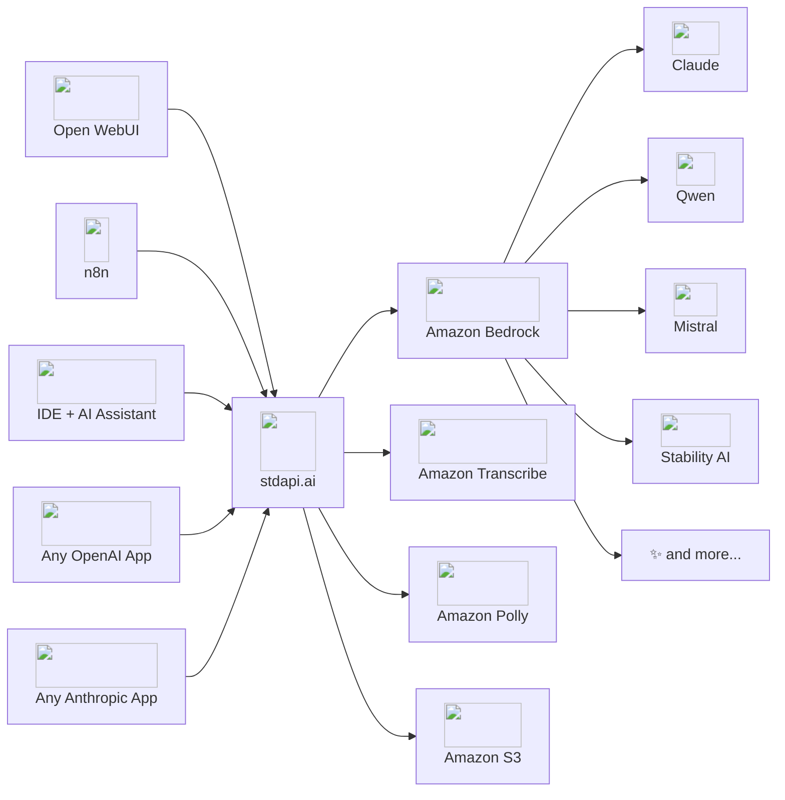

# :material-check-all: Features — AI Gateway for Amazon Bedrock

stdapi.ai is an **AI gateway purpose-built for AWS**. It brings full OpenAI, Anthropic, and Cohere API compatibility to Amazon Bedrock and AWS AI services — so any tool, SDK, or application your team already uses connects instantly, without code changes.

<div class="grid cards" markdown>

- :material-api: **One URL change, 100+ models** — Drop in as an OpenAI, Anthropic, or Cohere replacement
- :material-aws: **Everything stays in your AWS account** — No third-party routing, no data sharing
- :material-shield-check: **Runs on AWS services in scope** for ISO, SOC, HIPAA, GDPR and FedRAMP
- :material-rocket-launch: **Production in minutes** — Terraform module on AWS Marketplace, 14-day free trial

</div>

---

## :material-sitemap: How It Works

stdapi.ai sits between your applications and AWS services, translating OpenAI, Anthropic, and Cohere API calls into native AWS requests. Any tool or SDK that speaks one of the three protocols connects instantly — no plugins, no custom integrations.


!!! note "Latency overhead"
    The gateway adds about a millisecond of processing to a typical chat request, and only a few milliseconds to the largest ones. End-to-end latency is dominated by Bedrock model inference time. Streaming responses are passed through immediately with no intermediate buffering.

---

## :material-scale-balance: Why stdapi.ai?

<div class="grid cards" markdown>

- :material-puzzle: **Complete API surface**
  <br>Chat completions are where most gateways stop. stdapi.ai reaches further, bringing the complete OpenAI, Anthropic, and Cohere surface to AWS: chat completions, the Responses API, embeddings, image generation and editing, video generation, text-to-speech, speech-to-text, translation, content moderation, reranking, and file storage — all through standard API calls, with no AWS-specific code in your application.

- :material-shield-lock: **Your data, your account**
  <br>stdapi.ai runs entirely within your own VPC — no traffic leaves your account. Amazon Bedrock never retains or trains on your prompts. The software supply chain is hardened end-to-end — distributed as a validated container image with no public package registry exposure.

- :material-chart-multiple: **Multiply your throughput**
  <br>Every AWS region has its own independent quota — add regions to multiply your tokens-per-minute, with fully automatic failover.

- :material-star-four-points: **Every Bedrock capability, zero custom code**
  <br>Prompt caching, extended thinking, guardrails, service tiers, cross-region inference profiles, system tools (Nova web grounding, code interpreter), SSML for speech synthesis — every Bedrock-native feature exposed through standard OpenAI and Anthropic APIs.

</div>

---

## :material-api: API Compatibility

Your existing applications, SDKs, and tools work immediately — no plugins or client changes needed.

### Supported Endpoints

**OpenAI-Compatible:**

| Endpoint                                       | Capability                                                              | AWS Backend                               |
|------------------------------------------------|-------------------------------------------------------------------------|-------------------------------------------|
| `/v1/chat/completions`                         | Conversational AI, tool calling, multi-modal                            | Amazon Bedrock Converse API · Bedrock Mantle |
| `/v1/completions`                              | Simple prompt-to-text                                                   | Amazon Bedrock Converse API · Bedrock Mantle |
| `/v1/responses`                                | Conversational AI with tool calling, streaming, and server-side storage | Amazon Bedrock Converse API · Bedrock Mantle |
| `/v1/responses/input_tokens`                   | Count input tokens without generating a response                        | Amazon Bedrock CountTokens API               |
| `/v1/responses/compact`                        | Compact a conversation into a reusable summary item                     | Amazon Bedrock Converse API                  |
| `/v1/responses/{id}`                           | Retrieve, continue (`previous_response_id`), or delete stored responses | Amazon Bedrock Sessions · Bedrock Mantle     |
| `/v1/chat/completions/{id}`                    | Retrieve, list, update, or delete stored chat completions               | Amazon Bedrock Sessions                      |
| [`/v1/conversations`](api_openai_conversations.md) | Server-side multi-turn state: conversation items, metadata, pagination | Amazon Bedrock Sessions                   |
| `/v1/embeddings`                               | Vector embeddings for search & RAG                                      | Amazon Bedrock Embedding Models              |
| [`/v1/moderations`](api_openai_moderations.md) | Content safety classification                                           | Amazon Bedrock Guardrails, Amazon Comprehend |
| `/v1/images/generations`                       | Text-to-image generation                                                | Amazon Bedrock Image Models                  |
| `/v1/images/edits`                             | Image editing, inpainting & transformations                             | Amazon Bedrock Image Models                  |
| `/v1/images/variations`                        | Image variations                                                        | Amazon Bedrock Image Models                  |
| [`/v1/videos`](api_openai_videos.md)           | Asynchronous text/image-to-video generation                             | Amazon Bedrock Video Models                  |
| `/v1/audio/speech`                             | Text-to-speech with SSML support                                        | Amazon Polly                              |
| `/v1/audio/transcriptions`                     | Speech-to-text with speaker diarization                                 | Amazon Transcribe, Amazon Nova Sonic      |
| `/v1/audio/translations`                       | Speech-to-English translation                                           | Amazon Transcribe + Amazon Translate, Amazon Nova Sonic |
| `/v1/models`                                   | Model discovery & listing                                               | Amazon Bedrock                               |
| `/v1/files`                                    | File upload, listing, metadata, download, deletion                      | Amazon S3                                 |
| `/v1/uploads`                                  | Multipart upload sessions for large files                               | Amazon S3                                 |
| [`/v1/vector_stores`](api_openai_vector_stores.md) | Managed semantic search over your own files                         | Amazon S3 Vectors, Amazon Bedrock embeddings |
| [`/v1/batches`](api_openai_batches.md)         | Asynchronous bulk inference at the discounted batch price               | Amazon Bedrock batch inference               |

**Anthropic-Compatible:**

| Endpoint                    | Capability                                         | AWS Backend                               |
|-----------------------------|----------------------------------------------------|-------------------------------------------|
| `/v1/messages`              | Conversational AI, tool calling, multi-modal       | Amazon Bedrock Converse API · Bedrock Mantle |
| `/v1/messages/count_tokens` | Count tokens without sending a message             | Amazon Bedrock CountTokens API               |
| `/v1/models`                | Model discovery & listing                          | Amazon Bedrock                               |
| `/v1/models/{model_id}`     | Model details                                      | Amazon Bedrock                               |
| `/v1/files`                 | File upload, listing, metadata, download, deletion | Amazon S3                                 |
| [`/v1/messages/batches`](api_anthropic_batches.md) | Asynchronous bulk messages at the discounted batch price | Amazon Bedrock batch inference   |

!!! note "Route prefix"
    Anthropic-compatible routes are prefixed with `/anthropic` by default (e.g., `/anthropic/v1/messages`). The prefix is configurable via `ANTHROPIC_ROUTES_PREFIX`.

**Cohere-Compatible:**

| Endpoint     | Capability                                   | AWS Backend                  |
|--------------|----------------------------------------------|------------------------------|
| [`/v2/rerank`](api_cohere_rerank.md) | Document reranking by relevance to a query   | Amazon Bedrock Rerank API       |
| [`/v1/rerank`](api_cohere_rerank.md#cohere-v1-rerank-api-legacy) | Legacy v1 document reranking                 | Amazon Bedrock Rerank API       |
| [`/v2/embed`](api_cohere_embed.md)  | Vector embeddings for search & RAG           | Amazon Bedrock Embedding Models |
| [`/v1/embed`](api_cohere_embed.md#cohere-v1-embed-api-legacy)  | Legacy v1 vector embeddings for search & RAG | Amazon Bedrock Embedding Models |

!!! note "Route prefix"
    Cohere-compatible routes are prefixed with `/cohere` by default (e.g., `/cohere/v2/rerank`). The prefix is configurable via `COHERE_ROUTES_PREFIX`.

**stdapi.ai Native:**

| Endpoint                     | Capability                                                                | AWS Backend                          |
|------------------------------|---------------------------------------------------------------------------|--------------------------------------|
| `/search_models`             | Search models by capability: modality, route, MCP tool, region, streaming | Internal                             |
| [`/model_pricing`](api_model_pricing.md) | Exact AWS unit prices per model: tokens, tiers, cache TTLs, routing, specs | AWS Price List                       |

### Parameter Coverage

stdapi.ai maps as many parameters as possible to Bedrock equivalents — across all routes, not just chat:

- **Generation controls** — `temperature`, `max_tokens`, `top_p`, `top_k`, `stop`, `seed`, `frequency_penalty`, `presence_penalty`, `logit_bias`, `top_logprobs`, streaming via SSE, token usage reporting
- **Reasoning** — `reasoning_effort` (none/minimal/low/medium/high/xhigh), `enable_thinking`, `thinking_budget`
- **Tool / function calling** — Full OpenAI and Anthropic schemas, parallel tool calls, tool choice modes
- **All content types** — System, developer, user, assistant, and tool roles; text, image, audio, video, and document content
- **Response formats** — JSON object, JSON schema, streaming chunks, `reasoning_content`, `annotations`
- **Model-specific extras** — Any parameter beyond the standard API via `extra_body` or top-level request fields

!!! note "Bedrock & model differences"
    Not every parameter maps identically across all models. Check the [API documentation](api_openai_chat_completions.md) for details.

---

## :material-brain: 100+ Models Across 10+ Providers

Access every model available on Amazon Bedrock through a single, consistent API — including OpenAI GPT, xAI Grok, and [other frontier models](#bedrock-mantle-models).

<div class="grid cards" markdown>

- { style="height: 1.2em; vertical-align: text-bottom;" } **Anthropic Claude**
  <br>Claude Fable/Mythos, Claude Opus, Claude Sonnet, Claude Haiku — including reasoning models. Use official Anthropic model names (e.g., `claude-fable-5`) — they resolve automatically.

- { style="height: 1.2em; vertical-align: text-bottom;" } **OpenAI GPT**
  <br>GPT frontier models plus open-weight gpt-oss.

- { style="height: 1.2em; vertical-align: text-bottom;" } **Google Gemma**
  <br>Gemma 4 and other Gemma open-weight variants.

- { style="height: 1.2em; vertical-align: text-bottom;" } **Amazon Nova**
  <br>Nova — including reasoning-capable variants. Canvas for images. Multimodal embeddings. Built-in web grounding and code interpreter.

- { style="height: 1.2em; vertical-align: text-bottom;" } **Meta Llama**
  <br>Llama Scout, Maverick, and earlier Llama variants.

- { style="height: 1.2em; vertical-align: text-bottom;" } **Alibaba Qwen**
  <br>Qwen and Qwen3 Coder — including thinking mode.

- { style="height: 1.2em; vertical-align: text-bottom;" } **DeepSeek**
  <br>Latest DeepSeek V3 models with automatic reasoning content surfacing.

- { style="height: 1.2em; vertical-align: text-bottom;" } **Moonshot Kimi**
  <br>Kimi with optional thinking mode.

- { style="height: 1.2em; vertical-align: text-bottom;" } **Mistral AI**
  <br>Mistral, Mixtral, and Mistral Large variants.

- { style="height: 1.2em; vertical-align: text-bottom;" } **Cohere**
  <br>Command models for chat; Embed v4 for multimodal embeddings.

- { style="height: 1.2em; vertical-align: text-bottom;" } **Stability AI**
  <br>Stable Diffusion 3.5, SD3 Ultra, and specialty models (upscale, style, search).

- { style="height: 1.2em; vertical-align: text-bottom;" } **MiniMax & more**
  <br>MiniMax, xAI Grok, Writer Palmyra, AI21 Jamba, TwelveLabs Marengo video embeddings, and others.

</div>

### Model Management

- **Automatic model discovery** — Scans configured regions at startup; no manual model list to maintain
- **Model aliases** — Map custom names to Bedrock model IDs; Claude and OpenAI names resolve automatically
- **Configured aliases** — An alias can also carry a [service tier, a guardrail, metadata and model parameters](operations_configuration.md#model-aliases-configuration), so one model is published under several names with different policies
- **Deprecated model failover** — Requests to retired models transparently redirect to their replacements
- **Legacy model filtering** — Optionally hide deprecated models from the models list

---

## :material-image-multiple: Multi-Modal Capabilities

### :material-chat: Text & Conversational AI

- All message roles: system, developer, user, assistant, tool
- Multi-turn conversations with full history
- Tool / function calling with parallel execution
- Structured JSON output (JSON object and JSON schema modes)
- Streaming via Server-Sent Events with real-time token delivery
- Reasoning content blocks (`thinking`, `reasoning_content`) for supported models
- Web search results as context (`search_result` content blocks)
- Image, document, audio and video attachments on multimodal models — see [Attachment Size](#attachment-size) for how large ones are carried

### :material-image: Images

**Generation** — Text-to-image with:

- Multiple output formats: PNG, JPEG, WebP with adjustable quality and compression
- Flexible sizes and aspect ratios
- Streaming generation with partial image previews
- Style presets (model-specific)

**Editing** — Inpainting and transformation:

- Mask-based inpainting (define edit regions precisely)
- Image-to-image transformation (style, structure conditioning)
- Background removal, object search & replace, object recolor
- Creative and conservative upscaling

**Variations** — Create alternative versions of existing images

**JSON body format** — Reference images via Files API `file_id` or URL instead of re-uploading

### :material-microphone: Audio

**Text-to-Speech (Amazon Polly):**

- 60+ voices across 30+ languages
- Multiple engine tiers: Standard, Neural, Long-Form, Generative
- SSML support — control pronunciation, emphasis, pauses, prosody
- Output formats: MP3, PCM, Opus, AAC, FLAC, OGG Vorbis
- Speed control (0.2× to 2.0×)
- Automatic language detection via Amazon Comprehend
- Long input — up to 100,000 characters per request, 24× OpenAI's limit ([20,000 with a generative voice, which speaks it as the audio is delivered; an S3 bucket beyond that](api_openai_audio_speech.md#long-input))

**Speech-to-Text (Amazon Transcribe):**

- 100+ languages
- Speaker diarization — automatic speaker separation and labeling
- Word-level and segment-level timestamps
- Subtitle export: SRT and VTT formats
- Vocabulary customization and custom language models
- Automatic language detection

**Speech Translation** — Transcribe audio and translate to English in a single request

**Speech-to-Text (Amazon Nova Sonic)** — an alternative backend on both audio routes, selected by naming `amazon.nova-2-sonic-v1:0`:

- The lowest transcription cost available here, about $0.006 per minute of audio at current Amazon Bedrock rates
- Punctuated transcripts in the language that was spoken, with automatic language detection
- Translation to English produced by the model itself, in one request
- `json` and `text` output only, up to 10 minutes of audio per request — no timestamps, subtitles or diarization, and no detected-language reporting

### :material-file-document: Documents & Files

- PDF input with optional citation support (precise source references in responses)
- Plain text and structured content blocks as context
- File storage via the Files API — upload once, reference by ID across multiple requests
- Multipart uploads for large files via the Uploads API (S3 native multipart)
- File expiry with configurable TTL (1 hour – 30 days)
- Large PDFs and other documents are carried by reference where the model supports it — see [Attachment Size](#attachment-size)

### :material-video: Video

- Text-to-video and image-to-video generation (Amazon Nova Reel, Luma Ray 2) via the OpenAI Videos API
- Asynchronous job workflow — create, list, poll, download, delete — with stateless job tracking
- Video input in chat completions for supported models (e.g., Amazon Nova) — long clips follow the [Attachment Size](#attachment-size) policy
- S3 URLs as direct video input for multimodal embeddings

### :material-paperclip: Attachment Size

On chat completions, messages and responses served by Amazon Bedrock (Bedrock Mantle models excepted), every attachment — an image, document, audio or video sent as base64, a data URI, an HTTPS URL, an `s3://` URI or a Files API ID — is measured before the request is built, and the way it reaches the model is chosen from that size:

| Attachment size                          | How it is sent                                                                   |
|------------------------------------------|----------------------------------------------------------------------------------|
| Within the model's inline capacity       | Embedded in the request                                                          |
| Above it, model reads that kind of attachment from storage | Staged in your S3 bucket and referenced; the request is answered normally |
| Above it, model reads it inline only     | Refused with `413`, stating the size that model accepts                          |

Two limits apply: the largest single attachment, and the largest total of attachments in one request. Models differ in both, and in which kinds they read from storage, so the same attachment can be inline for one model and staged for another; nothing in the request changes either way. The Amazon Nova families read images, documents and video from storage and TwelveLabs Pegasus reads video, while every other model reads its attachments from inside the request.

An attachment already in S3 — an `s3://` URI, or a Files API ID sent in a `file_id` field — skips the measurement on a model that reads that kind from storage: it is referenced as it stands, whatever its size. Every other attachment is measured, including one referenced through the `file-id:` URI scheme: above the model's inline capacity it is staged and referenced when the model reads that kind from storage, and refused with `413` when the model reads that kind inline only.

Staging needs an [S3 bucket for the region serving the request](operations_configuration.md#aws-s3-regional-buckets), and a request whose attachment was staged is served by that one region rather than failing over to another — exactly like a request that names an `s3://` input itself.

Measurement uses the size the source declares — the payload length, or the `Content-Length` of an HTTPS URL; a URL that declares none is sent inline whatever its real size. [`MAX_INPUT_FILE_SIZE`](operations_configuration.md#max-input-file-size) caps every attachment read or staged for a model, inline or not.

Bedrock Mantle-served models, image editing and variations, transcription and the embeddings routes keep their own input handling and are not covered by this policy.

### :material-vector-polyline: Embeddings

- Text embeddings — single and batch processing
- Multimodal embeddings — images, audio, video, PDF documents
- Dimension control (model-specific reduction)
- Float or Base64 output encoding
- S3 URL input for large files; oversized base64 payloads auto-uploaded to S3

---

## :material-aws: Purpose-Built for AWS

### Multi-Region Routing & Quota Headroom

Configure multiple AWS regions to draw on more than one Bedrock quota and to keep serving when one region is degraded:

| Routing Strategy    | Description                             | Prompt Caching |
|---------------------|-----------------------------------------|----------------|
| `ordered` (default) | Try regions in order; skip blocked ones | ✓ Compatible   |
| `lowest_latency`    | Prefer fastest measured region          | ✓ Compatible   |
| `round_robin`       | Distribute evenly across regions        | <span class="m-n" aria-hidden="true">—</span><span class="sr-only">not compatible</span> |
| `disabled`          | Single region per model                 | ✓ Compatible   |

- **Each region adds its own quota** — Bedrock tokens-per-minute and requests-per-minute limits are per region, so a multi-region deployment draws on several independent quotas rather than one. How much of that headroom a workload reaches depends on the quota granted per model in each region and on the routing strategy
- **Regional retry** — eligible failures switch region transparently on throttle, quota, or service errors. Streaming responses can only retry before the stream opens, and asynchronous jobs stay in the region that accepted them
- **Exponential backoff** — doubles per consecutive error, capped at 1 hour
- **Region health tracking** — per-model health status with configurable recovery delays

[:octicons-arrow-right-24: Resilience & Failover](operations_resilience.md)

### Advanced Bedrock Features

| Feature                            | Description                                                                                                            |
|------------------------------------|------------------------------------------------------------------------------------------------------------------------|
| **Prompt Caching**                 | Cache system prompts, messages, and tools; granular section control; configurable TTL; cache metrics in every response |
| **Reasoning Modes**                | Extended thinking with effort levels (minimal → xhigh) for Claude and Nova; `thinking_budget` for token-level control  |
| **Bedrock Guardrails**             | Content filtering and safety policies with configurable trace levels                                                   |
| **Service Tiers**                  | Priority, default, flex, and reserved tiers per request with customizable defaults per model                           |
| **Application Inference Profiles** | Custom profiles for workload isolation and cost attribution                                                            |
| **Prompt Routers**                 | Bedrock prompt routers for intelligent model selection                                                                 |
| **Cross-Region Inference**         | Geography-pinned (US, EU, APAC) and global profiles with data residency control                                        |
| **System Tools (Nova)**            | Web grounding with URL citations; code interpreter                                                                     |
| **Web Search (OpenAI GPT)**        | Built-in web search with source citations on `/v1/responses`, billed per query                                          |
| **Claude Server Tools**            | Bash, text editor, computer use (Claude 3.5+), memory (Claude 3.7+)                                                    |
| **Extra Model Parameters**         | Any model-specific parameter forwarded via `extra_body` or top-level field                                             |

### :material-layers-triple: Bedrock Mantle Models { #bedrock-mantle-models }

stdapi.ai serves models from the **Amazon Bedrock Mantle** endpoint alongside the classic Bedrock catalog: OpenAI GPT, xAI Grok, Google Gemma, Qwen, GLM, DeepSeek, MiniMax, Kimi, Nemotron, and more — the available catalog varies per region and grows over time.

- **Every text API, every model** — All four text APIs (chat completions, responses, messages, legacy completions) work with every Mantle model: served natively (passthrough) when the model supports the API upstream, converted automatically otherwise, with an automatic fallback order (responses → chat completions → messages) learned at runtime
- **Predictable routing** — Models available on both the classic endpoint and Mantle are served by the classic endpoint by default; Mantle serves Mantle-only models. Dual-homed models can be routed through Mantle globally or per request (`x-stdapi-service: bedrock-mantle` header) to tap Mantle's separate throughput quotas
- **Region failover** — Region failover and quota backoff work exactly like classic Bedrock region routing; requests chained via `previous_response_id` are pinned to their origin region
- **No static secrets** — Mantle access uses the same AWS credential chain as the rest of the server; there is no separate API key to issue, store or rotate
- **Native stored conversations** — `/v1/responses` with `store`, `previous_response_id`, and `GET`/`DELETE /v1/responses/{id}` use Mantle's native server-side storage: 30-day retention, region-local, project-scoped
- **Usage & billing** — Token usage (including cached tokens and standard/flex/priority service tiers) is recorded and priced at bedrock-mantle rates, like all other models; built-in web search queries are recorded and priced beside them
- **Built-in web search** — The OpenAI GPT-5.x family grounds answers in current web content with source citations on `/v1/responses`, inside the AWS boundary by default

Enabled by default; regions, routing preferences, the per-request Mantle routing header, and required IAM permissions are covered in the [Bedrock Mantle configuration](operations_configuration.md#bedrock-mantle-enabled) and [IAM](operations_configuration.md#bedrock-mantle-iam) sections — without the required permissions, Mantle models are simply not listed and a warning is logged at startup.

| Model Family                                    | Native Mantle APIs           |
|-------------------------------------------------|------------------------------|
| **OpenAI GPT** (frontier models)                | Responses                    |
| **Anthropic Claude**                            | Messages                     |
| **xAI Grok · OpenAI gpt-oss · Google Gemma 4**  | Chat Completions + Responses |
| **Other open-weight models** (Gemma, Qwen, GLM, Mistral, DeepSeek, MiniMax, Kimi, Nemotron, Palmyra) | Chat Completions             |

!!! note "Limitations & conversion details"
    Bedrock Guardrails and cross-region inference profiles do not apply to Mantle-served requests, and the built-in [`web_search` tool](api_openai_responses.md#openai-gpt-web-search) is served on `/v1/responses` only. API-shape conversion preserves the core request semantics (messages, tools, sampling, streaming, usage); parameters with no equivalent in the serving API are dropped or adapted. The exact parameter tables, response-ID specifics, and per-route limitations are on the API pages: [chat completions](api_openai_chat_completions.md#bedrock-mantle), [responses](api_openai_responses.md#model-support), [messages](api_anthropic_messages.md#bedrock-mantle), and [legacy completions](api_openai_completions.md#feature-compatibility).

[:octicons-arrow-right-24: Bedrock Mantle Configuration](operations_configuration.md#bedrock-mantle-enabled)

### AWS AI Services Integration

| Service               | Capability                                                          |
|-----------------------|---------------------------------------------------------------------|
| **Amazon Polly**      | 60+ voices, 30+ languages, SSML, multiple engines and audio formats |
| **Amazon Transcribe** | 100+ languages, speaker diarization, timestamps, SRT/VTT subtitles  |
| **Amazon Nova Sonic** | Low-cost multilingual transcription and speech-to-English translation |
| **Amazon Translate**  | Language translation for audio translation workflows                |
| **Amazon Comprehend** | Automatic language detection for intelligent voice routing          |

### Amazon S3 Integration

S3 is woven into the entire API surface — not just file storage:

- **Vector Stores API** — Managed semantic search at `/v1/vector_stores`: attach a text file, it is chunked, embedded and indexed in the background, then searched by meaning with attribute filters and per-passage scores
- **Files API** — Full CRUD at `/v1/files` with no artificial size limit (up to S3's ~5 TB), optional expiry, S3 Lifecycle backstop; file IDs work across both OpenAI and Anthropic endpoints
- **Multipart uploads** — `/v1/uploads` backed by S3 native multipart; stream large files without buffering
- **Direct `s3://` image references** — Use `s3://bucket/key` in chat completions and Anthropic Messages; the gateway reads from S3 via IAM role — no pre-signed URLs
- **Files API in image operations** — Reference uploaded files by `file_id` in image edits and variations
- **Multimodal embeddings** — Pass `s3://` URLs directly; oversized base64 payloads auto-uploaded and invoked asynchronously
- **Large attachments** — An attachment past what a model reads inline is staged in S3 automatically and referenced, wherever the model reads that kind from storage, so a request that would otherwise be refused is answered unchanged
- **Regional buckets** — One bucket per Bedrock region; S3 region routing is automatic
- **Transfer Acceleration** — Faster downloads via generated HTTP links

---

## :material-shield-lock: Security & Compliance

### Authentication

stdapi.ai supports multiple authentication strategies to fit your architecture:

| Method                    | How                                                                                                                | Best For                     |
|---------------------------|--------------------------------------------------------------------------------------------------------------------|------------------------------|
| **API Key**               | `Authorization: Bearer` or `X-API-Key` header; stored in SSM Parameter Store or Secrets Manager (never plain text) | Direct clients, SDKs         |
| **Cognito user pool JWT** | `Authorization: Bearer` with an Amazon Cognito access token, validated per request                                 | Per-user access, agents      |
| **OIDC / Cognito**        | Delegate to AWS Application Load Balancer or API Gateway                                                           | Web apps, SSO                |
| **AWS IAM (SigV4)**       | Via API Gateway with IAM authorization                                                                             | Internal AWS services        |
| **No authentication**     | Open access                                                                                                        | Private VPC deployments      |

[:octicons-arrow-right-24: Authentication & Security](operations_authentication_security.md)

### Security Features

| Feature                               | Description                                                                                                                                         |
|---------------------------------------|-----------------------------------------------------------------------------------------------------------------------------------------------------|
| **Industry-Standard API Key Hashing** | API keys hashed with a cryptographic function + per-key salt; constant-time comparison prevents timing attacks; only the hash is retained in memory |
| **SSRF Protection**                   | Blocks loopback, link-local, private network addresses, and DNS rebinding attacks                                                                   |
| **Trusted Hosts**                     | Restrict which hostnames the service responds to                                                                                                    |
| **CORS Controls**                     | Configurable cross-origin resource sharing policies                                                                                                 |
| **CSRF Protection**                   | Built-in cross-site request forgery protection                                                                                                      |
| **Input Validation**                  | Configurable strict mode — rejects malformed or out-of-spec requests at the gateway edge                                                            |
| **Proxy Header Handling**             | Secure forwarded header processing for ALB and CloudFront                                                                                           |
| **TLS 1.2+ in transit**               | All AWS service calls encrypted; the Terraform module configures ALB with TLS 1.3 and post-quantum hybrid key exchange                              |

!!! success "Commercial: Hardened Container Image :material-arrow-right: [AWS Marketplace](https://aws.amazon.com/marketplace/pp/prodview-su2dajk5zawpo)"
    The commercial image is security-validated by AWS Marketplace and includes: **read-only root filesystem**, **dropped Linux capabilities**, minimal installed packages, and no shell. The Terraform module also configures a **Customer Managed KMS key** (auto-rotation enabled) for all data at rest.

!!! success "Commercial: Security Hub Validated by Default"
    The Terraform module is built against the **AWS Security Hub Foundational Security Best Practices (FSBP)** standard and passes a large share of applicable controls out of the box — no extra configuration required. Opt-in variables add native **GuardDuty Runtime Monitoring** and **Route 53 Resolver DNS Firewall** (blocks outbound DNS resolution of known-malicious domains) on the module's dedicated VPC.

    [:octicons-arrow-right-24: AWS Security Hub, GuardDuty & DNS Firewall Integration](operations_authentication_security.md#aws-security-hub-guardduty-dns-firewall-integration)

### Compliance & Data Sovereignty

AWS service calls are restricted to the regions you configure. The AWS services used by stdapi.ai (Bedrock, S3, Polly, Transcribe, and more) are in scope for **GDPR**, **ISO 27001/27017/27018**, **SOC 1/2/3**, **HIPAA**, **FedRAMP**, **PCI-DSS**, and **CSA STAR Level 2** — these certifications apply to the AWS services and regions you choose, and are not inherited by stdapi.ai or by your application. The commercial Terraform module adds VPC endpoints (no internet egress), Customer Managed KMS keys, and region-pinned cross-region profiles for strict data residency.

[:octicons-arrow-right-24: Data Sovereignty & Compliance](operations_compliance.md)

---

## :material-puzzle: Works with Your Existing Tools

stdapi.ai is a drop-in replacement in hundreds of applications and tools. Change the API endpoint — nothing else.

<div class="grid cards" markdown>

- :material-chat: **Chat Interfaces**
  <br>Open WebUI, LobeHub, AnythingLLM, LibreChat — private ChatGPT-style experiences on AWS

- :material-code-braces: **AI Coding Assistants**
  <br>Claude Code, Cline, OpenCode, Pi Agent, Zed — backed by Claude, Kimi, Qwen3 Coder

- :material-graph-outline: **Workflow Automation**
  <br>n8n, Langflow, Dify, Flowise — connect AI to your business processes

- :material-robot: **Agent Frameworks**
  <br>OpenClaw, Hermes Agent, LangChain, LangGraph, CrewAI, OpenAI Agents SDK, Pydantic AI, Strands Agents — multi-agent systems on Bedrock

- :material-microphone-message: **Voice & Audio**
  <br>Pipecat, LiveKit Agents, TEN Framework, Home Assistant — voice agents with speech, transcription, and translation

- :material-magnify: **RAG & Semantic Search**
  <br>LlamaIndex, Haystack, RAGFlow, Docling, LightRAG — embeddings and Cohere-compatible reranking

- :material-forum: **Team Chatbots**
  <br>Slack, Discord, Microsoft Teams — AI assistants in your team's communication tools

- :material-note-text: **Knowledge Management**
  <br>Obsidian Copilot, Khoj, SiYuan — AI-powered writing assistance and search

</div>

[:octicons-arrow-right-24: See all use cases](use_cases.md)

---

## :material-robot: AI Agents

### Agent Discovery

AI agents can automatically discover the API's capabilities through standardized RFC 8288 Link headers and an API catalog:

- **Link headers** — Root endpoint (`/`) includes `Link` response headers advertising available resources (`rel="service-desc"`, `rel="service-doc"`) when documentation endpoints are enabled, `rel="mcp-server-card"` when MCP is enabled, and the protected resource metadata when authentication discovery is configured
- **API catalog** at `/.well-known/api-catalog` — RFC 9727 machine-readable catalog (RFC 9264 Linkset format) listing the OpenAPI schema, documentation, MCP server card, and protected resource metadata
- **MCP server card** at `/.well-known/mcp/server-card.json` — SEP-1649 server card advertising available MCP transports and capabilities; active when MCP is enabled
- **Protected resource metadata** at `/.well-known/oauth-protected-resource` — RFC 9728 document naming the authorization servers that issue tokens for this deployment and the scopes those tokens need, so an agent can authenticate itself; its address is also carried by the `WWW-Authenticate` challenge on every `401`. Active once [`OAUTH_RESOURCE_IDENTIFIER`](operations_configuration.md#oauth-resource-identifier) is set — see [Authentication Discovery for Agents](operations_authentication_security.md#authentication-discovery-for-agents)

Set `ENABLE_OPENAPI_JSON=true` to activate schema-based agent discovery — this exposes the machine-readable OpenAPI schema at `/openapi.json` and populates the Link headers and API catalog. `ENABLE_DOCS` and `ENABLE_REDOC` also enable it as a side effect, but those UIs are human-facing and not needed by agents.

### MCP (Model Context Protocol)

stdapi.ai exposes its full API surface as MCP tools, letting AI agents and orchestrators call any endpoint directly through the Model Context Protocol — no HTTP client code required.

- **Streamable HTTP transport** — The recommended method, implementing the latest MCP Streamable HTTP specification at `/mcp`
- **SSE transport** — Available at `/sse` for backwards compatibility with older MCP clients
- **All endpoints as tools** — Every API operation (chat, images, audio, files, models) is surfaced as a named MCP tool with generated documentation
- **Selective exposure** — Include or exclude tools by name to limit scope and reduce agent confusion
- **Context-optimized tools** — Tool schemas hide parameters MCP clients cannot use (streaming modes, token-level tuning, caller identifiers), and tool results are returned as compact JSON, cutting the tokens each call costs the calling agent
- **Automatic timeout alignment** — MCP calls respect the global `AI_RESPONSE_TIMEOUT` setting

```bash
# Enable MCP via HTTP (recommended)
export ENABLE_MCP_STREAMABLE_HTTP=true

# Restrict to safe, read-oriented tools
export MCP_EXCLUDE_TOOLS="openai_files_delete,anthropic_files_delete"
```

**Example use cases:**

<div class="grid cards" markdown>

- :material-robot: **AI coding assistants**
  <br>Connect Claude Code, Cline, or OpenCode directly to stdapi.ai via MCP. Agents can generate text, search models, and manage files without any custom integration code.

- :material-flask: **Agentic pipelines**
  <br>Let orchestration frameworks (LangChain, LlamaIndex, CrewAI) discover and call Bedrock models dynamically. Include `search_models` so agents can find the right model ID, and `openai_chat_completion` for inference — keep the tool surface minimal.

- :material-image-multiple: **Multimodal automation**
  <br>Give an agent access to `openai_chat_completion`, `openai_image_generation`, and `openai_audio_speech` to build self-contained pipelines that generate text, images, and audio in a single session.

- :material-database-search: **RAG pipelines**
  <br>Expose `openai_embedding` and file management tools so agents can index documents, compute embeddings, and retrieve context autonomously — all backed by S3 and Bedrock.

</div>

[:octicons-arrow-right-24: MCP Configuration](operations_configuration.md#mcp-model-context-protocol)

---

## :material-chart-line: Observability & Operations

### Structured Logging

- JSON logs to stdout — natively ingested by CloudWatch Logs
- Every request logs: method, path, status, model ID, region(s) used, execution time
- Optional: full request/response payloads, client IP (disabled by default)
- Configurable log levels (info, warning, error, critical, disabled)

### OpenTelemetry Integration

- Export traces and metrics to AWS X-Ray, Datadog, Jaeger, or any OTLP-compatible backend
- Configurable sampling rate
- Root span per request with full correlation IDs

### Token Usage Tracking

- Input, output, reasoning, and cached token counts in every API response
- Consistent reporting across all endpoints (chat, messages, embeddings, images, audio)

### Cost Tracking

- **Usage counts read back from AWS** — Token, character, second, and image counts come from the AWS responses themselves rather than from client-side counting; recorded per request across chat, embeddings, images, audio, and built-in tools
- **Priced from the published AWS Price List** — Costs computed from AWS's own price list, refreshed automatically; no manual price list to maintain (operator overrides available for gaps)
- **Priced on the dimensions AWS bills on** — Each call is priced with everything AWS prices differently: serving region, service tier (standard/flex/priority/batch, using the tier that *actually served* the call), prompt-cache TTLs, cross-region and latency-optimized routing, long-context rates, and image resolution/quality
- **Per-request and aggregate cost** — Request log entries carry cost and currency as exact decimal strings, with a per-request total rollup
- **Multi-currency aware** — Detects your AWS partition's currency (USD, EUR, CNY) and never sums costs across currencies
- **Model Pricing API** — Query the loaded catalog through [`GET /model_pricing`](api_model_pricing.md) for cost-aware model selection, also exposed as an MCP tool
- **Optional CloudWatch cost metrics** — Track spend alongside your other operational metrics via EMF

!!! note "Opt-in, and an estimate — not a bill"
    Cost tracking is disabled by default (it needs the `pricing:GetProducts` IAM permission); enable it with `COST_TRACKING=true`. Costs are a best-effort approximation for visibility and alerting, not a substitute for your AWS invoice — see [Cost Tracking](operations_cost_management.md#cost-tracking-real-time-aws-pricing) for accuracy details and known limitations.

### Per-User Cost Attribution

- **Each end user on the AWS bill** — Model calls optionally run under a short-lived role session opened for the user behind the request, so AWS reports their spend separately in Cost Explorer and CUR 2.0 — from the invoice, not from an estimate
- **The identity the gateway verified** — The authenticated caller when authentication is enabled, otherwise the identifier the request declares (`safety_identifier`/`user`, or `metadata.user_id` on the Anthropic Messages API)
- **A cost allocation dimension, and an access boundary** — The identity travels as a session tag, groupable in Cost Explorer and testable in IAM policies as `aws:PrincipalTag`
- **Sessions cached and reused** — One session per user, refreshed before it expires, bounded in number; a burst of first requests opens a single session
- **Fail-closed** — A session that cannot be opened fails the request instead of quietly billing the gateway, and requests identifying no user can be rejected outright

!!! note "Off by default, and it needs a role"
    Enable it with `AWS_BEDROCK_USER_ROLE_ARN`, pointing at a role you create — see [Per-User Attribution](operations_cost_management.md#per-user-attribution). It covers model invocations; the rest of the gateway's AWS usage stays on its own identity.

### Developer Tools

- **Swagger UI** at `/docs` — test endpoints directly in your browser
- **ReDoc** at `/redoc` — clean, searchable API reference
- **OpenAPI schema** at `/openapi.json` — import into Postman, generate client code

### Quality of Life

- **Model list caching** — Fast model listing without repeated AWS API calls
- **Safety identifier** — `safety_identifier` field in requests as an alias to `user` for abuse tracking and audit trails
- **Zero-configuration startup** — Automatic region and model detection; warnings on missing config

---

## :material-speedometer: Performance

A gateway earns its place by adding as little as possible on top of the model call. Every hot path here follows two principles: run independent work at the same time, and touch each byte once, in native code.

- **Parallel where it counts** — Independent work fans out concurrently; a request finishes with its slowest item, not the sum of them
- **Native code end to end** — JSON encoding and decoding, the AWS wire format, and the HTTP serving stack all run compiled, on an optimized event loop
- **Every byte touched once** — Requests are parsed and validated once, responses encoded once, payloads moved without redundant copies — no duplicate work between layers or toward AWS

Measured on the production serving stack, single worker, over the complete request path:

| Request shape | Gateway CPU per request |
|---|---|
| Typical chat request (2.5 KB) | **0.8 ms** |
| Large context (1 MB body) | **4.6 ms** |
| Large context, streamed (~100 events) | **8.6 ms** |

Typical requests are dominated by the fixed sub-millisecond serving floor; the optimizations above pay off precisely where load does — large contexts and streaming.

!!! note "Negligible next to the model call"
    Even at its most expensive — a 1 MB request — the gateway's processing adds a few milliseconds to an invocation the model itself takes seconds to answer: well under 1% of end-to-end latency. Measured live, a typical chat completion spends about a millisecond in the gateway out of a several-hundred-millisecond round trip — a share that holds even with the server capped to 0.25 vCPU, the smallest Fargate task size.

---

## :material-clipboard-check: Quality Assurance

"OpenAI-compatible" is easy to claim and hard to keep. The gateway sits between your application and a set of backends that change underneath it — new model generations, new parameters, silently altered behaviour — so its test suite is built to catch that drift before you do.

<div class="grid cards" markdown>

- :material-test-tube: __5,000+ automated tests__
  <br>Run against real AWS services rather than mocks.

- :material-shield-check: __Branch coverage, every test tier enabled__
  <br>Tracked continuously, from fast contract checks to full release validation against a live deployment.

- :material-account-check: __Validated against the vendors__
  <br>The same tests run against the real OpenAI, Anthropic and Cohere APIs.

- :material-robot-happy: __Driven by real client software__
  <br>Twelve third-party clients — Claude Code, n8n, Open WebUI and more — driven end to end against a live gateway.

</div>

### Compatibility is proven against the real APIs, not against our own docs

A gateway tested only against itself proves only that it is self-consistent. The suite runs **the same test bodies against the genuine OpenAI, Anthropic and Cohere endpoints**, changing nothing but the URL. A test that passes here and fails there is treated as a compatibility bug in this product — not as an acceptable difference.

That distinction is enforced when a test is written, before the feature exists: the expected behaviour is captured from the vendor's own API first, so the implementation is written to match a contract that was verified, not assumed.

### Real applications, not just API calls

Passing an HTTP test says nothing about whether a real coding agent, chatbot or automation platform actually works. So the suite runs them: **complete third-party client software, unmodified, against a live gateway** — coding agents (Claude Code, Codex, pi, OpenClaw, Hermes, Qwen Code), the n8n workflow runner, a Haystack RAG pipeline, the Open WebUI chat interface, Home Assistant's voice bridge, and the LangChain and pydantic-ai Python libraries — driving multi-turn tool-calling sessions, document retrieval and reranking, and speech pipelines across dozens of models and all three API dialects. A regression that only appears in a real client is caught here, not by you.

### Every model is measured, not assumed

Model documentation describes what a model is supposed to accept. What it actually accepts is something else, and it changes between generations of the same model family. Each supported model is **probed empirically** for the parameters and features it genuinely honours — including the parameters it accepts and then quietly ignores, which are the ones that silently produce a wrong answer. The results are recorded and the behaviour is pinned by tests.

### What runs, and when

| | Runs | Covers |
|---|---|---|
| **Fast checks** | Every change | Request/response contracts, validation, error mapping — no cloud calls |
| **Full AWS suite** | Every change to affected areas | All endpoints against live AWS services and models |
| **Vendor compatibility** | Regularly | Parity against the upstream vendor APIs, URL swapped only |
| **Real client applications** | Regularly | Third-party AI clients driving the gateway end to end |
| **Release validation** | **Every release** | The complete suite, twice: locally, then against a deployed release candidate |

No release ships without the full suite passing against a real deployment of the exact build being released.

### Beyond automated tests

- **Static analysis and strict typing** on every line of source and test code
- **Documented behaviour is tested behaviour** — the compatibility tables on these pages are derived from what the tests assert, so a change in behaviour that the docs do not reflect fails the build
- **Continuous review** — periodic audits of the codebase and of the test suite itself, because a passing test that asserts nothing is worse than no test
- **Security scanning** of dependencies and container images, with the commercial image validated against AWS Security Hub's Foundational Security Best Practices

!!! tip "Found something anyway?"
    No suite catches everything. If you hit a compatibility difference between stdapi.ai and the API it mirrors, open an issue on [GitHub](https://github.com/stdapi-ai/stdapi.ai/issues) — or [email us](contact.md) if you would rather not report it publicly. That class of bug is treated as a defect, not as expected behaviour.

---

## :material-rocket-launch: Deployment

### Community vs Commercial

|                               | :material-docker: **Community**                         | :material-aws: **Commercial**                                                                     |
|-------------------------------|---------------------------------------------------------|---------------------------------------------------------------------------------------------------|
| **Price**                     | Free                                                    | $0.10/container-hour - With 14-day free trial                                                     |
| **License**                   | AGPL-3.0                                                | AWS Marketplace SCMP                                                                              |
| **API compatibility**         | <span class="m-y" aria-hidden="true">✓</span> Full                   | <span class="m-y" aria-hidden="true">✓</span> Full                                                             |
| **Container image**           | <span class="m-p" aria-hidden="true">◐</span> Community (GHCR)      | <span class="m-y" aria-hidden="true">✓</span> Hardened, AWS Marketplace validated                              |
| **Deployment**                | <span class="m-p" aria-hidden="true">◐</span> Docker / self-managed | <span class="m-y" aria-hidden="true">✓</span> Terraform module (ECS Fargate) - AWS Marketplace container image |
| **Production infrastructure** | <span class="m-n" aria-hidden="true">—</span><span class="sr-only">not available</span> | <span class="m-y" aria-hidden="true">✓</span> Fully featured - AWS Well-Architected - Hardened                 |
| **Security posture**          | Manual (self-managed)                                   | <span class="m-y" aria-hidden="true">✓</span> Security Hub FSBP validated by default; GuardDuty & DNS Firewall integrations |
| **Commercial support**        | <span class="m-n" aria-hidden="true">—</span><span class="sr-only">not available</span> | <span class="m-y" aria-hidden="true">✓</span> 1 business day                                                   |

---

## :material-scale-balance: How stdapi.ai Compares

All four solutions below expose an OpenAI-compatible API in front of Amazon Bedrock. The comparison focuses on the AWS deployment context — LiteLLM is evaluated with AWS services as the backend provider (Bedrock, Polly, Transcribe), not as a multi-cloud proxy. Bedrock Access Gateway is the official AWS-maintained open-source sample. Bedrock Mantle is AWS's own managed OpenAI-compatible endpoint, requiring no self-hosting — and stdapi.ai can also front it as an additional backend, serving Mantle-only models through the gateway (see [Bedrock Mantle Models](#bedrock-mantle-models)).

Competitor capabilities were verified against official sources on 5 August 2026. stdapi.ai is AWS-only: if you need multi-cloud routing or spend limits enforced at request time, LiteLLM is the better fit.

!!! note "Cost attribution is not a spend limit"
    Bedrock's native attribution — IAM principal, application inference profiles, projects and workspaces — reports [aggregated billed cost to Cost Explorer and CUR 2.0 at per-usage-type-per-day granularity](https://docs.aws.amazon.com/bedrock/latest/userguide/cost-management.html), not as a per-request row. That is reporting, not enforcement: it cannot block a request that would exceed a budget. stdapi.ai's per-request cost figures are likewise an estimate for visibility. Enforcing a hard limit requires a gateway layer in front of inference — the approach AWS itself takes in its [Generative AI Gateway Solution](https://aws.amazon.com/solutions/), which uses LiteLLM.

| Capability                                  |              stdapi.ai              |            LiteLLM (on AWS)             |         Bedrock Access Gateway          |             Bedrock Mantle              |
|---------------------------------------------|:-----------------------------------:|:---------------------------------------:|:---------------------------------------:|:---------------------------------------:|
| **OpenAI Chat completions**                 | <span class="m-y" aria-hidden="true">✓</span><span class="sr-only">full</span> | <span class="m-y" aria-hidden="true">✓</span><span class="sr-only">full</span> | <span class="m-y" aria-hidden="true">✓</span><span class="sr-only">full</span> | <span class="m-p" aria-hidden="true">◐</span><span class="sr-only">partial</span> [^2] |
| **OpenAI Completions**                      | <span class="m-y" aria-hidden="true">✓</span><span class="sr-only">full</span> | <span class="m-y" aria-hidden="true">✓</span><span class="sr-only">full</span> | <span class="m-n" aria-hidden="true">—</span><span class="sr-only">not available</span> | <span class="m-n" aria-hidden="true">—</span><span class="sr-only">not available</span> |
| **OpenAI Embeddings**                       | <span class="m-y" aria-hidden="true">✓</span><span class="sr-only">full</span> | <span class="m-y" aria-hidden="true">✓</span><span class="sr-only">full</span> | <span class="m-y" aria-hidden="true">✓</span><span class="sr-only">full</span> | <span class="m-n" aria-hidden="true">—</span><span class="sr-only">not available</span> |
| **Anthropic Messages API**                  | <span class="m-y" aria-hidden="true">✓</span><span class="sr-only">full</span> | <span class="m-y" aria-hidden="true">✓</span><span class="sr-only">full</span> | <span class="m-n" aria-hidden="true">—</span><span class="sr-only">not available</span> | <span class="m-p" aria-hidden="true">◐</span><span class="sr-only">partial</span> [^14] |
| **OpenAI Responses API**                    | <span class="m-y" aria-hidden="true">✓</span><span class="sr-only">full</span> | <span class="m-p" aria-hidden="true">◐</span><span class="sr-only">partial</span> [^18] | <span class="m-n" aria-hidden="true">—</span><span class="sr-only">not available</span> | <span class="m-p" aria-hidden="true">◐</span><span class="sr-only">partial</span> [^2] |
| **OpenAI Image generation**                 | <span class="m-y" aria-hidden="true">✓</span><span class="sr-only">full</span> | <span class="m-y" aria-hidden="true">✓</span><span class="sr-only">full</span> | <span class="m-n" aria-hidden="true">—</span><span class="sr-only">not available</span> | <span class="m-n" aria-hidden="true">—</span><span class="sr-only">not available</span> |
| **OpenAI Image editing**                    | <span class="m-y" aria-hidden="true">✓</span><span class="sr-only">full</span> | <span class="m-n" aria-hidden="true">—</span><span class="sr-only">not available</span> | <span class="m-n" aria-hidden="true">—</span><span class="sr-only">not available</span> | <span class="m-n" aria-hidden="true">—</span><span class="sr-only">not available</span> |
| **OpenAI Image variations**                 | <span class="m-y" aria-hidden="true">✓</span><span class="sr-only">full</span> | <span class="m-n" aria-hidden="true">—</span><span class="sr-only">not available</span> | <span class="m-n" aria-hidden="true">—</span><span class="sr-only">not available</span> | <span class="m-n" aria-hidden="true">—</span><span class="sr-only">not available</span> |
| **OpenAI Videos API**                       | <span class="m-y" aria-hidden="true">✓</span><span class="sr-only">full</span> | <span class="m-n" aria-hidden="true">—</span><span class="sr-only">not available</span> | <span class="m-n" aria-hidden="true">—</span><span class="sr-only">not available</span> | <span class="m-n" aria-hidden="true">—</span><span class="sr-only">not available</span> |
| **OpenAI Moderations API**                  | <span class="m-y" aria-hidden="true">✓</span><span class="sr-only">full</span> | <span class="m-n" aria-hidden="true">—</span><span class="sr-only">not available</span> | <span class="m-n" aria-hidden="true">—</span><span class="sr-only">not available</span> | <span class="m-n" aria-hidden="true">—</span><span class="sr-only">not available</span> |
| **OpenAI TTS (speech)**                     | <span class="m-y" aria-hidden="true">✓</span><span class="sr-only">full</span> | <span class="m-p" aria-hidden="true">◐</span><span class="sr-only">partial</span> [^12] | <span class="m-n" aria-hidden="true">—</span><span class="sr-only">not available</span> | <span class="m-n" aria-hidden="true">—</span><span class="sr-only">not available</span> |
| **OpenAI STT (transcription)**              | <span class="m-y" aria-hidden="true">✓</span><span class="sr-only">full</span> | <span class="m-n" aria-hidden="true">—</span><span class="sr-only">not available</span> | <span class="m-n" aria-hidden="true">—</span><span class="sr-only">not available</span> | <span class="m-n" aria-hidden="true">—</span><span class="sr-only">not available</span> |
| **OpenAI Files & Uploads API**              | <span class="m-y" aria-hidden="true">✓</span><span class="sr-only">full</span> | <span class="m-n" aria-hidden="true">—</span><span class="sr-only">not available</span> | <span class="m-n" aria-hidden="true">—</span><span class="sr-only">not available</span> | <span class="m-n" aria-hidden="true">—</span><span class="sr-only">not available</span> |
| **Server-side stored conversations**        | <span class="m-y" aria-hidden="true">✓</span><span class="sr-only">full</span> | <span class="m-p" aria-hidden="true">◐</span><span class="sr-only">partial</span> [^17] | <span class="m-n" aria-hidden="true">—</span><span class="sr-only">not available</span> | <span class="m-y" aria-hidden="true">✓</span><span class="sr-only">full</span> |
| **OpenAI Realtime API**                     | <span class="m-n" aria-hidden="true">—</span><span class="sr-only">not available</span> | <span class="m-y" aria-hidden="true">✓</span><span class="sr-only">full</span> | <span class="m-n" aria-hidden="true">—</span><span class="sr-only">not available</span> | <span class="m-n" aria-hidden="true">—</span><span class="sr-only">not available</span> |
| **Cohere Rerank API**                       | <span class="m-y" aria-hidden="true">✓</span><span class="sr-only">full</span> | <span class="m-y" aria-hidden="true">✓</span><span class="sr-only">full</span> | <span class="m-n" aria-hidden="true">—</span><span class="sr-only">not available</span> | <span class="m-n" aria-hidden="true">—</span><span class="sr-only">not available</span> |
| **Cohere Embed API**                        | <span class="m-y" aria-hidden="true">✓</span><span class="sr-only">full</span> | <span class="m-n" aria-hidden="true">—</span><span class="sr-only">not available</span> | <span class="m-n" aria-hidden="true">—</span><span class="sr-only">not available</span> | <span class="m-n" aria-hidden="true">—</span><span class="sr-only">not available</span> |
| **Own AI &amp; media APIs as MCP tools**    | <span class="m-y" aria-hidden="true">✓</span><span class="sr-only">full</span> | <span class="m-p" aria-hidden="true">◐</span><span class="sr-only">partial</span> [^20] | <span class="m-n" aria-hidden="true">—</span><span class="sr-only">not available</span> | <span class="m-n" aria-hidden="true">—</span><span class="sr-only">not available</span> |
| **Bedrock Full model catalog**              | <span class="m-y" aria-hidden="true">✓</span><span class="sr-only">full</span> | <span class="m-p" aria-hidden="true">◐</span><span class="sr-only">partial</span> [^1] | <span class="m-p" aria-hidden="true">◐</span><span class="sr-only">partial</span> [^10] | <span class="m-p" aria-hidden="true">◐</span><span class="sr-only">partial</span> [^2] |
| **Unified Bedrock + Mantle catalog**        | <span class="m-y" aria-hidden="true">✓</span><span class="sr-only">full</span> | <span class="m-p" aria-hidden="true">◐</span><span class="sr-only">partial</span> [^15] | <span class="m-n" aria-hidden="true">—</span><span class="sr-only">not available</span> | <span class="m-n" aria-hidden="true">—</span><span class="sr-only">not available</span> |
| **Every model on every text API**           | <span class="m-y" aria-hidden="true">✓</span><span class="sr-only">full</span> | <span class="m-p" aria-hidden="true">◐</span><span class="sr-only">partial</span> [^16] | <span class="m-n" aria-hidden="true">—</span><span class="sr-only">not available</span> | <span class="m-n" aria-hidden="true">—</span><span class="sr-only">not available</span> |
| **Multimodal inputs**                       | text · image · audio · video · docs |           text · image · docs           |              text · image               |              text · image               |
| **Multi-region capacity combining**         | <span class="m-y" aria-hidden="true">✓</span><span class="sr-only">full</span> | <span class="m-p" aria-hidden="true">◐</span><span class="sr-only">partial</span> [^8] | <span class="m-n" aria-hidden="true">—</span><span class="sr-only">not available</span> | <span class="m-n" aria-hidden="true">—</span><span class="sr-only">not available</span> |
| **Bedrock Cross-region inference profiles** | <span class="m-y" aria-hidden="true">✓</span><span class="sr-only">full</span> | <span class="m-p" aria-hidden="true">◐</span><span class="sr-only">partial</span> [^13] | <span class="m-p" aria-hidden="true">◐</span><span class="sr-only">partial</span> [^13] | <span class="m-n" aria-hidden="true">—</span><span class="sr-only">not available</span> |
| **Bedrock system tools**                    | <span class="m-y" aria-hidden="true">✓</span><span class="sr-only">full</span> | <span class="m-n" aria-hidden="true">—</span><span class="sr-only">not available</span> | <span class="m-n" aria-hidden="true">—</span><span class="sr-only">not available</span> | <span class="m-n" aria-hidden="true">—</span><span class="sr-only">not available</span> |
| **Bedrock Guardrails**                      | <span class="m-y" aria-hidden="true">✓</span><span class="sr-only">full</span> | <span class="m-y" aria-hidden="true">✓</span><span class="sr-only">full</span> | <span class="m-n" aria-hidden="true">—</span><span class="sr-only">not available</span> | <span class="m-n" aria-hidden="true">—</span><span class="sr-only">not available</span> |
| **Bedrock Service tiers**                   | <span class="m-y" aria-hidden="true">✓</span><span class="sr-only">full</span> | <span class="m-y" aria-hidden="true">✓</span><span class="sr-only">full</span> | <span class="m-n" aria-hidden="true">—</span><span class="sr-only">not available</span> | <span class="m-y" aria-hidden="true">✓</span><span class="sr-only">full</span> |
| **Bedrock Application inference profiles**  | <span class="m-y" aria-hidden="true">✓</span><span class="sr-only">full</span> | <span class="m-y" aria-hidden="true">✓</span><span class="sr-only">full</span> | <span class="m-y" aria-hidden="true">✓</span><span class="sr-only">full</span> | <span class="m-n" aria-hidden="true">—</span><span class="sr-only">not available</span> [^19] |
| **Bedrock prompt routers**                  | <span class="m-y" aria-hidden="true">✓</span><span class="sr-only">full</span> | <span class="m-n" aria-hidden="true">—</span><span class="sr-only">not available</span> | <span class="m-n" aria-hidden="true">—</span><span class="sr-only">not available</span> | <span class="m-n" aria-hidden="true">—</span><span class="sr-only">not available</span> |
| **Bedrock Prompt caching & reasoning**      | <span class="m-y" aria-hidden="true">✓</span><span class="sr-only">full</span> | <span class="m-p" aria-hidden="true">◐</span><span class="sr-only">partial</span> [^6] | <span class="m-y" aria-hidden="true">✓</span><span class="sr-only">full</span> | <span class="m-p" aria-hidden="true">◐</span><span class="sr-only">partial</span> [^9] |
| **Runs in your AWS account**                | <span class="m-y" aria-hidden="true">✓</span><span class="sr-only">full</span> | <span class="m-y" aria-hidden="true">✓</span><span class="sr-only">full</span> | <span class="m-y" aria-hidden="true">✓</span><span class="sr-only">full</span> | <span class="m-n" aria-hidden="true">—</span><span class="sr-only">not available</span> |
| **Model auto-discovery**                    | <span class="m-y" aria-hidden="true">✓</span><span class="sr-only">full</span> | <span class="m-p" aria-hidden="true">◐</span><span class="sr-only">partial</span> [^1] | <span class="m-p" aria-hidden="true">◐</span><span class="sr-only">partial</span> [^7] | <span class="m-y" aria-hidden="true">✓</span><span class="sr-only">full</span> |
| **Deprecated model failover**               | <span class="m-y" aria-hidden="true">✓</span><span class="sr-only">full</span> | <span class="m-n" aria-hidden="true">—</span><span class="sr-only">not available</span> | <span class="m-n" aria-hidden="true">—</span><span class="sr-only">not available</span> | <span class="m-n" aria-hidden="true">—</span><span class="sr-only">not available</span> |
| **Cost & usage tracking**                   | <span class="m-y" aria-hidden="true">✓</span><span class="sr-only">full</span> | <span class="m-y" aria-hidden="true">✓</span><span class="sr-only">full</span> | <span class="m-n" aria-hidden="true">—</span><span class="sr-only">not available</span> | <span class="m-n" aria-hidden="true">—</span><span class="sr-only">not available</span> |
| **Ready-to-use deployment**                 | <span class="m-y" aria-hidden="true">✓</span><span class="sr-only">full</span> | <span class="m-n" aria-hidden="true">—</span><span class="sr-only">not available</span> | <span class="m-p" aria-hidden="true">◐</span><span class="sr-only">partial</span> [^3] | <span class="m-y" aria-hidden="true">✓</span><span class="sr-only">full</span> |
| **Commercial support**                      | <span class="m-y" aria-hidden="true">✓</span><span class="sr-only">full</span> | <span class="m-y" aria-hidden="true">✓</span><span class="sr-only">full</span> | <span class="m-n" aria-hidden="true">—</span><span class="sr-only">not available</span> | <span class="m-y" aria-hidden="true">✓</span><span class="sr-only">full</span> [^4] |
| **Self-hosted**                             | <span class="m-y" aria-hidden="true">✓</span><span class="sr-only">full</span> | <span class="m-y" aria-hidden="true">✓</span><span class="sr-only">full</span> | <span class="m-y" aria-hidden="true">✓</span><span class="sr-only">full</span> | <span class="m-n" aria-hidden="true">—</span><span class="sr-only">not available</span> |
| **AWS-native focus**                        | <span class="m-y" aria-hidden="true">✓</span><span class="sr-only">full</span> | <span class="m-p" aria-hidden="true">◐</span><span class="sr-only">partial</span> [^5] | <span class="m-y" aria-hidden="true">✓</span><span class="sr-only">full</span> | <span class="m-y" aria-hidden="true">✓</span><span class="sr-only">full</span> |
| **Multi-provider support**                  | <span class="m-n" aria-hidden="true">—</span><span class="sr-only">not available</span> | <span class="m-y" aria-hidden="true">✓</span><span class="sr-only">full</span> [^11] | <span class="m-n" aria-hidden="true">—</span><span class="sr-only">not available</span> | <span class="m-n" aria-hidden="true">—</span><span class="sr-only">not available</span> |
| **Source license**                          |  AGPL-3.0 (community) · commercial  |                   MIT                   |                  MIT-0                  |               AWS service               |
| **Distribution & supply chain**             |       AWS Marketplace · GHCR        |                pip/PyPI                 |             GitHub (MIT-0)              |               AWS-managed               |

<div class="compare__legend" markdown>
<span class="m-y" aria-hidden="true">✓</span> full &nbsp; <span class="m-p" aria-hidden="true">◐</span> partial / manual setup &nbsp; <span class="m-n" aria-hidden="true">—</span> not available
</div>

!!! info "About the alternatives"

    - **LiteLLM** — widely adopted multi-cloud proxy with a large open-source community. Ideal when you need a single entry point across OpenAI, Azure, AWS, and others. AWS deployment and security features (WAF, VPC endpoints) require manual setup. Also offers a commercial Enterprise tier.
    - **Bedrock Access Gateway** — official open-source AWS sample (MIT-0). Covers chat completions and embeddings only. No WAF, auto-scaling, monitoring, or commercial support included.
    - **Bedrock Mantle** — AWS's own native OpenAI-compatible endpoint backed by AWS's full compliance and SLA. No self-hosting required. Supports the Chat Completions, Responses, and Anthropic Messages APIs — but each model is restricted to specific APIs (frontier GPT = Responses only, Claude = Messages only, open-weight = Chat Completions), and it covers only a subset of Bedrock models (see the [^2] markers in the comparison table above for exact coverage). Guardrails, prompt routers, and cross-region inference profiles are not available on Mantle. Routes through an AWS-managed endpoint, not your private VPC. See [model availability](https://docs.aws.amazon.com/bedrock/latest/userguide/models-endpoint-availability.html). Rather than an either/or choice, stdapi.ai can serve the Mantle catalog itself: enable [Bedrock Mantle Models](#bedrock-mantle-models) to access OpenAI GPT, xAI Grok, and other Mantle-only models through the gateway, with all four text APIs available for every model.

---

## Ready to Get Started?

<div class="grid cards" markdown>

- :material-aws: [**Start 14-Day Free Trial**](https://aws.amazon.com/marketplace/pp/prodview-su2dajk5zawpo) — Production-ready Terraform deployment on AWS Marketplace
- :material-rocket-launch: [**Getting Started Guide**](operations_getting_started.md) — Deploy to AWS with Terraform
- :material-docker: [**Run Locally**](operations_getting_started_local.md) — Free Docker image for development
- :material-book-open-variant: [**API Reference**](api_overview.md) — Full endpoint documentation and examples

</div>

[^1]: Full Bedrock catalog supported; each model must be declared in config (applies to auto-discovery)
[^2]: Subset of Bedrock models — mostly newer open-weight models (DeepSeek, Gemma, Qwen, GLM, MiniMax, Kimi, newer Mistral) plus OpenAI GPT/gpt-oss and xAI Grok; newer Anthropic Claude generations are available via the Messages API only. Amazon Nova, Meta Llama, AI21, Cohere, and Stability AI (images) are not available — see [AWS endpoint availability](https://docs.aws.amazon.com/bedrock/latest/userguide/models-endpoint-availability.html)
[^3]: CloudFormation reference sample (API Gateway + Lambda, or ALB + Fargate) — no WAF, auto-scaling, monitoring, or commercial support
[^4]: Covered through your existing AWS Support plan
[^5]: Generalist multi-cloud proxy covering 100+ providers; AWS-specific Bedrock features and security integrations may lag behind dedicated solutions
[^6]: Prompt caching and reasoning supported on standard routes; coverage varies by model — not all Bedrock models support prompt caching or extended thinking
[^7]: Auto-discovery limited to the single deployed region — some models are only available in specific AWS regions
[^8]: Achievable via the LiteLLM router, but requires manually declaring each model per region with explicit TPM/RPM limits — no automatic quota distribution
[^9]: Prompt caching on Mantle is supported but model-dependent (per each model card); reasoning is served via frontier models (GPT-5.x, gpt-oss) and select open-weight models (Qwen3 thinking, etc.)
[^10]: Single-region deployment — some models are only available in specific AWS regions; no cross-region catalog aggregation
[^11]: 100+ providers: OpenAI, Azure OpenAI, GCP Vertex, Anthropic direct, and more — ideal when you need a single gateway across multiple clouds
[^12]: Requires connecting Amazon Polly as the TTS backend — not included by default in a LiteLLM on AWS deployment
[^13]: Supported by specifying the cross-region inference profile ARN as the model ID — no automatic profile selection
[^14]: Anthropic Messages API supported on Mantle for newer Claude generations only — Claude 3.x and some 4.x are not available; structured outputs (`output_config.format`) are rejected with a 400 on Mantle — see [AWS endpoint availability](https://docs.aws.amazon.com/bedrock/latest/userguide/models-endpoint-availability.html)
[^15]: Achievable by declaring each Mantle model individually as a custom OpenAI-compatible endpoint; no unified classic-plus-Mantle catalog out of the box
[^16]: LiteLLM translates between API formats per provider adapter; coverage is not a guaranteed all-text-APIs-on-every-model surface
[^17]: Conversation state kept in LiteLLM's own datastore rather than native provider server-side storage
[^18]: Served via LiteLLM's `/responses` endpoint, auto-bridged to `/chat/completions`; no native Bedrock Responses passthrough
[^19]: Mantle uses Projects/Workspaces (tag-based cost allocation via Cost Explorer) for workload isolation instead of application inference profiles — see [Amazon Bedrock Projects](https://docs.aws.amazon.com/bedrock/latest/userguide/projects.html)
[^20]: LiteLLM provides an [MCP gateway](https://docs.litellm.ai/docs/mcp/) that proxies configured third-party MCP servers and converts OpenAPI specs to tools — a related capability, but it does not expose LiteLLM's own AI and media endpoints as tools
