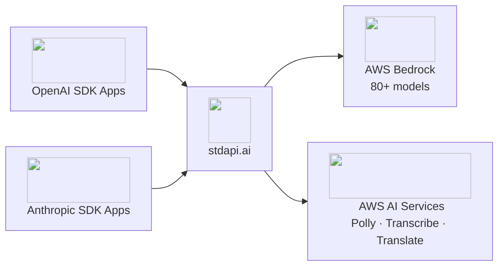

</style>

# Run OpenAI & Anthropic Apps on AWS Bedrock

Drop-in API gateway for AWS Bedrock and AI services. Build private AI products on AWS — without exposing your data to third-party AI providers, without subscriptions, and without rewriting your applications. Your existing OpenAI and Anthropic applications work immediately — just change the base URL. Access 80+ models with enterprise privacy, compliance controls, and pay-per-use AWS pricing.

**Two ways to try it:** 14-day free trial on AWS Marketplace for production, or free for local development.

[Start 14-Day Free Trial on AWS Marketplace](operations_getting_started.md){ .md-button .md-button--primary }
[Try Locally with Docker](operations_getting_started_local.md){ .md-button }

- :material-swap-horizontal: __Change one line, access 80+ models__
   Drop-in replacement for OpenAI and Anthropic SDKs. Works with Open WebUI, n8n, OpenClaw, Claude Code, LangChain, Continue.dev, and 1000+ tools—no code changes beyond the base URL.

- :material-shield-lock: __Your data stays in your AWS account__
   All inference runs in your account. Data is never shared with model providers or used for training. Configure allowed regions for GDPR, HIPAA, and FedRAMP compliance.

- :material-currency-usd-off: __Pay only for what you use__
   No subscriptions or monthly minimums. Pay AWS Bedrock rates directly with no markup from stdapi.ai. Pay only for what you actually use.

- :material-aws: __Purpose-built for AWS Bedrock__
   Deep integration with prompt caching, reasoning modes, guardrails, service tiers, inference profiles, and prompt routers. Not a generic proxy—built to leverage every Bedrock feature.

- :material-brain: __Claude, Kimi, MiniMax, and 80+ more__
   Claude (reasoning), Kimi, MiniMax, Qwen, Llama, GLM, Nova, Stability AI, and more. Switch models instantly—no vendor lock-in.

- :material-rocket-launch: __Deploy in 5 minutes__
   3 lines of Terraform for production on AWS. Or run Docker locally for development. Production-ready infrastructure with HTTPS, WAF, auto-scaling, and monitoring included.

## Models and AI services at your fingertips

  

    <a class="logo-item" href="https://aws.amazon.com/ai/generative-ai/" target="_blank" rel="noopener" title="Amazon Generative AI" aria-label="Amazon Generative AI">
      
      Amazon AI
    </a>
    <a class="logo-item" href="https://aws.amazon.com/bedrock/" target="_blank" rel="noopener" title="Amazon Bedrock" aria-label="Amazon Bedrock">
      
      AWS Bedrock
    </a>
    <a class="logo-item" href="https://claude.ai" target="_blank" rel="noopener" title="Anthropic Claude" aria-label="Anthropic Claude">
      
      Claude
    </a>
    <a class="logo-item" href="https://www.deepseek.com" target="_blank" rel="noopener" title="DeepSeek" aria-label="DeepSeek">
      
      DeepSeek
    </a>
    <a class="logo-item" href="https://aws.amazon.com/polly/" target="_blank" rel="noopener" title="Amazon Polly" aria-label="Amazon Polly">
      
      AWS Polly
    </a>
    <a class="logo-item" href="https://ai.meta.com/llama/" target="_blank" rel="noopener" title="Meta Llama" aria-label="Meta Llama">
      
      Meta Llama
    </a>
    <a class="logo-item" href="https://www.nvidia.com/en-us/ai/" target="_blank" rel="noopener" title="Nvidia" aria-label="Nvidia">
      
      Nvidia
    </a>
    <a class="logo-item" href="https://qwen.ai" target="_blank" rel="noopener" title="Qwen" aria-label="Qwen">
      
      Qwen
    </a>
    <a class="logo-item" href="https://openai.com" target="_blank" rel="noopener" title="OpenAI" aria-label="OpenAI">
      
      OpenAI
    </a>
    <a class="logo-item" href="https://www.moonshot.ai/" target="_blank" rel="noopener" title="Moonshot AI" aria-label="Moonshot AI">
      
      Moonshot AI
    </a>
    <a class="logo-item" href="https://aws.amazon.com/translate/" target="_blank" rel="noopener" title="Amazon Translate" aria-label="Amazon Translate">
      
      AWS Translate
    </a>
    <a class="logo-item" href="https://mistral.ai" target="_blank" rel="noopener" title="Mistral AI" aria-label="Mistral AI">
      
      Mistral AI
    </a>
    <a class="logo-item" href="https://cohere.com" target="_blank" rel="noopener" title="Cohere" aria-label="Cohere">
      
      Cohere
    </a>
    <a class="logo-item" href="https://stability.ai" target="_blank" rel="noopener" title="Stability AI" aria-label="Stability AI">
      
      Stability AI
    </a>
    <a class="logo-item" href="https://www.minimax.io/" target="_blank" rel="noopener" title="Minimax" aria-label="Minimax">
      
      Minimax
    </a>
    <a class="logo-item" href="https://aws.amazon.com/transcribe/" target="_blank" rel="noopener" title="Amazon Transcribe" aria-label="Amazon Transcribe">
      
      AWS Transcribe
    </a>
    <a class="logo-item" href="https://www.ai21.com" target="_blank" rel="noopener" title="AI21 Labs" aria-label="AI21 Labs">
      
      AI21 Labs
    </a>
    <a class="logo-item" href="https://www.anthropic.com" target="_blank" rel="noopener" title="Anthropic" aria-label="Anthropic">
      
      Anthropic
    </a>
    <a class="logo-item" href="https://z.ai" target="_blank" rel="noopener" title="Z.ai" aria-label="Z.ai">
      
      Z.ai
    </a>
    <a class="logo-item" href="https://aws.amazon.com/bedrock/nova/" target="_blank" rel="noopener" title="Amazon Nova" aria-label="Amazon Nova">
      
      AWS Nova
    </a>
    <a class="logo-item" href="https://ai.google/" target="_blank" rel="noopener" title="Google" aria-label="Google">
      
      Google AI
    </a>
    <a class="logo-item" href="https://luma.ai" target="_blank" rel="noopener" title="Luma AI" aria-label="Luma AI">
      
      Luma AI
    </a>
    <a class="logo-item" href="https://www.twelvelabs.io" target="_blank" rel="noopener" title="Twelve Labs" aria-label="Twelve Labs">
      
      Twelve Labs
    </a>
    <a class="logo-item" href="https://writer.com" target="_blank" rel="noopener" title="Writer" aria-label="Writer">
      
      Writer
    </a>
  

## How It Works

### Two paths to your first response

=== ":material-docker: 30 seconds — local Docker"

    One `docker run` command, your existing AWS credentials, and you have a working OpenAI-compatible endpoint on `localhost:8000`. Free community image, AGPL-3.0.

    [:octicons-arrow-right-24: Run Locally with Docker](operations_getting_started_local.md)

=== ":material-aws: 5 minutes — production on AWS"

    Three Terraform commands deploy a production-ready stack: ECS Fargate, HTTPS, WAF, auto-scaling, CloudWatch alarms — all IP-restricted to your current address out of the box. Hardened container from AWS Marketplace with a 14-day free trial.

    [:octicons-arrow-right-24: Deploy on AWS](operations_getting_started.md)

**Then point your application to stdapi.ai** — just change the base URL in your existing OpenAI or Anthropic SDK code. Use Claude, Kimi, MiniMax, or any Bedrock model. Switch between models, regions, and providers without changing application code.

!!! tip "Prefer a hands-off AWS setup?"

    A [managed deployment service](https://aws.amazon.com/marketplace/pp/prodview-xknxzjgl7zi5s) can deploy stdapi.ai into your AWS account — no Terraform required.

**Zero lock-in:** Standard OpenAI and Anthropic APIs mean you can switch back or to another provider anytime.

## Built for AWS

- :material-earth: __Multiply your quota across regions__
   Each AWS region has its own independent quota. Add a second region — double your tokens-per-minute. Add a third — triple it. stdapi.ai routes and fails over automatically; clients never see a throttle error.
   [:octicons-arrow-right-24: Resilience & Failover](operations_resilience.md)

- :material-star-settings: __Advanced Bedrock capabilities__
   Reasoning modes (Claude, Nova), prompt caching, guardrails, service tiers, application inference profiles, and prompt routers—all through standard OpenAI API parameters.

- :material-api: __Complete multi-modal API__
   Chat completions, embeddings, image generation/editing/variations, audio speech/transcription/translation. Every route maps OpenAI parameters to Bedrock equivalents.

- :material-aws: __Native AWS AI services__
   Amazon Polly (text-to-speech), Transcribe (speech-to-text with speaker diarization), Translate—all unified under OpenAI-compatible endpoints.

- :material-chart-line: __Full observability__
   OpenTelemetry integration for traces and metrics. Detailed request/response logging. Swagger and ReDoc API documentation served by the application.

- :material-connection: __Agent-ready by design__
   Expose every API endpoint as a Model Context Protocol tool. AI agents connect directly — no HTTP client code. Streamable HTTP and SSE transports, configurable tool selection.

- :material-swap-horizontal: __Automatic deprecated model fallback__
   When AWS retires a model, requests are transparently redirected to its replacement. Your applications survive model deprecations without code changes.

[:octicons-arrow-right-24: See all features](features.md)

## Who Uses stdapi.ai

- :material-server-network: __DevOps & Platform Teams__
   Deploy Open WebUI, LibreChat, or custom chat interfaces for your organization. Unified API gateway for all AI services—no per-application AWS integration needed.
   [:octicons-arrow-right-24: Open WebUI guide](use_cases_openwebui.md) · [:octicons-arrow-right-24: All use cases](use_cases.md)

- :material-code-braces: __Developers & AI Engineers__
   Use Claude, Kimi thinking, and Qwen Coder Next in VS Code (Continue.dev, Cline, Cursor), JetBrains IDEs, or any OpenAI-compatible tool. Test locally with Docker, deploy to production with Terraform.
   [:octicons-arrow-right-24: Coding assistants guide](use_cases_coding_assistants.md)

- :material-robot: __Workflow Automation Teams__
   Connect n8n, Make, Zapier, or custom automation to AWS Bedrock. Access 400+ integrations with enterprise-grade AI—all through one API endpoint.
   [:octicons-arrow-right-24: n8n integration guide](use_cases_n8n.md)

- :material-domain: __Enterprises with Compliance Needs__
   Meet data sovereignty requirements with region controls. GDPR, HIPAA, FedRAMP workloads supported through AWS Bedrock's compliance certifications. CLOUD Act and FISA 702 risk mitigated through customer-managed encryption.
   [:octicons-arrow-right-24: Data Sovereignty & Compliance](operations_compliance.md)

- :material-cash-multiple: __Cost-conscious Organizations__
   Switch from subscription-based AI services to pay-per-use AWS Bedrock pricing. Pay only for actual usage with no monthly commitments while accessing leading models (Claude, Kimi, MiniMax, Qwen).

- :material-application-brackets: __Teams Migrating from OpenAI or Anthropic__
   LangChain, LlamaIndex, Haystack, Claude SDK, or custom apps work immediately. Gradual migration supported—run both APIs in parallel during transition.

- :material-briefcase: __Legal & Professional Services__
   Attorneys, consultants, and accountants cannot send client materials to third-party AI services. stdapi.ai processes all inference inside your own AWS account — client data never leaves your infrastructure.

## Choose Your Edition

-   :material-scale-balance:{ .lg .middle } __Community Edition — Free & Open Source__

    ---

    **Best for:** Open-source projects, local development, testing, and evaluation.

    - Full API compatibility and all features
    - Community Docker image
    - AGPL-3.0 license (source disclosure required for network use)

    [:octicons-arrow-right-24: Run locally with Docker](operations_getting_started_local.md)

-   :material-briefcase:{ .lg .middle } __Commercial Edition — AWS Marketplace__

    ---

    **Best for:** Internal tools, SaaS products, proprietary applications, production.

    - **14-day free trial** — test in your environment risk-free
    - Hardened container, security updates, commercial support
    - **$0.10/container-hour** — no markup on model usage; pay AWS Bedrock rates directly
    - No AGPL restrictions — keep your code and modifications private
    - Terraform module for production-ready deployment in minutes
    - Streamlined AWS billing

    [:octicons-arrow-right-24: Start 14-Day Free Trial](operations_getting_started.md)

<strong>Ready to run 80+ AI models securely on AWS?</strong>

[Start 14-Day Free Trial on AWS Marketplace](operations_getting_started.md){ .md-button .md-button--primary }
[Try Locally with Docker](operations_getting_started_local.md){ .md-button }

**Production:** Terraform module with ECS + hardened container via AWS Marketplace (14-day free trial, $0.10/container-hour, no markup on model usage) 
**Community:** Free Docker image for local development and open-source projects (AGPL-3.0)

