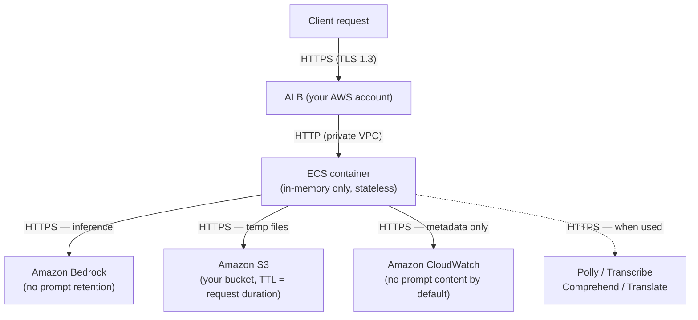

# :material-shield-lock: Data Sovereignty & Compliance

stdapi.ai is deployed entirely within your AWS account. All AI model inference, data storage, and service calls are performed within the AWS regions you explicitly configure — no data is ever sent to third-party services or leaves your account without your control.

!!! success "What this means for your organization"
    - **Your data never leaves your AWS account** — all model inference, storage, and service calls run exclusively in the regions you configure
    - **AWS Bedrock does not retain or train on your data** — prompts and completions are never used for model training; model providers have no access
    - **AWS services carry enterprise compliance certifications** — GDPR, ISO 27001/27017/27018, SOC 1/2/3, HIPAA, FedRAMP (Moderate and High), PCI-DSS, and more via Amazon Bedrock
    - **All data encrypted in transit and at rest** — TLS 1.2+ on all AWS service calls; the Terraform module additionally enforces TLS 1.3 with post-quantum key exchange on the ALB and Customer Managed KMS keys for all stored data

<div class="grid cards" markdown>

- :material-map-marker-check: __Region-Locked Processing__
  <br>Every AWS service call (Bedrock, S3, Polly, Transcribe, Comprehend, Translate) is restricted to your configured regions

- :material-shield-key: __No Third-Party Egress__
  <br>The application communicates exclusively with AWS services — no external APIs, telemetry endpoints, or third-party services

- :material-lock: __Data in Transit Encrypted__
  <br>All AWS service calls use TLS 1.2+. The Terraform module configures the ALB with TLS 1.3 and post-quantum hybrid key exchange.

- :material-database-off: __No Persistent State on Compute__
  <br>ECS containers hold no user data — all persistent storage lives in your S3 buckets, encrypted at rest

</div>

!!! success ":material-check-decagram: AWS Compliance Certifications"
    All AWS services used by stdapi.ai (Bedrock, Polly, Transcribe, Comprehend, Translate) are in scope for **ISO 27001/27017/27018** and the full AWS ISO certification suite. Amazon Bedrock additionally covers **SOC 1/2/3**, **HIPAA**, **GDPR**, **FedRAMP** (Moderate and High), **PCI-DSS**, and **CSA STAR Level 2**. Amazon Comprehend and Polly are also **HIPAA**-eligible.

    See [AWS Compliance Programs](https://aws.amazon.com/compliance/programs/) for the full list, and [AWS Services in Scope](https://aws.amazon.com/compliance/services-in-scope/) to verify current certifications per service.

---

## :material-application-outline: Application

The diagram below shows exactly where data flows and what is retained at each step:



**What this means:**

- **ECS container** — holds request data in memory only; stateless between requests; no disk writes
- **Amazon Bedrock** — processes the inference and returns the result; does not retain prompts ([AWS source](https://docs.aws.amazon.com/bedrock/latest/userguide/data-protection.html))
- **Amazon S3** — temporary storage for multimodal inputs/outputs (images, audio, PDFs); files are deleted immediately after the request completes; a 1-day lifecycle policy acts as a failsafe
- **Amazon CloudWatch** — receives structured request metadata (method, path, status, model, latency); prompt and response content are **never logged by default** (requires `LOG_REQUEST_PARAMS=true` to enable)
- **Polly / Transcribe / Comprehend / Translate** — used only when audio or translation features are invoked; see [AI service opt-out](#aws-ai-service-improvement-opt-out) for data retention controls

stdapi.ai communicates exclusively with the following AWS services, all within the regions you configure:

- **Amazon Bedrock** — model inference
- **Amazon S3** — temporary file storage for multimodal inputs and outputs
- **Amazon Polly** — text-to-speech (when used)
- **Amazon Transcribe** — speech-to-text (when used)
- **Amazon Comprehend** — language detection (when used)
- **Amazon Translate** — text translation (when used)
- **Amazon CloudWatch** — logs and metrics

No other outbound network calls are made. The application does not contact any third-party API, telemetry service, or external endpoint.

### Data in Transit

| Connection | Protocol | Notes |
|---|---|---|
| Client → ALB | HTTPS (TLS 1.2 / TLS 1.3) | ALB HTTPS listener; supports TLS 1.3 and post-quantum hybrid key exchange ([ALB security policies](https://docs.aws.amazon.com/elasticloadbalancing/latest/application/describe-ssl-policies.html)) |
| ALB → ECS container | HTTP | Private VPC traffic, isolated within AWS network infrastructure |
| ECS → AWS services | HTTPS (TLS 1.2+) | AWS confirms: *"Within AWS, all inter-network data in transit supports TLS 1.2 encryption"* ([source](https://docs.aws.amazon.com/bedrock/latest/userguide/data-protection.html)) |

ALB supports **TLS 1.3** and **post-quantum hybrid key exchange** (ML-KEM / Kyber combined with a classical algorithm), so the session key is secure even against a future quantum adversary. See [ALB security policies](https://docs.aws.amazon.com/elasticloadbalancing/latest/application/describe-ssl-policies.html).

### Stateless Design

ECS containers hold no user data between requests. All persistent data (multimodal inputs, async job outputs) is stored exclusively in your S3 buckets. When a container is stopped or replaced, no user data is lost.

---

## :material-brain: AWS Bedrock

### Data Privacy

AWS explicitly guarantees, for all Bedrock models without exception ([AWS Bedrock data protection](https://docs.aws.amazon.com/bedrock/latest/userguide/data-protection.html)):

> *"Amazon Bedrock doesn't store or log your prompts and completions. Amazon Bedrock doesn't use your prompts and completions to train any AWS models and doesn't distribute them to third parties."*

This guarantee is enforced by the **Model Deployment Account** architecture: for each model provider, AWS maintains isolated accounts where model inference runs. AWS confirms:

> *"Model providers don't have any access to those accounts. [...] Because the model providers don't have access to those accounts, they don't have access to Amazon Bedrock logs or to customer prompts and completions."*

This means that regardless of the geographic origin of a model, inference runs on AWS-owned infrastructure and your prompts never reach the model provider.

### Encryption at Rest and in Transit

From the [AWS Bedrock FAQs](https://aws.amazon.com/bedrock/faqs/):

> *"Your data in Amazon Bedrock is always encrypted in transit and at rest, and you can optionally encrypt the data using your own keys."*

See [KMS Encryption](#kms-encryption) below for how stdapi.ai handles encryption at the infrastructure level.

### Cross-Region Inference Profiles and Data Geography

When cross-region inference is enabled, Bedrock may route a request to another region within the inference profile's scope. AWS defines two types of profiles ([source](https://docs.aws.amazon.com/bedrock/latest/userguide/cross-region-inference-support.html)):

| Profile type | Example ID prefix | Geography |
|---|---|---|
| **Geography-pinned** (US, EU, APAC) | `us.`, `eu.`, `ap.` | Fixed destination list — **never changes**, guaranteed to stay within the named geography |
| **Global** | No prefix (direct model ID) | May route to any AWS commercial region worldwide |

AWS explicitly states:

> *"if an inference profile is tied to a geography (such as US, EU, or APAC), its destination Region list will never change."*

Set `AWS_BEDROCK_CROSS_REGION_INFERENCE_GLOBAL=false` to prevent Bedrock from using global profiles. Geography-pinned profiles (`us.*`, `eu.*`, `ap.*`) remain available and provide resilience within their geography. See [Region-Specific Configuration](#region-specific-configuration) for examples.

### Model Providers and Data Access

All third-party models available through Bedrock are subject to the same Model Deployment Account architecture: the provider's software runs in AWS-owned, AWS-operated accounts that the provider cannot access. Your prompts and completions are never shared with any model provider, regardless of where that provider is headquartered.

This applies to providers from every geography, for example:

-  **Alibaba Cloud** (China 🇨🇳) — Qwen models
-  **Amazon** (United States 🇺🇸) — Nova and Titan models
-  **Anthropic** (United States 🇺🇸) — Claude models
-  **Cohere** (Canada 🇨🇦) — Command and Embed models
-  **DeepSeek** (China 🇨🇳) — DeepSeek models
-  **Meta** (United States 🇺🇸) — Llama models
-  **MiniMax** (China 🇨🇳) — MiniMax models
-  **Mistral AI** (France 🇫🇷) — Mistral models
-  **Moonshot AI** (China 🇨🇳) — Kimi models
-  **Stability AI** (United Kingdom 🇬🇧) — Stable Diffusion models
-  **Writer** (United States 🇺🇸) — Palmyra models

---

## :material-microphone: AWS AI Services

Amazon Polly, Transcribe, Comprehend, and Translate each run in an independently configurable region. By default all four services use the first region in `AWS_BEDROCK_REGIONS`, so pointing `AWS_BEDROCK_REGIONS` to your target geography is usually sufficient.

### AWS AI Service Improvement Opt-Out

!!! warning "Action required before processing sensitive data with Polly, Transcribe, Comprehend, or Translate"
    Unlike Amazon Bedrock, AWS may use content processed by these four AI services to improve service quality **by default**. This means audio recordings, transcription text, translated content, and language detection inputs could be used for model training unless you opt out.

    Opt out by configuring an [AI services opt-out policy](https://docs.aws.amazon.com/organizations/latest/userguide/orgs_manage_policies_ai-opt-out.html) at the AWS Organizations level. This is a **one-time action** in the AWS Console. It applies to your entire account immediately and AWS also deletes previously stored content:

    > *"When you opt out of content use by an AWS AI service, that service deletes all of the associated historical content that was shared with AWS before you set the option."*

    You do not need to opt out for Amazon Bedrock — Bedrock never retains or uses prompts for training by design.

---

## :material-bucket-outline: S3 Data Storage

S3 is used as temporary storage for multimodal content (images, PDFs, audio files) passed to or returned from Bedrock and the AI services. Data is stored only in buckets you own and configure.

- **Primary bucket** (`AWS_S3_BUCKET`) — must reside in the same AWS region as the first entry in `AWS_BEDROCK_REGIONS`.
- **Regional buckets** (`AWS_S3_REGIONAL_BUCKETS`) — for multi-region deployments, one bucket per Bedrock region ensures each region reads and writes data locally. When using the Terraform module, these are created automatically.
- **Lifecycle policies** — the Terraform module applies a 1-day lifecycle policy to the temporary prefix as a failover safeguard. The application itself removes temporary files as soon as the operation completes, so files rarely remain beyond the duration of a single request.

S3 stores data within the AWS region where each bucket is created. Data does not leave that region unless you explicitly configure replication.

---

## :material-text-box-check-outline: Logging

### Application Logging

By default, stdapi.ai logs only request metadata — HTTP method, path, status code, execution time, and model identifier. **Prompt and response content are never written to logs** unless explicitly enabled.

Setting `LOG_REQUEST_PARAMS=true` enables full request/response payload logging. This is **disabled by default** and should remain disabled in production environments handling sensitive data. See [Logging & Monitoring](operations_logging_monitoring.md) for details.

### AWS Bedrock Invocation Logging

Bedrock optionally supports invocation logging — recording model inputs and outputs to S3 or CloudWatch Logs. This feature is **disabled by default** on AWS. When enabled:

- **S3 destination**: objects are encrypted using SSE-KMS (CMK supported via key policy).
- **CloudWatch destination**: log group can be encrypted with a KMS CMK.
- Logging scope is configurable: metadata only, or including full prompt and completion content.

See [Amazon Bedrock invocation logging](https://docs.aws.amazon.com/bedrock/latest/userguide/model-invocation-logging.html) for configuration details.

---

## :material-key-outline: KMS Encryption

All data stored by stdapi.ai is encrypted at rest. The Terraform module automatically creates a **Customer Managed Key (CMK)** with a restrictive key policy and automatic annual rotation enabled.

For higher compliance needs, AWS KMS supports additional controls: custom key policies, crypto-shredding, multi-region keys, and [CloudHSM-backed custom key stores](https://docs.aws.amazon.com/kms/latest/developerguide/custom-key-store-overview.html) for FIPS 140-3 Level 3 hardware-validated key storage.

!!! tip "Bring your own CMK"
    To use an existing CMK, create the S3 bucket and CloudWatch log groups outside the Terraform module and pass them via `aws_s3_bucket` and related parameters. See [Advanced Deployment](operations_deploy_advanced.md#integration-with-existing-infrastructure).

---

## :material-cog-outline: Compliance Configuration Reference

| Variable | Purpose | Compliance relevance |
|---|---|---|
| `AWS_BEDROCK_REGIONS` | Ordered list of Bedrock regions | Restrict model inference to a specific geography |
| `AWS_BEDROCK_CROSS_REGION_INFERENCE` | Enable Bedrock cross-region routing within configured regions | Set `false` to restrict inference to a single region |
| `AWS_BEDROCK_CROSS_REGION_INFERENCE_GLOBAL` | Allow Bedrock to route globally outside configured regions | Set `false` to enforce geographic boundaries |
| `AWS_S3_BUCKET` | Primary S3 bucket | Must be in your target region |
| `AWS_S3_REGIONAL_BUCKETS` | Per-region S3 buckets for multi-region setups | Prevent cross-region data transfer |
| `AWS_POLLY_REGION` | Polly service region | Pin to your target geography |
| `AWS_TRANSCRIBE_REGION` | Transcribe service region | Pin to your target geography |
| `AWS_TRANSCRIBE_S3_BUCKET` | S3 bucket for Transcribe audio files | Must be in the same region as `AWS_TRANSCRIBE_REGION` |
| `AWS_COMPREHEND_REGION` | Comprehend service region | Pin to your target geography |
| `AWS_TRANSLATE_REGION` | Translate service region | Pin to your target geography |

---

## :material-map-marker-multiple: Region-Specific Configuration

=== ":fontawesome-solid-earth-europe: EU / GDPR"

    To ensure all data processing stays within the European Union:

    ```bash
    # Restrict Bedrock to EU regions
    export AWS_BEDROCK_REGIONS=eu-west-1,eu-west-3,eu-central-1,eu-north-1

    # Prevent Bedrock from using global profiles that could route outside the EU.
    # Geography-pinned eu.* profiles are still used for failover within the EU.
    export AWS_BEDROCK_CROSS_REGION_INFERENCE_GLOBAL=false

    # S3 bucket in an EU region (must match the first entry in AWS_BEDROCK_REGIONS)
    export AWS_S3_BUCKET=my-stdapi-eu-bucket
    ```

    !!! tip "Ready-to-use Terraform example"
        :fontawesome-solid-earth-europe: **Multi-region GDPR (EU)** — [getting_started_production_gdpr](https://github.com/stdapi-ai/samples/tree/main/getting_started_production_gdpr)

=== ":fontawesome-solid-earth-americas: United States"

    To restrict all data processing to US AWS regions:

    ```bash
    # Restrict Bedrock to US regions
    export AWS_BEDROCK_REGIONS=us-east-1,us-west-2,us-east-2

    # Prevent Bedrock from using global profiles that could route outside the US.
    # Geography-pinned us.* profiles are still used for failover within the US.
    export AWS_BEDROCK_CROSS_REGION_INFERENCE_GLOBAL=false

    # S3 bucket in a US region
    export AWS_S3_BUCKET=my-stdapi-us-bucket
    ```

    !!! tip "Ready-to-use Terraform example"
        :fontawesome-solid-earth-americas: **Multi-region US** — [getting_started_production_us](https://github.com/stdapi-ai/samples/tree/main/getting_started_production_us)

=== ":fontawesome-solid-earth-asia: Asia Pacific"

    To restrict all data processing to Asia Pacific AWS regions:

    ```bash
    # Restrict Bedrock to APAC regions
    export AWS_BEDROCK_REGIONS=ap-northeast-1,ap-southeast-1,ap-southeast-2

    # Prevent Bedrock from using global profiles that could route outside APAC.
    # Geography-pinned ap.* profiles are still used for failover within APAC.
    export AWS_BEDROCK_CROSS_REGION_INFERENCE_GLOBAL=false

    # S3 bucket in an APAC region
    export AWS_S3_BUCKET=my-stdapi-apac-bucket
    ```

---

## :material-gavel: US Law and Cloud Provider Obligations

AWS is incorporated and headquartered in the United States. Regardless of where your data is stored, AWS as a legal entity is subject to US law — including statutes with explicit extraterritorial reach.

### CLOUD Act

The **Clarifying Lawful Overseas Use of Data (CLOUD) Act, 2018** requires US-based cloud providers to produce customer data in response to a valid US law enforcement warrant or court order, **even when the data is stored outside the United States**. Content data requires a court-issued warrant establishing probable cause — the highest legal standard under US criminal procedure.

Key limits and AWS commitments ([AWS CLOUD Act page](https://aws.amazon.com/compliance/cloud-act/)):

- **Challenge mechanism**: AWS can file a motion to quash or modify requests that would require violating another country's laws, and preserves this right contractually.
- **Customer notification**: AWS's policy is to notify customers of government data requests unless prohibited by a court order (gag order).
- **Zero cross-border content disclosures**: AWS publicly reports that it has not disclosed enterprise or government content stored outside the US to the US government since it began reporting this metric in 2020.
- **Technical barrier**: The [AWS Nitro System](https://aws.amazon.com/ec2/nitro/) restricts all administrative access — including by AWS employees — validated by independent security audit (NCC Group). When customer-managed encryption keys are in use, AWS may be technically unable to hand over intelligible data.

### FISA Section 702

Section 702 of the **Foreign Intelligence Surveillance Act** authorises US intelligence agencies to compel US-based electronic communication service providers to deliver communications of non-US persons located outside the United States — without a per-target warrant. This authority was reauthorised in April 2024 and has no provider challenge mechanism equivalent to the CLOUD Act.

The primary technical countermeasure is **customer-managed encryption (CMK)**: if AWS cannot decrypt the data, intelligible content cannot be produced. This is distinct from contractual protections, which cannot override applicable US law.

### Transfer Frameworks

**EU — Data Privacy Framework and SCCs.** The European Commission adopted the EU-US Data Privacy Framework (DPF) in July 2023, requiring proportionality constraints on US intelligence collection and establishing a Data Protection Review Court (DPRC) as a redress mechanism for EU individuals. AWS is certified under the DPF ([AWS DPF page](https://aws.amazon.com/compliance/eu-us-data-privacy-framework/)). A legal challenge by noyb is pending before the CJEU but has not resulted in invalidation as of this writing.

AWS also incorporates **Standard Contractual Clauses (SCCs)** into its Data Processing Addendum by default — providing a contractual transfer mechanism independent of the DPF. SCCs cannot override applicable US law, but they contractually bind AWS to notify customers of legal demands and challenge requests where legally permissible. Maintaining SCCs alongside the DPF is the recommended posture.

**APAC and other regions.** There is no unified bilateral transfer framework equivalent to the EU-US DPF for APAC jurisdictions. Enterprises typically rely on AWS contractual commitments, customer-managed encryption, and jurisdiction-specific legal analysis. AWS maintains local certifications (IRAP for Australia, ISMAP for Japan, K-ISMS for South Korea, MTCS for Singapore) relevant to respective regulatory environments.

!!! info "Strongest available posture"
    Deploy in AWS regions within your target geography + customer-managed KMS keys (so AWS cannot technically access plaintext) + SCCs as a transfer mechanism independent of DPF validity. This combination provides both contractual and technical protections against third-party access.

---

## :material-lightbulb-outline: Best Practices for High-Compliance Deployments

- :material-check: **Restrict all region settings to compliant regions** — `AWS_BEDROCK_REGIONS` is the primary control; all services default to it, and any optional per-service override must stay within your target geography.
- :material-check: **Set `AWS_BEDROCK_CROSS_REGION_INFERENCE_GLOBAL=false`** — stdapi.ai will then automatically use geography-pinned inference profiles (`us.*`, `eu.*`, `ap.*`), ensuring cross-region failover never leaves the named geography.
- :material-check: **Opt out of AWS AI service improvement** via an AWS Organizations policy — one-time console action covering Polly, Transcribe, Comprehend, and Translate.
- :material-check: **Use a CMK with a restrictive key policy** — the Terraform module creates one by default; this is also the primary technical countermeasure against CLOUD Act and FISA 702 demands (if AWS cannot decrypt the data, intelligible content cannot be produced). For stricter control: bring your own key, limit decrypt to the ECS task role, enable automatic rotation, crypto-shredding for right-to-erasure, or a CloudHSM-backed store for FIPS 140-3 Level 3.
- :material-check: **Confirm `LOG_REQUEST_PARAMS` is disabled** (the default) in production — prompt and response content will then never appear in application logs. If Bedrock invocation logging is enabled for audit purposes, configure a KMS CMK for the S3 or CloudWatch destination.
- :material-check: **Use AWS PrivateLink** for Bedrock and S3 to keep service calls off the public internet, and **enable TLS 1.3 on the ALB** to activate post-quantum hybrid key exchange.
- :material-check: **Enable AWS CloudTrail** in all configured regions to monitor API activity across Bedrock, S3, KMS, and AI services.
- :material-check: **EU users: maintain SCCs alongside the DPF** — SCCs (included by default in the AWS Data Processing Addendum) provide a transfer mechanism independent of DPF validity and contractually bind AWS to challenge requests and notify you.

---

## :material-domain: Regulated Industries

### :material-hospital-box: Healthcare (HIPAA)

**Amazon Bedrock is a HIPAA-eligible service** and is covered under the [AWS Business Associate Agreement (BAA)](https://aws.amazon.com/compliance/hipaa-eligible-services-reference/). For the current list of all HIPAA-eligible AWS services, see the [AWS HIPAA Eligible Services Reference](https://aws.amazon.com/compliance/hipaa-eligible-services-reference/).

**There is no stdapi.ai BAA to sign.** stdapi.ai runs entirely within your AWS account — you are the data controller. Your existing AWS BAA with Amazon covers the underlying services. No separate agreement with stdapi.ai is required.

Recommended configuration for PHI workloads:

- Configure the [AI services opt-out policy](#aws-ai-service-improvement-opt-out) before processing any PHI through Polly, Transcribe, Comprehend, or Translate
- Restrict `AWS_BEDROCK_REGIONS` to regions covered by your BAA geography requirements
- Enable Bedrock invocation logging to a KMS-encrypted S3 bucket if audit trails are required by your compliance programme
- Confirm `LOG_REQUEST_PARAMS` is disabled (the default) so PHI never appears in application logs

### :material-bank: Financial Services (SOC 2, PCI-DSS, GDPR)

Amazon Bedrock carries **SOC 1/2/3**, **PCI-DSS**, and **GDPR** certifications. See [AWS Compliance Programs](https://aws.amazon.com/compliance/programs/) for the current list.

stdapi.ai itself does not process or store payment card data. Your PCI-DSS scoping decision is determined by what data your application sends to the gateway — not by the gateway itself.

For concerns about cross-border data access under US law (CLOUD Act, FISA 702), see [US Law and Cloud Provider Obligations](#us-law-and-cloud-provider-obligations). The primary technical countermeasure is a Customer Managed KMS key — the Terraform module creates one by default.

### :material-office-building: Government / Public Sector (FedRAMP)

Amazon Bedrock has received **FedRAMP Moderate and High authorization**. See the [AWS FedRAMP page](https://aws.amazon.com/compliance/fedramp/) and the [FedRAMP Marketplace](https://marketplace.fedramp.gov/) for current authorization status.

Restrict `AWS_BEDROCK_REGIONS` to US regions and set `AWS_BEDROCK_CROSS_REGION_INFERENCE_GLOBAL=false` to ensure inference never leaves US geography.

### :material-briefcase: Legal & Professional Services

Attorneys, consultants, accountants, and other professionals bound by confidentiality obligations cannot transmit client materials to third-party AI services. stdapi.ai processes all inference within your own AWS infrastructure — client data never leaves your account and never transits external endpoints. This makes it the appropriate choice for AI-assisted document review, contract analysis, and research where client confidentiality is non-negotiable.

---

## :material-arrow-right: Next Steps

<div class="grid cards" markdown>

- :material-server-network: [**Advanced Deployment**](operations_deploy_advanced.md) — Multi-region Terraform examples
- :material-directions-fork: [**Resilience & Failover**](operations_resilience.md) — Multi-region routing and infrastructure resilience
- :material-cog: [**Configuration Reference**](operations_configuration.md) — Complete list of environment variables

</div>
