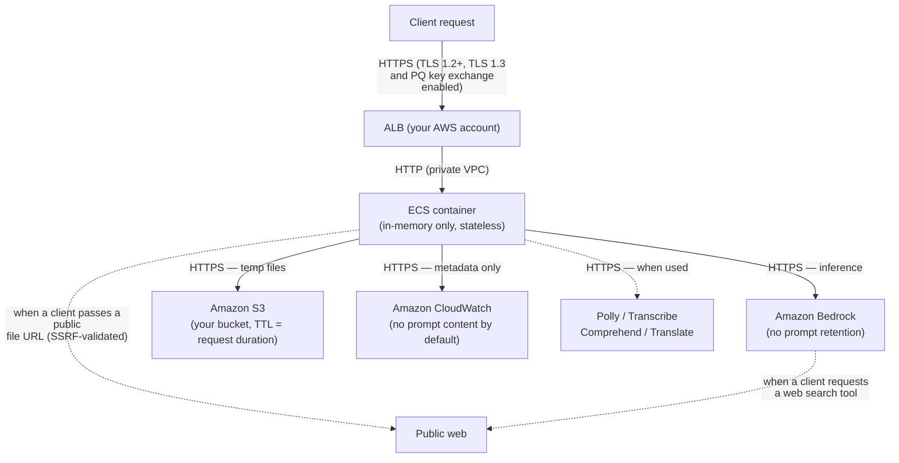

# :material-shield-lock: Data Sovereignty & Compliance

stdapi.ai is deployed entirely within your AWS account. Model inference, data storage, and service calls run on the AWS services and regions you explicitly configure — no third party sits between your users and your models, and the gateway contacts no vendor endpoint of its own.

!!! success "What this means for your organization"
    - **No vendor endpoint in the request path** — no third party sits between your users and your models; inference runs on the AWS services and regions you enable
    - **Amazon Bedrock does not train on your data** — prompts and completions are not used for model training, and model providers have no access unless you explicitly enable `provider_data_share`
    - **AWS services carry enterprise compliance certifications** — GDPR, ISO 27001/27017/27018, SOC 1/2/3, HIPAA, FedRAMP (Moderate and High), PCI-DSS, and more via Amazon Bedrock
    - **Those certifications are not inherited** — AWS compliance certifications apply to the AWS services and regions you choose; they are not inherited by stdapi.ai or by your application
    - **All data encrypted in transit and at rest** — TLS 1.2+ on all AWS service calls; the Terraform module additionally configures the ALB with TLS 1.2+ with TLS 1.3 and post-quantum key exchange enabled, and Customer Managed KMS keys for all stored data

<div class="grid cards" markdown>

- :material-map-marker-check: __Region-Locked Processing__
  <br>Every AWS service call (Bedrock, S3, Polly, Transcribe, Comprehend, Translate) is restricted to your configured regions

- :material-shield-key: __No Third-Party Egress__
  <br>The application initiates no third-party calls of its own — only AWS services. The exceptions are all under your control: remote URLs your own clients supply (SSRF-guarded), OTLP trace export when you enable telemetry, a Mantle endpoint you override, and web searches Bedrock runs when a client asks for a grounding tool

- :material-lock: __Data in Transit Encrypted__
  <br>All AWS service calls use TLS 1.2+. The Terraform module configures the ALB with TLS 1.3 and post-quantum hybrid key exchange.

- :material-database-off: __No Persistent State on Compute__
  <br>ECS containers hold no user data — all persistent storage lives in your S3 buckets, encrypted at rest

</div>

!!! success ":material-check-decagram: AWS Compliance Certifications"
    All AWS services used by stdapi.ai (Bedrock, Polly, Transcribe, Comprehend, Translate) are in scope for **ISO 27001/27017/27018** and the full AWS ISO certification suite. Amazon Bedrock additionally covers **SOC 1/2/3**, **HIPAA**, **GDPR**, **FedRAMP** (Moderate and High), **PCI-DSS**, and **CSA STAR Level 2**. Amazon Comprehend and Polly are also **HIPAA**-eligible.

    Third-party audit reports (SOC, PCI, ISO, etc.) can be downloaded directly from **AWS Artifact** — no need to request them manually. See [Compliance validation for Amazon Bedrock](https://docs.aws.amazon.com/bedrock/latest/userguide/compliance-validation.html) for the current list of in-scope programs, [AWS Compliance Programs](https://aws.amazon.com/compliance/programs/) for the full catalogue, and [AWS Services in Scope](https://aws.amazon.com/compliance/services-in-scope/) to verify certifications per service.

---

## :material-application-outline: Application Data Flow

The diagram below shows exactly where data flows and what is retained at each step:



**What this means:**

- **ECS container** — holds request data in memory only; stateless between requests; no disk writes
- **Amazon Bedrock** — processes the inference and returns the result; does not retain prompts ([AWS source](https://docs.aws.amazon.com/bedrock/latest/userguide/data-protection.html))
- **Amazon S3** — temporary storage for multimodal inputs/outputs (images, audio, PDFs); files are deleted immediately after the request completes — see [S3 Data Storage](#s3-data-storage) for the lifecycle-policy failsafe
- **Amazon CloudWatch** — receives structured request metadata (method, path, status, model, latency); prompt and response content are **never logged by default** (requires `LOG_REQUEST_PARAMS=true` to enable)
- **Amazon Polly / Transcribe / Comprehend / Translate** — used only when audio or translation features are invoked; see [AI service opt-out](#aws-ai-service-improvement-opt-out) for data retention controls
- **Public web** — reached two ways, both driven by the client: the gateway fetches a file the client referenced by `http(s)` URL (destination chosen by the caller, every hop validated against the SSRF guard, private and loopback ranges refused by default), or Bedrock performs a web search on the model's behalf when the client asks for that tool. Neither happens for requests that send inline data or S3 references and no web-search tool; see the outbound paths below

stdapi.ai communicates with the seven AWS services above, all within the regions you configure, plus a handful of conditional AWS services enabled only by specific features: AWS SSM and Secrets Manager (API key storage, if configured), AWS STS (account ID lookup when the ECS task metadata endpoint is unavailable — credentials themselves come from the standard AWS credential chain), the AWS Price List API (only when `COST_TRACKING=true`), AWS Marketplace Metering (AWS Marketplace image only), `bedrock-agent-runtime` (Amazon Bedrock sessions backing `store=true` on the Responses and Chat Completions APIs, and the Rerank API), `bedrock-agent` (Bedrock Prompt Management, only when [`AWS_BEDROCK_ALLOW_PROMPT_ARN`](operations_configuration.md#bedrock-allow-prompt-arn) is enabled), and `bedrock-mantle` (the Amazon Bedrock Mantle endpoint serving OpenAI GPT, xAI Grok, Google Gemma and similar models, enabled by default via [`AWS_BEDROCK_MANTLE_ENABLED`](operations_configuration.md#bedrock-mantle-enabled)).

The server initiates no third-party calls of its own: it contacts no external API, analytics service, or vendor endpoint on its own behalf. Four outbound paths can leave AWS, each driven by your own configuration or your own clients:

- **Remote URLs supplied by a client** — when a request references an input file by `http(s)` URL, the gateway downloads that URL as instructed. The destination is chosen by the caller, never by the server, and every connection (including redirect hops) is validated against [`SSRF_PROTECTION_BLOCK_PRIVATE_NETWORKS`](operations_configuration.md#ssrf-protection-block-private-networks), enabled by default. Clients that send inline data or S3 references never trigger any outbound fetch.
- **OpenTelemetry trace export** — when [`OTEL_ENABLED`](operations_configuration.md#otel-enabled) is set to `true`, traces are exported in OTLP format to [`OTEL_EXPORTER_ENDPOINT`](operations_configuration.md#otel-exporter-endpoint), which defaults to a collector on localhost. Tracing is disabled by default, and the endpoint is yours to choose.
- **An operator-overridden Mantle endpoint** — [`AWS_BEDROCK_MANTLE_ENDPOINT_URL`](operations_configuration.md#bedrock-mantle-endpoint-url) replaces the default `https://bedrock-mantle.{region}.api.aws` address. The override must use `https`, and a `{region}` placeholder is substituted when present, but its host is whatever you set; left unset, Mantle traffic stays on the AWS endpoint in your configured regions.
- **Model-side web search** — when a client includes a web search tool in a request (Amazon Nova's `nova_grounding` system tool, or the native `web_search` tool on Claude models), Amazon Bedrock performs the search on the model's behalf and queries the public web with content derived from the prompt. The gateway issues no such request itself, and no call triggers it unless the client asks for the tool. The built-in [web search](api_openai_responses.md#openai-gpt-web-search) on the OpenAI GPT-5.x family is the one case that stays inside AWS by default: it is answered from the Amazon Bedrock web index and cache, in the Region that served the call, unless you set [`AWS_BEDROCK_EXTERNAL_WEB_ACCESS`](operations_configuration.md#bedrock-external-web-access) and grant the matching [IAM permission](operations_iam_permissions.md#web-search-iam). Amazon Nova's code interpreter (`nova_code_interpreter`) likewise executes inside Bedrock, not in your container. See [Built-in Tool Pricing](operations_cost_management.md#built-in-tool-pricing) for how these invocations are metered, and [`AWS_BEDROCK_MODEL_REGION_RESTRICT`](operations_configuration.md#bedrock-model-region-restrict) to pin the models that offer them.

### Data in Transit

| Connection          | Protocol                  | Notes                                                                                                                                                                                               |
|---------------------|---------------------------|-----------------------------------------------------------------------------------------------------------------------------------------------------------------------------------------------------|
| Client → ALB        | HTTPS (TLS 1.2 / TLS 1.3) | ALB HTTPS listener; supports TLS 1.3 and post-quantum hybrid key exchange ([ALB security policies](https://docs.aws.amazon.com/elasticloadbalancing/latest/application/describe-ssl-policies.html)) |
| ALB → ECS container | HTTP                      | Private VPC traffic, isolated within AWS network infrastructure                                                                                                                                     |
| ECS → AWS services  | HTTPS (TLS 1.2+)          | AWS confirms: *"Within AWS, all inter-network data in transit supports TLS 1.2 encryption"* ([source](https://docs.aws.amazon.com/bedrock/latest/userguide/data-protection.html))                   |

ALB supports **TLS 1.3** and **post-quantum hybrid key exchange** (ML-KEM / Kyber combined with a classical algorithm), so the session key is secure even against a future quantum adversary. See [ALB security policies](https://docs.aws.amazon.com/elasticloadbalancing/latest/application/describe-ssl-policies.html).

### Stateless Design

ECS containers hold no user data between requests. All persistent data (multimodal inputs, async job outputs) is stored exclusively in your S3 buckets. When a container is stopped or replaced, no user data is lost.

---

## :material-brain: Amazon Bedrock

### Data Privacy

AWS gives you explicit control over whether your prompts and outputs are retained from inference requests via a **data retention mode**. The mode can be set at the account or project level and applies consistently across all inference calls. For full details, see the [Amazon Bedrock data retention documentation](https://docs.aws.amazon.com/bedrock/latest/userguide/data-retention.html).

#### Data Retention Modes

| Mode                  | Behavior                                                                                                                                                                                   |
|-----------------------|--------------------------------------------------------------------------------------------------------------------------------------------------------------------------------------------|
| `default`             | AWS may retain data for safety and abuse-prevention purposes. The model provider does **not** receive it. Actual retention depends on the model — consult the model's terms for specifics. |
| `provider_data_share` | AWS retains and shares your inference data with the model provider per their requirements. Required for access to certain models (see below).                                              |
| `none`                | **Zero data retention (ZDR).** No request or response data is written to durable storage by AWS or shared with the model provider.                                                         |

!!! info "Your retention policy takes precedence over model access"
    If your account or project is configured for zero data retention (`data_retention_mode: none`) and you invoke a model that requires retention, Amazon Bedrock **blocks the request and returns an error** rather than retaining the data anyway.

#### Zero Data Retention (ZDR) for High-Compliance Accounts

Some models require data retention for safety and abuse-prevention purposes. If your organization requires zero data retention for compliance reasons and needs access to these models, contact your **AWS account manager** to discuss eligibility. ZDR access is evaluated on a per-account, per-model basis in coordination with the model provider.

You can also enforce a zero-retention policy organization-wide via an AWS Service Control Policy (SCP) — contact your AWS account manager or cloud team to set this up.

#### `provider_data_share` Mode and Model Availability

Certain models — for example, models that require provider-side safety review — are only accessible if your account is configured to share inference data with the model provider. This is an explicit opt-in: most models do not require it, and AWS blocks the request if your retention policy does not permit it.

!!! warning "Understand the implications before enabling `provider_data_share`"
    When this mode is active, AWS retains and shares your inference data with the relevant model provider per their requirements. Prefer enabling it at the project level rather than account-wide, and verify which models require it before doing so. See the [Amazon Bedrock data retention documentation](https://docs.aws.amazon.com/bedrock/latest/userguide/data-retention.html) for configuration steps.

#### Model Deployment Account Architecture

The default isolation guarantee is enforced by the **Model Deployment Account** architecture: for each model provider, AWS maintains isolated accounts where model inference runs. AWS confirms:

> *"Model providers don't have any access to those accounts. [...] Because the model providers don't have access to those accounts, they don't have access to Amazon Bedrock logs or to customer prompts and completions."*

This means that regardless of the geographic origin of a model, inference runs on AWS-owned infrastructure and — unless `provider_data_share` mode is explicitly configured — your prompts never reach the model provider.

### Abuse Detection

AWS operates automated abuse detection mechanisms on Amazon Bedrock to identify activity that violates AWS or model provider terms of service. Full details are in the [Amazon Bedrock abuse detection documentation](https://docs.aws.amazon.com/bedrock/latest/userguide/abuse-detection.html).

Key points:

- **Zero operator access (ZOA):** No AWS operator can access model inputs or outputs.
- **No storage of inputs or outputs by default:** AWS does not store model inputs or outputs unless a specific model requires it for safety and abuse-prevention purposes (see [Data Privacy](#data-privacy)); full zero data retention is the `none` retention mode.
- **Model-specific retention for abuse detection:** A small number of models require short-term retention of flagged or all traffic for automated offline abuse detection. For example, classifier-flagged traffic for certain OpenAI models may be retained for up to 30 days, and some Anthropic models require opting in to share retained traffic with the provider for abuse review. Eligible customers can request full ZDR for these models through their AWS account team.
- **CSAM detection:** AWS uses automated mechanisms (hash matching, classifiers) to detect child sexual abuse material in image inputs. Detected content is blocked (`400 ValidationException`), may be stored for review, and may be reported to NCMEC or relevant authorities.
- **Policy violations:** If abuse is detected, AWS may contact the email address on your AWS account and may suspend access to affected models. Keep your AWS account contact information current and monitored.

### Encryption at Rest and in Transit

From the [Amazon Bedrock FAQs](https://aws.amazon.com/bedrock/faqs/):

> *"Your data in Amazon Bedrock is always encrypted in transit and at rest, and you can optionally encrypt the data using your own keys."*

See [KMS Encryption](#kms-encryption) below for how stdapi.ai handles encryption at the infrastructure level.

### Cross-Region Inference Profiles and Data Geography

When cross-region inference is enabled, Bedrock may route a request to another region within the inference profile's scope. AWS defines two types of profiles ([source](https://docs.aws.amazon.com/bedrock/latest/userguide/cross-region-inference-support.html)):

| Profile type                        | Example ID prefix           | Geography                                                                                 |
|-------------------------------------|-----------------------------|-------------------------------------------------------------------------------------------|
| **Geography-pinned** (US, EU, APAC) | `us.`, `eu.`, `apac.`       | Fixed destination list — **never changes**, guaranteed to stay within the named geography |
| **Global**                          | `global.`                   | May route to any AWS commercial region worldwide                                          |

A model ID carrying **no prefix** is not an inference profile at all: it is a plain in-region invocation, served entirely by the region the request is sent to.

AWS explicitly states:

> *"if an inference profile is tied to a geography (such as US, EU, or APAC), its destination Region list will never change."*

Set `AWS_BEDROCK_CROSS_REGION_INFERENCE_GLOBAL=false` to prevent Bedrock from using global profiles. Geography-pinned profiles (`us.*`, `eu.*`, `apac.*`) remain available and provide resilience within their geography. See [Region-Specific Configuration](#region-specific-configuration) for examples.

### Model Providers and Data Access

All third-party models available through Bedrock are subject to the same Model Deployment Account architecture: the provider's software runs in AWS-owned, AWS-operated accounts that the provider cannot access. Your prompts and completions are never shared with any model provider, regardless of where that provider is headquartered.

This applies to providers from every geography, for example:

-  **Alibaba Cloud** (China 🇨🇳) — Qwen models
-  **Amazon** (United States 🇺🇸) — Nova and Titan models
-  **Anthropic** (United States 🇺🇸) — Claude models
-  **Cohere** (Canada 🇨🇦) — Command and Embed models
-  **DeepSeek** (China 🇨🇳) — DeepSeek models
-  **Meta** (United States 🇺🇸) — Llama models
-  **MiniMax** (China 🇨🇳) — MiniMax models
-  **Mistral AI** (France 🇫🇷) — Mistral models
-  **Moonshot AI** (China 🇨🇳) — Kimi models
-  **Stability AI** (United Kingdom 🇬🇧) — Stable Diffusion models
-  **Writer** (United States 🇺🇸) — Palmyra models

---

## :material-microphone: AWS AI Services

Amazon Polly, Transcribe, Comprehend, and Translate each run in an independently configurable region. By default all four treat every `AWS_BEDROCK_REGIONS` entry as a candidate and fail over between them, so pointing `AWS_BEDROCK_REGIONS` to your target geography is usually sufficient.

### AWS AI Service Improvement Opt-Out

!!! warning "Action required before processing sensitive data with Polly, Transcribe, Comprehend, or Translate"
    Unlike Amazon Bedrock, AWS may use content processed by these four AI services to improve service quality **by default**. This means audio recordings, transcription text, translated content, and language detection inputs could be used for model training unless you opt out.

    Opt out by configuring an [AI services opt-out policy](https://docs.aws.amazon.com/organizations/latest/userguide/orgs_manage_policies_ai-opt-out.html) at the AWS Organizations level. This is a **one-time action** in the AWS Console. It applies to your entire account immediately and AWS also deletes previously stored content:

    > *"When you opt out of content use by an AWS AI service, that service deletes all of the associated historical content that was shared with AWS before you set the option."*

    You do not need to opt out for Amazon Bedrock — Bedrock does not use prompts or completions to improve models, and does not share them with model providers unless you enable `provider_data_share`. Retention itself is governed separately by your [data retention mode](#data-retention-modes), and by the model-specific [abuse-detection](#abuse-detection) rules that apply to a small number of models.

---

## :material-shield-check: Content Safety

Content filtering is a control you configure, not one the gateway supplies of its own. It enforces an [Amazon Bedrock guardrail](operations_configuration.md#bedrock-guardrails) that you create and own, evaluated by Bedrock in your account and in your configured regions. With no guardrail configured, nothing is filtered or refused on inference — the [Moderations API](api_openai_moderations.md) still classifies content on demand, but classification is a report, not a block.

There is no separate stdapi.ai content policy, model evaluation, or review stage layered on top. Every behavior below is the enforcement of the policy **you** define on the guardrail, plus the classification backends the Moderations API exposes.

### Guardrail Coverage

A guardrail set through [`AWS_BEDROCK_GUARDRAIL_IDENTIFIER` and `AWS_BEDROCK_GUARDRAIL_VERSION`](operations_configuration.md#aws-bedrock-guardrail-identifier) — or carried by a [model alias](operations_configuration.md#model-aliases-configuration), which overrides the global one for the requests naming that alias — applies to **every route**:

| Routes                                                       | Direction checked                                                                  |
|--------------------------------------------------------------|--------------------------------------------------------------------------------------|
| Chat Completions, Responses, Completions, Anthropic Messages | **Input and output**, natively inside the Bedrock invocation                       |
| Embeddings, Rerank, Images Generations / Edits, Videos, Audio Speech | **Input** — the client-supplied text, checked before it reaches the backend |
| Audio Transcriptions, Audio Translations                     | **Output** — the transcript or translated text, checked before it is returned      |
| Realtime                                                     | **Input and output**, per turn — written items before the model sees them, transcribed caller speech, and each completed answer |

Routes whose AWS backend has no native guardrail mechanism call the ApplyGuardrail API explicitly; see [Route Coverage](operations_configuration.md#route-coverage) for the mechanism used per route, and [Bedrock Guardrails](operations_iam_permissions.md#bedrock-guardrails-optional) for the IAM permission it requires.

Clients cannot weaken the policy: [`AWS_BEDROCK_ALLOW_GUARDRAIL_OVERRIDE`](operations_configuration.md#aws-bedrock-allow-guardrail-override) is `false` by default, so guardrail request headers and request-body guardrail configuration are ignored while a guardrail is configured. It is auto-enabled at startup only when no guardrail is configured anywhere — there is then no policy to bypass.

!!! warning "Two places a configured guardrail does not reach"
    - **Bedrock Mantle-served models** — guardrails are a `bedrock-runtime` feature and do not apply to requests served by the Mantle endpoint. Startup emits a warning counting the affected models; set [`AWS_BEDROCK_MANTLE_ENABLED=false`](operations_configuration.md#bedrock-mantle-enabled) to close the gap. A **model alias** that carries a guardrail while pointing at a Mantle-served model is fatal at startup rather than silently unguarded.
    - **Batch inference** — the Bedrock batch API cannot carry a guardrail. A batched request that a configured guardrail would apply to is **refused**, not run unguarded; send those requests without batching.

    Both are fail-closed by design: the failure mode is a refused request or a refused startup, never content served past a policy the operator believes is active.

### Intervention Behavior

What a client sees when the guardrail intervenes depends on the mechanism the route uses:

| Route family                                                 | Result of a blocking intervention                                                                     |
|--------------------------------------------------------------|---------------------------------------------------------------------------------------------------------|
| ApplyGuardrail-enforced routes (embeddings, rerank, images, videos, speech, transcription, translation, moderations) | HTTP **400** with error code `content_filter`, carrying the guardrail's own configured blocked messaging |
| Chat Completions, Responses, Completions                     | The response is returned and reports `content_filter` as its finish (or incomplete) reason              |
| Anthropic Messages                                           | The response is returned with stop reason `refusal`                                                     |
| Realtime                                                     | A terminal `error` event and close code `3000` — the session ends                                       |

A **masking-only** intervention (the guardrail's sensitive-information policy anonymizing rather than blocking) substitutes the masked text instead of failing: masked input reaches the backend model already masked, and a masked transcript or translation is returned on the plain `json` and `text` formats. Response formats that cannot represent masked text — `srt`, `vtt`, `verbose_json`, `diarized_json` — fail with the same `content_filter` error rather than return the unmasked content.

On the Realtime API the check cannot precede delivery in one direction: the model's speech is streamed while it is generated and its transcript is only complete once the answer is over, so a blocked answer may already have been partly heard when the session ends.

!!! info "Guardrail evaluation is a billed AWS operation"
    AWS charges for the guardrail on every route it applies to. Only the ApplyGuardrail-enforced routes report the units consumed, which appear per guardrail policy in [usage logs and cost tracking](operations_logging_monitoring.md). Native chat routes are billed by AWS but return no unit counts, so tracked cost on them is lower than the AWS bill by the guardrail's share.

### Content Classification

The [Moderations API](api_openai_moderations.md) (`POST /v1/moderations`) classifies text and images against three backends, all inside your AWS account:

| Backend                                                                  | Requires                                              | Inputs           |
|--------------------------------------------------------------------------|-------------------------------------------------------|------------------|
| Amazon Bedrock Guardrails                                                | A configured guardrail resource                       | Text and images  |
| Inline guardrail checks (`InvokeGuardrailChecks`)                        | **No guardrail resource** — only a Bedrock region offering the operation | Text only |
| Amazon Comprehend toxicity detection                                     | Nothing — always available                            | Text only        |

Because the last two need no setup, `/v1/moderations` works on any deployment: with no guardrail configured it resolves to inline guardrail checks where a configured region offers them, then falls back to Comprehend. See [Model Support](api_openai_moderations.md#model-support) for the selection rules and category mapping, and [Comprehend Moderation](operations_iam_permissions.md#comprehend-moderation) for its permission.

The same classification is available inline on generation: the `moderation` request parameter of the Chat Completions and Responses APIs reports how the guardrail assessed the input and the output of that request. It requires a guardrail resource, and is rejected on Mantle-served models.

### Personal Data in Content

Personal data is handled in exactly two places, both of which you switch on deliberately:

- **The guardrail's sensitive-information policy** — the PII entity types and regular expressions you configure on the guardrail are masked or blocked wherever that guardrail is checked, in both directions, following the intervention behavior above.
- **Amazon Transcribe PII redaction** — a client may request `ContentRedaction` on a transcription; only the single-output `redacted` mode is accepted, so no unredacted copy is produced. See [Audio Transcriptions](api_openai_audio_transcriptions.md).

Just as importantly, there is no personal-data handling anywhere else, and none should be assumed:

- The gateway performs **no detection, classification or redaction of its own** — everything above is AWS-side policy evaluation.
- Only **text** is submitted for checking on inference routes. Images, audio and documents passed to a model are not scanned for personal data; the Moderations API is the one surface that submits images to a guardrail.
- Objects held temporarily in your S3 buckets are **not scanned or redacted** — see [S3 Data Storage](#s3-data-storage) for their lifecycle.
- Application logs are not filtered for personal data; prompt and response content simply never reaches them unless you enable it — see [Logging](#logging).

---

## :material-bucket-outline: S3 Data Storage

S3 is used as temporary storage for multimodal content (images, PDFs, audio files) passed to or returned from Bedrock and the AI services. Data is stored only in buckets you own and configure.

- **Primary bucket** (`AWS_S3_BUCKET`) — must reside in the same AWS region as the first entry in `AWS_BEDROCK_REGIONS`.
- **Regional buckets** (`AWS_S3_REGIONAL_BUCKETS`) — for multi-region deployments, one bucket per Bedrock region ensures each region reads and writes data locally. When using the Terraform module, these are created automatically.
- **Lifecycle policies** — the Terraform module applies a 1-day lifecycle policy to the temporary prefix as a failsafe. The application itself removes temporary files as soon as the operation completes, so files rarely remain beyond the duration of a single request.

S3 stores data within the AWS region where each bucket is created. Data does not leave that region unless you explicitly configure replication.

---

## :material-text-box-check-outline: Logging

### Application Logging

By default, stdapi.ai logs only request metadata — HTTP method, path, status code, execution time, and model identifier. **Prompt and response content are never written to logs** unless explicitly enabled.

Setting `LOG_REQUEST_PARAMS=true` enables full request/response payload logging. This is **disabled by default** and should remain disabled in production environments handling sensitive data. See [Logging & Monitoring](operations_logging_monitoring.md) for details.

### Amazon Bedrock Invocation Logging

Bedrock optionally supports invocation logging — recording model inputs and outputs to S3 or CloudWatch Logs. This feature is **disabled by default** on AWS. When enabled:

- **S3 destination**: objects are encrypted using SSE-KMS (CMK supported via key policy).
- **CloudWatch destination**: log group can be encrypted with a KMS CMK.
- Logging scope is configurable: metadata only, or including full prompt and completion content.

See [Amazon Bedrock invocation logging](https://docs.aws.amazon.com/bedrock/latest/userguide/model-invocation-logging.html) for configuration details.

---

## :material-key-outline: KMS Encryption

All data stored by stdapi.ai is encrypted at rest. The Terraform module automatically creates a **Customer Managed Key (CMK)** with a restrictive key policy and automatic annual rotation enabled.

For higher compliance needs, AWS KMS supports additional controls: custom key policies, crypto-shredding, multi-region keys, and [CloudHSM-backed custom key stores](https://docs.aws.amazon.com/kms/latest/developerguide/custom-key-store-overview.html) for FIPS 140-3 Level 3 hardware-validated key storage.

!!! tip "Bring your own CMK"
    To use an existing CMK, create the S3 bucket and CloudWatch log groups outside the Terraform module and pass them via `aws_s3_bucket` and related parameters. See [Advanced Deployment](operations_deploy_advanced.md#integration-with-existing-infrastructure).

Two stores are encrypted under a key you name rather than the bucket's own, so their key policy can be scoped to this workload instead of to everything the bucket holds:

| Setting                                                                                                     | Encrypts                                                                        | Default when unset                          |
|-------------------------------------------------------------------------------------------------------------|---------------------------------------------------------------------------------|---------------------------------------------|
| [`AWS_TRANSCRIBE_OUTPUT_ENCRYPTION_KEY_ARN`](operations_configuration.md#aws-transcribe-output-encryption-key-arn) | Each transcription job's output, with the job's request identifiers as the KMS encryption context | The bucket's own default encryption          |
| [`AWS_BEDROCK_SESSION_ENCRYPTION_KEY_ARN`](operations_configuration.md#aws-bedrock-session-encryption-key-arn)     | The Amazon Bedrock session storage behind stored responses, chat completions and conversations | The AWS-managed key                          |

---

## :material-shield-star: AWS Security Hub, GuardDuty & DNS Firewall Integration

Security Hub Foundational Security Best Practices control mapping, GuardDuty Runtime Monitoring, and Route 53 Resolver DNS Firewall are infrastructure-level security controls, covered on the [Authentication & Security](operations_authentication_security.md) page — see [AWS Security Hub, GuardDuty & DNS Firewall Integration](operations_authentication_security.md#aws-security-hub-guardduty-dns-firewall-integration) for the full module compliance mapping and configuration details.

---

## :material-cog-outline: Compliance Configuration Reference

| Variable                                    | Purpose                                                       | Compliance relevance                                  |
|---------------------------------------------|---------------------------------------------------------------|-------------------------------------------------------|
| `AWS_BEDROCK_REGIONS`                       | Ordered list of Bedrock regions                               | Restrict model inference to a specific geography      |
| `AWS_BEDROCK_CROSS_REGION_INFERENCE`        | Enable Bedrock cross-region routing within configured regions | Set `false` to restrict inference to a single region  |
| `AWS_BEDROCK_CROSS_REGION_INFERENCE_GLOBAL` | Allow Bedrock to route globally outside configured regions    | Set `false` to enforce geographic boundaries          |
| `AWS_S3_BUCKET`                             | Primary S3 bucket                                             | Must be in your target region                         |
| `AWS_S3_REGIONAL_BUCKETS`                   | Per-region S3 buckets for multi-region setups                 | Prevent cross-region data transfer                    |
| `AWS_POLLY_REGION`                          | Polly service region                                          | Pin to your target geography                          |
| `AWS_TRANSCRIBE_REGION`                     | Transcribe service region                                     | Pin to your target geography                          |
| `AWS_TRANSCRIBE_S3_BUCKET`                  | S3 bucket for Transcribe audio files                          | Must be in the same region as `AWS_TRANSCRIBE_REGION` |
| `AWS_COMPREHEND_REGION`                     | Comprehend service region                                     | Pin to your target geography                          |
| `AWS_TRANSLATE_REGION`                      | Translate service region                                      | Pin to your target geography                          |
| `AWS_BEDROCK_GUARDRAIL_IDENTIFIER`          | Guardrail applied to every route                              | Enforce your content and sensitive-information policy |
| `AWS_BEDROCK_GUARDRAIL_VERSION`             | Version of that guardrail                                     | Pin the exact policy version in force                 |
| `AWS_BEDROCK_ALLOW_GUARDRAIL_OVERRIDE`      | Allow clients to override the configured guardrail            | Keep `false` so no client can bypass the policy       |

!!! warning "Service regions are unpinned by default"
    Left unset, `AWS_POLLY_REGION`, `AWS_TRANSCRIBE_REGION`, `AWS_COMPREHEND_REGION` and `AWS_TRANSLATE_REGION` make every [`AWS_BEDROCK_REGIONS`](operations_configuration.md#aws-bedrock-regions) entry a candidate, with automatic failover between them. Restrict `AWS_BEDROCK_REGIONS` to compliant regions, or pin each service explicitly, so no request can be served outside your target geography.

---

## :material-map-marker-multiple: Region-Specific Configuration

=== ":fontawesome-solid-earth-europe: EU / GDPR"

    To ensure all data processing stays within the European Union:

    ```bash
    # Restrict Bedrock to EU regions
    export AWS_BEDROCK_REGIONS=eu-west-1,eu-west-3,eu-central-1,eu-north-1

    # Prevent Bedrock from using global profiles that could route outside the EU.
    # Geography-pinned eu.* profiles are still used for failover within the EU.
    export AWS_BEDROCK_CROSS_REGION_INFERENCE_GLOBAL=false

    # S3 bucket in an EU region (must match the first entry in AWS_BEDROCK_REGIONS)
    export AWS_S3_BUCKET=my-stdapi-eu-bucket
    ```

    !!! tip "Ready-to-use Terraform example"
        :fontawesome-solid-earth-europe: **Multi-region GDPR (EU)** — [getting_started_production_gdpr](https://github.com/stdapi-ai/samples/tree/main/getting_started_production_gdpr)

=== ":fontawesome-solid-earth-americas: United States"

    To restrict all data processing to US AWS regions:

    ```bash
    # Restrict Bedrock to US regions
    export AWS_BEDROCK_REGIONS=us-east-1,us-west-2,us-east-2

    # Prevent Bedrock from using global profiles that could route outside the US.
    # Geography-pinned us.* profiles are still used for failover within the US.
    export AWS_BEDROCK_CROSS_REGION_INFERENCE_GLOBAL=false

    # S3 bucket in a US region
    export AWS_S3_BUCKET=my-stdapi-us-bucket
    ```

    !!! tip "Ready-to-use Terraform example"
        :fontawesome-solid-earth-americas: **Multi-region US** — [getting_started_production_us](https://github.com/stdapi-ai/samples/tree/main/getting_started_production_us)

=== ":fontawesome-solid-earth-asia: Asia Pacific"

    To restrict all data processing to Asia Pacific AWS regions:

    ```bash
    # Restrict Bedrock to APAC regions
    export AWS_BEDROCK_REGIONS=ap-northeast-1,ap-southeast-1,ap-southeast-2

    # Prevent Bedrock from using global profiles that could route outside APAC.
    # Geography-pinned apac.* profiles are still used for failover within APAC.
    export AWS_BEDROCK_CROSS_REGION_INFERENCE_GLOBAL=false

    # S3 bucket in an APAC region
    export AWS_S3_BUCKET=my-stdapi-apac-bucket
    ```

---

## :material-gavel: US Law and Cloud Provider Obligations

AWS is incorporated and headquartered in the United States. Regardless of where your data is stored, AWS as a legal entity is subject to US law — including statutes with explicit extraterritorial reach. This section describes the statutes and the AWS commitments and technical controls that exist around them; it is not legal advice, and how these statutes apply to your data is a question for your own counsel.

### CLOUD Act

The **Clarifying Lawful Overseas Use of Data (CLOUD) Act, 2018** requires US-based cloud providers to produce customer data in response to a valid US law enforcement warrant or court order, **even when the data is stored outside the United States**. Content data requires a court-issued warrant establishing probable cause — the highest legal standard under US criminal procedure.

Key limits and AWS commitments ([AWS CLOUD Act page](https://aws.amazon.com/compliance/cloud-act/)):

- **Challenge mechanism**: AWS can file a motion to quash or modify requests that would require violating another country's laws, and preserves this right contractually.
- **Customer notification**: AWS's policy is to notify customers of government data requests unless prohibited by a court order (gag order).
- **Zero cross-border content disclosures**: AWS publicly reports that it has not disclosed enterprise or government content stored outside the US to the US government since it began reporting this metric in 2020.
- **Administrative access controls**: The [AWS Nitro System](https://aws.amazon.com/ec2/nitro/) restricts administrative access to customer workloads — including by AWS employees — a design validated by independent security audit (NCC Group).

### FISA Section 702

Section 702 of the **Foreign Intelligence Surveillance Act** authorizes US intelligence agencies to compel US-based electronic communication service providers to deliver communications of non-US persons located outside the United States — without a per-target warrant. This authority was reauthorized in April 2024 and has no provider challenge mechanism equivalent to the CLOUD Act.

The encryption controls described on this page apply here as they do everywhere else: data stored by stdapi.ai is encrypted with a **customer-managed KMS key (CMK)** whose policy and grants you control, and whose usage is visible to you in CloudTrail (see [KMS Encryption](#kms-encryption)). Contractual protections, likewise, cannot override applicable US law. Whether a given combination of controls satisfies your obligations is a legal assessment to make with your own counsel.

### Transfer Frameworks

**EU — Data Privacy Framework and SCCs.** The European Commission adopted the EU-US Data Privacy Framework (DPF) in July 2023, requiring proportionality constraints on US intelligence collection and establishing a Data Protection Review Court (DPRC) as a redress mechanism for EU individuals. AWS is certified under the DPF ([AWS DPF page](https://aws.amazon.com/compliance/eu-us-data-privacy-framework/)). A legal challenge by noyb is pending before the CJEU but has not resulted in invalidation as of this writing.

AWS also incorporates **Standard Contractual Clauses (SCCs)** into its Data Processing Addendum by default — providing a contractual transfer mechanism independent of the DPF. SCCs cannot override applicable US law, but they contractually bind AWS to notify customers of legal demands and challenge requests where legally permissible. Maintaining SCCs alongside the DPF is the recommended posture.

**APAC and other regions.** There is no unified bilateral transfer framework equivalent to the EU-US DPF for APAC jurisdictions. Enterprises typically rely on AWS contractual commitments, customer-managed encryption, and jurisdiction-specific legal analysis. AWS maintains local certifications (IRAP for Australia, ISMAP for Japan, K-ISMS for South Korea, MTCS for Singapore) relevant to respective regulatory environments.

!!! info "Recommended posture"
    Deploy in AWS regions within your target geography, encrypt stored data with customer-managed KMS keys whose policy you control, and maintain SCCs as a transfer mechanism independent of DPF validity. This combines a residency control, an encryption control and a contractual transfer mechanism; assess with your own counsel whether it meets your obligations.

---

## :material-lightbulb-outline: Best Practices for High-Compliance Deployments

- :material-check: **Restrict all region settings to compliant regions** — `AWS_BEDROCK_REGIONS` is the primary control; all services default to it, and any optional per-service override must stay within your target geography.
- :material-check: **Set `AWS_BEDROCK_CROSS_REGION_INFERENCE_GLOBAL=false`** — stdapi.ai will then use geography-pinned inference profiles (`us.*`, `eu.*`, `apac.*`), whose destination region list AWS commits to keeping within the named geography.
- :material-check: **Opt out of AWS AI service improvement** via an AWS Organizations policy — one-time console action covering Polly, Transcribe, Comprehend, and Translate.
- :material-check: **Configure an Amazon Bedrock guardrail and leave `AWS_BEDROCK_ALLOW_GUARDRAIL_OVERRIDE` at `false`** — the policy then applies to every route in both directions and no client can weaken it. If you rely on it, also set `AWS_BEDROCK_MANTLE_ENABLED=false`, since guardrails do not apply to Mantle-served models. See [Content Safety](#content-safety).
- :material-check: **Use a CMK with a restrictive key policy** — the Terraform module creates one by default, so the key policy, its grants and its CloudTrail usage records are yours to control. For stricter control: bring your own key, limit decrypt to the ECS task role, enable automatic rotation, crypto-shredding for right-to-erasure, or a CloudHSM-backed store for FIPS 140-3 Level 3.
- :material-check: **Confirm `LOG_REQUEST_PARAMS` is disabled** (the default) in production — prompt and response content are then kept out of application logs entirely. If Bedrock invocation logging is enabled for audit purposes, configure a KMS CMK for the S3 or CloudWatch destination.
- :material-check: **Use AWS PrivateLink** for Bedrock and S3 to keep service calls off the public internet, and **enable TLS 1.3 on the ALB** to activate post-quantum hybrid key exchange.
- :material-check: **Enable AWS CloudTrail** in all configured regions to monitor API activity across Bedrock, S3, KMS, and AI services.
- :material-check: **Enable AWS Security Hub and GuardDuty** on the account — deploy via the Terraform module and set `compliance_vpc_endpoints_enabled=true`, `guardduty_vpc_endpoint_enabled=true`, and `dns_firewall_enabled=true` (dedicated VPC only) to close the remaining FSBP gaps, support GuardDuty Runtime Monitoring, and block DNS resolution of known-malicious domains. See [AWS Security Hub, GuardDuty & DNS Firewall Integration](operations_authentication_security.md#aws-security-hub-guardduty-dns-firewall-integration).
- :material-check: **EU users: maintain SCCs alongside the DPF** — SCCs (included by default in the AWS Data Processing Addendum) provide a transfer mechanism independent of DPF validity and contractually bind AWS to challenge requests and notify you.

---

## :material-domain: Regulated Industries

### :material-hospital-box: Healthcare (HIPAA)

**Amazon Bedrock is a HIPAA-eligible service** and is covered under the [AWS Business Associate Agreement (BAA)](https://aws.amazon.com/compliance/hipaa-eligible-services-reference/). For the current list of all HIPAA-eligible AWS services, see the [AWS HIPAA Eligible Services Reference](https://aws.amazon.com/compliance/hipaa-eligible-services-reference/).

**There is no stdapi.ai BAA to sign.** stdapi.ai runs entirely within your AWS account — you are the data controller. Your existing AWS BAA with Amazon covers the underlying services. No separate agreement with stdapi.ai is required.

Recommended configuration for PHI workloads:

- Configure the [AI services opt-out policy](#aws-ai-service-improvement-opt-out) before processing any PHI through Polly, Transcribe, Comprehend, or Translate
- Restrict `AWS_BEDROCK_REGIONS` to regions covered by your BAA geography requirements
- Enable Bedrock invocation logging to a KMS-encrypted S3 bucket if audit trails are required by your compliance programme
- Confirm `LOG_REQUEST_PARAMS` is disabled (the default) so PHI never appears in application logs

### :material-bank: Financial Services (SOC 2, PCI-DSS, GDPR)

Amazon Bedrock carries **SOC 1/2/3**, **PCI-DSS**, and **GDPR** certifications. See [AWS Compliance Programs](https://aws.amazon.com/compliance/programs/) for the current list.

stdapi.ai itself does not process or store payment card data. Your PCI-DSS scoping decision is determined by what data your application sends to the gateway — not by the gateway itself.

For the legal context around cross-border data access under US law (CLOUD Act, FISA 702), the AWS commitments that apply, and the region and encryption controls available to you, see [US Law and Cloud Provider Obligations](#us-law-and-cloud-provider-obligations).

### :material-office-building: Government / Public Sector (FedRAMP)

Amazon Bedrock has received **FedRAMP Moderate and High authorization**. See the [AWS FedRAMP page](https://aws.amazon.com/compliance/fedramp/) and the [FedRAMP Marketplace](https://marketplace.fedramp.gov/) for current authorization status.

Restrict `AWS_BEDROCK_REGIONS` to US regions and set `AWS_BEDROCK_CROSS_REGION_INFERENCE_GLOBAL=false` so that inference is served only from US regions and US geography-pinned inference profiles.

### :material-briefcase: Legal & Professional Services

Attorneys, consultants, accountants, and other professionals bound by confidentiality obligations cannot transmit client materials to third-party AI services. stdapi.ai runs inference on the AWS services and regions you enable — no third party sits between your users and your models, and the gateway contacts no vendor endpoint of its own choosing. The outbound paths that can exist are driven by your configuration or your own clients; see [Application Data Flow](#application-data-flow). This makes it a workable basis for AI-assisted document review, contract analysis, and research where client confidentiality is non-negotiable.

---

## :material-arrow-right: Next Steps

<div class="grid cards" markdown>

- :material-server-network: [**Advanced Deployment**](operations_deploy_advanced.md) — Multi-region Terraform examples
- :material-directions-fork: [**Resilience & Failover**](operations_resilience.md) — Multi-region routing and infrastructure resilience
- :material-cog: [**Configuration Reference**](operations_configuration.md) — Complete list of environment variables
- :material-email-outline: [**Contact**](contact.md) — Questions about the product's controls, configuration or licensing, and private offers. Assessing those controls against your obligations is a judgement for you and your own advisers

</div>
