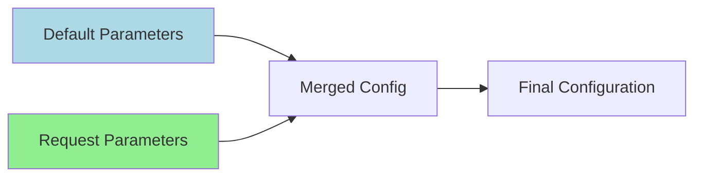

# Configuration Guide

stdapi.ai is configured entirely through environment variables, which are read once at startup and cannot be changed without restarting the service. This guide explains each setting category with practical examples to help you configure the service correctly.

!!! tip "Zero Configuration Startup"
    stdapi.ai works out of the box with zero configuration. The service automatically detects your current AWS region and discovers available Bedrock models.

!!! info "Prerequisites"
    Before configuring stdapi.ai, ensure you have:

    - **AWS Account** with access to Amazon Bedrock
    - **AWS Credentials** configured via environment variables, AWS CLI, or IAM role (for EC2/ECS/Lambda deployments)
    - **IAM Permissions** to access required AWS services (see [IAM Permissions](#iam-permissions) section)
    - **S3 Bucket** (optional, but recommended for production use with file operations)

## Quick Start

For production deployments, configure these essential settings:

### Minimal Production Setup

Single-region deployment with file storage only.

```bash
# S3 bucket for file storage (must be in same region as your server)
export AWS_S3_BUCKET=my-stdapi-bucket

# AWS_BEDROCK_REGIONS is optional - will auto-detect your current AWS region if not specified
```

### Production with Authentication

Adds secure API key authentication via AWS Systems Manager.

```bash
# S3 bucket for file storage (must be in same region as your server)
export AWS_S3_BUCKET=my-stdapi-bucket

# Secure API authentication (recommended: SSM Parameter Store)
export API_KEY_SSM_PARAMETER=/stdapi/prod/api-key

# AWS_BEDROCK_REGIONS is optional - will auto-detect your current AWS region if not specified
```

### Full Production Setup (All Features Enabled)

Multi-region deployment with all AWS AI services, observability, and security features.

```bash
# Core AWS configuration - host server in first region
export AWS_BEDROCK_REGIONS=us-east-1,us-west-2,eu-west-1

# S3 bucket for file storage (must be in us-east-1, your first/primary region)
export AWS_S3_BUCKET=my-stdapi-us-east-1-bucket

# Optional: Transcribe S3 bucket (defaults to AWS_S3_BUCKET if not specified)
# Only set this if you need a separate bucket or if transcribe is in a different region
# export AWS_TRANSCRIBE_S3_BUCKET=my-stdapi-transcribe-us-east-1

# Optional: Regional buckets for async/batch inference in other regions
export AWS_S3_REGIONAL_BUCKETS='{"us-west-2": "my-stdapi-us-west-2-bucket", "eu-west-1": "my-stdapi-eu-west-1-bucket"}'

# AWS AI services regions (optional - defaults to first AWS_BEDROCK_REGIONS if not specified)
export AWS_POLLY_REGION=us-east-1           # Text-to-speech
export AWS_TRANSCRIBE_REGION=us-east-1      # Speech-to-text (audio transcription)
export AWS_COMPREHEND_REGION=us-east-1      # Language detection
export AWS_TRANSLATE_REGION=us-east-1       # Text translation

# Authentication
export API_KEY_SSM_PARAMETER=/stdapi/prod/api-key

# Logging
export LOG_LEVEL=warning
export LOG_CLIENT_IP=true

# Optional: OpenTelemetry observability (AWS X-Ray integration)
# export OTEL_ENABLED=true
# export OTEL_SERVICE_NAME=stdapi-production
# export OTEL_SAMPLE_RATE=0.1

# Production security settings (when behind AWS ALB/CloudFront)
export ENABLE_PROXY_HEADERS=true

# Note: TRUSTED_HOSTS not recommended with AWS ALB - use ALB host-based routing instead
# Only use TRUSTED_HOSTS if you cannot configure host validation at the load balancer level

# Optional: CORS for browser-based web applications
# export CORS_ALLOW_ORIGINS='["https://app.example.com"]'
```

### Development Setup

Local development configuration with API documentation and debug logging enabled.

```bash
# Minimal configuration for local development
export AWS_S3_BUCKET=my-stdapi-dev-bucket

# Enable API documentation
export ENABLE_DOCS=true
export ENABLE_REDOC=true

# Full request/response logging for debugging
export LOG_LEVEL=info
export LOG_REQUEST_PARAMS=true

# AWS_BEDROCK_REGIONS is optional - will auto-detect your current AWS region if not specified
```

!!! warning "S3 Bucket Required for Certain Features"
    Without an S3 bucket configured, some features will be disabled (such as image output as URL, audio transcription). See the relevant API documentation for feature requirements.

!!! info "All Other Settings Are Optional"
    The configurations above are sufficient for most production deployments. All other settings can be configured as needed for your specific use case.

## Environment Variable Summary

This section provides a quick reference of all available configuration options. Detailed explanations for each variable can be found in the sections below.

### :material-star: Essential (Production)

| Variable                                      | Default        | Description                                                                          |
|-----------------------------------------------|----------------|--------------------------------------------------------------------------------------|
| [`AWS_S3_BUCKET`](#aws-s3-bucket)             | None           | Primary S3 bucket for file storage; must be in first region of `AWS_BEDROCK_REGIONS` |
| [`AWS_BEDROCK_REGIONS`](#aws-bedrock-regions) | Current region | Comma-separated regions for Bedrock; first region is where server should be hosted   |

### :material-aws: AWS Storage

| Variable                                                | Default         | Description                                                                                          |
|---------------------------------------------------------|-----------------|------------------------------------------------------------------------------------------------------|
| [`AWS_S3_ACCELERATE`](#aws-s3-accelerate)               | `false`         | Enable S3 Transfer Acceleration for faster global downloads via CloudFront edge locations            |
| [`AWS_S3_REGIONAL_BUCKETS`](#aws-s3-regional-buckets)   | `{}`            | Region-specific S3 buckets for Bedrock async/batch inference operations                              |
| [`AWS_S3_TMP_PREFIX`](#aws-s3-tmp-prefix)               | `tmp/`          | S3 prefix for temporary files used for jobs; configure lifecycle policies on this prefix             |
| [`AWS_TRANSCRIBE_S3_BUCKET`](#aws-transcribe-s3-bucket) | `AWS_S3_BUCKET` | S3 bucket for temporary audio transcription files; must be in same region as `AWS_TRANSCRIBE_REGION` |

### :material-robot: AWS AI Services

| Variable                                          | Default                     | Description                                                 |
|---------------------------------------------------|-----------------------------|-------------------------------------------------------------|
| [`AWS_POLLY_REGION`](#aws-polly-region)           | First `AWS_BEDROCK_REGIONS` | AWS region for Amazon Polly text-to-speech service          |
| [`AWS_COMPREHEND_REGION`](#aws-comprehend-region) | First `AWS_BEDROCK_REGIONS` | AWS region for Amazon Comprehend language detection service |
| [`AWS_TRANSCRIBE_REGION`](#aws-transcribe-region) | First `AWS_BEDROCK_REGIONS` | AWS region for Amazon Transcribe speech-to-text service     |
| [`AWS_TRANSLATE_REGION`](#aws-translate-region)   | First `AWS_BEDROCK_REGIONS` | AWS region for Amazon Translate text translation service    |

### :material-shield-check: Bedrock Advanced

| Variable                                                                        | Default | Description                                                                                       |
|---------------------------------------------------------------------------------|---------|---------------------------------------------------------------------------------------------------|
| [`AWS_BEDROCK_CROSS_REGION_INFERENCE`](#cross-region-inference)                 | `true`  | Allow automatic model routing to other configured regions                                         |
| [`AWS_BEDROCK_CROSS_REGION_INFERENCE_GLOBAL`](#cross-region-global)             | `true`  | Allow global cross-region inference routing to any region worldwide (disable for GDPR compliance) |
| [`AWS_BEDROCK_LEGACY`](#bedrock-legacy)                                         | `true`  | Allow usage of deprecated/legacy Bedrock models                                                   |
| [`AWS_BEDROCK_MARKETPLACE_AUTO_SUBSCRIBE`](#bedrock-marketplace-auto-subscribe) | `true`  | Allow automatic subscription to new models in AWS Marketplace                                     |
| [`AWS_BEDROCK_GUARDRAIL_IDENTIFIER`](#aws-bedrock-guardrail-identifier)         | None    | Bedrock Guardrails ID for content filtering and safety controls                                   |
| [`AWS_BEDROCK_GUARDRAIL_VERSION`](#aws-bedrock-guardrail-version)               | None    | Bedrock Guardrails version number (required with identifier)                                      |
| [`AWS_BEDROCK_GUARDRAIL_TRACE`](#aws-bedrock-guardrail-trace)                   | None    | Guardrails trace level: `disabled`, `enabled`, or `enabled_full`                                  |

### :material-lock: Authentication

Choose **one** method (mutually exclusive):

| Variable                                                          | Default   | Description                                                        |
|-------------------------------------------------------------------|-----------|--------------------------------------------------------------------|
| [`API_KEY_SSM_PARAMETER`](#api-key-ssm)                           | None      | AWS Systems Manager Parameter Store path for API key (recommended) |
| [`API_KEY_SECRETSMANAGER_SECRET`](#api-key-secretsmanager-secret) | None      | AWS Secrets Manager secret name containing API key                 |
| [`API_KEY_SECRETSMANAGER_KEY`](#api-key-secretsmanager-key)       | `api_key` | JSON key name within Secrets Manager secret                        |
| [`API_KEY`](#api-key)                                             | None      | Direct API key value (not recommended for production)              |

### :material-api: OpenAI Compatibility

| Variable                                        | Default | Description                                       |
|-------------------------------------------------|---------|---------------------------------------------------|
| [`OPENAI_ROUTES_PREFIX`](#openai-routes-prefix) |         | Base path prefix for OpenAI-compatible API routes |

### :material-chart-line: Logging

| Variable                                        | Default | Description                                                                           |
|-------------------------------------------------|---------|---------------------------------------------------------------------------------------|
| [`LOG_LEVEL`](#logging-level)                   | `info`  | Minimum log severity: `info`, `warning`, `error`, `critical`, or `disabled`           |
| [`LOG_REQUEST_PARAMS`](#validation-and-logging) | `false` | Include request/response parameters in logs (not recommended for production)          |
| [`LOG_CLIENT_IP`](#client-ip-logging)           | `false` | Log client IP addresses (requires `ENABLE_PROXY_HEADERS` for real IPs behind proxies) |

### :material-radar: Observability (OpenTelemetry)

| Variable                                            | Default                           | Description                                                                            |
|-----------------------------------------------------|-----------------------------------|----------------------------------------------------------------------------------------|
| [`OTEL_ENABLED`](#otel-enabled)                     | `false`                           | Enable distributed tracing via OpenTelemetry (integrates with AWS X-Ray, Jaeger, etc.) |
| [`OTEL_SERVICE_NAME`](#otel-service-name)           | `stdapi`                          | Service name identifier in trace visualizations                                        |
| [`OTEL_EXPORTER_ENDPOINT`](#otel-exporter-endpoint) | `http://127.0.0.1:4318/v1/traces` | OTLP HTTP endpoint URL for trace export                                                |
| [`OTEL_SAMPLE_RATE`](#otel-sample-rate)             | `1.0`                             | Trace sampling rate from 0.0 (none) to 1.0 (all requests)                              |

### :material-web: HTTP/Security

| Variable                                                                            | Default | Description                                                                           |
|-------------------------------------------------------------------------------------|---------|---------------------------------------------------------------------------------------|
| [`CORS_ALLOW_ORIGINS`](#cors-allow-origins)                                         | None    | JSON array of allowed origins for browser cross-origin requests                       |
| [`TRUSTED_HOSTS`](#trusted-hosts)                                                   | None    | JSON array of trusted Host header values (prefer ALB host-based routing; see details) |
| [`ENABLE_PROXY_HEADERS`](#enable-proxy-headers)                                     | `false` | Trust X-Forwarded-* headers from reverse proxies (only enable behind trusted proxy)   |
| [`ENABLE_GZIP`](#enable-gzip)                                                       | `false` | Enable GZip compression for responses >1KB (prefer AWS ALB/CloudFront compression)    |
| [`SSRF_PROTECTION_BLOCK_PRIVATE_NETWORKS`](#ssrf-protection-block-private-networks) | `true`  | Block requests to private/local networks for SSRF protection                          |

### :material-cog: Application Behavior

| Variable                                                 | Default                 | Description                                                                                |
|----------------------------------------------------------|-------------------------|--------------------------------------------------------------------------------------------|
| [`TIMEZONE`](#validation-and-logging)                    | `UTC`                   | IANA timezone identifier for request timestamps                                            |
| [`STRICT_INPUT_VALIDATION`](#validation-and-logging)     | `false`                 | Reject API requests with unknown/extra fields                                              |
| [`DEFAULT_TTS_MODEL`](#default-tts-model)                | `amazon.polly-standard` | Default text-to-speech model: `standard`, `neural`, `long-form`, or `generative`           |
| [`TOKENS_ESTIMATION`](#tokens-estimation)                | `false`                 | Estimate token counts using tiktoken when model doesn't provide them                       |
| [`TOKENS_ESTIMATION_DEFAULT_ENCODING`](#tokens-encoding) | `o200k_base`            | Tiktoken encoding algorithm: `o200k_base` (GPT-4o+), `cl100k_base` (GPT-4), or `p50k_base` |
| [`DEFAULT_MODEL_PARAMS`](#default-model-params)          | `{}`                    | JSON object with per-model default inference parameters (temperature, max_tokens, etc.)    |
| [`MODEL_CACHE_SECONDS`](#model-cache-seconds)            | `900`                   | Model list cache lifetime in seconds before lazy refresh (default: 15 minutes)             |

### :material-file-document: API Documentation

| Variable                                      | Default | Description                                                                      |
|-----------------------------------------------|---------|----------------------------------------------------------------------------------|
| [`ENABLE_DOCS`](#enable-docs)                 | `false` | Enable interactive Swagger UI documentation at `/docs`                           |
| [`ENABLE_REDOC`](#enable-redoc)               | `false` | Enable ReDoc documentation UI at `/redoc`                                        |
| [`ENABLE_OPENAPI_JSON`](#enable-openapi-json) | `false` | Enable OpenAPI schema endpoint at `/openapi.json` (auto-enabled with docs/redoc) |

---

## AWS Services and Regions

### Storage Configuration

#### `AWS_S3_BUCKET` { #aws-s3-bucket }

:octicons-package-24: **Purpose**
:   Primary S3 bucket for storing generated files (images, audio, documents) and temporary data during processing

:octicons-gear-24: **Default**
:   None (must be configured for file operations)

:octicons-check-circle-24: **Best Practice**
:   The bucket must be in the first region specified in `AWS_BEDROCK_REGIONS` (your primary region where the server should be hosted) to avoid cross-region data transfer costs and reduce latency

```bash
export AWS_S3_BUCKET=my-llm-storage-us-east-1
```

!!! tip "Presigned URLs"
    Files are served via presigned URLs for secure, time-limited access. Presigned URLs expire after 1 hour by default.

#### `AWS_S3_ACCELERATE` { #aws-s3-accelerate }

:octicons-package-24: **Purpose**
:   Enable S3 Transfer Acceleration for presigned URLs to improve download performance for large files

:octicons-database-24: **Type**
:   Boolean

:octicons-gear-24: **Default**
:   `false`

:octicons-check-circle-24: **Best Practice**
:   Enable when serving large files (high-resolution images, audio) to geographically distributed users

```bash
export AWS_S3_ACCELERATE=true
```

!!! info "What is S3 Transfer Acceleration?"
    S3 Transfer Acceleration uses Amazon CloudFront's globally distributed edge locations to accelerate uploads and downloads to S3 buckets. When enabled, data is routed to the nearest edge location and then transferred to S3 over Amazon's optimized network paths.

    **Performance Benefits:**

    - :material-speedometer: **Faster downloads** for users far from your bucket's region
    - :material-earth: **Global reach** via CloudFront edge locations
    - :material-upload-network: **Optimized routing** over Amazon's private backbone network
    - :material-chart-line: **Consistent performance** regardless of user location

    Typical speed improvements: 50-500% faster for users located far from the bucket region.

!!! warning "Requirements"
    1. **Enable Transfer Acceleration** on your S3 bucket before setting this option:
       ```bash
       aws s3api put-bucket-accelerate-configuration \
         --bucket my-stdapi-bucket \
         --accelerate-configuration Status=Enabled
       ```
    2. **Additional costs**: Transfer Acceleration incurs extra data transfer fees. See [AWS S3 Transfer Acceleration pricing](https://aws.amazon.com/s3/pricing/)

!!! tip "When to Enable"
    Consider enabling S3 Transfer Acceleration when:

    - :material-image: Serving generated images via [Images API](api_openai_images_generations.md)
    - :material-earth-arrow-right: Users are geographically distributed across multiple continents
    - :material-file-image: Generating high-resolution images that are large in file size
    - :material-speedometer: Download performance is critical to user experience

    For small images or users close to your bucket region, the performance benefit may not justify the additional cost.

!!! info "Current Usage"
    Presigned URLs with Transfer Acceleration are currently only used for the [Images API](api_openai_images_generations.md) when returning generated images as URLs.

#### `AWS_S3_TMP_PREFIX` { #aws-s3-tmp-prefix }

:octicons-package-24: **Purpose**
:   S3 prefix (folder path) for temporary files used during job processing

:octicons-gear-24: **Default**
:   `tmp/`

:octicons-check-circle-24: **Best Practice**
:   Configure S3 lifecycle policies to automatically delete objects under this prefix after 1 day

```bash
export AWS_S3_TMP_PREFIX=tmp/
```

!!! info "What is an S3 Prefix?"
    An S3 prefix is essentially a folder path within your S3 bucket. When you set `AWS_S3_TMP_PREFIX=tmp/`, all temporary files are stored under the `tmp/` folder structure in your bucket.

    **Example file paths:**

    - With prefix `tmp/`: `s3://my-bucket/tmp/request-id-123/output.json`
    - With prefix `temporary/`: `s3://my-bucket/temporary/request-id-123/output.json`
    - With empty prefix ``: `s3://my-bucket/request-id-123/output.json` (not recommended)

!!! tip "Why Use a Prefix?"
    Using a dedicated prefix for temporary files provides several benefits:

    - :material-auto-fix: **Easy Lifecycle Management** - Apply S3 lifecycle policies to automatically delete only temporary files
    - :material-file-tree: **Better Organization** - Keep temporary files separate from permanent storage
    - :material-shield-check: **Security** - Apply different IAM policies or bucket policies to the prefix
    - :material-cash: **Cost Control** - Easily identify and monitor temporary storage costs

!!! warning "Trailing Slash"
    Always include a trailing slash (`/`) in your prefix to create a proper folder structure. Without it, files will be stored with the prefix as part of the filename rather than in a folder.

    - ✅ Correct: `tmp/` → Files stored as `tmp/file.json`
    - ❌ Incorrect: `tmp` → Files stored as `tmpfile.json`

**Custom prefix examples:**

```bash
# Production environment
export AWS_S3_TMP_PREFIX=prod/tmp/

# Staging environment
export AWS_S3_TMP_PREFIX=staging/tmp/

# Organize by date (requires manual updates)
export AWS_S3_TMP_PREFIX=tmp/2025/01/

# No prefix (store at bucket root - not recommended)
export AWS_S3_TMP_PREFIX=
```

#### `AWS_TRANSCRIBE_S3_BUCKET` { #aws-transcribe-s3-bucket }

:octicons-package-24: **Purpose**
:   Temporary S3 bucket for transcription workflows

:octicons-gear-24: **Default**
:   Falls back to `AWS_S3_BUCKET` if not specified

:octicons-alert-24: **Requirement**
:   Must be in the same region as `AWS_TRANSCRIBE_REGION`

```bash
# If AWS_TRANSCRIBE_REGION is us-east-1
export AWS_TRANSCRIBE_S3_BUCKET=my-transcribe-temp-us-east-1

# If AWS_TRANSCRIBE_REGION is eu-west-1
export AWS_TRANSCRIBE_S3_BUCKET=my-transcribe-temp-eu-west-1
```

#### `AWS_S3_REGIONAL_BUCKETS` { #aws-s3-regional-buckets }

:octicons-package-24: **Purpose**
:   Region-specific S3 buckets for Bedrock async and batch inference operations

:octicons-gear-24: **Default**
:   Empty (no regional buckets configured)

:octicons-code-24: **Format**
:   JSON object with region names as keys and bucket names as values

:octicons-alert-24: **Requirement**
:   Some Bedrock models require S3 buckets in the same region for async and batch inference operations

```bash
export AWS_S3_REGIONAL_BUCKETS='{"us-east-1": "my-bedrock-temp-us-east-1", "eu-west-1": "my-bedrock-temp-eu-west-1"}'
```

!!! info "When to Use"
    Configure this setting when:

    - Using Bedrock async inference API
    - Using Bedrock batch inference API
    - Working with models that require regional S3 storage

    If not specified for a region where async/batch operations are attempted, those operations may fail.

!!! success "Automatic Fallback"
    For the first region in `AWS_BEDROCK_REGIONS` (your primary region), if no regional bucket is specified, the service automatically falls back to `AWS_S3_BUCKET`. You only need to configure regional buckets for additional regions beyond your primary one.

!!! tip "Best Practice"
    Apply the same [S3 Bucket Lifecycle Configuration](#s3-lifecycle) to these regional buckets as you would for the primary bucket to automatically clean up temporary files.

#### S3 Bucket Lifecycle Configuration { #s3-lifecycle }

:octicons-package-24: **Purpose**
:   Configure automatic deletion of temporary files to minimize storage costs

:octicons-clock-24: **Recommendation**
:   Configure S3 lifecycle policies to automatically delete objects under the `AWS_S3_TMP_PREFIX` after 1 day

stdapi.ai stores temporary files under the prefix configured by `AWS_S3_TMP_PREFIX` (default: `tmp/`). These include generated images, audio files, and transcription workflow files. Configure S3 lifecycle policies to automatically delete objects under this prefix after 1 day:

!!! info "Application Cleanup Behavior"
    **Short-lived temporary files:** The application attempts to clean up short-lived temporary files (such as intermediate transcription files) after processing completes.

    **Results shared with clients:** Files shared with clients using presigned URLs (such as generated images and audio) are never cleaned up automatically by the application. These files remain in S3 until removed by lifecycle policies or manual deletion.

    **Why lifecycle policies are essential:** Since the application cannot determine when a client has finished using a presigned URL, S3 lifecycle policies are the recommended mechanism to clean up these files and prevent unbounded storage growth.

```json
{
  "Rules": [
    {
      "Id": "DeleteTemporaryFiles",
      "Status": "Enabled",
      "Filter": {
        "Prefix": "tmp/"
      },
      "Expiration": {
        "Days": 1
      },
      "AbortIncompleteMultipartUpload": {
        "DaysAfterInitiation": 1
      }
    }
  ]
}
```

!!! warning "Important: Update the Prefix"
    The `"Prefix": "tmp/"` value in the lifecycle policy must match your `AWS_S3_TMP_PREFIX` setting. If you use a custom prefix, update the policy accordingly.

    **Examples:**

    - If `AWS_S3_TMP_PREFIX=temporary/`, use `"Prefix": "temporary/"`
    - If `AWS_S3_TMP_PREFIX=prod/tmp/`, use `"Prefix": "prod/tmp/"`

**Apply via AWS CLI:**

```bash
# For primary S3 bucket (AWS_S3_BUCKET)
aws s3api put-bucket-lifecycle-configuration \
  --bucket my-stdapi-bucket \
  --lifecycle-configuration file://lifecycle-policy.json

# For transcribe S3 bucket (AWS_TRANSCRIBE_S3_BUCKET, if different from AWS_S3_BUCKET)
aws s3api put-bucket-lifecycle-configuration \
  --bucket my-transcribe-temp-bucket \
  --lifecycle-configuration file://lifecycle-policy.json

# For regional buckets (AWS_S3_REGIONAL_BUCKETS)
aws s3api put-bucket-lifecycle-configuration \
  --bucket my-stdapi-us-west-2-bucket \
  --lifecycle-configuration file://lifecycle-policy.json
```

!!! tip "Apply to All S3 Buckets"
    Apply this lifecycle policy to:

    - **`AWS_S3_BUCKET`** - Primary bucket for generated files
    - **`AWS_TRANSCRIBE_S3_BUCKET`** - Transcription temporary files (if different from AWS_S3_BUCKET)
    - **`AWS_S3_REGIONAL_BUCKETS`** - All regional buckets for async/batch operations

    All these buckets use the same `AWS_S3_TMP_PREFIX` for temporary file storage.

### Bedrock Configuration

#### `AWS_BEDROCK_REGIONS` { #aws-bedrock-regions }

:octicons-package-24: **Purpose**
:   List of AWS regions where Bedrock models are available

:octicons-list-ordered-24: **Format**
:   Comma-separated string

:octicons-gear-24: **Default**
:   Current AWS SDK region if not specified

:octicons-workflow-24: **Behavior**
:   Models are discovered in the same order as the listed regions. The first region is the primary region where your server should be hosted on AWS for optimal performance. Your S3 bucket (`aws_s3_bucket`) must also be in this region. If a model is unavailable in the primary region, subsequent regions are checked in order

```bash
export AWS_BEDROCK_REGIONS=us-east-1,us-west-2,eu-west-1
```

!!! info "Region Selection Guide"
    | Region | Description |
    |--------|-------------|
    | `us-east-1` | :material-star: Widest model selection, usually gets latest releases first |
    | `us-west-2` | :material-rocket-launch: Good selection, often early access to new models |
    | `eu-west-1` | :material-shield-check: European compliance, subset of US models available |

!!! tip "Advanced Configuration"
    See [Compliance and Latency Optimization](#compliance-and-latency-optimization) for detailed configuration examples including GDPR compliance, regional optimization strategies, and best practices for multi-region deployments.

#### `AWS_BEDROCK_CROSS_REGION_INFERENCE` { #cross-region-inference }

:octicons-package-24: **Purpose**
:   Enable automatic cross-region routing when a model isn't available in the primary region

:octicons-database-24: **Type**
:   Boolean

:octicons-gear-24: **Default**
:   `true`

```bash
export AWS_BEDROCK_CROSS_REGION_INFERENCE=true
```

#### `AWS_BEDROCK_CROSS_REGION_INFERENCE_GLOBAL` { #cross-region-global }

:octicons-package-24: **Purpose**
:   Allow global cross-region inference routing to any region worldwide

:octicons-database-24: **Type**
:   Boolean

:octicons-gear-24: **Default**
:   `true`

!!! example "GDPR Compliance"
    Set to `false` to comply with data residency regulations (e.g., EU GDPR) by restricting to regional inference only
    ```bash
    export AWS_BEDROCK_CROSS_REGION_INFERENCE_GLOBAL=false
    ```

#### `AWS_BEDROCK_LEGACY` { #bedrock-legacy }

:octicons-package-24: **Purpose**
:   Allow usage of legacy/deprecated Bedrock models

:octicons-database-24: **Type**
:   Boolean

:octicons-gear-24: **Default**
:   `true`

```bash
export AWS_BEDROCK_LEGACY=true
```

#### `AWS_BEDROCK_MARKETPLACE_AUTO_SUBSCRIBE` { #bedrock-marketplace-auto-subscribe }

:octicons-package-24: **Purpose**
:   Control automatic subscription to new models in AWS Marketplace

:octicons-database-24: **Type**
:   Boolean

:octicons-gear-24: **Default**
:   `true`

:octicons-workflow-24: **Behavior**
:   When `true`, the server automatically subscribes to new models discovered in the AWS Marketplace, making them immediately available through the API. When `false`, only models with existing marketplace subscriptions are visible and accessible

:octicons-lock-24: **IAM Permissions Required**
:   `aws-marketplace:Subscribe`, `aws-marketplace:ViewSubscriptions`

```bash
# Allow automatic subscription (default)
export AWS_BEDROCK_MARKETPLACE_AUTO_SUBSCRIBE=true

# Restrict to pre-subscribed models only
export AWS_BEDROCK_MARKETPLACE_AUTO_SUBSCRIBE=false
```

!!! info "What is Marketplace Auto-Subscribe?"
    AWS Bedrock requires marketplace subscription before certain models can be used. This setting controls whether stdapi.ai automatically handles the subscription process:

    - :material-check: **`true` (default)**: Models are automatically subscribed when discovered, providing seamless access to new models as they become available
    - :material-close: **`false`**: Only models that have already been subscribed through the AWS Marketplace are visible, providing explicit control over model access

!!! tip "When to Disable"
    Set to `false` when:

    - :material-shield-check: You need explicit control over which models are accessible
    - :material-cash: You want to prevent automatic marketplace subscriptions that may incur costs
    - :material-security: Your organization requires manual approval for new AI model usage
    - :material-account-check: Compliance policies require pre-authorization of AI models

!!! note "IAM Permission Requirements"
    This feature requires the following IAM permissions to automatically subscribe to models:

    - `aws-marketplace:Subscribe` - Subscribe to marketplace offerings
    - `aws-marketplace:ViewSubscriptions` - View existing marketplace subscriptions

    See [Bedrock Marketplace Auto-Subscribe](#bedrock-marketplace-auto-subscribe-iam) section for the complete IAM policy configuration.

!!! info "AWS Documentation"
    For more information about Bedrock model access and marketplace registration, see the [AWS Bedrock Model Access documentation](https://docs.aws.amazon.com/bedrock/latest/userguide/model-access.html).

### Other AWS Services

!!! note "Optional Configuration"
    Each service region is optional and defaults to the first region in `AWS_BEDROCK_REGIONS` if not specified.

#### `AWS_POLLY_REGION` { #aws-polly-region }

:octicons-package-24: **Purpose**
:   Region for Amazon Polly text-to-speech service

:octicons-gear-24: **Default**
:   First region in `AWS_BEDROCK_REGIONS`

```bash
export AWS_POLLY_REGION=us-east-1
```

!!! warning "Amazon Polly Engine Availability"
    Not all Polly engines (Standard, Neural, Long-form, Generative) are available in all AWS regions. Verify engine and voice availability in your target region. See [Amazon Polly feature and region compatibility](https://docs.aws.amazon.com/polly/latest/dg/limits.html#limits-regions) for detailed information.

#### `AWS_COMPREHEND_REGION` { #aws-comprehend-region }

:octicons-package-24: **Purpose**
:   Region for Amazon Comprehend language detection service

:octicons-gear-24: **Default**
:   First region in `AWS_BEDROCK_REGIONS`

```bash
export AWS_COMPREHEND_REGION=us-east-1
```

!!! warning "Amazon Comprehend Regional Availability"
    Amazon Comprehend is not available in all AWS regions. stdapi.ai uses the `detect_dominant_language` feature for language detection. Verify service and feature availability in your target region. See [Amazon Comprehend supported regions](https://docs.aws.amazon.com/comprehend/latest/dg/guidelines-and-limits.html#limits-regions) for regional availability.

#### `AWS_TRANSCRIBE_REGION` { #aws-transcribe-region }

:octicons-package-24: **Purpose**
:   Region for Amazon Transcribe speech-to-text service

:octicons-gear-24: **Default**
:   First region in `AWS_BEDROCK_REGIONS`

```bash
export AWS_TRANSCRIBE_REGION=us-east-1
```

#### `AWS_TRANSLATE_REGION` { #aws-translate-region }

:octicons-package-24: **Purpose**
:   Region for Amazon Translate text translation service

:octicons-gear-24: **Default**
:   First region in `AWS_BEDROCK_REGIONS`

```bash
export AWS_TRANSLATE_REGION=us-east-1
```

---

### Compliance and Latency Optimization

Strategic region configuration is critical for both regulatory compliance and performance optimization. This section provides best practice configurations for common scenarios.

!!! info "AWS AI Services Data Privacy"
    **Amazon Bedrock**: Does not store or use user prompts and responses, and does not share them with third parties by default. Your content remains private and is not used to train models.

    **Other AI Services**: AWS collects telemetry data from other AI services (Polly, Comprehend, Transcribe, Translate) by default. For enhanced data privacy and compliance, you can opt out of AWS using your content to improve AI services. Configure [AI services opt-out policies](https://docs.aws.amazon.com/organizations/latest/userguide/orgs_manage_policies_ai-opt-out.html) at the AWS Organizations level to prevent your data from being used for service improvement.

#### GDPR and Data Residency Compliance

For applications serving European users, data residency regulations like GDPR may require that data processing occurs within specific geographic boundaries.

```bash title="EU-Only Configuration (Strict GDPR)"
# Use only European regions
export AWS_S3_BUCKET=my-stdapi-eu-bucket
export AWS_BEDROCK_REGIONS=eu-west-1,eu-west-3,eu-central-1

# Disable global cross-region inference to prevent data routing outside Europe
export AWS_BEDROCK_CROSS_REGION_INFERENCE_GLOBAL=false

# Keep cross-region inference enabled for failover within EU regions
export AWS_BEDROCK_CROSS_REGION_INFERENCE=true
```

!!! success "Key Compliance Settings"
    - **`AWS_BEDROCK_CROSS_REGION_INFERENCE_GLOBAL=false`**: Prevents requests from being routed to regions outside your specified list
    - **`AWS_BEDROCK_CROSS_REGION_INFERENCE=true`**: Enables cross-region inference within your specified EU regions
    - **All services in EU regions**: Ensures all data processing stays within European boundaries

!!! warning "Important Considerations"
    - Not all Bedrock models are available in all EU regions - verify model availability
    - Some newer models may be available in US regions first; this configuration prioritizes compliance over immediate access to latest models
    - S3 buckets must be created in EU regions and configured appropriately for data residency

#### Latency Optimization

For applications prioritizing low latency and high performance, configure regions closest to your users and application infrastructure.

**:flag_us: North America:**

```bash
# Primary region for lowest latency, with fallbacks
export AWS_S3_BUCKET=my-stdapi-us-east-1-bucket
export AWS_BEDROCK_REGIONS=us-east-1,us-west-2,us-east-2

# Enable all cross-region inference for maximum model availability
export AWS_BEDROCK_CROSS_REGION_INFERENCE=true
export AWS_BEDROCK_CROSS_REGION_INFERENCE_GLOBAL=true
```

**:flag_jp: Asia-Pacific:**

```bash
# Use Asia-Pacific regions for lowest latency to APAC users
export AWS_S3_BUCKET=my-stdapi-ap-southeast-1-bucket
export AWS_BEDROCK_REGIONS=ap-southeast-1,ap-northeast-1,us-west-2

# Enable global inference for fallback to US regions if needed
export AWS_BEDROCK_CROSS_REGION_INFERENCE=true
export AWS_BEDROCK_CROSS_REGION_INFERENCE_GLOBAL=true
```

**:earth_africa: Global Multi-Region:**

```bash
# Balanced configuration with worldwide coverage
export AWS_S3_BUCKET=my-stdapi-us-east-1-bucket
export AWS_BEDROCK_REGIONS=us-east-1,eu-west-1,ap-southeast-1,us-west-2

# Enable global inference for best availability
export AWS_BEDROCK_CROSS_REGION_INFERENCE=true
export AWS_BEDROCK_CROSS_REGION_INFERENCE_GLOBAL=true
```

!!! tip "Latency Optimization Tips"
    - :material-server: **Server and S3 co-location**: Deploy stdapi.ai and your `AWS_S3_BUCKET` in the first region specified in `AWS_BEDROCK_REGIONS` (your primary region)
    - :material-network: **Network proximity**: Choose the first region based on low latency to your application servers and end users
    - :material-cash: **Data transfer costs**: Cross-region data transfer incurs costs; co-locating server and S3 in the same region minimizes these
    - :material-check-circle: **Model availability**: While `us-east-1` often has the most models, check specific model availability in your target regions

#### Hybrid Approach: Compliance with Performance

Balance compliance requirements with performance needs:

```bash title="EU Primary with US Fallback"
# EU primary with US fallback (for model availability)
export AWS_S3_BUCKET=my-stdapi-eu-bucket
export AWS_BEDROCK_REGIONS=eu-west-1,eu-central-1,us-east-1

# Allow cross-region but restrict to specific regions only
export AWS_BEDROCK_CROSS_REGION_INFERENCE=true
export AWS_BEDROCK_CROSS_REGION_INFERENCE_GLOBAL=false
```

!!! warning "Legal Compliance Notice"
    Including `us-east-1` as a fallback region provides access to more models but may not comply with strict data residency requirements. **Consult your legal and compliance teams before using this configuration.**

---

## Configuration Order

When deploying stdapi.ai, configure settings in this recommended order:

1. **[IAM Permissions](#iam-permissions)** - Set up AWS access first
2. **[AWS Services and Regions](#aws-services-and-regions)** - Configure S3 buckets and Bedrock regions
3. **[Authentication](#authentication)** - Secure your API with authentication
4. **[Optional Features](#observability-opentelemetry)** - Add observability, guardrails, and other features as needed

---

## IAM Permissions

stdapi.ai requires specific AWS IAM permissions to access Bedrock models and other AWS services. The exact permissions needed depend on which features you enable.

!!! tip "Building Your Policy"
    Combine the permission statements below based on the features you need. At minimum, you need the **Bedrock** permissions. Add statements for S3, TTS, STT, and other features as required by your deployment.

### Bedrock (Required)

**Environment Variables**: Always required

These permissions are mandatory for stdapi.ai to discover and invoke Bedrock models:

??? example "Bedrock IAM Policy Statements"
    ```json
    {
      "Sid": "BedrockModelInvoke",
      "Effect": "Allow",
      "Action": [
        "bedrock:GetAsyncInvoke",
        "bedrock:InvokeModel",
        "bedrock:InvokeModelWithResponseStream"
      ],
      "Resource": "*"
    },
    {
      "Sid": "BedrockModelDiscovery",
      "Effect": "Allow",
      "Action": [
        "bedrock:ListFoundationModels",
        "bedrock:GetFoundationModelAvailability",
        "bedrock:ListProvisionedModelThroughputs",
        "bedrock:ListInferenceProfiles"
      ],
      "Resource": "*"
    }
    ```

### Bedrock Marketplace Auto-Subscribe (Optional) { #bedrock-marketplace-auto-subscribe-iam }

**Environment Variables**: [`AWS_BEDROCK_MARKETPLACE_AUTO_SUBSCRIBE`](#bedrock-marketplace-auto-subscribe)

Required only if you want to enable automatic subscription to new models in the AWS Marketplace (`AWS_BEDROCK_MARKETPLACE_AUTO_SUBSCRIBE=true`, which is the default). When enabled, the server can automatically subscribe to marketplace offerings for newly discovered models.

??? example "Bedrock Marketplace Auto-Subscribe IAM Policy Statement"
    ```json
    {
      "Sid": "BedrockMarketplaceAutoSubscribe",
      "Effect": "Allow",
      "Action": [
        "aws-marketplace:Subscribe",
        "aws-marketplace:ViewSubscriptions"
      ],
      "Resource": "*"
    }
    ```

    !!! warning "Cost Consideration"
        Automatic marketplace subscriptions may incur costs. Review AWS Marketplace pricing for individual models before enabling this feature, or set `AWS_BEDROCK_MARKETPLACE_AUTO_SUBSCRIBE=false` to require manual marketplace subscription.

### Bedrock Guardrails (Optional)

**Environment Variables**: [`AWS_BEDROCK_GUARDRAIL_IDENTIFIER`](#aws-bedrock-guardrail-identifier), [`AWS_BEDROCK_GUARDRAIL_VERSION`](#aws-bedrock-guardrail-version)

Required only if you configure Bedrock Guardrails for content filtering. See [Bedrock Guardrails](#bedrock-guardrails) configuration section.

??? example "Bedrock Guardrails IAM Policy Statement"
    ```json
    {
      "Sid": "BedrockGuardrails",
      "Effect": "Allow",
      "Action": [
        "bedrock:ApplyGuardrail"
      ],
      "Resource": "arn:aws:bedrock:*:*:guardrail/*"
    }
    ```

### S3 File Storage (Optional)

**Environment Variables**: [`AWS_S3_BUCKET`](#aws-s3-bucket)

Required for storing generated images, audio files, and documents. See [Storage Configuration](#storage-configuration) for bucket setup details.

??? example "S3 File Storage IAM Policy Statements"
    ```json
    {
      "Sid": "S3FileStorage",
      "Effect": "Allow",
      "Action": [
        "s3:PutObject",
        "s3:GetObject",
        "s3:DeleteObject"
      ],
      "Resource": "arn:aws:s3:::AWS_S3_BUCKET_VALUE/*"
    }
    ```

    !!! info "Replace Bucket Name"
        Replace `AWS_S3_BUCKET_VALUE` with the value of your [`AWS_S3_BUCKET`](#aws-s3-bucket) environment variable.

    **If your S3 bucket uses KMS encryption**, also add:

    ```json
    {
      "Sid": "KMSEncryptedBucket",
      "Effect": "Allow",
      "Action": [
        "kms:Decrypt",
        "kms:GenerateDataKey"
      ],
      "Resource": "arn:aws:kms:REGION:ACCOUNT_ID:key/YOUR_KMS_KEY_ID",
      "Condition": {
        "StringEquals": {
          "kms:ViaService": "s3.REGION.amazonaws.com"
        }
      }
    }
    ```

    !!! tip "KMS Security"
        The `kms:ViaService` condition restricts KMS key usage to S3 service calls only, following AWS security best practices.

### Text-to-Speech (Optional)

**Environment Variables**: [`AWS_POLLY_REGION`](#aws-polly-region), [`DEFAULT_TTS_MODEL`](#default-tts-model)

Required for generating speech from text using Amazon Polly. See [Audio and Text-to-Speech](#audio-and-text-to-speech) configuration section.

??? example "Polly Text-to-Speech IAM Policy Statement"
    ```json
    {
      "Sid": "PollyTextToSpeech",
      "Effect": "Allow",
      "Action": [
        "polly:SynthesizeSpeech",
        "polly:DescribeVoices"
      ],
      "Resource": "*"
    }
    ```

### Speech-to-Text (Optional)

**Environment Variables**: [`AWS_TRANSCRIBE_REGION`](#aws-transcribe-region), [`AWS_TRANSCRIBE_S3_BUCKET`](#aws-transcribe-s3-bucket)

Required for transcribing audio files using Amazon Transcribe.

??? example "Transcribe Speech-to-Text IAM Policy Statements"
    ```json
    {
      "Sid": "TranscribeSpeechToText",
      "Effect": "Allow",
      "Action": [
        "transcribe:StartTranscriptionJob",
        "transcribe:GetTranscriptionJob",
        "transcribe:DeleteTranscriptionJob"
      ],
      "Resource": "*"
    },
    {
      "Sid": "TranscribeS3Storage",
      "Effect": "Allow",
      "Action": [
        "s3:PutObject",
        "s3:GetObject",
        "s3:DeleteObject"
      ],
      "Resource": "arn:aws:s3:::AWS_TRANSCRIBE_S3_BUCKET_VALUE/*"
    }
    ```

    !!! info "Replace Bucket Name"
        Replace `AWS_TRANSCRIBE_S3_BUCKET_VALUE` with the value of your [`AWS_TRANSCRIBE_S3_BUCKET`](#aws-transcribe-s3-bucket) environment variable (or [`AWS_S3_BUCKET`](#aws-s3-bucket) if using the same bucket).

    **If your transcribe S3 bucket uses KMS encryption**, also add the KMS permissions with the appropriate bucket ARN.

### Language Detection (Optional)

**Environment Variables**: [`AWS_COMPREHEND_REGION`](#aws-comprehend-region)

Required for automatic language detection (used by TTS for voice selection).

??? example "Comprehend Language Detection IAM Policy Statement"
    ```json
    {
      "Sid": "ComprehendLanguageDetection",
      "Effect": "Allow",
      "Action": [
        "comprehend:DetectDominantLanguage"
      ],
      "Resource": "*"
    }
    ```

### Text Translation (Optional)

**Environment Variables**: [`AWS_TRANSLATE_REGION`](#aws-translate-region)

Required for text translation features.

??? example "Translate Text Translation IAM Policy Statement"
    ```json
    {
      "Sid": "TranslateTextTranslation",
      "Effect": "Allow",
      "Action": [
        "translate:TranslateText"
      ],
      "Resource": "*"
    }
    ```

### API Key Authentication (Optional)

Required if you configure API authentication. See [Authentication](#authentication) configuration section.

#### SSM Parameter Store

**Environment Variables**: [`API_KEY_SSM_PARAMETER`](#api-key-ssm)

??? example "SSM Parameter Store IAM Policy Statements"
    ```json
    {
      "Sid": "SSMParameterAccess",
      "Effect": "Allow",
      "Action": [
        "ssm:GetParameter"
      ],
      "Resource": "arn:aws:ssm:REGION:ACCOUNT_ID:parameter/API_KEY_SSM_PARAMETER_VALUE"
    }
    ```

    !!! info "Replace Parameter Path"
        Replace `API_KEY_SSM_PARAMETER_VALUE` with the value of your [`API_KEY_SSM_PARAMETER`](#api-key-ssm) environment variable (e.g., `/stdapi/prod/api-key`).

    **If using encrypted SSM parameters**, also add:

    ```json
    {
      "Sid": "KMSDecryptionForSSM",
      "Effect": "Allow",
      "Action": [
        "kms:Decrypt"
      ],
      "Resource": "arn:aws:kms:REGION:ACCOUNT_ID:key/YOUR_KMS_KEY_ID",
      "Condition": {
        "StringEquals": {
          "kms:ViaService": "ssm.REGION.amazonaws.com"
        }
      }
    }
    ```

    !!! tip "KMS Security"
        The `kms:ViaService` condition restricts KMS key usage to SSM service calls only.

#### Secrets Manager

**Environment Variables**: [`API_KEY_SECRETSMANAGER_SECRET`](#api-key-secretsmanager-secret)

??? example "Secrets Manager IAM Policy Statement"
    ```json
    {
      "Sid": "SecretsManagerAccess",
      "Effect": "Allow",
      "Action": [
        "secretsmanager:GetSecretValue"
      ],
      "Resource": "arn:aws:secretsmanager:REGION:ACCOUNT_ID:secret:API_KEY_SECRETSMANAGER_SECRET_VALUE"
    }
    ```

    !!! info "Replace Secret Name"
        Replace `API_KEY_SECRETSMANAGER_SECRET_VALUE` with the value of your [`API_KEY_SECRETSMANAGER_SECRET`](#api-key-secretsmanager-secret) environment variable (e.g., `stdapi-api-key`).

### Complete Policy Examples

??? example "Minimal Policy (Bedrock Only)"
    ```json
    {
      "Version": "2012-10-17",
      "Statement": [
        {
          "Sid": "BedrockModelInvoke",
          "Effect": "Allow",
          "Action": [
            "bedrock:GetAsyncInvoke",
            "bedrock:InvokeModel",
            "bedrock:InvokeModelWithResponseStream"
          ],
          "Resource": "*"
        },
        {
          "Sid": "BedrockModelDiscovery",
          "Effect": "Allow",
          "Action": [
            "bedrock:ListFoundationModels",
            "bedrock:GetFoundationModelAvailability",
            "bedrock:ListProvisionedModelThroughputs",
            "bedrock:ListInferenceProfiles"
          ],
          "Resource": "*"
        },
        {
          "Sid": "BedrockMarketplaceAutoSubscribe",
          "Effect": "Allow",
          "Action": [
            "aws-marketplace:Subscribe",
            "aws-marketplace:ViewSubscriptions"
          ],
          "Resource": "*"
        }
      ]
    }
    ```

    !!! note "Marketplace Auto-Subscribe (Default Enabled)"
        The marketplace permissions are included because `AWS_BEDROCK_MARKETPLACE_AUTO_SUBSCRIBE` defaults to `true`. If you set it to `false`, you can remove the `BedrockMarketplaceAutoSubscribe` statement.

??? example "Production Policy (Bedrock + S3 + Authentication)"
    ```json
    {
      "Version": "2012-10-17",
      "Statement": [
        {
          "Sid": "BedrockModelInvoke",
          "Effect": "Allow",
          "Action": [
            "bedrock:GetAsyncInvoke",
            "bedrock:InvokeModel",
            "bedrock:InvokeModelWithResponseStream"
          ],
          "Resource": "*"
        },
        {
          "Sid": "BedrockModelDiscovery",
          "Effect": "Allow",
          "Action": [
            "bedrock:ListFoundationModels",
            "bedrock:GetFoundationModelAvailability",
            "bedrock:ListProvisionedModelThroughputs",
            "bedrock:ListInferenceProfiles"
          ],
          "Resource": "*"
        },
        {
          "Sid": "BedrockMarketplaceAutoSubscribe",
          "Effect": "Allow",
          "Action": [
            "aws-marketplace:Subscribe",
            "aws-marketplace:ViewSubscriptions"
          ],
          "Resource": "*"
        },
        {
          "Sid": "S3FileStorage",
          "Effect": "Allow",
          "Action": [
            "s3:PutObject",
            "s3:GetObject",
            "s3:DeleteObject"
          ],
          "Resource": "arn:aws:s3:::my-stdapi-bucket/*"
        },
        {
          "Sid": "SSMParameterAccess",
          "Effect": "Allow",
          "Action": [
            "ssm:GetParameter"
          ],
          "Resource": "arn:aws:ssm:us-east-1:123456789012:parameter/stdapi/prod/api-key"
        }
      ]
    }
    ```

    !!! note "Marketplace Auto-Subscribe (Default Enabled)"
        The marketplace permissions are included because `AWS_BEDROCK_MARKETPLACE_AUTO_SUBSCRIBE` defaults to `true`. If you set it to `false`, you can remove the `BedrockMarketplaceAutoSubscribe` statement to follow the principle of least privilege.

### Permission Notes

!!! tip "Least Privilege Principle"
    Only include the permission statements you need for your specific deployment. Start with Bedrock permissions and add others as required.

### Feature-Specific Permission Requirements

| Feature | Required Permissions | Configuration |
|---------|---------------------|---------------|
| **Bedrock Models (Invoke)** | `bedrock:InvokeModel`<br>`bedrock:InvokeModelWithResponseStream` | Always required |
| **Bedrock Models (Discovery)** | `bedrock:ListFoundationModels`<br>`bedrock:GetFoundationModelAvailability`<br>`bedrock:ListProvisionedModelThroughputs`<br>`bedrock:ListInferenceProfiles` | Always required |
| **Bedrock Marketplace Auto-Subscribe** | `aws-marketplace:Subscribe`<br>`aws-marketplace:ViewSubscriptions` | `AWS_BEDROCK_MARKETPLACE_AUTO_SUBSCRIBE=true` (default) |
| **Bedrock Guardrails** | `bedrock:ApplyGuardrail` | `AWS_BEDROCK_GUARDRAIL_IDENTIFIER` |
| **File Storage** | `s3:PutObject`<br>`s3:GetObject`<br>`s3:DeleteObject` | `AWS_S3_BUCKET` |
| **KMS Encrypted S3 Buckets** | `kms:Decrypt`<br>`kms:GenerateDataKey`<br>with `kms:ViaService` condition | If S3 buckets use KMS encryption |
| **Text-to-Speech** | `polly:SynthesizeSpeech`<br>`polly:DescribeVoices` | `AWS_POLLY_REGION` |
| **Speech-to-Text** | `transcribe:StartTranscriptionJob`<br>`transcribe:GetTranscriptionJob`<br>`transcribe:DeleteTranscriptionJob`<br>`s3:PutObject` (transcribe bucket) | `AWS_TRANSCRIBE_REGION`<br>`AWS_TRANSCRIBE_S3_BUCKET` |
| **Language Detection** | `comprehend:DetectDominantLanguage` | `AWS_COMPREHEND_REGION` |
| **Translation** | `translate:TranslateText` | `AWS_TRANSLATE_REGION` |
| **SSM Parameter Store** | `ssm:GetParameter`<br>`kms:Decrypt` (if encrypted) | `API_KEY_SSM_PARAMETER` |
| **Secrets Manager** | `secretsmanager:GetSecretValue` | `API_KEY_SECRETSMANAGER_SECRET` |

### IAM Role vs. IAM User

stdapi.ai supports both IAM roles and IAM users:

- **:material-aws: IAM Role (Recommended)**: Use when running on EC2, ECS, Lambda, or other AWS compute services. Attach the policy to the instance/task role.
- **:material-account: IAM User**: Use when running outside AWS or for development. Create an IAM user with the required permissions and configure AWS credentials via environment variables or AWS CLI configuration.

!!! success "Best Practice: Use IAM Roles"
    When deploying on AWS infrastructure, always prefer IAM roles over IAM users with access keys. IAM roles provide automatic credential rotation and better security.

---

## Authentication

stdapi.ai supports three methods for API key authentication.

!!! info "Authentication Methods"
    **Choose only one method** - they are mutually exclusive, with the following precedence order:

    1. :material-database-lock: **SSM Parameter Store** (highest precedence)
    2. :material-key-variant: **Secrets Manager**
    3. :material-key: **Direct API key** (lowest precedence)

!!! danger "No Authentication Warning"
    If no authentication method is configured, the API accepts all requests without authentication. This is suitable **only for internal/private deployments**.

### Method 1: SSM Parameter Store (Recommended)

**Recommended** - Use AWS Systems Manager Parameter Store for secure key storage with encryption, access control, and auditing.

#### `API_KEY_SSM_PARAMETER` { #api-key-ssm }

:octicons-package-24: **Purpose**
:   Name of the SSM parameter containing the API key. The parameter is retrieved from the current region detected by the running container, or defaults to the first region in `AWS_BEDROCK_REGIONS`.

:octicons-shield-check-24: **Recommendation**
:   Use `SecureString` type for encryption at rest

:octicons-lock-24: **IAM Permissions Required**
:   `ssm:GetParameter`, `kms:Decrypt` (if encrypted)

```bash
export API_KEY_SSM_PARAMETER=/stdapi/prod/api-key
```

### Method 2: Secrets Manager

Use AWS Secrets Manager for secure key storage with automatic rotation support.

#### `API_KEY_SECRETSMANAGER_SECRET` { #api-key-secretsmanager-secret }

:octicons-package-24: **Purpose**
:   Name of the Secrets Manager secret containing the API key. The secret is retrieved from the current region detected by the running container, or defaults to the first region in `AWS_BEDROCK_REGIONS`.

:octicons-code-24: **Format**
:   Can be a plain string or JSON object

:octicons-lock-24: **IAM Permissions Required**
:   `secretsmanager:GetSecretValue`

#### `API_KEY_SECRETSMANAGER_KEY` { #api-key-secretsmanager-key }

:octicons-package-24: **Purpose**
:   JSON key name within the secret (if the secret is a JSON object)

:octicons-gear-24: **Default**
:   `api_key`

**Plain String Secret:**

```bash
export API_KEY_SECRETSMANAGER_SECRET=stdapi-api-key
```

**JSON Secret:**

```bash
export API_KEY_SECRETSMANAGER_SECRET=stdapi-credentials
export API_KEY_SECRETSMANAGER_KEY=api_key
```

Example JSON secret structure:
```json
{
  "api_key": "sk-1234567890abcdef...",
  "other_config": "value"
}
```

### Method 3: Direct API Key

Provide the API key directly via environment variable.

#### `API_KEY` { #api-key }

:octicons-package-24: **Purpose**
:   Static API key value

:octicons-alert-24: **Security Warning**
:   Avoid hardcoding in configuration files; use environment variables only

:octicons-person-24: **Client Usage**
:   Clients must include this key in the `Authorization: Bearer <key>` header or `X-API-Key` header

```bash
export API_KEY=sk-1234567890abcdef...
```

---

## OpenAI API Compatibility

#### `OPENAI_ROUTES_PREFIX` { #openai-routes-prefix }

:octicons-package-24: **Purpose**
:   Base path prefix for OpenAI-compatible API routes

:octicons-gear-24: **Default**
:   

:octicons-workflow-24: **Effect**
:   All OpenAI-compatible endpoints will be mounted under this prefix

```bash
export OPENAI_ROUTES_PREFIX=/api
```

!!! example "Example Endpoints"
    With the prefix `/api`, endpoints are available at:

    - `/api/v1/chat/completions`
    - `/api/v1/models`
    - `/api/v1/embeddings`

---

## CORS Configuration

Configure Cross-Origin Resource Sharing (CORS) to control which web origins can access your API from browsers.

#### `CORS_ALLOW_ORIGINS` { #cors-allow-origins }

:octicons-package-24: **Purpose**
:   List of origins allowed to make cross-origin requests

:octicons-list-ordered-24: **Format**
:   JSON array of origin URLs

:octicons-gear-24: **Default**
:   `None` (CORS not enabled)

:octicons-shield-check-24: **Best Practice**
:   Only enable if your API is accessed from web browsers; specify exact origins in production

```bash
# Not configured (default) - CORS middleware not enabled
# Browser cross-origin requests will be blocked
# No environment variable needed

# Development: Allow all origins
export CORS_ALLOW_ORIGINS='["*"]'

# Production: Specific origins only
export CORS_ALLOW_ORIGINS='["https://myapp.com", "https://app.example.com"]'

# Multiple environments
export CORS_ALLOW_ORIGINS='["https://app.example.com", "https://staging.example.com"]'
```

!!! info "What is CORS?"
    Cross-Origin Resource Sharing (CORS) is a browser security mechanism that restricts web pages from making requests to a different domain than the one serving the web page.

    **Without CORS enabled:**

    - Browser requests from web applications will fail due to missing CORS headers
    - Non-browser clients (curl, SDKs, mobile apps, server-to-server) work normally
    - Most secure default - no cross-origin access from browsers

    **With CORS enabled:**

    - Browsers can make requests from allowed origins
    - Preflight OPTIONS requests are handled automatically
    - Non-browser clients continue to work normally

!!! warning "Security Consideration"
    - **Default (not configured)**: CORS is disabled. Browser cross-origin requests will fail. This is the most secure default.
    - **`["*"]`**: Allows requests from any web origin. Convenient for development but not recommended for production.
    - **Specific origins**: Only allows requests from listed origins. Recommended for production.

!!! note "CORS Behavior"
    - When `CORS_ALLOW_ORIGINS` is not configured (default), CORS is **not enabled**
    - When configured with specific origins or `["*"]`, CORS is enabled with:
        - Authorization headers with credentials allowed
        - All HTTP methods allowed
        - All request headers allowed

!!! tip "When to Configure"
    Configure `CORS_ALLOW_ORIGINS` when:

    - :material-web: Your API is accessed from browser-based web applications (React, Vue, Angular, etc.)
    - :material-application-brackets: Building a web frontend that calls your API from a different domain
    - :material-dev-to: Developing locally with web apps (browser at `localhost:3000` calling API at `localhost:8000`)

!!! tip "When NOT to Configure"
    Do **not** configure CORS when:

    - :material-server: Your API is only accessed from server-to-server integrations
    - :material-cellphone: Your API is only accessed from mobile apps or desktop clients
    - :material-console: Your API is only accessed from CLI tools or SDKs
    - :material-api: Your API is only accessed from non-browser HTTP clients

    **Non-browser clients don't enforce CORS**, so enabling it is unnecessary overhead.

---

## Trusted Host Configuration

Configure Host header validation to protect against Host header injection attacks.

#### `TRUSTED_HOSTS` { #trusted-hosts }

:octicons-package-24: **Purpose**
:   List of trusted Host header values for validation

:octicons-list-ordered-24: **Format**
:   JSON array of hostnames (supports wildcards)

:octicons-gear-24: **Default**
:   `None` (no Host header validation)

:octicons-shield-check-24: **Best Practice**
:   Use AWS ALB host-based routing rules instead when possible for better performance and management

```bash
# Not configured (default) - no Host header validation
# No environment variable needed

# Production: Specific hosts only
export TRUSTED_HOSTS='["api.example.com", "www.example.com"]'

# With wildcard subdomains
export TRUSTED_HOSTS='["*.example.com", "api.myapp.com"]'

# Multiple environments including localhost
export TRUSTED_HOSTS='["api.example.com", "staging.example.com", "localhost"]'
```

!!! info "What is Host Header Validation?"
    The Host header in HTTP requests specifies the domain name of the server. Host header validation ensures that requests are only processed when they target your legitimate domains, preventing:

    - :material-shield-alert: **Host header injection attacks** - Malicious manipulation of Host headers to generate poisoned cache entries or exploit application logic
    - :material-link-variant: **Web cache poisoning** - Attacks that exploit Host header handling in caching layers

!!! warning "Security Consideration"
    By default, no Host header validation is performed. For production deployments exposed to the internet, configure host validation.

    **Recommended approach for AWS deployments:**

    - Use **AWS ALB host-based routing rules** to restrict which Host headers reach your application
    - Configure ALB listener rules to only forward traffic for approved hostnames
    - This provides better performance and centralized management compared to application-level validation

    **Use `TRUSTED_HOSTS` setting when:**

    - You cannot configure host-based routing at the load balancer level
    - You need application-level defense-in-depth
    - You're not using AWS ALB or similar services

!!! tip "Wildcard Support"
    Wildcard subdomains are supported using the `*` prefix:

    - `*.example.com` - Matches any subdomain of example.com (api.example.com, app.example.com, etc.)
    - `example.com` - Matches only the exact domain
    - `*` - Not recommended, but matches all hosts (equivalent to no validation)

!!! example "Common Configurations"

    **Single Domain Production:**

    ```bash
    export TRUSTED_HOSTS='["api.example.com"]'
    ```

    **Multi-Domain with Subdomains:**

    ```bash
    export TRUSTED_HOSTS='["*.example.com", "*.myapp.com", "api.production.com"]'
    ```

    **Development and Production:**

    ```bash
    export TRUSTED_HOSTS='["api.example.com", "localhost", "127.0.0.1"]'
    ```

!!! note "Host Validation Behavior"
    - When `TRUSTED_HOSTS` is not configured (default), Host header validation is **not enabled**
    - When configured, requests with non-matching Host headers are rejected with **HTTP 400 Bad Request**

!!! tip "When to Configure"
    Configure `TRUSTED_HOSTS` when:

    - :material-shield-check: You need defense-in-depth beyond load balancer rules
    - :material-server-off: You cannot configure host-based routing at the load balancer level
    - :material-web: Deploying without AWS ALB or similar load balancer with host validation

!!! success "AWS ALB Host-Based Routing (Recommended)"
    Instead of using `TRUSTED_HOSTS`, configure AWS ALB listener rules to validate Host headers:

    **Via AWS Console:**

    1. Navigate to EC2 → Load Balancers → Your ALB → Listeners
    2. Add rules to listener on port 443 (HTTPS)
    3. Add condition: "Host header" is "api.example.com"
    4. Forward to target group only if Host header matches

    **Via AWS CLI:**

    ```bash
    aws elbv2 create-rule \
      --listener-arn arn:aws:elasticloadbalancing:... \
      --priority 1 \
      --conditions Field=host-header,Values=api.example.com \
      --actions Type=forward,TargetGroupArn=arn:aws:elasticloadbalancing:...
    ```

    **Benefits of ALB host validation:**

    - :material-speedometer: Better performance (rejected at load balancer, not application)
    - :material-shield-check: Centralized security policy management
    - :material-chart-line: ALB metrics and logging for rejected requests
    - :material-server-off: Reduced load on application servers

---

## Proxy Headers Configuration

Configure X-Forwarded-* header processing when running behind reverse proxies or load balancers.

#### `ENABLE_PROXY_HEADERS` { #enable-proxy-headers }

:octicons-package-24: **Purpose**
:   Enable trusting X-Forwarded-* headers from reverse proxies

:octicons-database-24: **Type**
:   Boolean

:octicons-gear-24: **Default**
:   `false` (disabled)

:octicons-shield-check-24: **Best Practice**
:   Only enable when running behind a trusted reverse proxy

```bash
# Disabled (default) - do not trust X-Forwarded-* headers
# No environment variable needed

# Enable when behind reverse proxy
export ENABLE_PROXY_HEADERS=true
```

!!! info "What are X-Forwarded Headers?"
    When your application runs behind a reverse proxy (nginx, Apache, AWS ALB, CloudFront, etc.), the proxy sits between clients and your application. Without proxy header processing:

    - The application sees the proxy's IP address instead of the client's real IP
    - The application sees the proxy-to-app connection (e.g., HTTP) instead of the original client connection (e.g., HTTPS)
    - The application cannot distinguish between different clients behind the proxy

    Reverse proxies add `X-Forwarded-*` headers to preserve the original request information:

    - **X-Forwarded-For** - Client's real IP address (and chain of proxies)
    - **X-Forwarded-Proto** - Original protocol (http/https)
    - **X-Forwarded-Port** - Original port number

!!! warning "Security Warning"
    **CRITICAL**: Only enable `ENABLE_PROXY_HEADERS` when running behind a **trusted** reverse proxy that properly sets X-Forwarded-* headers.

    **If enabled without a trusted proxy:**

    - :material-alert: Clients can spoof their IP address by sending fake X-Forwarded-For headers
    - :material-shield-alert: Security controls based on client IP (rate limiting, allowlists) can be bypassed
    - :material-bug: Logging and monitoring will record incorrect client information
    - :material-lock-open: Authentication and authorization decisions may be affected

    **Never enable this setting if your application is directly exposed to the internet without a reverse proxy.**

!!! example "Common Deployment Scenarios"

    **Scenario 1: Direct to Internet (No Proxy)**

    ```bash
    # Do NOT enable proxy headers
    # ENABLE_PROXY_HEADERS should remain false (default)
    ```

    Your application receives requests directly from clients.

    **Scenario 2: Behind AWS ALB/CloudFront**

    ```bash
    export ENABLE_PROXY_HEADERS=true
    ```

    AWS load balancer or CDN forwards requests to your application.

    **Scenario 3: Multiple AWS Proxy Layers**

    ```bash
    export ENABLE_PROXY_HEADERS=true
    ```

    Example: CloudFront → ALB → Your Application

!!! note "Proxy Headers Behavior"
    - When `ENABLE_PROXY_HEADERS` is `false` (default), X-Forwarded-* headers are **not trusted**
    - When enabled, the server processes X-Forwarded-For, X-Forwarded-Proto, and X-Forwarded-Port headers to determine client information
    - All proxies are trusted - ensure your network architecture prevents untrusted sources from reaching the application

!!! tip "When to Enable"
    Enable `ENABLE_PROXY_HEADERS` when:

    - :material-aws: Deployed behind AWS ALB, NLB, API Gateway, or CloudFront
    - :material-network: Running behind any reverse proxy that sets X-Forwarded-* headers

!!! info "AWS Proxy Configuration"
    **AWS ALB, NLB, and CloudFront** automatically set X-Forwarded-* headers - no additional configuration needed.

    When you enable `ENABLE_PROXY_HEADERS=true`, your application will trust these headers to determine:

    - Client's real IP address (from X-Forwarded-For)
    - Original protocol (from X-Forwarded-Proto: http/https)
    - Original port (from X-Forwarded-Port)

---

## GZip Compression

Configure automatic GZip compression for HTTP responses to reduce bandwidth usage and improve response times.

#### `ENABLE_GZIP` { #enable-gzip }

:octicons-package-24: **Purpose**
:   Enable GZip compression for HTTP responses

:octicons-database-24: **Type**
:   Boolean

:octicons-gear-24: **Default**
:   `false` (disabled)

:octicons-zap-24: **Best Practice**
:   Use AWS ALB or CloudFront compression instead when available for better performance

```bash
# Disabled (default) - no response compression
# No environment variable needed

# Enable GZip compression (responses larger than 1 KiB will be compressed)
export ENABLE_GZIP=true
```

!!! info "How GZip Compression Works"
    When enabled, the server automatically:

    1. :material-file-check: Checks if the response size exceeds 1 KiB (1024 bytes)
    2. :material-web: Verifies the client supports compression (via `Accept-Encoding: gzip` header)
    3. :material-zip-box: Compresses the response body using gzip
    4. :material-arrow-down: Adds `Content-Encoding: gzip` header to the response

    Typical compression ratios for JSON responses: **60-80% size reduction**

!!! success "Recommended: Use AWS Compression Services"
    **Instead of enabling application-level compression, use AWS services for better performance:**

    **AWS ALB (Application Load Balancer):**

    - Enable compression in ALB target group attributes
    - ALB compresses responses before sending to clients
    - Reduces CPU load on your application servers
    - [AWS ALB Compression Documentation](https://docs.aws.amazon.com/elasticloadbalancing/latest/application/load-balancer-target-groups.html#compression)

    **AWS CloudFront (CDN):**

    - Enable automatic compression in CloudFront distribution settings
    - Compresses and caches responses at edge locations globally
    - Best performance for geographically distributed users
    - [CloudFront Compression Documentation](https://docs.aws.amazon.com/AmazonCloudFront/latest/DeveloperGuide/ServingCompressedFiles.html)

    **Benefits of AWS-managed compression:**

    - :material-speedometer: No CPU overhead on application servers
    - :material-server-network: Offloads compression to AWS infrastructure
    - :material-earth: Better performance with CloudFront edge locations
    - :material-cog: Centralized configuration and management

!!! tip "When to Enable Application-Level Compression"
    Enable `ENABLE_GZIP` only when:

    - :material-server-off: You're **not** using AWS ALB or CloudFront
    - :material-wan: Your API returns large JSON responses and you want to reduce bandwidth
    - :material-dev-to: Local development or non-AWS deployments

!!! warning "When NOT to Enable"
    Do **not** enable when:

    - :material-aws: You're behind AWS ALB with compression enabled
    - :material-cloud: You're using CloudFront with compression enabled
    - :material-speedometer-slow: CPU usage is a concern (compression adds CPU overhead)

    **Enabling compression at multiple layers is redundant and wastes CPU resources.**

!!! note "Compression Behavior"
    - When `ENABLE_GZIP` is `false` (default), compression is **not enabled**
    - When enabled, only responses meeting these criteria are compressed:
        - Response size ≥ 1 KiB (1024 bytes)
        - Client sends `Accept-Encoding: gzip` header
        - Response does not already have `Content-Encoding` header
    - Streaming responses are compressed on-the-fly

!!! info "Configuring AWS Compression"

    **AWS ALB Compression:**

    Enable via AWS Console:

    1. Navigate to EC2 → Target Groups → Your Target Group
    2. Edit target group attributes
    3. Enable "Compression" attribute

    Enable via AWS CLI:

    ```bash
    aws elbv2 modify-target-group-attributes \
      --target-group-arn arn:aws:elasticloadbalancing:region:account:targetgroup/... \
      --attributes Key=compression.enabled,Value=true
    ```

    **AWS CloudFront Compression:**

    Enable via AWS Console:

    1. Navigate to CloudFront → Distributions → Your Distribution
    2. Edit behavior settings
    3. Enable "Compress Objects Automatically"

    Enable via AWS CLI:

    ```bash
    aws cloudfront update-distribution \
      --id YOUR_DISTRIBUTION_ID \
      --distribution-config file://config.json
    # Set "Compress": true in the distribution config
    ```

!!! success "Performance Impact"

    **Application-level compression costs:**

    - :material-cpu-64-bit: Increased CPU usage on application servers
    - :material-memory: Memory overhead for compression buffers
    - :material-timer-sand: Small latency increase (1-5ms per request)

    **AWS-managed compression benefits:**

    - :material-server-off: No CPU impact on application servers
    - :material-speedometer: Better overall performance
    - :material-cash: Lower costs (compression offloaded to AWS infrastructure)

---

## SSRF Protection

Configure Server-Side Request Forgery (SSRF) protection to prevent unauthorized access to internal networks.

#### `SSRF_PROTECTION_BLOCK_PRIVATE_NETWORKS` { #ssrf-protection-block-private-networks }

:octicons-package-24: **Purpose**
:   Enable SSRF protection by blocking requests to private/local networks

:octicons-database-24: **Type**
:   Boolean

:octicons-gear-24: **Default**
:   `true` (enabled for security)

:octicons-shield-check-24: **Best Practice**
:   Keep enabled in production to protect against SSRF attacks

```bash
# Enabled (default) - block private networks
# No environment variable needed

# Disable only in controlled environments that need local network access
export SSRF_PROTECTION_BLOCK_PRIVATE_NETWORKS=false
```

!!! info "What is SSRF Protection?"
    Server-Side Request Forgery (SSRF) is an attack where an attacker can make the server send requests to unintended destinations, including internal network resources.

    **SSRF protection has two layers:**

    1. **Baseline Protection (Always Enabled)** - Cannot be disabled:
        - :material-loopback: **Loopback Addresses** - 127.0.0.0/8, ::1
        - :material-network-off: **Unspecified Addresses** - 0.0.0.0, ::
        - :material-link: **Link-Local Addresses** - 169.254.0.0/16, fe80::/10
        - :material-network-off: **Reserved IP Ranges** - IETF reserved addresses
        - :material-network-off: **Multicast Addresses** - Multicast IP ranges

    2. **Private Network Protection (Controlled by this setting):**
        - :material-ip: **RFC 1918 Private Networks** - 10.0.0.0/8, 172.16.0.0/12, 192.168.0.0/16
        - :material-ip: **Other Private Address Ranges** - Including IPv6 unique local addresses (fc00::/7)

!!! warning "Security Warning"
    **CRITICAL**: Only disable `SSRF_PROTECTION_BLOCK_PRIVATE_NETWORKS` in controlled environments where accessing internal networks is explicitly required and safe.

    **If disabled, private network protection is removed:**

    - :material-alert: Attackers may be able to access RFC 1918 private network resources (10.x.x.x, 172.16-31.x.x, 192.168.x.x) through your API
    - :material-shield-alert: Internal services on private networks (databases, admin panels, internal APIs) may be exposed
    - :material-lock-open: Internal APIs without authentication may be exploited

    **Important**: Even when disabled, baseline protection remains active and prevents access to:

    - :material-check: Loopback addresses (127.0.0.1, localhost) - **always blocked**
    - :material-check: Link-local addresses (169.254.x.x) including AWS EC2 metadata endpoint - **always blocked**
    - :material-check: Reserved and multicast addresses - **always blocked**

!!! tip "When to Disable"
    Disable `SSRF_PROTECTION_BLOCK_PRIVATE_NETWORKS` only when:

    - :material-lan: Your application legitimately needs to access internal network resources
    - :material-dev-to: Local development environment where accessing localhost services is required
    - :material-shield-check: You have other security controls in place (network segmentation, firewall rules)
    - :material-docker: Running in isolated Docker/container environments with restricted network access

!!! success "Defense in Depth"
    Even with SSRF protection enabled, implement additional security measures:

    - :material-network-strength-4: **Network Segmentation** - Isolate application servers from sensitive internal networks
    - :material-firewall: **Firewall Rules** - Restrict outbound connections from application servers
    - :material-security: **Security Groups** - Use AWS security groups to limit network access
    - :material-monitor: **Monitoring** - Log and monitor outbound requests for suspicious patterns

---

## Observability (OpenTelemetry)

Configure distributed tracing for debugging and performance monitoring. stdapi.ai integrates with AWS X-Ray, Jaeger, DataDog, and other OTLP-compatible systems.

#### `OTEL_ENABLED` { #otel-enabled }

:octicons-package-24: **Purpose**
:   Enable or disable OpenTelemetry tracing

:octicons-database-24: **Type**
:   Boolean

:octicons-gear-24: **Default**
:   `false`

```bash
export OTEL_ENABLED=true
```

!!! note "Performance Consideration"
    Disable in performance-critical deployments where observability is not needed.

#### `OTEL_SERVICE_NAME` { #otel-service-name }

:octicons-package-24: **Purpose**
:   Service identifier in trace visualizations

:octicons-gear-24: **Default**
:   `stdapi`

:octicons-check-circle-24: **Best Practice**
:   Use descriptive names with environment information

```bash
export OTEL_SERVICE_NAME=stdapi-production-us-east-1
```

#### `OTEL_EXPORTER_ENDPOINT` { #otel-exporter-endpoint }

:octicons-package-24: **Purpose**
:   OTLP HTTP endpoint URL for sending traces

:octicons-gear-24: **Default**
:   `http://127.0.0.1:4318/v1/traces`

:octicons-plug-24: **Protocol**
:   Must support OTLP HTTP format

**AWS X-Ray (via ADOT):**

```bash
export OTEL_EXPORTER_ENDPOINT=http://127.0.0.1:4318/v1/traces
```

**Jaeger:**

```bash
export OTEL_EXPORTER_ENDPOINT=http://jaeger:14268/api/traces
```

**Cloud Provider OTLP:**

```bash
# Use provider-specific OTLP endpoints
export OTEL_EXPORTER_ENDPOINT=https://your-provider-otlp-endpoint.com/v1/traces
```

#### `OTEL_SAMPLE_RATE` { #otel-sample-rate }

:octicons-package-24: **Purpose**
:   Percentage of requests to trace (controls cost vs. observability)

:octicons-database-24: **Type**
:   Float (0.0 to 1.0)

:octicons-gear-24: **Default**
:   `1.0` (100%)

**Development:**

```bash
# Trace everything for debugging
export OTEL_SAMPLE_RATE=1.0
```

**Production (Moderate Traffic):**

```bash
# Sample 10% of requests
export OTEL_SAMPLE_RATE=0.1
```

**Production (High Traffic):**

```bash
# Sample 1% of requests
export OTEL_SAMPLE_RATE=0.01
```

!!! tip "Sampling Recommendations"
    | Sample Rate | Use Case |
    |-------------|----------|
    | `1.0` (100%) | :material-bug: Development, debugging, low-traffic services |
    | `0.1` (10%) | :material-chart-line: Production with moderate traffic |
    | `0.01` (1%) | :material-rocket: High-traffic production services |
    | `0.0` (0%) | :material-close: Equivalent to disabling tracing |

---

## API Documentation Routes

stdapi.ai provides automatic API documentation routes, which are **disabled by default** for security in production environments.

!!! warning "Security Consideration"
    Exposing API documentation routes in production can reveal internal API structure, available endpoints, and request/response schemas to potential attackers. Only enable these routes in development/testing environments or when absolutely necessary.

#### `ENABLE_DOCS` { #enable-docs }

:octicons-package-24: **Purpose**
:   Enable interactive Swagger UI documentation at `/docs`

:octicons-database-24: **Type**
:   Boolean

:octicons-gear-24: **Default**
:   `false` (disabled)

```bash
# Enable for development
export ENABLE_DOCS=true
```

!!! info "Interactive Documentation Features"
    The `/docs` endpoint provides an interactive interface to:

    - Browse all available API endpoints
    - Test API requests directly from the browser
    - View request/response schemas
    - Understand parameter requirements

#### `ENABLE_REDOC` { #enable-redoc }

:octicons-package-24: **Purpose**
:   Enable ReDoc documentation UI at `/redoc`

:octicons-database-24: **Type**
:   Boolean

:octicons-gear-24: **Default**
:   `false` (disabled)

```bash
# Enable for development
export ENABLE_REDOC=true
```

!!! info "ReDoc Features"
    The `/redoc` endpoint provides a clean, responsive documentation interface with:

    - Three-panel layout for easy navigation
    - Enhanced schema visualization
    - Better rendering for complex APIs
    - Export to OpenAPI specification

!!! tip "Static Documentation Available"
    ReDoc API documentation is also available as static documentation at [API Reference](api_reference.md) without requiring this endpoint to be enabled.

#### `ENABLE_OPENAPI_JSON` { #enable-openapi-json }

:octicons-package-24: **Purpose**
:   Enable OpenAPI schema JSON endpoint at `/openapi.json`

:octicons-database-24: **Type**
:   Boolean

:octicons-gear-24: **Default**
:   `false` (disabled)

```bash
# Enable for development
export ENABLE_OPENAPI_JSON=true
```

!!! info "OpenAPI Schema"
    The `/openapi.json` endpoint provides the raw OpenAPI 3.0 specification, useful for:

    - Generating API clients in various languages
    - Import into API testing tools (Postman, Insomnia)
    - API documentation generation
    - Contract testing and validation

!!! note "Automatic Enablement"
    If either `ENABLE_DOCS` or `ENABLE_REDOC` is set to `true`, the `/openapi.json` endpoint will be automatically enabled since both documentation UIs require the OpenAPI schema to function. You only need to explicitly set `ENABLE_OPENAPI_JSON=true` if you want to expose the schema endpoint without enabling the documentation UIs.

### Development Configuration

**Enable all documentation routes for local development:**

```bash
export ENABLE_DOCS=true
export ENABLE_REDOC=true
# ENABLE_OPENAPI_JSON is automatically enabled when ENABLE_DOCS or ENABLE_REDOC is true
```

**Or enable only Swagger UI:**

```bash
export ENABLE_DOCS=true
# ENABLE_OPENAPI_JSON is automatically enabled
```

**Or enable only ReDoc:**

```bash
export ENABLE_REDOC=true
# ENABLE_OPENAPI_JSON is automatically enabled
```

### Production Best Practice

```bash
# Keep all routes disabled in production (default)
# No environment variables needed - defaults to false
```

!!! danger "Production Warning"
    **Never enable these routes in production** unless you have specific security controls in place (e.g., IP allowlisting, VPN-only access, or additional authentication layer).

---

## Validation and Logging

For comprehensive logging and monitoring information, see the [Logging and Monitoring](operations_logging_monitoring.md) guide.

| Variable | Type | Default | Description |
|----------|------|---------|-------------|
| `STRICT_INPUT_VALIDATION` | Boolean | `false` | Reject API requests containing unknown/extra fields |
| `LOG_LEVEL` | String | `info` | Minimum log level to output (see [Logging Level](#logging-level)) |
| `LOG_REQUEST_PARAMS` | Boolean | `false` | Include request/response parameters in logs |
| `TIMEZONE` | String | `UTC` | IANA timezone identifier for request timestamps |

**Strict Validation:**

```bash
# Returns HTTP 400 for requests with unexpected fields
export STRICT_INPUT_VALIDATION=true
```

### Logging Level

#### `LOG_LEVEL` { #logging-level }

:octicons-package-24: **Purpose**
:   Control the minimum severity of log events written to STDOUT

:octicons-gear-24: **Default**
:   `info`

:octicons-list-ordered-24: **Options**
:   `info`, `warning`, `error`, `critical`, `disabled`

:octicons-workflow-24: **Behavior**
:   Only log events at or above the configured level are output. Log levels are ordered by severity: **info < warning < error < critical**

```bash
# Default: Output all log events
export LOG_LEVEL=info

# Production: Suppress info logs, show only warnings and higher
export LOG_LEVEL=warning

# Critical only: Show only critical errors
export LOG_LEVEL=critical

# Disable logging: Suppress all log output (not recommended)
export LOG_LEVEL=disabled
```

!!! info "Log Level Examples"
    | Level | Outputs | Use Case |
    |-------|---------|----------|
    | `info` | info, warning, error, critical | :material-bug: Development, debugging, full visibility |
    | `warning` | warning, error, critical | :material-check: Production (recommended for most deployments) |
    | `error` | error, critical | :material-alert: High-traffic production, reduce log volume |
    | `critical` | critical only | :material-alert-octagon: Minimal logging, only show fatal errors |
    | `disabled` | none | :material-close: Not recommended - disables all logging |

!!! tip "Production Recommendation"
    For production deployments, `warning` is recommended to reduce log volume while maintaining visibility into issues. The `info` level can generate significant log volume in high-traffic environments.

    For detailed information about log events, structure, and monitoring strategies, see the [Logging and Monitoring](operations_logging_monitoring.md) guide.

**Debug Logging:**

```bash
# Enable for debugging (NOT recommended for production)
export LOG_REQUEST_PARAMS=true
```

!!! danger "Security and cost warning"
    Enabling `LOG_REQUEST_PARAMS` may expose sensitive data in logs. Use only in development/debugging environments.

    Logging full request/response payloads can also significantly increase log ingestion and storage costs, especially for large LLM prompts, tool calls, and generated outputs. If you must enable it, prefer short log retention, targeted sampling, and temporary use only.

### Client IP Logging

#### `LOG_CLIENT_IP` { #client-ip-logging }

:octicons-package-24: **Purpose**
:   Enable logging of client IP addresses for each request and add IP to OpenTelemetry spans

:octicons-database-24: **Type**
:   Boolean

:octicons-gear-24: **Default**
:   `false` (disabled for privacy)

```bash
# Disabled (default) - no client IP logging
# No environment variable needed

# Enable client IP logging
export LOG_CLIENT_IP=true
```

!!! info "Client IP Behavior"
    When enabled, client IP addresses are:

    - Included in log output for each request
    - Added as the `client.address` attribute to OpenTelemetry spans (when `OTEL_ENABLED=true`)

    The IP address depends on your proxy configuration:

    **With `ENABLE_PROXY_HEADERS=true` (behind reverse proxy):**

    - Logs the real client IP address from the `X-Forwarded-For` header
    - Shows the actual end-user IP, not the proxy IP
    - Requires your reverse proxy (ALB, CloudFront, etc.) to set the header correctly

    **With `ENABLE_PROXY_HEADERS=false` (default):**

    - Logs the direct connection IP address
    - Typically shows your reverse proxy or load balancer IP, not the end-user IP
    - Limited usefulness unless application is directly exposed to clients

!!! tip "When to Enable"
    Enable `LOG_CLIENT_IP` when:

    - :material-shield-check: You need client IP addresses for security auditing or compliance
    - :material-chart-line: Analyzing traffic patterns and geographic distribution
    - :material-alert: Investigating abuse, fraud, or suspicious activity
    - :material-bug: Debugging client-specific issues

    **Important**: Also enable `ENABLE_PROXY_HEADERS=true` when behind AWS ALB, CloudFront, or other reverse proxies to log the real client IP instead of the proxy IP.

!!! warning "Privacy Consideration"
    Client IP addresses are considered personal data under privacy regulations like GDPR. When logging IP addresses:

    - :material-clock: Consider shorter log retention periods
    - :material-file-document: Document the purpose in your privacy policy
    - :material-shield-lock: Ensure logs are stored securely
    - :material-delete: Implement log deletion procedures aligned with your data retention policy

!!! example "Configuration for AWS Deployments"

    **Behind AWS ALB or CloudFront:**

    ```bash
    # Enable proxy headers to get real client IPs
    export ENABLE_PROXY_HEADERS=true
    # Enable client IP logging
    export LOG_CLIENT_IP=true
    ```

    **Direct exposure (not recommended for production):**

    ```bash
    # Only enable client IP logging
    export LOG_CLIENT_IP=true
    # ENABLE_PROXY_HEADERS remains false (default)
    ```

**Timezone Configuration:**

```bash
# UTC (default)
export TIMEZONE=UTC

# North America
export TIMEZONE=America/New_York

# Europe
export TIMEZONE=Europe/London
```

---

## Bedrock Guardrails

Amazon Bedrock Guardrails add content filtering and safety controls to model inputs and outputs.

!!! info "Configuration Options"
    Guardrails can be configured in three ways:

    1. :material-cog: **Global** - Via environment variables
    2. :material-web: **Per-request** - Via HTTP headers
    3. :material-code-json: **Request body** - Via `amazon-bedrock-guardrailConfig` object

### Global Configuration

#### `AWS_BEDROCK_GUARDRAIL_IDENTIFIER` { #aws-bedrock-guardrail-identifier }

:octicons-package-24: **Purpose**
:   ID of the Bedrock Guardrail to apply

:octicons-alert-24: **Required**
:   Yes (together with `AWS_BEDROCK_GUARDRAIL_VERSION`)

```bash
export AWS_BEDROCK_GUARDRAIL_IDENTIFIER=abc123def456
```

#### `AWS_BEDROCK_GUARDRAIL_VERSION` { #aws-bedrock-guardrail-version }

:octicons-package-24: **Purpose**
:   Version of the Bedrock Guardrail

:octicons-alert-24: **Required**
:   Yes (together with `AWS_BEDROCK_GUARDRAIL_IDENTIFIER`)

```bash
export AWS_BEDROCK_GUARDRAIL_VERSION=1
```

#### `AWS_BEDROCK_GUARDRAIL_TRACE` { #aws-bedrock-guardrail-trace }

:octicons-package-24: **Purpose**
:   Trace level for guardrail evaluation

:octicons-gear-24: **Options**
:   `disabled`, `enabled`, `enabled_full`

:octicons-gear-24: **Default**
:   None (optional)

```bash
export AWS_BEDROCK_GUARDRAIL_TRACE=enabled
```

!!! example "Complete Guardrail Configuration"
    ```bash
    export AWS_BEDROCK_GUARDRAIL_IDENTIFIER=abc123def456
    export AWS_BEDROCK_GUARDRAIL_VERSION=1
    export AWS_BEDROCK_GUARDRAIL_TRACE=enabled
    ```

### Per-Request Configuration

Override global guardrail settings for individual requests using HTTP headers:

| Header | Purpose |
|--------|---------|
| `X-Amzn-Bedrock-GuardrailIdentifier` | Guardrail ID |
| `X-Amzn-Bedrock-GuardrailVersion` | Guardrail version |
| `X-Amzn-Bedrock-Trace` | Trace level |

```bash title="Example cURL Request"
curl -X POST https://api.example.com/v1/chat/completions \
  -H "Authorization: Bearer sk-..." \
  -H "X-Amzn-Bedrock-GuardrailIdentifier: abc123def456" \
  -H "X-Amzn-Bedrock-GuardrailVersion: 1" \
  -H "X-Amzn-Bedrock-Trace: enabled" \
  -d '{"model": "anthropic.claude-3-sonnet", "messages": [...]}'
```

### Request Body Configuration

The `amazon-bedrock-guardrailConfig` object in the request body is supported for OpenAI Chat Completions compatibility.

!!! warning "Compatibility Note"
    Only fields compatible with Bedrock Converse API are honored. The `tagSuffix` field is documented in AWS but **not supported** in this implementation.

---

## Audio and Text-to-Speech

#### `DEFAULT_TTS_MODEL` { #default-tts-model }

:octicons-package-24: **Purpose**
:   Default text-to-speech model when not specified in requests

:octicons-gear-24: **Default**
:   `amazon.polly-standard`

| Model | Description | Quality |
|-------|-------------|---------|
| `amazon.polly-standard` | Standard Polly voices | :material-star: Classic quality |
| `amazon.polly-neural` | Neural Polly voices | :material-star-circle: Higher quality, more natural |
| `amazon.polly-long-form` | Long-form content | :material-text-long: Optimized for long content |
| `amazon.polly-generative` | Generative AI voices | :material-sparkles: Latest technology |

```bash
export DEFAULT_TTS_MODEL=amazon.polly-neural
```

---

## Token Counting

Control how token usage is calculated and reported in API responses.

#### `TOKENS_ESTIMATION` { #tokens-estimation }

:octicons-package-24: **Purpose**
:   Estimate token counts using a tokenizer when the model doesn't return them directly

:octicons-database-24: **Type**
:   Boolean

:octicons-gear-24: **Default**
:   `false`

```bash
export TOKENS_ESTIMATION=true
```

!!! tip "Use Case"
    Enable for consistent token reporting across all models.

#### `TOKENS_ESTIMATION_DEFAULT_ENCODING` { #tokens-encoding }

:octicons-package-24: **Purpose**
:   Tiktoken encoding algorithm for token estimation

:octicons-gear-24: **Default**
:   `o200k_base`

| Encoding | Models |
|----------|--------|
| `o200k_base` | :material-new-box: GPT-4o and newer models |
| `cl100k_base` | :material-robot: GPT-3.5-turbo, GPT-4 |
| `p50k_base` | :material-history: Older GPT-3 models |

```bash
export TOKENS_ESTIMATION_DEFAULT_ENCODING=o200k_base
```

---

## Model Cache

stdapi.ai automatically discovers and caches available Bedrock models from configured regions. The cache is refreshed on-demand when expired, not via background tasks.

#### `MODEL_CACHE_SECONDS` { #model-cache-seconds }

:octicons-package-24: **Purpose**
:   Cache lifetime for the Bedrock models list before refresh

:octicons-database-24: **Type**
:   Integer (seconds)

:octicons-gear-24: **Default**
:   `900` (15 minutes)

:octicons-workflow-24: **Behavior**
:   When a request needs the model list (e.g., model lookup, `/models` endpoint) and the cache has expired, the server queries AWS Bedrock to discover newly available models, check for model access changes, and update inference profile configurations

```bash
# Default: 15 minutes
export MODEL_CACHE_SECONDS=900

# More frequent updates (5 minutes)
export MODEL_CACHE_SECONDS=300

# Less frequent updates (1 hour)
export MODEL_CACHE_SECONDS=3600
```

!!! info "Lazy Refresh Behavior"
    The model cache uses **lazy (on-demand) refresh**, not background tasks:

    - Cache is refreshed only when a request needs it **and** the cache has expired
    - Common triggers: model lookup failures, `/v1/models` API calls, inference requests with unknown models
    - The **first request after expiration** will experience additional latency while the cache refreshes (typically 2-5 seconds depending on number of regions)
    - **All AWS API requests are executed in parallel** across regions to minimize latency penalty
    - Subsequent requests use the fresh cache until it expires again

!!! tip "Tuning Recommendations"
    | Interval | Use Case | Trade-offs |
    |----------|----------|------------|
    | `300` (5 min) | :material-rocket: Development, testing new models | More frequent refresh latency, faster model discovery |
    | `900` (15 min) | :material-check: Production (default, balanced) | Balanced refresh frequency and latency impact |
    | `3600` (1 hour) | :material-cash: Stable production, cost optimization | Rare refresh latency, slower model discovery |

!!! warning "Performance Considerations"
    - **Latency Impact**: The first request after cache expiration will experience 2-5 seconds additional latency. All AWS API calls are parallelized to minimize this penalty, so latency scales with the slowest region rather than the sum of all regions.
    - **API Calls**: Each refresh makes parallel calls to `ListFoundationModels`, `GetFoundationModelAvailability`, and `ListInferenceProfiles` across all configured regions. Lower cache lifetimes increase the frequency of these calls.
    - **Rate Limits**: Very frequent refreshes in high-traffic deployments may approach API rate limits, though parallel execution doesn't increase per-region request rate
    - **Multi-Region**: Refresh latency is determined by the slowest responding region, not the total number of regions, thanks to parallel execution

---

## Default Model Parameters

Configure default inference parameters applied automatically to specific models.

!!! success "What You Can Do"
    - :material-thermometer: Set consistent temperature/creativity levels per model
    - :material-flask: Enable provider-specific features (e.g., Anthropic beta features)
    - :material-cash: Configure default token limits for cost control
    - :material-stop: Apply model-specific stop sequences

!!! info "Parameter Precedence"
    Request parameters **always take precedence** over defaults.

#### `DEFAULT_MODEL_PARAMS` { #default-model-params }

:octicons-package-24: **Purpose**
:   Per-model default parameters

:octicons-code-24: **Format**
:   JSON object with model IDs as keys

**Supported Parameters:**

| Parameter | Type | Range | Description |
|-----------|------|-------|-------------|
| `temperature` | Float | ≥ 0 | Sampling temperature |
| `top_p` | Float | 0.0-1.0 | Nucleus sampling |
| `max_tokens` | Integer | ≥ 1 | Maximum response tokens |
| `stop_sequences` | String/Array | - | Stop generation tokens |
| Provider-specific | Various | - | e.g., `anthropic_beta` |

### Configuration Examples

**Basic Parameters:**

```bash
export DEFAULT_MODEL_PARAMS='{
  "amazon.nova-micro-v1:0": {
    "temperature": 0.3,
    "max_tokens": 800
  }
}'
```

**Provider-Specific Features:**

```bash
export DEFAULT_MODEL_PARAMS='{
  "anthropic.claude-sonnet-4-5-20250929-v1:0": {
    "anthropic_beta": ["Interleaved-thinking-2025-05-14"]
  }
}'
```

**Multiple Models:**

```bash
export DEFAULT_MODEL_PARAMS='{
  "amazon.nova-micro-v1:0": {
    "temperature": 0.3,
    "max_tokens": 500
  },
  "amazon.nova-lite-v1:0": {
    "temperature": 0.7,
    "max_tokens": 2000
  },
  "anthropic.claude-sonnet-4-5-20250929-v1:0": {
    "temperature": 0.5,
    "top_p": 0.9,
    "anthropic_beta": ["Interleaved-thinking-2025-05-14"]
  }
}'
```

**Advanced Configuration:**

```bash
export DEFAULT_MODEL_PARAMS='{
  "amazon.nova-pro-v1:0": {
    "temperature": 0.7,
    "top_p": 0.95,
    "max_tokens": 4096,
    "stop_sequences": ["Human:", "Assistant:"]
  }
}'
```

### Parameter Merging



1. :material-numeric-1-circle: **Default parameters** are applied first (from `DEFAULT_MODEL_PARAMS`)
2. :material-numeric-2-circle: **Request parameters** override defaults if both are specified
3. :material-numeric-3-circle: **Provider-specific fields** are forwarded to Bedrock as additional model request fields
4. :material-numeric-4-circle: **Unsupported fields** that would change output cause HTTP 400 error; otherwise ignored

