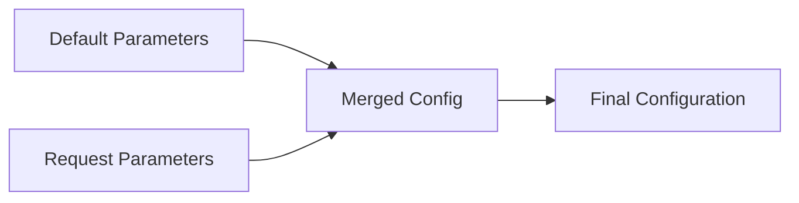
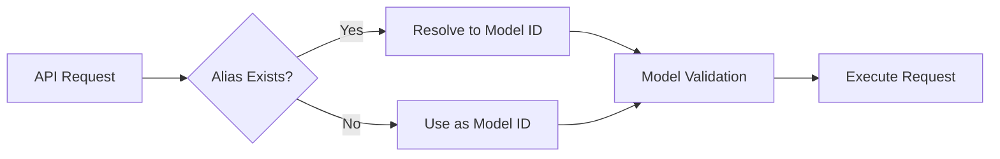

# Configuration Guide

stdapi.ai is configured entirely through environment variables, which are read once at startup and cannot be changed without restarting the service. This guide explains each setting category with practical examples to help you configure the service correctly.

**What you can configure:**

- **AWS regions** - Access models across multiple regions for availability and model selection
- **Data sovereignty** - Control which AWS regions are used for compliance (GDPR, HIPAA, etc.)
- **Storage** - S3 buckets for file operations, regional buckets for multi-region deployments
- **Authentication** - API keys via SSM or Secrets Manager for secure access control
- **Observability** - Logging levels, OpenTelemetry, request/response debugging
- **Security** - CORS, proxy headers, trusted hosts for production deployments
- **Performance** - Caching, model overrides, S3 acceleration
- **TLS / SSL** - End-to-end encryption using Granian environment variables

!!! tip "Zero Configuration Startup"
    stdapi.ai works out of the box with zero configuration. The service automatically detects your current AWS region and discovers available Bedrock models.

!!! info "Prerequisites"
    Before configuring stdapi.ai, ensure you have:

    - **AWS Account** with access to Amazon Bedrock
    - **AWS Credentials** configured via environment variables, AWS CLI, or IAM role (for EC2/ECS/Lambda deployments)
    - **IAM Permissions** to access required AWS services (see [IAM Permissions](#iam-permissions) section)
    - **S3 Bucket** (optional, but recommended for production use with file operations)

!!! info "Container Runtime"
    Both the AWS Marketplace and community Docker images run using [Granian](https://github.com/emmett-framework/granian), a high-performance Python ASGI server. In addition to the stdapi.ai-specific configuration variables documented below, you can also use Granian environment variables to configure the server runtime (e.g., `GRANIAN_PORT`, `GRANIAN_WORKERS`, `GRANIAN_THREADS`, etc.).

## Quick Start

For production deployments, configure these essential settings:

### Minimal Production Setup

Single-region deployment with file storage only.

```bash
# S3 bucket for file storage (must be in same region as your server)
export AWS_S3_BUCKET=my-stdapi-bucket

# AWS_BEDROCK_REGIONS is optional - will auto-detect your current AWS region if not specified
```

### Production with Authentication

Adds secure API key authentication via AWS Systems Manager.

```bash
# S3 bucket for file storage (must be in same region as your server)
export AWS_S3_BUCKET=my-stdapi-bucket

# Secure API authentication (recommended: SSM Parameter Store)
export API_KEY_SSM_PARAMETER=/stdapi/prod/api-key

# AWS_BEDROCK_REGIONS is optional - will auto-detect your current AWS region if not specified
```

### Full Production Setup (All Features Enabled)

Multi-region deployment with all AWS AI services, observability, and security features.

```bash
# Core AWS configuration - host server in first region
export AWS_BEDROCK_REGIONS=us-east-1,us-west-2,eu-west-1

# S3 bucket for file storage (must be in us-east-1, your first/primary region)
export AWS_S3_BUCKET=my-stdapi-us-east-1-bucket

# Optional: Transcribe S3 bucket (defaults to AWS_S3_BUCKET if not specified)
# Only set this if you need a separate bucket or if transcribe is in a different region
# export AWS_TRANSCRIBE_S3_BUCKET=my-stdapi-transcribe-us-east-1

# Optional: Regional buckets for async/batch inference in other regions
export AWS_S3_REGIONAL_BUCKETS='{"us-west-2": "my-stdapi-us-west-2-bucket", "eu-west-1": "my-stdapi-eu-west-1-bucket"}'

# AWS AI services regions (optional - defaults to first AWS_BEDROCK_REGIONS if not specified)
export AWS_POLLY_REGION=us-east-1           # Text-to-speech
export AWS_TRANSCRIBE_REGION=us-east-1      # Speech-to-text (audio transcription)
export AWS_COMPREHEND_REGION=us-east-1      # Language detection
export AWS_TRANSLATE_REGION=us-east-1       # Text translation

# Authentication
export API_KEY_SSM_PARAMETER=/stdapi/prod/api-key

# Logging
export LOG_LEVEL=warning
export LOG_CLIENT_IP=true

# Optional: OpenTelemetry observability (AWS X-Ray integration)
# export OTEL_ENABLED=true
# export OTEL_SERVICE_NAME=stdapi-production
# export OTEL_SAMPLE_RATE=0.1

# Production security settings (when behind AWS ALB/CloudFront)
export ENABLE_PROXY_HEADERS=true

# Note: TRUSTED_HOSTS not recommended with AWS ALB - use ALB host-based routing instead
# Only use TRUSTED_HOSTS if you cannot configure host validation at the load balancer level

# Optional: CORS for browser-based web applications
# export CORS_ALLOW_ORIGINS='["https://app.example.com"]'
```

### Development Setup

Local development configuration with API documentation and debug logging enabled.

```bash
# Minimal configuration for local development
export AWS_S3_BUCKET=my-stdapi-dev-bucket

# Enable API documentation
export ENABLE_DOCS=true
export ENABLE_REDOC=true

# Full request/response logging for debugging
export LOG_LEVEL=info
export LOG_REQUEST_PARAMS=true

# AWS_BEDROCK_REGIONS is optional - will auto-detect your current AWS region if not specified
```

!!! warning "S3 Bucket Required for Certain Features"
    Without an S3 bucket configured, some features will be disabled (such as image output as URL, audio transcription). See the relevant API documentation for feature requirements.

!!! info "All Other Settings Are Optional"
    The configurations above are sufficient for most production deployments. All other settings can be configured as needed for your specific use case.

## Environment Variable Summary

This section provides a quick reference of all available configuration options. Detailed explanations for each variable can be found in the sections below.

### :material-star: Essential (Production)

| Variable                                      | Default        | Description                                                                          |
|-----------------------------------------------|----------------|--------------------------------------------------------------------------------------|
| [`AWS_S3_BUCKET`](#aws-s3-bucket)             | None           | Primary S3 bucket for file storage; must be in first region of `AWS_BEDROCK_REGIONS` |
| [`AWS_BEDROCK_REGIONS`](#aws-bedrock-regions) | Current region | Comma-separated regions for Bedrock; first region is where server should be hosted   |

### :material-aws: AWS Client

| Variable                                                | Default | Description                                                                                                 |
|---------------------------------------------------------|---------|-------------------------------------------------------------------------------------------------------------|
| [`AWS_ADAPTIVE_RETRY`](#aws-adaptive-retry)             | `false` | Enable adaptive retry mode that throttles back under congestion rather than using fixed exponential backoff |
| [`AWS_MAX_POOL_CONNECTIONS`](#aws-max-pool-connections) | `50`    | Maximum concurrent HTTP connections per AWS service client                                                  |
| [`AWS_CONNECT_TIMEOUT`](#aws-connect-timeout)           | `5`     | Timeout in seconds for establishing a connection to an AWS service endpoint                                 |

### :material-database: AWS Storage

| Variable                                                | Default         | Description                                                                                          |
|---------------------------------------------------------|-----------------|------------------------------------------------------------------------------------------------------|
| [`AWS_S3_ACCELERATE`](#aws-s3-accelerate)               | `false`         | Enable S3 Transfer Acceleration for faster global downloads via CloudFront edge locations            |
| [`AWS_S3_REGIONAL_BUCKETS`](#aws-s3-regional-buckets)   | `{}`            | Region-specific S3 buckets for Bedrock async/batch inference operations                              |
| [`AWS_S3_ACCEPTED_BUCKETS`](#aws-s3-accepted-buckets)   | `{}`            | External S3 buckets with read access, mapped to their region for S3 URI conversion and routing       |
| [`AWS_S3_TMP_PREFIX`](#aws-s3-tmp-prefix)               | `tmp/`          | S3 prefix for temporary files used for jobs; configure lifecycle policies on this prefix             |
| [`AWS_S3_FILES_PREFIX`](#aws-s3-files-prefix)           | `files/`        | S3 prefix for Files API objects; configure S3 lifecycle policies on this prefix                     |
| [`AWS_S3_VIDEOS_PREFIX`](#aws-s3-videos-prefix)         | `videos/`       | S3 prefix for generated videos (Videos API); persists until deleted through the API                  |
| [`AWS_S3_VIDEOS_EXPIRES_AFTER`](#aws-s3-videos-expires-after) | Unset     | Retention period in seconds for generated videos; sets `Video.expires_at` and blocks expired downloads |
| [`AWS_TRANSCRIBE_S3_BUCKET`](#aws-transcribe-s3-bucket) | `AWS_S3_BUCKET` | S3 bucket for temporary audio transcription files; must be in same region as `AWS_TRANSCRIBE_REGION` |

### :material-robot: AWS AI Services

| Variable                                          | Default                     | Description                                                 |
|---------------------------------------------------|-----------------------------|-------------------------------------------------------------|
| [`AWS_POLLY_REGION`](#aws-polly-region)           | All `AWS_BEDROCK_REGIONS`   | Region for Amazon Polly; unset = per-engine regional discovery with automatic failover |
| [`AWS_COMPREHEND_REGION`](#aws-comprehend-region) | All `AWS_BEDROCK_REGIONS`   | Region for Amazon Comprehend language detection; unset = automatic failover across all Bedrock regions |
| [`AWS_TRANSCRIBE_REGION`](#aws-transcribe-region) | All `AWS_BEDROCK_REGIONS`   | Region for Amazon Transcribe; unset = failover across Bedrock regions with a co-located bucket |
| [`AWS_TRANSLATE_REGION`](#aws-translate-region)   | All `AWS_BEDROCK_REGIONS`   | Region for Amazon Translate; unset = automatic failover across all Bedrock regions |

### :material-directions-fork: Resilience & Failover

| Variable                                                                                                | Default   | Description                                                                                                              |
|---------------------------------------------------------------------------------------------------------|-----------|--------------------------------------------------------------------------------------------------------------------------|
| [`AWS_BEDROCK_REGION_ROUTING`](#bedrock-region-routing)                                                 | `ordered` | Region routing strategy: `disabled`, `ordered`, `lowest_latency`, or `round_robin` ([details](operations_resilience.md)) |
| [`AWS_BEDROCK_REGION_ROUTING_QUOTA_BACKOFF_SECONDS`](#bedrock-region-routing-quota-backoff)             | `60`      | Base interval in seconds for exponential quota backoff per region                                                        |
| [`AWS_BEDROCK_REGION_ROUTING_MAX_QUOTA_BACKOFF_SECONDS`](#bedrock-region-routing-max-quota-backoff)     | `3600`    | Hard ceiling in seconds on the exponential quota backoff per region (default: 1 hour)                                    |
| [`AWS_BEDROCK_REGION_ROUTING_QUOTA_STALE_FACTOR`](#bedrock-region-routing-quota-stale-factor)           | `2`       | Multiplier on max quota backoff to determine when the consecutive-error counter resets                                   |
| [`AWS_BEDROCK_REGION_ROUTING_UNAVAILABLE_BACKOFF_SECONDS`](#bedrock-region-routing-unavailable-backoff) | `30`      | Seconds to avoid a region after unavailability errors                                                                    |
| [`AWS_BEDROCK_MAX_RETRIES`](#bedrock-max-retries)                                                       | `9`       | Total retries across all regions per Bedrock invocation; retries cycle through regions in order                          |

### :material-shield-check: Bedrock Advanced

| Variable                                                                                          | Default | Description                                                                                         |
|---------------------------------------------------------------------------------------------------|---------|-----------------------------------------------------------------------------------------------------|
| [`AWS_BEDROCK_CROSS_REGION_INFERENCE`](#cross-region-inference)                                   | `true`  | Allow automatic model routing to other configured regions                                           |
| [`AWS_BEDROCK_CROSS_REGION_INFERENCE_GLOBAL`](#cross-region-global)                               | `true`  | Allow global cross-region inference routing to any region worldwide (disable for GDPR compliance)   |
| [`AWS_BEDROCK_MODEL_REGION_RESTRICT`](#bedrock-model-region-restrict)                             | `{}`    | Restrict a model to specific region(s) only (e.g. for region-specific features like Nova grounding) |
| [`AWS_BEDROCK_LEGACY`](#bedrock-legacy)                                                           | `false` | Allow usage of deprecated/legacy Bedrock models                                                     |
| [`AWS_BEDROCK_DEPRECATED_MODEL_FALLBACK`](#bedrock-deprecated-model-fallback)                     | `true`  | Transparently reroute requests using a deprecated model ID to its recommended replacement           |
| [`AWS_BEDROCK_DEPRECATED_MODELS`](#bedrock-deprecated-models)                                     | `{}`    | Additional deprecated model mappings merged with the built-in registry at startup                   |
| [`AWS_BEDROCK_MARKETPLACE_AUTO_SUBSCRIBE`](#bedrock-marketplace-auto-subscribe)                   | `true`  | Allow automatic subscription to new models in AWS Marketplace                                       |
| [`AWS_BEDROCK_ALLOW_CROSS_REGION_INFERENCE_PROFILE_ARN`](#bedrock-allow-cross-region-profile-arn) | `false` | Allow users to pass cross-region inference profile ARNs directly as model IDs                       |
| [`AWS_BEDROCK_ALLOW_APPLICATION_INFERENCE_PROFILE_ARN`](#bedrock-allow-application-profile-arn)   | `false` | Allow users to pass application inference profile ARNs directly as model IDs                        |
| [`AWS_BEDROCK_ALLOW_PROMPT_ROUTER_ARN`](#bedrock-allow-prompt-router-arn)                         | `false` | Allow users to pass prompt router ARNs directly as model IDs                                        |
| [`AWS_BEDROCK_MODEL_ARN_MAPPING`](#bedrock-model-arn-mapping)                                     | `{}`    | Map model IDs to custom inference profile or prompt router ARNs (server-controlled routing)         |
| [`AWS_BEDROCK_GUARDRAIL_IDENTIFIER`](#aws-bedrock-guardrail-identifier)                           | None    | Bedrock Guardrails ID for content filtering and safety controls                                     |
| [`AWS_BEDROCK_GUARDRAIL_VERSION`](#aws-bedrock-guardrail-version)                                 | None    | Bedrock Guardrails version number (required with identifier)                                        |
| [`AWS_BEDROCK_GUARDRAIL_TRACE`](#aws-bedrock-guardrail-trace)                                     | None    | Guardrails trace level: `disabled`, `enabled`, or `enabled_full`                                    |
| [`AWS_BEDROCK_ALLOW_GUARDRAIL_OVERRIDE`](#aws-bedrock-allow-guardrail-override)                   | `false` | Allow users to override global guardrail configuration via request headers (security: default off)  |
| [`AWS_BEDROCK_SESSION_ENCRYPTION_KEY_ARN`](#aws-bedrock-session-encryption-key-arn)               | None    | KMS key ARN encrypting AWS Bedrock session storage (Responses API `store=true`)                     |

### :material-lock: Authentication

Choose **one** method (mutually exclusive):

| Variable                                                          | Default   | Description                                                        |
|-------------------------------------------------------------------|-----------|--------------------------------------------------------------------|
| [`API_KEY_SSM_PARAMETER`](#api-key-ssm)                           | None      | AWS Systems Manager Parameter Store path for API key (recommended) |
| [`API_KEY_SECRETSMANAGER_SECRET`](#api-key-secretsmanager-secret) | None      | AWS Secrets Manager secret name containing API key                 |
| [`API_KEY_SECRETSMANAGER_KEY`](#api-key-secretsmanager-key)       | `api_key` | JSON key name within Secrets Manager secret                        |
| [`API_KEY`](#api-key)                                             | None      | Direct API key value (not recommended for production)              |

### :material-api: API Compatibility

| Variable                                              | Default      | Description                                          |
|-------------------------------------------------------|--------------|------------------------------------------------------|
| [`OPENAI_ROUTES_PREFIX`](#openai-routes-prefix)       |              | Base path prefix for OpenAI-compatible API routes    |
| [`ANTHROPIC_ROUTES_PREFIX`](#anthropic-routes-prefix) | `/anthropic` | Base path prefix for Anthropic-compatible API routes |
| [`COHERE_ROUTES_PREFIX`](#cohere-routes-prefix)       | `/cohere`    | Base path prefix for Cohere-compatible API routes    |

### :material-chart-line: Logging

| Variable                                        | Default | Description                                                                           |
|-------------------------------------------------|---------|---------------------------------------------------------------------------------------|
| [`LOG_LEVEL`](#logging-level)                   | `info`  | Minimum log severity: `info`, `warning`, `error`, `critical`, or `disabled`           |
| [`LOG_REQUEST_PARAMS`](#validation-and-logging) | `false` | Include request/response parameters in logs (not recommended for production)          |
| [`LOG_CLIENT_IP`](#client-ip-logging)           | `false` | Log client IP addresses (requires `ENABLE_PROXY_HEADERS` for real IPs behind proxies) |

### :material-chart-box-outline: CloudWatch Metrics

| Variable                                                            | Default  | Description                                                            |
|-----------------------------------------------------------------------|----------|--------------------------------------------------------------------|
| [`CLOUDWATCH_METRICS`](#cloudwatch-metrics)                     | `false`  | Emit per-request AWS-billed usage as CloudWatch EMF log lines      |
| [`CLOUDWATCH_METRICS_NAMESPACE`](#cloudwatch-metrics-namespace) | `stdapi` | CloudWatch namespace for the emitted usage metrics                 |

### :material-currency-usd: Cost Tracking

| Variable                                                    | Default        | Description                                                              |
|-----------------------------------------------------------------|----------------|-----------------------------------------------------------------------|
| [`COST_TRACKING`](#cost-tracking)                           | `false`        | Enable real-time cost computation from live AWS pricing                |
| [`COST_PRICE_OVERRIDES`](#cost-price-overrides)             | `{}`           | JSON map of operator-supplied unit prices for models missing from the AWS catalog |

### :material-radar: Observability (OpenTelemetry)

| Variable                                            | Default                           | Description                                                                            |
|-----------------------------------------------------|-----------------------------------|----------------------------------------------------------------------------------------|
| [`OTEL_ENABLED`](#otel-enabled)                     | `false`                           | Enable distributed tracing via OpenTelemetry (integrates with AWS X-Ray, Jaeger, etc.) |
| [`OTEL_SERVICE_NAME`](#otel-service-name)           | `stdapi.ai`                       | Service name identifier in trace visualizations                                        |
| [`OTEL_EXPORTER_ENDPOINT`](#otel-exporter-endpoint) | `http://127.0.0.1:4318/v1/traces` | OTLP HTTP endpoint URL for trace export                                                |
| [`OTEL_SAMPLE_RATE`](#otel-sample-rate)             | `1.0`                             | Trace sampling rate from 0.0 (none) to 1.0 (all requests)                              |

### :material-web: HTTP/Security

| Variable                                                                            | Default  | Description                                                                           |
|-------------------------------------------------------------------------------------|----------|---------------------------------------------------------------------------------------|
| [`CORS_ALLOW_ORIGINS`](#cors-allow-origins)                                         | None     | JSON array of allowed origins for browser cross-origin requests                       |
| [`TRUSTED_HOSTS`](#trusted-hosts)                                                   | None     | JSON array of trusted Host header values (prefer ALB host-based routing; see details) |
| [`ENABLE_PROXY_HEADERS`](#enable-proxy-headers)                                     | `false`  | Trust X-Forwarded-* headers from reverse proxies (only enable behind trusted proxy)   |
| [`PROXY_TRUSTED_HOSTS`](#proxy-trusted-hosts)                                       | `*`      | Peer IPs/ranges whose X-Forwarded-* headers are trusted (restrict from `*` for safety) |
| [`GRANIAN_SSL_CERTIFICATE`](#graniansslcertificate)                                 | None     | Path to SSL certificate file for end-to-end encryption                                |
| [`GRANIAN_SSL_KEYFILE`](#graniansslkeyfile)                                         | None     | Path to SSL private key file (PKCS#8) for end-to-end encryption                       |
| [`GRANIAN_SSL_KEYFILE_PASSWORD`](#graniansslkeyfilepassword)                        | None     | Password for the SSL private key file                                                 |
| [`GRANIAN_SSL_PROTOCOL_MIN`](#graniansslprotocolmin)                                | `tls1.3` | Minimum supported TLS version (`tls1.2` or `tls1.3`)                                  |
| [`GRANIAN_SSL_CA`](#graniansslca)                                                   | None     | Path to CA certificate bundle for client verification (mTLS)                          |
| [`GRANIAN_SSL_CLIENT_VERIFY`](#graniansslclientverify)                              | `false`  | Enable client certificate verification (mTLS)                                         |
| [`ENABLE_GZIP`](#enable-gzip)                                                       | `false`  | Enable GZip compression for responses >1KB (prefer AWS ALB/CloudFront compression)    |
| [`SSRF_PROTECTION_BLOCK_PRIVATE_NETWORKS`](#ssrf-protection-block-private-networks) | `true`   | Block requests to private/local networks for SSRF protection                          |
| [`MAX_INPUT_FILE_SIZE`](#max-input-file-size)                                       | `0`      | Maximum size in bytes of an inline input file loaded into memory (`0` disables)        |
| [`MAX_CONCURRENT_INPUT_DOWNLOADS`](#max-concurrent-input-downloads)                 | `8`      | Maximum input files fetched/resolved concurrently per request                          |

### :material-cog: Application Behavior

| Variable                                                            | Default                 | Description                                                                                |
|---------------------------------------------------------------------|-------------------------|--------------------------------------------------------------------------------------------|
| [`TIMEZONE`](#validation-and-logging)                               | `UTC`                   | IANA timezone identifier for request timestamps                                            |
| [`STRICT_INPUT_VALIDATION`](#validation-and-logging)                | `false`                 | Reject API requests with unknown/extra fields                                              |
| [`MODEL_ALIASES`](#model-aliases)                                   | `{}`                    | JSON object mapping custom model name aliases to Bedrock model IDs                         |
| [`DEFAULT_TTS_MODEL`](#default-tts-model)                           | `amazon.polly-standard` | Default text-to-speech model: `standard`, `neural`, `long-form`, or `generative`           |
| [`DEFAULT_TTS_LANGUAGE`](#default-tts-language)                     | None                    | Default language for TTS (e.g., `en-US`); when set, skips AWS Comprehend auto-detection    |
| [`TOKENS_ESTIMATION`](#tokens-estimation)                           | `false`                 | Deprecated and ignored (token estimation removed)                                          |
| [`TOKENS_ESTIMATION_DEFAULT_ENCODING`](#tokens-encoding)            | `o200k_base`            | Deprecated and ignored (token estimation removed)                                          |
| [`DEFAULT_MODEL_PARAMS`](#default-model-params)                     | `{}`                    | JSON object with per-model default inference parameters (temperature, max_tokens, etc.)    |
| [`DEFAULT_MODEL_SERVICE_TIERS`](#default-model-service-tiers)       | `{}`                    | JSON object with per-model default service tiers (default, flex, priority, reserved)        |
| [`MODEL_CACHE_SECONDS`](#model-cache-seconds)                       | `900`                   | Model list cache lifetime in seconds before lazy refresh (default: 15 minutes)             |
| [`AI_RESPONSE_TIMEOUT`](#ai-response-timeout)                       | `600`                   | Maximum seconds to wait for a model to complete a response (default: 10 minutes)           |
| [`DROP_UNSUPPORTED_SYSTEM_PROMPT`](#drop-unsupported-system-prompt) | `true`                  | Drop system prompts for unsupported models; when `false`, return error instead             |
| [`ANTHROPIC_BETA_FILTER`](#anthropic-beta-filter)                   | `true`                  | Enable filtering of unsupported `anthropic_beta` flags for Claude models                   |
| [`ANTHROPIC_BETA_ALLOWLIST`](#anthropic-beta-allowlist)             | `(empty)`               | Additional `anthropic_beta` flags to allow beyond built-in Bedrock defaults                |
| [`IMAGE_GENERATION_MODEL`](#image-generation-model)                 | `(empty)`               | Default Bedrock image model ID used when the `image_generation` Responses API tool is invoked |

### :material-file-document: API Documentation

| Variable                                      | Default | Description                                                                      |
|-----------------------------------------------|---------|----------------------------------------------------------------------------------|
| [`ENABLE_DOCS`](#enable-docs)                 | `false` | Enable interactive Swagger UI documentation at `/docs`                           |
| [`ENABLE_REDOC`](#enable-redoc)               | `false` | Enable ReDoc documentation UI at `/redoc`                                        |
| [`ENABLE_OPENAPI_JSON`](#enable-openapi-json) | `false` | Enable OpenAPI schema endpoint at `/openapi.json` (auto-enabled with docs/redoc) |

### :material-connection: MCP (Model Context Protocol)

| Variable                                                            | Default | Description                                                                             |
|---------------------------------------------------------------------|---------|-----------------------------------------------------------------------------------------|
| [`ENABLE_MCP_STREAMABLE_HTTP`](#enable-mcp-streamable-http)         | `false` | Enable MCP server via Streamable HTTP at `/mcp` — recommended transport                 |
| [`ENABLE_MCP_SSE`](#enable-mcp-sse)                                 | `false` | Enable MCP server via Server-Sent Events at `/sse` — legacy transport for older clients |
| [`MCP_INCLUDE_TOOLS`](#mcp-include-tools)                           | None    | Comma-separated tool names to expose exclusively; all others are hidden                 |
| [`MCP_EXCLUDE_TOOLS`](#mcp-exclude-tools)                           | None    | Comma-separated tool names to hide; all others remain exposed                           |

---

## AWS Services and Regions

### General Configuration

#### `AWS_ADAPTIVE_RETRY` { #aws-adaptive-retry }

:octicons-package-24: **Purpose**
:   Enable adaptive retry mode that adjusts retry pacing based on observed error rates across all AWS service calls

:octicons-database-24: **Type**
:   Boolean (`true` / `false`)

:octicons-gear-24: **Default**
:   `false`

:octicons-workflow-24: **Behavior**
:   When enabled, the retry strategy dynamically responds to real-time congestion signals. If errors are occurring frequently, retries are spaced further apart to avoid amplifying load on an already-stressed endpoint. Once conditions improve, the pacing returns to normal. When disabled, retries follow a standard exponential backoff strategy with fixed intervals. Applies to all AWS services (Bedrock, S3, Polly, Transcribe, etc.).

!!! warning "Latency Impact"
    Adaptive retry can increase the latency of individual requests when throttling is detected, as the client intentionally delays retries to shed load. Avoid enabling it for latency-sensitive, low-traffic workloads.

```bash
# Default: standard exponential backoff
export AWS_ADAPTIVE_RETRY=false

# Enable adaptive retry (recommended under sustained high load)
export AWS_ADAPTIVE_RETRY=true
```

!!! tip "When to enable"
    Adaptive retry is most beneficial when many clients share the same endpoint and sustained congestion is likely. It paces retries based on real-time error signals, reducing the risk of retry storms — at the cost of potentially higher per-request latency under load. For low-traffic or latency-sensitive workloads the default standard mode is preferable.

#### `AWS_MAX_POOL_CONNECTIONS` { #aws-max-pool-connections }

:octicons-package-24: **Purpose**
:   Maximum number of concurrent HTTP connections per AWS service client

:octicons-database-24: **Type**
:   Integer (must be > 0)

:octicons-gear-24: **Default**
:   `50`

:octicons-workflow-24: **Behavior**
:   Each AWS service client (one per service per region) maintains its own connection pool up to this limit. Under high concurrency, increasing this value prevents requests from queuing for an available connection. Setting it too high may exhaust system file descriptors.

```bash
# Default
export AWS_MAX_POOL_CONNECTIONS=50

# High-concurrency deployment
export AWS_MAX_POOL_CONNECTIONS=100
```

#### `AWS_CONNECT_TIMEOUT` { #aws-connect-timeout }

:octicons-package-24: **Purpose**
:   Timeout in seconds for establishing a connection to an AWS service endpoint

:octicons-database-24: **Type**
:   Integer (must be > 0)

:octicons-gear-24: **Default**
:   `5`

:octicons-workflow-24: **Behavior**
:   Limits how long the client waits when opening a new connection. A short value allows fast failover to another region when an endpoint is unreachable. Increase it only if you see spurious connection timeouts on high-latency networks.

```bash
# Default: 5 seconds
export AWS_CONNECT_TIMEOUT=5

# High-latency network
export AWS_CONNECT_TIMEOUT=10
```

### Storage Configuration

#### `AWS_S3_BUCKET` { #aws-s3-bucket }

:octicons-package-24: **Purpose**
:   Primary S3 bucket for storing generated files (images, audio, documents) and temporary data during processing

:octicons-gear-24: **Default**
:   None (must be configured for file operations)

:octicons-check-circle-24: **Best Practice**
:   The bucket must be in the first region specified in `AWS_BEDROCK_REGIONS` (your primary region where the server should be hosted) to avoid cross-region data transfer costs and reduce latency

```bash
export AWS_S3_BUCKET=my-llm-storage-us-east-1
```

!!! tip "Presigned URLs"
    Files are served via presigned URLs for secure, time-limited access. Presigned URLs expire after 1 hour by default.

!!! info "Terraform Module"
    When using the Terraform module, the main S3 bucket is created automatically — no manual configuration required.

!!! warning "Startup Warning"
    If not set, a warning is logged at startup and features that require file storage (image generation, audio output, document processing) will be unavailable.

#### `AWS_S3_ACCELERATE` { #aws-s3-accelerate }

:octicons-package-24: **Purpose**
:   Enable S3 Transfer Acceleration for presigned URLs to improve download performance for large files

:octicons-database-24: **Type**
:   Boolean

:octicons-gear-24: **Default**
:   `false`

:octicons-check-circle-24: **Best Practice**
:   Enable when serving large files (high-resolution images, audio) to geographically distributed users

```bash
export AWS_S3_ACCELERATE=true
```

!!! info "What is S3 Transfer Acceleration?"
    S3 Transfer Acceleration uses Amazon CloudFront's globally distributed edge locations to accelerate uploads and downloads to S3 buckets. When enabled, data is routed to the nearest edge location and then transferred to S3 over Amazon's optimized network paths.

    **Performance Benefits:**

    - :material-speedometer: **Faster downloads** for users far from your bucket's region
    - :material-earth: **Global reach** via CloudFront edge locations
    - :material-upload-network: **Optimized routing** over Amazon's private backbone network
    - :material-chart-line: **Consistent performance** regardless of user location

    Typical speed improvements: 50-500% faster for users located far from the bucket region.

!!! warning "Requirements"
    1. **Enable Transfer Acceleration** on your S3 bucket before setting this option:
       ```bash
       aws s3api put-bucket-accelerate-configuration \
         --bucket my-stdapi-bucket \
         --accelerate-configuration Status=Enabled
       ```
    2. **Additional costs**: Transfer Acceleration incurs extra data transfer fees. See [AWS S3 Transfer Acceleration pricing](https://aws.amazon.com/s3/pricing/)

!!! tip "When to Enable"
    Consider enabling S3 Transfer Acceleration when:

    - :material-image: Serving generated images via [Images API](api_openai_images_generations.md)
    - :material-earth-arrow-right: Users are geographically distributed across multiple continents
    - :material-file-image: Generating high-resolution images that are large in file size
    - :material-speedometer: Download performance is critical to user experience

    For small images or users close to your bucket region, the performance benefit may not justify the additional cost.

!!! info "Current Usage"
    Presigned URLs with Transfer Acceleration are currently only used for the [Images API](api_openai_images_generations.md) when returning generated images as URLs.

#### `AWS_S3_TMP_PREFIX` { #aws-s3-tmp-prefix }

:octicons-package-24: **Purpose**
:   S3 prefix (folder path) for temporary files used during job processing

:octicons-gear-24: **Default**
:   `tmp/`

:octicons-check-circle-24: **Best Practice**
:   Configure S3 lifecycle policies to automatically delete objects under this prefix after 1 day

```bash
export AWS_S3_TMP_PREFIX=tmp/
```

!!! info "What is an S3 Prefix?"
    An S3 prefix is essentially a folder path within your S3 bucket. When you set `AWS_S3_TMP_PREFIX=tmp/`, all temporary files are stored under the `tmp/` folder structure in your bucket.

    **Example file paths:**

    - With prefix `tmp/`: `s3://my-bucket/tmp/request-id-123/output.json`
    - With prefix `temporary/`: `s3://my-bucket/temporary/request-id-123/output.json`
    - With empty prefix ``: `s3://my-bucket/request-id-123/output.json` (not recommended)

!!! tip "Why Use a Prefix?"
    Using a dedicated prefix for temporary files provides several benefits:

    - :material-auto-fix: **Easy Lifecycle Management** - Apply S3 lifecycle policies to automatically delete only temporary files
    - :material-file-tree: **Better Organization** - Keep temporary files separate from permanent storage
    - :material-shield-check: **Security** - Apply different IAM policies or bucket policies to the prefix
    - :material-cash: **Cost Control** - Easily identify and monitor temporary storage costs

!!! warning "Trailing Slash"
    Always include a trailing slash (`/`) in your prefix to create a proper folder structure. Without it, files will be stored with the prefix as part of the filename rather than in a folder.

    - ✅ Correct: `tmp/` → Files stored as `tmp/file.json`
    - ❌ Incorrect: `tmp` → Files stored as `tmpfile.json`

**Custom prefix examples:**

```bash
# Production environment
export AWS_S3_TMP_PREFIX=prod/tmp/

# Staging environment
export AWS_S3_TMP_PREFIX=staging/tmp/

# Organize by date (requires manual updates)
export AWS_S3_TMP_PREFIX=tmp/2025/01/

# No prefix (store at bucket root - not recommended)
export AWS_S3_TMP_PREFIX=
```

#### `AWS_S3_FILES_PREFIX` { #aws-s3-files-prefix }

:octicons-package-24: **Purpose**
:   S3 prefix (folder path) for Files API objects (OpenAI and Anthropic `/v1/files` endpoints)

:octicons-gear-24: **Default**
:   `files/`

:octicons-check-circle-24: **Best Practice**
:   Configure an `AbortIncompleteMultipartUpload` S3 lifecycle rule on this prefix to clean up abandoned upload parts, and apply Intelligent-Tiering for cost optimisation

```bash
export AWS_S3_FILES_PREFIX=files/
```

!!! info "What is an S3 Prefix?"
    An S3 prefix is a folder path within your S3 bucket. When you set `AWS_S3_FILES_PREFIX=files/`, all Files API objects are stored under that folder in your bucket.

    **Example file paths:**

    - With prefix `files/`: `s3://my-bucket/files/file-0190c51c7de7455d9b8c2efe27dfbf67`
    - With prefix `uploads/files/`: `s3://my-bucket/uploads/files/file-0190...`
    - With empty prefix ``: `s3://my-bucket/file-0190...` (not recommended)

!!! warning "Trailing Slash"
    Always include a trailing slash (`/`) in your prefix to create a proper folder structure.

    - ✅ Correct: `files/` → Objects stored as `files/file-0190...`
    - ❌ Incorrect: `files` → Objects stored as `filesfile-0190...`

**Custom prefix examples:**

```bash
# Production environment
export AWS_S3_FILES_PREFIX=prod/files/

# Staging environment
export AWS_S3_FILES_PREFIX=staging/files/

# No prefix (store at bucket root - not recommended)
export AWS_S3_FILES_PREFIX=
```

#### `AWS_S3_VIDEOS_PREFIX` { #aws-s3-videos-prefix }

:octicons-package-24: **Purpose**
:   S3 prefix (folder path) for videos generated through the [Videos API](api_openai_videos.md)

:octicons-gear-24: **Default**
:   `videos/`

:octicons-check-circle-24: **Best Practice**
:   Generated videos persist until deleted through the API — configure an S3 lifecycle rule on this prefix to cap storage costs

```bash
export AWS_S3_VIDEOS_PREFIX=videos/
```

AWS Bedrock writes each video generation job's output (MP4 and manifest) under this prefix, in a folder named after the job. Because AWS Bedrock requires the output bucket to be in the same region as the invocation, videos are stored in the [`AWS_S3_REGIONAL_BUCKETS`](#aws-s3-regional-buckets) bucket of the region that served the job.

#### `AWS_S3_VIDEOS_EXPIRES_AFTER` { #aws-s3-videos-expires-after }

:octicons-package-24: **Purpose**
:   Retention period in seconds (minimum `3600`) for videos generated through the [Videos API](api_openai_videos.md)

:octicons-gear-24: **Default**
:   Unset — videos never expire and persist until deleted through the API

:octicons-check-circle-24: **Best Practice**
:   Pair with an S3 Lifecycle expiration rule on [`AWS_S3_VIDEOS_PREFIX`](#aws-s3-videos-prefix) covering the same duration (rounded up to whole days) so the objects are actually deleted

```bash
# Expire generated videos after 24 hours
export AWS_S3_VIDEOS_EXPIRES_AFTER=86400
```

When set, the `Video` object reports `expires_at` (job completion time plus this value) and downloading expired video content returns a 404. The server enforces expiry at the API level only; the paired S3 Lifecycle rule performs the physical cleanup.

#### `AWS_TRANSCRIBE_S3_BUCKET` { #aws-transcribe-s3-bucket }

:octicons-package-24: **Purpose**
:   Temporary S3 bucket for transcription workflows

:octicons-gear-24: **Default**
:   Falls back to `AWS_S3_BUCKET` if not specified

:octicons-alert-24: **Requirement**
:   Must be in the same region as `AWS_TRANSCRIBE_REGION` when that is set; with the default multi-region behavior it serves the primary Bedrock region, and [`AWS_S3_REGIONAL_BUCKETS`](#aws-s3-regional-buckets) entries serve the other candidate regions

```bash
# If AWS_TRANSCRIBE_REGION is us-east-1
export AWS_TRANSCRIBE_S3_BUCKET=my-transcribe-temp-us-east-1

# If AWS_TRANSCRIBE_REGION is eu-west-1
export AWS_TRANSCRIBE_S3_BUCKET=my-transcribe-temp-eu-west-1
```

#### `AWS_S3_REGIONAL_BUCKETS` { #aws-s3-regional-buckets }

:octicons-package-24: **Purpose**
:   Region-specific S3 buckets for Bedrock async and batch inference operations

:octicons-gear-24: **Default**
:   Empty (no regional buckets configured)

:octicons-code-24: **Format**
:   JSON object with region names as keys and bucket names as values

:octicons-alert-24: **Requirement**
:   Some Bedrock models require S3 buckets in the same region for async and batch inference operations

```bash
export AWS_S3_REGIONAL_BUCKETS='{"us-east-1": "my-bedrock-temp-us-east-1", "eu-west-1": "my-bedrock-temp-eu-west-1"}'
```

!!! info "When to Use"
    Configure this setting when:

    - Using Bedrock async inference API
    - Using Bedrock batch inference API
    - Working with models that require regional S3 storage

    If not specified for a region where async/batch operations are attempted, those operations may fail.

!!! success "Automatic Fallback"
    For the first region in `AWS_BEDROCK_REGIONS` (your primary region), if no regional bucket is specified, the service automatically falls back to `AWS_S3_BUCKET`. You only need to configure regional buckets for additional regions beyond your primary one.

!!! info "Terraform Module"
    When using the Terraform module, regional S3 buckets are created automatically for each region in `aws_bedrock_regions`. The bucket names are exposed via the `aws_s3_regional_buckets` output and passed to the container as `AWS_S3_REGIONAL_BUCKETS`. No manual configuration required.

!!! tip "Best Practice"
    Apply the same [S3 Bucket Lifecycle Configuration](#s3-lifecycle) to these regional buckets as you would for the primary bucket to automatically clean up temporary files.

#### `AWS_S3_ACCEPTED_BUCKETS` { #aws-s3-accepted-buckets }

:octicons-package-24: **Purpose**
:   Declare external S3 buckets that the application has read access to, mapped to their AWS region

:octicons-database-24: **Type**
:   JSON object (keys: bucket names, values: AWS region identifiers)

:octicons-gear-24: **Default**
:   `{}` (empty — only the application's own buckets are recognized)

:octicons-workflow-24: **Behavior**
:   Buckets listed here are recognized for two purposes:

    - **S3 HTTP URL to S3 URI conversion** — When a user passes an S3 HTTP URL (including presigned URLs) for one of these buckets, it is automatically converted to an `s3://` URI so Bedrock can access the object directly.
    - **Region-aware routing** — The router knows the region of these buckets and can factor it into region selection to minimize cross-region data transfer.

    Without this setting, only the application's own buckets (`AWS_S3_BUCKET` and `AWS_S3_REGIONAL_BUCKETS`) are recognized.

```bash
export AWS_S3_ACCEPTED_BUCKETS='{"my-data-bucket": "us-east-1", "my-eu-bucket": "eu-west-1"}'
```

!!! warning "Required IAM Permissions"
    The application's IAM role must have `s3:GetObject` permission on each declared bucket. Granting access at the bucket level is recommended:

    ```json
    {
      "Effect": "Allow",
      "Action": "s3:GetObject",
      "Resource": [
        "arn:aws:s3:::my-data-bucket/*",
        "arn:aws:s3:::my-eu-bucket/*"
      ]
    }
    ```

!!! tip "When to Use"
    Configure this when your users provide S3 URLs from buckets outside the application's own buckets. This enables automatic HTTP-to-S3 URI conversion and optimal region routing for those objects.

#### S3 Bucket Lifecycle Configuration { #s3-lifecycle }

:octicons-package-24: **Purpose**
:   Configure automatic deletion of temporary files and abandoned multipart upload parts to minimize storage costs

:octicons-clock-24: **Recommendation**
:   Configure S3 lifecycle policies to automatically delete objects under the `AWS_S3_TMP_PREFIX` after 1 day, and abort incomplete multipart uploads under the `AWS_S3_FILES_PREFIX` after 1 day

stdapi.ai stores temporary files under the prefix configured by `AWS_S3_TMP_PREFIX` (default: `tmp/`). These include generated images, audio files, and transcription workflow files. Configure S3 lifecycle policies to automatically delete objects under this prefix after 1 day.

Additionally, multipart file uploads (OpenAI Uploads API) store parts under `AWS_S3_FILES_PREFIX` (default: `files/`). If a session is never completed or cancelled — for example when a client disconnects — the uploaded parts remain in S3 and accumulate costs. Add an `AbortIncompleteMultipartUpload` rule on the files prefix to clean these up automatically.

!!! info "Application Cleanup Behavior"
    **Short-lived temporary files:** The application attempts to clean up short-lived temporary files (such as intermediate transcription files) after processing completes.

    **Results shared with clients:** Files shared with clients using presigned URLs (such as generated images and audio) are never cleaned up automatically by the application. These files remain in S3 until removed by lifecycle policies or manual deletion.

    **Why lifecycle policies are essential:** Since the application cannot determine when a client has finished using a presigned URL, S3 lifecycle policies are the recommended mechanism to clean up these files and prevent unbounded storage growth.

```json
{
  "Rules": [
    {
      "Id": "DeleteTemporaryFiles",
      "Status": "Enabled",
      "Filter": {
        "Prefix": "tmp/"
      },
      "Expiration": {
        "Days": 1
      },
      "AbortIncompleteMultipartUpload": {
        "DaysAfterInitiation": 1
      }
    },
    {
      "Id": "AbortIncompleteMultipartUploads",
      "Status": "Enabled",
      "Filter": {
        "Prefix": "files/"
      },
      "AbortIncompleteMultipartUpload": {
        "DaysAfterInitiation": 1
      }
    }
  ]
}
```

!!! warning "Important: Update the Prefixes"
    The `"Prefix"` values in the lifecycle policy must match your `AWS_S3_TMP_PREFIX` and `AWS_S3_FILES_PREFIX` settings. If you use custom prefixes, update the policy accordingly.

    **Examples:**

    - If `AWS_S3_TMP_PREFIX=temporary/`, use `"Prefix": "temporary/"` in the first rule
    - If `AWS_S3_FILES_PREFIX=prod/files/`, use `"Prefix": "prod/files/"` in the second rule

**Apply via AWS CLI:**

```bash
# For primary S3 bucket (AWS_S3_BUCKET)
aws s3api put-bucket-lifecycle-configuration \
  --bucket my-stdapi-bucket \
  --lifecycle-configuration file://lifecycle-policy.json

# For transcribe S3 bucket (AWS_TRANSCRIBE_S3_BUCKET, if different from AWS_S3_BUCKET)
aws s3api put-bucket-lifecycle-configuration \
  --bucket my-transcribe-temp-bucket \
  --lifecycle-configuration file://lifecycle-policy.json

# For regional buckets (AWS_S3_REGIONAL_BUCKETS)
aws s3api put-bucket-lifecycle-configuration \
  --bucket my-stdapi-us-west-2-bucket \
  --lifecycle-configuration file://lifecycle-policy.json
```

!!! tip "Apply to All S3 Buckets"
    Apply this lifecycle policy to:

    - **`AWS_S3_BUCKET`** - Primary bucket for generated files
    - **`AWS_TRANSCRIBE_S3_BUCKET`** - Transcription temporary files (if different from AWS_S3_BUCKET)
    - **`AWS_S3_REGIONAL_BUCKETS`** - All regional buckets for async/batch operations

    All these buckets use the same `AWS_S3_TMP_PREFIX` for temporary file storage, and the same `AWS_S3_FILES_PREFIX` for multipart upload parts.

### Bedrock Configuration

#### `AWS_BEDROCK_REGIONS` { #aws-bedrock-regions }

:octicons-package-24: **Purpose**
:   List of AWS regions where Bedrock models are available

:octicons-list-ordered-24: **Format**
:   Comma-separated string

:octicons-gear-24: **Default**
:   Current AWS SDK region if not specified

:octicons-workflow-24: **Behavior**
:   Models are discovered in the same order as the listed regions. The first region is the primary region where your server should be hosted on AWS for optimal performance. Your S3 bucket (`aws_s3_bucket`) must also be in this region. If a model is unavailable in the primary region, subsequent regions are checked in order

```bash
export AWS_BEDROCK_REGIONS=us-east-1,us-west-2,eu-west-1
```

!!! info "Region Selection Guide"
    | Region | Description |
    |--------|-------------|
    | `us-east-1` | :material-star: Widest model selection, usually gets latest releases first |
    | `us-west-2` | :material-rocket-launch: Good selection, often early access to new models |
    | `eu-west-1` | :material-shield-check: European compliance, subset of US models available |

!!! tip "Advanced Configuration"
    See [Compliance and Latency Optimization](#compliance-and-latency-optimization) for detailed configuration examples including GDPR compliance, regional optimization strategies, and best practices for multi-region deployments.

!!! warning "Startup Warning"
    If any models in the configured regions fail availability checks (not enabled, unauthorized, or missing entitlement/agreement in your AWS account), a warning listing the affected models and per-region issues is logged at startup. Enable the required models in the [AWS Bedrock console](https://console.aws.amazon.com/bedrock/home#/modelaccess) for each configured region.

!!! info "Unreachable Region Tolerance"
    A configured region that cannot be reached (invalid region for the account, network issue, throttling) does not block startup: it is skipped with an `unreachable_bedrock_regions` warning and its models are served from the remaining regions. The skipped region is retried automatically on the next model list refresh (see [`MODEL_CACHE_SECONDS`](#model-cache-seconds)), so a recovered region rejoins without a restart. Startup only fails when **every** configured region fails — which indicates broken credentials or configuration rather than a regional outage.

#### `AWS_BEDROCK_CROSS_REGION_INFERENCE` { #cross-region-inference }

:octicons-package-24: **Purpose**
:   Enable automatic cross-region routing when a model isn't available in the primary region

:octicons-database-24: **Type**
:   Boolean

:octicons-gear-24: **Default**
:   `true`

```bash
export AWS_BEDROCK_CROSS_REGION_INFERENCE=true
```

#### `AWS_BEDROCK_CROSS_REGION_INFERENCE_GLOBAL` { #cross-region-global }

:octicons-package-24: **Purpose**
:   Allow global cross-region inference routing to any region worldwide

:octicons-database-24: **Type**
:   Boolean

:octicons-gear-24: **Default**
:   `true`

!!! example "GDPR Compliance"
    Set to `false` to comply with data residency regulations (e.g., EU GDPR) by restricting to regional inference only
    ```bash
    export AWS_BEDROCK_CROSS_REGION_INFERENCE_GLOBAL=false
    ```

#### `AWS_BEDROCK_REGION_ROUTING` { #bedrock-region-routing }

:octicons-package-24: **Purpose**
:   Automatic region routing strategy for distributing Bedrock requests across configured regions

:octicons-database-24: **Type**
:   String

:octicons-gear-24: **Default**
:   `ordered`

:octicons-workflow-24: **Behavior**
:   When multiple regions are configured in `AWS_BEDROCK_REGIONS`, this setting controls how requests are distributed across them. The router automatically handles quota/throttling errors and regional unavailability by temporarily avoiding affected regions

:octicons-alert-24: **Requirement**
:   Requires at least 2 regions in `AWS_BEDROCK_REGIONS` to take effect

**Available strategies:**

| Strategy | Description |
|----------|-------------|
| `disabled` | No routing; uses the single region where the model was discovered |
| `ordered` | Try regions in configured order, skipping temporarily blocked ones (default). Best for prompt caching compatibility |
| `lowest_latency` | Prefer the region with lowest measured latency. Latencies are measured at startup |
| `round_robin` | Distribute requests evenly across regions. Incompatible with prompt caching |

```bash
# Use ordered routing (default)
export AWS_BEDROCK_REGION_ROUTING=ordered

# Use lowest latency routing
export AWS_BEDROCK_REGION_ROUTING=lowest_latency

# Disable routing
export AWS_BEDROCK_REGION_ROUTING=disabled
```

!!! tip "Strategy Selection"
    - **`ordered`** (default): Best general-purpose choice. Compatible with prompt caching since requests consistently go to the same region. Provides failover when a region hits quota limits
    - **`lowest_latency`**: Best when response time is critical. Measures region latencies at startup and prefers the fastest region. Falls back to others when the preferred region is blocked
    - **`round_robin`**: Best for maximizing aggregate throughput across regions. Not recommended with prompt caching as it distributes requests across all regions equally

!!! info "More Details"
    For comprehensive documentation on region routing including failover behavior, S3 bucket pinning, logging, and best practices, see the [Region Routing Guide](operations_resilience.md).

#### `AWS_BEDROCK_REGION_ROUTING_QUOTA_BACKOFF_SECONDS` { #bedrock-region-routing-quota-backoff }

:octicons-package-24: **Purpose**
:   Duration to temporarily avoid a region after receiving a quota or throttling error

:octicons-database-24: **Type**
:   Integer (seconds, must be > 0)

:octicons-gear-24: **Default**
:   `60`

:octicons-workflow-24: **Behavior**
:   This is the **base** backoff value. When a Bedrock API call fails due to quota limits (`ThrottlingException`, `TooManyRequestsException`, `ServiceQuotaExceededException`), the affected region is temporarily blocked. The actual delay doubles with each consecutive quota error on the same region (exponential backoff), up to a hard ceiling of 1 hour. The counter resets after a successful request. Subsequent requests are routed to other available regions during the backoff period.

```bash
# Default: 60 seconds (base value — actual delay doubles per consecutive error)
export AWS_BEDROCK_REGION_ROUTING_QUOTA_BACKOFF_SECONDS=60

# Shorter base backoff for aggressive retry
export AWS_BEDROCK_REGION_ROUTING_QUOTA_BACKOFF_SECONDS=30

# Longer base backoff for conservative approach
export AWS_BEDROCK_REGION_ROUTING_QUOTA_BACKOFF_SECONDS=120
```

!!! tip "Tuning"
    The base value controls how long the first quota error blocks a region. Subsequent consecutive errors on the same region double the delay (60 s → 120 s → 240 s → …, capped at 1 hour). Lower base values retry the region sooner but risk repeated throttling. Higher values provide more conservative avoidance at the cost of reduced region utilization.

    See [Region Routing — Overview](operations_resilience.md#overview) for full backoff behavior details.

#### `AWS_BEDROCK_REGION_ROUTING_UNAVAILABLE_BACKOFF_SECONDS` { #bedrock-region-routing-unavailable-backoff }

:octicons-package-24: **Purpose**
:   Duration to temporarily avoid a region after receiving an unavailability error

:octicons-database-24: **Type**
:   Integer (seconds, must be > 0)

:octicons-gear-24: **Default**
:   `30`

:octicons-workflow-24: **Behavior**
:   When a Bedrock API call fails due to service unavailability (`ServiceUnavailableException`, `ModelNotReadyException`), the affected region is temporarily blocked for this many seconds. These errors are typically shorter-lived than quota limits, so the default is shorter

```bash
# Default: 30 seconds
export AWS_BEDROCK_REGION_ROUTING_UNAVAILABLE_BACKOFF_SECONDS=30

# Longer backoff for stability
export AWS_BEDROCK_REGION_ROUTING_UNAVAILABLE_BACKOFF_SECONDS=60
```

!!! info "More Details"
    See [Region Routing — Overview](operations_resilience.md#overview) for full backoff behavior details.

#### `AWS_BEDROCK_REGION_ROUTING_MAX_QUOTA_BACKOFF_SECONDS` { #bedrock-region-routing-max-quota-backoff }

:octicons-package-24: **Purpose**
:   Hard ceiling in seconds on the exponential quota backoff for a single region

:octicons-database-24: **Type**
:   Integer (seconds, must be > 0)

:octicons-gear-24: **Default**
:   `3600` (1 hour)

:octicons-workflow-24: **Behavior**
:   Quota backoff grows exponentially with consecutive errors (base interval × 2^n). This setting caps how large that value can become, preventing a region from being blocked indefinitely. Reduce it to allow faster recovery; increase it to keep a misbehaving region sidelined for longer.

```bash
# Default: 1 hour ceiling
export AWS_BEDROCK_REGION_ROUTING_MAX_QUOTA_BACKOFF_SECONDS=3600

# More aggressive recovery
export AWS_BEDROCK_REGION_ROUTING_MAX_QUOTA_BACKOFF_SECONDS=600
```

#### `AWS_BEDROCK_REGION_ROUTING_QUOTA_STALE_FACTOR` { #bedrock-region-routing-quota-stale-factor }

:octicons-package-24: **Purpose**
:   Multiplier applied to the max quota backoff to compute the stale-error reset threshold

:octicons-database-24: **Type**
:   Integer (must be > 0)

:octicons-gear-24: **Default**
:   `2` (threshold = 2 × max quota backoff = 2 hours with defaults)

:octicons-workflow-24: **Behavior**
:   If the most recent quota error on a region occurred more than `max_quota_backoff × factor` seconds ago, the consecutive-error counter is reset and the next error is treated as a fresh start rather than an escalation. A higher value keeps memory of past errors for longer before resetting the counter.

```bash
# Default: reset counter after 2× the max backoff window
export AWS_BEDROCK_REGION_ROUTING_QUOTA_STALE_FACTOR=2

# Longer memory of past errors
export AWS_BEDROCK_REGION_ROUTING_QUOTA_STALE_FACTOR=4
```

#### `AWS_BEDROCK_MAX_RETRIES` { #bedrock-max-retries }

:octicons-package-24: **Purpose**
:   Total number of retries per Bedrock invocation, cycling through available regions in order

:octicons-database-24: **Type**
:   Integer (must be > 0)

:octicons-gear-24: **Default**
:   `9`

:octicons-workflow-24: **Behavior**
:   Controls the total retry budget for each Bedrock API call. When region routing is enabled, retries cycle through the available regions in priority order — after exhausting all regions the cycle starts again. For example, with 3 regions and 9 retries the attempt sequence is `r1, r2, r3, r1, r2, r3, r1, r2, r3, r1` (1 initial + 9 retries = 10 total attempts). When routing is disabled, retries are performed against the single configured region.

```bash
# Default: 9 retries (10 total attempts)
export AWS_BEDROCK_MAX_RETRIES=9

# Fail faster (e.g. low-latency interactive use cases)
export AWS_BEDROCK_MAX_RETRIES=3

# More resilient (e.g. batch workloads tolerant of longer waits)
export AWS_BEDROCK_MAX_RETRIES=18
```

!!! tip "Related setting"
    See [`AWS_BEDROCK_REGION_ROUTING`](#bedrock-region-routing) and [Region Routing](operations_resilience.md) for the full retry and cycling behavior.

#### `AWS_BEDROCK_MODEL_REGION_RESTRICT` { #bedrock-model-region-restrict }

:octicons-package-24: **Purpose**
:   Restrict a model to specific region(s) only, useful when a model provides important features only in certain regions

:octicons-database-24: **Type**
:   JSON object (keys: Bedrock model IDs or prefixes, values: ordered lists of allowed regions)

:octicons-gear-24: **Default**
:   `{}` (empty — no model-specific region restriction)

:octicons-workflow-24: **Behavior**
:   When set, the model is made available **only** in the listed regions. No fallback to other regions occurs. The order of the list determines routing priority when multiple regions are listed. Keys can be exact model IDs or prefixes that match the beginning of a model ID

```bash
# Restrict Nova Pro to us-east-1 for grounding support
export AWS_BEDROCK_MODEL_REGION_RESTRICT='{"amazon.nova-pro-v1:0": ["us-east-1"]}'
```

!!! tip "Use Case: Region-Specific Features"
    Some model features are only available in specific regions. For example, Nova grounding is only available in `us-east-1`. Restricting the model to that region ensures the feature is always available.

    See [Region Routing — Model Region Restrict](operations_resilience.md#model-region-restrict) for more details.

!!! warning "Startup Warning"
    If a key has no matching available model, a warning is logged at startup. This can happen for two reasons:

    - **Typo or unknown model** — the key (exact ID or prefix) does not match any model ID returned by Bedrock.
    - **No matching region** — the model exists but is not available in any of the regions listed in `AWS_BEDROCK_REGIONS` (e.g. the model is not enabled in those regions, or the restricted regions are not configured).

#### `AWS_BEDROCK_LEGACY` { #bedrock-legacy }

:octicons-package-24: **Purpose**
:   Allow usage of legacy/deprecated Bedrock models

:octicons-database-24: **Type**
:   Boolean

:octicons-gear-24: **Default**
:   `false`

```bash
export AWS_BEDROCK_LEGACY=true
```

#### `AWS_BEDROCK_DEPRECATED_MODEL_FALLBACK` { #bedrock-deprecated-model-fallback }

:octicons-package-24: **Purpose**
:   Transparently reroute requests using a deprecated model ID to its recommended replacement

:octicons-database-24: **Type**
:   Boolean

:octicons-gear-24: **Default**
:   `true`

:octicons-workflow-24: **Behavior**
:   When `true`, any request that specifies a deprecated model ID (as listed in the server's deprecation registry) is silently retried with the recommended replacement model. The replacement is fully re-evaluated — alias resolution, modality checks, and region routing all apply to the new model ID. When `false`, deprecated model IDs return a `404` error with a message indicating the replacement, forcing clients to migrate explicitly.

```bash
# Transparent fallback (default) — clients using old model IDs keep working
export AWS_BEDROCK_DEPRECATED_MODEL_FALLBACK=true

# Strict mode — deprecated model IDs return 404, clients must update their code
export AWS_BEDROCK_DEPRECATED_MODEL_FALLBACK=false
```

#### `AWS_BEDROCK_DEPRECATED_MODELS` { #bedrock-deprecated-models }

:octicons-package-24: **Purpose**
:   Extend or override the built-in deprecated model registry with custom mappings

:octicons-database-24: **Type**
:   JSON object — `dict[str, str]`

:octicons-gear-24: **Default**
:   `{}`

:octicons-workflow-24: **Behavior**
:   Merged with the built-in registry at startup. User-provided entries take precedence over built-in ones — this means it can be used both to **add** new deprecated model mappings and to **override** the fallback target of an already-defined deprecated model. Effective only when [`AWS_BEDROCK_DEPRECATED_MODEL_FALLBACK`](#bedrock-deprecated-model-fallback) is `true`.

:octicons-link-external-24: **Reference**
:   [AWS Bedrock model lifecycle](https://docs.aws.amazon.com/bedrock/latest/userguide/model-lifecycle.html)

```bash
# Add a custom deprecated model and override an existing built-in mapping
export AWS_BEDROCK_DEPRECATED_MODELS='{"my-old-model-v1": "my-new-model-v2", "amazon.titan-text-lite-v1": "amazon.nova-lite-v1:0"}'
```

#### `AWS_BEDROCK_MARKETPLACE_AUTO_SUBSCRIBE` { #bedrock-marketplace-auto-subscribe }

:octicons-package-24: **Purpose**
:   Control automatic subscription to new models in AWS Marketplace

:octicons-database-24: **Type**
:   Boolean

:octicons-gear-24: **Default**
:   `true`

:octicons-workflow-24: **Behavior**
:   When `true`, the server automatically subscribes to new models discovered in the AWS Marketplace, making them immediately available through the API. When `false`, only models with existing marketplace subscriptions are visible and accessible

:octicons-lock-24: **IAM Permissions Required**
:   `aws-marketplace:Subscribe`, `aws-marketplace:ViewSubscriptions`

```bash
# Allow automatic subscription (default)
export AWS_BEDROCK_MARKETPLACE_AUTO_SUBSCRIBE=true

# Restrict to pre-subscribed models only
export AWS_BEDROCK_MARKETPLACE_AUTO_SUBSCRIBE=false
```

!!! info "What is Marketplace Auto-Subscribe?"
    AWS Bedrock requires marketplace subscription before certain models can be used. This setting controls whether stdapi.ai automatically handles the subscription process:

    - :material-check: **`true` (default)**: Models are automatically subscribed when discovered, providing seamless access to new models as they become available
    - :material-close: **`false`**: Only models that have already been subscribed through the AWS Marketplace are visible, providing explicit control over model access

!!! tip "When to Disable"
    Set to `false` when:

    - :material-shield-check: You need explicit control over which models are accessible
    - :material-cash: You want to prevent automatic marketplace subscriptions that may incur costs
    - :material-security: Your organization requires manual approval for new AI model usage
    - :material-account-check: Compliance policies require pre-authorization of AI models

!!! note "IAM Permission Requirements"
    This feature requires the following IAM permissions to automatically subscribe to models:

    - `aws-marketplace:Subscribe` - Subscribe to marketplace offerings
    - `aws-marketplace:ViewSubscriptions` - View existing marketplace subscriptions

    See [Bedrock Marketplace Auto-Subscribe](#bedrock-marketplace-auto-subscribe-iam) section for the complete IAM policy configuration.

!!! info "AWS Documentation"
    For more information about Bedrock model access and marketplace registration, see the [AWS Bedrock Model Access documentation](https://docs.aws.amazon.com/bedrock/latest/userguide/model-access.html).

#### `AWS_BEDROCK_ALLOW_CROSS_REGION_INFERENCE_PROFILE_ARN` { #bedrock-allow-cross-region-profile-arn }

:octicons-package-24: **Purpose**
:   Allow users to pass cross-region inference profile ARNs directly as model IDs in API requests

:octicons-database-24: **Type**
:   Boolean

:octicons-gear-24: **Default**
:   `false`

:octicons-workflow-24: **Behavior**
:   When enabled, users can use cross-region inference profile ARNs instead of model IDs in the `model` parameter. Cross-region inference profiles enable routing to multiple regions for better availability

:octicons-lock-24: **IAM Permissions Required**
:   `bedrock:GetInferenceProfile` (see [IAM Permissions](#bedrock-inference-profiles-and-prompt-routers-optional))

```bash
# Disabled (default) - users can only use standard model IDs
# No environment variable needed

# Enable cross-region inference profile ARN support
export AWS_BEDROCK_ALLOW_CROSS_REGION_INFERENCE_PROFILE_ARN=true
```

!!! warning "Additional IAM Permissions Required"
    Enabling this setting requires adding the `bedrock:GetInferenceProfile` IAM permission to your role/user. Without this permission, API requests using inference profile ARNs will fail with authorization errors.

    See the [Bedrock Inference Profiles and Prompt Routers IAM section](#bedrock-inference-profiles-and-prompt-routers-optional) for the complete policy configuration.

!!! example "Example ARN"
    ```
    arn:aws:bedrock:us-east-1:123456789012:inference-profile/us.anthropic.claude-sonnet-5
    ```

!!! info "What are Cross-Region Inference Profiles?"
    Cross-region inference profiles are AWS-managed routing configurations that automatically distribute requests across multiple AWS regions to improve availability and reduce latency. When a model is unavailable in one region, the request is automatically routed to another region where the model is available.

!!! success "Automatic Cross-Region Routing (Default Behavior)"
    **By default, stdapi.ai automatically determines and uses the best cross-region inference profile for each model.** You don't need to manually specify cross-region inference profile ARNs in most cases.

    The automatic behavior is controlled by these settings:

    - [`AWS_BEDROCK_REGIONS`](#aws-bedrock-regions) - Defines which regions are available for routing
    - [`AWS_BEDROCK_CROSS_REGION_INFERENCE`](#cross-region-inference) (default: `true`) - Enables automatic cross-region routing
    - [`AWS_BEDROCK_CROSS_REGION_INFERENCE_GLOBAL`](#cross-region-global) (default: `true`) - Allows global routing beyond configured regions

    When using standard model IDs, the application automatically:

    - :material-auto-fix: Selects the optimal AWS-managed cross-region inference profile for each model
    - :material-earth: Routes requests across your configured regions for best availability
    - :material-speedometer: Optimizes for latency and regional availability

    **Manually specifying cross-region inference profile ARNs should only be done in rare cases** when you need to override the automatic selection for specific requirements.

!!! tip "When to Enable"
    Enable this setting only in rare cases when:

    - :material-cog: You need to override automatic cross-region profile selection
    - :material-earth: You have specific cross-region routing requirements that differ from defaults
    - :material-api: You're testing or comparing different inference profile configurations

    **For most deployments, leave this disabled** and let the application handle cross-region routing automatically.

#### `AWS_BEDROCK_ALLOW_APPLICATION_INFERENCE_PROFILE_ARN` { #bedrock-allow-application-profile-arn }

:octicons-package-24: **Purpose**
:   Allow users to pass application inference profile ARNs directly as model IDs in API requests

:octicons-database-24: **Type**
:   Boolean

:octicons-gear-24: **Default**
:   `false`

:octicons-workflow-24: **Behavior**
:   When enabled, users can use application inference profile ARNs instead of model IDs in the `model` parameter. Application inference profiles are custom routing configurations for specific use cases

:octicons-lock-24: **IAM Permissions Required**
:   `bedrock:GetInferenceProfile` (see [IAM Permissions](#bedrock-inference-profiles-and-prompt-routers-optional))

```bash
# Disabled (default) - users can only use standard model IDs
# No environment variable needed

# Enable application inference profile ARN support
export AWS_BEDROCK_ALLOW_APPLICATION_INFERENCE_PROFILE_ARN=true
```

!!! warning "Additional IAM Permissions Required"
    Enabling this setting requires adding the `bedrock:GetInferenceProfile` IAM permission to your role/user. Without this permission, API requests using application inference profile ARNs will fail with authorization errors.

    See the [Bedrock Inference Profiles and Prompt Routers IAM section](#bedrock-inference-profiles-and-prompt-routers-optional) for the complete policy configuration.

!!! example "Example ARN"
    ```
    arn:aws:bedrock:us-east-1:123456789012:application-inference-profile/abc123xyz
    ```

!!! info "What are Application Inference Profiles?"
    Application inference profiles are custom routing configurations that you create in your AWS account. They allow you to define specific routing behavior, region preferences, and failover strategies tailored to your application's needs.

!!! tip "When to Enable"
    Enable this setting when:

    - :material-application: You have custom application inference profiles configured in your AWS account
    - :material-cog: You need application-specific routing configurations
    - :material-account-multiple: You want to give users access to custom profiles you've created

#### `AWS_BEDROCK_ALLOW_PROMPT_ROUTER_ARN` { #bedrock-allow-prompt-router-arn }

:octicons-package-24: **Purpose**
:   Allow users to pass prompt router ARNs directly as model IDs in API requests

:octicons-database-24: **Type**
:   Boolean

:octicons-gear-24: **Default**
:   `false`

:octicons-workflow-24: **Behavior**
:   When enabled, users can use prompt router ARNs instead of model IDs in the `model` parameter. Prompt routers enable dynamic model selection based on prompt characteristics

:octicons-lock-24: **IAM Permissions Required**
:   `bedrock:GetPromptRouter` (see [IAM Permissions](#bedrock-inference-profiles-and-prompt-routers-optional))

```bash
# Disabled (default) - users can only use standard model IDs
# No environment variable needed

# Enable prompt router ARN support
export AWS_BEDROCK_ALLOW_PROMPT_ROUTER_ARN=true
```

!!! warning "Additional IAM Permissions Required"
    Enabling this setting requires adding the `bedrock:GetPromptRouter` IAM permission to your role/user. Without this permission, API requests using prompt router ARNs will fail with authorization errors.

    See the [Bedrock Inference Profiles and Prompt Routers IAM section](#bedrock-inference-profiles-and-prompt-routers-optional) for the complete policy configuration.

!!! example "Example ARN"
    ```
    arn:aws:bedrock:us-east-1:123456789012:default-prompt-router/my-router
    ```

!!! info "What are Prompt Routers?"
    Prompt routers are intelligent routing systems that analyze prompt characteristics (length, complexity, language) and dynamically select the most appropriate model. This enables cost optimization and performance tuning based on request patterns.

!!! tip "When to Enable"
    Enable this setting when:

    - :material-robot: You have prompt routers configured in your AWS account
    - :material-cash: You want intelligent cost optimization through dynamic model selection
    - :material-speedometer: You need automatic model selection based on prompt complexity

#### `AWS_BEDROCK_MODEL_ARN_MAPPING` { #bedrock-model-arn-mapping }

:octicons-package-24: **Purpose**
:   Map standard model IDs to custom inference profile or prompt router ARNs for server-controlled routing

:octicons-code-24: **Format**
:   JSON object with model IDs as keys and ARNs as values

:octicons-gear-24: **Default**
:   `{}` (empty, no mappings)

:octicons-workflow-24: **Behavior**
:   When configured, the mapped ARN is used instead of the default cross-region inference profile when clients request the model by its standard ID. This provides centralized control over model routing without requiring client changes

```bash
export AWS_BEDROCK_MODEL_ARN_MAPPING='{
  "anthropic.claude-sonnet-5": "arn:aws:bedrock:us-east-1:123456789012:application-inference-profile/my-custom-profile",
  "anthropic.claude-haiku-4-5-20251001-v1:0": "arn:aws:bedrock:us-east-1:123456789012:default-prompt-router/my-router"
}'
```

!!! info "What is Model ARN Mapping?"
    Model ARN mapping allows server administrators to override the default routing behavior for specific models. When a client requests a model using its standard ID (e.g., `anthropic.claude-sonnet-5`), the server automatically uses the mapped ARN for routing instead.

    **Supported ARN Types:**

    - :material-earth: **Cross-region inference profiles** - AWS-managed multi-region routing
    - :material-application: **Application inference profiles** - Custom routing configurations
    - :material-robot: **Prompt routers** - Intelligent dynamic model selection

!!! success "Key Benefits"
    - :material-server: **Centralized Control** - Change routing behavior without modifying client code
    - :material-account-group: **Transparent to Clients** - Clients use standard model IDs, server handles routing
    - :material-swap-horizontal: **Easy Migration** - Switch between routing strategies by updating server config
    - :material-cog: **Environment-Specific** - Different mappings for dev/staging/production environments

!!! example "Use Cases"

    **Cost Optimization with Prompt Router:**
    ```bash
    export AWS_BEDROCK_MODEL_ARN_MAPPING='{
      "anthropic.claude-sonnet-5": "arn:aws:bedrock:us-east-1:123456789012:default-prompt-router/cost-optimizer"
    }'
    ```
    Automatically route simple prompts to cheaper models, complex prompts to premium models.

    **Custom Application Profile:**
    ```bash
    export AWS_BEDROCK_MODEL_ARN_MAPPING='{
      "anthropic.claude-sonnet-5": "arn:aws:bedrock:us-east-1:123456789012:application-inference-profile/production-profile"
    }'
    ```
    Use your custom inference profile with specific region preferences and failover behavior.

    **Environment-Specific Routing:**
    ```bash
    # Production: Use cost-optimized prompt router
    export AWS_BEDROCK_MODEL_ARN_MAPPING='{"anthropic.claude-sonnet-5": "arn:aws:bedrock:us-east-1:123456789012:default-prompt-router/prod-router"}'

    # Development: Use standard cross-region profile
    export AWS_BEDROCK_MODEL_ARN_MAPPING='{}'
    ```

!!! tip "Best Practices"
    - :material-test-tube: Test mappings in development before deploying to production
    - :material-file-document: Document your ARN mappings and their purposes
    - :material-update: Keep ARN mappings in version control alongside other configuration
    - :material-monitor: Monitor routing behavior after updating mappings

!!! warning "Startup Warning"
    If any model IDs in `AWS_BEDROCK_MODEL_ARN_MAPPING` are not found among available Bedrock models, a warning listing the affected entries is logged at startup. This typically means the model is not enabled in your configured regions or the model ID contains a typo.

### Other AWS Services

!!! note "Optional Configuration"
    Each service region is optional and defaults to the first region in `AWS_BEDROCK_REGIONS` if not specified.

#### `AWS_POLLY_REGION` { #aws-polly-region }

:octicons-package-24: **Purpose**
:   Region for Amazon Polly text-to-speech service

:octicons-gear-24: **Default**
:   All regions in `AWS_BEDROCK_REGIONS`, with per-engine regional discovery and automatic failover

:octicons-workflow-24: **Behavior**
:   When unset, voice availability is discovered per engine in every `AWS_BEDROCK_REGIONS` entry at startup: an engine (Standard, Neural, Long-form, Generative) is exposed as a model when at least one candidate region offers it, and each synthesis call routes to the regions offering the requested engine and voice, failing over on region-level errors. Setting an explicit region pins Polly to that single region — engines it does not offer are then disabled.

```bash
export AWS_POLLY_REGION=us-east-1
```

!!! warning "Amazon Polly Engine Availability"
    Not all Polly engines (Standard, Neural, Long-form, Generative) are available in all AWS regions. With the default multi-region behavior, an engine missing from one region is simply served from another candidate region that offers it. See [Amazon Polly feature and region compatibility](https://docs.aws.amazon.com/polly/latest/dg/limits.html#limits-regions) for detailed information.

#### `AWS_COMPREHEND_REGION` { #aws-comprehend-region }

:octicons-package-24: **Purpose**
:   Region for Amazon Comprehend language detection service

:octicons-gear-24: **Default**
:   All regions in `AWS_BEDROCK_REGIONS`, tried in order with automatic failover

:octicons-workflow-24: **Behavior**
:   When unset, language-detection calls try each `AWS_BEDROCK_REGIONS` entry in order and fail over to the next region on region-level errors (throttling, service unavailability, network issues). Setting an explicit region pins Comprehend to that single region with no failover.

```bash
export AWS_COMPREHEND_REGION=us-east-1
```

!!! warning "Amazon Comprehend Regional Availability"
    Amazon Comprehend is not available in all AWS regions. stdapi.ai uses the `detect_dominant_language` feature for language detection. Verify service and feature availability in your target region (with the default multi-region behavior, a region without Comprehend simply fails over to the next one). See [Amazon Comprehend supported regions](https://docs.aws.amazon.com/comprehend/latest/dg/guidelines-and-limits.html#limits-regions) for regional availability.

#### `AWS_TRANSCRIBE_REGION` { #aws-transcribe-region }

:octicons-package-24: **Purpose**
:   Region for Amazon Transcribe speech-to-text service

:octicons-gear-24: **Default**
:   All regions in `AWS_BEDROCK_REGIONS` that have a co-located S3 bucket, tried in order with automatic failover

:octicons-workflow-24: **Behavior**
:   Transcription jobs need an S3 bucket in the job's region. When unset, every `AWS_BEDROCK_REGIONS` entry with a usable bucket is a candidate — the primary region is served by [`AWS_TRANSCRIBE_S3_BUCKET`](#aws-transcribe-s3-bucket) (or `AWS_S3_BUCKET`), the others by their [`AWS_S3_REGIONAL_BUCKETS`](#aws-s3-regional-buckets) entry. On a region-level error while starting a job, the audio is server-side copied to the next candidate's bucket and the job restarts there. Setting an explicit region pins Transcribe to that single region with no failover.

```bash
export AWS_TRANSCRIBE_REGION=us-east-1
```

#### `AWS_TRANSLATE_REGION` { #aws-translate-region }

:octicons-package-24: **Purpose**
:   Region for Amazon Translate text translation service

:octicons-gear-24: **Default**
:   All regions in `AWS_BEDROCK_REGIONS`, tried in order with automatic failover

:octicons-workflow-24: **Behavior**
:   When unset, translation calls try each `AWS_BEDROCK_REGIONS` entry in order and fail over to the next region on region-level errors (throttling, service unavailability, network issues). Setting an explicit region pins Translate to that single region with no failover.

```bash
export AWS_TRANSLATE_REGION=us-east-1
```

---

### Compliance and Latency Optimization

Strategic region configuration is critical for both regulatory compliance and performance optimization. This section provides best practice configurations for common scenarios.

!!! info "AWS AI Services Data Privacy"
    **Amazon Bedrock**: Does not store or use user prompts and responses, and does not share them with third parties by default. Your content remains private and is not used to train models.

    **Other AI Services**: AWS collects telemetry data from other AI services (Polly, Comprehend, Transcribe, Translate) by default. For enhanced data privacy and compliance, you can opt out of AWS using your content to improve AI services. Configure [AI services opt-out policies](https://docs.aws.amazon.com/organizations/latest/userguide/orgs_manage_policies_ai-opt-out.html) at the AWS Organizations level to prevent your data from being used for service improvement.

#### GDPR and Data Residency Compliance

For applications serving European users, data residency regulations like GDPR may require that data processing occurs within specific geographic boundaries.

```bash title="EU-Only Configuration (Strict GDPR)"
# Use only European regions
export AWS_S3_BUCKET=my-stdapi-eu-bucket
export AWS_BEDROCK_REGIONS=eu-west-1,eu-west-3,eu-central-1

# Disable global cross-region inference to prevent data routing outside Europe
export AWS_BEDROCK_CROSS_REGION_INFERENCE_GLOBAL=false

# Keep cross-region inference enabled for failover within EU regions
export AWS_BEDROCK_CROSS_REGION_INFERENCE=true
```

!!! success "Key Compliance Settings"
    - **`AWS_BEDROCK_CROSS_REGION_INFERENCE_GLOBAL=false`**: Prevents requests from being routed to regions outside your specified list
    - **`AWS_BEDROCK_CROSS_REGION_INFERENCE=true`**: Enables cross-region inference within your specified EU regions
    - **All services in EU regions**: Ensures all data processing stays within European boundaries

!!! warning "Important Considerations"
    - Not all Bedrock models are available in all EU regions - verify model availability
    - Some newer models may be available in US regions first; this configuration prioritizes compliance over immediate access to latest models
    - S3 buckets must be created in EU regions and configured appropriately for data residency

#### Latency Optimization

For applications prioritizing low latency and high performance, configure regions closest to your users and application infrastructure.

**:flag_us: North America:**

```bash
# Primary region for lowest latency, with fallbacks
export AWS_S3_BUCKET=my-stdapi-us-east-1-bucket
export AWS_BEDROCK_REGIONS=us-east-1,us-west-2,us-east-2

# Enable all cross-region inference for maximum model availability
export AWS_BEDROCK_CROSS_REGION_INFERENCE=true
export AWS_BEDROCK_CROSS_REGION_INFERENCE_GLOBAL=true
```

**:flag_jp: Asia-Pacific:**

```bash
# Use Asia-Pacific regions for lowest latency to APAC users
export AWS_S3_BUCKET=my-stdapi-ap-southeast-1-bucket
export AWS_BEDROCK_REGIONS=ap-southeast-1,ap-northeast-1,us-west-2

# Enable global inference for fallback to US regions if needed
export AWS_BEDROCK_CROSS_REGION_INFERENCE=true
export AWS_BEDROCK_CROSS_REGION_INFERENCE_GLOBAL=true
```

**:earth_africa: Global Multi-Region:**

```bash
# Balanced configuration with worldwide coverage
export AWS_S3_BUCKET=my-stdapi-us-east-1-bucket
export AWS_BEDROCK_REGIONS=us-east-1,eu-west-1,ap-southeast-1,us-west-2

# Enable global inference for best availability
export AWS_BEDROCK_CROSS_REGION_INFERENCE=true
export AWS_BEDROCK_CROSS_REGION_INFERENCE_GLOBAL=true
```

!!! tip "Latency Optimization Tips"
    - :material-server: **Server and S3 co-location**: Deploy stdapi.ai and your `AWS_S3_BUCKET` in the first region specified in `AWS_BEDROCK_REGIONS` (your primary region)
    - :material-network: **Network proximity**: Choose the first region based on low latency to your application servers and end users
    - :material-cash: **Data transfer costs**: Cross-region data transfer incurs costs; co-locating server and S3 in the same region minimizes these
    - :material-check-circle: **Model availability**: While `us-east-1` often has the most models, check specific model availability in your target regions

#### Hybrid Approach: Compliance with Performance

Balance compliance requirements with performance needs:

```bash title="EU Primary with US Fallback"
# EU primary with US fallback (for model availability)
export AWS_S3_BUCKET=my-stdapi-eu-bucket
export AWS_BEDROCK_REGIONS=eu-west-1,eu-central-1,us-east-1

# Allow cross-region but restrict to specific regions only
export AWS_BEDROCK_CROSS_REGION_INFERENCE=true
export AWS_BEDROCK_CROSS_REGION_INFERENCE_GLOBAL=false
```

!!! warning "Legal Compliance Notice"
    Including `us-east-1` as a fallback region provides access to more models but may not comply with strict data residency requirements. **Consult your legal and compliance teams before using this configuration.**

---

## Configuration Order

When deploying stdapi.ai, configure settings in this recommended order:

1. **[IAM Permissions](#iam-permissions)** - Set up AWS access first
2. **[AWS Services and Regions](#aws-services-and-regions)** - Configure S3 buckets and Bedrock regions
3. **[Authentication](#authentication)** - Secure your API with authentication
4. **[Optional Features](#observability-opentelemetry)** - Add observability, guardrails, and other features as needed

---

## IAM Permissions

stdapi.ai requires specific AWS IAM permissions to access Bedrock models and other AWS services. The exact permissions needed depend on which features you enable.

!!! tip "Building Your Policy"
    Combine the permission statements below based on the features you need. At minimum, you need the **Bedrock** permissions. Add statements for S3, TTS, STT, and other features as required by your deployment.

### Bedrock (Required) { #bedrock-iam }

**Environment Variables**: Always required

These permissions are mandatory for stdapi.ai to discover and invoke Bedrock models:

??? example "Bedrock IAM Policy Statements"
    ```json
    {
      "Sid": "BedrockModelInvoke",
      "Effect": "Allow",
      "Action": [
        "bedrock:CountTokens",
        "bedrock:GetAsyncInvoke",
        "bedrock:InvokeModel",
        "bedrock:InvokeModelWithResponseStream",
        "bedrock:InvokeTool",
        "bedrock:ListAsyncInvokes",
        "bedrock:Rerank"
      ],
      "Resource": "*"
    },
    {
      "Sid": "BedrockAsyncInvokeTagging",
      "Effect": "Allow",
      "Action": [
        "bedrock:TagResource",
        "bedrock:ListTagsForResource"
      ],
      "Resource": "arn:aws:bedrock:*:*:async-invoke/*"
    },
    {
      "Sid": "BedrockModelDiscovery",
      "Effect": "Allow",
      "Action": [
        "bedrock:ListFoundationModels",
        "bedrock:GetFoundationModelAvailability",
        "bedrock:ListProvisionedModelThroughputs",
        "bedrock:ListInferenceProfiles"
      ],
      "Resource": "*"
    }
    ```

### Bedrock Marketplace Auto-Subscribe (Optional) { #bedrock-marketplace-auto-subscribe-iam }

**Environment Variables**: [`AWS_BEDROCK_MARKETPLACE_AUTO_SUBSCRIBE`](#bedrock-marketplace-auto-subscribe)

Required only if you want to enable automatic subscription to new models in the AWS Marketplace (`AWS_BEDROCK_MARKETPLACE_AUTO_SUBSCRIBE=true`, which is the default). When enabled, the server can automatically subscribe to marketplace offerings for newly discovered models.

??? example "Bedrock Marketplace Auto-Subscribe IAM Policy Statement"
    ```json
    {
      "Sid": "BedrockMarketplaceAutoSubscribe",
      "Effect": "Allow",
      "Action": [
        "aws-marketplace:Subscribe",
        "aws-marketplace:ViewSubscriptions"
      ],
      "Resource": "*"
    }
    ```

    !!! warning "Cost Consideration"
        Automatic marketplace subscriptions may incur costs. Review AWS Marketplace pricing for individual models before enabling this feature, or set `AWS_BEDROCK_MARKETPLACE_AUTO_SUBSCRIBE=false` to require manual marketplace subscription.

### Bedrock Inference Profiles and Prompt Routers (Optional)

**Environment Variables**: [`AWS_BEDROCK_ALLOW_CROSS_REGION_INFERENCE_PROFILE_ARN`](#bedrock-allow-cross-region-profile-arn), [`AWS_BEDROCK_ALLOW_APPLICATION_INFERENCE_PROFILE_ARN`](#bedrock-allow-application-profile-arn), [`AWS_BEDROCK_ALLOW_PROMPT_ROUTER_ARN`](#bedrock-allow-prompt-router-arn), [`AWS_BEDROCK_MODEL_ARN_MAPPING`](#bedrock-model-arn-mapping)

Required only if you enable ARN-based routing features that allow users to pass inference profile or prompt router ARNs directly as model IDs, or if you configure server-side ARN mappings.

??? example "Bedrock Inference Profiles and Prompt Routers IAM Policy Statement"
    ```json
    {
      "Sid": "BedrockInferenceProfilesAndPromptRouters",
      "Effect": "Allow",
      "Action": [
        "bedrock:GetInferenceProfile",
        "bedrock:GetPromptRouter"
      ],
      "Resource": "*"
    }
    ```

    !!! note "When to Include"
        Add these permissions when:

        - `AWS_BEDROCK_ALLOW_CROSS_REGION_INFERENCE_PROFILE_ARN=true`
        - `AWS_BEDROCK_ALLOW_APPLICATION_INFERENCE_PROFILE_ARN=true`
        - `AWS_BEDROCK_ALLOW_PROMPT_ROUTER_ARN=true`
        - `AWS_BEDROCK_MODEL_ARN_MAPPING` is configured with any mappings

### Bedrock Guardrails (Optional)

**Environment Variables**: [`AWS_BEDROCK_GUARDRAIL_IDENTIFIER`](#aws-bedrock-guardrail-identifier), [`AWS_BEDROCK_GUARDRAIL_VERSION`](#aws-bedrock-guardrail-version)

Required if you configure Bedrock Guardrails for content filtering, or use the [Moderations API](api_openai_moderations.md) or the `moderation` request parameter. See [Bedrock Guardrails](#bedrock-guardrails) configuration section.

??? example "Bedrock Guardrails IAM Policy Statement"
    ```json
    {
      "Sid": "BedrockGuardrails",
      "Effect": "Allow",
      "Action": [
        "bedrock:ApplyGuardrail"
      ],
      "Resource": "arn:aws:bedrock:*:*:guardrail/*"
    }
    ```

### Bedrock Session Storage (Optional)

**Environment Variables**: none (enabled by the `store=true` request parameter)

Required only if clients use `store=true` on the [Responses](api_openai_responses.md#stored-responses) or [Chat Completions](api_openai_chat_completions.md#stored-chat-completions) APIs, which persist generations in AWS Bedrock sessions.

??? example "Bedrock Session Storage IAM Policy Statement"
    ```json
    {
      "Sid": "BedrockSessionStorage",
      "Effect": "Allow",
      "Action": [
        "bedrock:CreateSession",
        "bedrock:CreateInvocation",
        "bedrock:PutInvocationStep",
        "bedrock:ListInvocations",
        "bedrock:ListInvocationSteps",
        "bedrock:GetInvocationStep",
        "bedrock:EndSession",
        "bedrock:DeleteSession",
        "bedrock:TagResource"
      ],
      "Resource": "arn:aws:bedrock:*:*:session/*"
    }
    ```

    Add `kms:Decrypt` and `kms:GenerateDataKey` on the key when [`AWS_BEDROCK_SESSION_ENCRYPTION_KEY_ARN`](#aws-bedrock-session-encryption-key-arn) is configured.

### S3 File Storage (Optional)

**Environment Variables**: [`AWS_S3_BUCKET`](#aws-s3-bucket), [`AWS_S3_REGIONAL_BUCKETS`](#aws-s3-regional-buckets)

Required for storing generated images, audio files, documents, and videos. See [Storage Configuration](#storage-configuration) for bucket setup details.

??? example "S3 File Storage IAM Policy Statements"
    ```json
    {
      "Sid": "S3FileStorage",
      "Effect": "Allow",
      "Action": [
        "s3:PutObject",
        "s3:PutObjectTagging",
        "s3:GetObject",
        "s3:DeleteObject",
        "s3:CreateMultipartUpload",
        "s3:UploadPart",
        "s3:CompleteMultipartUpload",
        "s3:AbortMultipartUpload",
        "s3:ListMultipartUploadParts"
      ],
      "Resource": "arn:aws:s3:::AWS_S3_BUCKET_VALUE/*"
    },
    {
      "Sid": "S3FileStorageList",
      "Effect": "Allow",
      "Action": [
        "s3:ListBucket",
        "s3:ListBucketMultipartUploads"
      ],
      "Resource": "arn:aws:s3:::AWS_S3_BUCKET_VALUE"
    }
    ```

    !!! info "Replace Bucket Name"
        Replace `AWS_S3_BUCKET_VALUE` with the value of your [`AWS_S3_BUCKET`](#aws-s3-bucket) environment variable. Repeat both statements for each [`AWS_S3_REGIONAL_BUCKETS`](#aws-s3-regional-buckets) bucket (used for async operations such as video generation).

    **If your S3 bucket uses KMS encryption**, also add:

    ```json
    {
      "Sid": "KMSEncryptedBucket",
      "Effect": "Allow",
      "Action": [
        "kms:Decrypt",
        "kms:GenerateDataKey"
      ],
      "Resource": "arn:aws:kms:REGION:ACCOUNT_ID:key/YOUR_KMS_KEY_ID",
      "Condition": {
        "StringEquals": {
          "kms:ViaService": "s3.REGION.amazonaws.com"
        }
      }
    }
    ```

    !!! tip "KMS Security"
        The `kms:ViaService` condition restricts KMS key usage to S3 service calls only, following AWS security best practices.

### Text-to-Speech (Optional)

**Environment Variables**: [`AWS_POLLY_REGION`](#aws-polly-region), [`DEFAULT_TTS_MODEL`](#default-tts-model), [`DEFAULT_TTS_LANGUAGE`](#default-tts-language)

Required for generating speech from text using Amazon Polly. See [Audio and Text-to-Speech](#audio-and-text-to-speech) configuration section.

!!! tip "Optimize Performance"
    Set [`DEFAULT_TTS_LANGUAGE`](#default-tts-language) to skip language detection and avoid AWS Comprehend API calls, improving response times and reducing costs.

??? example "Polly Text-to-Speech IAM Policy Statement"
    ```json
    {
      "Sid": "PollyTextToSpeech",
      "Effect": "Allow",
      "Action": [
        "polly:SynthesizeSpeech",
        "polly:DescribeVoices"
      ],
      "Resource": "*"
    }
    ```

### Speech-to-Text (Optional) { #speech-to-text-optional }

**Environment Variables**: [`AWS_TRANSCRIBE_REGION`](#aws-transcribe-region), [`AWS_TRANSCRIBE_S3_BUCKET`](#aws-transcribe-s3-bucket)

Required for transcribing audio files using Amazon Transcribe.

??? example "Transcribe Speech-to-Text IAM Policy Statements"
    ```json
    {
      "Sid": "TranscribeSpeechToText",
      "Effect": "Allow",
      "Action": [
        "transcribe:StartTranscriptionJob",
        "transcribe:GetTranscriptionJob",
        "transcribe:DeleteTranscriptionJob"
      ],
      "Resource": "*"
    },
    {
      "Sid": "TranscribeTagging",
      "Effect": "Allow",
      "Action": [
        "transcribe:TagResource"
      ],
      "Resource": "arn:aws:transcribe:*:*:transcription-job/*"
    },
    {
      "Sid": "TranscribeS3Storage",
      "Effect": "Allow",
      "Action": [
        "s3:PutObject",
        "s3:GetObject",
        "s3:DeleteObject"
      ],
      "Resource": "arn:aws:s3:::AWS_TRANSCRIBE_S3_BUCKET_VALUE/*"
    }
    ```

    !!! info "Replace Bucket Name"
        Replace `AWS_TRANSCRIBE_S3_BUCKET_VALUE` with the value of your [`AWS_TRANSCRIBE_S3_BUCKET`](#aws-transcribe-s3-bucket) environment variable (or [`AWS_S3_BUCKET`](#aws-s3-bucket) if using the same bucket).

    **If your transcribe S3 bucket uses KMS encryption**, also add the KMS permissions with the appropriate bucket ARN.

### Language Detection (Optional)

**Environment Variables**: [`AWS_COMPREHEND_REGION`](#aws-comprehend-region)

Required for automatic language detection (used by TTS for voice selection).

??? example "Comprehend Language Detection IAM Policy Statement"
    ```json
    {
      "Sid": "ComprehendLanguageDetection",
      "Effect": "Allow",
      "Action": [
        "comprehend:DetectDominantLanguage"
      ],
      "Resource": "*"
    }
    ```

### Text Translation (Optional)

**Environment Variables**: [`AWS_TRANSLATE_REGION`](#aws-translate-region)

Required for text translation features.

??? example "Translate Text Translation IAM Policy Statement"
    ```json
    {
      "Sid": "TranslateTextTranslation",
      "Effect": "Allow",
      "Action": [
        "translate:TranslateText"
      ],
      "Resource": "*"
    }
    ```

### API Key Authentication (Optional)

Required if you configure API authentication. See [Authentication](#authentication) configuration section.

#### SSM Parameter Store

**Environment Variables**: [`API_KEY_SSM_PARAMETER`](#api-key-ssm)

??? example "SSM Parameter Store IAM Policy Statements"
    ```json
    {
      "Sid": "SSMParameterAccess",
      "Effect": "Allow",
      "Action": [
        "ssm:GetParameter"
      ],
      "Resource": "arn:aws:ssm:REGION:ACCOUNT_ID:parameter/API_KEY_SSM_PARAMETER_VALUE"
    }
    ```

    !!! info "Replace Parameter Path"
        Replace `API_KEY_SSM_PARAMETER_VALUE` with the value of your [`API_KEY_SSM_PARAMETER`](#api-key-ssm) environment variable (e.g., `/stdapi/prod/api-key`).

    **If using encrypted SSM parameters**, also add:

    ```json
    {
      "Sid": "KMSDecryptionForSSM",
      "Effect": "Allow",
      "Action": [
        "kms:Decrypt"
      ],
      "Resource": "arn:aws:kms:REGION:ACCOUNT_ID:key/YOUR_KMS_KEY_ID",
      "Condition": {
        "StringEquals": {
          "kms:ViaService": "ssm.REGION.amazonaws.com"
        }
      }
    }
    ```

    !!! tip "KMS Security"
        The `kms:ViaService` condition restricts KMS key usage to SSM service calls only.

#### Secrets Manager

**Environment Variables**: [`API_KEY_SECRETSMANAGER_SECRET`](#api-key-secretsmanager-secret)

??? example "Secrets Manager IAM Policy Statement"
    ```json
    {
      "Sid": "SecretsManagerAccess",
      "Effect": "Allow",
      "Action": [
        "secretsmanager:GetSecretValue"
      ],
      "Resource": "arn:aws:secretsmanager:REGION:ACCOUNT_ID:secret:API_KEY_SECRETSMANAGER_SECRET_VALUE"
    }
    ```

    !!! info "Replace Secret Name"
        Replace `API_KEY_SECRETSMANAGER_SECRET_VALUE` with the value of your [`API_KEY_SECRETSMANAGER_SECRET`](#api-key-secretsmanager-secret) environment variable (e.g., `stdapi-api-key`).

### Complete Policy Examples

??? example "Minimal Policy (Bedrock Only)"
    ```json
    {
      "Version": "2012-10-17",
      "Statement": [
        {
          "Sid": "BedrockModelInvoke",
          "Effect": "Allow",
          "Action": [
            "bedrock:CountTokens",
            "bedrock:GetAsyncInvoke",
            "bedrock:InvokeModel",
            "bedrock:InvokeModelWithResponseStream",
            "bedrock:InvokeTool",
            "bedrock:Rerank"
          ],
          "Resource": "*"
        },
        {
          "Sid": "BedrockAsyncInvokeTagging",
          "Effect": "Allow",
          "Action": [
            "bedrock:TagResource"
          ],
          "Resource": "arn:aws:bedrock:*:*:async-invoke/*"
        },
        {
          "Sid": "BedrockModelDiscovery",
          "Effect": "Allow",
          "Action": [
            "bedrock:ListFoundationModels",
            "bedrock:GetFoundationModelAvailability",
            "bedrock:ListProvisionedModelThroughputs",
            "bedrock:ListInferenceProfiles"
          ],
          "Resource": "*"
        },
        {
          "Sid": "BedrockMarketplaceAutoSubscribe",
          "Effect": "Allow",
          "Action": [
            "aws-marketplace:Subscribe",
            "aws-marketplace:ViewSubscriptions"
          ],
          "Resource": "*"
        }
      ]
    }
    ```

    !!! note "Marketplace Auto-Subscribe (Default Enabled)"
        The marketplace permissions are included because `AWS_BEDROCK_MARKETPLACE_AUTO_SUBSCRIBE` defaults to `true`. If you set it to `false`, you can remove the `BedrockMarketplaceAutoSubscribe` statement.

??? example "Production Policy (Bedrock + S3 + Authentication)"
    ```json
    {
      "Version": "2012-10-17",
      "Statement": [
        {
          "Sid": "BedrockModelInvoke",
          "Effect": "Allow",
          "Action": [
            "bedrock:CountTokens",
            "bedrock:GetAsyncInvoke",
            "bedrock:InvokeModel",
            "bedrock:InvokeModelWithResponseStream",
            "bedrock:InvokeTool",
            "bedrock:Rerank"
          ],
          "Resource": "*"
        },
        {
          "Sid": "BedrockAsyncInvokeTagging",
          "Effect": "Allow",
          "Action": [
            "bedrock:TagResource"
          ],
          "Resource": "arn:aws:bedrock:*:*:async-invoke/*"
        },
        {
          "Sid": "BedrockModelDiscovery",
          "Effect": "Allow",
          "Action": [
            "bedrock:ListFoundationModels",
            "bedrock:GetFoundationModelAvailability",
            "bedrock:ListProvisionedModelThroughputs",
            "bedrock:ListInferenceProfiles"
          ],
          "Resource": "*"
        },
        {
          "Sid": "BedrockMarketplaceAutoSubscribe",
          "Effect": "Allow",
          "Action": [
            "aws-marketplace:Subscribe",
            "aws-marketplace:ViewSubscriptions"
          ],
          "Resource": "*"
        },
        {
          "Sid": "S3FileStorage",
          "Effect": "Allow",
          "Action": [
            "s3:PutObject",
            "s3:PutObjectTagging",
            "s3:GetObject",
            "s3:DeleteObject",
            "s3:CreateMultipartUpload",
            "s3:UploadPart",
            "s3:CompleteMultipartUpload",
            "s3:AbortMultipartUpload",
            "s3:ListMultipartUploadParts"
          ],
          "Resource": "arn:aws:s3:::my-stdapi-bucket/*"
        },
        {
          "Sid": "S3FileStorageList",
          "Effect": "Allow",
          "Action": [
            "s3:ListBucket",
            "s3:ListBucketMultipartUploads"
          ],
          "Resource": "arn:aws:s3:::my-stdapi-bucket"
        },
        {
          "Sid": "SSMParameterAccess",
          "Effect": "Allow",
          "Action": [
            "ssm:GetParameter"
          ],
          "Resource": "arn:aws:ssm:us-east-1:123456789012:parameter/stdapi/prod/api-key"
        }
      ]
    }
    ```

    !!! note "Marketplace Auto-Subscribe (Default Enabled)"
        The marketplace permissions are included because `AWS_BEDROCK_MARKETPLACE_AUTO_SUBSCRIBE` defaults to `true`. If you set it to `false`, you can remove the `BedrockMarketplaceAutoSubscribe` statement to follow the principle of least privilege.

### Permission Notes

!!! tip "Least Privilege Principle"
    Only include the permission statements you need for your specific deployment. Start with Bedrock permissions and add others as required.

### Feature-Specific Permission Requirements

| Feature                                         | Required Permissions                                                                                                                                       | Configuration                                                                |
|-------------------------------------------------|------------------------------------------------------------------------------------------------------------------------------------------------------------|------------------------------------------------------------------------------|
| **Bedrock Models (Invoke)**                     | `bedrock:CountTokens`<br>`bedrock:InvokeModel`<br>`bedrock:InvokeModelWithResponseStream`<br>`bedrock:InvokeTool`<br>`bedrock:Rerank`<br>`bedrock:TagResource` (on `arn:aws:bedrock:*:*:async-invoke/*`)                                          | Always required                                                              |
| **Bedrock Models (Discovery)**                  | `bedrock:ListFoundationModels`<br>`bedrock:GetFoundationModelAvailability`<br>`bedrock:ListProvisionedModelThroughputs`<br>`bedrock:ListInferenceProfiles` | Always required                                                              |
| **Bedrock Marketplace Auto-Subscribe**          | `aws-marketplace:Subscribe`<br>`aws-marketplace:ViewSubscriptions`                                                                                         | `AWS_BEDROCK_MARKETPLACE_AUTO_SUBSCRIBE=true` (default)                      |
| **Bedrock Inference Profiles & Prompt Routers** | `bedrock:GetInferenceProfile`<br>`bedrock:GetPromptRouter`                                                                                                 | `AWS_BEDROCK_ALLOW_*_ARN=true` or `AWS_BEDROCK_MODEL_ARN_MAPPING` configured |
| **Bedrock Guardrails & Moderations**            | `bedrock:ApplyGuardrail`                                                                                                                                   | `AWS_BEDROCK_GUARDRAIL_IDENTIFIER`                                           |
| **Stored Responses & Chat Completions**         | Bedrock session permissions (`bedrock:CreateSession`, `bedrock:*Invocation*`, `bedrock:EndSession`, `bedrock:DeleteSession`, `bedrock:TagResource`)        | `store=true` requests                                                        |
| **File Storage**                                | `s3:PutObject`<br>`s3:PutObjectTagging`<br>`s3:GetObject`<br>`s3:DeleteObject`<br>`s3:CreateMultipartUpload`<br>`s3:UploadPart`<br>`s3:CompleteMultipartUpload`<br>`s3:AbortMultipartUpload`<br>`s3:ListMultipartUploadParts`<br>`s3:ListBucket`<br>`s3:ListBucketMultipartUploads` | `AWS_S3_BUCKET`                                                              |
| **Video Generation**                            | Bedrock invoke permissions (incl. `bedrock:GetAsyncInvoke`, `bedrock:ListAsyncInvokes`, `bedrock:ListTagsForResource`, `bedrock:TagResource`)<br>File Storage S3 permissions on each regional bucket | `AWS_S3_REGIONAL_BUCKETS`                                                    |
| **KMS Encrypted S3 Buckets**                    | `kms:Decrypt`<br>`kms:GenerateDataKey`<br>with `kms:ViaService` condition                                                                                  | If S3 buckets use KMS encryption                                             |
| **Text-to-Speech**                              | `polly:SynthesizeSpeech`<br>`polly:DescribeVoices`                                                                                                         | `AWS_POLLY_REGION`                                                           |
| **Speech-to-Text**                              | `transcribe:StartTranscriptionJob`<br>`transcribe:GetTranscriptionJob`<br>`transcribe:DeleteTranscriptionJob`<br>`transcribe:TagResource` (on `arn:aws:transcribe:*:*:transcription-job/*`)<br>`s3:PutObject` (transcribe bucket)        | `AWS_TRANSCRIBE_REGION`<br>`AWS_TRANSCRIBE_S3_BUCKET`                        |
| **Language Detection**                          | `comprehend:DetectDominantLanguage`                                                                                                                        | `AWS_COMPREHEND_REGION`                                                      |
| **Translation**                                 | `translate:TranslateText`                                                                                                                                  | `AWS_TRANSLATE_REGION`                                                       |
| **Cost Tracking**                               | `pricing:GetProducts`                                                                                                                                      | `COST_TRACKING=true` (opt-in; `false` by default)                            |
| **SSM Parameter Store**                         | `ssm:GetParameter`<br>`kms:Decrypt` (if encrypted)                                                                                                         | `API_KEY_SSM_PARAMETER`                                                      |
| **Secrets Manager**                             | `secretsmanager:GetSecretValue`                                                                                                                            | `API_KEY_SECRETSMANAGER_SECRET`                                              |

### IAM Role vs. IAM User

stdapi.ai supports both IAM roles and IAM users:

- **:material-aws: IAM Role (Recommended)**: Use when running on EC2, ECS, Lambda, or other AWS compute services. Attach the policy to the instance/task role.
- **:material-account: IAM User**: Use when running outside AWS or for development. Create an IAM user with the required permissions and configure AWS credentials via environment variables or AWS CLI configuration.

!!! success "Best Practice: Use IAM Roles"
    When deploying on AWS infrastructure, always prefer IAM roles over IAM users with access keys. IAM roles provide automatic credential rotation and better security.

### AWS Tag Policies

If your AWS organization enforces a [tag policy](https://docs.aws.amazon.com/organizations/latest/userguide/orgs_manage_policies_tag-policies.html), the following tag keys must be allowed on the relevant resource types.

| Tag key | Value | Applied to |
|---------|-------|------------|
| `stdapi-ai.expires` | `"true"` | S3 objects (Files API expiry) |
| `stdapi-ai.request_id` | request UUID | Bedrock async jobs, Transcribe jobs |
| `stdapi-ai.server_id` | server instance name | Bedrock async jobs, Transcribe jobs |
| `stdapi-ai.user_id` | user identifier | Bedrock async jobs, Transcribe jobs (when user identity is known) |
| `aws-apn-id` | `pc:<product-code>` | All AWS resources created at runtime and by the Terraform module. This is a [standard AWS Marketplace attribution tag](https://docs.aws.amazon.com/PRM/latest/aws-prm-onboarding-guide/what-is-service.html) required by any AWS Marketplace product — allowing it benefits all such products deployed in your organization, not only stdapi.ai. |

---

## Authentication

stdapi.ai supports three methods for API key authentication.

!!! info "Authentication Methods"
    **Choose only one method** - they are mutually exclusive, with the following precedence order:

    1. :material-database-lock: **SSM Parameter Store** (highest precedence)
    2. :material-key-variant: **Secrets Manager**
    3. :material-key: **Direct API key** (lowest precedence)

!!! danger "No Authentication Warning"
    If no authentication method is configured, the API accepts all requests without authentication and a security warning is logged at startup. This is suitable **only for internal/private deployments**.

### Method 1: SSM Parameter Store (Recommended)

**Recommended** - Use AWS Systems Manager Parameter Store for secure key storage with encryption, access control, and auditing. This method should be used only with **already existing** parameters.

#### `API_KEY_SSM_PARAMETER` { #api-key-ssm }

:octicons-package-24: **Purpose**
:   Name of the SSM parameter containing the API key. The parameter is retrieved from the current region detected by the running container, or defaults to the first region in `AWS_BEDROCK_REGIONS`.

:octicons-shield-check-24: **Recommendation**
:   Use `SecureString` type for encryption at rest

:octicons-lock-24: **IAM Permissions Required**
:   `ssm:GetParameter`, `kms:Decrypt` (if encrypted)

```bash
export API_KEY_SSM_PARAMETER=/stdapi/prod/api-key
```

### Method 2: Secrets Manager

Use AWS Secrets Manager for secure key storage with automatic rotation support. This method should be used only with **already existing** secrets.

#### `API_KEY_SECRETSMANAGER_SECRET` { #api-key-secretsmanager-secret }

:octicons-package-24: **Purpose**
:   Name of the Secrets Manager secret containing the API key. The secret is retrieved from the current region detected by the running container, or defaults to the first region in `AWS_BEDROCK_REGIONS`.

:octicons-code-24: **Format**
:   Can be a plain string or JSON object

:octicons-lock-24: **IAM Permissions Required**
:   `secretsmanager:GetSecretValue`

#### `API_KEY_SECRETSMANAGER_KEY` { #api-key-secretsmanager-key }

:octicons-package-24: **Purpose**
:   JSON key name within the secret (if the secret is a JSON object)

:octicons-gear-24: **Default**
:   `api_key`

**Plain String Secret:**

```bash
export API_KEY_SECRETSMANAGER_SECRET=stdapi-api-key
```

**JSON Secret:**

```bash
export API_KEY_SECRETSMANAGER_SECRET=stdapi-credentials
export API_KEY_SECRETSMANAGER_KEY=api_key
```

Example JSON secret structure:
```json
{
  "api_key": "sk-1234567890abcdef...",
  "other_config": "value"
}
```

### Method 3: Direct API Key

Provide the API key directly via environment variable.

#### `API_KEY` { #api-key }

:octicons-package-24: **Purpose**
:   Static API key value

:octicons-alert-24: **Security Warning**
:   Avoid hardcoding in configuration files; use environment variables only

:octicons-person-24: **Client Usage**
:   Clients must include this key in the `Authorization: Bearer <key>` header or `X-API-Key` header

```bash
export API_KEY=sk-1234567890abcdef...
```

---

## API Compatibility

Configure the base URL paths for OpenAI and Anthropic-compatible API routes.

#### `OPENAI_ROUTES_PREFIX` { #openai-routes-prefix }

:octicons-package-24: **Purpose**
:   Base path prefix for OpenAI-compatible API routes

:octicons-gear-24: **Default**
:   `` (empty, routes mounted at root)

:octicons-workflow-24: **Effect**
:   All OpenAI-compatible endpoints will be mounted under this prefix

```bash
export OPENAI_ROUTES_PREFIX=/api
```

!!! example "Example Endpoints"
    With the prefix `/api`, endpoints are available at:

    - `/api/v1/chat/completions`
    - `/api/v1/models`
    - `/api/v1/embeddings`

#### `ANTHROPIC_ROUTES_PREFIX` { #anthropic-routes-prefix }

:octicons-package-24: **Purpose**
:   Base path prefix for Anthropic-compatible API routes

:octicons-gear-24: **Default**
:   `/anthropic`

:octicons-workflow-24: **Effect**
:   All Anthropic-compatible endpoints will be mounted under this prefix

```bash
export ANTHROPIC_ROUTES_PREFIX=/anthropic
```

!!! example "Example Endpoints"
    With the default prefix `/anthropic`, endpoints are available at:

    - `/anthropic/v1/messages`

!!! tip "Custom Prefix"
    You can change the prefix to match your organization's API structure:

    ```bash
    export ANTHROPIC_ROUTES_PREFIX=/api/anthropic
    ```

    This would mount the Messages API at `/api/anthropic/v1/messages`

#### `COHERE_ROUTES_PREFIX` { #cohere-routes-prefix }

:octicons-package-24: **Purpose**
:   Base path prefix for Cohere-compatible API routes

:octicons-gear-24: **Default**
:   `/cohere`

:octicons-workflow-24: **Effect**
:   All Cohere-compatible endpoints will be mounted under this prefix

```bash
export COHERE_ROUTES_PREFIX=/cohere
```

!!! example "Example Endpoints"
    With the default prefix `/cohere`, endpoints are available at:

    - `/cohere/v2/rerank`

---

## CORS Configuration

Configure Cross-Origin Resource Sharing (CORS) to control which web origins can access your API from browsers.

#### `CORS_ALLOW_ORIGINS` { #cors-allow-origins }

:octicons-package-24: **Purpose**
:   List of origins allowed to make cross-origin requests

:octicons-list-ordered-24: **Format**
:   JSON array of origin URLs

:octicons-gear-24: **Default**
:   `None` (CORS not enabled)

:octicons-shield-check-24: **Best Practice**
:   Only enable if your API is accessed from web browsers; specify exact origins in production

```bash
# Not configured (default) - CORS middleware not enabled
# Browser cross-origin requests will be blocked
# No environment variable needed

# Development: Allow all origins
export CORS_ALLOW_ORIGINS='["*"]'

# Production: Specific origins only
export CORS_ALLOW_ORIGINS='["https://myapp.com", "https://app.example.com"]'

# Multiple environments
export CORS_ALLOW_ORIGINS='["https://app.example.com", "https://staging.example.com"]'
```

!!! info "What is CORS?"
    Cross-Origin Resource Sharing (CORS) is a browser security mechanism that restricts web pages from making requests to a different domain than the one serving the web page.

    **Without CORS enabled:**

    - Browser requests from web applications will fail due to missing CORS headers
    - Non-browser clients (curl, SDKs, mobile apps, server-to-server) work normally
    - Most secure default - no cross-origin access from browsers

    **With CORS enabled:**

    - Browsers can make requests from allowed origins
    - Preflight OPTIONS requests are handled automatically
    - Non-browser clients continue to work normally

!!! warning "Security Consideration"
    - **Default (not configured)**: CORS is disabled. Browser cross-origin requests will fail. This is the most secure default.
    - **`["*"]`**: Allows requests from any web origin. Convenient for development but not recommended for production.
    - **Specific origins**: Only allows requests from listed origins. Recommended for production.

!!! note "CORS Behavior"
    - When `CORS_ALLOW_ORIGINS` is not configured (default), CORS is **not enabled**
    - When configured with specific origins or `["*"]`, CORS is enabled with:
        - Authorization headers with credentials allowed
        - All HTTP methods allowed
        - All request headers allowed

!!! tip "When to Configure"
    Configure `CORS_ALLOW_ORIGINS` when:

    - :material-web: Your API is accessed from browser-based web applications (React, Vue, Angular, etc.)
    - :material-application-brackets: Building a web frontend that calls your API from a different domain
    - :material-dev-to: Developing locally with web apps (browser at `localhost:3000` calling API at `localhost:8000`)

!!! tip "When NOT to Configure"
    Do **not** configure CORS when:

    - :material-server: Your API is only accessed from server-to-server integrations
    - :material-cellphone: Your API is only accessed from mobile apps or desktop clients
    - :material-console: Your API is only accessed from CLI tools or SDKs
    - :material-api: Your API is only accessed from non-browser HTTP clients

    **Non-browser clients don't enforce CORS**, so enabling it is unnecessary overhead.

---

## Trusted Host Configuration

Configure Host header validation to protect against Host header injection attacks.

#### `TRUSTED_HOSTS` { #trusted-hosts }

:octicons-package-24: **Purpose**
:   List of trusted Host header values for validation

:octicons-list-ordered-24: **Format**
:   JSON array of hostnames (supports wildcards)

:octicons-gear-24: **Default**
:   `None` (no Host header validation)

:octicons-shield-check-24: **Best Practice**
:   Use AWS ALB host-based routing rules instead when possible for better performance and management

```bash
# Not configured (default) - no Host header validation
# No environment variable needed

# Production: Specific hosts only
export TRUSTED_HOSTS='["api.example.com", "www.example.com"]'

# With wildcard subdomains
export TRUSTED_HOSTS='["*.example.com", "api.myapp.com"]'

# Multiple environments including localhost
export TRUSTED_HOSTS='["api.example.com", "staging.example.com", "localhost"]'
```

!!! info "What is Host Header Validation?"
    The Host header in HTTP requests specifies the domain name of the server. Host header validation ensures that requests are only processed when they target your legitimate domains, preventing:

    - :material-shield-alert: **Host header injection attacks** - Malicious manipulation of Host headers to generate poisoned cache entries or exploit application logic
    - :material-link-variant: **Web cache poisoning** - Attacks that exploit Host header handling in caching layers

!!! warning "Security Consideration"
    By default, no Host header validation is performed. For production deployments exposed to the internet, configure host validation.

    **Recommended approach for AWS deployments:**

    - Use **AWS ALB host-based routing rules** to restrict which Host headers reach your application
    - Configure ALB listener rules to only forward traffic for approved hostnames
    - This provides better performance and centralized management compared to application-level validation

    **Use `TRUSTED_HOSTS` setting when:**

    - You cannot configure host-based routing at the load balancer level
    - You need application-level defense-in-depth
    - You're not using AWS ALB or similar services

!!! tip "Wildcard Support"
    Wildcard subdomains are supported using the `*` prefix:

    - `*.example.com` - Matches any subdomain of example.com (api.example.com, app.example.com, etc.)
    - `example.com` - Matches only the exact domain
    - `*` - Not recommended, but matches all hosts (equivalent to no validation)

!!! example "Common Configurations"

    **Single Domain Production:**

    ```bash
    export TRUSTED_HOSTS='["api.example.com"]'
    ```

    **Multi-Domain with Subdomains:**

    ```bash
    export TRUSTED_HOSTS='["*.example.com", "*.myapp.com", "api.production.com"]'
    ```

    **Development and Production:**

    ```bash
    export TRUSTED_HOSTS='["api.example.com", "localhost", "127.0.0.1"]'
    ```

!!! note "Host Validation Behavior"
    - When `TRUSTED_HOSTS` is not configured (default), Host header validation is **not enabled**
    - When configured, requests with non-matching Host headers are rejected with **HTTP 400 Bad Request**

!!! tip "When to Configure"
    Configure `TRUSTED_HOSTS` when:

    - :material-shield-check: You need defense-in-depth beyond load balancer rules
    - :material-server-off: You cannot configure host-based routing at the load balancer level
    - :material-web: Deploying without AWS ALB or similar load balancer with host validation

!!! success "AWS ALB Host-Based Routing (Recommended)"
    Instead of using `TRUSTED_HOSTS`, configure AWS ALB listener rules to validate Host headers:

    **Via AWS Console:**

    1. Navigate to EC2 → Load Balancers → Your ALB → Listeners
    2. Add rules to listener on port 443 (HTTPS)
    3. Add condition: "Host header" is "api.example.com"
    4. Forward to target group only if Host header matches

    **Via AWS CLI:**

    ```bash
    aws elbv2 create-rule \
      --listener-arn arn:aws:elasticloadbalancing:... \
      --priority 1 \
      --conditions Field=host-header,Values=api.example.com \
      --actions Type=forward,TargetGroupArn=arn:aws:elasticloadbalancing:...
    ```

    **Benefits of ALB host validation:**

    - :material-speedometer: Better performance (rejected at load balancer, not application)
    - :material-shield-check: Centralized security policy management
    - :material-chart-line: ALB metrics and logging for rejected requests
    - :material-server-off: Reduced load on application servers

---

## Proxy Headers Configuration

Configure X-Forwarded-* header processing when running behind reverse proxies or load balancers.

#### `ENABLE_PROXY_HEADERS` { #enable-proxy-headers }

:octicons-package-24: **Purpose**
:   Enable trusting X-Forwarded-* headers from reverse proxies

:octicons-database-24: **Type**
:   Boolean

:octicons-gear-24: **Default**
:   `false` (disabled)

:octicons-shield-check-24: **Best Practice**
:   Only enable when running behind a trusted reverse proxy

```bash
# Disabled (default) - do not trust X-Forwarded-* headers
# No environment variable needed

# Enable when behind reverse proxy
export ENABLE_PROXY_HEADERS=true
```

!!! info "What are X-Forwarded Headers?"
    When your application runs behind a reverse proxy (nginx, Apache, AWS ALB, CloudFront, etc.), the proxy sits between clients and your application. Without proxy header processing:

    - The application sees the proxy's IP address instead of the client's real IP
    - The application sees the proxy-to-app connection (e.g., HTTP) instead of the original client connection (e.g., HTTPS)
    - The application cannot distinguish between different clients behind the proxy

    Reverse proxies add `X-Forwarded-*` headers to preserve the original request information:

    - **X-Forwarded-For** - Client's real IP address (and chain of proxies)
    - **X-Forwarded-Proto** - Original protocol (http/https)
    - **X-Forwarded-Port** - Original port number

!!! warning "Security Warning"
    **CRITICAL**: Only enable `ENABLE_PROXY_HEADERS` when running behind a **trusted** reverse proxy that properly sets X-Forwarded-* headers.

    **If enabled without a trusted proxy:**

    - :material-alert: Clients can spoof their IP address by sending fake X-Forwarded-For headers
    - :material-shield-alert: Security controls based on client IP (rate limiting, allowlists) can be bypassed
    - :material-bug: Logging and monitoring will record incorrect client information
    - :material-lock-open: Authentication and authorization decisions may be affected

    **Never enable this setting if your application is directly exposed to the internet without a reverse proxy.**

!!! example "Common Deployment Scenarios"

    **Scenario 1: Direct to Internet (No Proxy)**

    ```bash
    # Do NOT enable proxy headers
    # ENABLE_PROXY_HEADERS should remain false (default)
    ```

    Your application receives requests directly from clients.

    **Scenario 2: Behind AWS ALB/CloudFront**

    ```bash
    export ENABLE_PROXY_HEADERS=true
    ```

    AWS load balancer or CDN forwards requests to your application.

    **Scenario 3: Multiple AWS Proxy Layers**

    ```bash
    export ENABLE_PROXY_HEADERS=true
    ```

    Example: CloudFront → ALB → Your Application

!!! note "Proxy Headers Behavior"
    - When `ENABLE_PROXY_HEADERS` is `false` (default), X-Forwarded-* headers are **not trusted**
    - When enabled, the server processes X-Forwarded-For, X-Forwarded-Proto, and X-Forwarded-Port headers to determine client information
    - All proxies are trusted - ensure your network architecture prevents untrusted sources from reaching the application

!!! tip "When to Enable"
    Enable `ENABLE_PROXY_HEADERS` when:

    - :material-aws: Deployed behind AWS ALB, NLB, API Gateway, or CloudFront
    - :material-network: Running behind any reverse proxy that sets X-Forwarded-* headers

!!! info "AWS Proxy Configuration"
    **AWS ALB, NLB, and CloudFront** automatically set X-Forwarded-* headers - no additional configuration needed.

    When you enable `ENABLE_PROXY_HEADERS=true`, your application will trust these headers to determine:

    - Client's real IP address (from X-Forwarded-For)
    - Original protocol (from X-Forwarded-Proto: http/https)
    - Original port (from X-Forwarded-Port)

---

## TLS / SSL Configuration

Configure end-to-end TLS encryption within the container. These are native [Granian](https://github.com/emmett-framework/granian) environment variables and are available with the provided container images.

#### `GRANIAN_SSL_CERTIFICATE` { #graniansslcertificate }
:octicons-package-24: **Purpose**
:   Path to the SSL certificate file

:octicons-database-24: **Type**
:   File path

#### `GRANIAN_SSL_KEYFILE` { #graniansslkeyfile }
:octicons-package-24: **Purpose**
:   Path to the SSL private key file (PKCS#8 format only)

:octicons-database-24: **Type**
:   File path

#### `GRANIAN_SSL_KEYFILE_PASSWORD` { #graniansslkeyfilepassword }
:octicons-package-24: **Purpose**
:   Password for the private key file

:octicons-database-24: **Type**
:   String

#### `GRANIAN_SSL_PROTOCOL_MIN` { #graniansslprotocolmin }
:octicons-package-24: **Purpose**
:   Minimum supported TLS version (`tls1.2` or `tls1.3`)

:octicons-database-24: **Type**
:   Enum

:octicons-gear-24: **Default**
:   `tls1.3`

#### `GRANIAN_SSL_CA` { #graniansslca }
:octicons-package-24: **Purpose**
:   Path to the CA certificate bundle used to verify client certificates (mTLS)

:octicons-database-24: **Type**
:   File path

#### `GRANIAN_SSL_CLIENT_VERIFY` { #graniansslclientverify }
:octicons-package-24: **Purpose**
:   Enable client certificate verification (mTLS)

:octicons-database-24: **Type**
:   Boolean

:octicons-gear-24: **Default**
:   `false` (disabled)

---

## GZip Compression

Configure automatic GZip compression for HTTP responses to reduce bandwidth usage and improve response times.

#### `ENABLE_GZIP` { #enable-gzip }

:octicons-package-24: **Purpose**
:   Enable GZip compression for HTTP responses

:octicons-database-24: **Type**
:   Boolean

:octicons-gear-24: **Default**
:   `false` (disabled)

:octicons-zap-24: **Best Practice**
:   Use AWS ALB or CloudFront compression instead when available for better performance

```bash
# Disabled (default) - no response compression
# No environment variable needed

# Enable GZip compression (responses larger than 1 KiB will be compressed)
export ENABLE_GZIP=true
```

!!! info "How GZip Compression Works"
    When enabled, the server automatically:

    1. :material-file-check: Checks if the response size exceeds 1 KiB (1024 bytes)
    2. :material-web: Verifies the client supports compression (via `Accept-Encoding: gzip` header)
    3. :material-zip-box: Compresses the response body using gzip
    4. :material-arrow-down: Adds `Content-Encoding: gzip` header to the response

    Typical compression ratios for JSON responses: **60-80% size reduction**

!!! success "Recommended: Use AWS Compression Services"
    **Instead of enabling application-level compression, use AWS services for better performance:**

    **AWS ALB (Application Load Balancer):**

    - Enable compression in ALB target group attributes
    - ALB compresses responses before sending to clients
    - Reduces CPU load on your application servers
    - [AWS ALB Compression Documentation](https://docs.aws.amazon.com/elasticloadbalancing/latest/application/load-balancer-target-groups.html#compression)

    **AWS CloudFront (CDN):**

    - Enable automatic compression in CloudFront distribution settings
    - Compresses and caches responses at edge locations globally
    - Best performance for geographically distributed users
    - [CloudFront Compression Documentation](https://docs.aws.amazon.com/AmazonCloudFront/latest/DeveloperGuide/ServingCompressedFiles.html)

    **Benefits of AWS-managed compression:**

    - :material-speedometer: No CPU overhead on application servers
    - :material-server-network: Offloads compression to AWS infrastructure
    - :material-earth: Better performance with CloudFront edge locations
    - :material-cog: Centralized configuration and management

!!! tip "When to Enable Application-Level Compression"
    Enable `ENABLE_GZIP` only when:

    - :material-server-off: You're **not** using AWS ALB or CloudFront
    - :material-wan: Your API returns large JSON responses and you want to reduce bandwidth
    - :material-dev-to: Local development or non-AWS deployments

!!! warning "When NOT to Enable"
    Do **not** enable when:

    - :material-aws: You're behind AWS ALB with compression enabled
    - :material-cloud: You're using CloudFront with compression enabled
    - :material-speedometer-slow: CPU usage is a concern (compression adds CPU overhead)

    **Enabling compression at multiple layers is redundant and wastes CPU resources.**

!!! note "Compression Behavior"
    - When `ENABLE_GZIP` is `false` (default), compression is **not enabled**
    - When enabled, only responses meeting these criteria are compressed:
        - Response size ≥ 1 KiB (1024 bytes)
        - Client sends `Accept-Encoding: gzip` header
        - Response does not already have `Content-Encoding` header
    - Streaming responses are compressed on-the-fly

!!! info "Configuring AWS Compression"

    **AWS ALB Compression:**

    Enable via AWS Console:

    1. Navigate to EC2 → Target Groups → Your Target Group
    2. Edit target group attributes
    3. Enable "Compression" attribute

    Enable via AWS CLI:

    ```bash
    aws elbv2 modify-target-group-attributes \
      --target-group-arn arn:aws:elasticloadbalancing:region:account:targetgroup/... \
      --attributes Key=compression.enabled,Value=true
    ```

    **AWS CloudFront Compression:**

    Enable via AWS Console:

    1. Navigate to CloudFront → Distributions → Your Distribution
    2. Edit behavior settings
    3. Enable "Compress Objects Automatically"

    Enable via AWS CLI:

    ```bash
    aws cloudfront update-distribution \
      --id YOUR_DISTRIBUTION_ID \
      --distribution-config file://config.json
    # Set "Compress": true in the distribution config
    ```

!!! success "Performance Impact"

    **Application-level compression costs:**

    - :material-cpu-64-bit: Increased CPU usage on application servers
    - :material-memory: Memory overhead for compression buffers
    - :material-timer-sand: Small latency increase (1-5ms per request)

    **AWS-managed compression benefits:**

    - :material-server-off: No CPU impact on application servers
    - :material-speedometer: Better overall performance
    - :material-cash: Lower costs (compression offloaded to AWS infrastructure)

---

## MCP (Model Context Protocol)

When enabled, stdapi.ai exposes its API endpoints as MCP tools, allowing AI clients and agents to call them directly using the Model Context Protocol. The full list of available tool names is documented in [API Overview → MCP Tools](api_overview.md#mcp-model-context-protocol).

Both transport types can be enabled independently or simultaneously.

#### `ENABLE_MCP_STREAMABLE_HTTP` { #enable-mcp-streamable-http }

:octicons-package-24: **Purpose**
:   Enable the MCP server using Streamable HTTP transport — the recommended method

:material-server-network: **How it Works**
:   Exposes an MCP-compatible endpoint at `/mcp`. AI clients connect using standard HTTP requests following the MCP Streamable HTTP specification.

:material-cog: **Configuration**
```bash
# Disabled (default)
# No environment variable needed

# Enable MCP Streamable HTTP transport
export ENABLE_MCP_STREAMABLE_HTTP=true
```

#### `ENABLE_MCP_SSE` { #enable-mcp-sse }

:octicons-package-24: **Purpose**
:   Enable the MCP server using Server-Sent Events (SSE) transport

:material-server-network: **How it Works**
:   Exposes MCP endpoints at `/sse` for AI clients that require the SSE transport protocol.

:material-cog: **Configuration**
```bash
# Disabled (default)
# No environment variable needed

# Enable MCP SSE transport
export ENABLE_MCP_SSE=true
```

!!! info "Transport Recommendation"
    **HTTP transport (`ENABLE_MCP_STREAMABLE_HTTP`) is the recommended method.** It implements the latest MCP Streamable HTTP specification and provides better session management and more robust connection handling.

    **SSE transport (`ENABLE_MCP_SSE`)** is maintained for backwards compatibility with older MCP client implementations. Prefer HTTP for new deployments.

    Both transports can be enabled simultaneously to support clients with different requirements:

    ```bash
    export ENABLE_MCP_STREAMABLE_HTTP=true
    export ENABLE_MCP_SSE=true
    ```

    When both are enabled, the MCP server card (`/.well-known/mcp/server-card.json`) advertises the Streamable HTTP transport as the primary endpoint. Both `/mcp` and `/sse` remain fully functional.

#### `MCP_INCLUDE_TOOLS` { #mcp-include-tools }

:octicons-package-24: **Purpose**
:   Expose only a specific subset of MCP tools; all others are hidden

:octicons-database-24: **Format**
:   Comma-separated list of tool names (duplicates are automatically removed)

:material-cog: **Configuration**
```bash
# All tools exposed by default
# No environment variable needed

# Expose only specific tools
export MCP_INCLUDE_TOOLS="openai_chat_completion,openai_embedding,search_models"

# When both MCP_INCLUDE_TOOLS and MCP_EXCLUDE_TOOLS are specified,
# tools in MCP_EXCLUDE_TOOLS are removed from MCP_INCLUDE_TOOLS:
export MCP_INCLUDE_TOOLS="openai_chat_completion,openai_embedding,search_models"
export MCP_EXCLUDE_TOOLS="openai_files_delete,anthropic_files_delete"
# Result: only openai_chat_completion, openai_embedding, search_models are exposed
```

See [API Overview → MCP Tools](api_overview.md#mcp-model-context-protocol) for the full list of available tool names.

!!! warning "Token Usage for Complex API Tools"
    `anthropic_message`, `openai_chat_completion`, and `openai_response` map to large, complex APIs that may use many tokens (prompt, completion, and tool definitions). Select these tools only if your workflow requires the full API capabilities.

#### `MCP_EXCLUDE_TOOLS` { #mcp-exclude-tools }

:octicons-package-24: **Purpose**
:   Hide specific MCP tools from clients; all others remain exposed

:octicons-database-24: **Format**
:   Comma-separated list of tool names (duplicates are automatically removed)

!!! note "Behavior with `MCP_INCLUDE_TOOLS`"
    When both `MCP_INCLUDE_TOOLS` and `MCP_EXCLUDE_TOOLS` are specified, tools in `MCP_EXCLUDE_TOOLS` are removed from `MCP_INCLUDE_TOOLS`. The remaining tools in `MCP_INCLUDE_TOOLS` are what get exposed.

:material-cog: **Configuration**
```bash
# No tools excluded by default
# No environment variable needed

# Exclude destructive tools
export MCP_EXCLUDE_TOOLS="openai_files_delete,anthropic_files_delete"
```

See [API Overview → MCP Tools](api_overview.md#mcp-model-context-protocol) for the full list of available tool names.

### Tool Selection Best Practices { #tool-selection-best-practices }

stdapi.ai exposes a fixed set of tools derived from its API surface — you can include or exclude them by name, but cannot modify or rename them. See [API Overview → MCP Tools](api_overview.md#mcp-model-context-protocol) for the full catalog.

**Start from the minimum, not the maximum**

By default all tools are exposed. It is safer and more effective to begin with a narrow `MCP_INCLUDE_TOOLS` list covering only what the workflow needs, then expand it deliberately. LLMs perform better with fewer choices, and many AI providers cap the number of active tools per session.

**Always include `search_models` for agent model discovery**

`search_models` is the recommended tool for agents to discover available model IDs — it supports capability-based filtering (by modality, route, region, streaming support) and returns richer metadata than `openai_model_list` or `anthropic_model_list`. Include it in every agent configuration so the agent can resolve the right model dynamically rather than relying on hardcoded IDs:

```bash
export MCP_INCLUDE_TOOLS="openai_chat_completion,search_models,openai_embedding"
```

**Always exclude file deletion tools unless required**

Uploaded files are the only durable, stateful data managed by stdapi.ai — deletion is permanent and cannot be undone. Unless your workflow explicitly needs to delete files, always suppress these tools:

```bash
export MCP_EXCLUDE_TOOLS="openai_files_delete,anthropic_files_delete"
```

**Exclude high-cost tools unless the workflow requires them**

Image generation (`openai_image_generation`, `openai_image_edit`, `openai_image_variation`) and speech synthesis (`openai_audio_speech`) incur a per-call cost that accumulates quickly if an agent invokes them speculatively. Only include them when the use case calls for it and the agent's decision to generate images or audio is intentional.

**Use `MCP_INCLUDE_TOOLS` for the tightest control**

For predictable, well-defined workflows, listing tools explicitly with `MCP_INCLUDE_TOOLS` is more reliable than maintaining an exclusion list. For example, a workflow limited to text generation and model discovery needs only:

```bash
export MCP_INCLUDE_TOOLS="openai_chat_completion,search_models"
```

!!! note
    The `Health` and `metadata` tags are automatically excluded from MCP exposure and do not need to be listed in `MCP_EXCLUDE_TOOLS`.

---

## SSRF Protection

Configure Server-Side Request Forgery (SSRF) protection to prevent unauthorized access to internal networks.

#### `PROXY_TRUSTED_HOSTS` { #proxy-trusted-hosts }

:octicons-package-24: **Purpose**
:   Restrict which peer IPs may set trusted `X-Forwarded-*` headers when `ENABLE_PROXY_HEADERS` is enabled

:octicons-database-24: **Type**
:   JSON array of IPs/CIDRs, or `*`

:octicons-gear-24: **Default**
:   `*` (trust every peer — backward compatible)

:octicons-shield-check-24: **Best Practice**
:   Restrict to your reverse proxy's IP range so direct clients cannot spoof `X-Forwarded-For`

```bash
# Trust forwarded headers only from the VPC / proxy range
export ENABLE_PROXY_HEADERS=true
export PROXY_TRUSTED_HOSTS='["10.0.0.0/8"]'
```

!!! warning "Only effective with `ENABLE_PROXY_HEADERS=true`"
    This setting has no effect unless [`ENABLE_PROXY_HEADERS`](#enable-proxy-headers) is enabled. With the default `*`, any client that can reach the server directly can forge `X-Forwarded-For`, poisoning the client IP recorded in logs and OpenTelemetry spans. Restrict it to the address range of your load balancer or reverse proxy (AWS ALB/CloudFront, nginx, etc.).

!!! tip "Configured automatically by the official Terraform module"
    The [stdapi-ai Terraform module](https://github.com/stdapi-ai/terraform-aws-stdapi-ai) sets this for you when the ALB is enabled with client IP logging (`alb_enabled = true`, `log_client_ip = true`): it enables proxy headers and pins `PROXY_TRUSTED_HOSTS` to the ALB's subnet CIDRs, so only the load balancer is trusted and direct clients cannot forge `X-Forwarded-For`. Override it with the module's `proxy_trusted_hosts` variable when fronting the ALB with an additional proxy (for example CloudFront).

---

#### `SSRF_PROTECTION_BLOCK_PRIVATE_NETWORKS` { #ssrf-protection-block-private-networks }

:octicons-package-24: **Purpose**
:   Enable SSRF protection by blocking requests to private/local networks

:octicons-database-24: **Type**
:   Boolean

:octicons-gear-24: **Default**
:   `true` (enabled for security)

:octicons-shield-check-24: **Best Practice**
:   Keep enabled in production to protect against SSRF attacks

```bash
# Enabled (default) - block private networks
# No environment variable needed

# Disable only in controlled environments that need local network access
export SSRF_PROTECTION_BLOCK_PRIVATE_NETWORKS=false
```

!!! info "What is SSRF Protection?"
    Server-Side Request Forgery (SSRF) is an attack where an attacker can make the server send requests to unintended destinations, including internal network resources.

    **SSRF protection has two layers:**

    1. **Baseline Protection (Always Enabled)** - Cannot be disabled:
        - :material-loopback: **Loopback Addresses** - 127.0.0.0/8, ::1
        - :material-network-off: **Unspecified Addresses** - 0.0.0.0, ::
        - :material-link: **Link-Local Addresses** - 169.254.0.0/16, fe80::/10
        - :material-network-off: **Reserved IP Ranges** - IETF reserved addresses
        - :material-network-off: **Multicast Addresses** - Multicast IP ranges

    2. **Private Network Protection (Controlled by this setting):**
        - :material-ip: **RFC 1918 Private Networks** - 10.0.0.0/8, 172.16.0.0/12, 192.168.0.0/16
        - :material-ip: **Other Private Address Ranges** - Including IPv6 unique local addresses (fc00::/7)

!!! warning "Security Warning"
    **CRITICAL**: Only disable `SSRF_PROTECTION_BLOCK_PRIVATE_NETWORKS` in controlled environments where accessing internal networks is explicitly required and safe.

    **If disabled, private network protection is removed:**

    - :material-alert: Attackers may be able to access RFC 1918 private network resources (10.x.x.x, 172.16-31.x.x, 192.168.x.x) through your API
    - :material-shield-alert: Internal services on private networks (databases, admin panels, internal APIs) may be exposed
    - :material-lock-open: Internal APIs without authentication may be exploited

    **Important**: Even when disabled, baseline protection remains active and prevents access to:

    - :material-check: Loopback addresses (127.0.0.1, localhost) - **always blocked**
    - :material-check: Link-local addresses (169.254.x.x) including AWS EC2 metadata endpoint - **always blocked**
    - :material-check: Reserved and multicast addresses - **always blocked**

!!! tip "When to Disable"
    Disable `SSRF_PROTECTION_BLOCK_PRIVATE_NETWORKS` only when:

    - :material-lan: Your application legitimately needs to access internal network resources
    - :material-dev-to: Local development environment where accessing localhost services is required
    - :material-shield-check: You have other security controls in place (network segmentation, firewall rules)
    - :material-docker: Running in isolated Docker/container environments with restricted network access

!!! success "Defense in Depth"
    Even with SSRF protection enabled, implement additional security measures:

    - :material-network-strength-4: **Network Segmentation** - Isolate application servers from sensitive internal networks
    - :material-firewall: **Firewall Rules** - Restrict outbound connections from application servers
    - :material-security: **Security Groups** - Use AWS security groups to limit network access
    - :material-monitor: **Monitoring** - Log and monitor outbound requests for suspicious patterns

---

#### `MAX_INPUT_FILE_SIZE` { #max-input-file-size }

:octicons-package-24: **Purpose**
:   Cap the size of an inline input file loaded into memory to protect against memory-exhaustion (DoS)

:octicons-database-24: **Type**
:   Integer (bytes)

:octicons-gear-24: **Default**
:   `0` (disabled — no limit)

:octicons-shield-check-24: **Best Practice**
:   Set a limit aligned with your largest expected inline input (e.g. `26214400` for 25 MiB) when the API is exposed to untrusted clients

```bash
# Disabled (default) - no size limit
# No environment variable needed

# Reject inline inputs larger than 25 MiB
export MAX_INPUT_FILE_SIZE=26214400
```

!!! info "What is limited"
    The limit applies to file content that is **loaded into memory** for model input:

    - :material-file-code: Base64 and `data:` URI inputs
    - :material-download: HTTP(S) and S3 sources downloaded and read for model input

    Requests exceeding the limit are rejected with **HTTP 413** before the content is fully decoded or downloaded. For downloads, the body is streamed and aborted as soon as the limit is exceeded, so a spoofed `Content-Length` cannot bypass it.

    **Streaming uploads are not affected**, so large file transfers remain possible:

    - :material-cloud-upload: Multipart form uploads
    - :material-file-move: Files API ingest from HTTP(S) URLs and S3-to-S3 copies

---

#### `MAX_CONCURRENT_INPUT_DOWNLOADS` { #max-concurrent-input-downloads }

:octicons-package-24: **Purpose**
:   Bound the number of input files fetched or resolved concurrently within a single request

:octicons-database-24: **Type**
:   Integer (> 0)

:octicons-gear-24: **Default**
:   `8`

:octicons-shield-check-24: **Best Practice**
:   Keep a modest value so a single request with many remote inputs cannot exhaust sockets/memory or amplify outbound requests against a target

```bash
# Allow up to 4 concurrent input downloads per request
export MAX_CONCURRENT_INPUT_DOWNLOADS=4
```

!!! info "Behaviour"
    Each remote input (image, document, or audio referenced by URL or S3 URI) is fetched in parallel, capped at this many at a time. Excess inputs queue and run as slots free up, so requests still complete — they are only paced. This prevents a request carrying thousands of URLs from opening thousands of simultaneous connections (socket/memory exhaustion and SSRF amplification).

---

## Observability (OpenTelemetry)

Configure distributed tracing for debugging and performance monitoring. stdapi.ai integrates with AWS X-Ray, Jaeger, DataDog, and other OTLP-compatible systems.

#### `OTEL_ENABLED` { #otel-enabled }

:octicons-package-24: **Purpose**
:   Enable or disable OpenTelemetry tracing

:octicons-database-24: **Type**
:   Boolean

:octicons-gear-24: **Default**
:   `false`

```bash
export OTEL_ENABLED=true
```

!!! note "Performance Consideration"
    Disable in performance-critical deployments where observability is not needed.

#### `OTEL_SERVICE_NAME` { #otel-service-name }

:octicons-package-24: **Purpose**
:   Service identifier in trace visualizations

:octicons-gear-24: **Default**
:   `stdapi.ai`

:octicons-check-circle-24: **Best Practice**
:   Use descriptive names with environment information

```bash
export OTEL_SERVICE_NAME=stdapi-production-us-east-1
```

#### `OTEL_EXPORTER_ENDPOINT` { #otel-exporter-endpoint }

:octicons-package-24: **Purpose**
:   OTLP HTTP endpoint URL for sending traces

:octicons-gear-24: **Default**
:   `http://127.0.0.1:4318/v1/traces`

:octicons-plug-24: **Protocol**
:   Must support OTLP HTTP format

**AWS X-Ray (via ADOT):**

```bash
export OTEL_EXPORTER_ENDPOINT=http://127.0.0.1:4318/v1/traces
```

**Jaeger:**

```bash
export OTEL_EXPORTER_ENDPOINT=http://jaeger:14268/api/traces
```

**Cloud Provider OTLP:**

```bash
# Use provider-specific OTLP endpoints
export OTEL_EXPORTER_ENDPOINT=https://your-provider-otlp-endpoint.com/v1/traces
```

#### `OTEL_SAMPLE_RATE` { #otel-sample-rate }

:octicons-package-24: **Purpose**
:   Percentage of requests to trace (controls cost vs. observability)

:octicons-database-24: **Type**
:   Float (0.0 to 1.0)

:octicons-gear-24: **Default**
:   `1.0` (100%)

**Development:**

```bash
# Trace everything for debugging
export OTEL_SAMPLE_RATE=1.0
```

**Production (Moderate Traffic):**

```bash
# Sample 10% of requests
export OTEL_SAMPLE_RATE=0.1
```

**Production (High Traffic):**

```bash
# Sample 1% of requests
export OTEL_SAMPLE_RATE=0.01
```

!!! tip "Sampling Recommendations"
    | Sample Rate | Use Case |
    |-------------|----------|
    | `1.0` (100%) | :material-bug: Development, debugging, low-traffic services |
    | `0.1` (10%) | :material-chart-line: Production with moderate traffic |
    | `0.01` (1%) | :material-rocket: High-traffic production services |
    | `0.0` (0%) | :material-close: Equivalent to disabling tracing |

---

## API Documentation Routes

stdapi.ai provides automatic API documentation routes, which are **disabled by default** for security in production environments.

!!! warning "Security Consideration"
    Exposing API documentation routes in production can reveal internal API structure, available endpoints, and request/response schemas to potential attackers. Only enable these routes in development/testing environments or when absolutely necessary.

#### `ENABLE_DOCS` { #enable-docs }

:octicons-package-24: **Purpose**
:   Enable interactive Swagger UI documentation at `/docs`

:octicons-database-24: **Type**
:   Boolean

:octicons-gear-24: **Default**
:   `false` (disabled)

```bash
# Enable for development
export ENABLE_DOCS=true
```

!!! info "Interactive Documentation Features"
    The `/docs` endpoint provides an interactive interface to:

    - Browse all available API endpoints
    - Test API requests directly from the browser
    - View request/response schemas
    - Understand parameter requirements

!!! info "Agent Discovery"
    Enabling this setting also activates:

    - **Link headers** — Root endpoint (`/`) includes RFC 8288 Link headers advertising available resources
    - **API catalog** — Machine-readable catalog at `/.well-known/api-catalog` for AI agent discovery

#### `ENABLE_REDOC` { #enable-redoc }

:octicons-package-24: **Purpose**
:   Enable ReDoc documentation UI at `/redoc`

:octicons-database-24: **Type**
:   Boolean

:octicons-gear-24: **Default**
:   `false` (disabled)

```bash
# Enable for development
export ENABLE_REDOC=true
```

!!! info "ReDoc Features"
    The `/redoc` endpoint provides a clean, responsive documentation interface with:

    - Three-panel layout for easy navigation
    - Enhanced schema visualization
    - Better rendering for complex APIs
    - Export to OpenAPI specification

!!! tip "Static Documentation Available"
    ReDoc API documentation is also available as static documentation at [API Reference](api_reference.md) without requiring this endpoint to be enabled.

!!! info "Agent Discovery"
    Enabling this setting also activates:

    - **Link headers** — Root endpoint (`/`) includes RFC 8288 Link headers advertising available resources
    - **API catalog** — Machine-readable catalog at `/.well-known/api-catalog` for AI agent discovery

#### `ENABLE_OPENAPI_JSON` { #enable-openapi-json }

:octicons-package-24: **Purpose**
:   Enable OpenAPI schema JSON endpoint at `/openapi.json`

:octicons-database-24: **Type**
:   Boolean

:octicons-gear-24: **Default**
:   `false` (disabled)

```bash
# Enable for development
export ENABLE_OPENAPI_JSON=true
```

!!! info "OpenAPI Schema"
    The `/openapi.json` endpoint provides the raw OpenAPI 3.0 specification, useful for:

    - Generating API clients in various languages
    - Import into API testing tools (Postman, Insomnia)
    - API documentation generation
    - Contract testing and validation

!!! note "Automatic Enablement"
    If either `ENABLE_DOCS` or `ENABLE_REDOC` is set to `true`, the `/openapi.json` endpoint will be automatically enabled since both documentation UIs require the OpenAPI schema to function. You only need to explicitly set `ENABLE_OPENAPI_JSON=true` if you want to expose the schema endpoint without enabling the documentation UIs.

!!! info "Agent Discovery"
    Enabling this setting also activates:

    - **Link headers** — Root endpoint (`/`) includes RFC 8288 Link headers advertising available resources
    - **API catalog** — Machine-readable catalog at `/.well-known/api-catalog` for AI agent discovery

### Development Configuration

**Enable all documentation routes for local development:**

```bash
export ENABLE_DOCS=true
export ENABLE_REDOC=true
# ENABLE_OPENAPI_JSON is automatically enabled when ENABLE_DOCS or ENABLE_REDOC is true
```

**Or enable only Swagger UI:**

```bash
export ENABLE_DOCS=true
# ENABLE_OPENAPI_JSON is automatically enabled
```

**Or enable only ReDoc:**

```bash
export ENABLE_REDOC=true
# ENABLE_OPENAPI_JSON is automatically enabled
```

### Production Best Practice

```bash
# Keep all routes disabled in production (default)
# No environment variables needed - defaults to false
```

!!! danger "Production Warning"
    **Never enable these routes in production** unless you have specific security controls in place (e.g., IP allowlisting, VPN-only access, or additional authentication layer).

---

## Validation and Logging

For comprehensive logging and monitoring information, see the [Logging and Monitoring](operations_logging_monitoring.md) guide.

| Variable | Type | Default | Description |
|----------|------|---------|-------------|
| `STRICT_INPUT_VALIDATION` | Boolean | `false` | Reject API requests containing unknown/extra fields |
| `LOG_LEVEL` | String | `info` | Minimum log level to output (see [Logging Level](#logging-level)) |
| `LOG_REQUEST_PARAMS` | Boolean | `false` | Include request/response parameters in logs |
| `TIMEZONE` | String | `UTC` | IANA timezone identifier for request timestamps |

**Strict Validation:**

```bash
# Returns HTTP 400 for requests with unexpected fields
export STRICT_INPUT_VALIDATION=true
```

### Logging Level

#### `LOG_LEVEL` { #logging-level }

:octicons-package-24: **Purpose**
:   Control the minimum severity of log events written to STDOUT

:octicons-gear-24: **Default**
:   `info`

:octicons-list-ordered-24: **Options**
:   `info`, `warning`, `error`, `critical`, `disabled`

:octicons-workflow-24: **Behavior**
:   Only log events at or above the configured level are output. Log levels are ordered by severity: **info < warning < error < critical**

```bash
# Default: Output all log events
export LOG_LEVEL=info

# Production: Suppress info logs, show only warnings and higher
export LOG_LEVEL=warning

# Critical only: Show only critical errors
export LOG_LEVEL=critical

# Disable logging: Suppress all log output (not recommended)
export LOG_LEVEL=disabled
```

!!! info "Log Level Examples"
    | Level | Outputs | Use Case |
    |-------|---------|----------|
    | `info` | info, warning, error, critical | :material-bug: Development, debugging, full visibility |
    | `warning` | warning, error, critical | :material-check: Production (recommended for most deployments) |
    | `error` | error, critical | :material-alert: High-traffic production, reduce log volume |
    | `critical` | critical only | :material-alert-octagon: Minimal logging, only show fatal errors |
    | `disabled` | none | :material-close: Not recommended - disables all logging |

!!! tip "Production Recommendation"
    For production deployments, `warning` is recommended to reduce log volume while maintaining visibility into issues. The `info` level can generate significant log volume in high-traffic environments.

    For detailed information about log events, structure, and monitoring strategies, see the [Logging and Monitoring](operations_logging_monitoring.md) guide.

**Debug Logging:**

```bash
# Enable for debugging (NOT recommended for production)
export LOG_REQUEST_PARAMS=true
```

!!! danger "Security and cost warning"
    Enabling `LOG_REQUEST_PARAMS` may expose sensitive data in logs. Use only in development/debugging environments.

    Logging full request/response payloads can also significantly increase log ingestion and storage costs, especially for large LLM prompts, tool calls, and generated outputs. If you must enable it, prefer short log retention, targeted sampling, and temporary use only.

### Client IP Logging

#### `LOG_CLIENT_IP` { #client-ip-logging }

:octicons-package-24: **Purpose**
:   Enable logging of client IP addresses for each request and add IP to OpenTelemetry spans

:octicons-database-24: **Type**
:   Boolean

:octicons-gear-24: **Default**
:   `false` (disabled for privacy)

```bash
# Disabled (default) - no client IP logging
# No environment variable needed

# Enable client IP logging
export LOG_CLIENT_IP=true
```

!!! info "Client IP Behavior"
    When enabled, client IP addresses are:

    - Included in log output for each request
    - Added as the `client.address` attribute to OpenTelemetry spans (when `OTEL_ENABLED=true`)

    The IP address depends on your proxy configuration:

    **With `ENABLE_PROXY_HEADERS=true` (behind reverse proxy):**

    - Logs the real client IP address from the `X-Forwarded-For` header
    - Shows the actual end-user IP, not the proxy IP
    - Requires your reverse proxy (ALB, CloudFront, etc.) to set the header correctly

    **With `ENABLE_PROXY_HEADERS=false` (default):**

    - Logs the direct connection IP address
    - Typically shows your reverse proxy or load balancer IP, not the end-user IP
    - Limited usefulness unless application is directly exposed to clients

!!! tip "When to Enable"
    Enable `LOG_CLIENT_IP` when:

    - :material-shield-check: You need client IP addresses for security auditing or compliance
    - :material-chart-line: Analyzing traffic patterns and geographic distribution
    - :material-alert: Investigating abuse, fraud, or suspicious activity
    - :material-bug: Debugging client-specific issues

    **Important**: Also enable `ENABLE_PROXY_HEADERS=true` when behind AWS ALB, CloudFront, or other reverse proxies to log the real client IP instead of the proxy IP.

!!! warning "Privacy Consideration"
    Client IP addresses are considered personal data under privacy regulations like GDPR. When logging IP addresses:

    - :material-clock: Consider shorter log retention periods
    - :material-file-document: Document the purpose in your privacy policy
    - :material-shield-lock: Ensure logs are stored securely
    - :material-delete: Implement log deletion procedures aligned with your data retention policy

!!! example "Configuration for AWS Deployments"

    **Behind AWS ALB or CloudFront:**

    ```bash
    # Enable proxy headers to get real client IPs
    export ENABLE_PROXY_HEADERS=true
    # Enable client IP logging
    export LOG_CLIENT_IP=true
    ```

    **Direct exposure (not recommended for production):**

    ```bash
    # Only enable client IP logging
    export LOG_CLIENT_IP=true
    # ENABLE_PROXY_HEADERS remains false (default)
    ```

**Timezone Configuration:**

```bash
# UTC (default)
export TIMEZONE=UTC

# North America
export TIMEZONE=America/New_York

# Europe
export TIMEZONE=Europe/London
```

---

## CloudWatch Metrics and Cost Tracking

The behavior of these settings — EMF line structure, cost log format, pricing accuracy, regional price fallback, known limitations, and the price override format with examples — is documented in [CloudWatch Metrics (EMF)](operations_logging_monitoring.md#cloudwatch-metrics-emf) and [Cost Tracking](operations_logging_monitoring.md#cost-tracking-real-time-aws-pricing) in the Logging and Monitoring guide.

#### `CLOUDWATCH_METRICS` { #cloudwatch-metrics }

:octicons-package-24: **Purpose**
:   Emit per-request AWS-billed usage as CloudWatch Embedded Metric Format (EMF) log lines

:octicons-database-24: **Type**
:   Boolean

:octicons-gear-24: **Default**
:   `false`

```bash
export CLOUDWATCH_METRICS=true
```

#### `CLOUDWATCH_METRICS_NAMESPACE` { #cloudwatch-metrics-namespace }

:octicons-package-24: **Purpose**
:   CloudWatch namespace under which the emitted usage metrics are grouped

:octicons-database-24: **Type**
:   String

:octicons-gear-24: **Default**
:   `stdapi`

```bash
export CLOUDWATCH_METRICS_NAMESPACE=my-app-metrics
```

#### `COST_TRACKING` { #cost-tracking }

:octicons-package-24: **Purpose**
:   Enable real-time cost computation from live AWS pricing ([details and accuracy caveats](operations_logging_monitoring.md#cost-tracking-real-time-aws-pricing)). Disabled by default: it requires the extra `pricing:GetProducts` IAM permission.

:octicons-database-24: **Type**
:   Boolean

:octicons-gear-24: **Default**
:   `false`

```bash
export COST_TRACKING=true
```

#### `COST_PRICE_OVERRIDES` { #cost-price-overrides }

:octicons-package-24: **Purpose**
:   Operator-supplied unit price overrides for models not covered by the AWS Price List API ([format and example](operations_logging_monitoring.md#override-map-for-missing-models))

:octicons-database-24: **Type**
:   JSON object — keys are model IDs, values are dicts mapping dimension name to price per one unit

:octicons-gear-24: **Default**
:   `{}`

---

## Bedrock Guardrails

Amazon Bedrock Guardrails add content filtering and safety controls to model inputs and outputs. The configured guardrail also powers the [OpenAI-compatible Moderations API](api_openai_moderations.md) (`POST /v1/moderations`).

!!! info "Configuration Options"
    Guardrails can be configured in three ways:

    1. :material-cog: **Global** - Via environment variables
    2. :material-web: **Per-request** - Via HTTP headers
    3. :material-code-json: **Request body** - Via `amazon-bedrock-guardrailConfig` object

### Global Configuration

#### `AWS_BEDROCK_GUARDRAIL_IDENTIFIER` { #aws-bedrock-guardrail-identifier }

:octicons-package-24: **Purpose**
:   ID of the Bedrock Guardrail to apply

:octicons-alert-24: **Required**
:   Yes (together with `AWS_BEDROCK_GUARDRAIL_VERSION`)

```bash
export AWS_BEDROCK_GUARDRAIL_IDENTIFIER=abc123def456
```

#### `AWS_BEDROCK_GUARDRAIL_VERSION` { #aws-bedrock-guardrail-version }

:octicons-package-24: **Purpose**
:   Version of the Bedrock Guardrail

:octicons-alert-24: **Required**
:   Yes (together with `AWS_BEDROCK_GUARDRAIL_IDENTIFIER`)

```bash
export AWS_BEDROCK_GUARDRAIL_VERSION=1
```

#### `AWS_BEDROCK_GUARDRAIL_TRACE` { #aws-bedrock-guardrail-trace }

:octicons-package-24: **Purpose**
:   Trace level for guardrail evaluation

:octicons-gear-24: **Options**
:   `disabled`, `enabled`, `enabled_full`

:octicons-gear-24: **Default**
:   None (optional)

```bash
export AWS_BEDROCK_GUARDRAIL_TRACE=enabled
```

#### `AWS_BEDROCK_ALLOW_GUARDRAIL_OVERRIDE` { #aws-bedrock-allow-guardrail-override }

:octicons-package-24: **Purpose**
:   Control whether users can override the global guardrail configuration at request level via HTTP headers

:octicons-gear-24: **Default**
:   `false` (disabled for security)

:octicons-shield-24: **Security Consideration**
:   When set to `false` (default) and a global guardrail is configured, only the global configuration is enforced, preventing users from bypassing or modifying safety controls. Set to `true` if you need to allow per-request guardrail customization to override the global configuration.

:octicons-info-24: **Auto-Enable Behavior**
:   If no global guardrail configuration is set (both `AWS_BEDROCK_GUARDRAIL_IDENTIFIER` and `AWS_BEDROCK_GUARDRAIL_VERSION` are unset), this setting is automatically set to `true` at startup, allowing per-request guardrails when no global policy is enforced.

```bash
export AWS_BEDROCK_ALLOW_GUARDRAIL_OVERRIDE=true
```

#### `AWS_BEDROCK_SESSION_ENCRYPTION_KEY_ARN` { #aws-bedrock-session-encryption-key-arn }

:octicons-package-24: **Purpose**
:   KMS key ARN encrypting the AWS Bedrock sessions that back [stored responses](api_openai_responses.md#stored-responses) (`store=true`)

:octicons-gear-24: **Default**
:   Unset — sessions are encrypted with the AWS-managed key

```bash
export AWS_BEDROCK_SESSION_ENCRYPTION_KEY_ARN=arn:aws:kms:us-east-1:123456789012:key/abcd-...
```

!!! example "Complete Guardrail Configuration"
    ```bash
    export AWS_BEDROCK_GUARDRAIL_IDENTIFIER=abc123def456
    export AWS_BEDROCK_GUARDRAIL_VERSION=1
    export AWS_BEDROCK_GUARDRAIL_TRACE=enabled
    export AWS_BEDROCK_ALLOW_GUARDRAIL_OVERRIDE=false  # Default: prevent overrides
    ```

### Per-Request Configuration

!!! info "Header Usage Behavior"
    Request headers can be used when [`AWS_BEDROCK_ALLOW_GUARDRAIL_OVERRIDE`](#aws-bedrock-allow-guardrail-override) is `true`:

    - **No global guardrail configured**: Setting is automatically `true` at startup, enabling per-request guardrails
    - **Global guardrail configured**: Setting defaults to `false` for security; set to `true` to allow overrides

    This prevents users from bypassing configured safety controls while still allowing flexibility when no global policy exists.

Use HTTP headers to specify guardrail settings per request:

| Header                               | Purpose           | Valid Values                          |
|--------------------------------------|-------------------|---------------------------------------|
| `X-Amzn-Bedrock-GuardrailIdentifier` | Guardrail ID      | Your guardrail identifier             |
| `X-Amzn-Bedrock-GuardrailVersion`    | Guardrail version | Version number (e.g., `1`)            |
| `X-Amzn-Bedrock-Trace`               | Trace level       | `disabled`, `enabled`, `enabled_full` |

```bash title="Example cURL Request"
curl -X POST https://api.example.com/v1/chat/completions \
  -H "Authorization: Bearer sk-..." \
  -H "X-Amzn-Bedrock-GuardrailIdentifier: abc123def456" \
  -H "X-Amzn-Bedrock-GuardrailVersion: 1" \
  -H "X-Amzn-Bedrock-Trace: enabled" \
  -d '{"model": "anthropic.claude-sonnet-5", "messages": [...]}'
```

### Request Body Configuration

The `amazon-bedrock-guardrailConfig` object in the request body is supported for OpenAI Chat Completions compatibility.

!!! warning "Compatibility Note"
    Only fields compatible with Bedrock Converse API are honored. The `tagSuffix` field is documented in AWS but **not supported** in this implementation.

---

## Bedrock Service Tier and Performance Configuration

Amazon Bedrock service tiers and performance configurations allow you to optimize AI workload performance and cost trade-offs. Configure latency optimization and throughput priority for your inference requests.

!!! info "AWS Documentation"
    For detailed information about service tiers, see:

    - [Amazon Bedrock Service Tiers](https://aws.amazon.com/blogs/aws/new-amazon-bedrock-service-tiers-help-you-match-ai-workload-performance-with-cost/)

### Service Tiers

Service tiers help you match AI workload performance with cost by selecting the appropriate throughput and latency characteristics:

- **`priority`** - Highest priority processing with guaranteed capacity and fastest response times. Best for latency-sensitive applications.
- **`default`** - Standard processing with balanced performance and cost. Suitable for most production workloads.
- **`flex`** - Cost-optimized processing with flexible scheduling. Best for batch jobs and non-time-sensitive workloads.

### Performance Configuration

Performance configuration allows you to optimize for latency:

- **`standard`** - Standard latency profile with balanced performance
- **`optimized`** - Optimized for lowest possible latency

### Per-Request Configuration

Configure service tier and performance settings per request using HTTP headers. These headers are available on all Bedrock-based routes (Chat Completions, Embeddings, Images):

| Header                                     | Purpose                | Valid Values                  |
|--------------------------------------------|------------------------|-------------------------------|
| `X-Amzn-Bedrock-Service-Tier`              | Service tier selection | `priority`, `default`, `flex` |
| `X-Amzn-Bedrock-PerformanceConfig-Latency` | Latency optimization   | `standard`, `optimized`       |

```bash title="Example: Chat Completions with Priority Tier and Optimized Latency"
curl -X POST https://api.example.com/v1/chat/completions \
  -H "Authorization: Bearer sk-..." \
  -H "X-Amzn-Bedrock-Service-Tier: priority" \
  -H "X-Amzn-Bedrock-PerformanceConfig-Latency: optimized" \
  -H "Content-Type: application/json" \
  -d '{
    "model": "anthropic.claude-sonnet-5",
    "messages": [{"role": "user", "content": "Hello!"}]
  }'
```

```bash title="Example: Embeddings with Flex Tier for Batch Processing"
curl -X POST https://api.example.com/v1/embeddings \
  -H "Authorization: Bearer sk-..." \
  -H "X-Amzn-Bedrock-Service-Tier: flex" \
  -H "Content-Type: application/json" \
  -d '{
    "model": "amazon.nova-2-multimodal-embeddings-v1:0",
    "input": ["text 1", "text 2", "text 3"]
  }'
```

```bash title="Example: Image Generation with Default Tier"
curl -X POST https://api.example.com/v1/images/generations \
  -H "Authorization: Bearer sk-..." \
  -H "X-Amzn-Bedrock-Service-Tier: default" \
  -H "Content-Type: application/json" \
  -d '{
    "model": "amazon.nova-canvas-v1:0",
    "prompt": "A serene mountain landscape"
  }'
```

!!! tip "When to Use Each Tier"
    **Priority Tier:**

    - Real-time customer-facing applications
    - Interactive chatbots and assistants
    - Applications requiring guaranteed low latency
    - Production workloads with strict SLAs

    **Default Tier:**

    - Standard production workloads
    - General-purpose API usage
    - Applications with moderate latency requirements

    **Flex Tier:**

    - Batch processing and bulk operations
    - Offline content generation
    - Data processing pipelines
    - Non-time-sensitive workloads
    - Cost-optimized inference at scale

---

## Audio and Text-to-Speech

#### `DEFAULT_TTS_MODEL` { #default-tts-model }

:octicons-package-24: **Purpose**
:   Default text-to-speech model when not specified in requests

:octicons-gear-24: **Default**
:   `amazon.polly-standard`

| Model | Description | Quality |
|-------|-------------|---------|
| `amazon.polly-standard` | Standard Polly voices | :material-star: Classic quality |
| `amazon.polly-neural` | Neural Polly voices | :material-star-circle: Higher quality, more natural |
| `amazon.polly-long-form` | Long-form content | :material-text-long: Optimized for long content |
| `amazon.polly-generative` | Generative AI voices | :material-sparkles: Latest technology |

```bash
export DEFAULT_TTS_MODEL=amazon.polly-neural
```

#### `DEFAULT_TTS_LANGUAGE` { #default-tts-language }

:octicons-package-24: **Purpose**
:   Default language code for text-to-speech synthesis when using OpenAI voice names

:octicons-gear-24: **Default**
:   None (automatic language detection via AWS Comprehend)

:octicons-check-circle-24: **Behavior**
:   When specified, this language is used instead of automatic detection. When not set, AWS Comprehend detects the language automatically from the input text.

**Valid Language Codes**: Any AWS Polly language code (e.g., `en-US`, `fr-FR`, `es-ES`, `de-DE`, `ja-JP`)

```bash
# Use English (US) for all TTS requests
export DEFAULT_TTS_LANGUAGE=en-US

# Use French for all TTS requests
export DEFAULT_TTS_LANGUAGE=fr-FR
```

!!! tip "Performance Benefits"
    Setting a default language improves performance by:

    - **Faster responses**: Skips language detection API call to AWS Comprehend
    - **Reduced costs**: No AWS Comprehend charges for language detection
    - **Predictable voice selection**: Always uses voices from the specified language

!!! info "When to Use"
    Consider setting a default language when:

    - Your application primarily serves content in a single language
    - You want to optimize response times and reduce AWS service calls
    - You prefer predictable voice selection over automatic language matching

!!! note "Interaction with Voice Selection"
    This setting only affects automatic language detection when using OpenAI voice names (like `alloy`, `echo`, `nova`). If you specify a Polly voice ID directly (like `Joanna`, `Matthew`), language detection is already skipped.

---

## Token Counting

Control how token usage is calculated and reported in API responses.

#### `TOKENS_ESTIMATION` { #tokens-estimation }

!!! warning "Deprecated"
    This setting is deprecated and ignored. Token estimation using tiktoken has been removed from the project. Token counts are now sourced directly from AWS billing data when available.

:octicons-package-24: **Purpose**
:   (Deprecated) Estimate token counts using a tokenizer when the model doesn't return them directly

:octicons-database-24: **Type**
:   Boolean

:octicons-gear-24: **Default**
:   `false`

```bash
# No longer functional - setting is deprecated and ignored
# export TOKENS_ESTIMATION=true
```

#### `TOKENS_ESTIMATION_DEFAULT_ENCODING` { #tokens-encoding }

!!! warning "Deprecated"
    This setting is deprecated and ignored. Token estimation using tiktoken has been removed from the project.

:octicons-package-24: **Purpose**
:   (Deprecated) Tiktoken encoding algorithm for token estimation

:octicons-gear-24: **Default**
:   `o200k_base`

```bash
# No longer functional - setting is deprecated and ignored
# export TOKENS_ESTIMATION_DEFAULT_ENCODING=o200k_base
```

---

## Model Cache

stdapi.ai automatically discovers and caches available Bedrock models from configured regions. The cache is refreshed on-demand when expired, not via background tasks.

#### `MODEL_CACHE_SECONDS` { #model-cache-seconds }

:octicons-package-24: **Purpose**
:   Cache lifetime for the Bedrock models list before refresh

:octicons-database-24: **Type**
:   Integer (seconds)

:octicons-gear-24: **Default**
:   `900` (15 minutes)

:octicons-workflow-24: **Behavior**
:   When a request needs the model list (e.g., model lookup, `/models` endpoint) and the cache has expired, the server queries AWS Bedrock to discover newly available models, check for model access changes, and update inference profile configurations. This cache also applies to application inference profile and prompt router information when users pass ARNs directly (if enabled via [`AWS_BEDROCK_ALLOW_APPLICATION_INFERENCE_PROFILE_ARN`](#bedrock-allow-application-profile-arn) or [`AWS_BEDROCK_ALLOW_PROMPT_ROUTER_ARN`](#bedrock-allow-prompt-router-arn))

```bash
# Default: 15 minutes
export MODEL_CACHE_SECONDS=900

# More frequent updates (5 minutes)
export MODEL_CACHE_SECONDS=300

# Less frequent updates (1 hour)
export MODEL_CACHE_SECONDS=3600
```

!!! info "Lazy Refresh Behavior"
    The model cache uses **lazy (on-demand) refresh**, not background tasks:

    - Cache is refreshed only when a request needs it **and** the cache has expired
    - Common triggers: model lookup failures, `/v1/models` API calls, inference requests with unknown models
    - The **first request after expiration** will experience additional latency while the cache refreshes (typically 2-5 seconds depending on number of regions)
    - **All AWS API requests are executed in parallel** across regions to minimize latency penalty
    - Subsequent requests use the fresh cache until it expires again

!!! tip "Tuning Recommendations"
    | Interval | Use Case | Trade-offs |
    |----------|----------|------------|
    | `300` (5 min) | :material-rocket: Development, testing new models | More frequent refresh latency, faster model discovery |
    | `900` (15 min) | :material-check: Production (default, balanced) | Balanced refresh frequency and latency impact |
    | `3600` (1 hour) | :material-cash: Stable production, cost optimization | Rare refresh latency, slower model discovery |

!!! warning "Performance Considerations"
    - **Latency Impact**: The first request after cache expiration will experience 2-5 seconds additional latency. All AWS API calls are parallelized to minimize this penalty, so latency scales with the slowest region rather than the sum of all regions.
    - **API Calls**: Each refresh makes parallel calls to `ListFoundationModels`, `GetFoundationModelAvailability`, and `ListInferenceProfiles` across all configured regions. Lower cache lifetimes increase the frequency of these calls.
    - **Rate Limits**: Very frequent refreshes in high-traffic deployments may approach API rate limits, though parallel execution doesn't increase per-region request rate
    - **Multi-Region**: Refresh latency is determined by the slowest responding region, not the total number of regions, thanks to parallel execution

#### `AI_RESPONSE_TIMEOUT` { #ai-response-timeout }

:octicons-package-24: **Purpose**
:   Maximum time in seconds to wait for an AI model to complete a response

:octicons-database-24: **Type**
:   Integer (seconds, must be greater than 0)

:octicons-gear-24: **Default**
:   `600` (10 minutes)

:octicons-workflow-24: **Behavior**
:   Applies to both streaming and non-streaming requests. The timer starts from the moment the model begins generating and covers the full duration until the last token is received. If the model does not complete within this limit, the connection is closed and the request fails with a timeout error

```bash
# Default (10 minutes) - suitable for extended thinking models
export AI_RESPONSE_TIMEOUT=600

# Shorter timeout for standard models (2 minutes)
export AI_RESPONSE_TIMEOUT=120

# Longer timeout for very long documents or high reasoning budgets (15 minutes)
export AI_RESPONSE_TIMEOUT=900
```

!!! tip "When to Adjust"
    - **Increase** if you see timeout errors with models that use extended thinking/reasoning, large document analysis, or high token budgets
    - **Decrease** to fail fast and free resources if your workload only uses standard models where long waits indicate a problem

!!! info "Extended Thinking Models"
    Models with extended reasoning capabilities (such as Claude with `thinking` enabled or high `reasoning_effort`) may spend significant time generating internal reasoning steps before producing output. The default of 600 seconds accommodates these use cases. Standard models without extended thinking typically respond within 60 seconds.

---

## Default Model Parameters

Configure default inference parameters applied automatically to specific models.

!!! success "What You Can Do"
    - :material-thermometer: Set consistent temperature/creativity levels per model
    - :material-flask: Enable provider-specific features (e.g., Anthropic beta features)
    - :material-cash: Configure default token limits for cost control
    - :material-stop: Apply model-specific stop sequences

!!! info "Parameter Precedence"
    Request parameters **always take precedence** over defaults.

#### `DEFAULT_MODEL_PARAMS` { #default-model-params }

:octicons-package-24: **Purpose**
:   Per-model default parameters

:octicons-code-24: **Format**
:   JSON object with model IDs as keys

**Supported Parameters:**

| Parameter | Type | Range | Description |
|-----------|------|-------|-------------|
| `temperature` | Float | ≥ 0 | Sampling temperature |
| `top_p` | Float | 0.0-1.0 | Nucleus sampling |
| `max_tokens` | Integer | ≥ 1 | Maximum response tokens |
| `stop_sequences` | String/Array | - | Stop generation tokens |
| Provider-specific | Various | - | e.g., `anthropic_beta` |

### Configuration Examples

**Basic Parameters:**

```bash
export DEFAULT_MODEL_PARAMS='{
  "amazon.nova-micro-v1:0": {
    "temperature": 0.3,
    "max_tokens": 800
  }
}'
```

**Provider-Specific Features:**

```bash
export DEFAULT_MODEL_PARAMS='{
  "anthropic.claude-sonnet-5": {
    "anthropic_beta": ["Interleaved-thinking-2025-05-14"]
  }
}'
```

**Multiple Models:**

```bash
export DEFAULT_MODEL_PARAMS='{
  "amazon.nova-micro-v1:0": {
    "temperature": 0.3,
    "max_tokens": 500
  },
  "amazon.nova-lite-v1:0": {
    "temperature": 0.7,
    "max_tokens": 2000
  },
  "anthropic.claude-sonnet-5": {
    "temperature": 0.5,
    "top_p": 0.9,
    "anthropic_beta": ["Interleaved-thinking-2025-05-14"]
  }
}'
```

**Advanced Configuration:**

```bash
export DEFAULT_MODEL_PARAMS='{
  "amazon.nova-pro-v1:0": {
    "temperature": 0.7,
    "top_p": 0.95,
    "max_tokens": 4096,
    "stop_sequences": ["Human:", "Assistant:"]
  }
}'
```

### Parameter Merging


```mermaid
graph LR
    A[Default Parameters] --> B[Merged Config]
    C[Request Parameters] --> B
    B --> D[Final Configuration]
```

1. :material-numeric-1-circle: **Default parameters** are applied first (from `DEFAULT_MODEL_PARAMS`)
2. :material-numeric-2-circle: **Request parameters** override defaults if both are specified
3. :material-numeric-3-circle: **Provider-specific fields** are forwarded to Bedrock as additional model request fields
4. :material-numeric-4-circle: **Unsupported fields** that would change output cause HTTP 400 error; otherwise ignored

---

## Default Model Service Tiers

Configure default service tiers applied automatically to specific Bedrock models.

!!! success "What You Can Do"
    - :material-layers: Set cost-efficient tiers for batch and agentic workloads by default
    - :material-speedometer: Configure priority tiers for latency-sensitive models
    - :material-cash: Optimize compute costs without modifying client requests

!!! info "Available Service Tiers"
    | Tier       | Description                                                       |
    |------------|-------------------------------------------------------------------|
    | `default`  | Standard compute tier (default)                                   |
    | `flex`     | Flexible compute tier for cost optimization                       |
    | `priority` | Priority compute tier for lower latency                           |
    | `reserved` | Reserved capacity for dedicated resources (requires AWS contract) |

!!! tip "When to Use Each Tier"
    - **Default**: Everyday AI tasks like content generation and text analysis
    - **Flex**: Cost-sensitive workloads like model evaluations, summarization, and agentic workflows
    - **Priority**: Mission-critical applications requiring lowest latency
    - **Reserved**: Predictable workloads needing 99.5% uptime guarantee (requires AWS contact)

!!! warning "Model Support"
    Not all models support all service tiers. Check the [official AWS documentation](https://docs.aws.amazon.com/bedrock/latest/userguide/service-tiers-inference.html) for each model's supported tiers.

    **Examples:**

    - `amazon.nova-pro-v1:0` supports: `default`, `flex`, `priority` (not `reserved`)
    - `amazon.nova-premier-v1:0` supports: `default`, `flex`, `priority`, `reserved`

!!! info "Tier Precedence"
    Explicit request parameters always take precedence over configured defaults.

#### `DEFAULT_MODEL_SERVICE_TIERS` { #default-model-service-tiers }

:octicons-package-24: **Purpose**
:   Per-model default service tier

:octicons-code-24: **Format**
:   JSON object with model IDs as keys and tier string as value

:octicons-arrow-right-24: **Default**
:   `{}`

**Supported Values:**

| Value      | Description                                       |
|------------|---------------------------------------------------|
| `default`  | Standard compute (Bedrock default)                |
| `flex`     | Cost-optimized flexible compute                   |
| `priority` | Lower-latency priority compute                    |
| `reserved` | Dedicated reserved capacity (requires AWS contract) |

### Configuration Examples

**Single Model:**

```bash
export DEFAULT_MODEL_SERVICE_TIERS='{
  "amazon.nova-pro-v1:0": "flex"
}'
```

**Multiple Models:**

```bash
export DEFAULT_MODEL_SERVICE_TIERS='{
  "amazon.nova-pro-v1:0": "flex",
  "amazon.nova-premier-v1:0": "priority"
}'
```

### Service Tier Merging

1. :material-numeric-1-circle: **Explicit request parameter** takes highest priority
2. :material-numeric-2-circle: **HTTP header** (`X-Amzn-Bedrock-ServiceTier`) overrides defaults
3. :material-numeric-3-circle: **Default from** `DEFAULT_MODEL_SERVICE_TIERS` applies if no explicit value
4. :material-numeric-4-circle: **No service tier** passed to Bedrock if unset

---

## Model Aliases

Configure custom aliases to map user-friendly model names to actual model IDs. This enables OpenAI API compatibility and simplifies model references.

!!! success "What You Can Do"
    - :material-label: Create custom aliases for frequently used models
    - :material-api: Enable OpenAI-compatible model names by default
    - :material-swap-horizontal: Simplify model ID references in API requests
    - :material-transition: Seamlessly migrate between model versions

!!! info "Default Aliases"
    stdapi.ai includes default aliases for OpenAI compatibility:

    - `tts-1` → `amazon.polly-standard`
    - `tts-1-hd` → `amazon.polly-neural`
    - `whisper-1` → `amazon.transcribe`

    stdapi.ai also supports dynamic model name aliases matching official provider APIs (OpenAI, Anthropic). You can use model names from provider documentation (e.g., `claude-sonnet-5`, `gpt-oss-20b`) which are automatically resolved to their corresponding AWS Bedrock model identifiers.


#### `MODEL_ALIASES` { #model-aliases }

:octicons-package-24: **Purpose**
:   Map alias names to actual model IDs or ARNs

:octicons-code-24: **Format**
:   JSON object with alias names as keys and model IDs or ARNs as values

:octicons-arrow-right-24: **Default**
:   `{}` (empty, uses built-in defaults only)

!!! tip "Advanced Routing with ARNs"
    Model aliases can also reference ARNs for Application Inference Profiles or Prompt Routers, enabling advanced routing strategies through friendly alias names. See [Using Inference Profile and Prompt Router ARNs](#using-inference-profile-and-prompt-router-arns) for more details.

### Configuration Examples

**Basic Alias:**

```bash
export MODEL_ALIASES='{
  "my-tts": "amazon.polly-neural",
  "my-stt": "amazon.transcribe"
}'
```

**Override Default Aliases:**

```bash
# Override the default tts-1 mapping
export MODEL_ALIASES='{
  "tts-1": "amazon.polly-generative"
}'
```

**Multiple Custom Aliases:**

```bash
export MODEL_ALIASES='{
  "fast-model": "amazon.nova-micro-v1:0",
  "balanced-model": "amazon.nova-lite-v1:0",
  "quality-model": "amazon.nova-pro-v1:0",
  "claude": "anthropic.claude-sonnet-5"
}'
```

**Map OpenAI Models to Bedrock:**

```bash
# Make OpenAI model names work with AWS Bedrock models
export MODEL_ALIASES='{
  "gpt-5": "anthropic.claude-sonnet-5",
  "gpt-4o": "anthropic.claude-sonnet-5",
  "gpt-4o-mini": "anthropic.claude-haiku-4-5-20251001-v1:0",
  "dall-e-3": "amazon.nova-canvas-v1:0",
  "dall-e-2": "stability.stable-image-ultra-v1:0"
}'
```

**Override Deprecated Models:**

```bash
# Redirect deprecated model IDs to their newer replacements
export MODEL_ALIASES='{
  "amazon.titan-image-generator-v1": "amazon.nova-canvas-v1:0",
  "amazon.titan-text-express-v1": "amazon.nova-lite-v1:0",
  "anthropic.claude-3-5-sonnet-20240620-v1:0": "anthropic.claude-sonnet-5",
  "stability.stable-image-ultra-v1:0": "stability.stable-image-ultra-v1:1"
}'
```

**Advanced Routing with ARNs:**

```bash
# Map friendly names to Application Inference Profiles or Prompt Routers
export MODEL_ALIASES='{
  "my-router": "arn:aws:bedrock:us-east-1:123456789012:default-prompt-router/cost-optimizer",
  "my-profile": "arn:aws:bedrock:us-east-1:123456789012:application-inference-profile/abc123xyz",
}'
```

### Using Aliases in API Requests

Once configured, aliases can be used anywhere a model ID is expected:

```bash
# Using the default tts-1 alias
curl https://api.example.com/v1/audio/speech \
  -H "Authorization: Bearer $API_KEY" \
  -H "Content-Type: application/json" \
  -d '{
    "model": "tts-1",
    "input": "Hello world",
    "voice": "alloy"
  }'

# Using a custom alias
curl https://api.example.com/v1/chat/completions \
  -H "Authorization: Bearer $API_KEY" \
  -H "Content-Type: application/json" \
  -d '{
    "model": "fast-model",
    "messages": [{"role": "user", "content": "Hello"}]
  }'
```

### Alias Resolution


```mermaid
graph LR
    A[API Request] --> B{Alias Exists?}
    B -->|Yes| C[Resolve to Model ID]
    B -->|No| D[Use as Model ID]
    C --> E[Model Validation]
    D --> E
    E --> F[Execute Request]
```

1. :material-numeric-1-circle: **User-configured aliases** override default aliases
2. :material-numeric-2-circle: **Default aliases** apply if not overridden
3. :material-numeric-3-circle: **Non-aliased names** pass through unchanged
4. :material-numeric-4-circle: **Resolved model ID** is validated and used for the request

---

## System Prompt Handling

Control how system prompts are handled for models that don't support them.

#### `DROP_UNSUPPORTED_SYSTEM_PROMPT` { #drop-unsupported-system-prompt }

:octicons-package-24: **Purpose**
:   Control system prompt behavior for models that don't support system prompts

:octicons-database-24: **Type**
:   Boolean

:octicons-gear-24: **Default**
:   `true`

```bash
# Default: silently drop system prompts for unsupported models
export DROP_UNSUPPORTED_SYSTEM_PROMPT=true

# Strict mode: return error when system prompt is used with unsupported model
export DROP_UNSUPPORTED_SYSTEM_PROMPT=false
```

!!! info "Models Without System Prompt Support"
    Some Bedrock models don't support system prompts, including:

    - `mistral.mistral-7b-instruct-v0:2`
    - `mistral.mixtral-8x7b-instruct-v0:1`
    - Other older or specialized models

!!! success "Use Cases"
    **Enable (true, default)** for:

    - :material-check: **Backward compatibility** - Existing applications continue working
    - :material-swap-horizontal: **Model flexibility** - Switch between models without code changes
    - :material-shield-check: **Graceful degradation** - System prompts are ignored instead of failing
    - :material-application: **Global system prompts** - Applications that set system prompts globally for all models work seamlessly

    **Disable (false)** for:

    - :material-alert: **Strict validation** - Catch configuration errors early
    - :material-bug: **Debugging** - Identify when system prompts aren't being used
    - :material-shield-alert: **Security requirements** - Ensure system prompts are always applied

## Anthropic Beta Flag Filtering

Anthropic-compatible clients like Claude Code send `anthropic-beta` headers with experimental beta flags. Many of these flags (such as `files-api-2025-04-14`, `prompt-caching-2024-07-31`) are **not supported by AWS Bedrock** and cause `ValidationException` errors (HTTP 400).

stdapi.ai automatically filters out unsupported flags while preserving supported ones, so clients work without any special configuration. Previously, the workaround was to set `CLAUDE_CODE_DISABLE_EXPERIMENTAL_BETAS=1` on the client side, but this also disabled Bedrock-supported flags like `Interleaved-thinking-2025-05-14` and `token-efficient-tools-2025-02-19`, degrading capabilities. This workaround is no longer needed.

Filtering is controlled by two settings: [`ANTHROPIC_BETA_FILTER`](#anthropic-beta-filter) to enable or disable it, and [`ANTHROPIC_BETA_ALLOWLIST`](#anthropic-beta-allowlist) to extend the built-in set of allowed flags.

#### `ANTHROPIC_BETA_FILTER` { #anthropic-beta-filter }

:octicons-package-24: **Purpose**
:   Enable or disable filtering of unsupported `anthropic_beta` flags for Anthropic Claude models

:octicons-database-24: **Type**
:   Boolean

:octicons-gear-24: **Default**
:   `true`

:octicons-workflow-24: **Behavior**
:   When enabled, `anthropic_beta` flags not in the allowlist are silently removed from requests before they reach Bedrock. A warning is logged when flags are filtered. When disabled, all flags are passed through to Bedrock as-is

```bash
# Enabled (default) - filter unsupported flags automatically
# No environment variable needed

# Disable filtering entirely (pass all flags through to Bedrock)
export ANTHROPIC_BETA_FILTER=false
```

!!! tip "When to Disable"
    Set to `false` only when:

    - :material-test-tube: **Testing** - You want to verify Bedrock behavior with specific flags directly
    - :material-cog: **Custom setups** - You manage flag compatibility at the client level

#### `ANTHROPIC_BETA_ALLOWLIST` { #anthropic-beta-allowlist }

:octicons-package-24: **Purpose**
:   Add extra `anthropic_beta` flags to the built-in set of Bedrock-supported flags

:octicons-code-24: **Format**
:   Comma-separated string of additional beta flag names

:octicons-gear-24: **Default**
:   Empty (only the built-in Bedrock defaults are used)

:octicons-workflow-24: **Behavior**
:   The flags specified here are **merged with** the built-in set of Bedrock-supported flags. You only need to specify extra flags beyond the defaults (e.g., newly added Bedrock flags). Only effective when [`ANTHROPIC_BETA_FILTER`](#anthropic-beta-filter) is `true`

```bash
# Use built-in defaults only (recommended) - no environment variable needed

# Add newly supported Bedrock flags without waiting for a stdapi.ai update
export ANTHROPIC_BETA_ALLOWLIST='new-feature-2026-03-01,another-flag-2026-04-01'
```

**Built-in Allowed Flags:**

| Flag                               | Feature                       |
|------------------------------------|-------------------------------|
| `computer-use-2024-10-22`          | Computer use (Claude 3.5)     |
| `computer-use-2025-01-24`          | Computer use (Claude 3.7)     |
| `computer-use-2025-11-24`          | Computer use (Claude 4.5/4.6) |
| `token-efficient-tools-2025-02-19` | Token efficient tools         |
| `Interleaved-thinking-2025-05-14`  | Interleaved thinking          |
| `output-128k-2025-02-19`           | 128K output                   |
| `dev-full-thinking-2025-05-14`     | Raw thinking dev mode         |
| `context-1m-2025-08-07`            | 1M context                    |
| `context-management-2025-06-27`    | Context management (memory)   |
| `effort-2025-11-24`                | Effort control                |
| `tool-search-tool-2025-10-19`      | Tool search                   |
| `tool-examples-2025-10-29`         | Tool use examples             |

!!! success "Use Cases"
    **Filtering enabled (default)** for:

    - :material-robot: **Claude Code via Bedrock** - Clients work without `CLAUDE_CODE_DISABLE_EXPERIMENTAL_BETAS=1`
    - :material-shield-check: **Production stability** - Prevent unsupported flags from causing request failures
    - :material-swap-horizontal: **Drop-in compatibility** - Clients configured for direct Anthropic API work through stdapi.ai without changes

---

#### `IMAGE_GENERATION_MODEL` { #image-generation-model }

:octicons-package-24: **Purpose**

Default Bedrock image model ID used when the [`image_generation`](api_openai_responses.md#image-generation) integrated tool is invoked via the Responses API. The tool intercepts requests from any text model, generates the image against this Bedrock image model, and returns an `image_generation_call` output item.

:octicons-gear-24: **Default**: `(empty)` — the tool returns HTTP 400 if no model is configured and the request does not specify one.

The tool definition in the request may include a `model` field to override this default per call. Priority: request `model` field > this env var.

**Supported Bedrock image models:**

| Model ID | Description |
|----------|-------------|
| `amazon.nova-canvas-v1:0` | Amazon Nova Canvas (high quality) |
| `amazon.titan-image-generator-v2:0` | Amazon Titan Image Generator v2 |
| `amazon.titan-image-generator-v1` | Amazon Titan Image Generator v1 |
| `stability.stable-diffusion-xl-v1` | Stability AI SDXL v1 |

**Example:**

```bash
export IMAGE_GENERATION_MODEL='amazon.nova-canvas-v1:0'
```

With this set, any text model can generate images via the Responses API:

```bash
curl -X POST "$BASE/v1/responses" \
  -H "Authorization: Bearer $OPENAI_API_KEY" \
  -H "Content-Type: application/json" \
  -d '{
    "model": "amazon.nova-micro-v1:0",
    "input": "Generate a sunset over the ocean.",
    "tools": [{"type": "image_generation"}],
    "tool_choice": "required"
  }'
```

---

## Using Inference Profile and Prompt Router ARNs { #using-inference-profile-and-prompt-router-arns }

stdapi.ai supports passing ARNs directly as model IDs in API requests, enabling advanced routing capabilities beyond standard model selection.

!!! tip "Simplify ARNs with Model Aliases"
    Instead of using long ARNs directly in API requests, you can create [Model Aliases](#model-aliases) that map friendly names to ARNs. This provides shorter, easier-to-use naming for your API users.

### Overview

Instead of using standard model IDs like `anthropic.claude-sonnet-5`, you can pass ARNs that reference:

- **Cross-Region Inference Profiles** - AWS-managed multi-region routing
- **Application Inference Profiles** - Your custom routing configurations
- **Prompt Routers** - Intelligent dynamic model selection

!!! info "Automatic Cross-Region Routing"
    **stdapi.ai automatically handles cross-region routing by default.** When you use standard model IDs, the application automatically selects and uses the optimal AWS-managed cross-region inference profile based on your configured `AWS_BEDROCK_REGIONS`.

    You typically **do not need to manually pass cross-region inference profile ARNs**. The automatic selection handles routing across your configured regions for best availability and latency.

    Manual ARN passing is primarily useful for:

    - :material-application: **Application inference profiles** - Your custom routing configurations
    - :material-robot: **Prompt routers** - Intelligent cost optimization and dynamic model selection
    - :material-cog: **Rare cases** - When you need to override automatic cross-region profile selection

### Enabling ARN Support

By default, users can only pass standard model IDs. To allow ARN usage, enable the appropriate settings:

```bash
# Allow cross-region inference profile ARNs
export AWS_BEDROCK_ALLOW_CROSS_REGION_INFERENCE_PROFILE_ARN=true

# Allow application inference profile ARNs
export AWS_BEDROCK_ALLOW_APPLICATION_INFERENCE_PROFILE_ARN=true

# Allow prompt router ARNs
export AWS_BEDROCK_ALLOW_PROMPT_ROUTER_ARN=true
```

!!! warning "Security Consideration"
    These settings are disabled by default. Only enable them when you want to give users explicit control over ARN-based routing. For centralized server-controlled routing, use [`AWS_BEDROCK_MODEL_ARN_MAPPING`](#bedrock-model-arn-mapping) instead.

### Using ARNs in API Requests

Once enabled, users can pass ARNs directly in the `model` parameter:

**Cross-Region Inference Profile Example:**

```bash
curl -X POST https://api.example.com/v1/chat/completions \
  -H "Authorization: Bearer sk-..." \
  -H "Content-Type: application/json" \
  -d '{
    "model": "arn:aws:bedrock:us-east-1:123456789012:inference-profile/us.anthropic.claude-sonnet-5",
    "messages": [
      {"role": "user", "content": "Hello!"}
    ]
  }'
```

**Application Inference Profile Example:**

```bash
curl -X POST https://api.example.com/v1/chat/completions \
  -H "Authorization: Bearer sk-..." \
  -H "Content-Type: application/json" \
  -d '{
    "model": "arn:aws:bedrock:us-east-1:123456789012:application-inference-profile/my-custom-profile",
    "messages": [
      {"role": "user", "content": "Hello!"}
    ]
  }'
```

**Prompt Router Example:**

```bash
curl -X POST https://api.example.com/v1/chat/completions \
  -H "Authorization: Bearer sk-..." \
  -H "Content-Type: application/json" \
  -d '{
    "model": "arn:aws:bedrock:us-east-1:123456789012:default-prompt-router/my-router",
    "messages": [
      {"role": "user", "content": "Hello!"}
    ]
  }'
```

### Use Case Comparison

| Approach                    | Best For                                    | Configuration                                                 |
|-----------------------------|---------------------------------------------|---------------------------------------------------------------|
| **Standard Model IDs**      | Most common use case, simple routing        | No special configuration needed                               |
| **Server-Side ARN Mapping** | Centralized control, transparent to clients | [`AWS_BEDROCK_MODEL_ARN_MAPPING`](#bedrock-model-arn-mapping) |
| **Client-Side ARN Passing** | User-controlled routing, advanced use cases | Enable `AWS_BEDROCK_ALLOW_*_ARN` settings                     |

### Best Practices

!!! success "Recommended Approach"
    **For most deployments, use server-side ARN mapping** ([`AWS_BEDROCK_MODEL_ARN_MAPPING`](#bedrock-model-arn-mapping)):

    - :material-server: Centralized control over routing behavior
    - :material-account-group: Transparent to API clients
    - :material-cog: Easy to change routing without modifying client code
    - :material-shield-check: Better security (server controls which ARNs are used)

!!! info "When to Allow Client-Side ARNs"
    Enable `AWS_BEDROCK_ALLOW_*_ARN` settings when:

    - :material-api: Clients need fine-grained control over routing
    - :material-cog: Different clients require different routing strategies
    - :material-dev-to: Advanced users managing their own inference profiles
    - :material-test-tube: Testing and comparing different routing configurations

!!! warning "Security and Governance"
    When enabling client-side ARN passing:

    - :material-shield-alert: Clients can bypass server-configured routing
    - :material-cash: Monitor usage to prevent unexpected costs
    - :material-account-check: Ensure appropriate IAM permissions are in place
    - :material-chart-line: Track ARN usage through logs and monitoring

### Required IAM Permissions

When using ARN-based routing, ensure your IAM role/user has the appropriate permissions:

```json
{
  "Sid": "BedrockARNRouting",
  "Effect": "Allow",
  "Action": [
    "bedrock:GetInferenceProfile",
    "bedrock:GetPromptRouter"
  ],
  "Resource": "*"
}
```

See the [IAM Permissions](#iam-permissions) section for complete policy examples.

---

