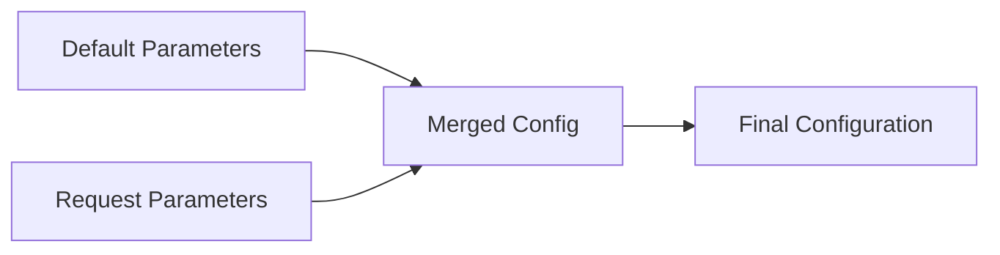
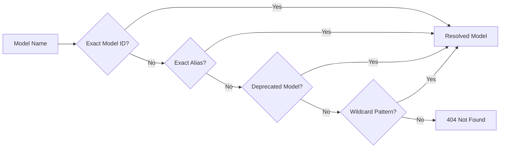

# :material-cog: Configuration Guide

stdapi.ai is configured entirely through environment variables, which are read once at startup and cannot be changed without restarting the service. This guide explains each setting category with practical examples to help you configure the service correctly.

**What you can configure:**

- **AWS regions** - Access models across multiple regions for availability and model selection
- **Data sovereignty** - Control which AWS regions are used for compliance (GDPR, HIPAA, etc.)
- **Storage** - S3 buckets for file operations, regional buckets for multi-region deployments
- **Authentication** - API keys via SSM or Secrets Manager for secure access control
- **Observability** - Logging levels, OpenTelemetry, request/response debugging
- **Security** - CORS, proxy headers, trusted hosts for production deployments
- **Performance** - Caching, model overrides, S3 acceleration
- **TLS / SSL** - End-to-end encryption using Granian environment variables

!!! tip "Zero Configuration Startup"
    stdapi.ai works out of the box with zero configuration. The service automatically detects your current AWS region and discovers available Bedrock models.

!!! info "Prerequisites"
    Before configuring stdapi.ai, ensure you have:

    - **AWS Account** with access to Amazon Bedrock
    - **AWS Credentials** configured via environment variables, AWS CLI, or IAM role (for EC2/ECS/Lambda deployments)
    - **IAM Permissions** to access required AWS services (see the [IAM Permissions](operations_iam_permissions.md) guide)
    - **S3 Bucket** (optional, but recommended for production use with file operations)

<span id="granian-host"></span>

!!! info "Container Runtime"
    Both the AWS Marketplace and community Docker images run using [Granian](https://github.com/emmett-framework/granian), a high-performance Python ASGI server. In addition to the stdapi.ai-specific configuration variables documented below, you can also use Granian environment variables to configure the server runtime (e.g., `GRANIAN_PORT`, `GRANIAN_WORKERS`, `GRANIAN_THREADS`, etc.).

    The images listen on IPv4 only (`GRANIAN_HOST=0.0.0.0`). Set `GRANIAN_HOST=::` to bind a dual-stack socket answering both IPv4 and IPv6 clients. This is needed wherever a client may resolve the server to an IPv6 address — in particular with ECS service discovery, which publishes an `AAAA` record for every task in an IPv6-enabled subnet, and some clients (Node.js among them) try that address first and fail with `ECONNREFUSED` against an IPv4-only listener. The [official Terraform module](https://github.com/stdapi-ai/terraform-aws-stdapi-ai) sets it for you when the VPC has IPv6 enabled.

## :material-rocket-launch: Quick Start

For production deployments, configure these essential settings:

### Minimal Production Setup

Single-region deployment with file storage only.

```bash
# S3 bucket for file storage (must be in same region as your server)
export AWS_S3_BUCKET=my-stdapi-bucket

# AWS_BEDROCK_REGIONS is optional - will auto-detect your current AWS region if not specified
```

### Production with Authentication

Adds secure API key authentication via AWS Systems Manager.

```bash
# S3 bucket for file storage (must be in same region as your server)
export AWS_S3_BUCKET=my-stdapi-bucket

# Secure API authentication (recommended: SSM Parameter Store)
export API_KEY_SSM_PARAMETER=/stdapi/prod/api-key

# AWS_BEDROCK_REGIONS is optional - will auto-detect your current AWS region if not specified
```

### Full Production Setup (All Features Enabled)

Multi-region deployment with all AWS AI services, observability, and security features.

```bash
# Core AWS configuration - host server in first region
export AWS_BEDROCK_REGIONS=us-east-1,us-west-2,eu-west-1

# S3 bucket for file storage (must be in us-east-1, your first/primary region)
export AWS_S3_BUCKET=my-stdapi-us-east-1-bucket

# Optional: Transcribe S3 bucket (defaults to AWS_S3_BUCKET if not specified)
# Only set this if you need a separate bucket or if transcribe is in a different region
# export AWS_TRANSCRIBE_S3_BUCKET=my-stdapi-transcribe-us-east-1

# Optional: Regional buckets for async/batch inference in other regions
export AWS_S3_REGIONAL_BUCKETS='{"us-west-2": "my-stdapi-us-west-2-bucket", "eu-west-1": "my-stdapi-eu-west-1-bucket"}'

# AWS AI services regions (optional - when unset, every AWS_BEDROCK_REGIONS entry is a
# candidate with automatic failover; set one to pin the service to a single region)
export AWS_POLLY_REGION=us-east-1           # Text-to-speech
export AWS_TRANSCRIBE_REGION=us-east-1      # Speech-to-text (audio transcription)
export AWS_COMPREHEND_REGION=us-east-1      # Language detection & moderation
export AWS_TRANSLATE_REGION=us-east-1       # Text translation

# Authentication
export API_KEY_SSM_PARAMETER=/stdapi/prod/api-key

# Logging
export LOG_LEVEL=warning
export LOG_CLIENT_IP=true

# Optional: OpenTelemetry observability (AWS X-Ray integration)
# export OTEL_ENABLED=true
# export OTEL_SERVICE_NAME=stdapi-production
# export OTEL_SAMPLE_RATE=0.1

# Production security settings (when behind AWS ALB/CloudFront)
export ENABLE_PROXY_HEADERS=true

# Note: TRUSTED_HOSTS not recommended with AWS ALB - use ALB host-based routing instead
# Only use TRUSTED_HOSTS if you cannot configure host validation at the load balancer level

# Optional: CORS for browser-based web applications
# export CORS_ALLOW_ORIGINS='["https://app.example.com"]'
```

### Development Setup

Local development configuration with API documentation and debug logging enabled.

```bash
# Minimal configuration for local development
export AWS_S3_BUCKET=my-stdapi-dev-bucket

# Enable API documentation
export ENABLE_DOCS=true
export ENABLE_REDOC=true

# Full request/response logging for debugging
export LOG_LEVEL=info
export LOG_REQUEST_PARAMS=true

# AWS_BEDROCK_REGIONS is optional - will auto-detect your current AWS region if not specified
```

!!! warning "S3 Bucket Required for Certain Features"
    Without an S3 bucket configured, some features will be disabled (such as image output as URL, audio transcription). See the relevant API documentation for feature requirements.

!!! info "All Other Settings Are Optional"
    The configurations above are sufficient for most production deployments. All other settings can be configured as needed for your specific use case.

## :material-format-list-bulleted: Environment Variable Summary

This section provides a quick reference of all available configuration options. Detailed explanations for each variable can be found in the sections below.

### :material-star: Essential (Production) { #summary-essential }

| Variable                                      | Default        | Description                                                                          |
|-----------------------------------------------|----------------|--------------------------------------------------------------------------------------|
| [`AWS_S3_BUCKET`](#aws-s3-bucket)             | None           | Primary S3 bucket for file storage; must be in first region of `AWS_BEDROCK_REGIONS` |
| [`AWS_BEDROCK_REGIONS`](#aws-bedrock-regions) | Current region | Comma-separated regions for Bedrock; first region is where server should be hosted   |

### :material-aws: AWS Client { #summary-aws-client }

| Variable                                                | Default | Description                                                                                                 |
|---------------------------------------------------------|---------|-------------------------------------------------------------------------------------------------------------|
| [`AWS_ADAPTIVE_RETRY`](#aws-adaptive-retry)             | `false` | Enable adaptive retry mode that throttles back under congestion rather than using fixed exponential backoff |
| [`AWS_MAX_POOL_CONNECTIONS`](#aws-max-pool-connections) | `50`    | Maximum concurrent HTTP connections per AWS service client                                                  |
| [`AWS_CONNECT_TIMEOUT`](#aws-connect-timeout)           | `5`     | Timeout in seconds for establishing a connection to an AWS service endpoint, and for a real-time audio session to become ready in a region |

### :material-database: AWS Storage { #summary-aws-storage }

| Variable                                                | Default         | Description                                                                                          |
|---------------------------------------------------------|-----------------|------------------------------------------------------------------------------------------------------|
| [`AWS_S3_ACCELERATE`](#aws-s3-accelerate)               | `false`         | Enable S3 Transfer Acceleration for faster global downloads via CloudFront edge locations            |
| [`AWS_S3_REGIONAL_BUCKETS`](#aws-s3-regional-buckets)   | `{}`            | Region-specific S3 buckets for Bedrock async/batch inference operations                              |
| [`AWS_S3_ACCEPTED_BUCKETS`](#aws-s3-accepted-buckets)   | `{}`            | External S3 buckets with read access, mapped to their region for S3 URI conversion and routing       |
| [`AWS_S3_TMP_PREFIX`](#aws-s3-tmp-prefix)               | `tmp/`          | S3 prefix for temporary files used for jobs; configure lifecycle policies on this prefix             |
| [`AWS_S3_FILES_PREFIX`](#aws-s3-files-prefix)           | `files/`        | S3 prefix for Files API objects; configure S3 lifecycle policies on this prefix                     |
| [`AWS_S3_VIDEOS_PREFIX`](#aws-s3-videos-prefix)         | `videos/`       | S3 prefix for generated videos (Videos API); persists until deleted through the API                  |
| [`AWS_S3_VIDEOS_EXPIRES_AFTER`](#aws-s3-videos-expires-after) | None      | Retention period in seconds for generated videos; sets `Video.expires_at` and blocks expired downloads |
| [`AWS_S3_BATCHES_PREFIX`](#aws-s3-batches-prefix)       | `batches/`      | S3 prefix for Batch API data (requests, results, batch records); configure lifecycle policies on it   |
| [`AWS_S3_VECTORS_BUCKET`](#aws-s3-vectors-bucket)       | None            | Amazon S3 vector bucket backing the Vector Stores API; unset disables it                             |
| [`AWS_S3_VECTORS_REGION`](#aws-s3-vectors-region)       | First Bedrock region | Region holding `AWS_S3_VECTORS_BUCKET`; the vector bucket has no failover                       |
| [`AWS_S3_VECTOR_STORES_PREFIX`](#aws-s3-vector-stores-prefix) | `vector_stores/` | S3 prefix for the Vector Stores API records (stores, attached files, batches)                  |
| [`VECTOR_STORE_EMBEDDING_MODEL`](#vector-store-embedding-model) | `amazon.titan-embed-text-v2:0` | Model embedding the indexed files and the search queries                    |
| [`VECTOR_STORE_CHUNK_SIZE_TOKENS`](#vector-store-chunk-size-tokens) | `800`   | Default chunk size for files indexed without an explicit `chunking_strategy`                         |
| [`VECTOR_STORE_CHUNK_OVERLAP_TOKENS`](#vector-store-chunk-overlap-tokens) | `400` | Default chunk overlap; must not exceed half the chunk size                                 |
| [`AWS_SQS_VECTOR_STORE_QUEUE_URL`](#aws-sqs-vector-store-queue-url) | None    | Amazon SQS queue making vector store indexing survive the server running it; unset keeps it in-process |
| [`AWS_BEDROCK_KNOWLEDGE_BASE_IDS`](#aws-bedrock-knowledge-base-ids) | `[]`    | Allowlist of Amazon Bedrock knowledge bases addressed as `vs_kb_...` vector stores; empty disables it |
| [`AWS_DYNAMODB_TABLE`](#aws-dynamodb-table)             | None            | Amazon DynamoDB table holding the records a deployment's instances share; unset disables every feature needing it |
| [`AWS_DYNAMODB_REGION`](#aws-dynamodb-region)           | First Bedrock region | Region holding `AWS_DYNAMODB_TABLE`; the table has no failover                                  |
| [`AWS_TRANSCRIBE_S3_BUCKET`](#aws-transcribe-s3-bucket) | `AWS_S3_BUCKET` | S3 bucket for temporary audio transcription files; must be in same region as `AWS_TRANSCRIBE_REGION` |
| [`AWS_TRANSCRIBE_OUTPUT_ENCRYPTION_KEY_ARN`](#aws-transcribe-output-encryption-key-arn) | None | AWS KMS key encrypting the transcription output objects; unset keeps the bucket's own encryption |
| [`AWS_TRANSCRIBE_STREAM_LANGUAGES`](#aws-transcribe-stream-languages) | `[]`  | Languages a streamed transcription picks between when the request names none |

### :material-robot: AWS AI Services { #summary-aws-ai-services }

| Variable                                          | Default                     | Description                                                 |
|---------------------------------------------------|-----------------------------|-------------------------------------------------------------|
| [`AWS_POLLY_REGION`](#aws-polly-region)           | All `AWS_BEDROCK_REGIONS`   | Region for Amazon Polly; unset = per-engine regional discovery with automatic failover |
| [`AWS_COMPREHEND_REGION`](#aws-comprehend-region) | All `AWS_BEDROCK_REGIONS`   | Region for Amazon Comprehend (language detection, toxicity moderation); unset = automatic failover across all Bedrock regions |
| [`AWS_TRANSCRIBE_REGION`](#aws-transcribe-region) | All `AWS_BEDROCK_REGIONS`   | Region for Amazon Transcribe; unset = failover across Bedrock regions with a co-located bucket |
| [`AWS_TRANSLATE_REGION`](#aws-translate-region)   | All `AWS_BEDROCK_REGIONS`   | Region for Amazon Translate; unset = automatic failover across all Bedrock regions |

### :material-directions-fork: Resilience & Failover { #summary-resilience-failover }

| Variable                                                                                                | Default   | Description                                                                                                              |
|---------------------------------------------------------------------------------------------------------|-----------|--------------------------------------------------------------------------------------------------------------------------|
| [`AWS_BEDROCK_REGION_ROUTING`](#bedrock-region-routing)                                                 | `ordered` | Region routing strategy: `disabled`, `ordered`, `lowest_latency`, or `round_robin` ([details](operations_resilience.md)) |
| [`AWS_BEDROCK_REGION_ROUTING_QUOTA_BACKOFF_SECONDS`](#bedrock-region-routing-quota-backoff)             | `60`      | Base interval in seconds for exponential quota backoff per region                                                        |
| [`AWS_BEDROCK_REGION_ROUTING_MAX_QUOTA_BACKOFF_SECONDS`](#bedrock-region-routing-max-quota-backoff)     | `3600`    | Hard ceiling in seconds on the exponential quota backoff per region (default: 1 hour)                                    |
| [`AWS_BEDROCK_REGION_ROUTING_QUOTA_STALE_FACTOR`](#bedrock-region-routing-quota-stale-factor)           | `2`       | Multiplier on max quota backoff to determine when the consecutive-error counter resets                                   |
| [`AWS_BEDROCK_REGION_ROUTING_UNAVAILABLE_BACKOFF_SECONDS`](#bedrock-region-routing-unavailable-backoff) | `30`      | Seconds to avoid a region after unavailability errors                                                                    |
| [`AWS_BEDROCK_MAX_RETRIES`](#bedrock-max-retries)                                                       | `9`       | Cap on the retries per Bedrock invocation; with region routing, each candidate region is tried at most once              |
| [`AWS_FAILOVER_MAX_RETRIES`](#failover-max-retries)                                                     | `2`       | SDK retries per candidate region for the multi-region failover services (Polly, Transcribe, Translate, Comprehend)       |

### :material-layers-triple: Bedrock Mantle { #summary-bedrock-mantle }

| Variable                                                                    | Default               | Description                                                                                          |
|-----------------------------------------------------------------------------|-----------------------|------------------------------------------------------------------------------------------------------|
| [`AWS_BEDROCK_MANTLE_ENABLED`](#bedrock-mantle-enabled)                     | `true`                | Expose models served by the Amazon Bedrock Mantle endpoint alongside classic Bedrock Converse models |
| [`AWS_BEDROCK_MANTLE_REGIONS`](#bedrock-mantle-regions)                     | Mantle-capable subset of `AWS_BEDROCK_REGIONS` | AWS regions used for Bedrock Mantle, in failover priority order                     |
| [`AWS_BEDROCK_MANTLE_ENDPOINT_URL`](#bedrock-mantle-endpoint-url)           | None                  | Override the Bedrock Mantle endpoint URL template (`{region}` placeholder)                           |
| [`AWS_BEDROCK_MANTLE_PREFERRED_MODELS`](#bedrock-mantle-preferred-models)   | `openai.gpt-5.6`      | Model IDs served via Mantle even when also available on the classic bedrock-runtime endpoint. Incompatible with Guardrails; the default is a **price change** for the GPT-5.6 family |
| [`AWS_BEDROCK_MANTLE_SERVICE_HEADER`](#bedrock-mantle-service-header)       | `false`               | Honor the `x-stdapi-service: bedrock-mantle` request header to route dual-homed models through Mantle per request |
| [`AWS_BEDROCK_MANTLE_PROJECT`](#bedrock-mantle-project)                     | None                  | Default Bedrock Project/Workspace ID applied to Mantle requests for cost tracking and observability  |
| [`AWS_BEDROCK_ALLOW_MANTLE_PROJECT_OVERRIDE`](#bedrock-allow-mantle-project-override) | `false`     | Allow requests to override the configured Mantle project via the `OpenAI-Project` / `anthropic-workspace` header |
| [`AWS_BEDROCK_EXTERNAL_WEB_ACCESS`](#bedrock-external-web-access)           | `false`               | Let the built-in web search tool reach the public web instead of the Amazon Bedrock web index        |
| [`AWS_BEDROCK_ALLOW_EXTERNAL_WEB_ACCESS_OVERRIDE`](#bedrock-allow-external-web-access-override) | `false` | Allow requests to override external web access with the `external_web_access` extra model parameter |

### :material-shield-check: Bedrock Advanced { #summary-bedrock-advanced }

| Variable                                                                                          | Default | Description                                                                                         |
|---------------------------------------------------------------------------------------------------|---------|-----------------------------------------------------------------------------------------------------|
| [`AWS_BEDROCK_CROSS_REGION_INFERENCE`](#cross-region-inference)                                   | `true`  | Allow automatic model routing to other configured regions                                           |
| [`AWS_BEDROCK_CROSS_REGION_INFERENCE_GLOBAL`](#cross-region-global)                               | `true`  | Allow global cross-region inference routing to any region worldwide (disable for GDPR compliance)   |
| [`AWS_BEDROCK_MODEL_REGION_RESTRICT`](#bedrock-model-region-restrict)                             | `{}`    | Restrict a model to specific region(s) only (e.g. for region-specific features like Nova grounding) |
| [`AWS_BEDROCK_LEGACY`](#bedrock-legacy)                                                           | `false` | Allow usage of deprecated/legacy Bedrock models                                                     |
| [`AWS_BEDROCK_DEPRECATED_MODEL_FALLBACK`](#bedrock-deprecated-model-fallback)                     | `true`  | Transparently reroute requests using a deprecated model ID to its recommended replacement           |
| [`AWS_BEDROCK_DEPRECATED_MODELS`](#bedrock-deprecated-models)                                     | `{}`    | Additional deprecated model mappings merged with the built-in registry at startup                   |
| [`AWS_BEDROCK_MARKETPLACE_AUTO_SUBSCRIBE`](#bedrock-marketplace-auto-subscribe)                   | `true`  | Allow automatic subscription to new models in AWS Marketplace                                       |
| [`AWS_BEDROCK_MARKETPLACE_ENDPOINTS_ENABLED`](#bedrock-marketplace-endpoints-enabled)             | `false` | Publish Amazon Bedrock Marketplace model endpoints deployed in this account as chat models           |
| [`AWS_BEDROCK_MARKETPLACE_ENDPOINT_REGIONS`](#bedrock-marketplace-endpoint-regions)                | All `AWS_BEDROCK_REGIONS` | Regions searched for Marketplace model endpoints; each must also be in `AWS_BEDROCK_REGIONS`  |
| [`AWS_BEDROCK_ALLOW_MARKETPLACE_ENDPOINT_ARN`](#bedrock-allow-marketplace-endpoint-arn)           | `false` | Allow users to pass a Marketplace model endpoint ARN directly as a model ID                         |
| [`AWS_SAGEMAKER_ENDPOINTS`](#aws-sagemaker-endpoints)                                             | `{}`    | Amazon SageMaker AI endpoints published as chat models, keyed by model ID                           |
| [`AWS_SAGEMAKER_WARMUP_TIMEOUT`](#aws-sagemaker-warmup-timeout)                                   | `600`   | Seconds a request waits for a SageMaker AI endpoint scaled to zero to come back up (`0` disables)    |
| [`AWS_SAGEMAKER_ENDPOINT_URL`](#aws-sagemaker-endpoint-url)                                       | Resolved | Override for the SageMaker AI runtime endpoint URL (VPC endpoint or proxy)                          |
| [`AWS_BEDROCK_ALLOW_CROSS_REGION_INFERENCE_PROFILE_ARN`](#bedrock-allow-cross-region-profile-arn) | `false` | Allow users to pass cross-region inference profile ARNs directly as model IDs                       |
| [`AWS_BEDROCK_ALLOW_APPLICATION_INFERENCE_PROFILE_ARN`](#bedrock-allow-application-profile-arn)   | `false` | Allow users to pass application inference profile ARNs directly as model IDs                        |
| [`AWS_BEDROCK_ALLOW_PROMPT_ROUTER_ARN`](#bedrock-allow-prompt-router-arn)                         | `false` | Allow users to pass prompt router ARNs directly as model IDs                                        |
| [`AWS_BEDROCK_ALLOW_PROMPT_ARN`](#bedrock-allow-prompt-arn)                                       | `false` | Allow users to reference Prompt Management prompt ARNs in the Responses API `prompt` parameter      |
| [`AWS_BEDROCK_MODEL_ARN_MAPPING`](#bedrock-model-arn-mapping)                                     | `{}`    | Map model IDs to custom inference profile or prompt router ARNs (server-controlled routing)         |
| [`AWS_BEDROCK_GUARDRAIL_IDENTIFIER`](#aws-bedrock-guardrail-identifier)                           | None    | Bedrock Guardrails ID for content filtering and safety controls                                     |
| [`AWS_BEDROCK_GUARDRAIL_VERSION`](#aws-bedrock-guardrail-version)                                 | None    | Bedrock Guardrails version number (required with identifier)                                        |
| [`AWS_BEDROCK_GUARDRAIL_TRACE`](#aws-bedrock-guardrail-trace)                                     | None    | Guardrails trace level: `disabled`, `enabled`, or `enabled_full`                                    |
| [`AWS_BEDROCK_ALLOW_GUARDRAIL_OVERRIDE`](#aws-bedrock-allow-guardrail-override)                   | `false` | Allow users to override global guardrail configuration via request headers (security: default off)  |
| [`AWS_BEDROCK_SESSION_ENCRYPTION_KEY_ARN`](#aws-bedrock-session-encryption-key-arn)               | None    | KMS key ARN encrypting Amazon Bedrock session storage (Responses API `store=true`)                     |
| [`AWS_BEDROCK_BATCH_ROLE_ARN`](#aws-bedrock-batch-role-arn)                                       | None    | Service role Amazon Bedrock assumes to run batch inference jobs; unset disables the Batch APIs        |
| [`AWS_BEDROCK_USER_ROLE_ARN`](#aws-bedrock-user-role-arn)                                         | None    | Run each end user's model calls under a role session of their own, so AWS reports their spend separately |
| [`AWS_BEDROCK_USER_ROLE_SESSION_DURATION`](#aws-bedrock-user-role-session-duration)               | `3600`  | Lifetime in seconds of a per-end-user role session (900–3600)                                       |
| [`AWS_BEDROCK_USER_ROLE_TAG_KEY`](#aws-bedrock-user-role-tag-key)                                 | `user`  | Session tag key carrying the end user identity, for cost allocation and access policies             |
| [`AWS_BEDROCK_USER_ROLE_REQUIRE_IDENTITY`](#aws-bedrock-user-role-require-identity)               | `false` | Reject a model request that identifies no end user instead of billing it to the server              |

### :material-lock: Authentication { #summary-authentication }

Configure **one** API key source. If several are set, precedence is `API_KEY` → SSM Parameter Store → Secrets Manager — see [Authentication](#authentication):

| Variable                                                          | Default   | Description                                                        |
|-------------------------------------------------------------------|-----------|--------------------------------------------------------------------|
| [`API_KEY_SSM_PARAMETER`](#api-key-ssm)                           | None      | AWS Systems Manager Parameter Store path for API key (recommended) |
| [`API_KEY_SECRETSMANAGER_SECRET`](#api-key-secretsmanager-secret) | None      | AWS Secrets Manager secret name containing API key                 |
| [`API_KEY_SECRETSMANAGER_KEY`](#api-key-secretsmanager-key)       | `api_key` | JSON key name within Secrets Manager secret                        |
| [`API_KEY`](#api-key)                                             | None      | Direct API key value (not recommended for production)              |
| [`TENANT_API_KEYS`](#tenant-api-keys)                             | `false`   | Accept per-tenant API keys scoped by the tenant records in the shared DynamoDB table |
| [`TENANT_KEY_CACHE_SECONDS`](#tenant-key-cache-seconds)           | `60`      | Per-instance validation cache, which is also the revocation window |
| [`TENANT_KEY_SSM_PARAMETER_PREFIX`](#tenant-key-ssm-parameter-prefix) | None  | SSM prefix minted tenant keys are delivered under, once            |
| [`TENANT_KEY_SSM_KMS_KEY_ID`](#tenant-key-ssm-kms-key-id)         | None      | KMS key encrypting the delivery parameters, instead of `alias/aws/ssm` |
| [`TENANT_AWS_CREDENTIALS`](#tenant-aws-credentials)               | `false`   | Let a tenant register a cross-account IAM role its model invocations run under |
| [`AUTHENTICATION_MODE`](#authentication-mode)                     | `any`     | Accepted methods: `any`, `api_key` or `cognito`                    |

Amazon Cognito user pool tokens are an alternative to the API key — see [Amazon Cognito Authentication](#cognito-authentication):

| Variable                                                            | Default    | Description                                                     |
|---------------------------------------------------------------------|------------|-----------------------------------------------------------------|
| [`AWS_COGNITO_USER_POOL_ID`](#aws-cognito-user-pool-id)             | None       | User pool whose tokens authenticate clients (enables the method) |
| [`AWS_COGNITO_CLIENT_IDS`](#aws-cognito-client-ids)                 | None       | App client IDs whose tokens are accepted (required with a pool)  |
| [`AWS_COGNITO_REQUIRED_SCOPES`](#aws-cognito-required-scopes)       | None       | Scopes a token must all carry                                    |
| [`AWS_COGNITO_ACCEPT_ID_TOKEN`](#aws-cognito-accept-id-token)       | `false`    | Also accept identity tokens, not only access tokens              |
| [`AWS_COGNITO_ISSUER_TYPE`](#aws-cognito-issuer-type)               | `original` | Pool issuer configuration: `original` or `updated`               |

Publishing where tokens come from lets an AI agent authenticate itself — see [Authentication Discovery](#oauth-discovery):

| Variable                                                              | Default              | Description                                                        |
|-----------------------------------------------------------------------|----------------------|--------------------------------------------------------------------|
| [`OAUTH_RESOURCE_IDENTIFIER`](#oauth-resource-identifier)             | None                 | Public URL clients dial (publishes the discovery document)         |
| [`OAUTH_AUTHORIZATION_SERVERS`](#oauth-authorization-servers)         | The user pool issuer | Issuer URLs of the authorization servers                           |
| [`OAUTH_SCOPES_SUPPORTED`](#oauth-scopes-supported)                   | Required scopes      | Scopes a token needs, advertised to clients                        |

### :material-api: API Compatibility { #summary-api-compatibility }

| Variable                                              | Default      | Description                                          |
|-------------------------------------------------------|--------------|------------------------------------------------------|
| [`OPENAI_ROUTES_PREFIX`](#openai-routes-prefix)       | None (root)  | Base path prefix for OpenAI-compatible API routes    |
| [`ANTHROPIC_ROUTES_PREFIX`](#anthropic-routes-prefix) | `/anthropic` | Base path prefix for Anthropic-compatible API routes |
| [`COHERE_ROUTES_PREFIX`](#cohere-routes-prefix)       | `/cohere`    | Base path prefix for Cohere-compatible API routes    |
| [`OLLAMA_ROUTES_PREFIX`](#ollama-routes-prefix)       | None (root)  | Base path prefix for Ollama-compatible API routes    |

### :material-chart-line: Logging { #summary-logging }

| Variable                                        | Default | Description                                                                           |
|-------------------------------------------------|---------|---------------------------------------------------------------------------------------|
| [`LOG_LEVEL`](#logging-level)                   | `info`  | Minimum log severity: `info`, `warning`, `error`, `critical`, or `disabled`           |
| [`LOG_REQUEST_PARAMS`](#log-request-params)     | `false` | Include request/response parameters in logs (not recommended for production)          |
| [`LOG_CLIENT_IP`](#client-ip-logging)           | `false` | Log client IP addresses (requires `ENABLE_PROXY_HEADERS` for real IPs behind proxies) |

### :material-chart-box-outline: CloudWatch Metrics { #summary-cloudwatch-metrics }

| Variable                                                                    | Default               | Description                                                            |
|-----------------------------------------------------------------------------|-----------------------|------------------------------------------------------------------|
| [`CLOUDWATCH_METRICS`](#cloudwatch-metrics)                                 | `false`               | Emit per-request AWS-billed usage as CloudWatch EMF log lines      |
| [`CLOUDWATCH_METRICS_NAMESPACE`](#cloudwatch-metrics-namespace)             | `stdapi`              | CloudWatch namespace for the emitted usage metrics                 |
| [`CLOUDWATCH_METRICS_USER_DIMENSION`](#cloudwatch-metrics-user-dimension)   | `false`               | Also publish the authenticated caller as a `User` metric dimension  |
| [`CLOUDWATCH_METRICS_REGION`](#cloudwatch-metrics-region)                   | Server's region       | Region the [Usage API](#usage-api-section) reads the published metrics from |

### :material-currency-usd: Cost Tracking { #summary-cost-tracking }

| Variable                                                    | Default        | Description                                                              |
|-----------------------------------------------------------------|----------------|-----------------------------------------------------------------------|
| [`COST_TRACKING`](#cost-tracking)                           | `false`        | Enable real-time cost computation from live AWS pricing                |
| [`COST_PRICE_OVERRIDES`](#cost-price-overrides)             | `{}`           | JSON map of operator-supplied unit prices for models missing from the AWS catalog |

### :material-chart-timeline-variant: Usage API { #summary-usage-api }

| Variable                                                    | Default | Description                                                                       |
|-------------------------------------------------------------|---------|-----------------------------------------------------------------------------------|
| [`USAGE_API`](#usage-api)                                   | `false` | Serve the organization usage and costs endpoints (requires `CLOUDWATCH_METRICS`)  |
| [`USAGE_API_ADMIN_SCOPES`](#usage-api-admin-scopes)         | None    | OAuth 2.0 scopes an Amazon Cognito token must all carry to read these endpoints   |
| [`USAGE_API_MAX_METRICS`](#usage-api-max-metrics)           | `500`   | Refuse a query that would read more metric series than this                       |
| [`USAGE_API_MAX_RANGE_DAYS`](#usage-api-max-range-days)     | `92`    | Longest span between `start_time` and `end_time` on a query                       |
| [`USAGE_API_CACHE_TTL`](#usage-api-cache-ttl)               | `60`    | Seconds an answered query is reused for (`0` disables the cache)                  |

### :material-radar: Observability (OpenTelemetry) { #summary-observability }

| Variable                                            | Default                           | Description                                                                            |
|-----------------------------------------------------|-----------------------------------|----------------------------------------------------------------------------------------|
| [`OTEL_ENABLED`](#otel-enabled)                     | `false`                           | Enable distributed tracing via OpenTelemetry (integrates with AWS X-Ray, Jaeger, etc.) |
| [`OTEL_SERVICE_NAME`](#otel-service-name)           | `stdapi.ai`                       | Service name identifier in trace visualizations                                        |
| [`OTEL_EXPORTER_ENDPOINT`](#otel-exporter-endpoint) | `http://127.0.0.1:4318/v1/traces` | OTLP HTTP endpoint URL for trace export                                                |
| [`OTEL_SAMPLE_RATE`](#otel-sample-rate)             | `1.0`                             | Trace sampling rate from 0.0 (none) to 1.0 (all requests)                              |

### :material-web: HTTP/Security { #summary-http-security }

| Variable                                                                            | Default  | Description                                                                           |
|-------------------------------------------------------------------------------------|----------|---------------------------------------------------------------------------------------|
| [`CORS_ALLOW_ORIGINS`](#cors-allow-origins)                                         | None     | JSON array of allowed origins for browser cross-origin requests                       |
| [`TRUSTED_HOSTS`](#trusted-hosts)                                                   | None     | JSON array of trusted Host header values (prefer ALB host-based routing; see details) |
| [`ENABLE_PROXY_HEADERS`](#enable-proxy-headers)                                     | `false`  | Trust X-Forwarded-* headers from reverse proxies (only enable behind trusted proxy)   |
| [`PROXY_TRUSTED_HOSTS`](#proxy-trusted-hosts)                                       | `*`      | Peer IPs/ranges whose X-Forwarded-* headers are trusted (restrict from `*` for safety) |
| [`GRANIAN_HOST`](#granian-host)                                                     | `0.0.0.0` | Listener bind address; `::` binds a dual-stack socket answering IPv4 and IPv6 clients |
| [`GRANIAN_SSL_CERTIFICATE`](#graniansslcertificate)                                 | None     | Path to SSL certificate file for end-to-end encryption                                |
| [`GRANIAN_SSL_KEYFILE`](#graniansslkeyfile)                                         | None     | Path to SSL private key file (PKCS#8) for end-to-end encryption                       |
| [`GRANIAN_SSL_KEYFILE_PASSWORD`](#graniansslkeyfilepassword)                        | None     | Password for the SSL private key file                                                 |
| [`GRANIAN_SSL_PROTOCOL_MIN`](#graniansslprotocolmin)                                | `tls1.3` | Minimum supported TLS version (`tls1.2` or `tls1.3`)                                  |
| [`GRANIAN_SSL_CA`](#graniansslca)                                                   | None     | Path to CA certificate bundle for client verification (mTLS)                          |
| [`GRANIAN_SSL_CLIENT_VERIFY`](#graniansslclientverify)                              | `false`  | Enable client certificate verification (mTLS)                                         |
| [`ENABLE_GZIP`](#enable-gzip)                                                       | `false`  | Enable GZip compression for responses >1KB (prefer AWS ALB/CloudFront compression)    |
| [`SSRF_PROTECTION_BLOCK_PRIVATE_NETWORKS`](#ssrf-protection-block-private-networks) | `true`   | Block requests to private/local networks for SSRF protection                          |
| [`MAX_INPUT_FILE_SIZE`](#max-input-file-size)                                       | `0`      | Maximum size in bytes of an inline input file loaded into memory (`0` disables)        |
| [`MAX_CONCURRENT_INPUT_DOWNLOADS`](#max-concurrent-input-downloads)                 | `8`      | Maximum input files fetched/resolved concurrently per request                          |

### :material-cog: Application Behavior { #summary-application-behavior }

| Variable                                                            | Default                 | Description                                                                                |
|---------------------------------------------------------------------|-------------------------|--------------------------------------------------------------------------------------------|
| [`TIMEZONE`](#timezone)                                             | `UTC`                   | IANA timezone identifier for request timestamps                                            |
| [`STRICT_INPUT_VALIDATION`](#strict-input-validation)               | `false`                 | Reject API requests with unknown/extra fields                                              |
| [`CHAT_COMPLETIONS_REASONING_FIELD`](#chat-completions-reasoning-field) | `reasoning_content` | Field carrying reasoning text on `/v1/chat/completions`: `reasoning_content`, `reasoning`, or `none` |
| [`MODEL_ALIASES`](#model-aliases)                                   | `{}`                    | JSON object mapping custom model name aliases to Bedrock model IDs, optionally with per-alias configuration |
| [`DEFAULT_TTS_MODEL`](#default-tts-model)                           | `amazon.polly-standard` | Default TTS model: `amazon.polly-standard`, `-neural`, `-long-form`, or `-generative`      |
| [`DEFAULT_TTS_LANGUAGE`](#default-tts-language)                     | None                    | Default language for TTS (e.g., `en-US`); when set, skips Amazon Comprehend auto-detection    |
| [`TOKENS_ESTIMATION`](#tokens-estimation)                           | `false`                 | Deprecated and ignored (token estimation removed)                                          |
| [`TOKENS_ESTIMATION_DEFAULT_ENCODING`](#tokens-encoding)            | `None`                  | Deprecated and ignored (token estimation removed)                                          |
| [`DEFAULT_MODEL_PARAMS`](#default-model-params)                     | `{}`                    | JSON object with per-model default inference parameters (temperature, max_tokens, etc.)    |
| [`DEFAULT_MODEL_SERVICE_TIERS`](#default-model-service-tiers)       | `{}`                    | JSON object with per-model default service tiers (default, flex, priority, reserved)        |
| [`AWS_BEDROCK_ALLOW_SERVICE_TIER_OVERRIDE`](#aws-bedrock-allow-service-tier-override) | `true` | Allow users to select the service tier per request, overriding the configured one (cost control) |
| [`MODEL_CACHE_SECONDS`](#model-cache-seconds)                       | `900`                   | Age in seconds at which the model list is refreshed in the background (default: 15 minutes) |
| [`MODEL_CACHE_MAX_STALE_SECONDS`](#model-cache-max-stale-seconds)   | `86400`                 | Age in seconds past which a request waits for the model list refresh (default: 24 hours)   |
| [`MODEL_CACHE_SHARED`](#model-cache-shared)                         | `false`                 | Share one model list between the deployment's servers through `AWS_DYNAMODB_TABLE`         |
| [`AI_RESPONSE_TIMEOUT`](#ai-response-timeout)                       | `600`                   | Maximum seconds without data from a model before the request times out (default: 10 min)   |
| [`SHUTDOWN_DRAIN_TIMEOUT`](#shutdown-drain-timeout)                 | `10`                    | Maximum seconds the server waits for background work to finish after being asked to stop   |
| [`DROP_UNSUPPORTED_SYSTEM_PROMPT`](#drop-unsupported-system-prompt) | `true`                  | Drop system prompts for unsupported models; when `false`, return error instead             |
| [`ANTHROPIC_BETA_FILTER`](#anthropic-beta-filter)                   | `true`                  | Enable filtering of unsupported `anthropic_beta` flags for Claude models                   |
| [`ANTHROPIC_BETA_ALLOWLIST`](#anthropic-beta-allowlist)             | None                    | Additional `anthropic_beta` flags to allow beyond built-in Bedrock defaults                |
| [`EXTRA_MODEL_PARAMS_DENYLIST`](#extra-model-params-denylist)       | None                    | Additional "extra model parameters" names to strip, beyond the built-in LiteLLM control-parameter denylist |
| [`EXTRA_MODEL_PARAMS_DROP_ALL`](#extra-model-params-drop-all)       | `false`                 | Disable the "extra model parameters" passthrough entirely                                  |
| [`IMAGE_GENERATION_MODEL`](#image-generation-model)                 | None                    | Default Bedrock image model ID used when the `image_generation` Responses API tool is invoked |
| [`REALTIME_CLIENT_SECRET_KEY`](#realtime-client-secret-key)         | None                    | Secret the Realtime API's ephemeral client secrets are signed with; derived from the API key when unset |
| [`REALTIME_ALLOW_SESSION_OVERRIDE`](#realtime-allow-session-override) | `true`                 | Allow a client holding an ephemeral client secret to override the session configuration it carries |
| [`REALTIME_WEBRTC_ENABLED`](#realtime-webrtc-enabled)               | `false`                 | Serve WebRTC calls on `POST /v1/realtime/calls`, terminating the media path in-process |
| [`REALTIME_WEBRTC_STUN_SERVER`](#realtime-webrtc-stun-server)       | None                    | STUN server the gateway uses to discover and advertise its public address to WebRTC callers |
| [`REALTIME_WEBRTC_TURN_SERVER`](#realtime-webrtc-turn-server)       | None                    | Operator-run TURN relay advertised to WebRTC callers on UDP-blocking networks |
| [`REALTIME_WEBRTC_TURN_USERNAME`](#realtime-webrtc-turn-server)     | None                    | Long-term credential username of the TURN relay |
| [`REALTIME_WEBRTC_TURN_PASSWORD`](#realtime-webrtc-turn-server)     | None                    | Long-term credential password of the TURN relay |
| [`REALTIME_WEBRTC_ALLOW_PRIVATE_CANDIDATES`](#realtime-webrtc-allow-private-candidates) | `false` | Accept the ICE candidates a caller offers on addresses that are not globally routable |

### :material-file-document: API Documentation { #summary-api-documentation }

| Variable                                      | Default | Description                                                                      |
|-----------------------------------------------|---------|----------------------------------------------------------------------------------|
| [`ENABLE_DOCS`](#enable-docs)                 | `false` | Enable interactive Swagger UI documentation at `/docs`                           |
| [`ENABLE_REDOC`](#enable-redoc)               | `false` | Enable ReDoc documentation UI at `/redoc`                                        |
| [`ENABLE_OPENAPI_JSON`](#enable-openapi-json) | `false` | Enable OpenAPI schema endpoint at `/openapi.json` (auto-enabled with docs/redoc) |

### :material-connection: MCP (Model Context Protocol) { #summary-mcp }

| Variable                                                            | Default | Description                                                                             |
|---------------------------------------------------------------------|---------|-----------------------------------------------------------------------------------------|
| [`ENABLE_MCP_STREAMABLE_HTTP`](#enable-mcp-streamable-http)         | `false` | Enable MCP server via Streamable HTTP at `/mcp` — recommended transport                 |
| [`MCP_STATELESS_HTTP`](#mcp-stateless-http)                         | `false` | Serve `/mcp` without server-side sessions — any replica may serve any request           |
| [`ENABLE_MCP_SSE`](#enable-mcp-sse)                                 | `false` | Enable MCP server via Server-Sent Events at `/sse` — legacy transport for older clients |
| [`MCP_INCLUDE_TOOLS`](#mcp-include-tools)                           | None    | Comma-separated tool names to expose exclusively; all others are hidden                 |
| [`MCP_EXCLUDE_TOOLS`](#mcp-exclude-tools)                           | None    | Comma-separated tool names to hide; all others remain exposed                           |

---

## :material-aws: AWS Services and Regions

### General Configuration

#### `AWS_ADAPTIVE_RETRY` { #aws-adaptive-retry }

:octicons-package-24: **Purpose**
:   Enable adaptive retry mode that adjusts retry pacing based on observed error rates across all AWS service calls

:octicons-database-24: **Type**
:   Boolean (`true` / `false`)

:octicons-gear-24: **Default**
:   `false`

:octicons-workflow-24: **Behavior**
:   When enabled, the retry strategy dynamically responds to real-time congestion signals. If errors are occurring frequently, retries are spaced further apart to avoid amplifying load on an already-stressed endpoint. Once conditions improve, the pacing returns to normal. When disabled, retries follow a standard exponential backoff strategy with fixed intervals. Applies to all AWS services (Bedrock, S3, Polly, Transcribe, etc.).

!!! warning "Latency Impact"
    Adaptive retry paces retries based on real-time error signals, reducing the risk of retry storms when many clients share the same endpoint under sustained congestion — at the cost of increased per-request latency when throttling is detected, since the client intentionally delays retries to shed load. Prefer it under sustained high load; keep the default standard mode for latency-sensitive, low-traffic workloads.

```bash
# Default: standard exponential backoff
export AWS_ADAPTIVE_RETRY=false

# Enable adaptive retry (recommended under sustained high load)
export AWS_ADAPTIVE_RETRY=true
```

#### `AWS_MAX_POOL_CONNECTIONS` { #aws-max-pool-connections }

:octicons-package-24: **Purpose**
:   Maximum number of concurrent HTTP connections per AWS service client

:octicons-database-24: **Type**
:   Integer (must be > 0)

:octicons-gear-24: **Default**
:   `50`

:octicons-workflow-24: **Behavior**
:   Each AWS service client (one per service per region) maintains its own connection pool up to this limit. Under high concurrency, increasing this value prevents requests from queuing for an available connection. Setting it too high may exhaust system file descriptors.

```bash
# Default
export AWS_MAX_POOL_CONNECTIONS=50

# High-concurrency deployment
export AWS_MAX_POOL_CONNECTIONS=100
```

#### `AWS_CONNECT_TIMEOUT` { #aws-connect-timeout }

:octicons-package-24: **Purpose**
:   Timeout in seconds for establishing a connection to an AWS service endpoint

:octicons-database-24: **Type**
:   Integer (must be > 0)

:octicons-gear-24: **Default**
:   `5`

:octicons-workflow-24: **Behavior**
:   Limits how long the client waits when opening a new connection. It also bounds, per candidate region, the time a real-time audio session (generative-voice speech, speech-to-speech) may take to become ready: connection, initial handshake and the first response together. A short value allows fast failover to another region when an endpoint is unreachable. Increase it only if you see spurious connection timeouts on high-latency networks, or real-time audio requests failing with a `503` a few seconds after they start.

```bash
# Default: 5 seconds
export AWS_CONNECT_TIMEOUT=5

# High-latency network
export AWS_CONNECT_TIMEOUT=10
```

### Storage Configuration

#### `AWS_S3_BUCKET` { #aws-s3-bucket }

:octicons-package-24: **Purpose**
:   Primary S3 bucket for storing generated files (images, audio, documents) and temporary data during processing

:octicons-gear-24: **Default**
:   None (must be configured for file operations)

:octicons-check-circle-24: **Best Practice**
:   The bucket must be in the first region specified in `AWS_BEDROCK_REGIONS` (your primary region where the server should be hosted) to avoid cross-region data transfer costs and reduce latency

```bash
export AWS_S3_BUCKET=my-llm-storage-us-east-1
```

!!! tip "Presigned URLs"
    Files are served via presigned URLs for secure, time-limited access. Presigned URLs expire after 1 hour.

!!! info "Terraform Module"
    When using the Terraform module, the main S3 bucket is created automatically — no manual configuration required.

!!! warning "Startup Warning"
    If not set, a warning is logged at startup and features that require file storage (image generation, audio output, document processing) will be unavailable.

#### `AWS_S3_ACCELERATE` { #aws-s3-accelerate }

:octicons-package-24: **Purpose**
:   Enable S3 Transfer Acceleration for presigned URLs to improve download performance for large files

:octicons-database-24: **Type**
:   Boolean

:octicons-gear-24: **Default**
:   `false`

:octicons-check-circle-24: **Best Practice**
:   Enable when serving large files (high-resolution images, audio) to geographically distributed users

```bash
export AWS_S3_ACCELERATE=true
```

!!! info "What is S3 Transfer Acceleration?"
    S3 Transfer Acceleration uses Amazon CloudFront's globally distributed edge locations to accelerate uploads and downloads to S3 buckets. When enabled, data is routed to the nearest edge location and then transferred to S3 over Amazon's optimized network paths.

    **Performance Benefits:**

    - :material-speedometer: **Faster downloads** for users far from your bucket's region
    - :material-earth: **Global reach** via CloudFront edge locations
    - :material-upload-network: **Optimized routing** over Amazon's private backbone network
    - :material-chart-line: **Consistent performance** regardless of user location

    Typical speed improvements: 50-500% faster for users located far from the bucket region.

!!! warning "Requirements"
    1. **Enable Transfer Acceleration** on your S3 bucket before setting this option:
       ```bash
       aws s3api put-bucket-accelerate-configuration \
         --bucket my-stdapi-bucket \
         --accelerate-configuration Status=Enabled
       ```
    2. **Additional costs**: Transfer Acceleration incurs extra data transfer fees. See [Amazon S3 Transfer Acceleration pricing](https://aws.amazon.com/s3/pricing/)

!!! tip "When to Enable"
    Consider enabling S3 Transfer Acceleration when:

    - :material-image: Serving generated images via [Images API](api_openai_images_generations.md)
    - :material-earth-arrow-right: Users are geographically distributed across multiple continents
    - :material-file-image: Generating high-resolution images that are large in file size
    - :material-speedometer: Download performance is critical to user experience

    For small images or users close to your bucket region, the performance benefit may not justify the additional cost.

!!! info "Current Usage"
    Presigned URLs with Transfer Acceleration are currently only used for the [Images API](api_openai_images_generations.md) when returning generated images as URLs.

#### `AWS_S3_TMP_PREFIX` { #aws-s3-tmp-prefix }

:octicons-package-24: **Purpose**
:   S3 prefix (folder path) for temporary files used during job processing

:octicons-gear-24: **Default**
:   `tmp/`

:octicons-check-circle-24: **Best Practice**
:   Configure S3 lifecycle policies to automatically delete objects under this prefix after 1 day

```bash
export AWS_S3_TMP_PREFIX=tmp/
```

!!! info "What is an S3 Prefix?"
    An S3 prefix is essentially a folder path within your S3 bucket. When you set `AWS_S3_TMP_PREFIX=tmp/`, all temporary files are stored under the `tmp/` folder structure in your bucket.

    **Example file paths:**

    - With prefix `tmp/`: `s3://my-bucket/tmp/request-id-123/output.json`
    - With prefix `temporary/`: `s3://my-bucket/temporary/request-id-123/output.json`
    - With empty prefix ``: `s3://my-bucket/request-id-123/output.json` (not recommended)

!!! tip "Why Use a Prefix?"
    Using a dedicated prefix for temporary files provides several benefits:

    - :material-auto-fix: **Easy Lifecycle Management** - Apply S3 lifecycle policies to automatically delete only temporary files
    - :material-file-tree: **Better Organization** - Keep temporary files separate from permanent storage
    - :material-shield-check: **Security** - Apply different IAM policies or bucket policies to the prefix
    - :material-cash: **Cost Control** - Easily identify and monitor temporary storage costs

!!! warning "Trailing Slash"
    Always include a trailing slash (`/`) in your prefix to create a proper folder structure. Without it, files will be stored with the prefix as part of the filename rather than in a folder.

    - ✅ Correct: `tmp/` → Files stored as `tmp/file.json`
    - ❌ Incorrect: `tmp` → Files stored as `tmpfile.json`

**Custom prefix examples:**

```bash
# Production environment
export AWS_S3_TMP_PREFIX=prod/tmp/

# Staging environment
export AWS_S3_TMP_PREFIX=staging/tmp/

# Organize by date (requires manual updates)
export AWS_S3_TMP_PREFIX=tmp/2025/01/

# No prefix (store at bucket root - not recommended)
export AWS_S3_TMP_PREFIX=
```

#### `AWS_S3_FILES_PREFIX` { #aws-s3-files-prefix }

:octicons-package-24: **Purpose**
:   S3 prefix (folder path) for Files API objects (OpenAI and Anthropic `/v1/files` endpoints)

:octicons-gear-24: **Default**
:   `files/`

:octicons-check-circle-24: **Best Practice**
:   Configure an `AbortIncompleteMultipartUpload` S3 lifecycle rule on this prefix to clean up abandoned upload parts, and apply Intelligent-Tiering for cost optimisation

```bash
export AWS_S3_FILES_PREFIX=files/
```

!!! info "S3 Prefix Format"
    Prefix semantics (folder-style paths, trailing-slash requirement) are explained under [`AWS_S3_TMP_PREFIX`](#aws-s3-tmp-prefix) and apply here identically.

**Custom prefix examples:**

```bash
# Production environment
export AWS_S3_FILES_PREFIX=prod/files/

# Staging environment
export AWS_S3_FILES_PREFIX=staging/files/

# No prefix (store at bucket root - not recommended)
export AWS_S3_FILES_PREFIX=
```

#### `AWS_S3_VIDEOS_PREFIX` { #aws-s3-videos-prefix }

:octicons-package-24: **Purpose**
:   S3 prefix (folder path) for videos generated through the [Videos API](api_openai_videos.md)

:octicons-gear-24: **Default**
:   `videos/`

:octicons-alert-24: **Requirement**
:   Must be non-empty, use only S3-safe characters (alphanumerics plus `! _ . * ' ( ) -` per path segment), and end with a trailing `/` — an empty value would widen the ownership check that scopes listing/retrieval to the whole bucket

:octicons-check-circle-24: **Best Practice**
:   Generated videos persist until deleted through the API — configure an S3 lifecycle rule on this prefix to cap storage costs

```bash
export AWS_S3_VIDEOS_PREFIX=videos/
```

Amazon Bedrock writes each video generation job's output (MP4 and manifest) under this prefix, in a folder named after the job. Because Amazon Bedrock requires the output bucket to be in the same region as the invocation, videos are stored in the [`AWS_S3_REGIONAL_BUCKETS`](#aws-s3-regional-buckets) bucket of the region that served the job.

#### `AWS_S3_VIDEOS_EXPIRES_AFTER` { #aws-s3-videos-expires-after }

:octicons-package-24: **Purpose**
:   Retention period in seconds (minimum `3600`) for videos generated through the [Videos API](api_openai_videos.md)

:octicons-gear-24: **Default**
:   Unset — videos never expire and persist until deleted through the API

:octicons-check-circle-24: **Best Practice**
:   Pair with an S3 Lifecycle expiration rule on [`AWS_S3_VIDEOS_PREFIX`](#aws-s3-videos-prefix) covering the same duration (rounded up to whole days) so the objects are actually deleted

```bash
# Expire generated videos after 24 hours
export AWS_S3_VIDEOS_EXPIRES_AFTER=86400
```

When set, the `Video` object reports `expires_at` (job completion time plus this value) and downloading expired video content returns a 404. The server enforces expiry at the API level only; the paired S3 Lifecycle rule performs the physical cleanup.

#### `AWS_S3_BATCHES_PREFIX` { #aws-s3-batches-prefix }

:octicons-package-24: **Purpose**
:   S3 prefix (folder path) for the data of the [Batch API](api_openai_batches.md) and the [Message Batches API](api_anthropic_batches.md) — the submitted requests, the results, and the batch records themselves

:octicons-gear-24: **Default**
:   `batches/`

:octicons-alert-24: **Requirement**
:   Must be non-empty, use only S3-safe characters (alphanumerics plus `! _ . * ' ( ) -` per path segment), and end with a trailing `/` — batches are addressed by prefix, so an empty value would make every stray object at the bucket root a candidate

:octicons-check-circle-24: **Best Practice**
:   Batch data persists until the batch is deleted — configure an S3 lifecycle rule on this prefix to cap storage costs, and grant [`AWS_BEDROCK_BATCH_ROLE_ARN`](#aws-bedrock-batch-role-arn) read and write access under it

```bash
export AWS_S3_BATCHES_PREFIX=batches/
```

Each batch stores its data under a folder of its own below this prefix. Because the output bucket must be in the same region as the model that serves the batch, that data is stored in the [`AWS_S3_REGIONAL_BUCKETS`](#aws-s3-regional-buckets) bucket of the region that served it.

#### Vector Stores { #vector-stores-optional }

The [Vector Stores API](api_openai_vector_stores.md) needs an [Amazon S3 vector bucket](https://docs.aws.amazon.com/AmazonS3/latest/userguide/s3-vectors.html) — a resource type of its own, created separately from a general purpose bucket — plus the general purpose bucket in [`AWS_S3_BUCKET`](#aws-s3-bucket), which holds the stores' records. The vector store endpoints answer `503` until both are configured, or until [`AWS_BEDROCK_KNOWLEDGE_BASE_IDS`](#aws-bedrock-knowledge-base-ids) names a knowledge base to serve instead.

#### `AWS_S3_VECTORS_BUCKET` { #aws-s3-vectors-bucket }

:octicons-package-24: **Purpose**
:   Name of the Amazon S3 vector bucket that holds the indexed content of every vector store

:octicons-gear-24: **Default**
:   None — the [Vector Stores API](api_openai_vector_stores.md) is disabled

:octicons-alert-24: **Requirement**
:   Requires [`AWS_S3_BUCKET`](#aws-s3-bucket), which holds the vector store records; startup fails if only the vector bucket is set. The gateway's role needs the [Vector Stores permissions](operations_iam_permissions.md#vector-stores-optional) on it

```bash
export AWS_S3_VECTORS_BUCKET=my-llm-vectors-us-east-1
```

Create the bucket yourself, then let the gateway create and delete the indexes inside it — one per vector store, removed when the store is deleted or expires.

#### `AWS_S3_VECTORS_REGION` { #aws-s3-vectors-region }

:octicons-package-24: **Purpose**
:   AWS region holding [`AWS_S3_VECTORS_BUCKET`](#aws-s3-vectors-bucket)

:octicons-gear-24: **Default**
:   The first [`AWS_BEDROCK_REGIONS`](#aws-bedrock-regions) entry

:octicons-alert-24: **Requirement**
:   Must be the bucket's own region. A vector bucket is a regional resource whose content is only reachable there, so this setting has no failover: if the region is unreachable, so is the [Vector Stores API](api_openai_vector_stores.md)

```bash
export AWS_S3_VECTORS_REGION=us-east-1
```

#### `AWS_S3_VECTOR_STORES_PREFIX` { #aws-s3-vector-stores-prefix }

:octicons-package-24: **Purpose**
:   S3 prefix (folder path) in [`AWS_S3_BUCKET`](#aws-s3-bucket) for the [Vector Stores API](api_openai_vector_stores.md) records — the stores, their attached files and their file batches

:octicons-gear-24: **Default**
:   `vector_stores/`

:octicons-check-circle-24: **Best Practice**
:   Keep it distinct from the other prefixes so a lifecycle rule written for one never reaches the records of another; these records are the stores themselves, so no expiration rule belongs on this prefix

```bash
export AWS_S3_VECTOR_STORES_PREFIX=vector_stores/
```

#### `VECTOR_STORE_EMBEDDING_MODEL` { #vector-store-embedding-model }

:octicons-package-24: **Purpose**
:   Model that turns the indexed files and the search queries into vectors

:octicons-gear-24: **Default**
:   `amazon.titan-embed-text-v2:0`

:octicons-alert-24: **Requirement**
:   Must be an embedding model available in your configured regions — see [Embeddings API](api_openai_embeddings.md)

```bash
export VECTOR_STORE_EMBEDDING_MODEL=amazon.titan-embed-text-v2:0
```

Each vector store records the model it was created with and keeps using it, so changing this setting only affects stores created afterwards. Existing stores keep answering exactly as before.

#### `VECTOR_STORE_CHUNK_SIZE_TOKENS` { #vector-store-chunk-size-tokens }

:octicons-package-24: **Purpose**
:   Default chunk size, in tokens, for files indexed without an explicit `chunking_strategy`

:octicons-gear-24: **Default**
:   `800` — the same default the upstream API applies

:octicons-alert-24: **Requirement**
:   Between `100` and `4096`

```bash
export VECTOR_STORE_CHUNK_SIZE_TOKENS=800
```

A request's own `chunking_strategy` always wins, and a store created with one applies it to every file later attached without one. Chunk sizes are approximate — see [Chunking](api_openai_vector_stores.md#chunking).

#### `VECTOR_STORE_CHUNK_OVERLAP_TOKENS` { #vector-store-chunk-overlap-tokens }

:octicons-package-24: **Purpose**
:   Default number of tokens shared between consecutive chunks, for files indexed without an explicit `chunking_strategy`

:octicons-gear-24: **Default**
:   `400` — the same default the upstream API applies

:octicons-alert-24: **Requirement**
:   Must not exceed half of [`VECTOR_STORE_CHUNK_SIZE_TOKENS`](#vector-store-chunk-size-tokens); startup fails otherwise

```bash
export VECTOR_STORE_CHUNK_OVERLAP_TOKENS=400
```

More overlap keeps a sentence split across two chunks findable from either one, at the cost of more chunks to embed and store.

#### `AWS_SQS_VECTOR_STORE_QUEUE_URL` { #aws-sqs-vector-store-queue-url }

:octicons-package-24: **Purpose**
:   URL of the [Amazon SQS](https://docs.aws.amazon.com/AWSSimpleQueueService/latest/SQSDeveloperGuide/welcome.html) standard queue that carries vector store indexing work, so a file keeps being indexed when the server that accepted it stops

:octicons-gear-24: **Default**
:   None — indexing runs in the server that accepted the request, and a file being indexed when that server stops is reported as `failed`

:octicons-alert-24: **Requirement**
:   Requires [`AWS_S3_VECTORS_BUCKET`](#aws-s3-vectors-bucket). Must be a standard queue (not FIFO), with a [dead-letter queue](https://docs.aws.amazon.com/AWSSimpleQueueService/latest/SQSDeveloperGuide/sqs-dead-letter-queues.html), and the gateway's role needs the [Durable vector store indexing permissions](operations_iam_permissions.md#durable-vector-store-indexing) on it

```bash
export AWS_SQS_VECTOR_STORE_QUEUE_URL=https://sqs.us-east-1.amazonaws.com/123456789012/stdapi-ai-indexing
```

Attaching a file records the work on the queue before answering, and every server reads from that queue: whichever one is still running finishes it. The region comes from the URL, so there is nothing else to configure. Create the queue yourself, in the same account.

The queue only ever carries identifiers — which store, which files, which batch — never file content, so no indexed data is stored a second time.

See [Durable indexing](api_openai_vector_stores.md#durable-indexing) for what a client observes, and [Resilience](operations_resilience.md#vector-store-indexing) for how it behaves during a deployment.

!!! warning "Give the queue a dead-letter queue"
    A file the gateway cannot index is retried a few times and then reported as `failed`. Without a dead-letter queue its message is dropped at that point; with one it is kept, so you can see what was refused. The gateway reads the queue's own redrive policy at startup and reports a queue that has none as a startup warning.

#### `AWS_BEDROCK_KNOWLEDGE_BASE_IDS` { #aws-bedrock-knowledge-base-ids }

:octicons-package-24: **Purpose**
:   Comma-separated allowlist of [Amazon Bedrock knowledge bases](https://docs.aws.amazon.com/bedrock/latest/userguide/knowledge-base.html) served through the [Vector Stores API](api_openai_vector_stores.md). Each allowlisted knowledge base is addressed as the vector store `vs_kb_<knowledgeBaseId>` on every `/v1/vector_stores` endpoint, and is returned by `GET /v1/vector_stores` next to the stores the server owns

:octicons-gear-24: **Default**
:   Empty — no knowledge base is addressable, and a `vs_kb_...` identifier is answered exactly as an unknown vector store is, so the allowlist cannot be probed

:octicons-alert-24: **Requirement**
:   Each knowledge base must already exist, in the first [`AWS_BEDROCK_REGIONS`](#aws-bedrock-regions) entry, be a [Bedrock managed](https://docs.aws.amazon.com/bedrock/latest/userguide/kb-build-managed.html) (`MANAGED`) or [customer-managed](https://docs.aws.amazon.com/bedrock/latest/userguide/knowledge-base-build.html) (`VECTOR`) knowledge base, and the gateway's role needs the [Knowledge Base Vector Stores permissions](operations_iam_permissions.md#knowledge-base-vector-stores) on it

```bash
export AWS_BEDROCK_KNOWLEDGE_BASE_IDS=ABCDE12345,FGHIJ67890/KLMNO13579
```

Write each entry as `<knowledgeBaseId>`, or as `<knowledgeBaseId>/<dataSourceId>` when the knowledge base has more than one data source; with a single data source the server resolves it itself.

Both kinds of document knowledge base are served, and a store behaves the same on either. A knowledge base [connected to a structured data store](https://docs.aws.amazon.com/bedrock/latest/userguide/knowledge-base-build-structured.html) (`SQL`) or backed by an Amazon Kendra GenAI index (`KENDRA`) is not a vector store and must not be allowlisted.

The knowledge base itself always stays yours: the server never creates one and never deletes one. It searches it, and manages the documents of its data source. Name, description, creation time and status are read from the knowledge base, and the requests that would change them are refused — see [Knowledge Base Stores](api_openai_vector_stores.md#knowledge-base-stores).

This setting is independent of [`AWS_S3_VECTORS_BUCKET`](#aws-s3-vectors-bucket): a deployment that sets only this one serves its allowlisted knowledge bases and creates no store of its own.

!!! info "What a knowledge base costs"
    A knowledge base search costs more than a search on a store the server owns, and a knowledge base backed by an always-on vector database bills whether it is queried or not. Both backends are offered so the choice is yours — see [Cost Management](operations_cost_management.md).

#### `AWS_DYNAMODB_TABLE` { #aws-dynamodb-table }

:octicons-package-24: **Purpose**
:   Name of the [Amazon DynamoDB](https://docs.aws.amazon.com/amazondynamodb/latest/developerguide/Introduction.html) table holding the records the instances of a deployment share

:octicons-gear-24: **Default**
:   None — every feature that needs the table is disabled, no table is opened, and nothing is billed

:octicons-alert-24: **Requirement**
:   The table must already exist, with `pk` (String) as its **partition key** and `sk` (String) as its **sort key**, on-demand capacity, and [time to live](https://docs.aws.amazon.com/amazondynamodb/latest/developerguide/TTL.html) enabled on the `expires_at` attribute. The gateway's role needs the [Shared Table permissions](operations_iam_permissions.md#shared-table) on it

```bash
export AWS_DYNAMODB_TABLE=stdapi-ai
```

The table is yours to create: the gateway reads and writes items, and never creates, deletes or reconfigures a table. The [official Terraform module](https://github.com/stdapi-ai/terraform-aws-stdapi-ai) creates one for you.

!!! warning "The sort key cannot be added later"
    Amazon DynamoDB fixes a table's key schema when the table is created, so a table made with `pk` alone has to be recreated rather than altered. The gateway checks the key schema at startup and reports a mismatch as a startup warning.

!!! info "What the table costs"
    On-demand capacity has no idle charge, the records are kilobytes, and expiring items are deleted without consuming write throughput — so a table nothing writes to bills essentially nothing. See [Amazon DynamoDB pricing](https://aws.amazon.com/dynamodb/pricing/on-demand/).

#### `AWS_DYNAMODB_REGION` { #aws-dynamodb-region }

:octicons-package-24: **Purpose**
:   AWS region holding [`AWS_DYNAMODB_TABLE`](#aws-dynamodb-table)

:octicons-gear-24: **Default**
:   The first [`AWS_BEDROCK_REGIONS`](#aws-bedrock-regions) entry

:octicons-alert-24: **Requirement**
:   Must be the table's own region, and requires [`AWS_DYNAMODB_TABLE`](#aws-dynamodb-table); startup fails when it is set alone. A table is a regional resource, so this setting has no failover: if the region is unreachable, so is every feature built on the table

```bash
export AWS_DYNAMODB_REGION=us-east-1
```

#### `AWS_TRANSCRIBE_S3_BUCKET` { #aws-transcribe-s3-bucket }

:octicons-package-24: **Purpose**
:   Temporary S3 bucket for transcription workflows

:octicons-gear-24: **Default**
:   Falls back to `AWS_S3_BUCKET` if not specified

:octicons-alert-24: **Requirement**
:   Must be in the same region as `AWS_TRANSCRIBE_REGION` when that is set; with the default multi-region behavior it serves the primary Bedrock region, and [`AWS_S3_REGIONAL_BUCKETS`](#aws-s3-regional-buckets) entries serve the other candidate regions

```bash
# If AWS_TRANSCRIBE_REGION is us-east-1
export AWS_TRANSCRIBE_S3_BUCKET=my-transcribe-temp-us-east-1

# If AWS_TRANSCRIBE_REGION is eu-west-1
export AWS_TRANSCRIBE_S3_BUCKET=my-transcribe-temp-eu-west-1
```

#### `AWS_TRANSCRIBE_STREAM_LANGUAGES` { #aws-transcribe-stream-languages }

:octicons-package-24: **Purpose**
:   Languages a streamed transcription ([`stream=true`](api_openai_audio_transcriptions.md#streaming)) picks between when the request names none

:octicons-gear-24: **Default**
:   Empty — a request naming no language is transcribed once the whole recording has been read, and its language detected

:octicons-code-24: **Format**
:   JSON array of two or more language codes; a single entry has no effect

A streamed transcription returns text before the recording has been fully read, which requires knowing which languages to expect. A request that names its `language` — or two or more expected `languages` — always gets one. Set this to extend the same behavior to requests that name neither, listing the languages your callers actually send. Listing more than five is not recommended, and two variants of the same language (`en-US` and `en-GB`) cannot both appear.

```bash
export AWS_TRANSCRIBE_STREAM_LANGUAGES='["en-US", "es-US", "fr-FR"]'
```

#### `AWS_TRANSCRIBE_OUTPUT_ENCRYPTION_KEY_ARN` { #aws-transcribe-output-encryption-key-arn }

:octicons-package-24: **Purpose**
:   AWS KMS key encrypting the transcription output written to [`AWS_TRANSCRIBE_S3_BUCKET`](#aws-transcribe-s3-bucket)

:octicons-gear-24: **Default**
:   None — output objects keep the bucket's own default encryption (SSE-S3)

:octicons-code-24: **Format**
:   KMS key ARN: `arn:<partition>:kms:<region>:<account-id>:key/<key-id>`; startup fails on any other value

:octicons-alert-24: **Requirement**
:   The server's role needs `kms:GenerateDataKey` and `kms:Decrypt` on the key ([IAM Permissions](operations_iam_permissions.md#speech-to-text-optional)). With the default multi-region behavior the key must be usable from every candidate region — a [multi-Region key](https://docs.aws.amazon.com/kms/latest/developerguide/multi-region-keys-overview.html) or a single [`AWS_TRANSCRIBE_REGION`](#aws-transcribe-region)

```bash
export AWS_TRANSCRIBE_OUTPUT_ENCRYPTION_KEY_ARN=arn:aws:kms:us-east-1:123456789012:key/12345678-1234-1234-1234-123456789012
```

Each job also sends its request identifiers (`stdapi-ai.request_id`, `stdapi-ai.server_id`, and `stdapi-ai.user_id` when the user is known) as the [KMS encryption context](https://docs.aws.amazon.com/kms/latest/developerguide/concepts.html#encrypt_context), so a key policy can be conditioned on them.

#### `AWS_S3_REGIONAL_BUCKETS` { #aws-s3-regional-buckets }

:octicons-package-24: **Purpose**
:   Region-specific S3 buckets for Bedrock async and batch inference operations, and for staging attachments too large to travel inside a request

:octicons-gear-24: **Default**
:   Empty (no regional buckets configured)

:octicons-code-24: **Format**
:   JSON object with region names as keys and bucket names as values

:octicons-alert-24: **Requirement**
:   Some Bedrock models require S3 buckets in the same region for async and batch inference operations

```bash
export AWS_S3_REGIONAL_BUCKETS='{"us-east-1": "my-bedrock-temp-us-east-1", "eu-west-1": "my-bedrock-temp-eu-west-1"}'
```

!!! info "When to Use"
    Configure this setting when:

    - Using Bedrock async inference API
    - Using Bedrock batch inference API
    - Working with models that require regional S3 storage
    - Accepting chat, messages or responses requests with [large attachments](features.md#attachment-size), or embedding requests with large inputs — those are staged in the bucket of the region serving the request, which then serves that request alone without failing over

    If not specified for a region where async/batch operations are attempted, those operations may fail. Requests carrying an attachment larger than the model reads inline are refused with `413` when no region able to serve the model has a bucket.

!!! success "Automatic Fallback"
    For the first region in `AWS_BEDROCK_REGIONS` (your primary region), if no regional bucket is specified, the service automatically falls back to `AWS_S3_BUCKET`. You only need to configure regional buckets for additional regions beyond your primary one.

!!! info "Terraform Module"
    When using the Terraform module, regional S3 buckets are created automatically for each region in `aws_bedrock_regions`. The bucket names are exposed via the `aws_s3_regional_buckets` output and passed to the container as `AWS_S3_REGIONAL_BUCKETS`. No manual configuration required.

!!! tip "Best Practice"
    Apply the same [S3 Bucket Lifecycle Configuration](#s3-lifecycle) to these regional buckets as you would for the primary bucket to automatically clean up temporary files.

#### `AWS_S3_ACCEPTED_BUCKETS` { #aws-s3-accepted-buckets }

:octicons-package-24: **Purpose**
:   Declare external S3 buckets that the application has read access to, mapped to their AWS region

:octicons-database-24: **Type**
:   JSON object (keys: bucket names, values: AWS region identifiers)

:octicons-gear-24: **Default**
:   `{}` (empty — only the application's own buckets are recognized)

:octicons-workflow-24: **Behavior**
:   Declaring a bucket here enables input access to objects the application does not own:

    - **S3 URI and S3 HTTP URL access** — `s3://` URIs and S3 HTTP URLs (including presigned URLs) pointing at these buckets are accepted as input sources; an HTTP URL is automatically converted to an `s3://` URI so Bedrock can access the object directly.
    - **Declared region** — The region mapped to each bucket is used to reach that bucket in its own region when reading the input object. It does not influence model or inference region selection.

    Without this setting, only the application's own buckets (`AWS_S3_BUCKET` and `AWS_S3_REGIONAL_BUCKETS`) are recognized.

```bash
export AWS_S3_ACCEPTED_BUCKETS='{"my-data-bucket": "us-east-1", "my-eu-bucket": "eu-west-1"}'
```

!!! warning "Required IAM Permissions"
    The application's IAM role must have `s3:GetObject` permission on each declared bucket. Granting access at the bucket level is recommended:

    ```json
    {
      "Effect": "Allow",
      "Action": "s3:GetObject",
      "Resource": [
        "arn:aws:s3:::my-data-bucket/*",
        "arn:aws:s3:::my-eu-bucket/*"
      ]
    }
    ```

!!! tip "When to Use"
    Configure this when your users provide S3 URLs from buckets outside the application's own buckets. This enables automatic HTTP-to-S3 URI conversion and optimal region routing for those objects.

#### S3 Bucket Lifecycle Configuration { #s3-lifecycle }

:octicons-package-24: **Purpose**
:   Configure automatic deletion of temporary files and abandoned multipart upload parts to minimize storage costs

:octicons-clock-24: **Recommendation**
:   Configure S3 lifecycle policies to automatically delete objects under the `AWS_S3_TMP_PREFIX` after 1 day, and abort incomplete multipart uploads under the `AWS_S3_FILES_PREFIX` after 1 day

stdapi.ai stores temporary files under the prefix configured by `AWS_S3_TMP_PREFIX` (default: `tmp/`). These include generated images, audio files, and transcription workflow files. Configure S3 lifecycle policies to automatically delete objects under this prefix after 1 day.

Additionally, multipart file uploads (OpenAI Uploads API) store parts under `AWS_S3_FILES_PREFIX` (default: `files/`). If a session is never completed or cancelled — for example when a client disconnects — the uploaded parts remain in S3 and accumulate costs. Add an `AbortIncompleteMultipartUpload` rule on the files prefix to clean these up automatically.

!!! info "Application Cleanup Behavior"
    **Short-lived temporary files:** The application attempts to clean up short-lived temporary files (such as intermediate transcription files) after processing completes.

    **Results shared with clients:** Files shared with clients using presigned URLs (such as generated images and audio) are never cleaned up automatically by the application. These files remain in S3 until removed by lifecycle policies or manual deletion.

    **Why lifecycle policies are essential:** Since the application cannot determine when a client has finished using a presigned URL, S3 lifecycle policies are the recommended mechanism to clean up these files and prevent unbounded storage growth.

```json
{
  "Rules": [
    {
      "Id": "DeleteTemporaryFiles",
      "Status": "Enabled",
      "Filter": {
        "Prefix": "tmp/"
      },
      "Expiration": {
        "Days": 1
      },
      "AbortIncompleteMultipartUpload": {
        "DaysAfterInitiation": 1
      }
    },
    {
      "Id": "AbortIncompleteMultipartUploads",
      "Status": "Enabled",
      "Filter": {
        "Prefix": "files/"
      },
      "AbortIncompleteMultipartUpload": {
        "DaysAfterInitiation": 1
      }
    }
  ]
}
```

!!! warning "Important: Update the Prefixes"
    The `"Prefix"` values in the lifecycle policy must match your `AWS_S3_TMP_PREFIX` and `AWS_S3_FILES_PREFIX` settings. If you use custom prefixes, update the policy accordingly.

    **Examples:**

    - If `AWS_S3_TMP_PREFIX=temporary/`, use `"Prefix": "temporary/"` in the first rule
    - If `AWS_S3_FILES_PREFIX=prod/files/`, use `"Prefix": "prod/files/"` in the second rule

**Apply via AWS CLI:**

```bash
# For primary S3 bucket (AWS_S3_BUCKET)
aws s3api put-bucket-lifecycle-configuration \
  --bucket my-stdapi-bucket \
  --lifecycle-configuration file://lifecycle-policy.json

# For transcribe S3 bucket (AWS_TRANSCRIBE_S3_BUCKET, if different from AWS_S3_BUCKET)
aws s3api put-bucket-lifecycle-configuration \
  --bucket my-transcribe-temp-bucket \
  --lifecycle-configuration file://lifecycle-policy.json

# For regional buckets (AWS_S3_REGIONAL_BUCKETS)
aws s3api put-bucket-lifecycle-configuration \
  --bucket my-stdapi-us-west-2-bucket \
  --lifecycle-configuration file://lifecycle-policy.json
```

!!! tip "Apply to All S3 Buckets"
    Apply this lifecycle policy to:

    - **`AWS_S3_BUCKET`** - Primary bucket for generated files
    - **`AWS_TRANSCRIBE_S3_BUCKET`** - Transcription temporary files (if different from AWS_S3_BUCKET)
    - **`AWS_S3_REGIONAL_BUCKETS`** - All regional buckets for async/batch operations

    All these buckets use the same `AWS_S3_TMP_PREFIX` for temporary file storage, and the same `AWS_S3_FILES_PREFIX` for multipart upload parts.

### Bedrock Configuration

#### `AWS_BEDROCK_REGIONS` { #aws-bedrock-regions }

:octicons-package-24: **Purpose**
:   List of AWS regions where Bedrock models are available

:octicons-list-ordered-24: **Format**
:   Comma-separated string

:octicons-gear-24: **Default**
:   Current AWS SDK region if not specified

:octicons-workflow-24: **Behavior**
:   Models are discovered in the same order as the listed regions. The first region is the primary region where your server should be hosted on AWS for optimal performance. Your S3 bucket (`AWS_S3_BUCKET`) must also be in this region. If a model is unavailable in the primary region, subsequent regions are checked in order

```bash
export AWS_BEDROCK_REGIONS=us-east-1,us-west-2,eu-west-1
```

!!! info "Region Selection Guide"
    | Region | Description |
    |--------|-------------|
    | `us-east-1` | :material-star: Widest model selection, usually gets latest releases first |
    | `us-west-2` | :material-rocket-launch: Good selection, often early access to new models |
    | `eu-west-1` | :material-shield-check: European compliance, subset of US models available |

!!! tip "Advanced Configuration"
    See [Compliance and Latency Optimization](#compliance-and-latency-optimization) for detailed configuration examples including GDPR compliance, regional optimization strategies, and best practices for multi-region deployments.

!!! warning "Startup Warning"
    If any models in the configured regions fail availability checks (not enabled, unauthorized, or missing entitlement/agreement in your AWS account), a warning listing the affected models and per-region issues is logged at startup. Enable the required models in the [Amazon Bedrock console](https://console.aws.amazon.com/bedrock/home#/modelaccess) for each configured region.

!!! info "Unreachable Region Tolerance"
    A configured region that cannot be reached (invalid region for the account, network issue, throttling) does not block startup: it is skipped with an `unreachable_bedrock_regions` warning and its models are served from the remaining regions. The skipped region is retried automatically on the next model list refresh (see [`MODEL_CACHE_SECONDS`](#model-cache-seconds)), so a recovered region rejoins without a restart. Startup only fails when **every** configured region fails, or when **every** per-model availability check errors (e.g. the `bedrock:GetFoundationModelAvailability` permission is denied) — which indicates broken credentials or configuration rather than a regional outage.

!!! info "Denied Region Reporting"
    A region AWS *refused* is never reported as unreachable. Denials are listed under their own `bedrock_regions_missing_iam_permission` warning, which names the IAM action, the region and — where AWS supplies it — the resource ARN. Nothing retries its way out of a denial: grant the named action from [IAM Permissions](operations_iam_permissions.md) and restart. The distinction matters when judging a model that vanished from the catalogue, because an unreachable region is an outage while a denied one is a policy gap.

    Two wordings are used, because AWS answers the same `AccessDeniedException` for two different situations and only one of them is yours to fix:

    - **`the server role is missing the IAM permission <action>`** — AWS named the action and the principal itself, which it only does when IAM policy evaluation produced the denial. This is a real policy gap.
    - **`AWS denied <action> … unless the service does not offer the operation there`** — AWS refused without naming an action, so the action shown is the one derived from the call. A service that is not offered in a region answers this way, and so does an account-level restriction; neither is fixed by editing a policy.

    Discovery degrades rather than failing where it can. `bedrock:ListProvisionedModelThroughputs` is refused outright in the regions that do not offer provisioned throughput, so a denial there costs only the models that are exclusively provisioned in that region — the region keeps serving its on-demand catalogue, and the warning reads `provisioned model discovery skipped: …`.

#### `AWS_BEDROCK_CROSS_REGION_INFERENCE` { #cross-region-inference }

:octicons-package-24: **Purpose**
:   Enable automatic cross-region routing when a model isn't available in the primary region

:octicons-database-24: **Type**
:   Boolean

:octicons-gear-24: **Default**
:   `true`

```bash
export AWS_BEDROCK_CROSS_REGION_INFERENCE=true
```

#### `AWS_BEDROCK_CROSS_REGION_INFERENCE_GLOBAL` { #cross-region-global }

:octicons-package-24: **Purpose**
:   Allow global cross-region inference routing to any region worldwide

:octicons-database-24: **Type**
:   Boolean

:octicons-gear-24: **Default**
:   `true`

!!! example "GDPR Compliance"
    Set to `false` to comply with data residency regulations (e.g., EU GDPR) by restricting to regional inference only
    ```bash
    export AWS_BEDROCK_CROSS_REGION_INFERENCE_GLOBAL=false
    ```

#### `AWS_BEDROCK_REGION_ROUTING` { #bedrock-region-routing }

:octicons-package-24: **Purpose**
:   Automatic region routing strategy for distributing Bedrock requests across configured regions

:octicons-database-24: **Type**
:   String

:octicons-gear-24: **Default**
:   `ordered`

:octicons-workflow-24: **Behavior**
:   When multiple regions are configured in `AWS_BEDROCK_REGIONS`, this setting controls how requests are distributed across them. The router automatically handles quota/throttling errors and regional unavailability by temporarily avoiding affected regions

:octicons-alert-24: **Requirement**
:   Requires at least 2 regions in `AWS_BEDROCK_REGIONS` to take effect

**Available strategies:**

| Strategy | Description |
|----------|-------------|
| `disabled` | No routing; uses the single region where the model was discovered |
| `ordered` | Try regions in configured order, skipping temporarily blocked ones (default). Best for prompt caching compatibility |
| `lowest_latency` | Prefer the region with lowest measured latency. Latencies are measured at startup |
| `round_robin` | Distribute requests evenly across regions. Incompatible with prompt caching |

```bash
# Use ordered routing (default)
export AWS_BEDROCK_REGION_ROUTING=ordered

# Use lowest latency routing
export AWS_BEDROCK_REGION_ROUTING=lowest_latency

# Disable routing
export AWS_BEDROCK_REGION_ROUTING=disabled
```

!!! tip "Strategy Selection"
    - **`ordered`** (default): Best general-purpose choice. Compatible with prompt caching since requests consistently go to the same region. Provides failover when a region hits quota limits
    - **`lowest_latency`**: Best when response time is critical. Measures region latencies at startup and prefers the fastest region. Falls back to others when the preferred region is blocked
    - **`round_robin`**: Best for maximizing aggregate throughput across regions. Not recommended with prompt caching as it distributes requests across all regions equally

!!! info "More Details"
    For comprehensive documentation on region routing including failover behavior, S3 bucket pinning, logging, and best practices, see the [Region Routing Guide](operations_resilience.md).

#### `AWS_BEDROCK_REGION_ROUTING_QUOTA_BACKOFF_SECONDS` { #bedrock-region-routing-quota-backoff }

:octicons-package-24: **Purpose**
:   Duration to temporarily avoid a region after receiving a quota or throttling error

:octicons-database-24: **Type**
:   Integer (seconds, must be > 0)

:octicons-gear-24: **Default**
:   `60`

:octicons-workflow-24: **Behavior**
:   This is the **base** backoff value. When a Bedrock API call fails due to quota limits (`ThrottlingException`, `TooManyRequestsException`, `ServiceQuotaExceededException`), the affected region is temporarily blocked. The actual delay doubles with each consecutive quota error on the same region (exponential backoff), up to a hard ceiling of 1 hour. The counter resets after a successful request. Subsequent requests are routed to other available regions during the backoff period.

```bash
# Default: 60 seconds (base value — actual delay doubles per consecutive error)
export AWS_BEDROCK_REGION_ROUTING_QUOTA_BACKOFF_SECONDS=60

# Shorter base backoff for aggressive retry
export AWS_BEDROCK_REGION_ROUTING_QUOTA_BACKOFF_SECONDS=30

# Longer base backoff for conservative approach
export AWS_BEDROCK_REGION_ROUTING_QUOTA_BACKOFF_SECONDS=120
```

!!! tip "Tuning"
    The base value controls how long the first quota error blocks a region. Subsequent consecutive errors on the same region double the delay (60 s → 120 s → 240 s → …, capped at 1 hour). Lower base values retry the region sooner but risk repeated throttling. Higher values provide more conservative avoidance at the cost of reduced region utilization.

    See [Region Routing — Overview](operations_resilience.md#overview) for full backoff behavior details.

#### `AWS_BEDROCK_REGION_ROUTING_UNAVAILABLE_BACKOFF_SECONDS` { #bedrock-region-routing-unavailable-backoff }

:octicons-package-24: **Purpose**
:   Duration to temporarily avoid a region after receiving an unavailability error

:octicons-database-24: **Type**
:   Integer (seconds, must be > 0)

:octicons-gear-24: **Default**
:   `30`

:octicons-workflow-24: **Behavior**
:   When a Bedrock API call fails due to service unavailability (`ServiceUnavailableException`, `ModelNotReadyException`), the affected region is temporarily blocked for this many seconds. These errors are typically shorter-lived than quota limits, so the default is shorter

```bash
# Default: 30 seconds
export AWS_BEDROCK_REGION_ROUTING_UNAVAILABLE_BACKOFF_SECONDS=30

# Longer backoff for stability
export AWS_BEDROCK_REGION_ROUTING_UNAVAILABLE_BACKOFF_SECONDS=60
```

!!! info "More Details"
    See [Region Routing — Overview](operations_resilience.md#overview) for full backoff behavior details.

#### `AWS_BEDROCK_REGION_ROUTING_MAX_QUOTA_BACKOFF_SECONDS` { #bedrock-region-routing-max-quota-backoff }

:octicons-package-24: **Purpose**
:   Hard ceiling in seconds on the exponential quota backoff for a single region

:octicons-database-24: **Type**
:   Integer (seconds, must be > 0)

:octicons-gear-24: **Default**
:   `3600` (1 hour)

:octicons-workflow-24: **Behavior**
:   Quota backoff grows exponentially with consecutive errors (base interval × 2^n). This setting caps how large that value can become, preventing a region from being blocked indefinitely. Reduce it to allow faster recovery; increase it to keep a misbehaving region sidelined for longer.

```bash
# Default: 1 hour ceiling
export AWS_BEDROCK_REGION_ROUTING_MAX_QUOTA_BACKOFF_SECONDS=3600

# More aggressive recovery
export AWS_BEDROCK_REGION_ROUTING_MAX_QUOTA_BACKOFF_SECONDS=600
```

#### `AWS_BEDROCK_REGION_ROUTING_QUOTA_STALE_FACTOR` { #bedrock-region-routing-quota-stale-factor }

:octicons-package-24: **Purpose**
:   Multiplier applied to the max quota backoff to compute the stale-error reset threshold

:octicons-database-24: **Type**
:   Integer (must be > 0)

:octicons-gear-24: **Default**
:   `2` (threshold = 2 × max quota backoff = 2 hours with defaults)

:octicons-workflow-24: **Behavior**
:   If the most recent quota error on a region occurred more than `max_quota_backoff × factor` seconds ago, the consecutive-error counter is reset and the next error is treated as a fresh start rather than an escalation. A higher value keeps memory of past errors for longer before resetting the counter.

```bash
# Default: reset counter after 2× the max backoff window
export AWS_BEDROCK_REGION_ROUTING_QUOTA_STALE_FACTOR=2

# Longer memory of past errors
export AWS_BEDROCK_REGION_ROUTING_QUOTA_STALE_FACTOR=4
```

#### `AWS_BEDROCK_MAX_RETRIES` { #bedrock-max-retries }

:octicons-package-24: **Purpose**
:   Maximum number of retries per Bedrock invocation, each retry escalating to the next available region

:octicons-database-24: **Type**
:   Integer (must be 0 or greater; `0` disables retries)

:octicons-gear-24: **Default**
:   `9`

:octicons-workflow-24: **Behavior**
:   Controls the retry budget for each Bedrock API call. When region routing is enabled, every retry escalates to the next region in priority order and each candidate region is tried at most once, so the attempts are bounded by the smaller of `AWS_BEDROCK_MAX_RETRIES` + 1 and the number of candidate regions for the model — with 3 regions and the default 9 retries, a request makes at most 3 attempts. A region that just failed is still blocked by its own backoff, and retrying it would only extend that backoff instead of recovering the request. When routing is disabled, or the region is pinned by S3 inputs, the full budget is spent as SDK retries against that single region.

```bash
# Default: 9 retries (10 total attempts)
export AWS_BEDROCK_MAX_RETRIES=9

# Fail faster (e.g. low-latency interactive use cases)
export AWS_BEDROCK_MAX_RETRIES=3

# Deeper in-region retrying for single-region or S3-pinned requests
export AWS_BEDROCK_MAX_RETRIES=18
```

!!! tip "Related setting"
    See [`AWS_BEDROCK_REGION_ROUTING`](#bedrock-region-routing) and [Region Routing](operations_resilience.md) for the full retry and failover behavior.

#### `AWS_FAILOVER_MAX_RETRIES` { #failover-max-retries }

:octicons-package-24: **Purpose**
:   Maximum SDK retry attempts per candidate region for the multi-region failover services (Polly, Transcribe, Translate, Comprehend)

:octicons-database-24: **Type**
:   Integer (must be 0 or greater)

:octicons-gear-24: **Default**
:   `2`

:octicons-workflow-24: **Behavior**
:   Only applied when a service has several candidate regions (no explicit region setting): each region attempt uses this reduced retry budget (`2` retries = 3 attempts per region) before failing over, so failover across regions replaces deep in-region retrying. When a service is pinned to a single region, the standard retry budget from [`AWS_BEDROCK_MAX_RETRIES`](#bedrock-max-retries) applies instead.

```bash
# Default: 2 retries (3 attempts) per candidate region
export AWS_FAILOVER_MAX_RETRIES=2

# Fail over after a single attempt per region
export AWS_FAILOVER_MAX_RETRIES=0
```

!!! tip "Related setting"
    See [Other AWS Services Failover](operations_resilience.md#other-aws-services-failover) for the full multi-region failover behavior.

#### `AWS_BEDROCK_MANTLE_ENABLED` { #bedrock-mantle-enabled }

:octicons-package-24: **Purpose**
:   Expose models served by the Amazon Bedrock Mantle endpoint (OpenAI/Anthropic-compatible APIs) in addition to the classic Bedrock Converse models

:octicons-database-24: **Type**
:   Boolean

:octicons-gear-24: **Default**
:   `true`

:octicons-workflow-24: **Behavior**
:   Mantle-only models (e.g. OpenAI GPT, xAI Grok, Google Gemma 4) become available on the chat completions, responses, messages, and completions routes. Models available on both the classic bedrock-runtime endpoint and Mantle are served by bedrock-runtime unless listed in [`AWS_BEDROCK_MANTLE_PREFERRED_MODELS`](#bedrock-mantle-preferred-models), which defaults to the OpenAI GPT-5.6 family.

    Authentication requires no static secrets: short-term bearer tokens are derived automatically (SigV4-presigned) from the same AWS credential chain the server already uses, and refreshed transparently.

    When Bedrock Mantle is unreachable or the IAM role lacks `bedrock-mantle` permissions, Mantle models are simply not listed and a warning is logged at startup — no configuration change required.

```bash
export AWS_BEDROCK_MANTLE_ENABLED=false
```

!!! warning "Guardrails Not Supported"
    Amazon Bedrock Guardrails are not supported on Mantle-served requests. A guardrail configured alongside a non-empty [`AWS_BEDROCK_MANTLE_PREFERRED_MODELS`](#bedrock-mantle-preferred-models) — which is the default — **stops the server at startup**, because a model routed to Mantle would otherwise be served unfiltered; clear that setting to keep both. For the Mantle-only models, which have no classic endpoint to fall back to, a startup warning reports how many are affected; set `AWS_BEDROCK_MANTLE_ENABLED=false` to remove them from the catalogue.

!!! note "Cross-Region Inference Profiles Not Available"
    Bedrock cross-region inference profiles do not exist on the Mantle endpoint. Mantle relies on [multi-region failover](#bedrock-mantle-regions) and its own separate throughput quotas instead.

!!! warning "Required IAM Permissions"
    Enabling this setting requires the `bedrock-mantle` IAM permissions — see [Bedrock Mantle IAM Permissions](operations_iam_permissions.md#bedrock-mantle-iam).

[:octicons-arrow-right-24: Bedrock Mantle Models feature overview](features.md#bedrock-mantle-models)

#### `AWS_BEDROCK_MANTLE_REGIONS` { #bedrock-mantle-regions }

:octicons-package-24: **Purpose**
:   List of AWS regions used for Amazon Bedrock Mantle, in failover priority order

:octicons-database-24: **Type**
:   Comma-separated string of AWS region identifiers

:octicons-gear-24: **Default**
:   The regions of [`AWS_BEDROCK_REGIONS`](#aws-bedrock-regions) that offer Bedrock Mantle

:octicons-workflow-24: **Behavior**
:   Model availability differs per region; the served model catalog is the union of all listed regions. Region failover, quota backoff, and health tracking work exactly like classic Bedrock [region routing](operations_resilience.md).

```bash
export AWS_BEDROCK_MANTLE_REGIONS=us-east-1,eu-west-1
```

!!! note "Regions Without a Mantle Endpoint"
    Bedrock Mantle is offered in fewer regions than classic Bedrock — see [model availability by endpoint](https://docs.aws.amazon.com/bedrock/latest/userguide/models-endpoint-availability.html). Left unset, this setting keeps only the regions of `AWS_BEDROCK_REGIONS` known to offer it, so a deployment spanning other regions is not held up at startup by an address that does not exist.

    An explicit value is used exactly as given, which is how a region AWS adds later is used without waiting for a release. A region that turns out to have no Mantle endpoint is named in a startup warning rather than retried forever. If none of your regions offers it, set `AWS_BEDROCK_MANTLE_ENABLED=false`.

#### `AWS_BEDROCK_MANTLE_ENDPOINT_URL` { #bedrock-mantle-endpoint-url }

:octicons-package-24: **Purpose**
:   Override the Amazon Bedrock Mantle endpoint URL template

:octicons-database-24: **Type**
:   String — URL template with a `{region}` placeholder

:octicons-gear-24: **Default**
:   None (`https://bedrock-mantle.{region}.api.aws`)

:octicons-workflow-24: **Behavior**
:   The `{region}` placeholder is substituted with the target region.

```bash
export AWS_BEDROCK_MANTLE_ENDPOINT_URL='https://bedrock-mantle.{region}.api.aws'
```

#### `AWS_BEDROCK_MANTLE_PREFERRED_MODELS` { #bedrock-mantle-preferred-models }

:octicons-package-24: **Purpose**
:   Model IDs (or ID prefixes) served by Amazon Bedrock Mantle even when also available on the classic bedrock-runtime endpoint

:octicons-database-24: **Type**
:   Comma-separated string of model IDs or ID prefixes

:octicons-gear-24: **Default**
:   `openai.gpt-5.6` (the OpenAI GPT-5.6 family; every other dual-homed model is served by bedrock-runtime)

:octicons-workflow-24: **Behavior**
:   Useful to leverage Mantle's independent throughput quotas, native response storage or built-in server tools for selected models. Mantle quotas (per-model, per-region tokens-per-minute) are independent from bedrock-runtime quotas.

:   The GPT-5.6 family is preferred by default because Amazon Bedrock serves its [`web_search`](api_openai_responses.md#openai-gpt-web-search) and `code_interpreter` tools on Mantle alone — on the classic endpoint they can only be refused.

:   An explicit value **replaces** the default rather than adding to it: repeat `openai.gpt-5.6` to keep the family on Mantle while preferring other models too.

```bash
export AWS_BEDROCK_MANTLE_PREFERRED_MODELS='openai.gpt-5.6,anthropic.claude-haiku-4-5'
```

!!! info "Not the same as a wildcard model name"
    This setting matches models by ID prefix and takes no glob syntax; it selects a *set* of models for the operator's own routing, where a [wildcard model name](#model-wildcard-patterns) selects *one* model for a single request.

!!! warning "The default is a price change for the GPT-5.6 family"
    Both endpoints charge the same In-Region rate, but Mantle has no cross-region inference profiles, so a model preferred here stops riding the Global profile that bedrock-runtime uses by default ([`AWS_BEDROCK_CROSS_REGION_INFERENCE_GLOBAL`](#cross-region-global)). For GPT-5.6 that is **exactly 10% more per token** — $4.40 / $22.00 per million input / output tokens for Sol, $2.20 / $13.20 for Terra and $0.22 / $1.32 for Luna, against $4.00 / $20.00, $2.00 / $12.00 and $0.20 / $1.20 on the Global profile. Cached tokens and the long-context rates move by the same 10%; a deployment already pinned In-Region pays what it paid.

    Usage for these models is also recorded, and billed by AWS, under Bedrock Mantle rather than Bedrock — attributed by [project](#bedrock-mantle-project) instead of by IAM principal — and [input token counting](api_openai_responses.md#input-token-counting) answers `400` for them. Batch inference, prompt caching and existing stored-response IDs are unaffected.

!!! danger "Incompatible with Bedrock Guardrails"
    Guardrails do not apply to Mantle-served requests, so a model routed here would be served unfiltered with nothing at request time able to report it. Configuring both — this setting alongside [`AWS_BEDROCK_GUARDRAIL_IDENTIFIER`](#aws-bedrock-guardrail-identifier) or an [alias guardrail](#model-aliases-configuration) that targets a routed model — **stops the server at startup**, naming the routed models. A [per-request guardrail header](#per-request-guardrail-configuration) cannot be checked at startup, so a request carrying one for a routed model is refused with `400` instead — see the warning there.

    To run guardrails, set this to an empty value:

    ```bash
    export AWS_BEDROCK_MANTLE_PREFERRED_MODELS=
    ```

    Every dual-homed model, GPT-5.6 included, then returns to bedrock-runtime — at its Global-profile price, under your guardrail, and with `web_search` and `code_interpreter` refused with a `400`. [`AWS_BEDROCK_MANTLE_SERVICE_HEADER`](#bedrock-mantle-service-header) cannot bring them back for a single request: it is refused at startup alongside a guardrail for the same reason, so a guardrailed deployment serves those tools on no route. Setting [`AWS_BEDROCK_MANTLE_ENABLED`](#bedrock-mantle-enabled) to `false` has the same effect on routing and additionally removes the Mantle-only models from the catalogue.

!!! danger "Incompatible with a Required End User Identity"
    A Mantle request is signed with the server's own credentials, so a model routed here never runs under the per-end-user role, and the policy conditions written on that role are never evaluated. Configuring this setting alongside [`AWS_BEDROCK_USER_ROLE_REQUIRE_IDENTITY`](#aws-bedrock-user-role-require-identity) therefore **stops the server at startup**, naming the routed models; set this to an empty value to keep both. A request identifying no end user is still answered `400` on Mantle, so the Mantle-only models stay served — under the server's own role.

#### `AWS_BEDROCK_MANTLE_SERVICE_HEADER` { #bedrock-mantle-service-header }

:octicons-package-24: **Purpose**
:   Honor the `x-stdapi-service: bedrock-mantle` request header to route a model available on both endpoints through Bedrock Mantle for that request instead of the default bedrock-runtime serving

:octicons-database-24: **Type**
:   Boolean

:octicons-gear-24: **Default**
:   `false`

```bash
export AWS_BEDROCK_MANTLE_SERVICE_HEADER=true
```

!!! warning "Incompatible with Bedrock Guardrails"
    Requires [`AWS_BEDROCK_MANTLE_ENABLED`](#bedrock-mantle-enabled) and cannot be enabled together with Amazon Bedrock Guardrails: guardrails do not apply to Mantle-served requests, so a per-request header would allow clients to bypass them.

#### `AWS_BEDROCK_MANTLE_PROJECT` { #bedrock-mantle-project }

:octicons-package-24: **Purpose**
:   Default Amazon Bedrock Project/Workspace ID attributed to Bedrock Mantle inference requests for cost tracking and observability

:octicons-database-24: **Type**
:   String — a bare project ID (e.g. `proj_abc123` or `default`), not an ARN

:octicons-gear-24: **Default**
:   None (requests fall to the account's `default` project)

:octicons-workflow-24: **Behavior**
:   Bedrock Projects (OpenAI-compatible APIs) and Workspaces (Anthropic Messages API) are the same underlying resource; the value is sent as the `OpenAI-Project` header on the Chat Completions and Responses APIs, and as the `anthropic-workspace` header on the Anthropic Messages API. When unset, requests fall to the account's `default` project — no failure.

```bash
export AWS_BEDROCK_MANTLE_PROJECT=proj_abc123
```

!!! note "Bedrock Mantle only"
    Project/Workspace attribution is honored **only** for models served by the Amazon Bedrock Mantle endpoint. Classic `bedrock-runtime` (non-Mantle) models ignore it and use application inference profiles instead.

#### `AWS_BEDROCK_ALLOW_MANTLE_PROJECT_OVERRIDE` { #bedrock-allow-mantle-project-override }

:octicons-package-24: **Purpose**
:   Allow a request to override the configured Mantle project via the `OpenAI-Project` / `anthropic-workspace` header

:octicons-database-24: **Type**
:   Boolean

:octicons-gear-24: **Default**
:   `false`

:octicons-workflow-24: **Behavior**
:   When `true`, a request may set its own project through the `OpenAI-Project` (Chat Completions, Responses) or `anthropic-workspace` (Anthropic Messages) header. When `false` **and** [`AWS_BEDROCK_MANTLE_PROJECT`](#bedrock-mantle-project) is configured, the request header is ignored and the server default applies. When **no** default project is configured, the request header is always honored regardless of this flag. A malformed request-supplied project ID returns `400`.

```bash
export AWS_BEDROCK_ALLOW_MANTLE_PROJECT_OVERRIDE=true
```

!!! note "Bedrock Mantle only"
    These headers apply **only** to models served by the Amazon Bedrock Mantle endpoint; classic `bedrock-runtime` models ignore them.

#### `AWS_BEDROCK_EXTERNAL_WEB_ACCESS` { #bedrock-external-web-access }

:octicons-package-24: **Purpose**
:   Let the built-in [web search tool](api_openai_responses.md#openai-gpt-web-search) reach the public web

:octicons-database-24: **Type**
:   Boolean

:octicons-gear-24: **Default**
:   `false`

:octicons-workflow-24: **Behavior**
:   Controls whether the built-in web search tool may reach the external web. Searches are answered from the Amazon Bedrock web index and cache either way, and answers are current and carry source citations. AWS [documents](https://docs.aws.amazon.com/bedrock/latest/userguide/web-search.html) that retrieval is served entirely from that index and cache today, so no request data leaves the AWS boundary even when this is enabled, and that a future release may allow live external retrieval — at which point request data may leave it. Enabling it is therefore a decision taken in advance about behaviour that can change. It also requires the `bedrock-websearch:ExternalWebAccess` IAM permission on the credentials this server uses; each action is authorized only when a model actually attempts it, and a denied call does not fail the request.

```bash
export AWS_BEDROCK_EXTERNAL_WEB_ACCESS=true
```

#### `AWS_BEDROCK_ALLOW_EXTERNAL_WEB_ACCESS_OVERRIDE` { #bedrock-allow-external-web-access-override }

:octicons-package-24: **Purpose**
:   Allow a request to override [`AWS_BEDROCK_EXTERNAL_WEB_ACCESS`](#bedrock-external-web-access) with the `external_web_access` extra model parameter

:octicons-database-24: **Type**
:   Boolean

:octicons-gear-24: **Default**
:   `false`

:octicons-workflow-24: **Behavior**
:   When `true`, a request that sends `external_web_access` as an extra model parameter decides for that request, on the models whose web search takes a web access choice per request — the OpenAI GPT-5.x family. When `false`, a request that sets it to anything other than the configured value is rejected with `400` rather than being silently overridden; a request that omits it always gets the configured value. A request asking for a value a model cannot be given is rejected with `400` as well, rather than accepted and quietly ignored. On the models that do take it, a request naming no web search tool is accepted: nothing is searched, so the value has no search to apply to.

```bash
export AWS_BEDROCK_ALLOW_EXTERNAL_WEB_ACCESS_OVERRIDE=true
```

#### `AWS_BEDROCK_MODEL_REGION_RESTRICT` { #bedrock-model-region-restrict }

:octicons-package-24: **Purpose**
:   Restrict a model to specific region(s) only, useful when a model provides important features only in certain regions

:octicons-database-24: **Type**
:   JSON object (keys: Bedrock model IDs or prefixes, values: ordered lists of allowed regions)

:octicons-gear-24: **Default**
:   `{}` (empty — no model-specific region restriction)

:octicons-workflow-24: **Behavior**
:   When set, the model is made available **only** in the listed regions (intersected with the regions where it is actually available), and the list order defines the routing priority when the default `ordered` [routing strategy](#bedrock-region-routing) is used. No fallback to other regions occurs. Keys can be exact model IDs or prefixes that match the beginning of a model ID

```bash
# Restrict Nova Pro to us-east-1 for grounding support
export AWS_BEDROCK_MODEL_REGION_RESTRICT='{"amazon.nova-pro-v1:0": ["us-east-1"]}'
```

!!! tip "Use Case: Region-Specific Features"
    Some model features are only available in specific regions. For example, Nova grounding is only available in `us-east-1`. Restricting the model to that region ensures the feature is always available.

    See [Region Routing — Model Region Restrict](operations_resilience.md#model-region-restrict) for more details.

!!! warning "Startup Warning"
    If a key has no matching available model, a warning is logged at startup. This can happen for two reasons:

    - **Typo or unknown model** — the key (exact ID or prefix) does not match any model ID returned by Bedrock.
    - **No matching region** — the model exists but is not available in any of the regions listed in `AWS_BEDROCK_REGIONS` (e.g. the model is not enabled in those regions, or the restricted regions are not configured).

#### `AWS_BEDROCK_LEGACY` { #bedrock-legacy }

:octicons-package-24: **Purpose**
:   Allow usage of legacy/deprecated Bedrock models

:octicons-database-24: **Type**
:   Boolean

:octicons-gear-24: **Default**
:   `false`

```bash
export AWS_BEDROCK_LEGACY=true
```

#### `AWS_BEDROCK_DEPRECATED_MODEL_FALLBACK` { #bedrock-deprecated-model-fallback }

:octicons-package-24: **Purpose**
:   Transparently reroute requests using a deprecated model ID to its recommended replacement

:octicons-database-24: **Type**
:   Boolean

:octicons-gear-24: **Default**
:   `true`

:octicons-workflow-24: **Behavior**
:   When `true`, any request that specifies a deprecated model ID (as listed in the server's deprecation registry) is silently retried with the recommended replacement model. The replacement is fully re-evaluated — alias resolution, modality checks, and region routing all apply to the new model ID. When `false`, deprecated model IDs return a `404` error with a message indicating the replacement, forcing clients to migrate explicitly.

```bash
# Transparent fallback (default) — clients using old model IDs keep working
export AWS_BEDROCK_DEPRECATED_MODEL_FALLBACK=true

# Strict mode — deprecated model IDs return 404, clients must update their code
export AWS_BEDROCK_DEPRECATED_MODEL_FALLBACK=false
```

#### `AWS_BEDROCK_DEPRECATED_MODELS` { #bedrock-deprecated-models }

:octicons-package-24: **Purpose**
:   Extend or override the built-in deprecated model registry with custom mappings

:octicons-database-24: **Type**
:   JSON object — `dict[str, str]`

:octicons-gear-24: **Default**
:   `{}`

:octicons-workflow-24: **Behavior**
:   Merged with the built-in registry at startup. User-provided entries take precedence over built-in ones — this means it can be used both to **add** new deprecated model mappings and to **override** the fallback target of an already-defined deprecated model. Effective only when [`AWS_BEDROCK_DEPRECATED_MODEL_FALLBACK`](#bedrock-deprecated-model-fallback) is `true`.

:octicons-link-external-24: **Reference**
:   [Amazon Bedrock model lifecycle](https://docs.aws.amazon.com/bedrock/latest/userguide/model-lifecycle.html)

```bash
# Add a custom deprecated model and override an existing built-in mapping
export AWS_BEDROCK_DEPRECATED_MODELS='{"my-old-model-v1": "my-new-model-v2", "amazon.titan-text-lite-v1": "amazon.nova-lite-v1:0"}'
```

#### `AWS_BEDROCK_MARKETPLACE_AUTO_SUBSCRIBE` { #bedrock-marketplace-auto-subscribe }

:octicons-package-24: **Purpose**
:   Control automatic subscription to new models in AWS Marketplace

:octicons-database-24: **Type**
:   Boolean

:octicons-gear-24: **Default**
:   `true`

:octicons-workflow-24: **Behavior**
:   When `true`, the server automatically subscribes to new models discovered in the AWS Marketplace, making them immediately available through the API. When `false`, only models with existing marketplace subscriptions are visible and accessible

:octicons-lock-24: **IAM Permissions Required**
:   `aws-marketplace:Subscribe`, `aws-marketplace:ViewSubscriptions` — see [Marketplace Auto-Subscribe IAM](operations_iam_permissions.md#bedrock-marketplace-auto-subscribe-iam)

```bash
# Allow automatic subscription (default)
export AWS_BEDROCK_MARKETPLACE_AUTO_SUBSCRIBE=true

# Restrict to pre-subscribed models only
export AWS_BEDROCK_MARKETPLACE_AUTO_SUBSCRIBE=false
```

!!! info "What is Marketplace Auto-Subscribe?"
    Amazon Bedrock requires marketplace subscription before certain models can be used. This setting controls whether stdapi.ai automatically handles the subscription process:

    - :material-check: **`true` (default)**: Models are automatically subscribed when discovered, providing seamless access to new models as they become available
    - :material-close: **`false`**: Only models that have already been subscribed through the AWS Marketplace are visible, providing explicit control over model access

!!! tip "When to Disable"
    Set to `false` when:

    - :material-shield-check: You need explicit control over which models are accessible
    - :material-cash: You want to prevent automatic marketplace subscriptions that may incur costs
    - :material-security: Your organization requires manual approval for new AI model usage
    - :material-account-check: Compliance policies require pre-authorization of AI models

!!! info "AWS Documentation"
    For more information about Bedrock model access and marketplace registration, see the [Amazon Bedrock Model Access documentation](https://docs.aws.amazon.com/bedrock/latest/userguide/model-access.html).

#### `AWS_BEDROCK_MARKETPLACE_ENDPOINTS_ENABLED` { #bedrock-marketplace-endpoints-enabled }

:octicons-package-24: **Purpose**
:   Publish the Amazon Bedrock Marketplace model endpoints deployed in this account and serve them as ordinary chat models

:octicons-database-24: **Type**
:   Boolean

:octicons-gear-24: **Default**
:   `false`

:octicons-workflow-24: **Behavior**
:   When `true`, the server discovers the Marketplace model endpoints deployed in this account and publishes them in the model list. This is serve-only: the server never creates, updates or deletes an endpoint — it only invokes ones the operator already deployed. An endpoint Amazon Bedrock has not yet registered, or that SageMaker has not brought into service, is not published; it appears at the next model-cache refresh once it is

:octicons-lock-24: **IAM Permissions Required**
:   `bedrock:ListMarketplaceModelEndpoints`, `bedrock:GetMarketplaceModelEndpoint`, `sagemaker:InvokeEndpoint`, `sagemaker:InvokeEndpointWithResponseStream` — see [Bedrock Marketplace Model Endpoints IAM](operations_iam_permissions.md#bedrock-marketplace-endpoints-iam)

```bash
# Disabled (default) - Marketplace model endpoints are never published
# No environment variable needed

# Publish Marketplace model endpoints deployed in this account
export AWS_BEDROCK_MARKETPLACE_ENDPOINTS_ENABLED=true
```

!!! warning "Off by Default: Paid, Hourly-Billed Infrastructure"
    A Marketplace model endpoint runs on dedicated instances billed by the instance-hour for as long as it exists, whether or not it is called, and reaching it needs extra IAM permissions beyond the core Bedrock policy. See [Bedrock Marketplace Model Endpoints cost](operations_cost_management.md#bedrock-marketplace-model-endpoints) for how this billing works.

!!! info "Served by the Generic Chat Implementation"
    A model endpoint is served by the generic chat implementation, so model-family-specific behavior is not applied to it. Token counting ([`/v1/responses/input_tokens`](api_openai_responses.md#input-token-counting) and `/anthropic/v1/messages/count_tokens`) is not available for these models — Amazon Bedrock's token counter accepts a foundation model only. Neither route is listed for them in [`search_models`](api_search_models.md), and calling one anyway answers `400`.

!!! info "Only What Amazon Bedrock Can Map Works"
    Amazon Bedrock only serves a Marketplace listing through its own chat API when it can map that listing's container to it. A listing it cannot map is still published, but fails at request time with a clean error — this is a documented limitation, and the server does not translate payloads on the listing's behalf.

#### `AWS_BEDROCK_MARKETPLACE_ENDPOINT_REGIONS` { #bedrock-marketplace-endpoint-regions }

:octicons-package-24: **Purpose**
:   Restrict which regions are searched for Amazon Bedrock Marketplace model endpoints

:octicons-code-24: **Format**
:   Comma-separated string of AWS region codes

:octicons-gear-24: **Default**
:   Every [`AWS_BEDROCK_REGIONS`](#aws-bedrock-regions) entry

:octicons-workflow-24: **Behavior**
:   Every region listed here must also appear in [`AWS_BEDROCK_REGIONS`](#aws-bedrock-regions), or the server refuses to start: a model endpoint is invoked in its own region and has no cross-region form, so a region the server does not otherwise serve could never answer

```bash
# Search only these regions for Marketplace model endpoints
export AWS_BEDROCK_MARKETPLACE_ENDPOINT_REGIONS=eu-west-1,us-east-1
```

!!! warning "An Endpoint Outside the Served Set Is Simply Never Published"
    An endpoint deployed in a region the server does not serve is never published — it does not appear in the model list, and a request naming it answers `404`. That is correct behavior, not a bug: invoking an endpoint always happens in its own region, so a region the server never searches can never be reached.

#### `AWS_BEDROCK_ALLOW_MARKETPLACE_ENDPOINT_ARN` { #bedrock-allow-marketplace-endpoint-arn }

:octicons-package-24: **Purpose**
:   Allow users to pass the ARN of an Amazon Bedrock Marketplace model endpoint directly as a model ID in API requests

:octicons-database-24: **Type**
:   Boolean

:octicons-gear-24: **Default**
:   `false`

:octicons-workflow-24: **Behavior**
:   When enabled, users can use a Marketplace model endpoint ARN instead of a model ID in the `model` parameter, including an endpoint that is not published in the model list. When disabled, only the published model IDs are accepted

```bash
# Disabled (default) - users can only use published model IDs
# No environment variable needed

# Enable Marketplace model endpoint ARN support
export AWS_BEDROCK_ALLOW_MARKETPLACE_ENDPOINT_ARN=true
```

#### `AWS_SAGEMAKER_ENDPOINTS` { #aws-sagemaker-endpoints }

:octicons-package-24: **Purpose**
:   Publish Amazon SageMaker AI endpoints you run as chat models

:octicons-code-24: **Format**
:   JSON object, mapping the model ID clients name to that endpoint's declaration

:octicons-gear-24: **Default**
:   Empty — no SageMaker AI endpoint is served

:octicons-workflow-24: **Behavior**
:   Each entry publishes one endpoint in the model list and serves it on the chat completions, responses and messages APIs. The server only invokes the endpoints you name: it never creates, updates, scales or deletes one. Fields per entry:

    | Field | Required | Meaning |
    |---|---|---|
    | `endpoint` | yes | Endpoint name — the name, never the ARN |
    | `region` | yes | AWS Region the endpoint lives in |
    | `inference_component` | for component-hosted endpoints | Inference component name; required for a scale-to-zero endpoint, which is always component-hosted |
    | `name` | no | Display name in the model list (defaults to the model ID) |
    | `provider` | no | Provider in the model list (defaults to `Amazon SageMaker AI`) |
    | `input_modalities` | no | Input modalities to advertise, `["TEXT"]` by default; add `IMAGE` only when the model and its container accept image content parts |

:octicons-lock-24: **IAM Permissions Required**
:   `sagemaker:CallWithBearerToken`, `sagemaker:InvokeEndpoint` — see [SageMaker AI Endpoints IAM](operations_iam_permissions.md#sagemaker-endpoints-iam)

```bash
# Publish one endpoint as the model ID "my-qwen3"
export AWS_SAGEMAKER_ENDPOINTS='{
  "my-qwen3": {
    "endpoint": "my-endpoint",
    "region": "us-east-1",
    "inference_component": "my-inference-component",
    "name": "Qwen3 1.7B",
    "provider": "Qwen"
  }
}'
```

!!! warning "Paid, Hourly-Billed Infrastructure"
    A SageMaker AI endpoint is billed by the instance-hour for as long as it has instances running, whether or not it is called. Usage is reported with token counts and **no cost**, because AWS publishes no per-token rate for this path. See [SageMaker AI endpoint cost](operations_cost_management.md#sagemaker-endpoints-cost).

!!! info "The Container Must Serve the OpenAI Chat Completions API"
    Only a container that serves `/openai/v1/chat/completions` can answer here, which the SageMaker AI [vLLM and SGLang containers](https://docs.aws.amazon.com/sagemaker/latest/dg/realtime-endpoints-openai-compatible.html) do. What the container is configured for is what the model can do: tool calling needs a tool-call parser, reasoning content needs a reasoning parser. Token counting ([`/v1/responses/input_tokens`](api_openai_responses.md#input-token-counting) and `/anthropic/v1/messages/count_tokens`) is not available for these models and answers `400`; neither route is listed for them in [`search_models`](api_search_models.md).

!!! info "A Declared Model ID the Catalogue Already Publishes Is Ignored"
    An entry whose model ID matches a model already in the catalogue — a Bedrock foundation model, a Marketplace or Mantle model alike — is skipped, and the reason is reported in the startup log. Replacing a serverless model — available in every Region you serve, free at rest — with one endpoint in one Region would otherwise be a silent downgrade. Give the endpoint a model ID of its own.

!!! danger "Guardrails Do Not Apply to an Endpoint"
    An inference container serves the OpenAI Chat Completions API and has no `guardrailConfig` to carry, so an [Amazon Bedrock Guardrail](#aws-bedrock-guardrail-identifier) cannot filter what one of these models answers. Rather than serve such a request unfiltered, the gateway refuses it with a `400`: a request reaching one of these models while a guardrail is configured — deployment-wide, [per request](#per-request-guardrail-configuration), or from a [model alias](#model-aliases-configuration) — is answered with an error, never with an unguarded `200`. An alias carrying a guardrail and naming one of these models is decidable ahead of time and **stops the server at startup**; a deployment-wide guardrail warns instead, naming how many models it cannot reach, since these endpoints have no classic Bedrock home to fall back to.

!!! info "An Endpoint Invocation Runs Under the Server's Own Role"
    The endpoint is called with a bearer token presigned from the server's credentials, so [per-user cost attribution](#aws-bedrock-user-role-arn) cannot apply here: an invocation never runs under the per-end-user role, and the `aws:PrincipalTag` conditions written on that role are never evaluated. [`AWS_BEDROCK_USER_ROLE_REQUIRE_IDENTITY`](#aws-bedrock-user-role-require-identity) still holds — a request reaching one of these models while identifying no end user is answered `400`, not served unattributed. What the invocation costs is an instance-hour on an endpoint you own, and it is billed to your account either way.

#### `AWS_SAGEMAKER_WARMUP_TIMEOUT` { #aws-sagemaker-warmup-timeout }

:octicons-package-24: **Purpose**
:   How long a request may wait for a SageMaker AI endpoint that has scaled to zero to provision capacity again

:octicons-database-24: **Type**
:   Integer (seconds)

:octicons-gear-24: **Default**
:   `600`

:octicons-workflow-24: **Behavior**
:   An endpoint [scaled to zero](https://docs.aws.amazon.com/sagemaker/latest/dg/endpoint-auto-scaling-zero-instances.html) has no capacity to answer with, and the request that finds it cold is what makes AWS provision an instance again. Rather than surfacing that as an error, the server holds the connection and retries until the endpoint answers or this budget runs out; concurrent callers to the same endpoint share one wait. When the budget runs out the caller gets a `503` telling them to retry, and the real cause is logged for you. Set to `0` to disable the wait and answer that same `503` immediately — a retriable status, because a cold endpoint is a transient condition. It cannot exceed [`AI_RESPONSE_TIMEOUT`](#ai-response-timeout), or the server refuses to start

```bash
# Wait up to 10 minutes for a cold endpoint (default)
# No environment variable needed

# Fail immediately instead of waiting
export AWS_SAGEMAKER_WARMUP_TIMEOUT=0
```

!!! tip "The Wait Happens Before Anything Is Sent Back"
    Because the retry finishes before the model's first byte, a streaming request pays a longer time to first byte and nothing else: no partial stream, and a real HTTP status if the endpoint never comes up. Make sure any load balancer or proxy in front of the deployment tolerates that much silence — the [stdapi.ai Terraform module](https://registry.terraform.io/modules/stdapi-ai/stdapi-ai/aws/latest) defaults its idle timeout to an hour.

#### `AWS_SAGEMAKER_ENDPOINT_URL` { #aws-sagemaker-endpoint-url }

:octicons-package-24: **Purpose**
:   Override the Amazon SageMaker AI runtime endpoint URL

:octicons-code-24: **Format**
:   HTTPS URL template, with `{region}` substituted per Region

:octicons-gear-24: **Default**
:   Resolved automatically, per AWS partition

:octicons-workflow-24: **Behavior**
:   Only needed to reach the runtime through a VPC endpoint or an inspection proxy. Must use `https://`, and the `{region}` placeholder must be well formed, or the server refuses to start

```bash
# Reach SageMaker AI through an interface VPC endpoint
export AWS_SAGEMAKER_ENDPOINT_URL='https://vpce-0123-abcd.runtime.sagemaker.{region}.vpce.amazonaws.com'
```

!!! danger "Cost-Bearing Setting"
    A caller who can name any endpoint ARN can direct traffic at instances the account is already paying for, including endpoints the operator never intended to expose. Enable this only when every client is trusted with the account's full set of deployed endpoints.

!!! example "Example ARN"
    ```text
    arn:aws:sagemaker:us-east-1:123456789012:endpoint/my-endpoint
    ```

#### `AWS_BEDROCK_ALLOW_CROSS_REGION_INFERENCE_PROFILE_ARN` { #bedrock-allow-cross-region-profile-arn }

:octicons-package-24: **Purpose**
:   Allow users to pass cross-region inference profile ARNs directly as model IDs in API requests

:octicons-database-24: **Type**
:   Boolean

:octicons-gear-24: **Default**
:   `false`

:octicons-workflow-24: **Behavior**
:   When enabled, users can use cross-region inference profile ARNs instead of model IDs in the `model` parameter. Cross-region inference profiles enable routing to multiple regions for better availability

:octicons-lock-24: **IAM Permissions Required**
:   `bedrock:GetInferenceProfile` (see [IAM Permissions](operations_iam_permissions.md#bedrock-inference-profiles-and-prompt-routers-optional))

```bash
# Disabled (default) - users can only use standard model IDs
# No environment variable needed

# Enable cross-region inference profile ARN support
export AWS_BEDROCK_ALLOW_CROSS_REGION_INFERENCE_PROFILE_ARN=true
```

!!! warning "Additional IAM Permissions Required"
    Enabling this setting requires adding the `bedrock:GetInferenceProfile` IAM permission to your role/user. Without this permission, API requests using inference profile ARNs will fail with authorization errors.

    See the [Bedrock Inference Profiles and Prompt Routers IAM section](operations_iam_permissions.md#bedrock-inference-profiles-and-prompt-routers-optional) for the complete policy configuration.

!!! example "Example ARN"
    ```text
    arn:aws:bedrock:us-east-1:123456789012:inference-profile/us.anthropic.claude-sonnet-5
    ```

!!! success "Automatic Cross-Region Routing (Default Behavior)"
    **By default, stdapi.ai automatically determines and uses the best cross-region inference profile for each model**, based on [`AWS_BEDROCK_REGIONS`](#aws-bedrock-regions), [`AWS_BEDROCK_CROSS_REGION_INFERENCE`](#cross-region-inference), and [`AWS_BEDROCK_CROSS_REGION_INFERENCE_GLOBAL`](#cross-region-global). Manually passing cross-region inference profile ARNs is only needed in rare cases to override that selection — for most deployments, leave this disabled. See [Using Inference Profile and Prompt Router ARNs](#using-inference-profile-and-prompt-router-arns) for details.

#### `AWS_BEDROCK_ALLOW_APPLICATION_INFERENCE_PROFILE_ARN` { #bedrock-allow-application-profile-arn }

:octicons-package-24: **Purpose**
:   Allow users to pass application inference profile ARNs directly as model IDs in API requests

:octicons-database-24: **Type**
:   Boolean

:octicons-gear-24: **Default**
:   `false`

:octicons-workflow-24: **Behavior**
:   When enabled, users can use application inference profile ARNs instead of model IDs in the `model` parameter. Application inference profiles are custom routing configurations for specific use cases

:octicons-lock-24: **IAM Permissions Required**
:   `bedrock:GetInferenceProfile` (see [IAM Permissions](operations_iam_permissions.md#bedrock-inference-profiles-and-prompt-routers-optional))

```bash
# Disabled (default) - users can only use standard model IDs
# No environment variable needed

# Enable application inference profile ARN support
export AWS_BEDROCK_ALLOW_APPLICATION_INFERENCE_PROFILE_ARN=true
```

!!! warning "Additional IAM Permissions Required"
    Enabling this setting requires adding the `bedrock:GetInferenceProfile` IAM permission to your role/user. Without this permission, API requests using application inference profile ARNs will fail with authorization errors.

    See the [Bedrock Inference Profiles and Prompt Routers IAM section](operations_iam_permissions.md#bedrock-inference-profiles-and-prompt-routers-optional) for the complete policy configuration.

!!! example "Example ARN"
    ```text
    arn:aws:bedrock:us-east-1:123456789012:application-inference-profile/abc123xyz
    ```

!!! info "What are Application Inference Profiles?"
    Application inference profiles are custom routing configurations that you create in your AWS account. They allow you to define specific routing behavior, region preferences, and failover strategies tailored to your application's needs.

!!! tip "When to Enable"
    Enable this setting when:

    - :material-application: You have custom application inference profiles configured in your AWS account
    - :material-cog: You need application-specific routing configurations
    - :material-account-multiple: You want to give users access to custom profiles you've created

#### `AWS_BEDROCK_ALLOW_PROMPT_ROUTER_ARN` { #bedrock-allow-prompt-router-arn }

:octicons-package-24: **Purpose**
:   Allow users to pass prompt router ARNs directly as model IDs in API requests

:octicons-database-24: **Type**
:   Boolean

:octicons-gear-24: **Default**
:   `false`

:octicons-workflow-24: **Behavior**
:   When enabled, users can use prompt router ARNs instead of model IDs in the `model` parameter. Prompt routers enable dynamic model selection based on prompt characteristics

:octicons-lock-24: **IAM Permissions Required**
:   `bedrock:GetPromptRouter` (see [IAM Permissions](operations_iam_permissions.md#bedrock-inference-profiles-and-prompt-routers-optional))

```bash
# Disabled (default) - users can only use standard model IDs
# No environment variable needed

# Enable prompt router ARN support
export AWS_BEDROCK_ALLOW_PROMPT_ROUTER_ARN=true
```

!!! warning "Additional IAM Permissions Required"
    Enabling this setting requires adding the `bedrock:GetPromptRouter` IAM permission to your role/user. Without this permission, API requests using prompt router ARNs will fail with authorization errors.

    See the [Bedrock Inference Profiles and Prompt Routers IAM section](operations_iam_permissions.md#bedrock-inference-profiles-and-prompt-routers-optional) for the complete policy configuration.

!!! example "Example ARN"
    ```text
    arn:aws:bedrock:us-east-1:123456789012:default-prompt-router/my-router
    ```

!!! info "What are Prompt Routers?"
    Prompt routers are intelligent routing systems that analyze prompt characteristics (length, complexity, language) and dynamically select the most appropriate model. This enables cost optimization and performance tuning based on request patterns.

!!! tip "When to Enable"
    Enable this setting when:

    - :material-robot: You have prompt routers configured in your AWS account
    - :material-cash: You want intelligent cost optimization through dynamic model selection
    - :material-speedometer: You need automatic model selection based on prompt complexity

#### `AWS_BEDROCK_ALLOW_PROMPT_ARN` { #bedrock-allow-prompt-arn }

:octicons-package-24: **Purpose**
:   Allow users to reference an Amazon Bedrock Prompt Management prompt ARN in the OpenAI Responses API `prompt` parameter

:octicons-database-24: **Type**
:   Boolean

:octicons-gear-24: **Default**
:   `false`

:octicons-workflow-24: **Behavior**
:   When enabled, `prompt.id` accepts a prompt ARN (with an optional `prompt.version`) and `prompt.variables` fill in the template. Amazon Bedrock renders the stored prompt, and the model it is bound to serves the request. When disabled, any `prompt` parameter is rejected with a `400` error

:octicons-lock-24: **IAM Permissions Required**
:   `bedrock:GetPrompt` (resolve the prompt's model) and `bedrock:RenderPrompt` (invoke it)

```bash
# Disabled (default) - the Responses API `prompt` parameter returns 400
# No environment variable needed

# Enable Prompt Management prompt ARN support
export AWS_BEDROCK_ALLOW_PROMPT_ARN=true
```

!!! warning "Additional IAM Permissions Required"
    Enabling this setting requires adding the `bedrock:GetPrompt` and `bedrock:RenderPrompt` IAM permissions, scoped to the prompt resources you want to expose. Without them, requests using a prompt ARN fail with authorization errors.

!!! example "Example ARN"
    ```text
    arn:aws:bedrock:us-east-1:123456789012:prompt/ABCDE12345:1
    ```

!!! info "Scope and Limitations"
    - Only **TEXT** prompts are supported, and the request's `model` must be the model the prompt is bound to.
    - Prompt variable values must be plain strings.
    - `input`, `instructions`, `tools`, `text`, `previous_response_id` and inference parameters cannot be combined with `prompt`.

    See [Managed Prompt Templates](api_openai_responses.md#managed-prompt-templates) for the full request contract.

#### `AWS_BEDROCK_MODEL_ARN_MAPPING` { #bedrock-model-arn-mapping }

:octicons-package-24: **Purpose**
:   Map standard model IDs to custom inference profile or prompt router ARNs for server-controlled routing

:octicons-code-24: **Format**
:   JSON object with model IDs as keys and ARNs as values

:octicons-gear-24: **Default**
:   `{}` (empty, no mappings)

:octicons-workflow-24: **Behavior**
:   When configured, the mapped ARN is used instead of the default cross-region inference profile when clients request the model by its standard ID. This provides centralized control over model routing without requiring client changes

```bash
export AWS_BEDROCK_MODEL_ARN_MAPPING='{
  "anthropic.claude-sonnet-5": "arn:aws:bedrock:us-east-1:123456789012:application-inference-profile/my-custom-profile",
  "anthropic.claude-haiku-4-5-20251001-v1:0": "arn:aws:bedrock:us-east-1:123456789012:default-prompt-router/my-router"
}'
```

!!! info "What is Model ARN Mapping?"
    Model ARN mapping allows server administrators to override the default routing behavior for specific models. When a client requests a model using its standard ID (e.g., `anthropic.claude-sonnet-5`), the server automatically uses the mapped ARN for routing instead.

    **Supported ARN Types:**

    - :material-earth: **Cross-region inference profiles** - AWS-managed multi-region routing
    - :material-application: **Application inference profiles** - Custom routing configurations
    - :material-robot: **Prompt routers** - Intelligent dynamic model selection

!!! success "Key Benefits"
    - :material-server: **Centralized Control** - Change routing behavior without modifying client code
    - :material-account-group: **Transparent to Clients** - Clients use standard model IDs, server handles routing
    - :material-swap-horizontal: **Easy Migration** - Switch between routing strategies by updating server config
    - :material-cog: **Environment-Specific** - Different mappings for dev/staging/production environments

!!! example "Use Cases"

    **Cost Optimization with Prompt Router:**
    ```bash
    export AWS_BEDROCK_MODEL_ARN_MAPPING='{
      "anthropic.claude-sonnet-5": "arn:aws:bedrock:us-east-1:123456789012:default-prompt-router/cost-optimizer"
    }'
    ```
    Automatically route simple prompts to cheaper models, complex prompts to premium models.

    **Custom Application Profile:**
    ```bash
    export AWS_BEDROCK_MODEL_ARN_MAPPING='{
      "anthropic.claude-sonnet-5": "arn:aws:bedrock:us-east-1:123456789012:application-inference-profile/production-profile"
    }'
    ```
    Use your custom inference profile with specific region preferences and failover behavior.

    **Environment-Specific Routing:**
    ```bash
    # Production: Use cost-optimized prompt router
    export AWS_BEDROCK_MODEL_ARN_MAPPING='{"anthropic.claude-sonnet-5": "arn:aws:bedrock:us-east-1:123456789012:default-prompt-router/prod-router"}'

    # Development: Use standard cross-region profile
    export AWS_BEDROCK_MODEL_ARN_MAPPING='{}'
    ```

!!! tip "Best Practices"
    - :material-test-tube: Test mappings in development before deploying to production
    - :material-file-document: Document your ARN mappings and their purposes
    - :material-update: Keep ARN mappings in version control alongside other configuration
    - :material-monitor: Monitor routing behavior after updating mappings

!!! warning "Startup Warning"
    If any model IDs in `AWS_BEDROCK_MODEL_ARN_MAPPING` are not found among available Bedrock models, a warning listing the affected entries is logged at startup. This typically means the model is not enabled in your configured regions or the model ID contains a typo.

### Other AWS Services

!!! note "Optional Configuration"
    Each service region is optional. Left unset, the service treats every `AWS_BEDROCK_REGIONS` entry as a candidate and fails over between them; setting one pins the service to that single region, with no failover.

#### `AWS_POLLY_REGION` { #aws-polly-region }

:octicons-package-24: **Purpose**
:   Region for Amazon Polly text-to-speech service

:octicons-gear-24: **Default**
:   All regions in `AWS_BEDROCK_REGIONS`, with per-engine regional discovery and automatic failover

:octicons-workflow-24: **Behavior**
:   When unset, voice availability is discovered per engine in every `AWS_BEDROCK_REGIONS` entry at startup: an engine (Standard, Neural, Long-form, Generative) is exposed as a model when at least one candidate region offers it, and each synthesis call routes to the regions offering the requested engine and voice, failing over on region-level errors. Setting an explicit region pins Polly to that single region — engines it does not offer are then disabled.

```bash
export AWS_POLLY_REGION=us-east-1
```

!!! warning "Amazon Polly Engine Availability"
    Not all Polly engines (Standard, Neural, Long-form, Generative) are available in all AWS regions. With the default multi-region behavior, an engine missing from one region is simply served from another candidate region that offers it. See [Amazon Polly feature and region compatibility](https://docs.aws.amazon.com/polly/latest/dg/limits.html#limits-regions) for detailed information.

#### `AWS_COMPREHEND_REGION` { #aws-comprehend-region }

:octicons-package-24: **Purpose**
:   Region for the Amazon Comprehend services (language detection and toxicity moderation)

:octicons-gear-24: **Default**
:   All regions in `AWS_BEDROCK_REGIONS`, tried in order with automatic failover

:octicons-workflow-24: **Behavior**
:   When unset, Comprehend calls try each `AWS_BEDROCK_REGIONS` entry in order and fail over to the next region on region-level errors (throttling, service unavailability, network issues, or a region that does not offer Comprehend or the requested operation). Setting an explicit region pins Comprehend to that single region with no failover.

```bash
export AWS_COMPREHEND_REGION=us-east-1
```

!!! warning "Amazon Comprehend Regional Availability"
    Amazon Comprehend is not available in all AWS regions. stdapi.ai uses the `detect_dominant_language` feature for language detection and `detect_toxic_content` for [Comprehend moderation](operations_iam_permissions.md#comprehend-moderation). Verify service and feature availability in your target region (with the default multi-region behavior, a region without Comprehend simply fails over to the next one). See [Amazon Comprehend supported regions](https://docs.aws.amazon.com/comprehend/latest/dg/guidelines-and-limits.html#limits-regions) for regional availability.

#### `AWS_TRANSCRIBE_REGION` { #aws-transcribe-region }

:octicons-package-24: **Purpose**
:   Region for Amazon Transcribe speech-to-text service

:octicons-gear-24: **Default**
:   All regions in `AWS_BEDROCK_REGIONS` that have a co-located S3 bucket, tried in order with automatic failover

:octicons-workflow-24: **Behavior**
:   Transcription jobs need an S3 bucket in the job's region. When unset, every `AWS_BEDROCK_REGIONS` entry with a usable bucket is a candidate — the primary region is served by [`AWS_TRANSCRIBE_S3_BUCKET`](#aws-transcribe-s3-bucket) (or `AWS_S3_BUCKET`), the others by their [`AWS_S3_REGIONAL_BUCKETS`](#aws-s3-regional-buckets) entry. On a region-level error while starting a job, the audio is server-side copied to the next candidate's bucket and the job restarts there. Setting an explicit region pins Transcribe to that single region with no failover.

```bash
export AWS_TRANSCRIBE_REGION=us-east-1
```

#### `AWS_TRANSLATE_REGION` { #aws-translate-region }

:octicons-package-24: **Purpose**
:   Region for Amazon Translate text translation service

:octicons-gear-24: **Default**
:   All regions in `AWS_BEDROCK_REGIONS`, tried in order with automatic failover

:octicons-workflow-24: **Behavior**
:   When unset, translation calls try each `AWS_BEDROCK_REGIONS` entry in order and fail over to the next region on region-level errors (throttling, service unavailability, network issues, or a region that does not offer Translate). Setting an explicit region pins Translate to that single region with no failover.

```bash
export AWS_TRANSLATE_REGION=us-east-1
```

---

### Compliance and Latency Optimization

Strategic region configuration is critical for both regulatory compliance and performance optimization. This section provides best practice configurations for common scenarios.

!!! info "AWS AI Services Data Privacy"
    **Amazon Bedrock**: Does not store or use user prompts and responses, and does not share them with third parties by default. Your content remains private and is not used to train models.

    **Other AI Services**: AWS collects telemetry data from other AI services (Polly, Comprehend, Transcribe, Translate) by default. For enhanced data privacy and compliance, you can opt out of AWS using your content to improve AI services. Configure [AI services opt-out policies](https://docs.aws.amazon.com/organizations/latest/userguide/orgs_manage_policies_ai-opt-out.html) at the AWS Organizations level to prevent your data from being used for service improvement.

#### GDPR and Data Residency Compliance

For applications serving European users, data residency regulations like GDPR may require that data processing occurs within specific geographic boundaries.

```bash title="EU-Only Configuration (Strict GDPR)"
# Use only European regions
export AWS_S3_BUCKET=my-stdapi-eu-bucket
export AWS_BEDROCK_REGIONS=eu-west-1,eu-west-3,eu-central-1

# Disable global cross-region inference to prevent data routing outside Europe
export AWS_BEDROCK_CROSS_REGION_INFERENCE_GLOBAL=false

# Keep cross-region inference enabled for failover within EU regions
export AWS_BEDROCK_CROSS_REGION_INFERENCE=true
```

!!! success "Key Compliance Settings"
    - **`AWS_BEDROCK_CROSS_REGION_INFERENCE_GLOBAL=false`**: Prevents requests from being routed to regions outside your specified list
    - **`AWS_BEDROCK_CROSS_REGION_INFERENCE=true`**: Enables cross-region inference within your specified EU regions
    - **All services in EU regions**: Ensures all data processing stays within European boundaries

!!! warning "Important Considerations"
    - Not all Bedrock models are available in all EU regions - verify model availability
    - Some newer models may be available in US regions first; this configuration prioritizes compliance over immediate access to latest models
    - S3 buckets must be created in EU regions and configured appropriately for data residency

#### Latency Optimization

For applications prioritizing low latency and high performance, configure regions closest to your users and application infrastructure.

**:flag_us: North America:**

```bash
# Primary region for lowest latency, with fallbacks
export AWS_S3_BUCKET=my-stdapi-us-east-1-bucket
export AWS_BEDROCK_REGIONS=us-east-1,us-west-2,us-east-2

# Enable all cross-region inference for maximum model availability
export AWS_BEDROCK_CROSS_REGION_INFERENCE=true
export AWS_BEDROCK_CROSS_REGION_INFERENCE_GLOBAL=true
```

**:flag_jp: Asia-Pacific:**

```bash
# Use Asia-Pacific regions for lowest latency to APAC users
export AWS_S3_BUCKET=my-stdapi-ap-southeast-1-bucket
export AWS_BEDROCK_REGIONS=ap-southeast-1,ap-northeast-1,us-west-2

# Enable global inference for fallback to US regions if needed
export AWS_BEDROCK_CROSS_REGION_INFERENCE=true
export AWS_BEDROCK_CROSS_REGION_INFERENCE_GLOBAL=true
```

**:earth_africa: Global Multi-Region:**

```bash
# Balanced configuration with worldwide coverage
export AWS_S3_BUCKET=my-stdapi-us-east-1-bucket
export AWS_BEDROCK_REGIONS=us-east-1,eu-west-1,ap-southeast-1,us-west-2

# Enable global inference for best availability
export AWS_BEDROCK_CROSS_REGION_INFERENCE=true
export AWS_BEDROCK_CROSS_REGION_INFERENCE_GLOBAL=true
```

!!! tip "Latency Optimization Tips"
    - :material-server: **Server and S3 co-location**: Deploy stdapi.ai and your `AWS_S3_BUCKET` in the first region specified in `AWS_BEDROCK_REGIONS` (your primary region)
    - :material-network: **Network proximity**: Choose the first region based on low latency to your application servers and end users
    - :material-cash: **Data transfer costs**: Cross-region data transfer incurs costs; co-locating server and S3 in the same region minimizes these
    - :material-check-circle: **Model availability**: While `us-east-1` often has the most models, check specific model availability in your target regions

#### Hybrid Approach: Compliance with Performance

Balance compliance requirements with performance needs:

```bash title="EU Primary with US Fallback"
# EU primary with US fallback (for model availability)
export AWS_S3_BUCKET=my-stdapi-eu-bucket
export AWS_BEDROCK_REGIONS=eu-west-1,eu-central-1,us-east-1

# Allow cross-region but restrict to specific regions only
export AWS_BEDROCK_CROSS_REGION_INFERENCE=true
export AWS_BEDROCK_CROSS_REGION_INFERENCE_GLOBAL=false
```

!!! warning "Legal Compliance Notice"
    Including `us-east-1` as a fallback region provides access to more models but may not comply with strict data residency requirements. **Consult your legal and compliance teams before using this configuration.**

---

## :material-sort-numeric-ascending: Configuration Order

When deploying stdapi.ai, configure settings in this recommended order:

1. **[IAM Permissions](operations_iam_permissions.md)** - Set up AWS access first
2. **[AWS Services and Regions](#aws-services-and-regions)** - Configure S3 buckets and Bedrock regions
3. **[Authentication](#authentication)** - Secure your API with authentication
4. **[Optional Features](#observability-opentelemetry)** - Add observability, guardrails, and other features as needed

---

## :material-shield-key: IAM Permissions { #iam-permissions }

<span id="bedrock-iam"></span>
<span id="bedrock-mantle-iam"></span>
<span id="speech-to-text-optional"></span>

The full IAM reference — required Amazon Bedrock permissions, per-feature policy statements, complete policy examples, and AWS tag policy requirements — has moved to the dedicated [IAM Permissions](operations_iam_permissions.md) page.

---

## :material-lock: Authentication

stdapi.ai supports three sources for API key authentication, plus Amazon Cognito user pool tokens and per-tenant API keys.

!!! info "API Key Sources"
    **Configure exactly one source.** If several are set, the first match in this precedence order is used and the others are ignored:

    1. :material-key: **Direct API key** — `API_KEY` (highest precedence)
    2. :material-database-lock: **SSM Parameter Store** — `API_KEY_SSM_PARAMETER`
    3. :material-key-variant: **Secrets Manager** — `API_KEY_SECRETSMANAGER_SECRET` (lowest precedence)

    The methods below are listed in that precedence order. **SSM Parameter Store remains the recommended method for production.**

    :material-account-key: **Amazon Cognito user pool tokens** ([Method 4](#cognito-authentication)) are independent of the API key and can be accepted alongside it, or instead of it — [`AUTHENTICATION_MODE`](#authentication-mode) decides.

!!! warning "Conflicting Configuration"
    Only one combination is rejected at startup: `API_KEY` set together with a Secrets Manager source (`API_KEY_SECRETSMANAGER_SECRET`). Every other combination starts normally and is resolved silently by the precedence order above — the lower-precedence sources are never read.

!!! danger "No Authentication Warning"
    If neither an API key source nor a user pool is configured, the API accepts all requests without authentication and a security warning is logged at startup. This is suitable **only for internal/private deployments**.

### Method 1: Direct API Key

Provide the API key directly via environment variable. Intended for local development and testing; it takes precedence over both AWS-backed sources.

#### `API_KEY` { #api-key }

:octicons-package-24: **Purpose**
:   Static API key value

:octicons-alert-24: **Security Warning**
:   Avoid hardcoding in configuration files; use environment variables only

:octicons-person-24: **Client Usage**
:   Clients must include this key in the `Authorization: Bearer <key>` header or `X-API-Key` header

```bash
export API_KEY=sk-1234567890abcdef...
```

### Method 2: SSM Parameter Store (Recommended)

**Recommended** - Use AWS Systems Manager Parameter Store for secure key storage with encryption, access control, and auditing. This method should be used only with **already existing** parameters.

#### `API_KEY_SSM_PARAMETER` { #api-key-ssm }

:octicons-package-24: **Purpose**
:   Name of the SSM parameter containing the API key. The parameter is retrieved from the current region detected by the running container, or defaults to the first region in `AWS_BEDROCK_REGIONS`.

:octicons-shield-check-24: **Recommendation**
:   Use `SecureString` type for encryption at rest

:octicons-lock-24: **IAM Permissions Required**
:   `ssm:GetParameter`, `kms:Decrypt` (if encrypted)

```bash
export API_KEY_SSM_PARAMETER=/stdapi/prod/api-key
```

### Method 3: Secrets Manager

Use AWS Secrets Manager for secure key storage with automatic rotation support. This method should be used only with **already existing** secrets.

#### `API_KEY_SECRETSMANAGER_SECRET` { #api-key-secretsmanager-secret }

:octicons-package-24: **Purpose**
:   Name of the Secrets Manager secret containing the API key. The secret is retrieved from the current region detected by the running container, or defaults to the first region in `AWS_BEDROCK_REGIONS`.

:octicons-code-24: **Format**
:   Can be a plain string or JSON object

:octicons-lock-24: **IAM Permissions Required**
:   `secretsmanager:GetSecretValue`

#### `API_KEY_SECRETSMANAGER_KEY` { #api-key-secretsmanager-key }

:octicons-package-24: **Purpose**
:   JSON key name within the secret (if the secret is a JSON object)

:octicons-gear-24: **Default**
:   `api_key`

**Plain String Secret:**

```bash
export API_KEY_SECRETSMANAGER_SECRET=stdapi-api-key
```

**JSON Secret:**

```bash
export API_KEY_SECRETSMANAGER_SECRET=stdapi-credentials
export API_KEY_SECRETSMANAGER_KEY=api_key
```

Example JSON secret structure:
```json
{
  "api_key": "sk-1234567890abcdef...",
  "other_config": "value"
}
```

### Method 4: Amazon Cognito User Pool Tokens { #cognito-authentication }

Accept the bearer tokens issued by an [Amazon Cognito user pool](https://docs.aws.amazon.com/cognito/latest/developerguide/cognito-user-pools.html) instead of, or alongside, the API key. Each caller gets its own short-lived credential, and the verified caller is the identity [per-user cost attribution](operations_cost_management.md#per-user-attribution) bills against; withdrawing a caller's access takes effect when their current token expires. Clients send the token in the `Authorization: Bearer <token>` or `X-API-Key` header, like an API key. What is validated on every request is described in [Authentication & Security](operations_authentication_security.md#amazon-cognito-user-pool-tokens).

```bash
export AWS_COGNITO_USER_POOL_ID=eu-west-3_a1b2c3d4e
export AWS_COGNITO_CLIENT_IDS=1example23456789abcdefghij
```

!!! warning "Incomplete configuration fails startup"
    A user pool without `AWS_COGNITO_CLIENT_IDS`, a Cognito setting without a pool, or an `AUTHENTICATION_MODE` that contradicts what is configured, all stop the server at startup with an explicit message — a partially configured pool never degrades into an unauthenticated deployment.

!!! tip "The pool also configures agent discovery"
    Add [`OAUTH_RESOURCE_IDENTIFIER`](#oauth-resource-identifier) and an AI agent can authenticate itself against the deployment. Nothing else is needed: the pool's issuer and required scopes are what get published — see [Authentication Discovery for Agents](#oauth-discovery).

#### `AUTHENTICATION_MODE` { #authentication-mode }

:octicons-package-24: **Purpose**
:   Which client authentication methods the deployment accepts

:octicons-gear-24: **Default**
:   `any` — every method that is configured

:octicons-list-unordered-24: **Values**
:   - `any`: the API key, tenant API keys and user pool tokens, whichever is configured
    - `api_key`: the API key and tenant API keys only; startup fails if a user pool is also configured
    - `cognito`: user pool tokens only; startup fails if an API key source or tenant API keys are also configured

```bash
export AUTHENTICATION_MODE=cognito
```

#### `AWS_COGNITO_USER_POOL_ID` { #aws-cognito-user-pool-id }

:octicons-package-24: **Purpose**
:   Identifier of the user pool whose tokens authenticate clients. Setting it enables the method; the pool's AWS Region is read from the identifier itself, and the public signing keys are loaded from that Region at startup.

:octicons-gear-24: **Default**
:   None — user pool tokens are not accepted

:octicons-alert-24: **Requirement**
:   `AWS_COGNITO_CLIENT_IDS` must be set too

:octicons-lock-24: **IAM Permissions Required**
:   None — the signing keys are public

```bash
export AWS_COGNITO_USER_POOL_ID=eu-west-3_a1b2c3d4e
```

#### `AWS_COGNITO_CLIENT_IDS` { #aws-cognito-client-ids }

:octicons-package-24: **Purpose**
:   Comma-separated app client IDs whose tokens are accepted. A token issued to any other app client of the pool is rejected.

:octicons-gear-24: **Default**
:   Empty — startup fails when a user pool is configured without it

:octicons-alert-24: **Requirement**
:   Required whenever `AWS_COGNITO_USER_POOL_ID` is set

```bash
export AWS_COGNITO_CLIENT_IDS=1example23456789abcdefghij,2example3456789abcdefghijk
```

#### `AWS_COGNITO_REQUIRED_SCOPES` { #aws-cognito-required-scopes }

:octicons-package-24: **Purpose**
:   Comma-separated OAuth 2.0 scopes a token must **all** carry to be accepted

:octicons-gear-24: **Default**
:   None — any scope set is accepted

:octicons-alert-24: **Requirement**
:   Custom scopes exist only on tokens issued by the pool's OAuth 2.0 token endpoint, which needs a [resource server](https://docs.aws.amazon.com/cognito/latest/developerguide/cognito-user-pools-define-resource-servers.html) and a pool domain. Tokens obtained by signing in with a username and password carry only `aws.cognito.signin.user.admin` and are rejected when a custom scope is required.

```bash
export AWS_COGNITO_REQUIRED_SCOPES=stdapi/invoke
```

#### `AWS_COGNITO_ACCEPT_ID_TOKEN` { #aws-cognito-accept-id-token }

:octicons-package-24: **Purpose**
:   Also accept identity tokens, not only access tokens

:octicons-gear-24: **Default**
:   `false`

:octicons-workflow-24: **Effect**
:   Identity tokens describe the signed-in user rather than granting API access, and carry no scopes. Enable only for clients that cannot obtain an access token.

```bash
export AWS_COGNITO_ACCEPT_ID_TOKEN=true
```

#### `AWS_COGNITO_ISSUER_TYPE` { #aws-cognito-issuer-type }

:octicons-package-24: **Purpose**
:   The pool's [issuer configuration](https://docs.aws.amazon.com/cognito-user-identity-pools/latest/APIReference/API_IssuerConfigurationType.html), which decides the issuer URL its tokens carry

:octicons-gear-24: **Default**
:   `original`

:octicons-list-unordered-24: **Values**
:   - `original`: `https://cognito-idp.<region>.amazonaws.com/<pool-id>`
    - `updated`: `https://issuer-cognito-idp.<region>.amazonaws.com/<pool-id>`, available on the Essentials and Plus pool tiers

:octicons-alert-24: **Requirement**
:   Must match the pool's own setting; tokens whose issuer differs are rejected

```bash
export AWS_COGNITO_ISSUER_TYPE=updated
```

### Method 5: Tenant API Keys { #tenant-authentication }

Accept per-tenant API keys (`sk-std-...`), each backed by a record in the [shared DynamoDB table](#aws-dynamodb-table) that scopes what the key may call — model allow/deny lists and endpoint restrictions. The records are declared by the operator (the [Terraform module](operations_getting_started.md#quick-start)'s `tenants` variable, or written directly); the secret is minted by the server and delivered once through SSM Parameter Store. How keys are issued, scoped, cached and revoked is described in [Authentication & Security](operations_authentication_security.md#tenant-api-keys). Clients send the key in the `Authorization: Bearer <key>` or `X-API-Key` header, like any API key.

```bash
export AWS_DYNAMODB_TABLE=stdapi-ai
export TENANT_API_KEYS=true
export TENANT_KEY_SSM_PARAMETER_PREFIX=/stdapi-ai/prod/tenant-keys
```

#### `TENANT_API_KEYS` { #tenant-api-keys }

:octicons-package-24: **Purpose**
:   Enable per-tenant API keys, validated against the tenant records in the shared DynamoDB table

:octicons-gear-24: **Default**
:   `false` — tenant-shaped credentials are only compared against the deployment API key, like any other value

:octicons-alert-24: **Requirement**
:   [`AWS_DYNAMODB_TABLE`](#aws-dynamodb-table) and [`TENANT_KEY_SSM_PARAMETER_PREFIX`](#tenant-key-ssm-parameter-prefix) must both be set, or startup fails

:octicons-lock-24: **IAM Permissions Required**
:   The [shared table permissions](operations_iam_permissions.md#shared-table), plus `ssm:PutParameter` and `ssm:GetParameter` on the delivery prefix — see [Tenant API Key Delivery](operations_iam_permissions.md#tenant-key-delivery)

#### `TENANT_KEY_CACHE_SECONDS` { #tenant-key-cache-seconds }

:octicons-package-24: **Purpose**
:   Seconds each server instance caches a validated tenant key before re-reading its records. This is the revocation window: a key revoked, disabled or re-scoped keeps its previous decision for up to this long per instance

:octicons-gear-24: **Default**
:   `60`

:octicons-list-unordered-24: **Values**
:   `0` disables the cache and reads the table on every request

#### `TENANT_KEY_SSM_PARAMETER_PREFIX` { #tenant-key-ssm-parameter-prefix }

:octicons-package-24: **Purpose**
:   SSM Parameter Store prefix minted tenant keys are delivered under, one `SecureString` parameter named `<prefix>/<key id>` per tenant

:octicons-alert-24: **Security Warning**
:   Use a prefix private to this deployment: any principal allowed to read under it can read every tenant's key. Retrieve each key once, deliver it, then delete the parameter

```bash
export TENANT_KEY_SSM_PARAMETER_PREFIX=/stdapi-ai/prod/tenant-keys
```

#### `TENANT_KEY_SSM_KMS_KEY_ID` { #tenant-key-ssm-kms-key-id }

:octicons-package-24: **Purpose**
:   AWS KMS key encrypting the `SecureString` parameters the minted tenant keys are delivered through

:octicons-gear-24: **Default**
:   None — the parameters are encrypted with the AWS-managed `alias/aws/ssm` key, whose key policy lets **any principal of the account** holding `ssm:GetParameter` under the prefix decrypt them

:octicons-list-unordered-24: **Values**
:   A key ID, an alias (`alias/<name>`), or an ARN of either

:octicons-workflow-24: **Effect**
:   Reading a delivered key then also requires `kms:Decrypt` on that key, so the delivery is protected by a key policy of your own instead of the account-wide reach of the AWS-managed key

:octicons-lock-24: **IAM Permissions Required**
:   `kms:Encrypt` and `kms:Decrypt` on the key (add `kms:GenerateDataKey` if the account's default parameter tier creates advanced parameters) — see [Tenant API Key Delivery](operations_iam_permissions.md#tenant-key-delivery)

!!! tip "Set for you by the Terraform module"
    The [Terraform module](operations_getting_started.md#quick-start) passes the deployment's own KMS key here automatically; there is nothing to configure.

```bash
export TENANT_KEY_SSM_KMS_KEY_ID=alias/stdapi-ai
```

#### `TENANT_AWS_CREDENTIALS` { #tenant-aws-credentials }

:octicons-package-24: **Purpose**
:   Let a tenant register an IAM role of its own AWS account (`aws_role_arn` on its tenant record), so that tenant's model invocations run under the tenant's account — its Amazon Bedrock model access, quotas and bill. The server assumes the role with a server-minted `ExternalId` (the AWS confused-deputy pattern); no secret is stored anywhere. See [Tenant AWS credentials](operations_authentication_security.md#tenant-aws-credentials)

:octicons-gear-24: **Default**
:   `false` — every request runs under the server's own identity, and a tenant record declaring `aws_role_arn` is refused rather than silently billed to the deployment

:octicons-alert-24: **Requirement**
:   Requires [`TENANT_API_KEYS`](#tenant-api-keys). Incompatible with Amazon Bedrock Guardrails ([`AWS_BEDROCK_GUARDRAIL_IDENTIFIER`](#aws-bedrock-guardrail-identifier) or a model-alias guardrail): a guardrail of this deployment's account cannot be evaluated by a tenant principal, so startup fails rather than serving tenant requests unguarded

:octicons-shield-check-24: **Required IAM Permissions**
:   `sts:AssumeRole` on the tenant roles — see [IAM permissions](operations_iam_permissions.md#tenant-aws-credentials)

```bash
export TENANT_AWS_CREDENTIALS=true
```

### Authentication Discovery for Agents { #oauth-discovery }

Publishes, at `/.well-known/oauth-protected-resource`, where clients obtain a token, and points every `401 Unauthorized` at that document. An AI agent — or any MCP client — can then authenticate against this deployment without having been configured for it first. See [Authentication Discovery for Agents](operations_authentication_security.md#authentication-discovery-for-agents) for the full flow.

Nothing is published until `OAUTH_RESOURCE_IDENTIFIER` is set. With an [Amazon Cognito user pool](#cognito-authentication) configured, that variable is the only one to set: the pool already names the issuer and the scopes, and both are published from it. The document is public and unauthenticated, since a client reads it before it has any credential.

#### `OAUTH_RESOURCE_IDENTIFIER` { #oauth-resource-identifier }

:octicons-package-24: **Purpose**
:   Public URL clients use to reach this deployment, published as the identity of the protected resource

:octicons-gear-24: **Default**
:   None — no discovery document is published, and `401` responses only state that a bearer token is expected

:octicons-alert-24: **Requirement**
:   Must be the exact origin clients dial — scheme and host, an explicit port only when it is not the default one for the scheme, and no path, query or fragment. Clients compare it character by character against the URL they used, so `https://api.example.com` and `https://api.example.com:443` are not interchangeable. Requires `OAUTH_AUTHORIZATION_SERVERS`, unless a user pool supplies the issuer.

```bash
export OAUTH_RESOURCE_IDENTIFIER=https://api.example.com
```

#### `OAUTH_AUTHORIZATION_SERVERS` { #oauth-authorization-servers }

:octicons-package-24: **Purpose**
:   Issuer URLs of the OAuth 2.0 authorization servers that issue tokens for this deployment, comma-separated

:octicons-gear-24: **Default**
:   The issuer of the [`AWS_COGNITO_USER_POOL_ID`](#aws-cognito-user-pool-id) pool, when one is configured — otherwise none

:octicons-workflow-24: **Effect**
:   A client reads each issuer's own metadata to find where to sign in, so this deployment never describes the sign-in flow itself. A load balancer or API gateway authenticating in front of stdapi.ai publishes the issuer of whichever provider it uses.

    With a user pool configured, leave this unset: the pool issues the tokens the deployment accepts, so its own issuer is published — `https://cognito-idp.<region>.amazonaws.com/<pool-id>`, or `https://issuer-cognito-idp.<region>.amazonaws.com/<pool-id>` when [`AWS_COGNITO_ISSUER_TYPE`](#aws-cognito-issuer-type) is `updated`. `<region>` and `<pool-id>` come from the pool ID itself, and the host follows the pool Region's AWS partition (`amazonaws.com.cn` in China, `amazonaws.eu` in the European Sovereign Cloud). Set the variable only to publish further issuers.

:octicons-alert-24: **Requirement**
:   Each entry is an `https` URL with no query or fragment. Required when `OAUTH_RESOURCE_IDENTIFIER` is set and no user pool is configured. When one is, the list must include the pool's own issuer — a client sent anywhere else obtains a token every request refuses, so startup fails instead.

```bash
export OAUTH_AUTHORIZATION_SERVERS=https://cognito-idp.eu-west-3.amazonaws.com/eu-west-3_a1b2c3d4e
```

#### `OAUTH_SCOPES_SUPPORTED` { #oauth-scopes-supported }

:octicons-package-24: **Purpose**
:   Scopes a token needs to call this API, comma-separated

:octicons-gear-24: **Default**
:   [`AWS_COGNITO_REQUIRED_SCOPES`](#aws-cognito-required-scopes) — with neither set, no scope is advertised and a client asks for whatever its own configuration names

:octicons-workflow-24: **Effect**
:   Advertised both in the discovery document and in the `401` challenge, so a client asks its authorization server for the right scopes on its first attempt. The scopes a token must carry to be accepted are exactly the scopes to ask for, so they are published unless this variable names others.

```bash
export OAUTH_SCOPES_SUPPORTED=stdapi/invoke
```

---

## :material-api: API Compatibility

Configure the base URL paths for OpenAI and Anthropic-compatible API routes.

#### `OPENAI_ROUTES_PREFIX` { #openai-routes-prefix }

:octicons-package-24: **Purpose**
:   Base path prefix for OpenAI-compatible API routes

:octicons-gear-24: **Default**
:   `` (empty, routes mounted at root)

:octicons-alert-24: **Requirement**
:   Empty, or a path starting with `/` with no trailing slash, using only alphanumeric characters and `. _ ~ -` per segment; must differ from `ANTHROPIC_ROUTES_PREFIX` and `COHERE_ROUTES_PREFIX`

:octicons-workflow-24: **Effect**
:   All OpenAI-compatible endpoints will be mounted under this prefix

```bash
export OPENAI_ROUTES_PREFIX=/api
```

!!! example "Example Endpoints"
    With the prefix `/api`, endpoints are available at:

    - `/api/v1/chat/completions`
    - `/api/v1/models`
    - `/api/v1/embeddings`

#### `ANTHROPIC_ROUTES_PREFIX` { #anthropic-routes-prefix }

:octicons-package-24: **Purpose**
:   Base path prefix for Anthropic-compatible API routes

:octicons-gear-24: **Default**
:   `/anthropic`

:octicons-alert-24: **Requirement**
:   A path starting with `/` with no trailing slash, using only alphanumeric characters and `. _ ~ -` per segment; must differ from `OPENAI_ROUTES_PREFIX` and `COHERE_ROUTES_PREFIX`

:octicons-workflow-24: **Effect**
:   All Anthropic-compatible endpoints will be mounted under this prefix

```bash
export ANTHROPIC_ROUTES_PREFIX=/anthropic
```

!!! example "Example Endpoints"
    With the default prefix `/anthropic`, endpoints are available at:

    - `/anthropic/v1/messages`

!!! tip "Custom Prefix"
    You can change the prefix to match your organization's API structure:

    ```bash
    export ANTHROPIC_ROUTES_PREFIX=/api/anthropic
    ```

    This would mount the Messages API at `/api/anthropic/v1/messages`

#### `COHERE_ROUTES_PREFIX` { #cohere-routes-prefix }

:octicons-package-24: **Purpose**
:   Base path prefix for Cohere-compatible API routes

:octicons-gear-24: **Default**
:   `/cohere`

:octicons-alert-24: **Requirement**
:   A path starting with `/` with no trailing slash, using only alphanumeric characters and `. _ ~ -` per segment; must differ from `OPENAI_ROUTES_PREFIX` and `ANTHROPIC_ROUTES_PREFIX`

:octicons-workflow-24: **Effect**
:   All Cohere-compatible endpoints will be mounted under this prefix

```bash
export COHERE_ROUTES_PREFIX=/cohere
```

!!! example "Example Endpoints"
    With the default prefix `/cohere`, endpoints are available at:

    - `/cohere/v2/rerank`

#### `OLLAMA_ROUTES_PREFIX` { #ollama-routes-prefix }

:octicons-package-24: **Purpose**
:   Base path prefix for Ollama-compatible API routes

:octicons-gear-24: **Default**
:   `` (empty, routes mounted at root)

:octicons-alert-24: **Requirement**
:   Empty, or a path starting with `/` with no trailing slash, using only alphanumeric characters and `. _ ~ -` per segment

:octicons-workflow-24: **Effect**
:   All Ollama-compatible endpoints will be mounted under this prefix

```bash
export OLLAMA_ROUTES_PREFIX=
```

!!! example "Example Endpoints"
    With the default empty prefix, endpoints are available at:

    - `/api/chat`
    - `/api/tags`

    This is where an Ollama client looks for them when given a bare base URL, so leaving the prefix empty is what makes an existing client work with no change beyond the host. Set a prefix only if those paths clash with something else your deployment serves.

---

## :material-web: CORS Configuration

Configure Cross-Origin Resource Sharing (CORS) to control which web origins can access your API from browsers.

#### `CORS_ALLOW_ORIGINS` { #cors-allow-origins }

:octicons-package-24: **Purpose**
:   List of origins allowed to make cross-origin requests

:octicons-list-ordered-24: **Format**
:   JSON array of origin URLs

:octicons-gear-24: **Default**
:   `None` (CORS not enabled)

:octicons-shield-check-24: **Best Practice**
:   Only enable if your API is accessed from web browsers; specify exact origins in production

```bash
# Not configured (default) - CORS middleware not enabled
# Browser cross-origin requests will be blocked
# No environment variable needed

# Development: Allow all origins
export CORS_ALLOW_ORIGINS='["*"]'

# Production: Specific origins only
export CORS_ALLOW_ORIGINS='["https://myapp.com", "https://app.example.com"]'

# Multiple environments
export CORS_ALLOW_ORIGINS='["https://app.example.com", "https://staging.example.com"]'
```

!!! info "What is CORS?"
    Cross-Origin Resource Sharing (CORS) is a browser security mechanism that restricts web pages from making requests to a different domain than the one serving the web page.

    **Without CORS enabled:**

    - Browser requests from web applications will fail due to missing CORS headers
    - Non-browser clients (curl, SDKs, mobile apps, server-to-server) work normally
    - Most secure default - no cross-origin access from browsers

    **With CORS enabled:**

    - Browsers can make requests from allowed origins
    - Preflight OPTIONS requests are handled automatically
    - Non-browser clients continue to work normally

!!! warning "Security Consideration"
    - **Default (not configured)**: CORS is disabled. Browser cross-origin requests will fail. This is the most secure default.
    - **`["*"]`**: Allows requests from any web origin. Convenient for development but not recommended for production.
    - **Specific origins**: Only allows requests from listed origins. Recommended for production.

!!! note "CORS Behavior"
    - When `CORS_ALLOW_ORIGINS` is not configured (default), CORS is **not enabled**
    - When configured with specific origins or `["*"]`, CORS is enabled with:
        - Authorization headers with credentials allowed
        - All HTTP methods allowed
        - All request headers allowed

!!! tip "When to Configure"
    Configure `CORS_ALLOW_ORIGINS` when:

    - :material-web: Your API is accessed from browser-based web applications (React, Vue, Angular, etc.)
    - :material-application-brackets: Building a web frontend that calls your API from a different domain
    - :material-dev-to: Developing locally with web apps (browser at `localhost:3000` calling API at `localhost:8000`)

!!! tip "When NOT to Configure"
    Do **not** configure CORS when:

    - :material-server: Your API is only accessed from server-to-server integrations
    - :material-cellphone: Your API is only accessed from mobile apps or desktop clients
    - :material-console: Your API is only accessed from CLI tools or SDKs
    - :material-api: Your API is only accessed from non-browser HTTP clients

    **Non-browser clients don't enforce CORS**, so enabling it is unnecessary overhead.

---

## :material-server-security: Trusted Host Configuration

Configure Host header validation to protect against Host header injection attacks.

#### `TRUSTED_HOSTS` { #trusted-hosts }

:octicons-package-24: **Purpose**
:   List of trusted Host header values for validation

:octicons-list-ordered-24: **Format**
:   JSON array of hostnames (supports wildcards)

:octicons-gear-24: **Default**
:   `None` (no Host header validation)

:octicons-shield-check-24: **Best Practice**
:   Use AWS ALB host-based routing rules instead when possible for better performance and management

```bash
# Production: Specific hosts only
export TRUSTED_HOSTS='["api.example.com", "www.example.com"]'
```

!!! info "What is Host Header Validation?"
    The Host header in HTTP requests specifies the domain name of the server. Validating it prevents **Host header injection attacks** (manipulated Host headers used to poison caches or exploit application logic) and **web cache poisoning**.

!!! warning "Security Consideration: prefer ALB host-based routing"
    Configure **AWS ALB listener rules** to validate the Host header and forward traffic only for approved hostnames — this rejects bad requests at the load balancer, before they reach the application, and is centrally managed. See the example below.

    Use `TRUSTED_HOSTS` only when you can't configure host-based routing at the load balancer level (no ALB, or you need application-level defense-in-depth).

!!! tip "Wildcard Support"
    - `*.example.com` matches any subdomain (`api.example.com`, `app.example.com`, ...)
    - `example.com` matches only the exact domain
    - `*` matches all hosts — not recommended, equivalent to no validation

!!! example "Common Configurations"

    **Multi-Domain with Subdomains:**

    ```bash
    export TRUSTED_HOSTS='["*.example.com", "*.myapp.com", "api.production.com"]'
    ```

    **Development and Production:**

    ```bash
    export TRUSTED_HOSTS='["api.example.com", "localhost", "127.0.0.1"]'
    ```

!!! note "Host Validation Behavior"
    - Not configured (default): Host header validation is **not enabled**
    - Configured: requests with a non-matching Host header are rejected with **HTTP 400 Bad Request**

!!! info "Container health probe"
    Validation applies to `/health` like any other path, so the container image's `HEALTHCHECK` derives its `Host` header from this setting: it requests `/health` on `127.0.0.1:$GRANIAN_PORT` announcing the **first** entry of `TRUSTED_HOSTS`. `*` or an unset value becomes `localhost`, and a leading `*.` becomes `healthcheck.` (so `*.example.com` is probed as `healthcheck.example.com`).

    A correct list therefore keeps the container healthy with no extra entry to add. Do not replace the probe with a hand-written `curl` call in a Compose `healthcheck:` block or an ECS task definition `healthCheck`: it would send an untrusted `Host` and get a `400`.

!!! warning "Load balancer health checks are rejected by default"
    An ALB or NLB target-group health check does **not** send your domain name: it addresses the target directly, so the `Host` header carries the target's IP address. With `TRUSTED_HOSTS` set to domain names, every one of those probes gets **HTTP 400**, the target never turns healthy, and the load balancer serves `503` — a failure that looks like a broken deployment rather than a configuration choice.

    Target-group health-check settings offer no `Host` header override, so either keep the Host allow-list at the load balancer (the recommended option above, leaving `TRUSTED_HOSTS` unset) or make sure the address the health check actually sends is in the list.

!!! success "AWS ALB Host-Based Routing Example"
    **Via AWS Console:** EC2 → Load Balancers → Your ALB → Listeners → add a rule on the HTTPS (443) listener with condition "Host header" is `api.example.com`, forwarding to the target group only on match.

    **Via AWS CLI:**

    ```bash
    aws elbv2 create-rule \
      --listener-arn arn:aws:elasticloadbalancing:... \
      --priority 1 \
      --conditions Field=host-header,Values=api.example.com \
      --actions Type=forward,TargetGroupArn=arn:aws:elasticloadbalancing:...
    ```

    Benefits: rejected at the load balancer (better performance, reduced load on application servers), centralized policy management, and ALB metrics/logging for rejected requests.

---

## :material-swap-horizontal: Proxy Headers Configuration

Configure X-Forwarded-* header processing when running behind reverse proxies or load balancers.

#### `ENABLE_PROXY_HEADERS` { #enable-proxy-headers }

:octicons-package-24: **Purpose**
:   Enable trusting X-Forwarded-* headers from reverse proxies

:octicons-database-24: **Type**
:   Boolean

:octicons-gear-24: **Default**
:   `false` (disabled)

:octicons-shield-check-24: **Best Practice**
:   Only enable when running behind a trusted reverse proxy

```bash
# Disabled (default) - do not trust X-Forwarded-* headers
# No environment variable needed

# Enable when behind reverse proxy
export ENABLE_PROXY_HEADERS=true
```

!!! info "What are X-Forwarded Headers?"
    When your application runs behind a reverse proxy (nginx, Apache, AWS ALB, CloudFront, etc.), the proxy sits between clients and your application. Without proxy header processing:

    - The application sees the proxy's IP address instead of the client's real IP
    - The application sees the proxy-to-app connection (e.g., HTTP) instead of the original client connection (e.g., HTTPS)
    - The application cannot distinguish between different clients behind the proxy

    Reverse proxies add `X-Forwarded-*` headers to preserve the original request information:

    - **X-Forwarded-For** - Client's real IP address (and chain of proxies)
    - **X-Forwarded-Proto** - Original protocol (http/https)
    - **X-Forwarded-Port** - Original port number

!!! warning "Security Warning"
    **CRITICAL**: Only enable `ENABLE_PROXY_HEADERS` when running behind a **trusted** reverse proxy that properly sets X-Forwarded-* headers.

    **If enabled without a trusted proxy:**

    - :material-alert: Clients can spoof their IP address by sending fake X-Forwarded-For headers
    - :material-shield-alert: Security controls based on client IP (rate limiting, allowlists) can be bypassed
    - :material-bug: Logging and monitoring will record incorrect client information
    - :material-lock-open: Authentication and authorization decisions may be affected

    **Never enable this setting if your application is directly exposed to the internet without a reverse proxy.**

!!! example "Common Deployment Scenarios"

    **Scenario 1: Direct to Internet (No Proxy)**

    ```bash
    # Do NOT enable proxy headers
    # ENABLE_PROXY_HEADERS should remain false (default)
    ```

    Your application receives requests directly from clients.

    **Scenario 2: Behind AWS ALB/CloudFront**

    ```bash
    export ENABLE_PROXY_HEADERS=true
    ```

    AWS load balancer or CDN forwards requests to your application.

    **Scenario 3: Multiple AWS Proxy Layers**

    ```bash
    export ENABLE_PROXY_HEADERS=true
    ```

    Example: CloudFront → ALB → Your Application

!!! note "Proxy Headers Behavior"
    - When `ENABLE_PROXY_HEADERS` is `false` (default), X-Forwarded-* headers are **not trusted**
    - When enabled, the server processes X-Forwarded-For, X-Forwarded-Proto, and X-Forwarded-Port headers to determine client information
    - Which peers' headers are trusted is controlled by [`PROXY_TRUSTED_HOSTS`](#proxy-trusted-hosts) — the default `*` trusts every peer, so restrict it to your reverse proxy's IP range

!!! tip "When to Enable"
    Enable `ENABLE_PROXY_HEADERS` when:

    - :material-aws: Deployed behind AWS ALB, NLB, API Gateway, or CloudFront
    - :material-network: Running behind any reverse proxy that sets X-Forwarded-* headers

!!! info "AWS Proxy Configuration"
    **AWS ALB, NLB, and CloudFront** automatically set X-Forwarded-* headers - no additional configuration needed.

    When you enable `ENABLE_PROXY_HEADERS=true`, your application will trust these headers to determine:

    - Client's real IP address (from X-Forwarded-For)
    - Original protocol (from X-Forwarded-Proto: http/https)
    - Original port (from X-Forwarded-Port)

#### `PROXY_TRUSTED_HOSTS` { #proxy-trusted-hosts }

:octicons-package-24: **Purpose**
:   Restrict which peer IPs may set trusted `X-Forwarded-*` headers when `ENABLE_PROXY_HEADERS` is enabled

:octicons-database-24: **Type**
:   JSON array of IPs/CIDRs, or `*`

:octicons-gear-24: **Default**
:   `*` (trust every peer — backward compatible)

:octicons-shield-check-24: **Best Practice**
:   Restrict to your reverse proxy's IP range so direct clients cannot spoof `X-Forwarded-For`

```bash
# Trust forwarded headers only from the VPC / proxy range
export ENABLE_PROXY_HEADERS=true
export PROXY_TRUSTED_HOSTS='["10.0.0.0/8"]'
```

!!! warning "Only effective with `ENABLE_PROXY_HEADERS=true`"
    This setting has no effect unless [`ENABLE_PROXY_HEADERS`](#enable-proxy-headers) is enabled. With the default `*`, any client that can reach the server directly can forge `X-Forwarded-For`, poisoning the client IP recorded in logs and OpenTelemetry spans. Restrict it to the address range of your load balancer or reverse proxy (AWS ALB/CloudFront, nginx, etc.).

!!! tip "Configured automatically by the official Terraform module"
    The [stdapi-ai Terraform module](https://github.com/stdapi-ai/terraform-aws-stdapi-ai) sets this for you when the ALB is enabled with client IP logging (`alb_enabled = true`, `log_client_ip = true`): it enables proxy headers and pins `PROXY_TRUSTED_HOSTS` to the ALB's subnet CIDRs, so only the load balancer is trusted and direct clients cannot forge `X-Forwarded-For`. Override it with the module's `proxy_trusted_hosts` variable when fronting the ALB with an additional proxy (for example CloudFront).

!!! warning "On a dual-stack listener, cover the IPv4-mapped form too"
    With `GRANIAN_HOST=::` the operating system reports an IPv4 peer as an IPv4-mapped IPv6 address such as `::ffff:10.0.1.5`, which belongs to no IPv4 network and therefore matches no IPv4 entry here. Add the mapped range alongside the plain one — an IPv4 `/16` becomes a `/112` once the 96-bit mapping prefix is counted:

    ```bash
    export PROXY_TRUSTED_HOSTS='["10.0.0.0/16", "::ffff:10.0.0.0/112"]'
    ```

    Miss it and the proxy stops being trusted: `X-Forwarded-For` is ignored and the load balancer's own address is recorded as the client IP. The Terraform module derives these entries for you, including for values passed to its `proxy_trusted_hosts` variable.

---

## :material-certificate: TLS / SSL Configuration

Configure end-to-end TLS encryption within the container. These are native [Granian](https://github.com/emmett-framework/granian) environment variables and are available with the provided container images.

#### `GRANIAN_SSL_CERTIFICATE` { #graniansslcertificate }
:octicons-package-24: **Purpose**
:   Path to the SSL certificate file

:octicons-database-24: **Type**
:   File path

#### `GRANIAN_SSL_KEYFILE` { #graniansslkeyfile }
:octicons-package-24: **Purpose**
:   Path to the SSL private key file (PKCS#8 format only)

:octicons-database-24: **Type**
:   File path

#### `GRANIAN_SSL_KEYFILE_PASSWORD` { #graniansslkeyfilepassword }
:octicons-package-24: **Purpose**
:   Password for the private key file

:octicons-database-24: **Type**
:   String

#### `GRANIAN_SSL_PROTOCOL_MIN` { #graniansslprotocolmin }
:octicons-package-24: **Purpose**
:   Minimum supported TLS version (`tls1.2` or `tls1.3`)

:octicons-database-24: **Type**
:   Enum

:octicons-gear-24: **Default**
:   `tls1.3`

#### `GRANIAN_SSL_CA` { #graniansslca }
:octicons-package-24: **Purpose**
:   Path to the CA certificate bundle used to verify client certificates (mTLS)

:octicons-database-24: **Type**
:   File path

#### `GRANIAN_SSL_CLIENT_VERIFY` { #graniansslclientverify }
:octicons-package-24: **Purpose**
:   Enable client certificate verification (mTLS)

:octicons-database-24: **Type**
:   Boolean

:octicons-gear-24: **Default**
:   `false` (disabled)

---

## :material-zip-box: GZip Compression

Configure automatic GZip compression for HTTP responses to reduce bandwidth usage and improve response times.

#### `ENABLE_GZIP` { #enable-gzip }

:octicons-package-24: **Purpose**
:   Enable GZip compression for HTTP responses

:octicons-database-24: **Type**
:   Boolean

:octicons-gear-24: **Default**
:   `false` (disabled)

:octicons-zap-24: **Best Practice**
:   Use AWS ALB or CloudFront compression instead when available for better performance

```bash
# Disabled (default) - no response compression
# No environment variable needed

# Enable GZip compression (responses larger than 1 KiB will be compressed)
export ENABLE_GZIP=true
```

!!! info "How GZip Compression Works"
    When enabled, the server automatically:

    1. :material-file-check: Checks if the response size exceeds 1 KiB (1024 bytes)
    2. :material-web: Verifies the client supports compression (via `Accept-Encoding: gzip` header)
    3. :material-zip-box: Compresses the response body using gzip
    4. :material-arrow-down: Adds `Content-Encoding: gzip` header to the response

    Typical compression ratios for JSON responses: **60-80% size reduction**

!!! success "Recommended: Use AWS Compression Services"
    Instead of enabling application-level compression, enable compression at the AWS layer — it offloads the CPU cost from your application servers, at the price of managing it in AWS instead of a single environment variable:

    - **AWS ALB** — enable the `compression.enabled` target group attribute ([documentation](https://docs.aws.amazon.com/elasticloadbalancing/latest/application/load-balancer-target-groups.html#compression))
    - **Amazon CloudFront** — enable "Compress Objects Automatically" in the distribution behavior settings ([documentation](https://docs.aws.amazon.com/AmazonCloudFront/latest/DeveloperGuide/ServingCompressedFiles.html))

!!! tip "When to Enable Application-Level Compression"
    Enable `ENABLE_GZIP` only when:

    - :material-server-off: You're **not** using AWS ALB or CloudFront
    - :material-wan: Your API returns large JSON responses and you want to reduce bandwidth
    - :material-dev-to: Local development or non-AWS deployments

!!! warning "When NOT to Enable"
    Do **not** enable when:

    - :material-aws: You're behind AWS ALB with compression enabled
    - :material-cloud: You're using CloudFront with compression enabled
    - :material-speedometer-slow: CPU usage is a concern (compression adds CPU overhead)

    **Enabling compression at multiple layers is redundant and wastes CPU resources.**

!!! note "Compression Behavior"
    - When `ENABLE_GZIP` is `false` (default), compression is **not enabled**
    - When enabled, only responses meeting these criteria are compressed:
        - Response size ≥ 1 KiB (1024 bytes)
        - Client sends `Accept-Encoding: gzip` header
        - Response does not already have `Content-Encoding` header
    - Streaming responses are compressed on-the-fly

---

## :material-connection: MCP (Model Context Protocol)

When enabled, stdapi.ai exposes its API endpoints as MCP tools, allowing AI clients and agents to call them directly using the Model Context Protocol. The full list of available tool names is documented in [API Overview → MCP Tools](api_overview.md#mcp-model-context-protocol).

Both transport types can be enabled independently or simultaneously.

#### `ENABLE_MCP_STREAMABLE_HTTP` { #enable-mcp-streamable-http }

:octicons-package-24: **Purpose**
:   Enable the MCP server using Streamable HTTP transport — the recommended method

:octicons-database-24: **Type**
:   Boolean

:octicons-gear-24: **Default**
:   `false`

:octicons-workflow-24: **Behavior**
:   Exposes an MCP-compatible endpoint at `/mcp`. AI clients connect using standard HTTP requests following the MCP Streamable HTTP specification.

```bash
# Disabled (default)
# No environment variable needed

# Enable MCP Streamable HTTP transport
export ENABLE_MCP_STREAMABLE_HTTP=true
```

#### `MCP_STATELESS_HTTP` { #mcp-stateless-http }

:octicons-package-24: **Purpose**
:   Serve the Streamable HTTP transport without server-side sessions

:octicons-database-24: **Type**
:   Boolean

:octicons-gear-24: **Default**
:   `false`

:octicons-workflow-24: **Behavior**
:   Each request to `/mcp` is handled by a fresh transport that keeps no state. Clients may call `tools/list` and `tools/call` without an `initialize` handshake, an `Mcp-Session-Id` the server never issued is accepted rather than rejected, and any replica may serve any request.

:octicons-alert-24: **Requires**
:   `ENABLE_MCP_STREAMABLE_HTTP=true`. Ignored otherwise.

```bash
# Sessions enabled (default)
# No environment variable needed

# Stateless transport
export ENABLE_MCP_STREAMABLE_HTTP=true
export MCP_STATELESS_HTTP=true
```

#### `ENABLE_MCP_SSE` { #enable-mcp-sse }

:octicons-package-24: **Purpose**
:   Enable the MCP server using Server-Sent Events (SSE) transport

:octicons-database-24: **Type**
:   Boolean

:octicons-gear-24: **Default**
:   `false`

:octicons-workflow-24: **Behavior**
:   Exposes MCP endpoints at `/sse` for AI clients that require the SSE transport protocol.

```bash
# Disabled (default)
# No environment variable needed

# Enable MCP SSE transport
export ENABLE_MCP_SSE=true
```

!!! info "Transport Recommendation"
    **HTTP transport (`ENABLE_MCP_STREAMABLE_HTTP`) is the recommended method.** It implements the latest MCP Streamable HTTP specification and provides better session management and more robust connection handling.

    **SSE transport (`ENABLE_MCP_SSE`)** is maintained for backwards compatibility with older MCP client implementations. Prefer HTTP for new deployments.

    Both transports can be enabled simultaneously to support clients with different requirements:

    ```bash
    export ENABLE_MCP_STREAMABLE_HTTP=true
    export ENABLE_MCP_SSE=true
    ```

    The MCP server card (`/.well-known/mcp/server-card.json`) declares a single transport: Streamable HTTP (`/mcp`) whenever it is enabled, otherwise SSE (`/sse`). When both are enabled, `/sse` is therefore not listed in the card, but it remains fully functional for clients configured with it explicitly.

#### `MCP_INCLUDE_TOOLS` { #mcp-include-tools }

:octicons-package-24: **Purpose**
:   Expose only a specific subset of MCP tools; all others are hidden

:octicons-code-24: **Format**
:   Comma-separated list of tool names (duplicates are automatically removed)

:octicons-gear-24: **Default**
:   None (all tools exposed)

```bash
# All tools exposed by default
# No environment variable needed

# Expose only specific tools
export MCP_INCLUDE_TOOLS="openai_chat_completion,openai_embedding,search_models"

# When both MCP_INCLUDE_TOOLS and MCP_EXCLUDE_TOOLS are specified,
# tools in MCP_EXCLUDE_TOOLS are removed from MCP_INCLUDE_TOOLS:
export MCP_INCLUDE_TOOLS="openai_chat_completion,openai_embedding,search_models"
export MCP_EXCLUDE_TOOLS="openai_files_delete,anthropic_files_delete"
# Result: only openai_chat_completion, openai_embedding, search_models are exposed
```

See [API Overview → MCP Tools](api_overview.md#mcp-model-context-protocol) for the full list of available tool names.

!!! warning "Token Usage for Complex API Tools"
    `anthropic_message`, `openai_chat_completion`, and `openai_response` map to large, complex APIs that may use many tokens (prompt, completion, and tool definitions). Select these tools only if your workflow requires the full API capabilities.

#### `MCP_EXCLUDE_TOOLS` { #mcp-exclude-tools }

:octicons-package-24: **Purpose**
:   Hide specific MCP tools from clients; all others remain exposed

:octicons-code-24: **Format**
:   Comma-separated list of tool names (duplicates are automatically removed)

:octicons-gear-24: **Default**
:   None (no tools excluded)

!!! note "Behavior with `MCP_INCLUDE_TOOLS`"
    When both `MCP_INCLUDE_TOOLS` and `MCP_EXCLUDE_TOOLS` are specified, tools in `MCP_EXCLUDE_TOOLS` are removed from `MCP_INCLUDE_TOOLS`. The remaining tools in `MCP_INCLUDE_TOOLS` are what get exposed.

```bash
# No tools excluded by default
# No environment variable needed

# Exclude destructive tools
export MCP_EXCLUDE_TOOLS="openai_files_delete,anthropic_files_delete"
```

See [API Overview → MCP Tools](api_overview.md#mcp-model-context-protocol) for the full list of available tool names.

### Tool Selection Best Practices { #tool-selection-best-practices }

stdapi.ai exposes a fixed set of tools derived from its API surface — you can include or exclude them by name, but cannot modify or rename them. See [API Overview → MCP Tools](api_overview.md#mcp-model-context-protocol) for the full catalog.

**Start from the minimum, not the maximum**

By default all tools are exposed. It is safer and more effective to begin with a narrow `MCP_INCLUDE_TOOLS` list covering only what the workflow needs, then expand it deliberately. LLMs perform better with fewer choices, and many AI providers cap the number of active tools per session.

**Always include `search_models` for agent model discovery**

`search_models` is the recommended tool for agents to discover available model IDs — it supports capability-based filtering (by modality, route, region, streaming support) and returns richer metadata than `openai_model_list` or `anthropic_model_list`. Include it in every agent configuration so the agent can resolve the right model dynamically rather than relying on hardcoded IDs:

```bash
export MCP_INCLUDE_TOOLS="openai_chat_completion,search_models,openai_embedding"
```

**Always exclude file deletion tools unless required**

Uploaded files are the only durable, stateful data managed by stdapi.ai — deletion is permanent and cannot be undone. Unless your workflow explicitly needs to delete files, always suppress these tools:

```bash
export MCP_EXCLUDE_TOOLS="openai_files_delete,anthropic_files_delete"
```

**Exclude high-cost tools unless the workflow requires them**

Image generation (`openai_image_generation`, `openai_image_edit`, `openai_image_variation`) and speech synthesis (`openai_audio_speech`) incur a per-call cost that accumulates quickly if an agent invokes them speculatively. Only include them when the use case calls for it and the agent's decision to generate images or audio is intentional.

**Use `MCP_INCLUDE_TOOLS` for the tightest control**

For predictable, well-defined workflows, listing tools explicitly with `MCP_INCLUDE_TOOLS` is more reliable than maintaining an exclusion list. For example, a workflow limited to text generation and model discovery needs only:

```bash
export MCP_INCLUDE_TOOLS="openai_chat_completion,search_models"
```

!!! note
    Health and metadata endpoints are never exposed as MCP tools, so they do not need to be listed in `MCP_EXCLUDE_TOOLS`.

---

## :material-shield-alert: SSRF Protection

Configure Server-Side Request Forgery (SSRF) protection to prevent unauthorized access to internal networks.

#### `SSRF_PROTECTION_BLOCK_PRIVATE_NETWORKS` { #ssrf-protection-block-private-networks }

:octicons-package-24: **Purpose**
:   Enable SSRF protection by blocking requests to private/local networks

:octicons-database-24: **Type**
:   Boolean

:octicons-gear-24: **Default**
:   `true` (enabled for security)

:octicons-shield-check-24: **Best Practice**
:   Keep enabled in production to protect against SSRF attacks

```bash
# Enabled (default) - block private networks
# No environment variable needed

# Disable only in controlled environments that need local network access
export SSRF_PROTECTION_BLOCK_PRIVATE_NETWORKS=false
```

!!! info "What is SSRF Protection?"
    Server-Side Request Forgery (SSRF) is an attack where an attacker can make the server send requests to unintended destinations, including internal network resources.

    **SSRF protection has two layers:**

    1. **Baseline Protection (Always Enabled)** - Cannot be disabled:
        - :material-loopback: **Loopback Addresses** - 127.0.0.0/8, ::1
        - :material-network-off: **Unspecified Addresses** - 0.0.0.0, ::
        - :material-link: **Link-Local Addresses** - 169.254.0.0/16, fe80::/10
        - :material-network-off: **Reserved IP Ranges** - IETF reserved addresses
        - :material-network-off: **Multicast Addresses** - Multicast IP ranges

    2. **Private Network Protection (Controlled by this setting):**
        - :material-ip: **Every Non-Globally-Reachable Address** - anything outside the public Internet address space, in both families and in IPv4-mapped IPv6 form
        - :material-ip: **Examples** - RFC 1918 (10.0.0.0/8, 172.16.0.0/12, 192.168.0.0/16), IPv6 unique local (fc00::/7), RFC 6598 shared address space (100.64.0.0/10), benchmarking (198.18.0.0/15) and documentation ranges

!!! warning "Security Warning"
    **CRITICAL**: Only disable `SSRF_PROTECTION_BLOCK_PRIVATE_NETWORKS` in controlled environments where accessing internal networks is explicitly required and safe.

    **If disabled, private network protection is removed:**

    - :material-alert: Attackers may be able to reach any non-globally-reachable address (private networks, shared address space, and the other special-purpose ranges) through your API
    - :material-shield-alert: Internal services on private networks (databases, admin panels, internal APIs) may be exposed
    - :material-lock-open: Internal APIs without authentication may be exploited

    **Important**: Even when disabled, baseline protection remains active and prevents access to:

    - :material-check: Loopback addresses (127.0.0.1, localhost) - **always blocked**
    - :material-check: Link-local addresses (169.254.x.x) including AWS EC2 metadata endpoint - **always blocked**
    - :material-check: Reserved and multicast addresses - **always blocked**

!!! tip "When to Disable"
    Disable `SSRF_PROTECTION_BLOCK_PRIVATE_NETWORKS` only when:

    - :material-lan: Your application legitimately needs to access internal network resources
    - :material-dev-to: Local development environment where accessing localhost services is required
    - :material-shield-check: You have other security controls in place (network segmentation, firewall rules)
    - :material-docker: Running in isolated Docker/container environments with restricted network access

!!! success "Defense in Depth"
    Even with SSRF protection enabled, implement additional security measures:

    - :material-network-strength-4: **Network Segmentation** - Isolate application servers from sensitive internal networks
    - :material-firewall: **Firewall Rules** - Restrict outbound connections from application servers
    - :material-security: **Security Groups** - Use AWS security groups to limit network access
    - :material-monitor: **Monitoring** - Log and monitor outbound requests for suspicious patterns

---

## :material-speedometer-slow: Request Limits

Bound per-request resource usage to protect the server when the API is exposed to untrusted clients.

#### `MAX_INPUT_FILE_SIZE` { #max-input-file-size }

:octicons-package-24: **Purpose**
:   Cap the size of an inline input file loaded into memory to protect against memory-exhaustion (DoS)

:octicons-database-24: **Type**
:   Integer (bytes)

:octicons-gear-24: **Default**
:   `0` (disabled — no limit)

:octicons-shield-check-24: **Best Practice**
:   Set a limit aligned with your largest expected inline input (e.g. `26214400` for 25 MiB) when the API is exposed to untrusted clients

```bash
# Disabled (default) - no size limit
# No environment variable needed

# Reject inline inputs larger than 25 MiB
export MAX_INPUT_FILE_SIZE=26214400
```

!!! info "What is limited"
    The limit applies to file content that is **loaded into memory** for model input:

    - :material-file-code: Base64 and `data:` URI inputs
    - :material-download: HTTP(S) and S3 sources downloaded and read for model input
    - :material-database-arrow-up: [Attachments too large to travel inside a request](features.md#attachment-size), on the size their source declares, before they are staged

    Requests exceeding the limit are rejected with **HTTP 413** before the content is fully decoded or downloaded. For downloads, the body is streamed and aborted as soon as the limit is exceeded, so a spoofed `Content-Length` cannot bypass it.

    **Streaming uploads are not affected**, so large file transfers remain possible:

    - :material-cloud-upload: Multipart form uploads
    - :material-file-move: Files API ingest from HTTP(S) URLs and S3-to-S3 copies

#### `MAX_CONCURRENT_INPUT_DOWNLOADS` { #max-concurrent-input-downloads }

:octicons-package-24: **Purpose**
:   Bound the number of input files fetched or resolved concurrently within a single request

:octicons-database-24: **Type**
:   Integer (> 0)

:octicons-gear-24: **Default**
:   `8`

:octicons-shield-check-24: **Best Practice**
:   Keep a modest value so a single request with many remote inputs cannot exhaust sockets/memory or amplify outbound requests against a target

```bash
# Allow up to 4 concurrent input downloads per request
export MAX_CONCURRENT_INPUT_DOWNLOADS=4
```

!!! info "Behaviour"
    Each remote input (image, document, or audio referenced by URL or S3 URI) is fetched in parallel, capped at this many at a time. Excess inputs queue and run as slots free up, so requests still complete — they are only paced. This prevents a request carrying thousands of URLs from opening thousands of simultaneous connections (socket/memory exhaustion and SSRF amplification).

---

## :material-radar: Observability (OpenTelemetry)

Configure distributed tracing for debugging and performance monitoring. stdapi.ai integrates with AWS X-Ray, Jaeger, DataDog, and other OTLP-compatible systems.

#### `OTEL_ENABLED` { #otel-enabled }

:octicons-package-24: **Purpose**
:   Enable or disable OpenTelemetry tracing

:octicons-database-24: **Type**
:   Boolean

:octicons-gear-24: **Default**
:   `false`

```bash
export OTEL_ENABLED=true
```

!!! note "Performance Consideration"
    Disable in performance-critical deployments where observability is not needed.

#### `OTEL_SERVICE_NAME` { #otel-service-name }

:octicons-package-24: **Purpose**
:   Service identifier in trace visualizations

:octicons-gear-24: **Default**
:   `stdapi.ai`

:octicons-check-circle-24: **Best Practice**
:   Use descriptive names with environment information

```bash
export OTEL_SERVICE_NAME=stdapi-production-us-east-1
```

#### `OTEL_EXPORTER_ENDPOINT` { #otel-exporter-endpoint }

:octicons-package-24: **Purpose**
:   OTLP HTTP endpoint URL for sending traces

:octicons-gear-24: **Default**
:   `http://127.0.0.1:4318/v1/traces`

:octicons-plug-24: **Protocol**
:   Must support OTLP HTTP format

**AWS X-Ray (via ADOT):**

```bash
export OTEL_EXPORTER_ENDPOINT=http://127.0.0.1:4318/v1/traces
```

**Jaeger:**

```bash
export OTEL_EXPORTER_ENDPOINT=http://jaeger:14268/api/traces
```

**Cloud Provider OTLP:**

```bash
# Use provider-specific OTLP endpoints
export OTEL_EXPORTER_ENDPOINT=https://your-provider-otlp-endpoint.com/v1/traces
```

#### `OTEL_SAMPLE_RATE` { #otel-sample-rate }

:octicons-package-24: **Purpose**
:   Percentage of requests to trace (controls cost vs. observability)

:octicons-database-24: **Type**
:   Float (0.0 to 1.0)

:octicons-gear-24: **Default**
:   `1.0` (100%)

**Development:**

```bash
# Trace everything for debugging
export OTEL_SAMPLE_RATE=1.0
```

**Production (Moderate Traffic):**

```bash
# Sample 10% of requests
export OTEL_SAMPLE_RATE=0.1
```

**Production (High Traffic):**

```bash
# Sample 1% of requests
export OTEL_SAMPLE_RATE=0.01
```

!!! tip "Sampling Recommendations"
    | Sample Rate | Use Case |
    |-------------|----------|
    | `1.0` (100%) | :material-bug: Development, debugging, low-traffic services |
    | `0.1` (10%) | :material-chart-line: Production with moderate traffic |
    | `0.01` (1%) | :material-rocket: High-traffic production services |
    | `0.0` (0%) | :material-close: Equivalent to disabling tracing |

---

## :material-file-document: API Documentation Routes

stdapi.ai provides automatic API documentation routes, which are **disabled by default** for security in production environments.

!!! warning "Security Consideration"
    Exposing API documentation routes in production can reveal internal API structure, available endpoints, and request/response schemas to potential attackers. Only enable these routes in development/testing environments or when absolutely necessary.

!!! info "Agent Discovery"
    The machine-readable API catalog at `/.well-known/api-catalog` (RFC 9727 Linkset) is always served, regardless of the settings below. Enabling a route adds its entry to the catalog:

    - `ENABLE_OPENAPI_JSON` — adds the `service-desc` link to `/openapi.json`
    - `ENABLE_DOCS` or `ENABLE_REDOC` — adds the `service-doc` link to `/docs` or `/redoc` (Swagger UI takes precedence when both are enabled)
    - [`ENABLE_MCP_STREAMABLE_HTTP`](#enable-mcp-streamable-http) or [`ENABLE_MCP_SSE`](#enable-mcp-sse) — adds the `mcp-server-card` link

    The same links are also advertised as RFC 8288 `Link` headers on the root endpoint (`/`). That header is only emitted when at least one of these routes is enabled; with all of them disabled, the catalog is still reachable but carries no links.

#### `ENABLE_DOCS` { #enable-docs }

:octicons-package-24: **Purpose**
:   Enable interactive Swagger UI documentation at `/docs`

:octicons-database-24: **Type**
:   Boolean

:octicons-gear-24: **Default**
:   `false` (disabled)

```bash
# Enable for development
export ENABLE_DOCS=true
```

!!! info "Interactive Documentation Features"
    The `/docs` endpoint provides an interactive interface to:

    - Browse all available API endpoints
    - Test API requests directly from the browser
    - View request/response schemas
    - Understand parameter requirements

#### `ENABLE_REDOC` { #enable-redoc }

:octicons-package-24: **Purpose**
:   Enable ReDoc documentation UI at `/redoc`

:octicons-database-24: **Type**
:   Boolean

:octicons-gear-24: **Default**
:   `false` (disabled)

```bash
# Enable for development
export ENABLE_REDOC=true
```

!!! info "ReDoc Features"
    The `/redoc` endpoint provides a clean, responsive documentation interface with:

    - Three-panel layout for easy navigation
    - Enhanced schema visualization
    - Better rendering for complex APIs
    - Export to OpenAPI specification

!!! success "Works with no outbound access"
    Both pages are served entirely by the gateway: the container image ships Swagger UI and ReDoc itself, pinned to an exact release and verified against a recorded SHA-256 during the build, alongside the icon and the schema. A browser that can reach the gateway renders them, with no request to any CDN, font host or other third party — so they work unchanged in an air-gapped VPC, behind an egress allow-list, or under a strict content security policy.

!!! tip "Static Documentation Available"
    ReDoc API documentation is also available as static documentation at [API Reference](api_reference.md) without requiring this endpoint to be enabled.

#### `ENABLE_OPENAPI_JSON` { #enable-openapi-json }

:octicons-package-24: **Purpose**
:   Enable OpenAPI schema JSON endpoint at `/openapi.json`

:octicons-database-24: **Type**
:   Boolean

:octicons-gear-24: **Default**
:   `false` (disabled)

```bash
# Enable for development
export ENABLE_OPENAPI_JSON=true
```

!!! info "OpenAPI Schema"
    The `/openapi.json` endpoint provides the raw OpenAPI 3.0 specification, useful for:

    - Generating API clients in various languages
    - Import into API testing tools (Postman, Insomnia)
    - API documentation generation
    - Contract testing and validation

!!! note "Automatic Enablement"
    If either `ENABLE_DOCS` or `ENABLE_REDOC` is set to `true`, the `/openapi.json` endpoint will be automatically enabled since both documentation UIs require the OpenAPI schema to function. You only need to explicitly set `ENABLE_OPENAPI_JSON=true` if you want to expose the schema endpoint without enabling the documentation UIs.

### Development Configuration

**Enable all documentation routes for local development:**

```bash
export ENABLE_DOCS=true
export ENABLE_REDOC=true
# ENABLE_OPENAPI_JSON is automatically enabled when ENABLE_DOCS or ENABLE_REDOC is true
```

**Or enable only Swagger UI:**

```bash
export ENABLE_DOCS=true
# ENABLE_OPENAPI_JSON is automatically enabled
```

**Or enable only ReDoc:**

```bash
export ENABLE_REDOC=true
# ENABLE_OPENAPI_JSON is automatically enabled
```

### Production Best Practice

```bash
# Keep all routes disabled in production (default)
# No environment variables needed - defaults to false
```

!!! danger "Production Warning"
    **Never enable these routes in production** unless you have specific security controls in place (e.g., IP allowlisting, VPN-only access, or additional authentication layer).

---

## :material-chart-line: Validation and Logging

For comprehensive logging and monitoring information, see the [Logging and Monitoring](operations_logging_monitoring.md) guide.

#### `STRICT_INPUT_VALIDATION` { #strict-input-validation }

:octicons-package-24: **Purpose**
:   Reject API requests containing unknown/extra fields instead of ignoring them

:octicons-database-24: **Type**
:   Boolean

:octicons-gear-24: **Default**
:   `false`

```bash
# Returns HTTP 400 for requests with unexpected fields
export STRICT_INPUT_VALIDATION=true
```

#### `CHAT_COMPLETIONS_REASONING_FIELD` { #chat-completions-reasoning-field }

:octicons-package-24: **Purpose**
:   Choose which field carries a reasoning model's thinking text on `/v1/chat/completions`

:octicons-database-24: **Type**
:   String

:octicons-gear-24: **Default**
:   `reasoning_content`

:octicons-list-ordered-24: **Options**
:   `reasoning_content`, `reasoning`, `none`

:octicons-workflow-24: **Behavior**
:   The OpenAI Chat Completions API returns no thinking text of its own — it reports only a `reasoning_tokens` count — so the providers that do return it have settled on two different names. `reasoning_content` is the DeepSeek spelling, which most clients that read reasoning at all look for first. `reasoning` is the name used by OpenRouter and vLLM. `none` emits neither, keeping responses strictly OpenAI-shaped.
:   The setting applies to both the completed message and the streamed deltas, so a client never sees one name while streaming and another at the end. Callers can also suppress reasoning per request with `include_reasoning: false` or `reasoning: {"exclude": true}`, whatever this is set to.

```bash
# Default: the name most clients read
export CHAT_COMPLETIONS_REASONING_FIELD=reasoning_content

# For clients written against OpenRouter or vLLM
export CHAT_COMPLETIONS_REASONING_FIELD=reasoning

# Strict OpenAI shape: never return thinking text
export CHAT_COMPLETIONS_REASONING_FIELD=none
```

#### `LOG_LEVEL` { #logging-level }

:octicons-package-24: **Purpose**
:   Control the minimum severity of log events written to STDOUT

:octicons-gear-24: **Default**
:   `info`

:octicons-list-ordered-24: **Options**
:   `info`, `warning`, `error`, `critical`, `disabled`

:octicons-workflow-24: **Behavior**
:   Only log events at or above the configured level are output. Log levels are ordered by severity: **info < warning < error < critical**

```bash
# Default: Output all log events
export LOG_LEVEL=info

# Production: Suppress info logs, show only warnings and higher
export LOG_LEVEL=warning

# Critical only: Show only critical errors
export LOG_LEVEL=critical

# Disable logging: Suppress all log output (not recommended)
export LOG_LEVEL=disabled
```

!!! info "Log Level Examples"
    | Level | Outputs | Use Case |
    |-------|---------|----------|
    | `info` | info, warning, error, critical | :material-bug: Development, debugging, full visibility |
    | `warning` | warning, error, critical | :material-check: Production (recommended for most deployments) |
    | `error` | error, critical | :material-alert: High-traffic production, reduce log volume |
    | `critical` | critical only | :material-alert-octagon: Minimal logging, only show fatal errors |
    | `disabled` | none | :material-close: Not recommended - disables all logging |

!!! tip "Production Recommendation"
    For production deployments, `warning` is recommended to reduce log volume while maintaining visibility into issues. The `info` level can generate significant log volume in high-traffic environments.

    For detailed information about log events, structure, and monitoring strategies, see the [Logging and Monitoring](operations_logging_monitoring.md) guide.

#### `LOG_REQUEST_PARAMS` { #log-request-params }

:octicons-package-24: **Purpose**
:   Include request and response parameters (JSON body, form, query) in logs for integration debugging

:octicons-database-24: **Type**
:   Boolean

:octicons-gear-24: **Default**
:   `false`

```bash
# Enable for debugging (NOT recommended for production)
export LOG_REQUEST_PARAMS=true
```

!!! danger "Security and Cost Warning"
    Enabling `LOG_REQUEST_PARAMS` may expose sensitive data in logs. Use only in development/debugging environments.

    Logging full request/response payloads can also significantly increase log ingestion and storage costs, especially for large LLM prompts, tool calls, and generated outputs. If you must enable it, prefer short log retention, targeted sampling, and temporary use only.

#### `LOG_CLIENT_IP` { #client-ip-logging }

:octicons-package-24: **Purpose**
:   Enable logging of client IP addresses for each request and add IP to OpenTelemetry spans

:octicons-database-24: **Type**
:   Boolean

:octicons-gear-24: **Default**
:   `false` (disabled for privacy)

```bash
# Disabled (default) - no client IP logging
# No environment variable needed

# Enable client IP logging
export LOG_CLIENT_IP=true
```

!!! info "Client IP Behavior"
    When enabled, client IP addresses are:

    - Included in log output for each request
    - Added as the `client.address` attribute to OpenTelemetry spans (when `OTEL_ENABLED=true`)

    The IP address depends on your proxy configuration:

    **With `ENABLE_PROXY_HEADERS=true` (behind reverse proxy):**

    - Logs the real client IP address from the `X-Forwarded-For` header
    - Shows the actual end-user IP, not the proxy IP
    - Requires your reverse proxy (ALB, CloudFront, etc.) to set the header correctly

    **With `ENABLE_PROXY_HEADERS=false` (default):**

    - Logs the direct connection IP address
    - Typically shows your reverse proxy or load balancer IP, not the end-user IP
    - Limited usefulness unless application is directly exposed to clients

!!! tip "When to Enable"
    Enable `LOG_CLIENT_IP` when:

    - :material-shield-check: You need client IP addresses for security auditing or compliance
    - :material-chart-line: Analyzing traffic patterns and geographic distribution
    - :material-alert: Investigating abuse, fraud, or suspicious activity
    - :material-bug: Debugging client-specific issues

    **Important**: Also enable `ENABLE_PROXY_HEADERS=true` when behind AWS ALB, CloudFront, or other reverse proxies to log the real client IP instead of the proxy IP.

!!! warning "Privacy Consideration"
    Client IP addresses are considered personal data under privacy regulations like GDPR. When logging IP addresses:

    - :material-clock: Consider shorter log retention periods
    - :material-file-document: Document the purpose in your privacy policy
    - :material-shield-lock: Ensure logs are stored securely
    - :material-delete: Implement log deletion procedures aligned with your data retention policy

!!! example "Configuration for AWS Deployments"

    **Behind AWS ALB or CloudFront:**

    ```bash
    # Enable proxy headers to get real client IPs
    export ENABLE_PROXY_HEADERS=true
    # Enable client IP logging
    export LOG_CLIENT_IP=true
    ```

    **Direct exposure (not recommended for production):**

    ```bash
    # Only enable client IP logging
    export LOG_CLIENT_IP=true
    # ENABLE_PROXY_HEADERS remains false (default)
    ```

#### `TIMEZONE` { #timezone }

:octicons-package-24: **Purpose**
:   IANA timezone identifier used for request date and time

:octicons-database-24: **Type**
:   String (IANA timezone identifier)

:octicons-gear-24: **Default**
:   `UTC`

```bash
# UTC (default)
export TIMEZONE=UTC

# North America
export TIMEZONE=America/New_York

# Europe
export TIMEZONE=Europe/London
```

---

## :material-chart-box-outline: CloudWatch Metrics and Cost Tracking

The behavior of these settings — EMF line structure, cost log format, pricing accuracy, regional price fallback, known limitations, and the price override format with examples — is documented in [CloudWatch Metrics (EMF)](operations_logging_monitoring.md#cloudwatch-metrics-emf) and [Cost Tracking](operations_cost_management.md#cost-tracking-real-time-aws-pricing) in the Logging and Monitoring guide.

#### `CLOUDWATCH_METRICS` { #cloudwatch-metrics }

:octicons-package-24: **Purpose**
:   Emit per-request AWS-billed usage as CloudWatch Embedded Metric Format (EMF) log lines

:octicons-database-24: **Type**
:   Boolean

:octicons-gear-24: **Default**
:   `false`

```bash
export CLOUDWATCH_METRICS=true
```

#### `CLOUDWATCH_METRICS_NAMESPACE` { #cloudwatch-metrics-namespace }

:octicons-package-24: **Purpose**
:   CloudWatch namespace under which the emitted usage metrics are grouped

:octicons-database-24: **Type**
:   String

:octicons-gear-24: **Default**
:   `stdapi`

:octicons-alert-24: **Requirement**
:   1-255 characters, alphanumeric plus `. - _ / # :`, must not start with the reserved `AWS/` prefix

```bash
export CLOUDWATCH_METRICS_NAMESPACE=my-app-metrics
```

#### `CLOUDWATCH_METRICS_USER_DIMENSION` { #cloudwatch-metrics-user-dimension }

:octicons-package-24: **Purpose**
:   Also publish the authenticated caller as a `User` metric dimension. This is what makes `group_by=user_id` answerable on the [Usage API](api_openai_organization_usage.md); without it, those queries have no per-user series to read.

:octicons-database-24: **Type**
:   Boolean

:octicons-gear-24: **Default**
:   `false`

:octicons-alert-24: **Requirement**
:   [`CLOUDWATCH_METRICS`](#cloudwatch-metrics) and [`USAGE_API`](#usage-api) must both be enabled

!!! warning "The cardinality of this dimension is your caller population"
    Off by default because it adds one stored metric series per user × model × metric name, and Amazon CloudWatch bills every stored custom metric monthly. Enable it only where the number of distinct callers is bounded and known — see [Usage API Query Cost](operations_cost_management.md#usage-api-cost).

```bash
export CLOUDWATCH_METRICS_USER_DIMENSION=true
```

#### `CLOUDWATCH_METRICS_REGION` { #cloudwatch-metrics-region }

:octicons-package-24: **Purpose**
:   Region the [Usage API](api_openai_organization_usage.md) reads the published metrics from. Metrics are published in the region the server's logs are ingested in, which is the server's own region by default — set this only when the logs are shipped elsewhere, because a mismatch makes every usage query answer with empty buckets.

:octicons-database-24: **Type**
:   String (AWS region name)

:octicons-gear-24: **Default**
:   The region the server runs in — its configured AWS region, or the first [`AWS_BEDROCK_REGIONS`](#aws-bedrock-regions) entry when none is set

```bash
export CLOUDWATCH_METRICS_REGION=eu-west-1
```

#### `COST_TRACKING` { #cost-tracking }

:octicons-package-24: **Purpose**
:   Enable real-time cost computation from live AWS pricing ([details and accuracy caveats](operations_cost_management.md#cost-tracking-real-time-aws-pricing)). Disabled by default: it requires the extra `pricing:GetProducts` IAM permission — see [Cost Tracking IAM Permissions](operations_iam_permissions.md#cost-tracking-iam).

:octicons-database-24: **Type**
:   Boolean

:octicons-gear-24: **Default**
:   `false`

```bash
export COST_TRACKING=true
```

#### `COST_PRICE_OVERRIDES` { #cost-price-overrides }

:octicons-package-24: **Purpose**
:   Operator-supplied unit price overrides for models not covered by the AWS Price List API ([format and example](operations_cost_management.md#override-map-for-missing-models))

:octicons-database-24: **Type**
:   JSON object — keys are model IDs, values are dicts mapping dimension name to price per one unit

:octicons-gear-24: **Default**
:   `{}`

---

## :material-chart-timeline-variant: Usage API { #usage-api-section }

The [Organization Usage and Costs API](api_openai_organization_usage.md) serves the OpenAI Administration usage and costs endpoints from the metrics this deployment already publishes. It is **opt-in and off by default**; while it is off, the routes do not exist at all.

The routes it adds, under the configured [`OPENAI_ROUTES_PREFIX`](#openai-routes-prefix):

```text
/v1/organization/usage/completions
/v1/organization/usage/embeddings
/v1/organization/usage/moderations
/v1/organization/usage/images
/v1/organization/usage/audio_speeches
/v1/organization/usage/audio_transcriptions
/v1/organization/usage/web_search_calls
/v1/organization/usage/file_search_calls
/v1/organization/usage/vector_stores
/v1/organization/usage/code_interpreter_sessions
/v1/organization/costs
```

!!! warning "Prerequisites"
    - [`CLOUDWATCH_METRICS`](#cloudwatch-metrics) must be enabled: the usage endpoints read the metrics it publishes, and answer nothing without them.
    - `/v1/organization/costs` additionally requires [`COST_TRACKING`](#cost-tracking), which is what puts a cost on the published metrics.
    - The role needs `cloudwatch:GetMetricData` and `cloudwatch:ListMetrics` — see [Usage API IAM Permissions](operations_iam_permissions.md#usage-api-iam).

!!! danger "These queries are billed, and are not in the CloudWatch free tier"
    Amazon CloudWatch bills each query by the number of metric series it reads, and enabling the Usage API also publishes the usage metrics under an extra dimension set that is billed monthly. A single client polling the endpoints once a minute is a recurring three-figure monthly charge on a large catalogue. Read [Usage API Query Cost](operations_cost_management.md#usage-api-cost) before enabling it, and keep the limits below at their defaults unless you have priced the change.

#### `USAGE_API` { #usage-api }

:octicons-package-24: **Purpose**
:   Serve the [organization usage and costs endpoints](api_openai_organization_usage.md). When disabled, the routes do not exist at all. Enabling it also publishes the usage metrics under an additional dimension set, which carries its own [monthly cost](operations_cost_management.md#usage-api-cost).

:octicons-database-24: **Type**
:   Boolean

:octicons-gear-24: **Default**
:   `false`

:octicons-alert-24: **Requirement**
:   [`CLOUDWATCH_METRICS`](#cloudwatch-metrics) enabled; `/v1/organization/costs` additionally requires [`COST_TRACKING`](#cost-tracking)

```bash
export USAGE_API=true
```

#### `USAGE_API_ADMIN_SCOPES` { #usage-api-admin-scopes }

:octicons-package-24: **Purpose**
:   OAuth 2.0 scopes an [Amazon Cognito](#cognito-authentication) token must **all** carry to read these endpoints. Left empty, no user pool token is accepted and only the deployment's own [`API_KEY`](#api-key) may read them. A [tenant API key](#tenant-api-keys) is never accepted, whatever this is set to — organization-wide usage is not a tenant's to read.

:octicons-database-24: **Type**
:   Comma-separated list of scope names

:octicons-gear-24: **Default**
:   Empty — admin API key only

```bash
export USAGE_API_ADMIN_SCOPES=stdapi/admin,stdapi/usage.read
```

#### `USAGE_API_MAX_METRICS` { #usage-api-max-metrics }

:octicons-package-24: **Purpose**
:   Refuse a query that would read more metric series than this, **before** it is billed. A query over the limit is rejected rather than served, so a client narrows its `group_by` or its time range instead of running up the bill.

:octicons-database-24: **Type**
:   Integer

:octicons-gear-24: **Default**
:   `500`

:octicons-alert-24: **Requirement**
:   1–500 — 500 is also the Amazon CloudWatch per-request maximum

```bash
# Tighter cap on a deployment with a large model catalogue
export USAGE_API_MAX_METRICS=100
```

#### `USAGE_API_MAX_RANGE_DAYS` { #usage-api-max-range-days }

:octicons-package-24: **Purpose**
:   Longest span allowed between `start_time` and `end_time` on a query. A longer range is rejected rather than served, so a client cannot ask for a year of daily buckets in one call.

:octicons-database-24: **Type**
:   Integer (days)

:octicons-gear-24: **Default**
:   `92`

:octicons-alert-24: **Requirement**
:   1–455

```bash
# One month per query
export USAGE_API_MAX_RANGE_DAYS=31
```

#### `USAGE_API_CACHE_TTL` { #usage-api-cache-ttl }

:octicons-package-24: **Purpose**
:   Seconds an answered query is reused for. This is what makes a polling client affordable: within the TTL, repeated identical queries are served from the cached answer and cost nothing. Set `0` to disable the cache — every query then reaches Amazon CloudWatch and is billed.

:octicons-database-24: **Type**
:   Integer (seconds)

:octicons-gear-24: **Default**
:   `60`

:octicons-alert-24: **Requirement**
:   0–3600

```bash
# Longer reuse window for dashboards that poll aggressively
export USAGE_API_CACHE_TTL=300
```

---

## :material-shield-check: Bedrock Guardrails

Amazon Bedrock Guardrails add content filtering and safety controls to model inputs and outputs. The configured guardrail also powers the [OpenAI-compatible Moderations API](api_openai_moderations.md) (`POST /v1/moderations`); without one, that API falls back to [inline guardrail checks](api_openai_moderations.md#model-support) in supported regions, then Amazon Comprehend.

!!! info "Configuration Options"
    Guardrails can be configured in three ways:

    1. :material-cog: **Global** - Via environment variables
    2. :material-web: **Per-request** - Via HTTP headers
    3. :material-code-json: **Request body** - Via `amazon-bedrock-guardrailConfig` object

### Route Coverage

The configured guardrail applies to every route that serves a request directly. The [Batch API](api_openai_batches.md) is the exception: Amazon Bedrock batch inference cannot apply a guardrail, so a batch a configured guardrail would cover is refused rather than run unchecked. Chat routes use the native Bedrock integration; routes whose AWS backend has no guardrail mechanism enforce it through the [ApplyGuardrail API](https://docs.aws.amazon.com/bedrock/latest/APIReference/API_runtime_ApplyGuardrail.html): client-supplied text is checked as `INPUT` before the backend call and generated text as `OUTPUT` after it. On the Realtime API, where content streams both ways for as long as the session is open, the check runs per turn and an intervention ends the session — see [Guardrail coverage](api_openai_realtime.md#guardrail-coverage) for what that does and does not catch.

| Routes                                                     | Mechanism                            | Checked content                                        |
|------------------------------------------------------------|--------------------------------------|--------------------------------------------------------|
| Chat Completions, Responses, Completions, Anthropic Messages | :material-link: Native (Converse `guardrailConfig` / InvokeModel) | Model input and output                 |
| Moderations                                                | :material-shield-search: ApplyGuardrail (classification) | Submitted text and images                 |
| Embeddings (OpenAI and Cohere v1/v2)                       | :material-shield-check: ApplyGuardrail | `INPUT` — each text input                             |
| Rerank (Cohere v1/v2)                                      | :material-shield-check: ApplyGuardrail | `INPUT` — query and each document text                |
| Images Generations / Edits                                 | :material-shield-check: ApplyGuardrail | `INPUT` — prompt (Variations has no text to check)    |
| Videos                                                     | :material-shield-check: ApplyGuardrail | `INPUT` — prompt                                      |
| Audio Speech                                               | :material-shield-check: ApplyGuardrail | `INPUT` — text to synthesize                          |
| Audio Transcriptions (including streaming)                 | :material-shield-check: ApplyGuardrail | `OUTPUT` — transcript                                 |
| Audio Translations                                         | :material-shield-check: ApplyGuardrail | `OUTPUT` — translated text                            |
| [Realtime](api_openai_realtime.md#guardrail-coverage)      | :material-shield-check: ApplyGuardrail | `INPUT` — each written item before it reaches the model, and each transcribed caller turn; `OUTPUT` — each completed answer |

!!! warning "Cost Tracking"
    AWS bills the guardrail on **every** route it applies to, but only the ApplyGuardrail-enforced ones report the units consumed. The mechanism a route uses therefore decides whether its guardrail cost is visible.

    | Mechanism | Guardrail cost in [usage logs](operations_logging_monitoring.md) |
    |-----------|-----------------------------------------------------------------|
    | :material-shield-check: ApplyGuardrail | :material-check-circle:{ .success role="img" aria-label="Tracked" } **Tracked** — the response returns the units each policy consumed |
    | :material-link: Native (Converse / InvokeModel) | :material-close-circle:{ .unsupported role="img" aria-label="Not tracked" } **Not tracked** — the response reports no guardrail units |

    On ApplyGuardrail routes, the units AWS reports appear as `text_units` and `input_images` under one `amazon.bedrock-runtime-guardrail-*` model per applied policy, each priced at that policy's own rate; see [Moderations billing](api_openai_moderations.md#billing). A route that checks both `INPUT` and `OUTPUT` calls the API twice, so it records two sets of units for one request.

    On native routes the guardrail still runs and AWS still charges for it, but the Converse and InvokeModel responses carry no unit counts for the gateway to record. **Reported costs on these routes are lower than the AWS bill by the guardrail's share.** Deriving the units from text length instead would be a guess, not a measurement, so none is made.

!!! info "Intervention Behavior"
    On ApplyGuardrail-enforced routes, a blocking intervention fails the request with HTTP 400 and error code `content_filter` (the same code chat routes report as their finish reason), carrying the guardrail's configured blocked messaging. A masking-only intervention (sensitive-information anonymization) substitutes the masked text — input masking reaches the backend model, and a masked transcript or translation is returned on the plain `json`/`text` formats. Response formats that cannot carry masked text (`srt`, `vtt`, `verbose_json`, `diarized_json`) fail with the same `content_filter` error instead of leaking the unmasked content.

### Global Configuration

#### `AWS_BEDROCK_GUARDRAIL_IDENTIFIER` { #aws-bedrock-guardrail-identifier }

:octicons-package-24: **Purpose**
:   ID of the Bedrock Guardrail to apply

:octicons-alert-24: **Required**
:   Yes (together with `AWS_BEDROCK_GUARDRAIL_VERSION`)

```bash
export AWS_BEDROCK_GUARDRAIL_IDENTIFIER=abc123def456
```

#### `AWS_BEDROCK_GUARDRAIL_VERSION` { #aws-bedrock-guardrail-version }

:octicons-package-24: **Purpose**
:   Version of the Bedrock Guardrail

:octicons-alert-24: **Required**
:   Yes (together with `AWS_BEDROCK_GUARDRAIL_IDENTIFIER`)

```bash
export AWS_BEDROCK_GUARDRAIL_VERSION=1
```

#### `AWS_BEDROCK_GUARDRAIL_TRACE` { #aws-bedrock-guardrail-trace }

:octicons-package-24: **Purpose**
:   Trace level for guardrail evaluation

:octicons-gear-24: **Options**
:   `disabled`, `enabled`, `enabled_full`

:octicons-gear-24: **Default**
:   None (optional)

```bash
export AWS_BEDROCK_GUARDRAIL_TRACE=enabled
```

#### `AWS_BEDROCK_ALLOW_GUARDRAIL_OVERRIDE` { #aws-bedrock-allow-guardrail-override }

:octicons-package-24: **Purpose**
:   Control whether users can override the global guardrail configuration at request level via HTTP headers

:octicons-gear-24: **Default**
:   `false` (disabled for security)

:octicons-shield-24: **Security Consideration**
:   When set to `false` (default) and a global guardrail is configured, only the global configuration is enforced, preventing users from bypassing or modifying safety controls. Set to `true` if you need to allow per-request guardrail customization to override the global configuration.

:octicons-info-24: **Auto-Enable Behavior**
:   If no guardrail is configured at all — both `AWS_BEDROCK_GUARDRAIL_IDENTIFIER` and `AWS_BEDROCK_GUARDRAIL_VERSION` unset, and no [model alias](#model-aliases-configuration) carrying one — this setting is automatically set to `true` at startup, allowing per-request guardrails when no policy is enforced.

```bash
export AWS_BEDROCK_ALLOW_GUARDRAIL_OVERRIDE=true
```

!!! tip "Per-Alias Guardrails"
    A [model alias](#model-aliases-configuration) can carry its own guardrail, applied to the requests naming it and overriding the global one. That is how a single deployment publishes the same model under a strictly guarded name and an unguarded one.

!!! example "Complete Guardrail Configuration"
    ```bash
    export AWS_BEDROCK_GUARDRAIL_IDENTIFIER=abc123def456
    export AWS_BEDROCK_GUARDRAIL_VERSION=1
    export AWS_BEDROCK_GUARDRAIL_TRACE=enabled
    export AWS_BEDROCK_ALLOW_GUARDRAIL_OVERRIDE=false  # Default: prevent overrides
    ```

### Per-Request Guardrail Configuration

!!! info "Header Usage Behavior"
    Request headers can be used when [`AWS_BEDROCK_ALLOW_GUARDRAIL_OVERRIDE`](#aws-bedrock-allow-guardrail-override) is `true`:

    - **No global guardrail configured**: Setting is automatically `true` at startup, enabling per-request guardrails
    - **Global guardrail configured**: Setting defaults to `false` for security; set to `true` to allow overrides

    This prevents users from bypassing configured safety controls while still allowing flexibility when no global policy exists.

!!! warning "Refused on a Mantle-served model"
    Amazon Bedrock Mantle has no guardrail parameter, so a guardrail cannot be applied to a model served through it. Whether a request carries these headers is not known until it arrives, so this cannot be caught at startup the way a *global* or *alias* guardrail combined with [`AWS_BEDROCK_MANTLE_PREFERRED_MODELS`](#bedrock-mantle-preferred-models) is. Such a request is **refused with `400`** rather than served unguarded: a caller who asked to be guarded is never answered as though the guardrail had run. The same refusal covers a deployment-wide guardrail meeting a Mantle-only model. Clear `AWS_BEDROCK_MANTLE_PREFERRED_MODELS` for a deployment that needs per-request guardrails to apply to these models.

Use HTTP headers to specify guardrail settings per request:

| Header                                         | Purpose                                                              | Valid Values                          |
|-------------------------------------------------|-----------------------------------------------------------------------|----------------------------------------|
| `X-Amzn-Bedrock-GuardrailIdentifier`           | Guardrail ID                                                          | Your guardrail identifier             |
| `X-Amzn-Bedrock-GuardrailVersion`              | Guardrail version                                                     | Version number (e.g., `1`)            |
| `X-Amzn-Bedrock-Trace`                         | Trace level                                                           | `disabled`, `enabled`, `enabled_full` |
| `X-Amzn-Bedrock-GuardrailStreamProcessingMode` | Guardrail assessment timing for streaming requests (stripped from non-streaming requests) | `sync`, `async`                       |

```bash title="Example cURL Request"
curl -X POST https://api.example.com/v1/chat/completions \
  -H "Authorization: Bearer sk-..." \
  -H "X-Amzn-Bedrock-GuardrailIdentifier: abc123def456" \
  -H "X-Amzn-Bedrock-GuardrailVersion: 1" \
  -H "X-Amzn-Bedrock-Trace: enabled" \
  -d '{"model": "anthropic.claude-sonnet-5", "messages": [...]}'
```

### Request Body Configuration

The `amazon-bedrock-guardrailConfig` object in the request body is supported for OpenAI Chat Completions compatibility.

!!! warning "Compatibility Note"
    Only fields compatible with Bedrock Converse API are honored. The `tagSuffix` field is documented in AWS but **not supported** in this implementation.

---

## :material-database-lock: Bedrock Session Storage { #bedrock-session-storage-optional }

Requests with `store=true` on the [Responses](api_openai_responses.md#stored-responses) and [Chat Completions](api_openai_chat_completions.md#stored-chat-completions) APIs persist generations in Amazon Bedrock sessions. No environment variable is needed to enable this — it requires the [Bedrock Session Storage IAM permissions](operations_iam_permissions.md#bedrock-session-storage-optional).

!!! warning "Not available in every region"
    Amazon Bedrock session storage covers fewer regions than model inference. When the primary Bedrock region — the first entry of [`AWS_BEDROCK_REGIONS`](#aws-bedrock-regions), which is where all sessions are created — does not provide it, `store=true` is **ignored**: the generation is still returned, and a warning is recorded in the request log stating that the session storage endpoint was unreachable or timed out and that session storage is offered in fewer regions than model inference. Retrieving a stored object then returns `404`. A missing `bedrock:CreateSession` permission produces a distinct `AccessDenied` warning pointing at the IAM permissions instead.

    Nothing fails and no request is lost, but stored responses and stored chat completions are simply unavailable. To rely on them, make the primary Bedrock region one that offers session storage — check the [Amazon Bedrock session management endpoints](https://docs.aws.amazon.com/general/latest/gr/bedrock.html) for current coverage.

#### `AWS_BEDROCK_SESSION_ENCRYPTION_KEY_ARN` { #aws-bedrock-session-encryption-key-arn }

:octicons-package-24: **Purpose**
:   KMS key ARN encrypting the Amazon Bedrock sessions that back [stored responses](api_openai_responses.md#stored-responses) and [stored chat completions](api_openai_chat_completions.md#stored-chat-completions) (`store=true`)

:octicons-gear-24: **Default**
:   None — sessions are encrypted with the AWS-managed key

:octicons-check-circle-24: **Validation**
:   Checked at startup: must be a KMS key ARN (`arn:<partition>:kms:<region>:<account-id>:key/<key-id>`).

```bash
export AWS_BEDROCK_SESSION_ENCRYPTION_KEY_ARN=arn:aws:kms:us-east-1:123456789012:key/abcd-...
```

!!! warning "Shared Visibility Across Deployments"
    Stored responses and chat completions are namespaced by AWS account and region, not by stdapi.ai deployment. Multiple deployments sharing the same account and region can list, retrieve, and delete each other's stored objects. Use a dedicated AWS account per deployment when isolation matters, or accept this shared visibility as a deliberate trade-off.

!!! info "Orphaned Session Cleanup"
    A session is created independently of the generation it will hold — before it for the Responses API, concurrently with it for Chat Completions — so a crash before the generation is written leaves an empty, orphaned session. Bedrock sessions have no TTL and persist until deleted, so periodically clean up stale sessions (`aws bedrock-agent-runtime list-sessions` plus `delete-session`, or an operator-managed lifecycle policy).

#### `AWS_BEDROCK_BATCH_ROLE_ARN` { #aws-bedrock-batch-role-arn }

:octicons-package-24: **Purpose**
:   AWS IAM service role that [Amazon Bedrock batch inference](https://docs.aws.amazon.com/bedrock/latest/userguide/batch-inference.html) assumes to read a batch's requests and write its results — required to enable the [Batch API](api_openai_batches.md) and the [Message Batches API](api_anthropic_batches.md)

:octicons-database-24: **Type**
:   String — an IAM role ARN

:octicons-gear-24: **Default**
:   None — the batch endpoints answer `503` (`529` on the Anthropic-compatible routes) and the server reports the disabled feature in its startup log

:octicons-workflow-24: **Behavior**
:   The server passes this role when it submits a batch; Amazon Bedrock then reads the requests and writes the results with it. The role must be able to read and write every bucket configured with [`AWS_S3_BUCKET`](#aws-s3-bucket) and [`AWS_S3_REGIONAL_BUCKETS`](#aws-s3-regional-buckets), under [`AWS_S3_BATCHES_PREFIX`](#aws-s3-batches-prefix).

:octicons-check-circle-24: **Validation**
:   Checked at startup: must be an IAM role ARN (`arn:<partition>:iam::<account-id>:role/<name>`). Leaving it unset is reported as a startup warning, never a failure.

```bash
export AWS_BEDROCK_BATCH_ROLE_ARN=arn:aws:iam::123456789012:role/stdapi-ai-batch
```

!!! warning "The role and two IAM policies come first"
    The role's trust policy must allow `bedrock.amazonaws.com` to assume it, and the server's own role needs `iam:PassRole` on this ARN. See [IAM Permissions](operations_iam_permissions.md#batch-inference) for copyable policies.

#### `AWS_BEDROCK_USER_ROLE_ARN` { #aws-bedrock-user-role-arn }

:octicons-package-24: **Purpose**
:   Run each end user's model calls under an AWS IAM role session of their own, so AWS reports Amazon Bedrock model usage [per end user](operations_cost_management.md#per-user-attribution) in Cost Explorer and in the Cost and Usage Report

:octicons-database-24: **Type**
:   String — an IAM role ARN

:octicons-gear-24: **Default**
:   None — every request runs under the server's own identity, and AWS reports all model usage under it

:octicons-workflow-24: **Behavior**
:   The server opens one short-lived session of this role per end user, caches it, and signs that user's model invocations with it. The identity is the authenticated caller when [authentication](operations_authentication_security.md) is enabled, otherwise the identifier the request declares (`safety_identifier` or `user` on the OpenAI-compatible APIs, `metadata.user_id` on the Anthropic Messages API). Only model invocations are covered — guardrail evaluations, video generation, speech, transcription and translation keep the server's identity. A session that cannot be opened fails the request rather than falling back to the server's identity.

:octicons-check-circle-24: **Validation**
:   Checked at startup: must be an IAM role ARN (`arn:<partition>:iam::<account-id>:role/<name>`). The server also tries to assume it at startup and reports a warning — not a failure — when it cannot.

```bash
export AWS_BEDROCK_USER_ROLE_ARN=arn:aws:iam::123456789012:role/stdapi-ai-end-user
```

!!! warning "The role and two IAM policies come first"
    The role's trust policy must allow this server's own role to call both `sts:AssumeRole` **and** `sts:TagSession` on it, and the server's role needs the same two actions on this role ARN. See [IAM Permissions](operations_iam_permissions.md#per-user-cost-attribution) for copyable policies, including the model ARNs a cross-region inference profile requires.

#### `AWS_BEDROCK_USER_ROLE_SESSION_DURATION` { #aws-bedrock-user-role-session-duration }

:octicons-package-24: **Purpose**
:   Lifetime of a per-end-user role session, in seconds

:octicons-database-24: **Type**
:   Integer — 900 to 3600

:octicons-gear-24: **Default**
:   `3600`

:octicons-workflow-24: **Behavior**
:   Sessions are cached per end user and reopened shortly before they expire, so a longer lifetime means fewer AWS STS calls. The upper bound is imposed by AWS: the server itself runs under an assumed role, and a role session obtained from another role session cannot last longer than one hour, whatever the role's maximum session duration.

```bash
export AWS_BEDROCK_USER_ROLE_SESSION_DURATION=1800
```

#### `AWS_BEDROCK_USER_ROLE_TAG_KEY` { #aws-bedrock-user-role-tag-key }

:octicons-package-24: **Purpose**
:   Session tag key carrying the end user identity on each per-end-user role session

:octicons-database-24: **Type**
:   String, or null to send no session tag

:octicons-gear-24: **Default**
:   `user`

:octicons-workflow-24: **Behavior**
:   Activate this key as a cost allocation tag — in the AWS Billing console, under **Cost allocation tags** filtered by type **IAM principal** — to group Bedrock costs by end user in Cost Explorer. The same tag is testable in IAM policies as `aws:PrincipalTag/<key>`, so the role can be restricted per user. With no tag, end users are still distinguished by their role session name in the Cost and Usage Report.

:octicons-check-circle-24: **Validation**
:   Checked at startup: 1 to 128 characters over letters, digits, spaces and `_ . : / = + - @`; keys beginning with `aws:` are reserved by AWS and rejected.

```bash
export AWS_BEDROCK_USER_ROLE_TAG_KEY=end-user
```

#### `AWS_BEDROCK_USER_ROLE_REQUIRE_IDENTITY` { #aws-bedrock-user-role-require-identity }

:octicons-package-24: **Purpose**
:   Reject a model request that identifies no end user, instead of running it under the server's own identity

:octicons-database-24: **Type**
:   Boolean

:octicons-gear-24: **Default**
:   `false` — such requests run under the server's identity, and their usage is reported under it

:octicons-workflow-24: **Behavior**
:   Enable it so that no model usage escapes per-user attribution: a request carrying neither an authenticated caller nor an end user identifier is answered `400`. Clients that never send one stop working, so enable it only once every client identifies its user — and note that some APIs, audio transcription among them, have no end user field at all, so on those it takes an authenticated caller. A real-time speech-to-speech session keeps for its whole life the identity it opened with, so while this is enabled it is refused rather than attributed to the server. Requires [`AWS_BEDROCK_USER_ROLE_ARN`](#aws-bedrock-user-role-arn).

```bash
export AWS_BEDROCK_USER_ROLE_REQUIRE_IDENTITY=true
```

!!! warning "Two Backends Cannot Assume the Per-User Role"
    A [Bedrock Mantle](#bedrock-mantle-enabled) request and an [Amazon SageMaker AI endpoint](#aws-sagemaker-endpoints) invocation are signed with the server's own credentials, so a model served there never runs under the per-end-user role and the `aws:PrincipalTag` conditions written on that role are never evaluated. The `400` still holds on both — a request identifying no end user is refused the same way, whichever backend serves the model — but the access policy does not.

    For Mantle that is decidable ahead of time, so routing a dual-homed model there with a non-empty [`AWS_BEDROCK_MANTLE_PREFERRED_MODELS`](#bedrock-mantle-preferred-models), which is the default, **stops the server at startup**; clear that setting to keep both. Mantle-only models and SageMaker AI endpoints have no classic endpoint to fall back to — nothing is refused at startup for them, and an identified request is served under the server's own role.

---

## :material-speedometer: Bedrock Service Tier and Performance Configuration

Amazon Bedrock service tiers and performance configurations allow you to optimize AI workload performance and cost trade-offs. Configure latency optimization and throughput priority for your inference requests.

!!! info "AWS Documentation"
    For detailed information about service tiers, see:

    - [Amazon Bedrock Service Tiers](https://aws.amazon.com/blogs/aws/new-amazon-bedrock-service-tiers-help-you-match-ai-workload-performance-with-cost/)

### Service Tiers

Service tiers help you match AI workload performance with cost by selecting the appropriate throughput and latency characteristics:

- **`priority`** - Highest priority processing with guaranteed capacity and fastest response times. Best for latency-sensitive applications.
- **`default`** - Standard processing with balanced performance and cost. Suitable for most production workloads.
- **`flex`** - Cost-optimized processing with flexible scheduling. Best for batch jobs and non-time-sensitive workloads.

### Performance Configuration

Performance configuration allows you to optimize for latency:

- **`standard`** - Standard latency profile with balanced performance
- **`optimized`** - Optimized for lowest possible latency

### Per-Request Service Tier Configuration { #service-tier-per-request }

Configure service tier and performance settings per request using HTTP headers. These headers are available on all Bedrock-based routes (Chat Completions, Embeddings, Images). Server-side per-model defaults can be set with [`DEFAULT_MODEL_SERVICE_TIERS`](#default-model-service-tiers).

| Header                                     | Purpose                | Valid Values                  |
|--------------------------------------------|------------------------|-------------------------------|
| `X-Amzn-Bedrock-Service-Tier`              | Service tier selection | `priority`, `default`, `flex` |
| `X-Amzn-Bedrock-PerformanceConfig-Latency` | Latency optimization   | `standard`, `optimized`       |

!!! warning "The tier header is subject to the override gate"
    When [`AWS_BEDROCK_ALLOW_SERVICE_TIER_OVERRIDE`](#aws-bedrock-allow-service-tier-override) is `false`, `X-Amzn-Bedrock-Service-Tier` — like the `service_tier` request parameter — is ignored for any model that has a tier configured, by `DEFAULT_MODEL_SERVICE_TIERS` or by the [alias](#model-aliases-configuration) the request names. A model with no configured tier honors the header in either case. The response's `service_tier` field keeps echoing the request's own value; [usage and cost reporting](operations_cost_management.md) record the tier that actually served the call.

    Configured tiers, the header and this gate all apply to models served through the Bedrock Converse and InvokeModel APIs. On a [Bedrock Mantle](#summary-bedrock-mantle)-served model, the request's own `service_tier` parameter is what applies — the header is not read, no configured tier is added, and the response reports the tier that model returns.

```bash title="Example: Chat Completions with Priority Tier and Optimized Latency"
curl -X POST https://api.example.com/v1/chat/completions \
  -H "Authorization: Bearer sk-..." \
  -H "X-Amzn-Bedrock-Service-Tier: priority" \
  -H "X-Amzn-Bedrock-PerformanceConfig-Latency: optimized" \
  -H "Content-Type: application/json" \
  -d '{
    "model": "anthropic.claude-sonnet-5",
    "messages": [{"role": "user", "content": "Hello!"}]
  }'
```

```bash title="Example: Embeddings with Flex Tier for Batch Processing"
curl -X POST https://api.example.com/v1/embeddings \
  -H "Authorization: Bearer sk-..." \
  -H "X-Amzn-Bedrock-Service-Tier: flex" \
  -H "Content-Type: application/json" \
  -d '{
    "model": "amazon.nova-2-multimodal-embeddings-v1:0",
    "input": ["text 1", "text 2", "text 3"]
  }'
```

```bash title="Example: Image Generation with Default Tier"
curl -X POST https://api.example.com/v1/images/generations \
  -H "Authorization: Bearer sk-..." \
  -H "X-Amzn-Bedrock-Service-Tier: default" \
  -H "Content-Type: application/json" \
  -d '{
    "model": "amazon.nova-canvas-v1:0",
    "prompt": "A serene mountain landscape"
  }'
```

!!! tip "When to Use Each Tier"
    **Priority Tier:**

    - Real-time customer-facing applications
    - Interactive chatbots and assistants
    - Applications requiring guaranteed low latency
    - Production workloads with strict SLAs

    **Default Tier:**

    - Standard production workloads
    - General-purpose API usage
    - Applications with moderate latency requirements

    **Flex Tier:**

    - Batch processing and bulk operations
    - Offline content generation
    - Data processing pipelines
    - Non-time-sensitive workloads
    - Cost-optimized inference at scale

---

## :material-account-voice: Audio and Text-to-Speech

#### `DEFAULT_TTS_MODEL` { #default-tts-model }

:octicons-package-24: **Purpose**
:   Default text-to-speech model when not specified in requests

:octicons-gear-24: **Default**
:   `amazon.polly-standard`

| Model | Description | Quality |
|-------|-------------|---------|
| `amazon.polly-standard` | Standard Polly voices | :material-star: Classic quality |
| `amazon.polly-neural` | Neural Polly voices | :material-star-circle: Higher quality, more natural |
| `amazon.polly-long-form` | Long-form content | :material-text-long: Optimized for long content |
| `amazon.polly-generative` | Generative AI voices | :material-sparkles: Latest technology |

```bash
export DEFAULT_TTS_MODEL=amazon.polly-neural
```

#### `DEFAULT_TTS_LANGUAGE` { #default-tts-language }

:octicons-package-24: **Purpose**
:   Default language code for text-to-speech synthesis when using OpenAI voice names

:octicons-gear-24: **Default**
:   None (automatic language detection via Amazon Comprehend)

:octicons-check-circle-24: **Behavior**
:   When specified, this language is used instead of automatic detection. When not set, Amazon Comprehend detects the language automatically from the input text.

**Valid Language Codes**: Any Amazon Polly language code (e.g., `en-US`, `fr-FR`, `es-ES`, `de-DE`, `ja-JP`)

```bash
# Use English (US) for all TTS requests
export DEFAULT_TTS_LANGUAGE=en-US

# Use French for all TTS requests
export DEFAULT_TTS_LANGUAGE=fr-FR
```

!!! tip "Performance Benefits"
    Setting a default language improves performance by:

    - **Faster responses**: Skips language detection API call to Amazon Comprehend
    - **Reduced costs**: No Amazon Comprehend charges for language detection
    - **Predictable voice selection**: Always uses voices from the specified language

!!! info "When to Use"
    Consider setting a default language when:

    - Your application primarily serves content in a single language
    - You want to optimize response times and reduce AWS service calls
    - You prefer predictable voice selection over automatic language matching

!!! note "Interaction with Voice Selection"
    This setting only affects automatic language detection when using OpenAI voice names (like `alloy`, `echo`, `nova`). If you specify a Polly voice ID directly (like `Joanna`, `Matthew`), language detection is already skipped.

---

## :material-headset: Realtime API

#### `REALTIME_CLIENT_SECRET_KEY` { #realtime-client-secret-key }

:octicons-package-24: **Purpose**
:   Secret the [Realtime API](api_openai_realtime.md#ephemeral-client-secrets)'s ephemeral client secrets (`POST /v1/realtime/client_secrets`) are signed with

:octicons-database-24: **Type**
:   String (any value)

:octicons-gear-24: **Default**
:   None — a signing key is derived from the configured API key instead

:octicons-workflow-24: **Behavior**
:   Ephemeral client secrets are stateless: nothing is stored server-side, so any instance behind a load balancer verifies a secret minted by any other, as long as they all sign with the same key. By default that key is derived from the deployment's own API key, which is already shared across every instance — so this setting has nothing to add on a deployment that already configures one.

    Set it explicitly on a deployment that runs with **no API key configured at all**: without either one, each instance falls back to a random key generated **per process**, and a client secret minted by one instance then fails to verify on any other — the symptom is an ephemeral secret rejected intermittently on a multi-instance deployment. Any value works, as long as every instance shares it.

```bash
export REALTIME_CLIENT_SECRET_KEY=a-value-shared-by-every-instance
```

!!! warning "Changing it invalidates outstanding secrets"
    A secret minted with one key does not verify against another. Rotating this setting (or the API key it would otherwise derive from) invalidates every client secret minted before the change — they simply stop working once their bearer tries to open a session, the same as if they had expired.

#### `REALTIME_ALLOW_SESSION_OVERRIDE` { #realtime-allow-session-override }

:octicons-package-24: **Purpose**
:   Whether a client connecting with an [ephemeral client secret](api_openai_realtime.md#ephemeral-client-secrets) may override the session configuration that secret carries

:octicons-database-24: **Type**
:   Boolean

:octicons-gear-24: **Default**
:   `true` — the upstream behavior: the carried configuration is a default the client may change

:octicons-workflow-24: **Behavior**
:   A minted secret carries a session configuration, and by default a client opening a session with it may name another model on the `?model=` query string and replace any of that configuration with its own `session.update` — exactly as it can against the upstream API.

    Set to `false` on a multi-tenant deployment, where the secret is the only thing constraining an untrusted browser or mobile client. The `model`, the `instructions` and `max_output_tokens` the secret was minted with are then final: connecting with a `?model=` naming a different model is refused before the session opens, and a `session.update` changing any of the three answers an `error` event. Everything else — voice, audio formats, turn detection, transcription — stays under the client's control.

```bash
export REALTIME_ALLOW_SESSION_OVERRIDE=false
```

---

#### `REALTIME_WEBRTC_ENABLED` { #realtime-webrtc-enabled }

:octicons-package-24: **Purpose**
:   Serve WebRTC calls on [`POST /v1/realtime/calls`](api_openai_realtime.md#webrtc-calls), terminating the media path — ICE, DTLS-SRTP, Opus — in the server process

:octicons-database-24: **Type**
:   Boolean

:octicons-gear-24: **Default**
:   `false` — the endpoint answers `404` and only the WebSocket transport is served

:octicons-workflow-24: **Behavior**
:   Enabling it requires the `webrtc` optional dependencies (`stdapi[webrtc]`, shipped in the container images; glibc only — aiortc publishes no musl wheels) and the server refuses to start without them. It also requires a network path the default deployment does not have: WebRTC media is UDP on ephemeral ports, negotiated directly to the instance that answered the SDP offer, which no HTTP(S) load balancer can carry. See [the deployment section](operations_deploy_advanced.md#webrtc-and-sip-need-their-own-ingress) for what the Terraform module's media mode provisions, and [the transport documentation](api_openai_realtime.md#webrtc-calls) for the call-control and duration limits that come with it.

```bash
export REALTIME_WEBRTC_ENABLED=true
```

---

#### `REALTIME_WEBRTC_STUN_SERVER` { #realtime-webrtc-stun-server }

:octicons-package-24: **Purpose**
:   STUN server the gateway queries to discover its public address, which is then advertised to WebRTC callers as an ICE candidate

:octicons-database-24: **Type**
:   String — a STUN URI, e.g. `stun:stun.l.google.com:19302`

:octicons-gear-24: **Default**
:   None — only the host's own addresses are advertised

:octicons-workflow-24: **Behavior**
:   Required whenever the server sits behind 1:1 NAT, which is exactly the shape of an ECS task with a public IP: the task sees only its private address, so without STUN the SDP answer advertises addresses no caller can reach — the exchange succeeds and the call carries no audio. Any public STUN server works; the queried server learns nothing but the deployment's public address.

```bash
export REALTIME_WEBRTC_STUN_SERVER="stun:stun.l.google.com:19302"
```

---

#### `REALTIME_WEBRTC_TURN_SERVER` { #realtime-webrtc-turn-server }

:octicons-package-24: **Purpose**
:   TURN relay advertised to WebRTC callers, carrying the media of callers whose networks block UDP to arbitrary ports

:octicons-database-24: **Type**
:   String — a TURN URI, e.g. `turn:turn.example.com:3478?transport=udp`, with `REALTIME_WEBRTC_TURN_USERNAME` and `REALTIME_WEBRTC_TURN_PASSWORD` carrying its long-term credentials (all three together, or none)

:octicons-gear-24: **Default**
:   None — callers on UDP-blocking networks cannot establish media

:octicons-workflow-24: **Behavior**
:   The relay is yours to run — [coturn](https://github.com/coturn/coturn) is the usual choice — because AWS offers no managed TURN service. It needs its own public address and its own always-on capacity, which is part of why a [media framework in front](api_openai_realtime.md#transports) remains the recommended shape for demanding audiences.

```bash
export REALTIME_WEBRTC_TURN_SERVER="turn:turn.example.com:3478?transport=udp"
export REALTIME_WEBRTC_TURN_USERNAME="stdapi"
export REALTIME_WEBRTC_TURN_PASSWORD="..."
```

---

#### `REALTIME_WEBRTC_ALLOW_PRIVATE_CANDIDATES` { #realtime-webrtc-allow-private-candidates }

:octicons-package-24: **Purpose**
:   Accept the ICE candidates a WebRTC caller offers on addresses that are not globally routable — private (RFC 1918), shared (RFC 6598), loopback and link-local ones

:octicons-database-24: **Type**
:   Boolean

:octicons-gear-24: **Default**
:   `false` — those candidates are dropped from the offer, and an offer left with no candidate at all is refused with `invalid_offer`

:octicons-workflow-24: **Behavior**
:   An SDP offer names the addresses the server sends its ICE connectivity checks to, and the caller posting it holds nothing more than an [ephemeral client secret](api_openai_realtime.md#ephemeral-client-secrets). Screening the offer is what keeps an untrusted caller from aiming those UDP probes at addresses inside the deployment's own VPC. Enable this only where callers legitimately share that network — a same-VPC service, an on-premises deployment, a LAN — and the exchange otherwise succeeds with no media path. Hostname and mDNS (`.local`) candidates are dropped either way, whatever this is set to: resolving one is itself a lookup on the deployment's network, and a browser that offers only mDNS candidates cannot establish media with this gateway regardless.

```bash
export REALTIME_WEBRTC_ALLOW_PRIVATE_CANDIDATES=true
```

---

## :material-archive: Deprecated Settings

<span id="tokens-estimation"></span>
<span id="tokens-encoding"></span>

!!! warning "Deprecated and Ignored"
    `TOKENS_ESTIMATION` (default: `false`) and `TOKENS_ESTIMATION_DEFAULT_ENCODING` (default: `None`) are deprecated and ignored: tiktoken-based token estimation has been removed from the project. Token counts are now sourced directly from AWS billing data when available. Remove these variables from existing configurations.

---

## :material-cached: Model Cache

stdapi.ai automatically discovers and caches available Bedrock models from configured regions. Once the cache expires, the request that notices is answered from the cached list straight away and the refresh runs in the background — see [Model List Refresh](operations_resilience.md#model-list-refresh) for what that means for freshness.

#### `MODEL_CACHE_SECONDS` { #model-cache-seconds }

:octicons-package-24: **Purpose**
:   Age at which the cached Bedrock model list is refreshed

:octicons-database-24: **Type**
:   Integer (seconds, must be greater than 0)

:octicons-gear-24: **Default**
:   `900` (15 minutes)

:octicons-workflow-24: **Behavior**
:   Once the cached list reaches this age, the next request needing it (a model lookup, `/v1/models`, `/search_models`) is answered from the cached list and a refresh starts in the background: the server queries Amazon Bedrock to discover newly available models, pick up model access changes, and update inference profile configurations. This cache also applies to application inference profile and prompt router information when users pass ARNs directly (if enabled via [`AWS_BEDROCK_ALLOW_APPLICATION_INFERENCE_PROFILE_ARN`](#bedrock-allow-application-profile-arn) or [`AWS_BEDROCK_ALLOW_PROMPT_ROUTER_ARN`](#bedrock-allow-prompt-router-arn))

```bash
# Default: 15 minutes
export MODEL_CACHE_SECONDS=900

# More frequent updates (5 minutes)
export MODEL_CACHE_SECONDS=300

# Less frequent updates (1 hour)
export MODEL_CACHE_SECONDS=3600
```

!!! info "Refresh Behavior"
    - The refresh runs **only** when a request needs the list and the list has expired — there is no polling timer.
    - However many requests notice the expiry at once, **one** refresh runs; the others are answered immediately from the list already in memory.
    - The AWS calls (`ListFoundationModels`, `GetFoundationModelAvailability`, `ListInferenceProfiles`) run in parallel across regions, so a refresh takes about as long as the slowest region rather than scaling with their number.
    - A request only waits for a refresh in two cases: the server has no model list at all (its first request after a start that could not build one), and the list has passed [`MODEL_CACHE_MAX_STALE_SECONDS`](#model-cache-max-stale-seconds).

!!! tip "Tuning Recommendations"
    | Interval | Use Case | Trade-offs |
    |----------|----------|------------|
    | `300` (5 min) | :material-rocket: Development, testing new models | Faster model discovery, more AWS discovery calls |
    | `900` (15 min) | :material-check: Production (default, balanced) | Balanced freshness and API call volume |
    | `3600` (1 hour) | :material-cash: Stable production, cost optimization | Fewest AWS calls, slower model discovery |

    Lower cache lifetimes increase the frequency of the per-region discovery calls; very frequent refreshes in high-traffic deployments may approach API rate limits. Higher ones widen the window in which the list still advertises a model AWS has withdrawn.

#### `MODEL_CACHE_MAX_STALE_SECONDS` { #model-cache-max-stale-seconds }

:octicons-package-24: **Purpose**
:   Maximum age the cached model list may reach while its refresh keeps failing

:octicons-database-24: **Type**
:   Integer (seconds, `0` or more)

:octicons-gear-24: **Default**
:   `86400` (24 hours)

:octicons-workflow-24: **Behavior**
:   Below this age, an expired list is served while its refresh runs behind it. At or beyond it, the next request waits for a successful refresh instead — so a deployment whose refreshes fail silently (revoked `bedrock:ListFoundationModels`, a prolonged regional outage) cannot serve an arbitrarily old list, and a model that has been withdrawn stops being advertised. Each failed refresh is recorded in the server log, at `error` level once the list is more than two `MODEL_CACHE_SECONDS` old

```bash
# Default: 24 hours
export MODEL_CACHE_MAX_STALE_SECONDS=86400

# Tighter bound for a deployment where model availability changes matter
export MODEL_CACHE_MAX_STALE_SECONDS=3600

# Never serve an expired list: every expiry is refreshed synchronously
export MODEL_CACHE_MAX_STALE_SECONDS=0
```

!!! warning "`0` restores the wait on every expiry"
    With `0`, the first request after every expiry waits for the full discovery pass, which is the freshest and the slowest setting. Prefer a small non-zero value unless a request must never be answered from an expired list.

#### `MODEL_CACHE_SHARED` { #model-cache-shared }

:octicons-package-24: **Purpose**
:   Share one model list between the servers of a deployment

:octicons-database-24: **Type**
:   Boolean

:octicons-gear-24: **Default**
:   `false`

:octicons-workflow-24: **Behavior**
:   When enabled, the model list is published to the Amazon DynamoDB table named by [`AWS_DYNAMODB_TABLE`](#aws-dynamodb-table), which is required. One server refreshes the list and publishes it; the others read it instead of querying Amazon Bedrock themselves, so a fleet performs one discovery pass per `MODEL_CACHE_SECONDS` instead of one per server, and a server that starts serves requests without a discovery pass of its own. Any table error is recorded in the server log and the server falls back to querying Amazon Bedrock itself

```bash
export AWS_DYNAMODB_TABLE=stdapi-ai
export MODEL_CACHE_SHARED=true
```

!!! info "When it helps, and when it does not"
    - It pays off from a handful of servers upward, or wherever tasks start and stop often (autoscaling, rolling deployments): the discovery pass is what a starting server otherwise has to complete before it is useful.
    - Servers only share a list when they run the same version, in the same AWS account, with the same `AWS_BEDROCK_*` **and** `AWS_SAGEMAKER_*` configuration — every setting under those prefixes, not only the ones discovery reads, because being too broad costs a refresh while being too narrow serves one deployment's catalogue to another. Anything else reads as an empty cache, which is why a rolling deployment briefly has every server discovering on its own again.
    - The table is only read and written when the list has expired, so the request rate does not change with traffic. See [the cost of an enabled shared list](operations_cost_management.md#model-list-sharing).
    - Setting it without `AWS_DYNAMODB_TABLE` fails startup with a message naming both.

---

## :material-timer-sand: AI Response Timeout { #ai-response-timeout-section }

#### `AI_RESPONSE_TIMEOUT` { #ai-response-timeout }

:octicons-package-24: **Purpose**
:   Maximum time in seconds to wait without receiving any data from an AI model

:octicons-database-24: **Type**
:   Integer (seconds, must be greater than 0)

:octicons-gear-24: **Default**
:   `600` (10 minutes)

:octicons-workflow-24: **Behavior**
:   Inactivity (per-read) timeout on the upstream model connection, applied to both streaming and non-streaming requests. The timer resets every time data is received, so it fires only when the model stalls for longer than this value — it does **not** bound the total duration of a response: a stream that keeps producing chunks can run well past it. On a non-streaming request, where the whole response arrives at once, it effectively bounds the wait for that single response. When it fires, the connection is closed and the request fails with a timeout error

```bash
# Default (10 minutes) - suitable for extended thinking models
export AI_RESPONSE_TIMEOUT=600

# Shorter timeout for standard models (2 minutes)
export AI_RESPONSE_TIMEOUT=120

# Longer timeout for very long documents or high reasoning budgets (15 minutes)
export AI_RESPONSE_TIMEOUT=900
```

!!! tip "When to Adjust"
    - **Increase** if you see timeout errors with models that use extended thinking/reasoning, large document analysis, or high token budgets
    - **Decrease** to fail fast and free resources if your workload only uses standard models where long waits indicate a problem

!!! info "Extended Thinking Models"
    Models with extended reasoning capabilities (such as Claude with `thinking` enabled or high `reasoning_effort`) may spend significant time generating internal reasoning steps before producing output. The default of 600 seconds accommodates these use cases. Standard models without extended thinking typically respond within 60 seconds.

---

## :material-power-plug-off: Shutdown Drain { #shutdown-drain-section }

#### `SHUTDOWN_DRAIN_TIMEOUT` { #shutdown-drain-timeout }

:octicons-package-24: **Purpose**
:   Maximum time in seconds the server waits for background work to finish after it has been asked to stop

:octicons-database-24: **Type**
:   Number (seconds, `0` or greater)

:octicons-gear-24: **Default**
:   `10`

:octicons-workflow-24: **Behavior**
:   Some work is deliberately started outside the request that asked for it, so the caller is answered without waiting for it: temporary file cleanups, vector store file indexing, and the release of live audio sessions. On a stop signal the server waits up to this long for that work to finish, then cancels whatever is still running. The wait is a single deadline shared by all of it, not a budget per item, and a server with nothing outstanding stops immediately

```bash
# Default: comfortably inside a 30-second container stop timeout
export SHUTDOWN_DRAIN_TIMEOUT=10

# Longer wait, with the container stop timeout raised to match
export SHUTDOWN_DRAIN_TIMEOUT=20

# No wait: cancel background work immediately and stop as fast as possible
export SHUTDOWN_DRAIN_TIMEOUT=0
```

!!! warning "Best effort, not a delivery guarantee"
    A container runtime sends `SIGKILL` a fixed delay after the stop signal — 30 seconds by default on [Amazon ECS](https://docs.aws.amazon.com/AmazonECS/latest/developerguide/task_definition_parameters.html#container_definition_timeout) — so the server can be killed before the wait ends, and a deployment may run under an orchestrator that stops it sooner still. Keep this value comfortably below your container stop timeout, and raise it only together with that timeout. Never rely on this wait for anything whose completion matters: retry the operation instead.

!!! tip "When Work Is Lost"
    Anything cancelled at the deadline is counted in the server's `stop` log event, which is then emitted at `warning` level with one count per kind of work. Deployments that see those counts regularly are stopping the server faster than its work can finish: raise this value and the container stop timeout together, or reduce what each request defers.

---

## :material-tune: Default Model Parameters

Configure default inference parameters applied automatically to specific models.

!!! success "What You Can Do"
    - :material-thermometer: Set consistent temperature/creativity levels per model
    - :material-flask: Enable provider-specific features (e.g., Anthropic beta features)
    - :material-cash: Configure default token limits for cost control
    - :material-stop: Apply model-specific stop sequences

!!! info "Parameter Precedence"
    Request parameters **always take precedence** over defaults.

#### `DEFAULT_MODEL_PARAMS` { #default-model-params }

:octicons-package-24: **Purpose**
:   Per-model default parameters

:octicons-code-24: **Format**
:   JSON object with model IDs as keys

**Supported Parameters:**

| Parameter | Type | Range | Description |
|-----------|------|-------|-------------|
| `temperature` | Float | ≥ 0 | Sampling temperature |
| `top_p` | Float | ≥ 0 | Nucleus sampling |
| `max_tokens` | Integer | ≥ 1 | Maximum response tokens |
| `stop_sequences` | String/Array | - | Stop generation tokens |
| Provider-specific | Various | - | e.g., `anthropic_beta` |

Only the outer JSON shape (an object of per-model objects) is validated at startup. The parameter values above are validated lazily, the first time a model with configured defaults is used: a wrong type, or a value below the lower bounds shown in the table, fails that request with HTTP `400`. The numeric ceilings (for example the usual `top_p` maximum of `1.0`) are enforced by Amazon Bedrock and the target model.

!!! info "Not the same as a wildcard model name"
    The keys of this setting match models by ID prefix and take no glob syntax; they select a *set* of models for the operator's own defaults, where a [wildcard model name](#model-wildcard-patterns) selects *one* model for a single request.

### Configuration Examples { #default-model-params-examples }

**Basic Parameters:**

```bash
export DEFAULT_MODEL_PARAMS='{
  "amazon.nova-micro-v1:0": {
    "temperature": 0.3,
    "max_tokens": 800
  }
}'
```

**Provider-Specific Features:**

```bash
export DEFAULT_MODEL_PARAMS='{
  "anthropic.claude-sonnet-5": {
    "anthropic_beta": ["Interleaved-thinking-2025-05-14"]
  }
}'
```

**Multiple Models:**

```bash
export DEFAULT_MODEL_PARAMS='{
  "amazon.nova-micro-v1:0": {
    "temperature": 0.3,
    "max_tokens": 500
  },
  "amazon.nova-lite-v1:0": {
    "temperature": 0.7,
    "max_tokens": 2000
  },
  "anthropic.claude-sonnet-5": {
    "temperature": 0.5,
    "top_p": 0.9,
    "anthropic_beta": ["Interleaved-thinking-2025-05-14"]
  }
}'
```

**Advanced Configuration:**

```bash
export DEFAULT_MODEL_PARAMS='{
  "amazon.nova-pro-v1:0": {
    "temperature": 0.7,
    "top_p": 0.95,
    "max_tokens": 4096,
    "stop_sequences": ["Human:", "Assistant:"]
  }
}'
```

### Parameter Merging


```mermaid
graph LR
    A[Default Parameters] --> B[Merged Config]
    C[Request Parameters] --> B
    B --> D[Final Configuration]
```

1. :material-numeric-1-circle: **Default parameters** are applied first (from `DEFAULT_MODEL_PARAMS`)
2. :material-numeric-2-circle: **Request parameters** override defaults if both are specified
3. :material-numeric-3-circle: **Provider-specific fields** are forwarded to Bedrock as additional model request fields
4. :material-numeric-4-circle: **Unsupported fields** reach Bedrock as-is, and a field the model rejects surfaces as a `ValidationException` returned to the client as HTTP `400`. Three cases are handled before that: `anthropic_beta` flags are filtered individually against an allowlist (see [`ANTHROPIC_BETA_FILTER`](#anthropic-beta-filter)); a system prompt sent to a model that does not support one is dropped when [`DROP_UNSUPPORTED_SYSTEM_PROMPT`](#drop-unsupported-system-prompt) is enabled (the default); and Amazon Nova 2 drops `max_tokens` when reasoning effort is `high`, logging a warning

---

## :material-layers-triple: Default Model Service Tiers { #default-model-service-tiers-section }

Configure default service tiers applied automatically to specific Bedrock models.

!!! success "What You Can Do"
    - :material-layers: Set cost-efficient tiers for batch and agentic workloads by default
    - :material-speedometer: Configure priority tiers for latency-sensitive models
    - :material-cash: Optimize compute costs without modifying client requests

!!! info "Available Service Tiers"
    | Tier       | Description                                                       |
    |------------|-------------------------------------------------------------------|
    | `default`  | Standard compute tier (default)                                   |
    | `flex`     | Flexible compute tier for cost optimization                       |
    | `priority` | Priority compute tier for lower latency                           |
    | `reserved` | Reserved capacity for dedicated resources (requires AWS contract) |

!!! tip "When to Use Each Tier"
    - **Default**: Everyday AI tasks like content generation and text analysis
    - **Flex**: Cost-sensitive workloads like model evaluations, summarization, and agentic workflows
    - **Priority**: Mission-critical applications requiring lowest latency
    - **Reserved**: Predictable workloads needing 99.5% uptime guarantee (requires AWS contact)

!!! warning "Model Support"
    Not all models support all service tiers. Check the [official AWS documentation](https://docs.aws.amazon.com/bedrock/latest/userguide/service-tiers-inference.html) for each model's supported tiers.

    **Examples:**

    - `amazon.nova-pro-v1:0` supports: `default`, `flex`, `priority` (not `reserved`)
    - `amazon.nova-premier-v1:0` (legacy) supports: `default`, `flex`, `priority`, `reserved`

!!! info "Tier Precedence"
    Explicit request parameters take precedence over the tier configured for the model, unless [`AWS_BEDROCK_ALLOW_SERVICE_TIER_OVERRIDE`](#aws-bedrock-allow-service-tier-override) is disabled.

#### `DEFAULT_MODEL_SERVICE_TIERS` { #default-model-service-tiers }

:octicons-package-24: **Purpose**
:   Per-model default service tier

:octicons-code-24: **Format**
:   JSON object with model IDs as keys and tier string as value

:octicons-gear-24: **Default**
:   `{}`

**Supported Values:**

| Value      | Description                                       |
|------------|---------------------------------------------------|
| `default`  | Standard compute (Bedrock default)                |
| `flex`     | Cost-optimized flexible compute                   |
| `priority` | Lower-latency priority compute                    |
| `reserved` | Dedicated reserved capacity (requires AWS contract) |

!!! info "Not the same as a wildcard model name"
    The keys of this setting match models by ID prefix and take no glob syntax; they select a *set* of models for the operator's own defaults, where a [wildcard model name](#model-wildcard-patterns) selects *one* model for a single request.

#### `AWS_BEDROCK_ALLOW_SERVICE_TIER_OVERRIDE` { #aws-bedrock-allow-service-tier-override }

:octicons-package-24: **Purpose**
:   Control whether clients can select the service tier at request level

:octicons-gear-24: **Default**
:   `true` (clients may select a tier)

:octicons-cash-24: **Cost Consideration**
:   Service tiers are billed at different rates. Set to `false` on a shared deployment to pin every model to the tier you configured, so a client cannot move its traffic to a more expensive tier. A model with no configured tier still honors the request in either case.

:octicons-alert-24: **Scope**
:   Applies to models served through the Bedrock Converse and InvokeModel APIs. A [Bedrock Mantle](#summary-bedrock-mantle)-served model carries no configured tier, so its requests always run on the tier they name.

```bash
export AWS_BEDROCK_ALLOW_SERVICE_TIER_OVERRIDE=false
```

### Configuration Examples { #service-tier-examples }

**Single Model:**

```bash
export DEFAULT_MODEL_SERVICE_TIERS='{
  "amazon.nova-pro-v1:0": "flex"
}'
```

**Multiple Models:**

```bash
export DEFAULT_MODEL_SERVICE_TIERS='{
  "amazon.nova-pro-v1:0": "flex",
  "amazon.nova-premier-v1:0": "priority"
}'
```

### Service Tier Merging

For models served through the Bedrock Converse and InvokeModel APIs:

1. :material-numeric-1-circle: **Explicit request parameter** takes highest priority
2. :material-numeric-2-circle: **HTTP header** (`X-Amzn-Bedrock-Service-Tier`, see [Per-Request Service Tier Configuration](#service-tier-per-request)) overrides defaults
3. :material-numeric-3-circle: **Tier configured on the requested alias** (see [Model Aliases](#model-aliases-section)) applies if the request sets none
4. :material-numeric-4-circle: **Default from** `DEFAULT_MODEL_SERVICE_TIERS` applies if neither does
5. :material-numeric-5-circle: **No service tier** passed to Bedrock if unset

Steps 1 and 2 are skipped when [`AWS_BEDROCK_ALLOW_SERVICE_TIER_OVERRIDE`](#aws-bedrock-allow-service-tier-override) is `false` and a tier is configured.

On a [Bedrock Mantle](#summary-bedrock-mantle)-served model, only step 1 applies: the request's own `service_tier` is forwarded as sent, and neither the header, nor an alias' tier, nor `DEFAULT_MODEL_SERVICE_TIERS` takes part.

---

## :material-label: Model Aliases { #model-aliases-section }

Configure custom aliases to map user-friendly model names to actual model IDs. This enables OpenAI API compatibility and simplifies model references.

!!! success "What You Can Do"
    - :material-label: Create custom aliases for frequently used models
    - :material-api: Enable OpenAI-compatible model names by default
    - :material-swap-horizontal: Simplify model ID references in API requests
    - :material-transition: Seamlessly migrate between model versions

!!! info "Default Aliases"
    stdapi.ai includes default aliases for OpenAI compatibility:

    - `tts-1` → `amazon.polly-standard`
    - `tts-1-hd` → `amazon.polly-neural`
    - `whisper-1` → `amazon.transcribe`

    stdapi.ai also supports dynamic model name aliases matching official provider APIs (OpenAI, Anthropic). You can use model names from provider documentation (e.g., `claude-sonnet-5`, `gpt-oss-20b`) which are automatically resolved to their corresponding Amazon Bedrock model identifiers.


#### `MODEL_ALIASES` { #model-aliases }

:octicons-package-24: **Purpose**
:   Map alias names to actual model IDs or ARNs

:octicons-code-24: **Format**
:   JSON object with alias names as keys, and as values either a model ID or ARN, or an object carrying that model plus the configuration to apply to it

:octicons-gear-24: **Default**
:   `{}` (empty, uses built-in defaults only)

!!! tip "Advanced Routing with ARNs"
    Model aliases can also reference ARNs for Application Inference Profiles or Prompt Routers, enabling advanced routing strategies through friendly alias names. See [Using Inference Profile and Prompt Router ARNs](#using-inference-profile-and-prompt-router-arns) for more details.

### Aliases That Carry Configuration { #model-aliases-configuration }

An alias may map to an object instead of a model name. Every request naming that alias then gets the configuration attached to it, so one deployment can publish the same model under several names with different tiers, safeguards or defaults.

Every field below is designed around an **Amazon Bedrock** model call. An alias pointing at a model served by another AWS service — Amazon Polly, Amazon Transcribe, Amazon Comprehend — still resolves the name, and two fields keep working there: `extra_params` applies wherever the route accepts model parameters, and `guardrail_id` is enforced on the routes that check content through [Amazon Bedrock Guardrails](https://docs.aws.amazon.com/bedrock/latest/userguide/guardrails.html) (speech input, transcripts) — a billed guardrail evaluation. `service_tier` and `metadata` configure the Bedrock call itself and are ignored on those services.

| Field                | Purpose                                                                                       |
|----------------------|-----------------------------------------------------------------------------------------------|
| `model`              | **Required.** Model ID or ARN the alias resolves to                                            |
| `service_tier`       | Service tier for requests naming the alias, on a model served through the Bedrock Converse or InvokeModel APIs — see [Default Model Service Tiers](#default-model-service-tiers-section) |
| `guardrail_id`       | ID of an [Amazon Bedrock Guardrail](https://docs.aws.amazon.com/bedrock/latest/userguide/guardrails.html) to apply, requires `guardrail_version`; `guardrail_identifier` is accepted as the same field |
| `guardrail_version`  | Version of that guardrail                                                                      |
| `guardrail_trace`    | Guardrail trace level: `disabled`, `enabled` or `enabled_full`                                 |
| `metadata`           | Key-value metadata attached to the model call, for audit reporting — it reaches [Amazon Bedrock model invocation logs](https://docs.aws.amazon.com/bedrock/latest/userguide/model-invocation-logging.html), which you enable and deliver yourself, and nothing else: it is not a cost allocation tag, see [AWS Cost Attribution](operations_cost_management.md#aws-cost-attribution) |
| `extra_params`       | Model parameters, in the format of [`DEFAULT_MODEL_PARAMS`](#default-model-params)             |

```bash
export MODEL_ALIASES='{
  "support-assistant": {
    "model": "amazon.nova-lite-v1:0",
    "service_tier": "flex",
    "guardrail_id": "abc123def456",
    "guardrail_version": "1",
    "metadata": {"team": "support"},
    "extra_params": {"temperature": 0.2}
  }
}'
```

!!! info "Precedence"
    Each field resolves in one order: **the request**, then **the alias**, then the **server-wide setting** for that field. A field the alias leaves unset falls through to the server-wide value, and a client that sends nothing gets the alias' configuration.

    The two settings that decide whether a request may override an administrator's value apply to the alias layer as well:

    - [`AWS_BEDROCK_ALLOW_GUARDRAIL_OVERRIDE`](#aws-bedrock-allow-guardrail-override) — when `false`, the alias' guardrail holds and request headers cannot replace it
    - [`AWS_BEDROCK_ALLOW_SERVICE_TIER_OVERRIDE`](#aws-bedrock-allow-service-tier-override) — when `false`, the alias' service tier holds and the request cannot select another

!!! warning "Startup Validation"
    An alias object is validated when the server starts: an unknown field, a missing `model`, a guardrail ID without its version, or an out-of-range `extra_params` value stops startup with an error naming the alias. A typo never becomes a silently ignored setting.

    An alias whose `guardrail_id` targets a model served through [Bedrock Mantle](#summary-bedrock-mantle) also stops startup: Amazon Bedrock Guardrails do not apply to those models, and serving them unfiltered while a guardrail is configured would be a silent gap. Point the alias at another model, or — when the model is also available on the classic endpoint — remove it from [`AWS_BEDROCK_MANTLE_PREFERRED_MODELS`](#bedrock-mantle-preferred-models) so it is served where guardrails apply.

!!! note "Scope on Bedrock Mantle models"
    On a [Bedrock Mantle](#summary-bedrock-mantle)-served model, `guardrail_id` is rejected at startup as above, and `service_tier`, `metadata` and `extra_params` — like the server-wide [`DEFAULT_MODEL_SERVICE_TIERS`](#default-model-service-tiers) and [`DEFAULT_MODEL_PARAMS`](#default-model-params) — do not apply. Such a request runs on the tier it names itself, and on that model's default tier when it names none.

### Configuration Examples { #model-aliases-examples }

**Basic Alias:**

```bash
export MODEL_ALIASES='{
  "my-tts": "amazon.polly-neural",
  "my-stt": "amazon.transcribe"
}'
```

**Override Default Aliases:**

```bash
# Override the default tts-1 mapping
export MODEL_ALIASES='{
  "tts-1": "amazon.polly-generative"
}'
```

**Multiple Custom Aliases:**

```bash
export MODEL_ALIASES='{
  "fast-model": "amazon.nova-micro-v1:0",
  "balanced-model": "amazon.nova-lite-v1:0",
  "quality-model": "amazon.nova-pro-v1:0",
  "claude": "anthropic.claude-sonnet-5"
}'
```

**Map OpenAI Models to Bedrock:**

```bash
# Make OpenAI model names work with Amazon Bedrock models
export MODEL_ALIASES='{
  "gpt-5": "anthropic.claude-sonnet-5",
  "gpt-4o": "anthropic.claude-sonnet-5",
  "gpt-4o-mini": "anthropic.claude-haiku-4-5-20251001-v1:0",
  "dall-e-3": "amazon.nova-canvas-v1:0",
  "dall-e-2": "stability.stable-image-ultra-v1:1"
}'
```

**Override Deprecated Models:**

```bash
# Redirect deprecated model IDs to their newer replacements
export MODEL_ALIASES='{
  "amazon.titan-image-generator-v1": "amazon.nova-canvas-v1:0",
  "amazon.titan-text-express-v1": "amazon.nova-lite-v1:0",
  "anthropic.claude-3-5-sonnet-20240620-v1:0": "anthropic.claude-sonnet-5",
  "stability.stable-image-ultra-v1:0": "stability.stable-image-ultra-v1:1"
}'
```

**Advanced Routing with ARNs:**

```bash
# Map friendly names to Application Inference Profiles or Prompt Routers
export MODEL_ALIASES='{
  "my-router": "arn:aws:bedrock:us-east-1:123456789012:default-prompt-router/cost-optimizer",
  "my-profile": "arn:aws:bedrock:us-east-1:123456789012:application-inference-profile/abc123xyz",
}'
```

### Using Aliases in API Requests

Once configured, aliases can be used anywhere a model ID is expected:

```bash
# Using the default tts-1 alias
curl https://api.example.com/v1/audio/speech \
  -H "Authorization: Bearer $API_KEY" \
  -H "Content-Type: application/json" \
  -d '{
    "model": "tts-1",
    "input": "Hello world",
    "voice": "alloy"
  }'

# Using a custom alias
curl https://api.example.com/v1/chat/completions \
  -H "Authorization: Bearer $API_KEY" \
  -H "Content-Type: application/json" \
  -d '{
    "model": "fast-model",
    "messages": [{"role": "user", "content": "Hello"}]
  }'
```

### Alias Resolution


```mermaid
graph LR
    A[Model Name] --> B{Exact Model ID?}
    B -->|Yes| F[Resolved Model]
    B -->|No| C{Exact Alias?}
    C -->|Yes| F
    C -->|No| D{Deprecated Model?}
    D -->|Yes| F
    D -->|No| E{Wildcard Pattern?}
    E -->|Yes| F
    E -->|No| G[404 Not Found]
```

1. :material-numeric-1-circle: **An exact model ID** wins outright, a model served through [Bedrock Mantle](#summary-bedrock-mantle) included.
2. :material-numeric-2-circle: **An exact alias** resolves next — a [built-in default](#model-aliases-section) or one set in [`MODEL_ALIASES`](#model-aliases). An alias configured with a name that happens to look like a wildcard pattern — `claude-*`, say — is still a plain alias, and it wins here, before pattern resolution is ever tried; worth knowing, because it is easy to configure by accident.
3. :material-numeric-3-circle: **A deprecation replacement** applies to a name [`AWS_BEDROCK_DEPRECATED_MODEL_FALLBACK`](#bedrock-deprecated-model-fallback) covers.
4. :material-numeric-4-circle: **A [wildcard pattern](#model-wildcard-patterns)** resolves last, only once none of the above named a model.

The resolved model is validated and used for the request; a name matching none of the above answers `404`. The response names the concrete model that served the request, never the alias or the pattern it was sent as — except [`POST /v1/moderations`](api_openai_moderations.md), which echoes the `model` value the caller sent, by design.

### Model Wildcard Patterns { #model-wildcard-patterns }

Anywhere a request names a model, it may name a glob pattern instead of an exact name, and the server serves the most recently released match — the same release date [`GET /search_models`](api_search_models.md) publishes as `start_of_life_time` and [`GET /v1/models`](api_openai_models.md) publishes as `created` for each model.

- **Glob syntax only** — `*` and `?`, case-sensitive; no regular expressions, no character classes (`[...]` is refused with `400`, not treated as a class or as a literal). `claude-sonnet-*`, `claude-opus-*` and `amazon.nova-*` all work.
- **At least three characters before the first `*` or `?`.** A broader pattern is refused with `400`, and a bare `*` is never accepted.
- **At most 255 characters.** A longer pattern is refused with `400`.
- **Matched against both model IDs and aliases.**
- **Scoped to the endpoint called** — the same pattern can resolve to a different model on chat than on embeddings.
- **Resolved once, when the request is accepted.** A batch job created with a pattern is pinned to the model that pattern meant that day, and reports that concrete model for its whole life.
- **Never a legacy model, a model [`AWS_BEDROCK_DEPRECATED_MODEL_FALLBACK`](#bedrock-deprecated-model-fallback) covers, or a model whose first use would open a paid Marketplace subscription.** Name one of those explicitly and it still resolves exactly as it does today; a pattern only ever skips over it.
- **A model whose release date the server cannot order is never selected by a pattern**, and its presence never makes an otherwise-unique match ambiguous — a property of that model, not of any particular catalogue. On [`POST /v1/audio/speech`](api_openai_audio_speech.md) every model is one of these — Polly carries no release date — so a pattern there is accepted but never matches anything, and always answers `404`.

!!! warning "Ambiguity is refused, never guessed"
    When two or more matches were released on the same date, the request fails with `400` naming them, and asks you to name one explicitly or narrow the pattern. `openai.gpt-5.6-*` (Sol, Terra and Luna, released together) and `stability.*` on the image routes are real examples: sibling models released together are often priced differently, so picking one would spend your money on a model you never named.

Use [`GET /search_models?model=<pattern>`](api_search_models.md#query-parameters) to see everything a pattern matches, newest first, before relying on it in a request — the recommended way to check what a pattern will do.

Two routes take a concrete model only, never a pattern: [`POST /v1/moderations`](api_openai_moderations.md) resolves the model before the request is examined, and [`POST /v1/realtime/client_secrets`](api_openai_realtime.md#ephemeral-client-secrets) fixes the model into the ephemeral token before a connection exists — the realtime WebSocket endpoint's own `model` parameter does accept a pattern.

---

## :material-message-text: System Prompt Handling

Control how system prompts are handled for models that don't support them.

#### `DROP_UNSUPPORTED_SYSTEM_PROMPT` { #drop-unsupported-system-prompt }

:octicons-package-24: **Purpose**
:   Control system prompt behavior for models that don't support system prompts

:octicons-database-24: **Type**
:   Boolean

:octicons-gear-24: **Default**
:   `true`

```bash
# Default: silently drop system prompts for unsupported models
export DROP_UNSUPPORTED_SYSTEM_PROMPT=true

# Strict mode: return error when system prompt is used with unsupported model
export DROP_UNSUPPORTED_SYSTEM_PROMPT=false
```

!!! info "Models Without System Prompt Support"
    Some Bedrock models don't support system prompts, including:

    - `mistral.mistral-7b-instruct-v0:2`
    - `mistral.mixtral-8x7b-instruct-v0:1`
    - Other older or specialized models

!!! success "Use Cases"
    **Enable (true, default)** for:

    - :material-check: **Backward compatibility** - Existing applications continue working
    - :material-swap-horizontal: **Model flexibility** - Switch between models without code changes
    - :material-shield-check: **Graceful degradation** - System prompts are ignored instead of failing
    - :material-application: **Global system prompts** - Applications that set system prompts globally for all models work seamlessly

    **Disable (false)** for:

    - :material-alert: **Strict validation** - Catch configuration errors early
    - :material-bug: **Debugging** - Identify when system prompts aren't being used
    - :material-shield-alert: **Security requirements** - Ensure system prompts are always applied

## :material-flask: Anthropic Beta Flag Filtering

Anthropic-compatible clients like Claude Code send `anthropic-beta` headers with experimental beta flags. Many of these flags (such as `files-api-2025-04-14`, `prompt-caching-2024-07-31`) are **not supported by Amazon Bedrock** and cause `ValidationException` errors (HTTP 400).

stdapi.ai automatically filters out unsupported flags while preserving supported ones, so clients work without any special configuration. Previously, the workaround was to set `CLAUDE_CODE_DISABLE_EXPERIMENTAL_BETAS=1` on the client side, but this also disabled Bedrock-supported flags like `Interleaved-thinking-2025-05-14` and `token-efficient-tools-2025-02-19`, degrading capabilities. This workaround is no longer needed.

Filtering is controlled by two settings: [`ANTHROPIC_BETA_FILTER`](#anthropic-beta-filter) to enable or disable it, and [`ANTHROPIC_BETA_ALLOWLIST`](#anthropic-beta-allowlist) to extend the built-in set of allowed flags.

#### `ANTHROPIC_BETA_FILTER` { #anthropic-beta-filter }

:octicons-package-24: **Purpose**
:   Enable or disable filtering of unsupported `anthropic_beta` flags for Anthropic Claude models

:octicons-database-24: **Type**
:   Boolean

:octicons-gear-24: **Default**
:   `true`

:octicons-workflow-24: **Behavior**
:   When enabled, `anthropic_beta` flags not in the allowlist are silently removed from requests before they reach Bedrock. A warning is logged when flags are filtered. When disabled, all flags are passed through to Bedrock as-is

```bash
# Enabled (default) - filter unsupported flags automatically
# No environment variable needed

# Disable filtering entirely (pass all flags through to Bedrock)
export ANTHROPIC_BETA_FILTER=false
```

!!! tip "When to Disable"
    Set to `false` only when:

    - :material-test-tube: **Testing** - You want to verify Bedrock behavior with specific flags directly
    - :material-cog: **Custom setups** - You manage flag compatibility at the client level

#### `ANTHROPIC_BETA_ALLOWLIST` { #anthropic-beta-allowlist }

:octicons-package-24: **Purpose**
:   Add extra `anthropic_beta` flags to the built-in set of Bedrock-supported flags

:octicons-code-24: **Format**
:   Comma-separated string of additional beta flag names

:octicons-gear-24: **Default**
:   Empty (only the built-in Bedrock defaults are used)

:octicons-workflow-24: **Behavior**
:   The flags specified here are **merged with** the built-in set of Bedrock-supported flags. You only need to specify extra flags beyond the defaults (e.g., newly added Bedrock flags). Only effective when [`ANTHROPIC_BETA_FILTER`](#anthropic-beta-filter) is `true`

```bash
# Use built-in defaults only (recommended) - no environment variable needed

# Add newly supported Bedrock flags without waiting for a stdapi.ai update
export ANTHROPIC_BETA_ALLOWLIST='new-feature-2026-03-01,another-flag-2026-04-01'
```

**Built-in Allowed Flags:**

| Flag                               | Feature                       |
|------------------------------------|-------------------------------|
| `computer-use-2024-10-22`          | Computer use (Claude 3.5)     |
| `computer-use-2025-01-24`          | Computer use (Claude 3.7)     |
| `computer-use-2025-11-24`          | Computer use (Claude 4.5/4.6) |
| `token-efficient-tools-2025-02-19` | Token efficient tools         |
| `Interleaved-thinking-2025-05-14`  | Interleaved thinking          |
| `output-128k-2025-02-19`           | 128K output                   |
| `dev-full-thinking-2025-05-14`     | Raw thinking dev mode         |
| `context-1m-2025-08-07`            | 1M context                    |
| `context-management-2025-06-27`    | Context management (memory)   |
| `effort-2025-11-24`                | Effort control                |
| `tool-search-tool-2025-10-19`      | Tool search                   |
| `tool-examples-2025-10-29`         | Tool use examples             |

!!! success "Use Cases"
    **Filtering enabled (default)** for:

    - :material-robot: **Claude Code via Bedrock** - Clients work without `CLAUDE_CODE_DISABLE_EXPERIMENTAL_BETAS=1`
    - :material-shield-check: **Production stability** - Prevent unsupported flags from causing request failures
    - :material-swap-horizontal: **Drop-in compatibility** - Clients configured for direct Anthropic API work through stdapi.ai without changes

#### `EXTRA_MODEL_PARAMS_DENYLIST` { #extra-model-params-denylist }

:octicons-package-24: **Purpose**
:   Add extra parameter names to strip from the "extra model parameters" passthrough (any undeclared top-level JSON field on a chat or non-chat route, forwarded to Bedrock as a provider-specific inference field)

:octicons-code-24: **Format**
:   Comma-separated string of additional parameter names

:octicons-gear-24: **Default**
:   Empty (only the built-in denylist is used)

:octicons-workflow-24: **Behavior**
:   The names specified here are **merged with** the built-in denylist of LiteLLM client-control parameters (such as `drop_params`, `api_key`, `custom_llm_provider`) that some OpenAI-SDK-based clients leak into `extra_body` and that are never legitimate Bedrock model parameters — for example RAGFlow hardcodes `extra_body={"drop_params": True}` on every embeddings call, which previously reached Bedrock as an unrecognized inference field and failed with `ValidationException`. Every other extra parameter keeps being forwarded as before. Only effective when [`EXTRA_MODEL_PARAMS_DROP_ALL`](#extra-model-params-drop-all) is `false`

```bash
# Use the built-in denylist only (recommended) - no environment variable needed

# Also strip a project-specific control field some client leaks into requests
export EXTRA_MODEL_PARAMS_DENYLIST='x_internal_debug_flag,x_proxy_trace_id'
```

!!! info "Not the same as a wildcard model name"
    This denylist matches *parameter names*, and separately, the settings above it match *models* by ID prefix — neither takes glob syntax. A [wildcard model name](#model-wildcard-patterns) is a different mechanism again: it selects *one* model for a single request, not a set of parameters or models for the operator's own configuration.

#### `EXTRA_MODEL_PARAMS_DROP_ALL` { #extra-model-params-drop-all }

:octicons-package-24: **Purpose**
:   Disable the "extra model parameters" passthrough entirely

:octicons-database-24: **Type**
:   Boolean

:octicons-gear-24: **Default**
:   `false`

:octicons-workflow-24: **Behavior**
:   When enabled, no undeclared request field is ever forwarded to Bedrock as a provider-specific inference parameter, on every route that supports the passthrough (chat completions/responses/messages, and embeddings/images/audio/rerank/etc.). This overrides [`EXTRA_MODEL_PARAMS_DENYLIST`](#extra-model-params-denylist): with drop-all enabled, denylist filtering no longer matters because nothing is forwarded. Per-model defaults configured through [`DEFAULT_MODEL_PARAMS`](#default-model-params) are unaffected — only request-supplied extras are dropped

```bash
# Keep the passthrough (default) - no environment variable needed

# Lock the deployment down to only declared API fields
export EXTRA_MODEL_PARAMS_DROP_ALL=true
```

!!! tip "When to Enable"
    Set to `true` only when you need to guarantee that no undeclared client field ever reaches Bedrock, for example a strict multi-tenant deployment where provider-specific knobs must go through an explicit allowlisted mechanism instead of the passthrough.

---

## :material-image: Image Generation

#### `IMAGE_GENERATION_MODEL` { #image-generation-model }

:octicons-package-24: **Purpose**
:   Default Bedrock image model ID used when the [`image_generation`](api_openai_responses.md#image-generation) integrated tool is invoked via the Responses API. The tool intercepts requests from any text model, generates the image against this Bedrock image model, and returns an `image_generation_call` output item.

:octicons-database-24: **Type**
:   String (Bedrock image model ID)

:octicons-gear-24: **Default**
:   None — the tool returns HTTP 400 if no model is configured and the request does not specify one

:octicons-workflow-24: **Behavior**
:   The tool definition in the request may include a `model` field to override this default per call. Priority: request `model` field > this env var. Any available Bedrock image generation model can be used — for example `amazon.nova-canvas-v1:0`, `amazon.titan-image-generator-v2:0`, or the Stability AI Stable Image / Stable Diffusion family. Legacy models (such as `amazon.titan-image-generator-v1` and `stability.stable-diffusion-xl-v1`) are hidden unless [`AWS_BEDROCK_LEGACY`](#bedrock-legacy) is enabled. Use the [Search Models API](api_search_models.md) to list the image models available in your deployment.

```bash
export IMAGE_GENERATION_MODEL='amazon.nova-canvas-v1:0'
```

With this set, any text model can generate images via the Responses API:

```bash
curl -X POST "$BASE/v1/responses" \
  -H "Authorization: Bearer $OPENAI_API_KEY" \
  -H "Content-Type: application/json" \
  -d '{
    "model": "amazon.nova-micro-v1:0",
    "input": "Generate a sunset over the ocean.",
    "tools": [{"type": "image_generation"}],
    "tool_choice": "required"
  }'
```

---

## :material-directions-fork: Using Inference Profile and Prompt Router ARNs { #using-inference-profile-and-prompt-router-arns }

stdapi.ai supports passing ARNs directly as model IDs in API requests, enabling advanced routing capabilities beyond standard model selection.

!!! tip "Simplify ARNs with Model Aliases"
    Instead of using long ARNs directly in API requests, you can create [Model Aliases](#model-aliases) that map friendly names to ARNs. This provides shorter, easier-to-use naming for your API users.

### Overview

Instead of using standard model IDs like `anthropic.claude-sonnet-5`, you can pass ARNs that reference:

- **Cross-Region Inference Profiles** - AWS-managed multi-region routing
- **Application Inference Profiles** - Your custom routing configurations
- **Prompt Routers** - Intelligent dynamic model selection

!!! info "Automatic Cross-Region Routing"
    **stdapi.ai automatically handles cross-region routing by default.** When you use standard model IDs, the application automatically selects and uses the optimal AWS-managed cross-region inference profile based on your configured `AWS_BEDROCK_REGIONS`.

    You typically **do not need to manually pass cross-region inference profile ARNs**. The automatic selection handles routing across your configured regions for best availability and latency.

    Manual ARN passing is primarily useful for:

    - :material-application: **Application inference profiles** - Your custom routing configurations
    - :material-robot: **Prompt routers** - Intelligent cost optimization and dynamic model selection
    - :material-cog: **Rare cases** - When you need to override automatic cross-region profile selection

### Enabling ARN Support

By default, users can only pass standard model IDs. To allow ARN usage, enable the appropriate settings:

```bash
# Allow cross-region inference profile ARNs
export AWS_BEDROCK_ALLOW_CROSS_REGION_INFERENCE_PROFILE_ARN=true

# Allow application inference profile ARNs
export AWS_BEDROCK_ALLOW_APPLICATION_INFERENCE_PROFILE_ARN=true

# Allow prompt router ARNs
export AWS_BEDROCK_ALLOW_PROMPT_ROUTER_ARN=true
```

!!! warning "Security Consideration"
    These settings are disabled by default. Only enable them when you want to give users explicit control over ARN-based routing. For centralized server-controlled routing, use [`AWS_BEDROCK_MODEL_ARN_MAPPING`](#bedrock-model-arn-mapping) instead.

### Using ARNs in API Requests

Once enabled, users can pass ARNs directly in the `model` parameter:

**Cross-Region Inference Profile Example:**

```bash
curl -X POST https://api.example.com/v1/chat/completions \
  -H "Authorization: Bearer sk-..." \
  -H "Content-Type: application/json" \
  -d '{
    "model": "arn:aws:bedrock:us-east-1:123456789012:inference-profile/us.anthropic.claude-sonnet-5",
    "messages": [
      {"role": "user", "content": "Hello!"}
    ]
  }'
```

**Application Inference Profile Example:**

```bash
curl -X POST https://api.example.com/v1/chat/completions \
  -H "Authorization: Bearer sk-..." \
  -H "Content-Type: application/json" \
  -d '{
    "model": "arn:aws:bedrock:us-east-1:123456789012:application-inference-profile/my-custom-profile",
    "messages": [
      {"role": "user", "content": "Hello!"}
    ]
  }'
```

**Prompt Router Example:**

```bash
curl -X POST https://api.example.com/v1/chat/completions \
  -H "Authorization: Bearer sk-..." \
  -H "Content-Type: application/json" \
  -d '{
    "model": "arn:aws:bedrock:us-east-1:123456789012:default-prompt-router/my-router",
    "messages": [
      {"role": "user", "content": "Hello!"}
    ]
  }'
```

### Use Case Comparison

| Approach                    | Best For                                    | Configuration                                                 |
|-----------------------------|---------------------------------------------|---------------------------------------------------------------|
| **Standard Model IDs**      | Most common use case, simple routing        | No special configuration needed                               |
| **Server-Side ARN Mapping** | Centralized control, transparent to clients | [`AWS_BEDROCK_MODEL_ARN_MAPPING`](#bedrock-model-arn-mapping) |
| **Client-Side ARN Passing** | User-controlled routing, advanced use cases | Enable `AWS_BEDROCK_ALLOW_*_ARN` settings                     |

### Best Practices

!!! success "Recommended Approach"
    **For most deployments, use server-side ARN mapping** ([`AWS_BEDROCK_MODEL_ARN_MAPPING`](#bedrock-model-arn-mapping)):

    - :material-server: Centralized control over routing behavior
    - :material-account-group: Transparent to API clients
    - :material-cog: Easy to change routing without modifying client code
    - :material-shield-check: Better security (server controls which ARNs are used)

!!! info "When to Allow Client-Side ARNs"
    Enable `AWS_BEDROCK_ALLOW_*_ARN` settings when:

    - :material-api: Clients need fine-grained control over routing
    - :material-cog: Different clients require different routing strategies
    - :material-dev-to: Advanced users managing their own inference profiles
    - :material-test-tube: Testing and comparing different routing configurations

!!! warning "Security and Governance"
    When enabling client-side ARN passing:

    - :material-shield-alert: Clients can bypass server-configured routing
    - :material-cash: Monitor usage to prevent unexpected costs
    - :material-account-check: Ensure appropriate IAM permissions are in place
    - :material-chart-line: Track ARN usage through logs and monitoring

### Required IAM Permissions

When using ARN-based routing, ensure your IAM role/user has the appropriate permissions:

```json
{
  "Sid": "BedrockARNRouting",
  "Effect": "Allow",
  "Action": [
    "bedrock:GetInferenceProfile",
    "bedrock:GetPromptRouter"
  ],
  "Resource": "*"
}
```

See the [IAM Permissions](operations_iam_permissions.md) page for complete policy examples.

---

## :material-arrow-right: Next Steps

<div class="grid cards" markdown>

- :material-shield-key: [**IAM Permissions**](operations_iam_permissions.md) — Complete IAM policy reference
- :material-lock: [**Authentication & Security**](operations_authentication_security.md) — Secure your deployment
- :material-shield-check: [**Resilience & Failover**](operations_resilience.md) — Region routing and failover behavior
- :material-chart-line: [**Logging & Monitoring**](operations_logging_monitoring.md) — Observability and metrics

</div>

