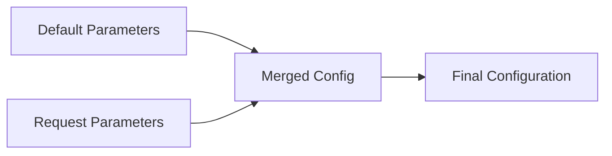
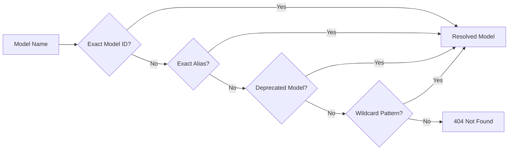

# :material-brain: Models and Routing

Which models the gateway offers, where they come from, and what it does with a model name a client sends. Part of the [Configuration Guide](operations_configuration.md).

## :material-format-list-bulleted: Settings Summary

### :material-cog: Application Behavior { #summary-application-behavior }

| Variable                                                            | Default                 | Description                                                                                |
|---------------------------------------------------------------------|-------------------------|--------------------------------------------------------------------------------------------|
| [`TIMEZONE`](operations_configuration_observability.md#timezone)                                             | `UTC`                   | IANA timezone identifier for request timestamps                                            |
| [`STRICT_INPUT_VALIDATION`](operations_configuration_observability.md#strict-input-validation)               | `false`                 | Reject API requests with unknown/extra fields                                              |
| [`CHAT_COMPLETIONS_REASONING_FIELD`](operations_configuration_observability.md#chat-completions-reasoning-field) | `reasoning_content` | Field carrying reasoning text on `/v1/chat/completions`: `reasoning_content`, `reasoning`, or `none` |
| [`MODEL_ALIASES`](#model-aliases)                                   | `{}`                    | JSON object mapping custom model name aliases to Bedrock model IDs, optionally with per-alias configuration |
| [`DEFAULT_TTS_MODEL`](operations_configuration_bedrock.md#default-tts-model)                           | `amazon.polly-standard` | Default TTS model: `amazon.polly-standard`, `-neural`, `-long-form`, or `-generative`      |
| [`DEFAULT_TTS_LANGUAGE`](operations_configuration_bedrock.md#default-tts-language)                     | None                    | Default language for TTS (e.g., `en-US`); when set, skips Amazon Comprehend auto-detection    |
| [`TOKENS_ESTIMATION`](operations_configuration.md#tokens-estimation)                           | `false`                 | Deprecated and ignored (token estimation removed)                                          |
| [`TOKENS_ESTIMATION_DEFAULT_ENCODING`](operations_configuration.md#tokens-encoding)            | `None`                  | Deprecated and ignored (token estimation removed)                                          |
| [`DEFAULT_MODEL_PARAMS`](#default-model-params)                     | `{}`                    | JSON object with per-model default inference parameters (temperature, max_tokens, etc.)    |
| [`DEFAULT_MODEL_SERVICE_TIERS`](#default-model-service-tiers)       | `{}`                    | JSON object with per-model default service tiers (default, flex, priority, reserved)        |
| [`AWS_BEDROCK_ALLOW_SERVICE_TIER_OVERRIDE`](#aws-bedrock-allow-service-tier-override) | `true` | Allow users to select the service tier per request, overriding the configured one (cost control) |
| [`MODEL_CACHE_SECONDS`](#model-cache-seconds)                       | `900`                   | Age in seconds at which the model list is refreshed in the background (default: 15 minutes) |
| [`MODEL_CACHE_MAX_STALE_SECONDS`](#model-cache-max-stale-seconds)   | `86400`                 | Age in seconds past which a request waits for the model list refresh (default: 24 hours)   |
| [`MODEL_CACHE_SHARED`](#model-cache-shared)                         | `false`                 | Share one model list between the deployment's servers through `AWS_DYNAMODB_TABLE`         |
| [`AI_RESPONSE_TIMEOUT`](operations_configuration_server.md#ai-response-timeout)                       | `600`                   | Maximum seconds without data from a model before the request times out (default: 10 min)   |
| [`SHUTDOWN_DRAIN_TIMEOUT`](operations_configuration_server.md#shutdown-drain-timeout)                 | `10`                    | Maximum seconds the server waits for background work to finish after being asked to stop   |
| [`DROP_UNSUPPORTED_SYSTEM_PROMPT`](#drop-unsupported-system-prompt) | `true`                  | Drop system prompts for unsupported models; when `false`, return error instead             |
| [`ANTHROPIC_BETA_FILTER`](#anthropic-beta-filter)                   | `true`                  | Enable filtering of unsupported `anthropic_beta` flags for Claude models                   |
| [`ANTHROPIC_BETA_ALLOWLIST`](#anthropic-beta-allowlist)             | None                    | Additional `anthropic_beta` flags to allow beyond built-in Bedrock defaults                |
| [`EXTRA_MODEL_PARAMS_DENYLIST`](#extra-model-params-denylist)       | None                    | Additional "extra model parameters" names to strip, beyond the built-in LiteLLM control-parameter denylist |
| [`EXTRA_MODEL_PARAMS_DROP_ALL`](#extra-model-params-drop-all)       | `false`                 | Disable the "extra model parameters" passthrough entirely                                  |
| [`IMAGE_GENERATION_MODEL`](#image-generation-model)                 | None                    | Default Bedrock image model ID used when the `image_generation` Responses API tool is invoked |
| [`REALTIME_CLIENT_SECRET_KEY`](operations_configuration_bedrock.md#realtime-client-secret-key)         | None                    | Secret the Realtime API's ephemeral client secrets are signed with; derived from the API key when unset |
| [`REALTIME_ALLOW_SESSION_OVERRIDE`](operations_configuration_bedrock.md#realtime-allow-session-override) | `true`                 | Allow a client holding an ephemeral client secret to override the session configuration it carries |
| [`REALTIME_WEBRTC_ENABLED`](operations_configuration_bedrock.md#realtime-webrtc-enabled)               | `false`                 | Serve WebRTC calls on `POST /v1/realtime/calls`, terminating the media path in-process |
| [`REALTIME_WEBRTC_STUN_SERVER`](operations_configuration_bedrock.md#realtime-webrtc-stun-server)       | None                    | STUN server the gateway uses to discover and advertise its public address to WebRTC callers |
| [`REALTIME_WEBRTC_TURN_SERVER`](operations_configuration_bedrock.md#realtime-webrtc-turn-server)       | None                    | Operator-run TURN relay advertised to WebRTC callers on UDP-blocking networks |
| [`REALTIME_WEBRTC_TURN_USERNAME`](operations_configuration_bedrock.md#realtime-webrtc-turn-server)     | None                    | Long-term credential username of the TURN relay |
| [`REALTIME_WEBRTC_TURN_PASSWORD`](operations_configuration_bedrock.md#realtime-webrtc-turn-server)     | None                    | Long-term credential password of the TURN relay |
| [`REALTIME_WEBRTC_ALLOW_PRIVATE_CANDIDATES`](operations_configuration_bedrock.md#realtime-webrtc-allow-private-candidates) | `false` | Accept the ICE candidates a caller offers on addresses that are not globally routable |

---

## :material-source-branch: Model Sources and Access

Which model catalogues the gateway draws from, and which model identifiers a request is allowed to name.

#### `AWS_BEDROCK_MANTLE_PREFERRED_MODELS` { #bedrock-mantle-preferred-models }

:octicons-package-24: **Purpose**
:   Model IDs (or ID prefixes) served by Amazon Bedrock Mantle even when also available on the classic bedrock-runtime endpoint

:octicons-database-24: **Type**
:   Comma-separated string of model IDs or ID prefixes

:octicons-gear-24: **Default**
:   `openai.gpt-5.6` (the OpenAI GPT-5.6 family; every other dual-homed model is served by bedrock-runtime)

:octicons-workflow-24: **Behavior**
:   Useful to leverage Mantle's independent throughput quotas, native response storage or built-in server tools for selected models. Mantle quotas (per-model, per-region tokens-per-minute) are independent from bedrock-runtime quotas.

:   The GPT-5.6 family is preferred by default because Amazon Bedrock serves its [`web_search`](api_openai_responses.md#openai-gpt-web-search) and `code_interpreter` tools on Mantle alone — on the classic endpoint they can only be refused.

:   An explicit value **replaces** the default rather than adding to it: repeat `openai.gpt-5.6` to keep the family on Mantle while preferring other models too.

```bash
export AWS_BEDROCK_MANTLE_PREFERRED_MODELS='openai.gpt-5.6,anthropic.claude-haiku-4-5'
```

!!! info "Not the same as a wildcard model name"
    This setting matches models by ID prefix and takes no glob syntax; it selects a *set* of models for the operator's own routing, where a [wildcard model name](#model-wildcard-patterns) selects *one* model for a single request.

!!! warning "The default is a price change for the GPT-5.6 family"
    Both endpoints charge the same In-Region rate, but Mantle has no cross-region inference profiles, so a model preferred here stops riding the Global profile that bedrock-runtime uses by default ([`AWS_BEDROCK_CROSS_REGION_INFERENCE_GLOBAL`](operations_configuration_aws.md#cross-region-global)). For GPT-5.6 that is **exactly 10% more per token** — $4.40 / $22.00 per million input / output tokens for Sol, $2.20 / $13.20 for Terra and $0.22 / $1.32 for Luna, against $4.00 / $20.00, $2.00 / $12.00 and $0.20 / $1.20 on the Global profile. Cached tokens and the long-context rates move by the same 10%; a deployment already pinned In-Region pays what it paid.

    Usage for these models is also recorded, and billed by AWS, under Bedrock Mantle rather than Bedrock — attributed by [project](operations_configuration_aws.md#bedrock-mantle-project) instead of by IAM principal — and [input token counting](api_openai_responses.md#input-token-counting) answers `400` for them. Batch inference, prompt caching and existing stored-response IDs are unaffected.

!!! danger "Incompatible with Bedrock Guardrails"
    Guardrails do not apply to Mantle-served requests, so a model routed here would be served unfiltered with nothing at request time able to report it. Configuring both — this setting alongside [`AWS_BEDROCK_GUARDRAIL_IDENTIFIER`](operations_configuration_bedrock.md#aws-bedrock-guardrail-identifier) or an [alias guardrail](#model-aliases-configuration) that targets a routed model — **stops the server at startup**, naming the routed models. A [per-request guardrail header](operations_configuration_bedrock.md#per-request-guardrail-configuration) cannot be checked at startup, so a request carrying one for a routed model is refused with `400` instead — see the warning there.

    To run guardrails, set this to an empty value:

    ```bash
    export AWS_BEDROCK_MANTLE_PREFERRED_MODELS=
    ```

    Every dual-homed model, GPT-5.6 included, then returns to bedrock-runtime — at its Global-profile price, under your guardrail, and with `web_search` and `code_interpreter` refused with a `400`. [`AWS_BEDROCK_MANTLE_SERVICE_HEADER`](operations_configuration_aws.md#bedrock-mantle-service-header) cannot bring them back for a single request: it is refused at startup alongside a guardrail for the same reason, so a guardrailed deployment serves those tools on no route. Setting [`AWS_BEDROCK_MANTLE_ENABLED`](operations_configuration_aws.md#bedrock-mantle-enabled) to `false` has the same effect on routing and additionally removes the Mantle-only models from the catalogue.

!!! danger "Incompatible with a Required End User Identity"
    A Mantle request is signed with the server's own credentials, so a model routed here never runs under the per-end-user role, and the policy conditions written on that role are never evaluated. Configuring this setting alongside [`AWS_BEDROCK_USER_ROLE_REQUIRE_IDENTITY`](operations_configuration_bedrock.md#aws-bedrock-user-role-require-identity) therefore **stops the server at startup**, naming the routed models; set this to an empty value to keep both. A request identifying no end user is still answered `400` on Mantle, so the Mantle-only models stay served — under the server's own role.

#### `AWS_BEDROCK_EXTERNAL_WEB_ACCESS` { #bedrock-external-web-access }

:octicons-package-24: **Purpose**
:   Let the built-in [web search tool](api_openai_responses.md#openai-gpt-web-search) reach the public web

:octicons-database-24: **Type**
:   Boolean

:octicons-gear-24: **Default**
:   `false`

:octicons-workflow-24: **Behavior**
:   Controls whether the built-in web search tool may reach the external web. Searches are answered from the Amazon Bedrock web index and cache either way, and answers are current and carry source citations. AWS [documents](https://docs.aws.amazon.com/bedrock/latest/userguide/web-search.html) that retrieval is served entirely from that index and cache today, so no request data leaves the AWS boundary even when this is enabled, and that a future release may allow live external retrieval — at which point request data may leave it. Enabling it is therefore a decision taken in advance about behaviour that can change. It also requires the `bedrock-websearch:ExternalWebAccess` IAM permission on the credentials this server uses; each action is authorized only when a model actually attempts it, and a denied call does not fail the request.

```bash
export AWS_BEDROCK_EXTERNAL_WEB_ACCESS=true
```

#### `AWS_BEDROCK_ALLOW_EXTERNAL_WEB_ACCESS_OVERRIDE` { #bedrock-allow-external-web-access-override }

:octicons-package-24: **Purpose**
:   Allow a request to override [`AWS_BEDROCK_EXTERNAL_WEB_ACCESS`](#bedrock-external-web-access) with the `external_web_access` extra model parameter

:octicons-database-24: **Type**
:   Boolean

:octicons-gear-24: **Default**
:   `false`

:octicons-workflow-24: **Behavior**
:   When `true`, a request that sends `external_web_access` as an extra model parameter decides for that request, on the models whose web search takes a web access choice per request — the OpenAI GPT-5.x family. When `false`, a request that sets it to anything other than the configured value is rejected with `400` rather than being silently overridden; a request that omits it always gets the configured value. A request asking for a value a model cannot be given is rejected with `400` as well, rather than accepted and quietly ignored. On the models that do take it, a request naming no web search tool is accepted: nothing is searched, so the value has no search to apply to.

```bash
export AWS_BEDROCK_ALLOW_EXTERNAL_WEB_ACCESS_OVERRIDE=true
```

#### `AWS_BEDROCK_LEGACY` { #bedrock-legacy }

:octicons-package-24: **Purpose**
:   Allow usage of legacy/deprecated Bedrock models

:octicons-database-24: **Type**
:   Boolean

:octicons-gear-24: **Default**
:   `false`

```bash
export AWS_BEDROCK_LEGACY=true
```

#### `AWS_BEDROCK_DEPRECATED_MODEL_FALLBACK` { #bedrock-deprecated-model-fallback }

:octicons-package-24: **Purpose**
:   Transparently reroute requests using a deprecated model ID to its recommended replacement

:octicons-database-24: **Type**
:   Boolean

:octicons-gear-24: **Default**
:   `true`

:octicons-workflow-24: **Behavior**
:   When `true`, any request that specifies a deprecated model ID (as listed in the server's deprecation registry) is silently retried with the recommended replacement model. The replacement is fully re-evaluated — alias resolution, modality checks, and region routing all apply to the new model ID. When `false`, deprecated model IDs return a `404` error with a message indicating the replacement, forcing clients to migrate explicitly.

```bash
# Transparent fallback (default) — clients using old model IDs keep working
export AWS_BEDROCK_DEPRECATED_MODEL_FALLBACK=true

# Strict mode — deprecated model IDs return 404, clients must update their code
export AWS_BEDROCK_DEPRECATED_MODEL_FALLBACK=false
```

#### `AWS_BEDROCK_DEPRECATED_MODELS` { #bedrock-deprecated-models }

:octicons-package-24: **Purpose**
:   Extend or override the built-in deprecated model registry with custom mappings

:octicons-database-24: **Type**
:   JSON object — `dict[str, str]`

:octicons-gear-24: **Default**
:   `{}`

:octicons-workflow-24: **Behavior**
:   Merged with the built-in registry at startup. User-provided entries take precedence over built-in ones — this means it can be used both to **add** new deprecated model mappings and to **override** the fallback target of an already-defined deprecated model. Effective only when [`AWS_BEDROCK_DEPRECATED_MODEL_FALLBACK`](#bedrock-deprecated-model-fallback) is `true`.

:octicons-link-external-24: **Reference**
:   [Amazon Bedrock model lifecycle](https://docs.aws.amazon.com/bedrock/latest/userguide/model-lifecycle.html)

```bash
# Add a custom deprecated model and override an existing built-in mapping
export AWS_BEDROCK_DEPRECATED_MODELS='{"my-old-model-v1": "my-new-model-v2", "amazon.titan-text-lite-v1": "amazon.nova-lite-v1:0"}'
```

#### `AWS_BEDROCK_MARKETPLACE_AUTO_SUBSCRIBE` { #bedrock-marketplace-auto-subscribe }

:octicons-package-24: **Purpose**
:   Control automatic subscription to new models in AWS Marketplace

:octicons-database-24: **Type**
:   Boolean

:octicons-gear-24: **Default**
:   `true`

:octicons-workflow-24: **Behavior**
:   When `true`, the server automatically subscribes to new models discovered in the AWS Marketplace, making them immediately available through the API. When `false`, only models with existing marketplace subscriptions are visible and accessible

:octicons-lock-24: **IAM Permissions Required**
:   `aws-marketplace:Subscribe`, `aws-marketplace:ViewSubscriptions` — see [Marketplace Auto-Subscribe IAM](operations_iam_permissions.md#bedrock-marketplace-auto-subscribe-iam)

```bash
# Allow automatic subscription (default)
export AWS_BEDROCK_MARKETPLACE_AUTO_SUBSCRIBE=true

# Restrict to pre-subscribed models only
export AWS_BEDROCK_MARKETPLACE_AUTO_SUBSCRIBE=false
```

!!! info "What is Marketplace Auto-Subscribe?"
    Amazon Bedrock requires marketplace subscription before certain models can be used. This setting controls whether stdapi.ai automatically handles the subscription process:

    - :material-check: **`true` (default)**: Models are automatically subscribed when discovered, so a newly published model is usable on its first request
    - :material-close: **`false`**: Only models that have already been subscribed through the AWS Marketplace are visible, providing explicit control over model access

!!! tip "When to Disable"
    Set to `false` when:

    - :material-shield-check: You need explicit control over which models are accessible
    - :material-cash: You want to prevent automatic marketplace subscriptions that may incur costs
    - :material-security: Your organization requires manual approval for new AI model usage
    - :material-account-check: Compliance policies require pre-authorization of AI models

!!! info "AWS Documentation"
    For more information about Bedrock model access and marketplace registration, see the [Amazon Bedrock Model Access documentation](https://docs.aws.amazon.com/bedrock/latest/userguide/model-access.html).

#### `AWS_BEDROCK_MARKETPLACE_ENDPOINTS_ENABLED` { #bedrock-marketplace-endpoints-enabled }

:octicons-package-24: **Purpose**
:   Publish the Amazon Bedrock Marketplace model endpoints deployed in this account and serve them as ordinary chat models

:octicons-database-24: **Type**
:   Boolean

:octicons-gear-24: **Default**
:   `false`

:octicons-workflow-24: **Behavior**
:   When `true`, the server discovers the Marketplace model endpoints deployed in this account and publishes them in the model list. This is serve-only: the server never creates, updates or deletes an endpoint — it only invokes ones the operator already deployed. An endpoint Amazon Bedrock has not yet registered, or that SageMaker has not brought into service, is not published; it appears at the next model-cache refresh once it is

:octicons-lock-24: **IAM Permissions Required**
:   `bedrock:ListMarketplaceModelEndpoints`, `bedrock:GetMarketplaceModelEndpoint`, `sagemaker:InvokeEndpoint`, `sagemaker:InvokeEndpointWithResponseStream` — see [Bedrock Marketplace Model Endpoints IAM](operations_iam_permissions.md#bedrock-marketplace-endpoints-iam)

```bash
# Disabled (default) - Marketplace model endpoints are never published
# No environment variable needed

# Publish Marketplace model endpoints deployed in this account
export AWS_BEDROCK_MARKETPLACE_ENDPOINTS_ENABLED=true
```

!!! warning "Off by Default: Paid, Hourly-Billed Infrastructure"
    A Marketplace model endpoint runs on dedicated instances billed by the instance-hour for as long as it exists, whether or not it is called, and reaching it needs extra IAM permissions beyond the core Bedrock policy. See [Bedrock Marketplace Model Endpoints cost](operations_cost_management.md#bedrock-marketplace-model-endpoints) for how this billing works.

!!! info "Served by the Generic Chat Implementation"
    A model endpoint is served by the generic chat implementation, so model-family-specific behavior is not applied to it. Token counting ([`/v1/responses/input_tokens`](api_openai_responses.md#input-token-counting) and `/anthropic/v1/messages/count_tokens`) is not available for these models — Amazon Bedrock's token counter accepts a foundation model only. Neither route is listed for them in [`search_models`](api_search_models.md), and calling one anyway answers `400`.

!!! info "Only What Amazon Bedrock Can Map Works"
    Amazon Bedrock only serves a Marketplace listing through its own chat API when it can map that listing's container to it. A listing it cannot map is still published, but fails at request time with a clean error — this is a documented limitation, and the server does not translate payloads on the listing's behalf.

#### `AWS_BEDROCK_MARKETPLACE_ENDPOINT_REGIONS` { #bedrock-marketplace-endpoint-regions }

:octicons-package-24: **Purpose**
:   Restrict which regions are searched for Amazon Bedrock Marketplace model endpoints

:octicons-code-24: **Format**
:   Comma-separated string of AWS region codes

:octicons-gear-24: **Default**
:   Every [`AWS_BEDROCK_REGIONS`](operations_configuration_aws.md#aws-bedrock-regions) entry

:octicons-workflow-24: **Behavior**
:   Every region listed here must also appear in [`AWS_BEDROCK_REGIONS`](operations_configuration_aws.md#aws-bedrock-regions), or the server refuses to start: a model endpoint is invoked in its own region and has no cross-region form, so a region the server does not otherwise serve could never answer

```bash
# Search only these regions for Marketplace model endpoints
export AWS_BEDROCK_MARKETPLACE_ENDPOINT_REGIONS=eu-west-1,us-east-1
```

!!! warning "An Endpoint Outside the Served Set Is Simply Never Published"
    An endpoint deployed in a region the server does not serve is never published — it does not appear in the model list, and a request naming it answers `404`. That is correct behavior, not a bug: invoking an endpoint always happens in its own region, so a region the server never searches can never be reached.

#### `AWS_BEDROCK_ALLOW_MARKETPLACE_ENDPOINT_ARN` { #bedrock-allow-marketplace-endpoint-arn }

:octicons-package-24: **Purpose**
:   Allow users to pass the ARN of an Amazon Bedrock Marketplace model endpoint directly as a model ID in API requests

:octicons-database-24: **Type**
:   Boolean

:octicons-gear-24: **Default**
:   `false`

:octicons-workflow-24: **Behavior**
:   When enabled, users can use a Marketplace model endpoint ARN instead of a model ID in the `model` parameter, including an endpoint that is not published in the model list. When disabled, only the published model IDs are accepted

```bash
# Disabled (default) - users can only use published model IDs
# No environment variable needed

# Enable Marketplace model endpoint ARN support
export AWS_BEDROCK_ALLOW_MARKETPLACE_ENDPOINT_ARN=true
```

!!! danger "Cost-Bearing Setting"
    A caller who can name any endpoint ARN can direct traffic at instances the account is already paying for, including endpoints the operator never intended to expose. Enable this only when every client is trusted with the account's full set of deployed endpoints.

!!! example "Example ARN"
    ```text
    arn:aws:sagemaker:us-east-1:123456789012:endpoint/my-endpoint
    ```

#### `AWS_SAGEMAKER_ENDPOINTS` { #aws-sagemaker-endpoints }

:octicons-package-24: **Purpose**
:   Publish Amazon SageMaker AI endpoints you run as chat models

:octicons-code-24: **Format**
:   JSON object, mapping the model ID clients name to that endpoint's declaration

:octicons-gear-24: **Default**
:   Empty — no SageMaker AI endpoint is served

:octicons-workflow-24: **Behavior**
:   Each entry publishes one endpoint in the model list and serves it on the chat completions, responses and messages APIs. The server only invokes the endpoints you name: it never creates, updates, scales or deletes one. Fields per entry:

    | Field | Required | Meaning |
    |---|---|---|
    | `endpoint` | yes | Endpoint name — the name, never the ARN |
    | `region` | yes | AWS Region the endpoint lives in |
    | `inference_component` | for component-hosted endpoints | Inference component name; required for a scale-to-zero endpoint, which is always component-hosted |
    | `name` | no | Display name in the model list (defaults to the model ID) |
    | `provider` | no | Provider in the model list (defaults to `Amazon SageMaker AI`) |
    | `input_modalities` | no | Input modalities to advertise, `["TEXT"]` by default; add `IMAGE` only when the model and its container accept image content parts |

:octicons-lock-24: **IAM Permissions Required**
:   `sagemaker:CallWithBearerToken`, `sagemaker:InvokeEndpoint` — see [SageMaker AI Endpoints IAM](operations_iam_permissions.md#sagemaker-endpoints-iam)

```bash
# Publish one endpoint as the model ID "my-qwen3"
export AWS_SAGEMAKER_ENDPOINTS='{
  "my-qwen3": {
    "endpoint": "my-endpoint",
    "region": "us-east-1",
    "inference_component": "my-inference-component",
    "name": "Qwen3 1.7B",
    "provider": "Qwen"
  }
}'
```

!!! warning "Paid, Hourly-Billed Infrastructure"
    A SageMaker AI endpoint is billed by the instance-hour for as long as it has instances running, whether or not it is called. Usage is reported with token counts and **no cost**, because AWS publishes no per-token rate for this path. See [SageMaker AI endpoint cost](operations_cost_management.md#sagemaker-endpoints-cost).

!!! info "The Container Must Serve the OpenAI Chat Completions API"
    Only a container that serves `/openai/v1/chat/completions` can answer here, which the SageMaker AI [vLLM and SGLang containers](https://docs.aws.amazon.com/sagemaker/latest/dg/realtime-endpoints-openai-compatible.html) do. What the container is configured for is what the model can do: tool calling needs a tool-call parser, reasoning content needs a reasoning parser. Token counting ([`/v1/responses/input_tokens`](api_openai_responses.md#input-token-counting) and `/anthropic/v1/messages/count_tokens`) is not available for these models and answers `400`; neither route is listed for them in [`search_models`](api_search_models.md).

!!! info "A Declared Model ID the Catalogue Already Publishes Is Ignored"
    An entry whose model ID matches a model already in the catalogue — a Bedrock foundation model, a Marketplace or Mantle model alike — is skipped, and the reason is reported in the startup log. Replacing a serverless model — available in every Region you serve, free at rest — with one endpoint in one Region would otherwise be a silent downgrade. Give the endpoint a model ID of its own.

!!! danger "Guardrails Do Not Apply to an Endpoint"
    An inference container serves the OpenAI Chat Completions API and has no `guardrailConfig` to carry, so an [Amazon Bedrock Guardrail](operations_configuration_bedrock.md#aws-bedrock-guardrail-identifier) cannot filter what one of these models answers. Rather than serve such a request unfiltered, the gateway refuses it with a `400`: a request reaching one of these models while a guardrail is configured — deployment-wide, [per request](operations_configuration_bedrock.md#per-request-guardrail-configuration), or from a [model alias](#model-aliases-configuration) — is answered with an error, never with an unguarded `200`. An alias carrying a guardrail and naming one of these models is decidable ahead of time and **stops the server at startup**; a deployment-wide guardrail warns instead, naming how many models it cannot reach, since these endpoints have no classic Bedrock home to fall back to.

!!! info "An Endpoint Invocation Runs Under the Server's Own Role"
    The endpoint is called with a bearer token presigned from the server's credentials, so [per-user cost attribution](operations_configuration_bedrock.md#aws-bedrock-user-role-arn) cannot apply here: an invocation never runs under the per-end-user role, and the `aws:PrincipalTag` conditions written on that role are never evaluated. [`AWS_BEDROCK_USER_ROLE_REQUIRE_IDENTITY`](operations_configuration_bedrock.md#aws-bedrock-user-role-require-identity) still holds — a request reaching one of these models while identifying no end user is answered `400`, not served unattributed. What the invocation costs is an instance-hour on an endpoint you own, and it is billed to your account either way.

#### `AWS_SAGEMAKER_WARMUP_TIMEOUT` { #aws-sagemaker-warmup-timeout }

:octicons-package-24: **Purpose**
:   How long a request may wait for a SageMaker AI endpoint that has scaled to zero to provision capacity again

:octicons-database-24: **Type**
:   Integer (seconds)

:octicons-gear-24: **Default**
:   `600`

:octicons-workflow-24: **Behavior**
:   An endpoint [scaled to zero](https://docs.aws.amazon.com/sagemaker/latest/dg/endpoint-auto-scaling-zero-instances.html) has no capacity to answer with, and the request that finds it cold is what makes AWS provision an instance again. Rather than surfacing that as an error, the server holds the connection and retries until the endpoint answers or this budget runs out; concurrent callers to the same endpoint share one wait. When the budget runs out the caller gets a `503` telling them to retry, and the real cause is logged for you. Set to `0` to disable the wait and answer that same `503` immediately — a retriable status, because a cold endpoint is a transient condition. It cannot exceed [`AI_RESPONSE_TIMEOUT`](operations_configuration_server.md#ai-response-timeout), or the server refuses to start

```bash
# Wait up to 10 minutes for a cold endpoint (default)
# No environment variable needed

# Fail immediately instead of waiting
export AWS_SAGEMAKER_WARMUP_TIMEOUT=0
```

!!! tip "The Wait Happens Before Anything Is Sent Back"
    Because the retry finishes before the model's first byte, a streaming request pays a longer time to first byte and nothing else: no partial stream, and a real HTTP status if the endpoint never comes up. Make sure any load balancer or proxy in front of the deployment tolerates that much silence — the [stdapi.ai Terraform module](https://registry.terraform.io/modules/stdapi-ai/stdapi-ai/aws/latest) defaults its idle timeout to an hour.

#### `AWS_SAGEMAKER_ENDPOINT_URL` { #aws-sagemaker-endpoint-url }

:octicons-package-24: **Purpose**
:   Override the Amazon SageMaker AI runtime endpoint URL

:octicons-code-24: **Format**
:   HTTPS URL template, with `{region}` substituted per Region

:octicons-gear-24: **Default**
:   Resolved automatically, per AWS partition

:octicons-workflow-24: **Behavior**
:   Only needed to reach the runtime through a VPC endpoint or an inspection proxy. Must use `https://`, and the `{region}` placeholder must be well formed, or the server refuses to start

```bash
# Reach SageMaker AI through an interface VPC endpoint
export AWS_SAGEMAKER_ENDPOINT_URL='https://vpce-0123-abcd.runtime.sagemaker.{region}.vpce.amazonaws.com'
```

## :material-cached: Model Cache

stdapi.ai automatically discovers and caches available Bedrock models from configured regions. Once the cache expires, the request that notices is answered from the cached list straight away and the refresh runs in the background — see [Model List Refresh](operations_resilience.md#model-list-refresh) for what that means for freshness.

#### `MODEL_CACHE_SECONDS` { #model-cache-seconds }

:octicons-package-24: **Purpose**
:   Age at which the cached Bedrock model list is refreshed

:octicons-database-24: **Type**
:   Integer (seconds, must be greater than 0)

:octicons-gear-24: **Default**
:   `900` (15 minutes)

:octicons-workflow-24: **Behavior**
:   Once the cached list reaches this age, the next request needing it (a model lookup, `/v1/models`, `/search_models`) is answered from the cached list and a refresh starts in the background: the server queries Amazon Bedrock to discover newly available models, pick up model access changes, and update inference profile configurations. This cache also applies to application inference profile and prompt router information when users pass ARNs directly (if enabled via [`AWS_BEDROCK_ALLOW_APPLICATION_INFERENCE_PROFILE_ARN`](operations_configuration_bedrock.md#bedrock-allow-application-profile-arn) or [`AWS_BEDROCK_ALLOW_PROMPT_ROUTER_ARN`](operations_configuration_bedrock.md#bedrock-allow-prompt-router-arn))

```bash
# Default: 15 minutes
export MODEL_CACHE_SECONDS=900

# More frequent updates (5 minutes)
export MODEL_CACHE_SECONDS=300

# Less frequent updates (1 hour)
export MODEL_CACHE_SECONDS=3600
```

!!! info "Refresh Behavior"
    - The refresh runs **only** when a request needs the list and the list has expired — there is no polling timer.
    - However many requests notice the expiry at once, **one** refresh runs; the others are answered immediately from the list already in memory.
    - The AWS calls (`ListFoundationModels`, `GetFoundationModelAvailability`, `ListInferenceProfiles`) run in parallel across regions, so a refresh takes about as long as the slowest region rather than scaling with their number.
    - A request only waits for a refresh in two cases: the server has no model list at all (its first request after a start that could not build one), and the list has passed [`MODEL_CACHE_MAX_STALE_SECONDS`](#model-cache-max-stale-seconds).

!!! tip "Tuning Recommendations"
    | Interval | Use Case | Trade-offs |
    |----------|----------|------------|
    | `300` (5 min) | :material-rocket: Development, testing new models | Faster model discovery, more AWS discovery calls |
    | `900` (15 min) | :material-check: Production (default, balanced) | Balanced freshness and API call volume |
    | `3600` (1 hour) | :material-cash: Stable production, cost optimization | Fewest AWS calls, slower model discovery |

    Lower cache lifetimes increase the frequency of the per-region discovery calls; very frequent refreshes in high-traffic deployments may approach API rate limits. Higher ones widen the window in which the list still advertises a model AWS has withdrawn.

#### `MODEL_CACHE_MAX_STALE_SECONDS` { #model-cache-max-stale-seconds }

:octicons-package-24: **Purpose**
:   Maximum age the cached model list may reach while its refresh keeps failing

:octicons-database-24: **Type**
:   Integer (seconds, `0` or more)

:octicons-gear-24: **Default**
:   `86400` (24 hours)

:octicons-workflow-24: **Behavior**
:   Below this age, an expired list is served while its refresh runs behind it. At or beyond it, the next request waits for a successful refresh instead — so a deployment whose refreshes fail silently (revoked `bedrock:ListFoundationModels`, a prolonged regional outage) cannot serve an arbitrarily old list, and a model that has been withdrawn stops being advertised. Each failed refresh is recorded in the server log, at `error` level once the list is more than two `MODEL_CACHE_SECONDS` old

```bash
# Default: 24 hours
export MODEL_CACHE_MAX_STALE_SECONDS=86400

# Tighter bound for a deployment where model availability changes matter
export MODEL_CACHE_MAX_STALE_SECONDS=3600

# Never serve an expired list: every expiry is refreshed synchronously
export MODEL_CACHE_MAX_STALE_SECONDS=0
```

!!! warning "`0` restores the wait on every expiry"
    With `0`, the first request after every expiry waits for the full discovery pass, which is the freshest and the slowest setting. Prefer a small non-zero value unless a request must never be answered from an expired list.

#### `MODEL_CACHE_SHARED` { #model-cache-shared }

:octicons-package-24: **Purpose**
:   Share one model list between the servers of a deployment

:octicons-database-24: **Type**
:   Boolean

:octicons-gear-24: **Default**
:   `false`

:octicons-workflow-24: **Behavior**
:   When enabled, the model list is published to the Amazon DynamoDB table named by [`AWS_DYNAMODB_TABLE`](operations_configuration_storage.md#aws-dynamodb-table), which is required. One server refreshes the list and publishes it; the others read it instead of querying Amazon Bedrock themselves, so a fleet performs one discovery pass per `MODEL_CACHE_SECONDS` instead of one per server, and a server that starts serves requests without a discovery pass of its own. Any table error is recorded in the server log and the server falls back to querying Amazon Bedrock itself

```bash
export AWS_DYNAMODB_TABLE=stdapi-ai
export MODEL_CACHE_SHARED=true
```

!!! info "When it helps, and when it does not"
    - It pays off from a handful of servers upward, or wherever tasks start and stop often (autoscaling, rolling deployments): the discovery pass is what a starting server otherwise has to complete before it is useful.
    - Servers only share a list when they run the same version, in the same AWS account, with the same `AWS_BEDROCK_*` **and** `AWS_SAGEMAKER_*` configuration — every setting under those prefixes, not only the ones discovery reads, because being too broad costs a refresh while being too narrow serves one deployment's catalogue to another. Anything else reads as an empty cache, which is why a rolling deployment briefly has every server discovering on its own again.
    - The table is only read and written when the list has expired, so the request rate does not change with traffic. See [the cost of an enabled shared list](operations_cost_management.md#model-list-sharing).
    - Setting it without `AWS_DYNAMODB_TABLE` fails startup with a message naming both.

---

## :material-tune: Default Model Parameters

Configure default inference parameters applied automatically to specific models.

!!! success "What You Can Do"
    - :material-thermometer: Set consistent temperature/creativity levels per model
    - :material-flask: Enable provider-specific features (e.g., Anthropic beta features)
    - :material-cash: Configure default token limits for cost control
    - :material-stop: Apply model-specific stop sequences

!!! info "Parameter Precedence"
    Request parameters **always take precedence** over defaults.

#### `DEFAULT_MODEL_PARAMS` { #default-model-params }

:octicons-package-24: **Purpose**
:   Per-model default parameters

:octicons-code-24: **Format**
:   JSON object with model IDs as keys

**Supported Parameters:**

| Parameter | Type | Range | Description |
|-----------|------|-------|-------------|
| `temperature` | Float | ≥ 0 | Sampling temperature |
| `top_p` | Float | ≥ 0 | Nucleus sampling |
| `max_tokens` | Integer | ≥ 1 | Maximum response tokens |
| `stop_sequences` | String/Array | - | Stop generation tokens |
| Provider-specific | Various | - | e.g., `anthropic_beta` |

Only the outer JSON shape (an object of per-model objects) is validated at startup. The parameter values above are validated lazily, the first time a model with configured defaults is used: a wrong type, or a value below the lower bounds shown in the table, fails that request with HTTP `400`. The numeric ceilings (for example the usual `top_p` maximum of `1.0`) are enforced by Amazon Bedrock and the target model.

!!! info "Not the same as a wildcard model name"
    The keys of this setting match models by ID prefix and take no glob syntax; they select a *set* of models for the operator's own defaults, where a [wildcard model name](#model-wildcard-patterns) selects *one* model for a single request.

### Configuration Examples { #default-model-params-examples }

**Basic Parameters:**

```bash
export DEFAULT_MODEL_PARAMS='{
  "amazon.nova-micro-v1:0": {
    "temperature": 0.3,
    "max_tokens": 800
  }
}'
```

**Provider-Specific Features:**

```bash
export DEFAULT_MODEL_PARAMS='{
  "anthropic.claude-sonnet-5": {
    "anthropic_beta": ["Interleaved-thinking-2025-05-14"]
  }
}'
```

**Multiple Models:**

```bash
export DEFAULT_MODEL_PARAMS='{
  "amazon.nova-micro-v1:0": {
    "temperature": 0.3,
    "max_tokens": 500
  },
  "amazon.nova-lite-v1:0": {
    "temperature": 0.7,
    "max_tokens": 2000
  },
  "anthropic.claude-sonnet-5": {
    "temperature": 0.5,
    "top_p": 0.9,
    "anthropic_beta": ["Interleaved-thinking-2025-05-14"]
  }
}'
```

**Advanced Configuration:**

```bash
export DEFAULT_MODEL_PARAMS='{
  "amazon.nova-pro-v1:0": {
    "temperature": 0.7,
    "top_p": 0.95,
    "max_tokens": 4096,
    "stop_sequences": ["Human:", "Assistant:"]
  }
}'
```

### Parameter Merging



1. :material-numeric-1-circle: **Default parameters** are applied first (from `DEFAULT_MODEL_PARAMS`)
2. :material-numeric-2-circle: **Request parameters** override defaults if both are specified
3. :material-numeric-3-circle: **Provider-specific fields** are forwarded to Bedrock as additional model request fields
4. :material-numeric-4-circle: **Unsupported fields** reach Bedrock as-is, and a field the model rejects surfaces as a `ValidationException` returned to the client as HTTP `400`. Three cases are handled before that: `anthropic_beta` flags are filtered individually against an allowlist (see [`ANTHROPIC_BETA_FILTER`](#anthropic-beta-filter)); a system prompt sent to a model that does not support one is dropped when [`DROP_UNSUPPORTED_SYSTEM_PROMPT`](#drop-unsupported-system-prompt) is enabled (the default); and Amazon Nova 2 drops `max_tokens` when reasoning effort is `high`, logging a warning

---

## :material-layers-triple: Default Model Service Tiers { #default-model-service-tiers-section }

Configure default service tiers applied automatically to specific Bedrock models.

!!! success "What You Can Do"
    - :material-layers: Set cost-efficient tiers for batch and agentic workloads by default
    - :material-speedometer: Configure priority tiers for latency-sensitive models
    - :material-cash: Optimize compute costs without modifying client requests

!!! info "Available Service Tiers"
    | Tier       | Description                                                       |
    |------------|-------------------------------------------------------------------|
    | `default`  | Standard compute tier (default)                                   |
    | `flex`     | Flexible compute tier for cost optimization                       |
    | `priority` | Priority compute tier for lower latency                           |
    | `reserved` | Reserved capacity for dedicated resources (requires AWS contract) |

!!! tip "When to Use Each Tier"
    - **Default**: Everyday AI tasks like content generation and text analysis
    - **Flex**: Cost-sensitive workloads like model evaluations, summarization, and agentic workflows
    - **Priority**: Mission-critical applications requiring lowest latency
    - **Reserved**: Predictable workloads needing 99.5% uptime guarantee (requires AWS contact)

!!! warning "Model Support"
    Not all models support all service tiers. Check the [official AWS documentation](https://docs.aws.amazon.com/bedrock/latest/userguide/service-tiers-inference.html) for each model's supported tiers.

    **Examples:**

    - `amazon.nova-pro-v1:0` supports: `default`, `flex`, `priority` (not `reserved`)
    - `amazon.nova-premier-v1:0` (legacy) supports: `default`, `flex`, `priority`, `reserved`

!!! info "Tier Precedence"
    Explicit request parameters take precedence over the tier configured for the model, unless [`AWS_BEDROCK_ALLOW_SERVICE_TIER_OVERRIDE`](#aws-bedrock-allow-service-tier-override) is disabled.

#### `DEFAULT_MODEL_SERVICE_TIERS` { #default-model-service-tiers }

:octicons-package-24: **Purpose**
:   Per-model default service tier

:octicons-code-24: **Format**
:   JSON object with model IDs as keys and tier string as value

:octicons-gear-24: **Default**
:   `{}`

**Supported Values:**

| Value      | Description                                       |
|------------|---------------------------------------------------|
| `default`  | Standard compute (Bedrock default)                |
| `flex`     | Cost-optimized flexible compute                   |
| `priority` | Lower-latency priority compute                    |
| `reserved` | Dedicated reserved capacity (requires AWS contract) |

!!! info "Not the same as a wildcard model name"
    The keys of this setting match models by ID prefix and take no glob syntax; they select a *set* of models for the operator's own defaults, where a [wildcard model name](#model-wildcard-patterns) selects *one* model for a single request.

#### `AWS_BEDROCK_ALLOW_SERVICE_TIER_OVERRIDE` { #aws-bedrock-allow-service-tier-override }

:octicons-package-24: **Purpose**
:   Control whether clients can select the service tier at request level

:octicons-gear-24: **Default**
:   `true` (clients may select a tier)

:octicons-cash-24: **Cost Consideration**
:   Service tiers are billed at different rates. Set to `false` on a shared deployment to pin every model to the tier you configured, so a client cannot move its traffic to a more expensive tier. A model with no configured tier still honors the request in either case.

:octicons-alert-24: **Scope**
:   Applies to models served through the Bedrock Converse and InvokeModel APIs. A [Bedrock Mantle](operations_configuration_aws.md#summary-bedrock-mantle)-served model carries no configured tier, so its requests always run on the tier they name.

```bash
export AWS_BEDROCK_ALLOW_SERVICE_TIER_OVERRIDE=false
```

### Configuration Examples { #service-tier-examples }

**Single Model:**

```bash
export DEFAULT_MODEL_SERVICE_TIERS='{
  "amazon.nova-pro-v1:0": "flex"
}'
```

**Multiple Models:**

```bash
export DEFAULT_MODEL_SERVICE_TIERS='{
  "amazon.nova-pro-v1:0": "flex",
  "amazon.nova-premier-v1:0": "priority"
}'
```

### Service Tier Merging

For models served through the Bedrock Converse and InvokeModel APIs:

1. :material-numeric-1-circle: **Explicit request parameter** takes highest priority
2. :material-numeric-2-circle: **HTTP header** (`X-Amzn-Bedrock-Service-Tier`, see [Per-Request Service Tier Configuration](operations_configuration_bedrock.md#service-tier-per-request)) overrides defaults
3. :material-numeric-3-circle: **Tier configured on the requested alias** (see [Model Aliases](#model-aliases-section)) applies if the request sets none
4. :material-numeric-4-circle: **Default from** `DEFAULT_MODEL_SERVICE_TIERS` applies if neither does
5. :material-numeric-5-circle: **No service tier** passed to Bedrock if unset

Steps 1 and 2 are skipped when [`AWS_BEDROCK_ALLOW_SERVICE_TIER_OVERRIDE`](#aws-bedrock-allow-service-tier-override) is `false` and a tier is configured.

On a [Bedrock Mantle](operations_configuration_aws.md#summary-bedrock-mantle)-served model, only step 1 applies: the request's own `service_tier` is forwarded as sent, and neither the header, nor an alias' tier, nor `DEFAULT_MODEL_SERVICE_TIERS` takes part.

---

## :material-label: Model Aliases { #model-aliases-section }

Configure custom aliases to map user-friendly model names to actual model IDs. This enables OpenAI API compatibility and simplifies model references.

!!! success "What You Can Do"
    - :material-label: Create custom aliases for frequently used models
    - :material-api: Enable OpenAI-compatible model names by default
    - :material-swap-horizontal: Simplify model ID references in API requests
    - :material-transition: Migrate between model versions by repointing an alias, without touching client code

!!! info "Default Aliases"
    stdapi.ai includes default aliases for OpenAI compatibility:

    - `tts-1` → `amazon.polly-standard`
    - `tts-1-hd` → `amazon.polly-neural`
    - `whisper-1` → `amazon.transcribe`

    stdapi.ai also supports dynamic model name aliases matching official provider APIs (OpenAI, Anthropic). You can use model names from provider documentation (e.g., `claude-sonnet-5`, `gpt-oss-20b`) which are automatically resolved to their corresponding Amazon Bedrock model identifiers.


#### `MODEL_ALIASES` { #model-aliases }

:octicons-package-24: **Purpose**
:   Map alias names to actual model IDs or ARNs

:octicons-code-24: **Format**
:   JSON object with alias names as keys, and as values either a model ID or ARN, or an object carrying that model plus the configuration to apply to it

:octicons-gear-24: **Default**
:   `{}` (empty, uses built-in defaults only)

!!! tip "Advanced Routing with ARNs"
    Model aliases can also reference ARNs for Application Inference Profiles or Prompt Routers, enabling advanced routing strategies through friendly alias names. See [Using Inference Profile and Prompt Router ARNs](operations_configuration_bedrock.md#using-inference-profile-and-prompt-router-arns) for more details.

### Aliases That Carry Configuration { #model-aliases-configuration }

An alias may map to an object instead of a model name. Every request naming that alias then gets the configuration attached to it, so one deployment can publish the same model under several names with different tiers, safeguards or defaults.

Every field below is designed around an **Amazon Bedrock** model call. An alias pointing at a model served by another AWS service — Amazon Polly, Amazon Transcribe, Amazon Comprehend — still resolves the name, and two fields keep working there: `extra_params` applies wherever the route accepts model parameters, and `guardrail_id` is enforced on the routes that check content through [Amazon Bedrock Guardrails](https://docs.aws.amazon.com/bedrock/latest/userguide/guardrails.html) (speech input, transcripts) — a billed guardrail evaluation. `service_tier` and `metadata` configure the Bedrock call itself and are ignored on those services.

| Field                | Purpose                                                                                       |
|----------------------|-----------------------------------------------------------------------------------------------|
| `model`              | **Required.** Model ID or ARN the alias resolves to                                            |
| `service_tier`       | Service tier for requests naming the alias, on a model served through the Bedrock Converse or InvokeModel APIs — see [Default Model Service Tiers](#default-model-service-tiers-section) |
| `guardrail_id`       | ID of an [Amazon Bedrock Guardrail](https://docs.aws.amazon.com/bedrock/latest/userguide/guardrails.html) to apply, requires `guardrail_version`; `guardrail_identifier` is accepted as the same field |
| `guardrail_version`  | Version of that guardrail                                                                      |
| `guardrail_trace`    | Guardrail trace level: `disabled`, `enabled` or `enabled_full`                                 |
| `metadata`           | Key-value metadata attached to the model call, for audit reporting — it reaches [Amazon Bedrock model invocation logs](https://docs.aws.amazon.com/bedrock/latest/userguide/model-invocation-logging.html), which you enable and deliver yourself, and nothing else: it is not a cost allocation tag, see [AWS Cost Attribution](operations_cost_management.md#aws-cost-attribution) |
| `extra_params`       | Model parameters, in the format of [`DEFAULT_MODEL_PARAMS`](#default-model-params)             |

```bash
export MODEL_ALIASES='{
  "support-assistant": {
    "model": "amazon.nova-lite-v1:0",
    "service_tier": "flex",
    "guardrail_id": "abc123def456",
    "guardrail_version": "1",
    "metadata": {"team": "support"},
    "extra_params": {"temperature": 0.2}
  }
}'
```

!!! info "Precedence"
    Each field resolves in one order: **the request**, then **the alias**, then the **server-wide setting** for that field. A field the alias leaves unset falls through to the server-wide value, and a client that sends nothing gets the alias' configuration.

    The two settings that decide whether a request may override an administrator's value apply to the alias layer as well:

    - [`AWS_BEDROCK_ALLOW_GUARDRAIL_OVERRIDE`](operations_configuration_bedrock.md#aws-bedrock-allow-guardrail-override) — when `false`, the alias' guardrail holds and request headers cannot replace it
    - [`AWS_BEDROCK_ALLOW_SERVICE_TIER_OVERRIDE`](#aws-bedrock-allow-service-tier-override) — when `false`, the alias' service tier holds and the request cannot select another

!!! warning "Startup Validation"
    An alias object is validated when the server starts: an unknown field, a missing `model`, a guardrail ID without its version, or an out-of-range `extra_params` value stops startup with an error naming the alias. A typo never becomes a silently ignored setting.

    An alias whose `guardrail_id` targets a model served through [Bedrock Mantle](operations_configuration_aws.md#summary-bedrock-mantle) also stops startup: Amazon Bedrock Guardrails do not apply to those models, and serving them unfiltered while a guardrail is configured would be a silent gap. Point the alias at another model, or — when the model is also available on the classic endpoint — remove it from [`AWS_BEDROCK_MANTLE_PREFERRED_MODELS`](#bedrock-mantle-preferred-models) so it is served where guardrails apply.

!!! note "Scope on Bedrock Mantle models"
    On a [Bedrock Mantle](operations_configuration_aws.md#summary-bedrock-mantle)-served model, `guardrail_id` is rejected at startup as above, and `service_tier`, `metadata` and `extra_params` — like the server-wide [`DEFAULT_MODEL_SERVICE_TIERS`](#default-model-service-tiers) and [`DEFAULT_MODEL_PARAMS`](#default-model-params) — do not apply. Such a request runs on the tier it names itself, and on that model's default tier when it names none.

### Configuration Examples { #model-aliases-examples }

**Basic Alias:**

```bash
export MODEL_ALIASES='{
  "my-tts": "amazon.polly-neural",
  "my-stt": "amazon.transcribe"
}'
```

**Override Default Aliases:**

```bash
# Override the default tts-1 mapping
export MODEL_ALIASES='{
  "tts-1": "amazon.polly-generative"
}'
```

**Multiple Custom Aliases:**

```bash
export MODEL_ALIASES='{
  "fast-model": "amazon.nova-micro-v1:0",
  "balanced-model": "amazon.nova-lite-v1:0",
  "quality-model": "amazon.nova-pro-v1:0",
  "claude": "anthropic.claude-sonnet-5"
}'
```

**Map OpenAI Models to Bedrock:**

```bash
# Make OpenAI model names work with Amazon Bedrock models
export MODEL_ALIASES='{
  "gpt-5": "anthropic.claude-sonnet-5",
  "gpt-4o": "anthropic.claude-sonnet-5",
  "gpt-4o-mini": "anthropic.claude-haiku-4-5-20251001-v1:0",
  "dall-e-3": "amazon.nova-canvas-v1:0",
  "dall-e-2": "stability.stable-image-ultra-v1:1"
}'
```

**Override Deprecated Models:**

```bash
# Redirect deprecated model IDs to their newer replacements
export MODEL_ALIASES='{
  "amazon.titan-image-generator-v1": "amazon.nova-canvas-v1:0",
  "amazon.titan-text-express-v1": "amazon.nova-lite-v1:0",
  "anthropic.claude-3-5-sonnet-20240620-v1:0": "anthropic.claude-sonnet-5",
  "stability.stable-image-ultra-v1:0": "stability.stable-image-ultra-v1:1"
}'
```

**Advanced Routing with ARNs:**

```bash
# Map friendly names to Application Inference Profiles or Prompt Routers
export MODEL_ALIASES='{
  "my-router": "arn:aws:bedrock:us-east-1:123456789012:default-prompt-router/cost-optimizer",
  "my-profile": "arn:aws:bedrock:us-east-1:123456789012:application-inference-profile/abc123xyz"
}'
```

### Using Aliases in API Requests

Once configured, aliases can be used anywhere a model ID is expected:

```bash
# Using the default tts-1 alias
curl https://api.example.com/v1/audio/speech \
  -H "Authorization: Bearer $API_KEY" \
  -H "Content-Type: application/json" \
  -d '{
    "model": "tts-1",
    "input": "Hello world",
    "voice": "alloy"
  }'

# Using a custom alias
curl https://api.example.com/v1/chat/completions \
  -H "Authorization: Bearer $API_KEY" \
  -H "Content-Type: application/json" \
  -d '{
    "model": "fast-model",
    "messages": [{"role": "user", "content": "Hello"}]
  }'
```

### Alias Resolution



1. :material-numeric-1-circle: **An exact model ID** wins outright, a model served through [Bedrock Mantle](operations_configuration_aws.md#summary-bedrock-mantle) included.
2. :material-numeric-2-circle: **An exact alias** resolves next — a [built-in default](#model-aliases-section) or one set in [`MODEL_ALIASES`](#model-aliases). An alias configured with a name that happens to look like a wildcard pattern — `claude-*`, say — is still a plain alias, and it wins here, before pattern resolution is ever tried; worth knowing, because it is easy to configure by accident.
3. :material-numeric-3-circle: **A deprecation replacement** applies to a name [`AWS_BEDROCK_DEPRECATED_MODEL_FALLBACK`](#bedrock-deprecated-model-fallback) covers.
4. :material-numeric-4-circle: **A [wildcard pattern](#model-wildcard-patterns)** resolves last, only once none of the above named a model.

The resolved model is validated and used for the request; a name matching none of the above answers `404`. The response names the concrete model that served the request, never the alias or the pattern it was sent as — except [`POST /v1/moderations`](api_openai_moderations.md), which echoes the `model` value the caller sent, by design.

### Model Wildcard Patterns { #model-wildcard-patterns }

Anywhere a request names a model, it may name a glob pattern instead of an exact name, and the server serves the most recently released match — the same release date [`GET /search_models`](api_search_models.md) publishes as `start_of_life_time` and [`GET /v1/models`](api_openai_models.md) publishes as `created` for each model.

- **Glob syntax only** — `*` and `?`, case-sensitive; no regular expressions, no character classes (`[...]` is refused with `400`, not treated as a class or as a literal). `claude-sonnet-*`, `claude-opus-*` and `amazon.nova-*` all work.
- **At least three characters before the first `*` or `?`.** A broader pattern is refused with `400`, and a bare `*` is never accepted.
- **At most 255 characters.** A longer pattern is refused with `400`.
- **Matched against both model IDs and aliases.**
- **Scoped to the endpoint called** — the same pattern can resolve to a different model on chat than on embeddings.
- **Resolved once, when the request is accepted.** A batch job created with a pattern is pinned to the model that pattern meant that day, and reports that concrete model for its whole life.
- **Never a legacy model, a model [`AWS_BEDROCK_DEPRECATED_MODEL_FALLBACK`](#bedrock-deprecated-model-fallback) covers, or a model whose first use would open a paid Marketplace subscription.** Name one of those explicitly and it still resolves exactly as it does today; a pattern only ever skips over it.
- **A model whose release date the server cannot order is never selected by a pattern**, and its presence never makes an otherwise-unique match ambiguous — a property of that model, not of any particular catalogue. On [`POST /v1/audio/speech`](api_openai_audio_speech.md) every model is one of these — Polly carries no release date — so a pattern there is accepted but never matches anything, and always answers `404`.

!!! warning "Ambiguity is refused, never guessed"
    When two or more matches were released on the same date, the request fails with `400` naming them, and asks you to name one explicitly or narrow the pattern. `openai.gpt-5.6-*` (Sol, Terra and Luna, released together) and `stability.*` on the image routes are real examples: sibling models released together are often priced differently, so picking one would spend your money on a model you never named.

Use [`GET /search_models?model=<pattern>`](api_search_models.md#query-parameters) to see everything a pattern matches, newest first, before relying on it in a request — the recommended way to check what a pattern will do.

Two routes take a concrete model only, never a pattern: [`POST /v1/moderations`](api_openai_moderations.md) resolves the model before the request is examined, and [`POST /v1/realtime/client_secrets`](api_openai_realtime.md#ephemeral-client-secrets) fixes the model into the ephemeral token before a connection exists — the realtime WebSocket endpoint's own `model` parameter does accept a pattern.

---

## :material-message-text: System Prompt Handling

Control how system prompts are handled for models that don't support them.

#### `DROP_UNSUPPORTED_SYSTEM_PROMPT` { #drop-unsupported-system-prompt }

:octicons-package-24: **Purpose**
:   Control system prompt behavior for models that don't support system prompts

:octicons-database-24: **Type**
:   Boolean

:octicons-gear-24: **Default**
:   `true`

```bash
# Default: silently drop system prompts for unsupported models
export DROP_UNSUPPORTED_SYSTEM_PROMPT=true

# Strict mode: return error when system prompt is used with unsupported model
export DROP_UNSUPPORTED_SYSTEM_PROMPT=false
```

!!! info "Models Without System Prompt Support"
    Some Bedrock models don't support system prompts, including:

    - `mistral.mistral-7b-instruct-v0:2`
    - `mistral.mixtral-8x7b-instruct-v0:1`
    - Other older or specialized models

!!! success "Use Cases"
    **Enable (true, default)** for:

    - :material-check: **Backward compatibility** - Existing applications continue working
    - :material-swap-horizontal: **Model flexibility** - Switch between models without code changes
    - :material-shield-check: **Graceful degradation** - System prompts are ignored instead of failing
    - :material-application: **Global system prompts** - Applications that set a system prompt for every model keep working against models that do not accept one

    **Disable (false)** for:

    - :material-alert: **Strict validation** - Catch configuration errors early
    - :material-bug: **Debugging** - Identify when system prompts aren't being used
    - :material-shield-alert: **Security requirements** - Ensure system prompts are always applied

## :material-flask: Anthropic Beta Flag Filtering

Anthropic-compatible clients like Claude Code send `anthropic-beta` headers with experimental beta flags. Many of these flags (such as `files-api-2025-04-14`, `prompt-caching-2024-07-31`) are **not supported by Amazon Bedrock** and cause `ValidationException` errors (HTTP 400).

stdapi.ai automatically filters out unsupported flags while preserving supported ones, so clients work without any special configuration. Previously, the workaround was to set `CLAUDE_CODE_DISABLE_EXPERIMENTAL_BETAS=1` on the client side, but this also disabled Bedrock-supported flags like `Interleaved-thinking-2025-05-14` and `token-efficient-tools-2025-02-19`, degrading capabilities. This workaround is no longer needed.

Filtering is controlled by two settings: [`ANTHROPIC_BETA_FILTER`](#anthropic-beta-filter) to enable or disable it, and [`ANTHROPIC_BETA_ALLOWLIST`](#anthropic-beta-allowlist) to extend the built-in set of allowed flags.

#### `ANTHROPIC_BETA_FILTER` { #anthropic-beta-filter }

:octicons-package-24: **Purpose**
:   Enable or disable filtering of unsupported `anthropic_beta` flags for Anthropic Claude models

:octicons-database-24: **Type**
:   Boolean

:octicons-gear-24: **Default**
:   `true`

:octicons-workflow-24: **Behavior**
:   When enabled, `anthropic_beta` flags not in the allowlist are silently removed from requests before they reach Bedrock. A warning is logged when flags are filtered. When disabled, all flags are passed through to Bedrock as-is

```bash
# Enabled (default) - filter unsupported flags automatically
# No environment variable needed

# Disable filtering entirely (pass all flags through to Bedrock)
export ANTHROPIC_BETA_FILTER=false
```

!!! tip "When to Disable"
    Set to `false` only when:

    - :material-test-tube: **Testing** - You want to verify Bedrock behavior with specific flags directly
    - :material-cog: **Custom setups** - You manage flag compatibility at the client level

#### `ANTHROPIC_BETA_ALLOWLIST` { #anthropic-beta-allowlist }

:octicons-package-24: **Purpose**
:   Add extra `anthropic_beta` flags to the built-in set of Bedrock-supported flags

:octicons-code-24: **Format**
:   Comma-separated string of additional beta flag names

:octicons-gear-24: **Default**
:   Empty (only the built-in Bedrock defaults are used)

:octicons-workflow-24: **Behavior**
:   The flags specified here are **merged with** the built-in set of Bedrock-supported flags. You only need to specify extra flags beyond the defaults (e.g., newly added Bedrock flags). Only effective when [`ANTHROPIC_BETA_FILTER`](#anthropic-beta-filter) is `true`

```bash
# Use built-in defaults only (recommended) - no environment variable needed

# Add newly supported Bedrock flags without waiting for a stdapi.ai update
export ANTHROPIC_BETA_ALLOWLIST='new-feature-2026-03-01,another-flag-2026-04-01'
```

**Built-in Allowed Flags:**

| Flag                               | Feature                       |
|------------------------------------|-------------------------------|
| `computer-use-2024-10-22`          | Computer use (Claude 3.5)     |
| `computer-use-2025-01-24`          | Computer use (Claude 3.7)     |
| `computer-use-2025-11-24`          | Computer use (Claude 4.5/4.6) |
| `token-efficient-tools-2025-02-19` | Token efficient tools         |
| `Interleaved-thinking-2025-05-14`  | Interleaved thinking          |
| `output-128k-2025-02-19`           | 128K output                   |
| `dev-full-thinking-2025-05-14`     | Raw thinking dev mode         |
| `context-1m-2025-08-07`            | 1M context                    |
| `context-management-2025-06-27`    | Context management (memory)   |
| `effort-2025-11-24`                | Effort control                |
| `tool-search-tool-2025-10-19`      | Tool search                   |
| `tool-examples-2025-10-29`         | Tool use examples             |

!!! success "Use Cases"
    **Filtering enabled (default)** for:

    - :material-robot: **Claude Code via Bedrock** - Clients work without `CLAUDE_CODE_DISABLE_EXPERIMENTAL_BETAS=1`
    - :material-shield-check: **Production stability** - Prevent unsupported flags from causing request failures
    - :material-swap-horizontal: **Drop-in compatibility** - Clients configured for direct Anthropic API work through stdapi.ai without changes

#### `EXTRA_MODEL_PARAMS_DENYLIST` { #extra-model-params-denylist }

:octicons-package-24: **Purpose**
:   Add extra parameter names to strip from the "extra model parameters" passthrough (any undeclared top-level JSON field on a chat or non-chat route, forwarded to Bedrock as a provider-specific inference field)

:octicons-code-24: **Format**
:   Comma-separated string of additional parameter names

:octicons-gear-24: **Default**
:   Empty (only the built-in denylist is used)

:octicons-workflow-24: **Behavior**
:   The names specified here are **merged with** the built-in denylist of LiteLLM client-control parameters (such as `drop_params`, `api_key`, `custom_llm_provider`) that some OpenAI-SDK-based clients leak into `extra_body` and that are never legitimate Bedrock model parameters — for example RAGFlow hardcodes `extra_body={"drop_params": True}` on every embeddings call, which previously reached Bedrock as an unrecognized inference field and failed with `ValidationException`. Every other extra parameter keeps being forwarded as before. Only effective when [`EXTRA_MODEL_PARAMS_DROP_ALL`](#extra-model-params-drop-all) is `false`

```bash
# Use the built-in denylist only (recommended) - no environment variable needed

# Also strip a project-specific control field some client leaks into requests
export EXTRA_MODEL_PARAMS_DENYLIST='x_internal_debug_flag,x_proxy_trace_id'
```

!!! info "Not the same as a wildcard model name"
    This denylist matches *parameter names*, and separately, the settings above it match *models* by ID prefix — neither takes glob syntax. A [wildcard model name](#model-wildcard-patterns) is a different mechanism again: it selects *one* model for a single request, not a set of parameters or models for the operator's own configuration.

#### `EXTRA_MODEL_PARAMS_DROP_ALL` { #extra-model-params-drop-all }

:octicons-package-24: **Purpose**
:   Disable the "extra model parameters" passthrough entirely

:octicons-database-24: **Type**
:   Boolean

:octicons-gear-24: **Default**
:   `false`

:octicons-workflow-24: **Behavior**
:   When enabled, no undeclared request field is ever forwarded to Bedrock as a provider-specific inference parameter, on every route that supports the passthrough (chat completions/responses/messages, and embeddings/images/audio/rerank/etc.). This overrides [`EXTRA_MODEL_PARAMS_DENYLIST`](#extra-model-params-denylist): with drop-all enabled, denylist filtering no longer matters because nothing is forwarded. Per-model defaults configured through [`DEFAULT_MODEL_PARAMS`](#default-model-params) are unaffected — only request-supplied extras are dropped

```bash
# Keep the passthrough (default) - no environment variable needed

# Lock the deployment down to only declared API fields
export EXTRA_MODEL_PARAMS_DROP_ALL=true
```

!!! tip "When to Enable"
    Set to `true` only when you need to guarantee that no undeclared client field ever reaches Bedrock, for example a strict multi-tenant deployment where provider-specific knobs must go through an explicit allowlisted mechanism instead of the passthrough.

---

## :material-image: Image Generation

#### `IMAGE_GENERATION_MODEL` { #image-generation-model }

:octicons-package-24: **Purpose**
:   Default Bedrock image model ID used when the [`image_generation`](api_openai_responses.md#image-generation) integrated tool is invoked via the Responses API. The tool intercepts requests from any text model, generates the image against this Bedrock image model, and returns an `image_generation_call` output item.

:octicons-database-24: **Type**
:   String (Bedrock image model ID)

:octicons-gear-24: **Default**
:   None — the tool returns HTTP 400 if no model is configured and the request does not specify one

:octicons-workflow-24: **Behavior**
:   The tool definition in the request may include a `model` field to override this default per call. Priority: request `model` field > this env var. Any available Bedrock image generation model can be used — for example `amazon.nova-canvas-v1:0`, `amazon.titan-image-generator-v2:0`, or the Stability AI Stable Image / Stable Diffusion family. Legacy models (such as `amazon.titan-image-generator-v1` and `stability.stable-diffusion-xl-v1`) are hidden unless [`AWS_BEDROCK_LEGACY`](#bedrock-legacy) is enabled. Use the [Search Models API](api_search_models.md) to list the image models available in your deployment.

```bash
export IMAGE_GENERATION_MODEL='amazon.nova-canvas-v1:0'
```

With this set, any text model can generate images via the Responses API:

```bash
curl -X POST "$BASE/v1/responses" \
  -H "Authorization: Bearer $OPENAI_API_KEY" \
  -H "Content-Type: application/json" \
  -d '{
    "model": "amazon.nova-micro-v1:0",
    "input": "Generate a sunset over the ocean.",
    "tools": [{"type": "image_generation"}],
    "tool_choice": "required"
  }'
```

---
