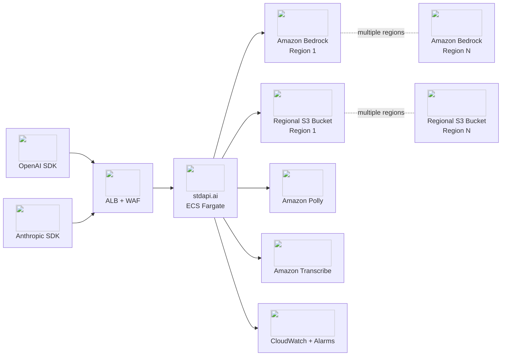
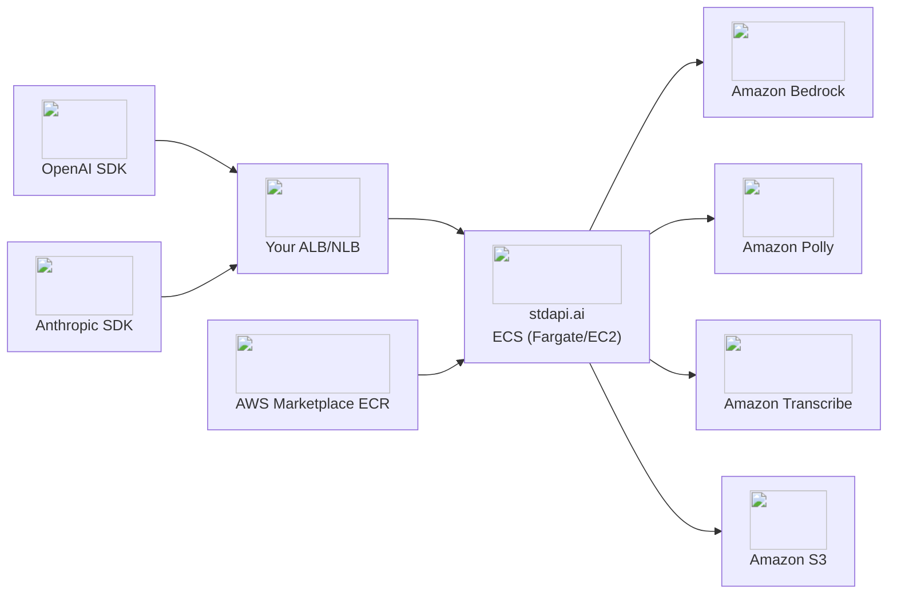

# :material-server-network: Advanced Deployment

This page covers deployment scenarios beyond the [Quick Start](operations_getting_started.md). Use these when you need to integrate with existing infrastructure, deploy multi-region, optimize costs, or deploy without Terraform.

!!! tip "Start with Quick Start"
    New to stdapi.ai? Begin with the [Getting Started](operations_getting_started.md) guide for the fastest path to a working deployment.

---

## :material-lan: Integration with Existing Infrastructure

Deploy stdapi.ai into your existing VPC and network infrastructure for maximum cost efficiency.

```hcl
module "stdapi_ai" {
  source  = "stdapi-ai/stdapi-ai/aws"
  version = "~> 1.0"

  # Use your existing network
  subnet_ids = [
    "subnet-xxx",  # Your existing private subnet 1
    "subnet-yyy",  # Your existing private subnet 2
  ]
  security_group_id = "sg-zzz"  # Your existing security group
}
```

**What you get:**

- ECS Fargate service in your existing VPC
- No additional NAT gateways or load balancers created
- Full monitoring and security features

**How to connect to your ALB:**

After deployment, add a target group pointing to port 8000, with a health check on `/health` — see the full target group example (with recommended health-check thresholds) in the collapsed section below.

??? example "Full integration example with ALB, IAM policies, and advanced configuration"

    **Complete integration configuration with all optional features:**

    ```hcl
    module "stdapi_ai_integrated" {
      source  = "stdapi-ai/stdapi-ai/aws"
      version = "~> 1.0"

      name_prefix = "my-stdapi-integrated"

      # Use existing network infrastructure
      subnet_ids = [
        "subnet-0123456789abcdef0",
        "subnet-0123456789abcdef1",
        "subnet-0123456789abcdef2"
      ]
      security_group_id = "sg-0123456789abcdef0"

      # Optional: Reuse existing S3 bucket
      aws_s3_bucket = "my-existing-s3-bucket"

      # Optional: Service Discovery for private communication
      service_discovery_dns_namespace_id = "ns-xxxxx"
      service_discovery_dns_name         = "stdapi"

      # Optional: Use existing Secrets Manager secret for API key
      api_key_secretsmanager_secret = "my-api-keys"
      api_key_secretsmanager_key    = "stdapi_key"

      # Optional: Attach custom IAM policies
      ecs_task_role_policy_arns = [
        aws_iam_policy.custom_s3_access.arn,
        aws_iam_policy.api_key_secrets_access.arn
      ]

      # Monitoring
      container_insight = "enhanced"
      alarms_enabled    = true
      sns_topic_arn     = "arn:aws:sns:us-east-1:123456789012:alerts"
    }

    # Example: Custom IAM policy for additional S3 bucket access
    data "aws_iam_policy_document" "custom_s3_access" {
      statement {
        sid    = "S3BucketAccess"
        effect = "Allow"
        actions = [
          "s3:GetObject",
          "s3:PutObject",
          "s3:DeleteObject"
        ]
        resources = ["arn:aws:s3:::my-existing-s3-bucket/*"]
      }

      statement {
        sid    = "KMSEncryptionForS3"
        effect = "Allow"
        actions = [
          "kms:Decrypt",
          "kms:GenerateDataKey"
        ]
        resources = ["arn:aws:kms:us-east-1:123456789012:key/your-s3-bucket-kms-key-id"]
        condition {
          test     = "StringEquals"
          variable = "kms:ViaService"
          values   = ["s3.us-east-1.amazonaws.com"]
        }
      }
    }

    resource "aws_iam_policy" "custom_s3_access" {
      name        = "stdapi-custom-s3-access"
      description = "Custom S3 access for stdapi.ai integration"
      policy      = data.aws_iam_policy_document.custom_s3_access.json
    }

    # Example: IAM policy for API key access from Secrets Manager
    # Required when using api_key_secretsmanager_secret parameter
    data "aws_iam_policy_document" "api_key_secrets_access" {
      statement {
        sid       = "SecretsManagerAccess"
        effect    = "Allow"
        actions   = ["secretsmanager:GetSecretValue"]
        resources = ["arn:aws:secretsmanager:us-east-1:123456789012:secret:my-api-keys-*"]
      }

      statement {
        sid       = "KMSDecryptionForSecretsManager"
        effect    = "Allow"
        actions   = ["kms:Decrypt"]
        resources = ["arn:aws:kms:us-east-1:123456789012:key/your-kms-key-id"]
        condition {
          test     = "StringEquals"
          variable = "kms:ViaService"
          values   = ["secretsmanager.us-east-1.amazonaws.com"]
        }
      }
    }

    resource "aws_iam_policy" "api_key_secrets_access" {
      name        = "stdapi-api-key-secrets-access"
      description = "Access to Secrets Manager for stdapi.ai API key"
      policy      = data.aws_iam_policy_document.api_key_secrets_access.json
    }

    # Alternative: IAM policy for API key access from SSM Parameter Store
    # Use this when using api_key_ssm_parameter instead of Secrets Manager
    data "aws_iam_policy_document" "api_key_ssm_access" {
      statement {
        sid       = "SSMParameterAccess"
        effect    = "Allow"
        actions   = ["ssm:GetParameter"]
        resources = ["arn:aws:ssm:us-east-1:123456789012:parameter/stdapi/api-key"]
      }

      statement {
        sid       = "KMSDecryptionForSSM"
        effect    = "Allow"
        actions   = ["kms:Decrypt"]
        resources = ["arn:aws:kms:us-east-1:123456789012:key/your-kms-key-id"]
        condition {
          test     = "StringEquals"
          variable = "kms:ViaService"
          values   = ["ssm.us-east-1.amazonaws.com"]
        }
      }
    }

    resource "aws_iam_policy" "api_key_ssm_access" {
      name        = "stdapi-api-key-ssm-access"
      description = "Access to SSM Parameter Store for stdapi.ai API key"
      policy      = data.aws_iam_policy_document.api_key_ssm_access.json
    }

    # Outputs for integration
    output "ecs_service_info" {
      description = "ECS service details for connecting your resources"
      value       = {
        cluster_name      = module.stdapi_ai_integrated.cluster_name
        service_name      = module.stdapi_ai_integrated.service_name
        security_group_id = module.stdapi_ai_integrated.security_group_id
        port              = module.stdapi_ai_integrated.port
        service_discovery = module.stdapi_ai_integrated.service_discovery_service_name
      }
    }

    output "integration_resources" {
      description = "Resources for connecting stdapi.ai to your infrastructure"
      value       = {
        s3_bucket_id = module.stdapi_ai_integrated.bucket_id
        kms_key_arn  = module.stdapi_ai_integrated.kms_key_arn
        log_groups   = module.stdapi_ai_integrated.cloudwatch_log_groups_names
      }
    }
    ```

    **Manual integration steps:**

    1. **Configure your ALB target group** to point to the ECS service:
       ```hcl
       resource "aws_lb_target_group" "stdapi" {
         name        = "my-stdapi-tg"
         port        = 8000
         protocol    = "HTTP"
         vpc_id      = "vpc-xxxxx"
         target_type = "ip"

         health_check {
           path                = "/health"
           healthy_threshold   = 2
           unhealthy_threshold = 3
         }
       }

       # Attach to your existing ALB listener
       resource "aws_lb_listener_rule" "stdapi" {
         listener_arn = aws_lb_listener.existing.arn
         priority     = 100

         action {
           type             = "forward"
           target_group_arn = aws_lb_target_group.stdapi.arn
         }

         condition {
           path_pattern {
             values = ["/v1/*"]
           }
         }
       }
       ```

    2. **Update security groups** to allow traffic:
       ```hcl
       # Allow your ALB to reach stdapi.ai
       resource "aws_security_group_rule" "alb_to_stdapi" {
         type                     = "ingress"
         from_port                = 8000
         to_port                  = 8000
         protocol                 = "tcp"
         security_group_id        = module.stdapi_ai_integrated.security_group_id
         source_security_group_id = var.your_alb_security_group_id
       }
       ```

    3. **Access via Service Discovery** (optional):
       ```bash
       # OpenAI-compatible endpoint
       curl -X POST "http://stdapi.your-namespace.local:8000/v1/chat/completions" \
         -H "Authorization: Bearer YOUR_API_KEY" \
         -H "Content-Type: application/json" \
         -d '{"model": "anthropic.claude-sonnet-5", "messages": [{"role": "user", "content": "Hello"}]}'

       # Anthropic-compatible endpoint
       curl -X POST "http://stdapi.your-namespace.local:8000/anthropic/v1/messages" \
         -H "x-api-key: YOUR_API_KEY" \
         -H "anthropic-version: 2023-06-01" \
         -H "Content-Type: application/json" \
         -d '{"model": "anthropic.claude-sonnet-5", "max_tokens": 1024, "messages": [{"role": "user", "content": "Hello"}]}'
       ```

       !!! warning "Service discovery in an IPv6-enabled subnet needs a dual-stack listener"
           The image listens on IPv4 only (`GRANIAN_HOST=0.0.0.0`), while ECS service discovery publishes an `AAAA` record for every task in an IPv6-enabled subnet. Clients that prefer that record — Node.js among them — then fail with `ECONNREFUSED` while Python clients fall back to the `A` record and hide the problem. Set `GRANIAN_HOST=::` in the task environment for a socket that answers both families; the module sets it for you when the VPC has IPv6 enabled. If `PROXY_TRUSTED_HOSTS` is also set, add the IPv4-mapped ranges alongside the plain ones — see [`PROXY_TRUSTED_HOSTS`](operations_configuration.md#proxy-trusted-hosts).

    **Use cases:**

    - Connect to existing internal ALB
    - Private API for internal microservices
    - Connect to service mesh (App Mesh, Consul)
    - Custom networking with VPN/Direct Connect
    - Multi-account setups with PrivateLink
    - Access additional AWS resources (S3 buckets, Secrets Manager, DynamoDB, etc.)

    **Custom IAM policies use cases:**

    - Grant access to additional S3 buckets beyond the default one
    - **Access API keys from Secrets Manager or SSM Parameter Store** (required when using `api_key_ssm_parameter` or `api_key_secretsmanager_secret`)
    - Read/write to DynamoDB tables for application state
    - Access to custom KMS keys for encryption
    - Cross-account resource access via IAM roles

    !!! warning "Important"
        When using `api_key_secretsmanager_secret` or `api_key_ssm_parameter`, you must create and attach an IAM policy granting the ECS task access to the secret/parameter. The module does not automatically create these permissions.

---

## :material-transit-connection-variant: Outbound Network Requirements

Beyond the inbound API traffic, the server reaches out to the AWS endpoints behind the features you enable. Allow these destinations from the task's security group — a blocked one usually makes a capability go missing rather than fail loudly.

| Destination | Needed for |
|---|---|
| `bedrock-runtime.<region>.amazonaws.com`, `bedrock.<region>.amazonaws.com` | Model invocation and the model catalog, in every configured region |
| `bedrock-mantle.<region>.api.aws` | The models served through Amazon Bedrock Mantle |
| The other AWS service endpoints you enable | Amazon Polly, Amazon Transcribe, Amazon Translate, Amazon Comprehend, Amazon S3, AWS STS, AWS Price List |
| `cognito-idp.<region>.amazonaws.com` | The user pool key set, when Amazon Cognito authentication is enabled |
| `s3vectors.<region>.amazonaws.com` | The [Vector Stores API](api_openai_vector_stores.md), when `AWS_S3_VECTORS_BUCKET` is set — in that bucket's Region only |
| `sqs.<region>.amazonaws.com` | [Durable vector store indexing](operations_resilience.md#vector-store-indexing), when `AWS_SQS_VECTOR_STORE_QUEUE_URL` is set — in the queue's Region only |

Bedrock Mantle is a separate endpoint from classic Bedrock, on a different domain (`api.aws`, not `amazonaws.com`). A network policy that allows the one and not the other is the usual reason a deployment lists every classic model and no Mantle model at all.

### Private deployments

Most of those endpoints have an interface VPC endpoint service, so a deployment with no internet egress reaches them privately. Bedrock Mantle's is:

```text
com.amazonaws.<region>.bedrock-mantle
```

Enable private DNS on it, so `bedrock-mantle.<region>.api.aws` resolves to the endpoint. When the Terraform module builds the VPC it provisions the interface endpoints itself — including `com.amazonaws.<region>.sqs` when the indexing queue lives in the deployment Region. Deploying into your own VPC (`subnet_ids`) makes every endpoint yours to create.

!!! warning "Amazon S3 Vectors is not among the endpoints the module creates"
    A deployment with no internet egress and no route to `s3vectors.<region>.amazonaws.com` serves every other route normally and fails every vector store call. Confirm the service offers an interface endpoint in your Region before planning a fully private deployment on it, or keep egress to that one endpoint open.

### Proxied deployments

Where egress is only possible through an HTTP proxy, set `HTTPS_PROXY`, `HTTP_PROXY` and `NO_PROXY` in the task environment. Every connection the server makes to an AWS endpoint honours them, so one set of variables covers the whole deployment.

Two connections deliberately do not, and neither needs an entry in `NO_PROXY`:

- **The container task metadata endpoint**, which the ECS agent serves on the task's own host and no proxy can reach.
- **Fetches of a URL a client supplied** — an image or audio URL in a request. Those are validated against the deployment's SSRF policy and connected to the exact address that was validated; routing them through a proxy would hand that decision to the proxy instead.

!!! warning "A `~/.netrc` file in the image becomes credentials on the wire"
    Honouring the proxy variables also enables `.netrc` lookups, which is how the standard tooling behaves. If a `.netrc` exists in the container's home directory, its entries are matched against outbound hosts and sent as HTTP authentication.

    The images stdapi.ai publishes contain no `.netrc`. Only a custom image, or a volume mounted over the home directory, can introduce one — do not add one, and check for it if you build your own image.

---

## :material-shield-check: Production Deployment (Fully Featured)

Enterprise-ready deployment with HTTPS endpoints, WAF protection, auto-scaling, regional S3 buckets, and comprehensive monitoring.

??? example "Full production example with multi-region Bedrock support"

    ```hcl
    # Main deployment
    module "stdapi_ai" {
      source  = "stdapi-ai/stdapi-ai/aws"
      version = "~> 1.0"

      # Custom public domain with TLS
      alb_domain_name   = "api.example.com"
      alb_enabled       = true
      alb_public        = true

      # Amazon Bedrock region configuration
      # Select regions to get available models in the order of preference
      aws_bedrock_regions = [
        "eu-west-3",
        "eu-west-1",
        "eu-central-1",
        "eu-north-1"
      ]

      # (Optional) In case of regional compliance requirements like GDPR,
      # disable "global" cross-region inference to ensure everything is done in valid regions.
      # Cross-region inference allows Amazon Bedrock to route requests to different regions for better availability.
      # In this example, cross-region inferences will be in EU regions only and comply with GDPR
      aws_bedrock_cross_region_inference_global = false

      # AI services region extra configuration
      # Left unset, a service treats every aws_bedrock_regions entry as a candidate and
      # fails over between them. Pin one when the primary region does not offer the
      # service, to skip a probe that fails on every call — at the cost of no failover.
      # In this example, Amazon Comprehend is not offered on eu-west-3, so we use eu-west-1
      aws_comprehend_region = "eu-west-1"

      # Authentication (Recommended)
      # Enable authentication by generating an API key that can be retrieved using the "api_key" module attribute.
      api_key_create = true

      # Web Application Firewall (Recommended on public APIs when ALB is enabled)
      alb_waf_enabled             = true
      alb_waf_rate_limit          = 2000  # Requests per 5 minutes per IP
      alb_waf_block_anonymous_ips = true

      # Monitoring & Alerts (Recommended to get alarms notifications)
      alarms_enabled = true
      sns_topic_arn  = "arn:aws:sns:eu-west-3:123456789012:alerts"
    }

    # Get the API key (Generated with api_key_create = true)

    output "api_key" {
      value     = module.stdapi_ai.api_key
      sensitive = true
    }

    # Main/default region provider
    provider "aws" {
      region = "eu-west-3"
    }
    ```

??? info "Migrating from manual bucket configuration"
    If you have an existing deployment using the deprecated `module "bedrock_bucket_*"` pattern,
    see the [migration guide](https://github.com/stdapi-ai/terraform-aws-stdapi-ai-s3-regional-bucket#migration)
    for step-by-step `terraform state mv` instructions.

**What you get:**

- High-availability multi-AZ deployment (uses all available AZs in region)
- HTTPS with automatic SSL certificate
- WAF protection with AWS managed rules
- 5 CloudWatch alarms (memory, health, CPU anomaly, capacity, error logs)
- Auto-scaling based on load (min defaults to the number of AZs)
- S3 storage with lifecycle policies
- Container Insights enabled by default (set `container_insight = "enhanced"` for additional OS-level and application performance metrics)
- Regional S3 buckets for Amazon Bedrock multimodal operations (created automatically)



??? example "Simplified production example (single region, no multi-region complexity)"

    ```hcl
    module "stdapi_ai" {
      source  = "stdapi-ai/stdapi-ai/aws"
      version = "~> 1.0"

      # HTTPS with your domain
      alb_domain_name = "api.example.com"
      alb_enabled     = true
      alb_public      = true

      # Security
      api_key_create              = true
      alb_waf_enabled             = true
      alb_waf_rate_limit          = 2000
      alb_waf_block_anonymous_ips = true

      # Monitoring
      alarms_enabled = true
      sns_topic_arn  = "arn:aws:sns:us-east-1:123456789012:alerts"
    }

    output "api_key" {
      value     = module.stdapi_ai.api_key
      sensitive = true
    }

    output "api_endpoint" {
      value = module.stdapi_ai.application_url
    }
    ```

**Deployment time:** ~5-10 minutes

!!! tip "Ready-to-use Terraform examples on GitHub"
    - :material-map-marker: **Single region** — [getting_started_production](https://github.com/stdapi-ai/samples/tree/main/getting_started_production)
    - :material-earth: **Multi-region GDPR (EU)** — [getting_started_production_gdpr](https://github.com/stdapi-ai/samples/tree/main/getting_started_production_gdpr)
    - :fontawesome-solid-flag-usa: **Multi-region US** — [getting_started_production_us](https://github.com/stdapi-ai/samples/tree/main/getting_started_production_us)

---

## :material-currency-usd: Cost-Optimized Deployment

!!! info "How costs scale"
    By default, the Terraform module deploys **one ECS Fargate container per Availability Zone (AZ)**. Both AWS infrastructure costs (ECS/Fargate) and the stdapi.ai product fee (billed per container-hour, after the 14-day trial) are **proportional to the number of running containers** — so the number of AZs directly drives your bill.

    To reduce costs: limit the number of subnets/AZs passed to the module, use Fargate Spot pricing, or schedule the service to stop outside business hours.

For development, side projects, and non-critical workloads.

??? example "Low cost deployment configuration"

    ```hcl
    module "stdapi_ai_cost_optimized" {
      source  = "stdapi-ai/stdapi-ai/aws"
      version = "~> 1.0"

      # Aggressive Auto-scaling with Fargate spot
      autoscaling_min_capacity       = 1
      autoscaling_max_capacity       = 3
      autoscaling_cpu_target_percent = 85
      autoscaling_scale_in_cooldown  = 60   # Scale down quickly
      autoscaling_scale_out_cooldown = 120
      autoscaling_spot_percent       = 100  # Use 100% Spot pricing (~70% discount)

      # Schedule: Stop at 7 PM, start at 8 AM on weekdays (UTC)
      autoscaling_schedule_stop  = "cron(0 19 ? * MON-FRI *)"
      autoscaling_schedule_start = "cron(0 8 ? * MON-FRI *)"

      # Use Existing Subnets and security group (no VPC creation)
      subnet_ids = [
        "subnet-0123456789abcdef0",  # Your existing private subnet 1
        "subnet-0123456789abcdef1",  # Your existing private subnet 2
        "subnet-0123456789abcdef2"   # Your existing private subnet 3
      ]
      security_group_id = "sg-0123456789abcdef0"

      # Minimal Monitoring & Logging
      container_insight                 = "disabled"  # Disable Container Insights
      vpc_flow_log_enabled              = false       # Disable VPC Flow Logs
      cloudwatch_logs_retention_in_days = 7           # Reduce log retention to 7 days
    }
    ```

**What you get:**

- Fargate Spot for significant cost reduction
- Minimal resources (0.25 vCPU, 512 MiB and ARM64 are the Terraform module defaults — not set explicitly in this example)
- Reuse existing VPC infrastructure
- Automated scheduling (runs 8 AM-7 PM weekdays only in UTC)
- Minimal logging (7-day retention, no Container Insights, no VPC Flow Logs)

**Trade-offs:** Spot interruptions possible, minimal observability, scheduled availability only

---

## :material-web-sync: WebSocket-Capable Deployment (Realtime API)

The [Realtime API](api_openai_realtime.md) holds a session open on a single WebSocket for up to 8 minutes. That changes what a normal HTTP-shaped deployment needs to get right — the points below are what the standard setup above does not already cover.

### The load balancer must allow the upgrade end to end

An Application Load Balancer forwards a WebSocket upgrade (`Connection: Upgrade`, `Upgrade: websocket`) to its target by default — nothing extra to enable there. Anything placed **in front of** the ALB (a CDN, a reverse proxy, an API Gateway) must pass those headers through unmodified, or the upgrade never reaches the gateway and every connection attempt fails before a single event is exchanged.

### The idle timeout bounds a session

The ALB's idle timeout closes a connection with no traffic for that long — and a Realtime session, once opened, can sit with no traffic between spoken turns. Keep `alb_idle_timeout` **at or above** the Realtime session limit (8 minutes / 480 seconds); the Terraform module's default of 3600 seconds already clears it. Lowering it below the session limit — or fronting the deployment with your own load balancer or reverse proxy at a shorter idle timeout — cuts sessions off mid-conversation with no `error` event, indistinguishable from a network failure. See [ALB Resilience](operations_resilience.md#alb-resilience) for the same setting's effect on ordinary streaming responses.

### Autoscale on CPU or memory, not request count

`ALBRequestCountPerTarget` counts a WebSocket connection as **one request for its entire duration** — an hour of active voice traffic on a handful of long-lived connections looks identical, to that metric, to an idle target. A fleet serving real Realtime traffic can read as underloaded and scale in while it is actually busy. Scale ECS on CPU or memory utilization instead wherever the service handles Realtime sessions; those track the work a session actually does.

### A deploy truncates open sessions

Replacing a task — a new deployment, a scale-in, a Spot interruption — ends whatever Realtime sessions that task is holding: there is no live handoff to another task. Two settings decide how abrupt that is:

- **Deregistration delay** on the target group gives a task being drained time to finish in-flight work before it is sent a `SIGTERM`; a value shorter than a typical session length simply means sessions running past it are cut regardless.
- **Stop timeout** on the ECS task caps how long the container gets to exit gracefully after `SIGTERM` before ECS sends `SIGKILL`.

Neither setting makes a session survive its task's replacement — the gateway holds session state in the process, not externally — so a deploy during active Realtime traffic will end some conversations. Schedule deploys for low-usage windows where that matters, and have clients reconnect on an unexpected close the same way they already do for the [8-minute session limit](api_openai_realtime.md#session-lifecycle-and-limits).

### AWS WAF's `NoUserAgent_HEADER` rule reads like an auth failure

The AWS-managed Common Rule Set (bundled by `alb_waf_enabled = true`) includes `NoUserAgent_HEADER`, which blocks any request with no `User-Agent` header. A raw WebSocket client — a bespoke SIP/telephony bridge, a minimal test script — that sends no `User-Agent` is blocked by the WAF with a `403` **before the request reaches the gateway at all**. Because the gateway itself also answers a rejected credential with `403`, the two are easy to conflate; check the WAF sampled requests (or disable `NoUserAgent_HEADER` for the Realtime path) before assuming the credential is wrong. Every mainstream WebSocket client library sets a `User-Agent` by default, so this only surfaces with a hand-rolled one.

### WebRTC and SIP need their own ingress

The Realtime API's default transport is [the WebSocket](api_openai_realtime.md#transports) — an ordinary HTTPS connection, carried by the same listener as every other route. WebRTC and SIP are not: each negotiates a separate UDP media path, and an Application Load Balancer's listeners accept [only HTTP and HTTPS](https://docs.aws.amazon.com/elasticloadbalancing/latest/application/load-balancer-listeners.html). No amount of configuration makes the module's ALB carry RTP or SIP; a deployment that stays on the WebSocket needs no UDP at all.

**The module's WebRTC media mode** exists for deployments that enable the [gateway-terminated WebRTC transport](api_openai_realtime.md#webrtc-calls). Setting `realtime_webrtc_media_enabled = true` (off by default) changes the deployment's shape, deliberately:

- The task gets a **public IP** and its security group opens a **UDP port range to the internet**, inbound and outbound — WebRTC media is UDP on ephemeral ports in both directions, and it must reach the exact task that answered the SDP offer, which no load balancer in front can guarantee. Egress is opened to the same source CIDRs as the ingress, plus the STUN and TURN ports the gateway is configured with. The range and the allowed CIDRs are variables; narrowing them to your callers' networks is the only way to shrink this exposure.
- **The subnets carry that UDP path too**, and the module provisions it. A network ACL is stateless and evaluated before any security group, so the mode writes the media range and the STUN and TURN flows onto the application subnets' NACLs of the VPC it creates — nothing to supply, nothing refused at plan time. The exception is a VPC you bring through `subnet_ids`: the module cannot write rules in one it did not create, so widen those subnets' NACLs yourself for the UDP media range inbound and the ephemeral range `1024-65535` in both directions, or a call negotiates a media path the subnet then silently drops.
- The gateway is configured with a **STUN server** to discover the public address that 1:1 NAT hides from the task, and, optionally, with the **TURN relay** you run for callers on UDP-blocking networks — AWS has no managed TURN.
- **The service is pinned to one instance.** Calls live in the answering instance's memory, `hangup` and the sideband WebSocket must land on it, and the media path cannot drain: media mode is incompatible with autoscaling above one task, and every deployment, scale-in or Spot interruption drops the calls in flight. The signaling requests still ride the ALB unchanged.

That shape — public task IP, open UDP range in both directions, single instance, subnet NACLs widened for it — is exactly what a Security Hub baseline flags, which is why it is opt-in and why the framework pattern below stays the recommendation for anything beyond a single-tenant assistant.

**Put the media terminator beside the gateway, not behind its load balancer.** A voice-agent framework such as LiveKit Agents or Pipecat, or a telephony bridge, faces the caller on its own address and reaches the gateway over the ordinary HTTPS ingress — so the gateway's networking, WAF and autoscaling stay exactly as documented above. Run the terminator in the same VPC, behind an internal load balancer, and that leg stays on the private path; the [WebSocket points above](#the-idle-timeout-bounds-a-session) then apply to the terminator as a client, not to the caller.

**If you publish a media terminator of your own**, it needs an ingress the module does not build, and two AWS services are the usual answers:

- A [Network Load Balancer with a `UDP` or `TCP_UDP` listener](https://docs.aws.amazon.com/elasticloadbalancing/latest/network/load-balancer-listeners.html), or a task or instance with a public address and the media port range opened in its security group. Both **carry packets only** — neither decrypts DTLS, decodes RTP or performs ICE, so the media stack remains the terminator's own work. Note that a UDP target group is health-checked over [TCP or HTTP](https://docs.aws.amazon.com/elasticloadbalancing/latest/network/target-group-health-checks.html), so a broken media path can pass its probe.
- [Amazon Chime SDK Voice Connector](https://docs.aws.amazon.com/chime-sdk/latest/ag/voice-connectors.html) for a phone leg. It terminates SIP trunking as a managed service, which is worth more here than on the WebRTC leg: the caller is a telephone, so there is no client-side API compatibility to preserve.

The detail that catches deployments out is **ICE addressing**: behind a load balancer the terminator's task sees only its private VPC address, and nothing tells it the address:port a client actually reached it on, so the candidate it advertises must be configured out of band. A public-addressed task is the cleanest shape for that and the least stable, since the address is reassigned every time the task is replaced.

---

## :material-hand-pointing-right: Manual ECS Deployment

Deploy the stdapi.ai container image directly to AWS ECS without Terraform.

### Prerequisites

1. **Subscribe to stdapi.ai** on [AWS Marketplace](https://aws.amazon.com/marketplace/pp/prodview-su2dajk5zawpo) (14-day free trial included)
2. Set up an ECS cluster (Fargate or EC2)
3. Configure networking (VPC, subnets, security groups)
4. Set up IAM roles with appropriate permissions

### Container Image

After subscribing, the container image is available from AWS Marketplace ECR:

```text
709825985650.dkr.ecr.us-east-1.amazonaws.com/j-goutin/stdapi.ai:<version>
```



### ECS Task Definition Example

The example below uses ARM64 architecture, which requires the `-arm64` image tag. Replace `ARM64` with `X86_64` and `-arm64` with `-amd64` for AMD64. Use a version tag without an architecture suffix (e.g. `:1.15.0`) to let ECS select the architecture automatically via the multi-arch manifest.

```json
{
  "family": "stdapi-ai-task-definition",
  "networkMode": "awsvpc",
  "requiresCompatibilities": ["FARGATE"],
  "cpu": "256",
  "memory": "512",
  "executionRoleArn": "arn:aws:iam::{account-id}:role/{execution-role-name}",
  "taskRoleArn": "arn:aws:iam::{account-id}:role/{task-role-name}",
  "runtimePlatform": {
    "cpuArchitecture": "ARM64",
    "operatingSystemFamily": "LINUX"
  },
  "containerDefinitions": [
    {
      "name": "main",
      "image": "709825985650.dkr.ecr.us-east-1.amazonaws.com/j-goutin/stdapi.ai:1.15.0-arm64",
      "essential": true,
      "readonlyRootFilesystem": true,
      "user": "65532:65532",
      "portMappings": [
        {
          "containerPort": 8000,
          "protocol": "tcp",
          "name": "http"
        }
      ],
      "environment": [
        {
          "name": "AWS_S3_BUCKET",
          "value": "{your-s3-bucket-name}"
        },
        {
          "name": "AWS_BEDROCK_REGIONS",
          "value": "us-east-1,us-west-2"
        }
      ],
      "mountPoints": [
        {
          "sourceVolume": "temp",
          "containerPath": "/tmp"
        }
      ],
      "healthCheck": {
        "command": ["CMD", "python3", "-S", "-m", "stdapi.healthcheck"],
        "interval": 30,
        "timeout": 5,
        "retries": 3,
        "startPeriod": 30
      },
      "linuxParameters": {
        "capabilities": {
          "drop": ["ALL"]
        }
      },
      "logConfiguration": {
        "logDriver": "awslogs",
        "options": {
          "awslogs-group": "/ecs/stdapi-ai",
          "awslogs-region": "{region}",
          "awslogs-stream-prefix": "stdapi-ai"
        }
      }
    }
  ],
  "volumes": [
    {
      "name": "temp"
    }
  ]
}
```

!!! tip "Declare the image's own health probe"
    ECS ignores the image's `HEALTHCHECK`, so the task definition must re-declare it — the `healthCheck` above is that same command. It requests `/health` on the container's own port with a `Host` header derived from [`TRUSTED_HOSTS`](operations_configuration.md#trusted-hosts), so it keeps working when Host validation is enabled. A hand-written `curl` or `urllib` probe sends an untrusted `Host` and is rejected with `400`.

    `"user": "65532:65532"` is the image's own non-root user, declared explicitly because Security Hub control ECS.20 reads the task definition rather than the image.

**Note:** This is a minimal example. For production, configure:

- Environment variables (see [Configuration](operations_configuration.md))
- IAM task roles for AWS service access
- Load balancer integration
- Auto-scaling policies
- CloudWatch monitoring

**Recommendation:** Use the [Terraform module](operations_getting_started.md#quick-start) for a complete, production-ready deployment with all best practices included.

---

## :material-export: Terraform Module Outputs

After deployment, access critical information:

```hcl
output "api_endpoint" {
  value = module.stdapi_ai.alb_dns_name
}
```

**Networking & Load Balancing:**

- `alb_dns_name` — ALB endpoint (if enabled)
- `alb_arn` — ALB ARN for AWS integrations
- `alb_security_group_id` — ALB security group
- `application_url` — Full URL (https://domain or http://alb)

**ECS Service:**

- `cluster_name` — Cluster name for AWS CLI/SDK
- `service_name` — Service name for management
- `security_group_id` — Security group for ingress rules
- `service_discovery_service_name` — Private DNS name (if enabled)
- `port` — Container port exposed by the application

**Storage & Encryption:**

- `bucket_id` — S3 bucket for application data
- `bucket_arn` — S3 bucket ARN
- `kms_key_id` — KMS key for encryption
- `kms_key_arn` — KMS ARN for IAM policies

**Security:**

- `alb_waf_web_acl_id` — WAF ACL ID (if enabled)
- `alb_waf_web_acl_arn` — WAF ACL ARN (if enabled)

For the complete list of outputs, see [stdapi-ai/terraform-aws-stdapi-ai/outputs.tf](https://github.com/stdapi-ai/terraform-aws-stdapi-ai/blob/main/outputs.tf).

---

## :material-wrench: Troubleshooting

### VPC Endpoint Error: "couldn't find resource" for Amazon Comprehend

**Error message:**

```text
Error: reading EC2 VPC Endpoint Services: couldn't find resource

  with module.stdapi_ai.module.vpc.data.aws_vpc_endpoint_service.netdev_vpce_interface["comprehend"],
  on module-stdapi-ai/module-vpc/network_devices.tf line 175, in data "aws_vpc_endpoint_service" "netdev_vpce_interface":
 175: data "aws_vpc_endpoint_service" "netdev_vpce_interface" {
```

**Cause:** Amazon Comprehend is not available as a VPC endpoint service in your current region.

**When this happens:** only on a fully private deployment — one where the module builds the VPC (no `subnet_ids`), `vpc_endpoints_allowed` is left at its default, `aws_bedrock_marketplace_auto_subscribe = false`, and every AWS service resolves to the deployment region. Any other configuration needs internet egress, so no interface endpoint is created and this error cannot occur.

**Solution:** Set the `aws_comprehend_region` variable to a region where Comprehend is available:

```hcl
module "stdapi_ai" {
  source  = "stdapi-ai/stdapi-ai/aws"
  version = "~> 1.0"

  aws_comprehend_region = "us-east-1"
}
```

Common regions with Comprehend support: `us-east-1`, `us-west-2`, `eu-west-1`, `eu-central-1`

!!! warning "This fix ends the fully private deployment"
    Pointing any AWS service at another region makes the deployment cross-region, which requires internet egress. **Every** interface VPC endpoint is then dropped and a NAT gateway is provisioned instead — a change in both cost and network exposure, not just for Comprehend.

    To keep the private posture, deploy into a region that offers a Comprehend VPC endpoint rather than pinning the service elsewhere.

---

## :material-arrow-right: Next Steps

<div class="grid cards" markdown>

- :material-rocket-launch: [**Getting Started**](operations_getting_started.md) — Standard deployment with Terraform
- :material-directions-fork: [**Resilience & Failover**](operations_resilience.md) — Multi-region routing and infrastructure resilience
- :material-cog: [**Configuration Reference**](operations_configuration.md) — Complete list of environment variables
- :material-scale-balance: [**Compliance**](operations_compliance.md) — Security and compliance requirements

</div>
