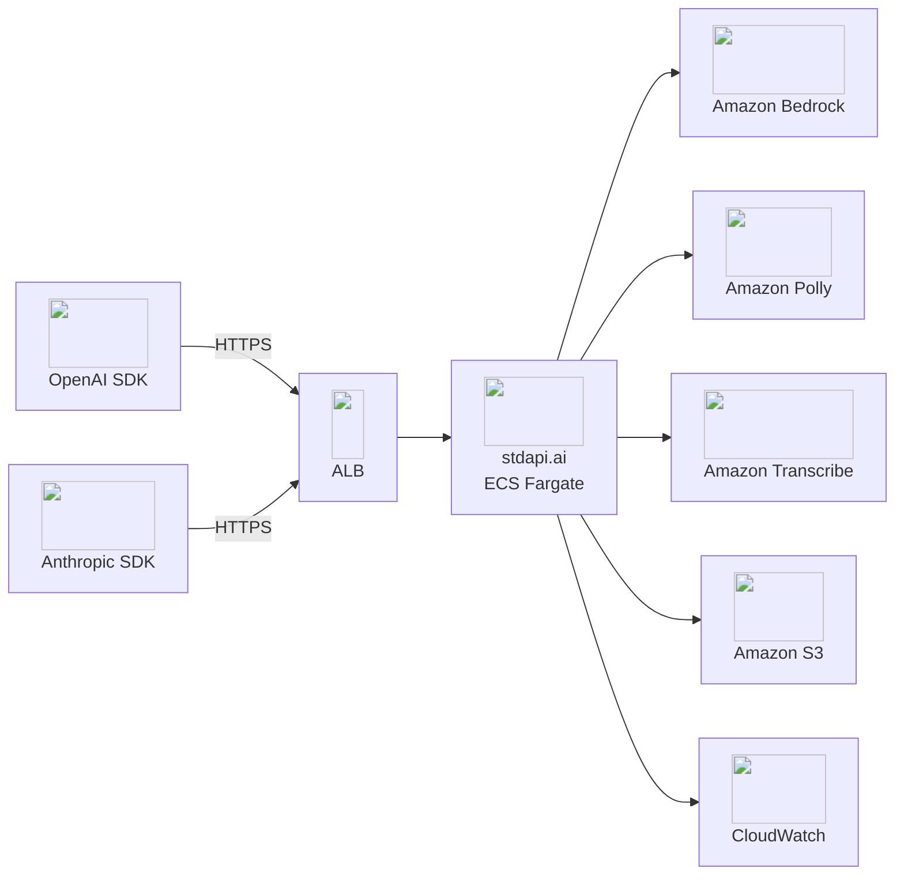

# :material-rocket-launch: Deploy stdapi.ai on AWS

Get a production-grade AI gateway running on AWS with two Terraform commands, speaking the OpenAI, Anthropic, Cohere and Ollama APIs.

## :material-rocket-launch: Quick Start

### Deploy

```bash
git clone https://github.com/stdapi-ai/samples.git
cd samples/getting_started_production/terraform
terraform init
terraform apply -var alb_domain_name=api.example.com
```

If the hosted zone is not the immediate parent of that name — say `api.eu.example.com` served from the `example.com` zone — name the zone as well with `-var alb_route53_zone_name=example.com`. The first apply waits for ACM to validate the certificate through DNS, which usually takes a few minutes.

??? info "No git? Download the ZIP"
    ```bash
    curl -L https://github.com/stdapi-ai/samples/archive/refs/heads/main.zip -o samples.zip
    unzip samples.zip
    cd samples-main/getting_started_production/terraform
    terraform init
    terraform apply -var alb_domain_name=api.example.com
    ```

!!! tip "Confirm your AWS identity and region before deploying"
    The AWS provider uses the region and profile from your environment — not a Terraform variable. Check both before running `terraform apply`:
    ```bash
    aws sts get-caller-identity
    aws configure get region
    ```

That's it. Two Terraform commands, and you have:

- Production-grade ECS Fargate deployment with HTTPS
- Regional S3 buckets
- Auto-scaling and API key authentication
- Interactive API documentation at `/docs`
- IP-restricted access (your IP only)
- Optional WAF and optional CloudWatch monitoring, one variable away



### Prerequisites

??? info "Before you start"
    1. **Subscribe on AWS Marketplace** — this is the action that starts your 14-day free trial:

        [Subscribe on AWS Marketplace — starts your 14-day free trial](https://aws.amazon.com/marketplace/pp/prodview-su2dajk5zawpo){ .md-button .md-button--primary }

    2. Install [Terraform](https://www.terraform.io/downloads) or [OpenTofu](https://opentofu.org/docs/intro/install/) >= 1.9.
    3. Configure [AWS credentials](https://docs.aws.amazon.com/cli/latest/userguide/cli-configure-files.html) (`aws configure` or `aws sso login`).
    4. A domain in a **public Route 53 hosted zone in this account** — the deployment serves the API from a name under it, such as `api.example.com`. It is required: an ALB reached through its generated `*.elb.amazonaws.com` name can never hold a trusted certificate, since ACM does not issue for a name you do not control, so a deployment without a domain would publish the API and every API key in cleartext over HTTP.

!!! warning "Requires AWS administrator permissions"
    The Terraform module provisions IAM roles and policies, KMS keys, ECS/Fargate, ALB, and networking. A restricted developer profile will fail during `terraform apply`.

    **Strongly recommended:** deploy into a **sandbox / non-production AWS account first** to evaluate the stack, then replicate into your target account with scoped-down principals once you've validated it.

!!! tip trial "14-Day Free Trial"
    The AWS Marketplace subscription includes a **14-day free trial of the stdapi.ai license**. AWS charges for the infrastructure it deploys (ALB, Fargate, KMS, NAT) and for Bedrock usage apply from the first minute — see [Deployment Cost](#deployment-cost).

### Get Your Credentials

```bash
terraform output -raw api_key
terraform output api_endpoint
terraform output docs_url
```

!!! tip "Ready-to-use Terraform examples on GitHub"
    - :material-map-marker: **Single region** — [getting_started_production](https://github.com/stdapi-ai/samples/tree/main/getting_started_production), the sample deployed above
    - :fontawesome-solid-earth-europe: **Multi-region GDPR (EU)** — [getting_started_production_gdpr](https://github.com/stdapi-ai/samples/tree/main/getting_started_production_gdpr), the same stack with every region and bucket kept in the EU
    - :fontawesome-solid-earth-americas: **Multi-region US** — [getting_started_production_us](https://github.com/stdapi-ai/samples/tree/main/getting_started_production_us), the same stack with every region and bucket kept in the US

    See [Data Sovereignty & Compliance](operations_compliance.md#region-specific-configuration) for what each variant pins.

!!! tip "Optional: expose the API as MCP tools"
    The [MCP server](features.md#mcp-model-context-protocol) is off by default. Set `enable_mcp_streamable_http = true` on the Terraform module and every endpoint becomes a named MCP tool at `<api_endpoint>/mcp`, callable directly by Claude Code, LangGraph, or any MCP client.

    Every exposed tool adds its schema to each MCP client's context window, so expose only the tools your agents actually use — for example `mcp_include_tools = "openai_chat_completion,openai_embedding,search_models"`. See the [MCP configuration reference](operations_configuration_server.md#summary-mcp).

---

## :material-check-circle: Make Your First API Call

**Want to explore the API without writing code?** Use the `docs_url` from `terraform output docs_url` to open the interactive Swagger documentation in your browser — you can browse all available endpoints and make live API calls directly from the page, no code required.

!!! info "If the docs page returns 503"
    This is normal on a fresh deployment: the ECS service takes 2–3 minutes to pass health checks. If it persists, check that the AWS Marketplace subscription was accepted — without it the ECS tasks cannot pull the licensed image and never become healthy. See [Troubleshooting](operations_troubleshooting.md).

    TLS needs no attention here: the sample serves the API from your own domain under an ACM certificate, so the browser trusts it. Only a configuration with neither `alb_domain_name` nor `alb_certificate_arn` behaves differently — the module then creates no HTTPS listener at all and the endpoint is plain `http://`, which must never carry an API key.

stdapi.ai is compatible with both OpenAI and Anthropic SDKs. If you've used either before, you already know how to use it — the base URL changes, along with the API key, and the model name only where it differs, since Anthropic's and OpenAI's own names for the models Bedrock serves resolve here as they stand. Here are the raw HTTP calls with `curl` so you can verify the endpoint from any shell:

=== "OpenAI-compatible"

    ```bash
    API_ENDPOINT=$(terraform output -raw api_endpoint)
    API_KEY=$(terraform output -raw api_key)

    curl "$API_ENDPOINT/v1/chat/completions" \
      -H "Authorization: Bearer $API_KEY" \
      -H "Content-Type: application/json" \
      -d '{
        "model": "amazon.nova-micro-v1:0",
        "messages": [{"role": "user", "content": "Hello! Tell me a joke."}]
      }'
    ```

=== "Anthropic-compatible"

    ```bash
    API_ENDPOINT=$(terraform output -raw api_endpoint)
    API_KEY=$(terraform output -raw api_key)

    curl "$API_ENDPOINT/anthropic/v1/messages" \
      -H "x-api-key: $API_KEY" \
      -H "anthropic-version: 2023-06-01" \
      -H "Content-Type: application/json" \
      -d '{
        "model": "amazon.nova-micro-v1:0",
        "max_tokens": 1000,
        "messages": [{"role": "user", "content": "Hello! Tell me a joke."}]
      }'
    ```

**Using the official SDKs?** Point the `base_url` (Python) / `baseURL` (Node.js) option at `$API_ENDPOINT/v1` (OpenAI SDK) or `$API_ENDPOINT/anthropic` (Anthropic SDK), and set the `model` field to a model from the catalog below. The rest of your existing code is unchanged. The [API Overview](api_overview.md) has SDK snippets for Python, Node.js, and more.

!!! tip "Discover the full model catalog"
    Once your first call succeeds, switch the `model` field to any other Bedrock model — `anthropic.claude-fable-5`, `anthropic.claude-sonnet-5`, `qwen.qwen3-coder-next`, and more.

    - **Browse before you switch:** the [Models](models.md) page lists everything with prices and scores
    - **Browse active models (recommended):** `GET /search_models` — returns every discovered non-legacy model with full details (provider, modalities, supported routes, regions, streaming/legacy status). Add `legacy=true` to look up a deprecated model instead. Or open the interactive Swagger docs.
    - **Find a model by capability:** the same endpoint filters by modality, route, region, streaming, Batch API support, or legacy status — e.g. `GET /search_models?input_modalities=IMAGE&route=/v1/chat/completions` returns only vision-capable chat models. This is also the recommended way for AI agents to discover the right model ID before calling another endpoint. See the [Search Models API](api_search_models.md) reference.
    - **OpenAI SDK compatibility:** `GET /v1/models` is also available with the standard OpenAI listing format (lighter payload, no capability metadata) for tools that require the exact OpenAI schema.

**Using your own Terraform config instead of the sample?** The sample above enables authentication for you (`api_key_create = true`, retrieved above). Writing your own module config from scratch? stdapi.ai runs without authentication unless you set `api_key_create = true` — see [Authentication & Security](operations_authentication_security.md) for all options.

**Verify the deployment is healthy:**

```bash
curl $API_ENDPOINT/health
# → {"status": "ok"}
```

The `/health` endpoint requires no authentication and is used by the ALB health check.

---

## :material-wrench: Troubleshooting

The `503` hiccup on first deployment is already covered above — see [Make Your First API Call](#make-your-first-api-call).

:material-arrow-right: **Full troubleshooting guide:** [Troubleshooting](operations_troubleshooting.md) — 401 auth errors, 404 model not found, ThrottlingException, S3 errors, VPC connectivity, Terraform IAM failures, and more.

!!! info "Need help?"
    For questions, issue reports, or assistance, see the [Contact](contact.md) page.

!!! info "Prefer a hands-off setup?"
    A [managed deployment service](https://aws.amazon.com/marketplace/pp/prodview-xknxzjgl7zi5s) is available if you'd rather not manage Terraform yourself. Choose between guided assistance (step-by-step support while you retain full control) or fully managed setup (handled on your behalf, inside your AWS account). Response time is 1 business day during the engagement.

---

## :material-currency-usd: Deployment Cost

AWS infrastructure cost is driven by configuration, not a fixed default: task count (one per Availability Zone unless overridden), Fargate Spot vs. on-demand, scheduled service hours, and whether an ALB is provisioned at all. A minimal deployment — one scheduled Fargate Spot task, no ALB, reached via Service Discovery — and a full multi-AZ production stack — ALB + WAF, one task per AZ, running 24/7 — sit at opposite ends of a wide range.

stdapi.ai's own license is billed separately at **$0.10/container-hour** ($0.09 via [private offer](contact.md#private-offer)); Bedrock and other AI service usage is billed by AWS at cost, with no stdapi.ai markup.

See [Cost-Optimized Deployment](operations_deploy_advanced.md#cost-optimized-deployment) for the Spot/scheduling configuration, and [Cost Management → Gateway Cost](operations_cost_management.md#gateway-cost) for the full tier-by-tier breakdown.

---

## :material-delete-outline: Cleaning Up

When you're done testing, tear down the stack to stop incurring AWS and license charges:

```bash
terraform destroy
```

Running from the ZIP download instead of `git clone`? Run the same command from the `samples-main/getting_started_production/terraform` directory.

---

## :material-arrow-right: Next Steps

<div class="grid cards" markdown>

- :material-book-open-variant: [**API Overview**](api_overview.md) — Endpoints, parameters, and usage examples
- :material-cog: [**Configuration**](operations_configuration.md) — All environment variables and options
- :material-server-network: [**Advanced Deployment**](operations_deploy_advanced.md) — VPC integration, multi-region, cost optimization, manual ECS
- :material-cash-multiple: [**Cost Management**](operations_cost_management.md) — Infrastructure, license, and AI usage cost breakdown
- :material-directions-fork: [**Resilience & Failover**](operations_resilience.md) — Multi-region routing, and the quota each enabled region adds
- :material-shield-lock: [**Data Sovereignty & Compliance**](operations_compliance.md) — GDPR-compliant region configuration
- :material-puzzle: [**Use Cases**](use_cases.md) — Open WebUI, n8n, coding assistants, and more
- :material-wrench: [**Troubleshooting**](operations_troubleshooting.md) — Common first-deployment errors and fixes
- :material-scale-balance: [**Licensing**](operations_licensing.md) — AGPL vs commercial options

</div>
