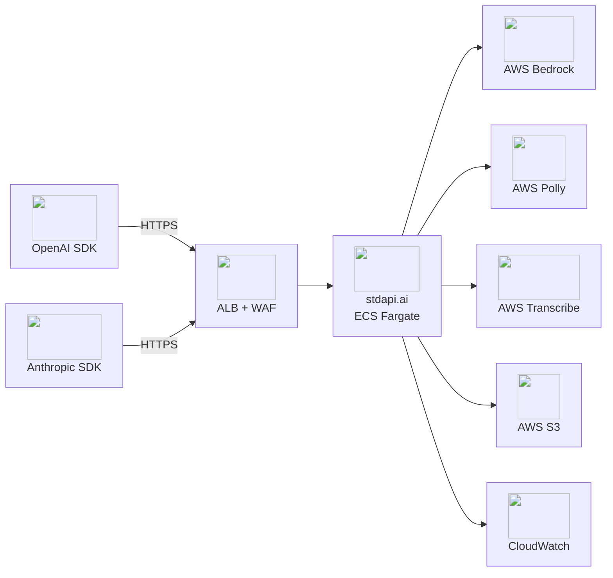

# Deploy stdapi.ai on AWS

Get a production-grade OpenAI-compatible AI gateway running on AWS in 5 minutes. Terraform handles everything — ECS Fargate, HTTPS, WAF, auto-scaling, and monitoring.

!!! tip "14-Day Free Trial"
    The AWS Marketplace subscription includes a **14-day free trial**. Test the full production stack in your environment risk-free.

!!! info "Prefer a hands-off setup?"
    A [managed deployment service](https://aws.amazon.com/marketplace/pp/prodview-xknxzjgl7zi5s) is available to deploy stdapi.ai into your AWS account.

---

## :material-rocket-launch: Quick Start

### Prerequisites

1. **Subscribe to stdapi.ai** on [AWS Marketplace](https://aws.amazon.com/marketplace/pp/prodview-su2dajk5zawpo) (14-day free trial included)
2. Install [Terraform](https://www.terraform.io/downloads) or [OpenTofu](https://opentofu.org/docs/intro/install/) >= 1.5
3. Configure [AWS credentials](https://docs.aws.amazon.com/cli/latest/userguide/cli-configure-files.html)

### Deploy

```bash
git clone https://github.com/stdapi-ai/samples.git
cd samples/getting_started_production/terraform
terraform init
terraform apply
```

That's it. In ~5 minutes you have:

- Production-grade ECS Fargate deployment with HTTPS
- WAF protection with rate limiting
- CloudWatch alarms and monitoring
- Auto-scaling and API key authentication
- Interactive API documentation at `/docs`
- IP-restricted access (your IP only)



### Get Your Credentials

```bash
terraform output -raw api_key
terraform output api_endpoint
terraform output docs_url
```

!!! tip "Ready-to-use Terraform example on GitHub"
    :material-map-marker: **Single region** — [getting_started_production](https://github.com/stdapi-ai/samples/tree/main/getting_started_production)

---

## :material-check-circle: Make Your First API Call

stdapi.ai is compatible with both OpenAI and Anthropic SDKs. If you've used either before, you already know how to use it.

=== "OpenAI SDK"

    ```python
    from openai import OpenAI

    client = OpenAI(
        api_key="your-api-key-here",           # From terraform output
        base_url="https://your-endpoint/v1"    # From terraform output
    )

    response = client.chat.completions.create(
        model="anthropic.claude-opus-4-6-v1",
        messages=[{"role": "user", "content": "Hello! Tell me a joke."}]
    )

    print(response.choices[0].message.content)
    ```

=== "Anthropic SDK"

    ```python
    from anthropic import Anthropic

    client = Anthropic(
        api_key="your-api-key-here",                  # From terraform output
        base_url="https://your-endpoint/anthropic"    # From terraform output
    )

    message = client.messages.create(
        model="anthropic.claude-opus-4-6-v1",
        messages=[{"role": "user", "content": "Hello! Tell me a joke."}]
    )

    print(message.content[0].text)
    ```

**No API key configured?** stdapi.ai runs without authentication by default for quick testing. Add `api_key_create = true` to your Terraform config to enable it.

**Available models:** All AWS Bedrock models available in your configured regions are automatically discovered and exposed.

---

## :material-arrow-right: Next Steps

<div class="grid cards" markdown>

- :material-book-open-variant: [**API Overview**](api_overview.md) — Endpoints, parameters, and usage examples
- :material-cog: [**Configuration**](operations_configuration.md) — All environment variables and options
- :material-server-network: [**Advanced Deployment**](operations_deploy_advanced.md) — VPC integration, multi-region, cost optimization, manual ECS
- :material-directions-fork: [**Resilience & Failover**](operations_resilience.md) — Multi-region routing and quota multiplication
- :material-puzzle: [**Use Cases**](use_cases.md) — Open WebUI, n8n, coding assistants, and more
- :material-scale-balance: [**Licensing**](operations_licensing.md) — AGPL vs commercial options

</div>
