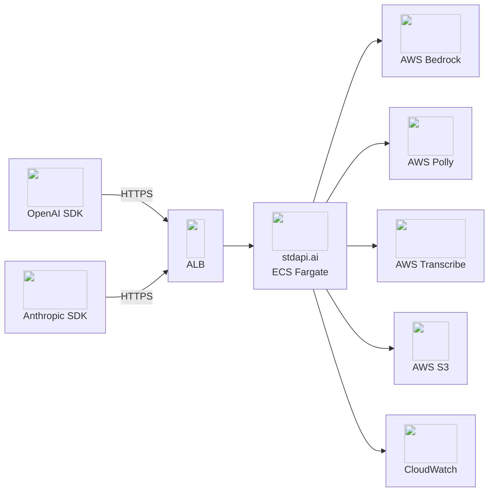

# :material-rocket-launch: Deploy stdapi.ai on AWS

Get a production-grade OpenAI-compatible AI gateway running on AWS in 5 minutes. Terraform handles everything — ECS Fargate, HTTPS, auto-scaling, optional WAF, and optional monitoring.

!!! tip "14-Day Free Trial"
    The AWS Marketplace subscription includes a **14-day free trial**. Test the full production stack in your environment risk-free.

!!! info "Need help?"
    For questions, issue reports, or assistance, see the [Contact](contact.md) page.

!!! info "Prefer a hands-off setup?"
    A [managed deployment service](https://aws.amazon.com/marketplace/pp/prodview-xknxzjgl7zi5s) is available if you'd rather not manage Terraform yourself. Choose between guided assistance (step-by-step support while you retain full control) or fully managed setup (handled on your behalf, inside your AWS account). Response time is 1 business day during the engagement.

---

## :material-rocket-launch: Quick Start

### Prerequisites

1. **Subscribe to stdapi.ai** on [AWS Marketplace](https://aws.amazon.com/marketplace/pp/prodview-su2dajk5zawpo) (14-day free trial included).
2. Install [Terraform](https://www.terraform.io/downloads) or [OpenTofu](https://opentofu.org/docs/intro/install/) >= 1.5.
3. Configure [AWS credentials](https://docs.aws.amazon.com/cli/latest/userguide/cli-configure-files.html) (`aws configure` or `aws sso login`).

!!! warning "Requires AWS administrator permissions"
    The Terraform module provisions IAM roles and policies, KMS keys, ECS/Fargate, ALB, and networking. A restricted developer profile will fail during `terraform apply`.

    **Strongly recommended:** deploy into a **sandbox / non-production AWS account first** to evaluate the stack, then replicate into your target account with scoped-down principals once you've validated it.

!!! tip "Confirm your AWS identity and region before deploying"
    The AWS provider uses the region and profile from your environment — not a Terraform variable. Check both before running `terraform apply`:
    ```bash
    aws sts get-caller-identity
    aws configure get region
    ```

### Deploy

```bash
git clone https://github.com/stdapi-ai/samples.git
cd samples/getting_started_production/terraform
terraform init
terraform apply
```

??? info "No git? Download the ZIP"
    ```bash
    curl -L https://github.com/stdapi-ai/samples/archive/refs/heads/main.zip -o samples.zip
    unzip samples.zip
    cd samples-main/getting_started_production/terraform
    terraform init
    terraform apply
    ```

That's it. In ~5 minutes you have:

- Production-grade ECS Fargate deployment with HTTPS
- Regional S3 buckets
- Auto-scaling and API key authentication
- Interactive API documentation at `/docs`
- IP-restricted access (your IP only)



### Get Your Credentials

```bash
terraform output -raw api_key
terraform output api_endpoint
terraform output docs_url
```

!!! tip "Ready-to-use Terraform example on GitHub"
    :material-map-marker: **Single region** — [getting_started_production](https://github.com/stdapi-ai/samples/tree/main/getting_started_production)

---

## :material-check-circle: Make Your First API Call

**Want to explore the API without writing code?** Use the `docs_url` from `terraform output docs_url` to open the interactive Swagger documentation in your browser — you can browse all available endpoints and make live API calls directly from the page, no code required.

!!! info "If the docs page returns 503 or shows a TLS warning"
    These are normal on a fresh deployment. The ECS service takes 2–3 minutes to pass health checks (→ 503), and the auto-generated `*.elb.amazonaws.com` domain has no trusted TLS certificate (→ browser warning; safe to bypass for testing). See [Troubleshooting](operations_troubleshooting.md) for a permanent HTTPS setup with a custom domain.

stdapi.ai is compatible with both OpenAI and Anthropic SDKs. If you've used either before, you already know how to use it — only the base URL changes. Here are the raw HTTP calls with `curl` so you can verify the endpoint from any shell:

=== "OpenAI-compatible"

    ```bash
    API_ENDPOINT=$(terraform output -raw api_endpoint)
    API_KEY=$(terraform output -raw api_key)

    curl "$API_ENDPOINT/v1/chat/completions" \
      -H "Authorization: Bearer $API_KEY" \
      -H "Content-Type: application/json" \
      -d '{
        "model": "amazon.nova-micro-v1:0",
        "messages": [{"role": "user", "content": "Hello! Tell me a joke."}]
      }'
    ```

=== "Anthropic-compatible"

    ```bash
    API_ENDPOINT=$(terraform output -raw api_endpoint)
    API_KEY=$(terraform output -raw api_key)

    curl "$API_ENDPOINT/anthropic/v1/messages" \
      -H "x-api-key: $API_KEY" \
      -H "anthropic-version: 2023-06-01" \
      -H "Content-Type: application/json" \
      -d '{
        "model": "amazon.nova-micro-v1:0",
        "max_tokens": 1000,
        "messages": [{"role": "user", "content": "Hello! Tell me a joke."}]
      }'
    ```

**Using the official SDKs?** Point the `base_url` / `base_url` option at `$API_ENDPOINT/v1` (OpenAI SDK) or `$API_ENDPOINT/anthropic` (Anthropic SDK) and use your existing code — no other changes needed. The [API Overview](api_overview.md) has SDK snippets for Python, Node.js, and more.

!!! tip "Discover the full model catalog"
    Once your first call succeeds, switch the `model` field to any other Bedrock model — `anthropic.claude-fable-5`, `anthropic.claude-sonnet-5`, `qwen.qwen3-coder-480b-a35b-v1:0`, and more.

    - **Browse all models (recommended):** `GET /search_models` — returns every discovered model with full details (provider, modalities, supported routes, regions, streaming/legacy status). Or open the interactive Swagger docs.
    - **Find a model by capability:** the same endpoint filters by modality, route, region, streaming, or legacy status — e.g. `GET /search_models?input_modalities=IMAGE&route=/v1/chat/completions` returns only vision-capable chat models. This is also the recommended way for AI agents to discover the right model ID before calling another endpoint. See the [Search Models API](api_search_models.md) reference.
    - **OpenAI SDK compatibility:** `GET /v1/models` is also available with the standard OpenAI listing format (lighter payload, no capability metadata) for tools that require the exact OpenAI schema.

**No API key configured?** stdapi.ai runs without authentication by default for quick testing. Add `api_key_create = true` to your Terraform config to enable it.

**Available models:** All AWS Bedrock models available in your configured regions are automatically discovered and exposed. List them with `GET /search_models` — the default endpoint for model discovery, returning full details (capabilities, routes, regions) for every model. Use query parameters to filter by capability (modality, route, region, streaming, legacy status) — particularly useful for AI agents that need to pick the right model dynamically. `GET /v1/models` is also available for strict OpenAI SDK compatibility.

**Verify the deployment is healthy:**

```bash
curl https://your-endpoint/health
# → {"status": "ok"}
```

The `/health` endpoint requires no authentication and is used by the ALB health check.

---

## :material-wrench: Troubleshooting

The two most common first-deployment hiccups:

??? failure "`503 Service Unavailable` on the docs or API for 2–3 minutes"
    The ECS service is still starting. Wait a few minutes and refresh — the container will be ready shortly.

??? failure "Browser TLS warning on the `docs_url`"
    The auto-generated ALB domain (`*.elb.amazonaws.com`) has no trusted certificate. Safe to bypass for testing. For a production-grade certificate, set `alb_domain_name` in the Terraform module to use an ACM-managed certificate on your own domain.

:material-arrow-right: **Full troubleshooting guide:** [Troubleshooting](operations_troubleshooting.md) — 401 auth errors, 404 model not found, ThrottlingException, S3 errors, VPC connectivity, Terraform IAM failures, and more.

---

## :material-currency-usd: Deployment Cost

Costs scale with the number of Availability Zones (AZs): by default, the Terraform module deploys **one ECS Fargate container per AZ**. Both AWS infrastructure costs (ECS/Fargate) and the stdapi.ai product fee (billed per container-hour, after the trial period) are proportional to the number of running containers.

To reduce costs, you can limit the number of AZs or use Fargate Spot pricing. See [Cost-Optimized Deployment](operations_deploy_advanced.md#cost-optimized-deployment) for configuration examples.

---

## :material-arrow-right: Next Steps

<div class="grid cards" markdown>

- :material-book-open-variant: [**API Overview**](api_overview.md) — Endpoints, parameters, and usage examples
- :material-cog: [**Configuration**](operations_configuration.md) — All environment variables and options
- :material-server-network: [**Advanced Deployment**](operations_deploy_advanced.md) — VPC integration, multi-region, cost optimization, manual ECS
- :material-directions-fork: [**Resilience & Failover**](operations_resilience.md) — Multi-region routing and quota multiplication
- :material-shield-lock: [**Data Sovereignty & Compliance**](operations_compliance.md) — GDPR-compliant region configuration
- :material-puzzle: [**Use Cases**](use_cases.md) — Open WebUI, n8n, coding assistants, and more
- :material-wrench: [**Troubleshooting**](operations_troubleshooting.md) — Common first-deployment errors and fixes
- :material-scale-balance: [**Licensing**](operations_licensing.md) — AGPL vs commercial options

</div>
