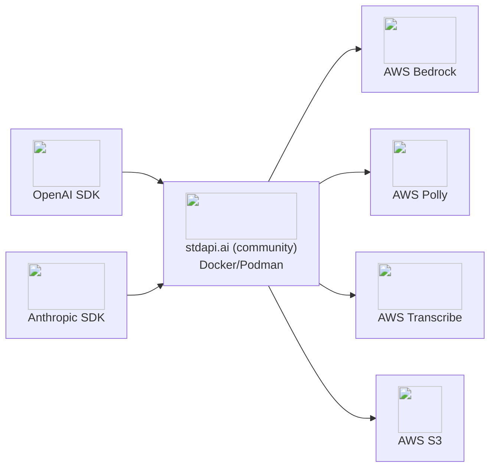

# :material-docker: Local Development with Docker/Podman

Run stdapi.ai locally for development, testing, and evaluation using the free community container image (AGPL-3.0). Full API compatibility — the same endpoints and features as the production deployment.

---

## :material-docker: Run It

**With AWS credentials (after `aws sso login`):**

```bash
docker run --rm -p 8000:8000 \
  -v ~/.aws:/home/nonroot/.aws:ro \
  -e AWS_BEDROCK_REGIONS=us-east-1,us-west-2 \
  -e ENABLE_DOCS=true \
  ghcr.io/stdapi-ai/stdapi.ai-community:latest
```

**With environment variables instead:**

```bash
docker run --rm -p 8000:8000 \
  -e AWS_ACCESS_KEY_ID=your-access-key-id \
  -e AWS_SECRET_ACCESS_KEY=your-secret-access-key \
  -e AWS_SESSION_TOKEN=your-session-token \
  -e AWS_BEDROCK_REGIONS=us-east-1,us-west-2 \
  -e ENABLE_DOCS=true \
  ghcr.io/stdapi-ai/stdapi.ai-community:latest
```

??? info "Podman on Fedora/RHEL with SELinux"

    Add the `:z` SELinux label and `--userns=keep-id`:

    ```bash
    podman run --rm -p 8000:8000 \
      --userns=keep-id \
      -v ~/.aws:/home/nonroot/.aws:ro,z \
      -e AWS_BEDROCK_REGIONS=us-east-1,us-west-2 \
      -e ENABLE_DOCS=true \
      ghcr.io/stdapi-ai/stdapi.ai-community:latest
    ```

    The `:z` flag relabels files for container access. Use `:Z` if multiple containers share the volume. `--userns=keep-id` maps your host user ID to the container user.



---

## :material-check-circle: Test It

```bash
# Check health
curl http://localhost:8000/health

# List available models
curl http://localhost:8000/v1/models

# Chat completion
curl http://localhost:8000/v1/chat/completions \
  -H "Content-Type: application/json" \
  -d '{
    "model": "anthropic.claude-opus-4-6-v1",
    "messages": [{"role": "user", "content": "Hello!"}]
  }'
```

**Interactive API docs:** Open [http://localhost:8000/docs](http://localhost:8000/docs) for Swagger UI with all available endpoints.

---

## :material-puzzle: What to Try Next

stdapi.ai works with any OpenAI or Anthropic-compatible tool. Here are popular integrations to try locally:

<div class="grid cards" markdown>

- :material-chat: [**Open WebUI**](use_cases_openwebui.md) — Private ChatGPT-like interface with RAG, multi-modal support, and document upload
- :material-robot: [**n8n Workflows**](use_cases_n8n.md) — AI-powered automation with 400+ integrations
- :material-code-braces: [**AI Coding Assistants**](use_cases_coding_assistants.md) — Claude Code, Continue.dev, Cline, Cursor, Aider with AWS Bedrock models
- :material-book-open-variant: [**API Overview**](api_overview.md) — All endpoints, parameters, and usage examples

</div>

---

## :material-information: Technical Notes

**Building from source:** See the [Dockerfile](https://github.com/stdapi-ai/stdapi.ai/blob/main/Dockerfile) if you prefer to build the image yourself.

**Container runtime:** Both community and Marketplace images use [Granian](https://github.com/emmett-framework/granian), a high-performance Python ASGI server. Granian environment variables (e.g., `GRANIAN_PORT`, `GRANIAN_WORKERS`) are supported.

**Configuration:** See [Configuration Reference](operations_configuration.md) for all environment variables.

!!! tip "Ready for Production?"
    When you're ready to deploy to AWS with HTTPS, auto-scaling, and enterprise features, the [production deployment guide](operations_getting_started.md) gets you running in 5 minutes with Terraform. The [AWS Marketplace](https://aws.amazon.com/marketplace/pp/prodview-su2dajk5zawpo) subscription includes a **14-day free trial**.
