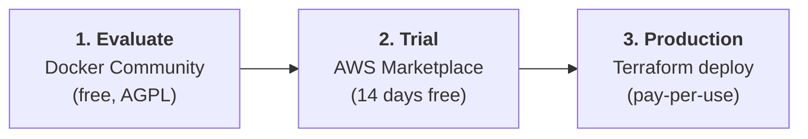

# :material-scale-balance: Licensing

## :material-scale-balance: Choose the License That Fits Your Business

stdapi.ai is available under a dual-license model designed to support both open-source communities and commercial enterprises:

-   :material-scale-balance:{ .lg .middle } __AGPL-3.0-or-later (Free & Open Source)__

    ---

    Free forever for those who share their code

    **Best for:**

    - Open-source projects
    - Research and education
    - Development and testing
    - Projects that can comply with AGPL

    **Includes:** Community Docker image, full source code access

    [:octicons-link-external-16: View License](https://spdx.org/licenses/AGPL-3.0-or-later.html)

-   :material-briefcase:{ .lg .middle } __Commercial License (AWS Marketplace)__

    ---

    Production-ready for proprietary applications — **14-day free trial included**

    **Best for:**

    - Internal company tools
    - SaaS products
    - Proprietary applications
    - Commercial integrations

    **Includes:** Hardened container, security updates, commercial support

    [:octicons-arrow-right-24: Start 14-Day Free Trial on AWS Marketplace](https://aws.amazon.com/marketplace/pp/prodview-su2dajk5zawpo)

---

## :material-briefcase-check: Why Choose the Commercial License?

A commercial license through AWS Marketplace provides everything you need for production deployments:

### :fontawesome-solid-lock: **Keep Your Code Private**
Build proprietary applications without AGPL's source code disclosure requirements. Your intellectual property and modifications stay private.

### :fontawesome-solid-rocket: **Deploy with Confidence**
No copyleft obligations - integrate stdapi.ai into your products and internal tools without AGPL network use restrictions.

### :fontawesome-solid-shield-halved: **Production-Grade Security**
Access hardened and optimized container images with regular security updates, vulnerability patches, and AWS security best practices.

### :fontawesome-solid-arrows-turn-to-dots: **Modify & Distribute Freely**
Customize stdapi.ai to fit your needs and distribute it as part of your commercial offerings without restrictions.

### :fontawesome-solid-handshake: **Enterprise-Ready Terms**
Licensed under the [AWS Marketplace Standard Contract (SCMP)](https://aws.amazon.com/marketplace/management/terms) - straightforward, trusted terms used by thousands of enterprise products.

### :fontawesome-solid-credit-card: **Streamlined AWS Billing**
Purchase and pay through AWS Marketplace. Consolidated billing with your existing AWS infrastructure costs.

---

## :material-check-all: Commercial License Benefits

-   :material-shield-check:{ .lg .middle } __Full Commercial Rights__

    ---

    Use in closed-source applications, modify freely, and distribute as part of your products

-   :material-file-code:{ .lg .middle } __No Source Disclosure__

    ---

    AGPL network use requirements don't apply—keep your modifications private

-   :material-domain:{ .lg .middle } __Internal Network Freedom__

    ---

    Deploy on internal networks without triggering AGPL's source disclosure obligations

-   :material-aws:{ .lg .middle } __Streamlined Procurement__

    ---

    Purchase through AWS Marketplace with familiar terms and billing

-   :material-docker:{ .lg .middle } __Hardened Container Images__

    ---

    Optimized and security-hardened containers built for production workloads

-   :material-security:{ .lg .middle } __Regular Security Updates__

    ---

    Stay protected with timely security patches and vulnerability fixes

-   :material-cloud-upload:{ .lg .middle } __Easy Deployment Options__

    ---

    Quick deployment workflows optimized for AWS infrastructure

-   :material-certificate:{ .lg .middle } __AWS Best Practices__

    ---

    Deployment options follow AWS Well-Architected Framework guidelines

---

## :material-road-variant: Your Path to Production

A typical adoption path from evaluation to production:

| Step | What | Cost | License |
|------|------|------|---------|
| **Evaluate** | Run the community Docker image locally | Free | AGPL-3.0 |
| **Trial** | Subscribe on AWS Marketplace and test in your AWS environment | Free for 14 days | Commercial |
| **Production** | Deploy with Terraform — same config, swap container image | AWS pay-per-use | Commercial |

No migration required between steps. Your Terraform configuration and application code remain the same.

### Quick Start (3 Steps)

1. **Subscribe** — Visit [AWS Marketplace](https://aws.amazon.com/marketplace/pp/prodview-su2dajk5zawpo) and subscribe to stdapi.ai (14-day free trial included)
2. **Accept Contract** — Accept the AWS Marketplace Standard Contract during checkout
3. **Deploy** — Use the [Terraform module](operations_getting_started.md) to deploy immediately with commercial rights activated

**Pricing:** The commercial license is billed at **$0.10/container-hour** through AWS Marketplace — no per-request markup and no markup on model usage. You pay Amazon Bedrock rates directly for inference.

**Typical monthly cost example** (license only, excluding AWS infrastructure and Bedrock model costs):

| Scenario | Hours/month | License cost |
|---|---|---|
| 1 container, 24 × 7 | 720 h | ~$72/month |
| Dev/staging with scheduled stop outside business hours | ~165 h | ~$17/month |

!!! note "Fargate Spot does not reduce the license cost"
    The license fee is billed per container-hour regardless of the Fargate pricing model — 720 h × $0.10 = $72/month whether the underlying container runs on Spot or standard Fargate. Spot only discounts the **AWS infrastructure** cost (the ECS/Fargate compute itself), not the Marketplace license. See [Cost Management](operations_cost_management.md#gateway-cost) for the full infrastructure-vs-license breakdown.

Pay with AWS credits — consolidated with your existing AWS bill, no separate invoice or procurement.

### After Subscribing

Once subscribed, access the hardened container image from AWS Marketplace ECR and deploy using:

- **Terraform module** (recommended) — [See Quick Start guide](operations_getting_started.md#quick-start)
- **Manual ECS deployment** — [See manual setup](operations_deploy_advanced.md#manual-ecs-deployment)

Your commercial license activates automatically upon deployment.

---

## :material-help-circle-outline: Frequently Asked Questions

??? question "Can I try before I buy?"

    Yes, two ways:

    1. **Free AGPL version** - Use the community Docker image (AGPL-3.0) for evaluation, development, and testing. No cost, full features.

    2. **14-day free trial** - AWS Marketplace commercial license includes a 14-day trial. Test the hardened production container in your environment risk-free.

    Both options give you full access to validate stdapi.ai before committing.

??? question "Do I need a commercial license for internal company tools?"

    **Yes, in most cases.** The AGPL-3.0 license requires source code disclosure even for software accessed over a network (the "network use" clause).

    **Examples requiring commercial license:**
    - Internal API gateway for your team
    - Company-wide AI chatbot
    - Department-specific automation tools
    - Private SaaS offering to customers

    The commercial license removes these obligations and lets you keep your code and deployments private.

??? question "What if I'm okay with open-sourcing my application?"

    If you're comfortable open-sourcing your entire application under AGPL-3.0 (including making source available to network users), the free community version works perfectly.

    **AGPL-3.0 is fine for:**
    - Open-source projects that share all code
    - Research and academic projects
    - Personal experiments and learning

    The commercial license is for organizations that need proprietary code or can't meet AGPL's network disclosure requirements.

??? question "Can I switch from AGPL to commercial later?"

    **Yes, absolutely.** This is a common path:

    1. **Develop & test** with free AGPL community Docker image
    2. **Subscribe** to AWS Marketplace when ready for production
    3. **Deploy** with commercial container image - automatic license activation

    No migration required. Just swap container images and deploy. Your Terraform configuration remains the same.

??? question "What's included in the AWS Marketplace Standard Contract?"

    The [AWS Marketplace Standard Contract (SCMP)](https://aws.amazon.com/marketplace/management/terms) provides:

    - Clear license grant terms for commercial use
    - Standard warranty and liability provisions
    - Straightforward payment and billing terms
    - Professional indemnification terms

    It's the same trusted contract used across thousands of enterprise software products on AWS Marketplace.

??? question "I'm building a product for multiple customers. How does licensing work?"

    One AWS Marketplace subscription per running stdapi.ai deployment. The per-container-hour billing handles this automatically — each instance you run accumulates its own usage.

    **Common patterns for ISVs and MSPs:**

    - **One instance per customer** — each customer gets their own stdapi.ai deployment in their AWS account (or a dedicated account you manage). Each instance has its own Marketplace subscription billed to the owning account.
    - **Shared multi-tenant instance** — one instance serves multiple customers. One subscription covers the shared deployment. Use the `safety_identifier` field (or the deprecated `user` field) in API requests to tag traffic per customer for audit trails and usage attribution.

    For questions about volume deployments or enterprise licensing, contact [sales@stdapi.ai](mailto:sales@stdapi.ai).

??? question "How do I update stdapi.ai?"

    Updates are container image redeployments — no data migration or downtime window required.

    **Using the Terraform module** (recommended): the Terraform module is versioned in sync with the application. Bumping the module version in your Terraform config and running `terraform apply` updates the ECS task definition to the new container image and performs a rolling replacement of running tasks with zero downtime.

    **Manual ECS deployment**: update the container image tag in your ECS task definition and trigger a new deployment.

    Security patches are released as new container image versions. Subscribe to [GitHub releases](https://github.com/stdapi-ai/stdapi.ai/releases) to be notified.

---

## :material-email-outline: Support & Deployment Help

### :material-email: Email Support

**Email:** [support@stdapi.ai](mailto:support@stdapi.ai)

Response time: **1 business day** for commercial license subscribers.

For licensing questions, volume pricing, or custom deployment scenarios, contact [sales@stdapi.ai](mailto:sales@stdapi.ai).

### :material-tools: Managed Deployment Service

If you'd prefer not to manage the Terraform deployment yourself, a [managed deployment service](https://aws.amazon.com/marketplace/pp/prodview-xknxzjgl7zi5s) is available on AWS Marketplace. Choose between:

- **Guided setup** — step-by-step assistance while you retain full control
- **Fully managed** — the deployment is handled entirely on your behalf, within your AWS account

Response time is **1 business day** during the engagement. All work is performed inside your own AWS account — no data leaves your environment.

[:octicons-arrow-right-24: View Managed Deployment Service on AWS Marketplace](https://aws.amazon.com/marketplace/pp/prodview-xknxzjgl7zi5s)

---

## :material-arrow-right: Next Steps

- :material-rocket-launch: [**Getting Started**](operations_getting_started.md) — Deploy the commercial container with Terraform
- :material-cash-multiple: [**Cost Management**](operations_cost_management.md) — Infrastructure, license, and AI usage cost breakdown
- :material-docker: [**Local Development**](operations_getting_started_local.md) — Evaluate with the free AGPL community image
- :material-email-outline: [**Contact**](contact.md) — Sales, support, and private offer requests

