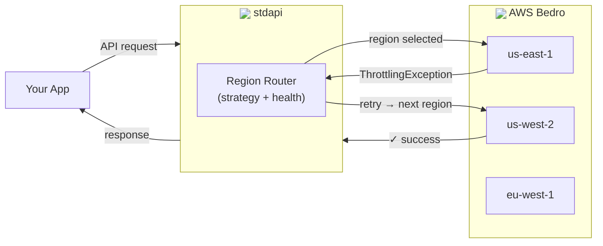
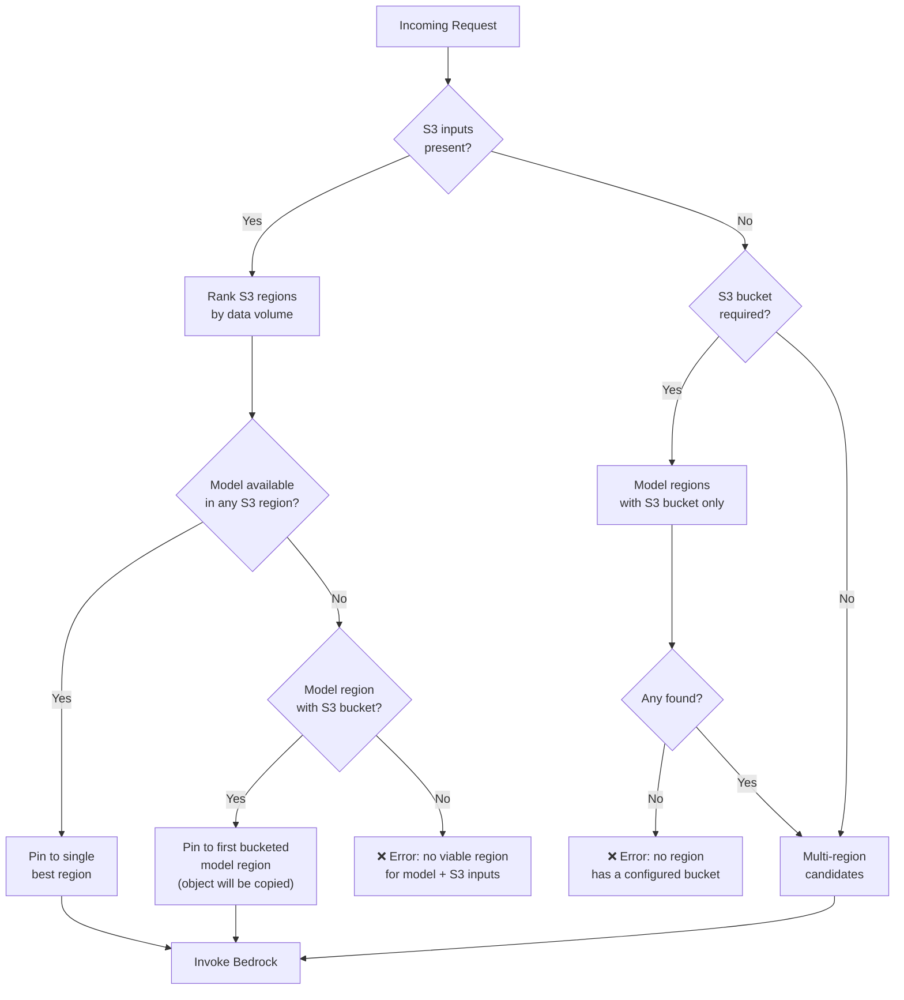
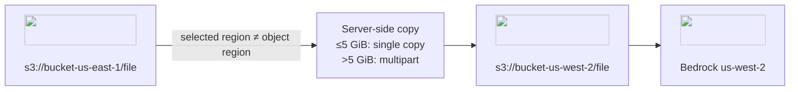

# :material-directions-fork: Region Routing

stdapi.ai can automatically distribute Bedrock requests across your configured AWS regions. When a region becomes temporarily unavailable or hits quota limits, requests are transparently routed to another region—no client changes needed.

## :material-information-outline: Overview

Region routing activates when you have **two or more regions** in `AWS_BEDROCK_REGIONS`. The server tracks the health of each region per model and steers traffic away from regions that are returning errors.

<div class="grid cards" markdown>

- :material-alert-circle-outline: __Quota & Throttling__
  <br>Triggers on `ThrottlingException`, `TooManyRequestsException`, `ServiceQuotaExceededException`

- :material-server-off: __Regional Unavailability__
  <br>Triggers on `ServiceUnavailableException`, `InternalServerException`, `ModelNotReadyException`

- :material-timer-sand: __Exponential Backoff__
  <br>Quota errors: delay doubles per consecutive error, capped at 1 hour

- :material-timer-outline: __Fixed Backoff__
  <br>Unavailability errors: fixed configurable delay, default 30 s

- :material-rotate-right: __Configurable Retry Count__
  <br>Set `AWS_BEDROCK_MAX_RETRIES` to control total retries; requests cycle across regions in order

</div>

---

## :material-swap-horizontal: Routing Strategies

Set the strategy with `AWS_BEDROCK_REGION_ROUTING`:

| Strategy | Description | Prompt Caching | Default |
|---|---|---|---|
| `ordered` | Try regions in the order listed in `AWS_BEDROCK_REGIONS`, skipping any that are currently blocked | :material-check: Compatible | :material-check: Yes |
| `lowest_latency` | Prefer the region with the lowest measured round-trip latency | :material-check: Compatible | |
| `round_robin` | Distribute requests evenly across available regions | :material-close: Not compatible | |
| `disabled` | No routing; each model uses its primary region only | :material-check: Compatible | |

### Ordered (default)

Regions are tried in the order they appear in `AWS_BEDROCK_REGIONS`. The first healthy region wins. This is the best choice when you want predictable routing and prompt caching, since requests for a given model tend to land on the same region as long as it is healthy.

### Lowest Latency

At startup the server measures round-trip latency to each region and prefers the fastest one. If that region becomes blocked, the next-fastest is used. Good for latency-sensitive workloads where you want the server to pick the closest region automatically.

### Round Robin

Requests rotate evenly across healthy regions. This maximizes aggregate throughput when you need to spread load, but is **incompatible with prompt caching** because consecutive requests for the same model may land on different regions.

---

## :material-cog-outline: Configuration

```bash
# Required: at least two regions
export AWS_BEDROCK_REGIONS=us-east-1,us-west-2,eu-west-1

# Strategy (default: ordered)
export AWS_BEDROCK_REGION_ROUTING=ordered

# Total retries across all regions per request (default: 9)
# With 3 regions and 9 retries, the cycle is: r1, r2, r3, r1, r2, r3, r1, r2, r3, r1 (10 total attempts)
export AWS_BEDROCK_MAX_RETRIES=9

# Enable adaptive retry mode — dynamically throttles back retries under congestion (default: false)
export AWS_ADAPTIVE_RETRY=false

# How long to avoid a region after a quota/throttling error (seconds, default: 60)
# This is the base value — the actual delay doubles on each consecutive quota error,
# up to a hard ceiling of 1 hour.
export AWS_BEDROCK_REGION_ROUTING_QUOTA_BACKOFF_SECONDS=60

# Hard ceiling on quota backoff per region (seconds, default: 3600 = 1 hour)
export AWS_BEDROCK_REGION_ROUTING_MAX_QUOTA_BACKOFF_SECONDS=3600

# Factor × max quota backoff after which the consecutive-error counter resets (default: 2)
export AWS_BEDROCK_REGION_ROUTING_QUOTA_STALE_FACTOR=2

# How long to avoid a region after an unavailability error (seconds, default: 30)
export AWS_BEDROCK_REGION_ROUTING_UNAVAILABLE_BACKOFF_SECONDS=30
```

!!! tip "Single-Region Deployments"
    With only one region configured, routing is automatically disabled regardless of the strategy setting.

---

## :material-transit-connection-variant: How It Works

1. **Model discovery** — At startup, stdapi.ai discovers which models are available in each configured region.
2. **Region selection** — When a request arrives, the router picks the best region for that model based on the active strategy and current region health.
3. **Automatic failover with cycling** — For synchronous and streaming requests without S3 inputs, the retry loop cycles through regions in priority order, wrapping back to the start after exhausting all regions, up to `AWS_BEDROCK_MAX_RETRIES` total retries. For example, with 3 regions and 9 retries the sequence is `r1, r2, r3, r1, r2, r3, r1, r2, r3, r1`. All retryable errors escalate to the next region immediately. When S3 inputs are present, the region is pinned and botocore's adaptive retries handle resilience within that region (see [S3-Aware Region Selection](#s3-aware-region-selection)).
4. **Backoff tracking** — Regions that produce errors are temporarily deprioritized. Quota errors use exponential backoff (base interval doubles per consecutive error, capped at 1 hour); unavailability errors use a fixed backoff. Once the backoff expires, regions rejoin the rotation.



### Failover Scope

| API Style | Failover Behavior |
|---|---|
| Synchronous (Converse, InvokeModel) | Automatic retry cycling across regions within the same request; S3-pinned requests stay on the pinned region with botocore adaptive retries |
| Streaming (ConverseStream, InvokeModelWithResponseStream) | Retry cycling across regions **before** the stream opens; once streaming begins the region is locked. S3-pinned requests stay on the pinned region with botocore adaptive retries. |
| Asynchronous (StartAsyncInvoke) | Region is selected once at job start; no mid-job failover |

---

## :material-text-box-search-outline: Logging

Every request log includes a `model_regions` field (a set) showing which AWS region(s) handled the request. A single request may touch more than one region when failover occurs mid-request.

```json
{
  "type": "request",
  "model_id": "anthropic.claude-sonnet-4-5-20250929-v1:0",
  "model_regions": ["us-east-1"],
  ...
}
```

!!! info "Elevated Log Level on Failover"
    When a region is skipped due to a quota or unavailability error, the request log level is elevated to warning so these events are visible even when filtering for warnings only.

---

## :material-bucket-outline: S3 Data Handling

Many Bedrock operations accept S3 URIs as input (e.g. images, PDFs) or produce S3 output (e.g. async invocations). stdapi.ai includes several features to handle S3 data seamlessly across regions.

### S3-Aware Region Selection

When a request references S3 data, the router takes the data location into account:

- **S3 inputs present** — All S3-sourced input files for the request are tracked and their regions are ranked by **descending total data volume**. Only the **single best region** is used — the retry loop is pinned to it. This is required because S3 content blocks are resolved once for a specific region and cannot be re-resolved for a different one; retrying on another region would send a cross-region S3 reference that Bedrock cannot access. If none of the S3 input regions are regions where the model is available, the router falls back to the first model region that has a configured S3 bucket (the object will be copied there before invocation). If no such bucket region exists either, the request is rejected with an error.
- **S3 required, no S3 inputs** — Operations that need an S3 bucket (e.g. async invocations) restrict candidates to model regions that have a configured S3 bucket. If no region has a bucket, the request is rejected with an error.
- **No S3 constraint** — All regions where the model is available are considered.



!!! warning "No Cross-Region Failover with S3 Inputs"
    When S3 input files are present, the region is locked before the request is made. If that region is throttled or unavailable, the request fails rather than retrying on another region with a stale S3 reference.

### S3 HTTP URL to S3 URI Conversion

If a user passes an S3 HTTP URL (including presigned URLs) as input, stdapi.ai automatically converts it to an `s3://` URI when the bucket is recognized. This avoids unnecessary HTTP round-trips and allows Bedrock to access the object directly.

Recognized buckets include:

- The application's own buckets (`AWS_S3_BUCKET` and `AWS_S3_REGIONAL_BUCKETS`)
- Any bucket listed in `AWS_S3_ACCEPTED_BUCKETS`

Both virtual-hosted style (`https://bucket.s3.region.amazonaws.com/key`) and path-style (`https://s3.region.amazonaws.com/bucket/key`) URLs are supported.

### Cross-Region S3 Copy

When the selected Bedrock region differs from the region where the input S3 object resides, stdapi.ai copies the object to a bucket in the target region before invoking the model. The copy uses server-side copy for objects up to 5 GiB and multipart copy for larger objects.



### Accepted S3 Buckets

You can declare external S3 buckets that the application has read access to. These buckets are then recognized for S3 HTTP URL conversion and region-aware routing:

```bash
export AWS_S3_ACCEPTED_BUCKETS='{"my-data-bucket": "us-east-1", "my-eu-bucket": "eu-west-1"}'
```

Keys are bucket names, values are the AWS region where each bucket resides.

### Regional S3 Buckets

Asynchronous invocations require an S3 bucket in the same region as the Bedrock endpoint. When routing is enabled, configure regional buckets so the router can place async jobs in any eligible region:

```bash
export AWS_S3_REGIONAL_BUCKETS='{"us-east-1": "my-bucket-use1", "us-west-2": "my-bucket-usw2"}'
```

!!! note
    If a region has no configured bucket, it is excluded from async invocation routing but remains available for synchronous and streaming requests.

---

## :material-map-marker-radius-outline: Model Region Restrict

You can restrict specific models to a fixed set of regions. This is useful when a model offers important features only in certain regions (e.g. Nova grounding is only available in `us-east-1`):

```bash
export AWS_BEDROCK_MODEL_REGION_RESTRICT='{"amazon.nova-pro-v1:0": ["us-east-1"]}'
```

Keys are Bedrock model IDs (or prefixes). Values are ordered lists of allowed regions. The model is **only** made available in those regions—no fallback to other regions occurs. The order of the list determines the routing priority when multiple regions are listed.

---

## :material-swap-horizontal: Deprecated Model Fallback

When a client sends a request using a model ID that has been retired or superseded, stdapi.ai can transparently reroute it to the recommended replacement — no client changes needed.

This is controlled by [`AWS_BEDROCK_DEPRECATED_MODEL_FALLBACK`](operations_configuration.md#bedrock-deprecated-model-fallback) (default: `true`).

### How it works

1. On a cache miss, the deprecation registry is consulted for a replacement.
2. If the replacement is itself deprecated, the chain is followed until a live model is found or the chain ends.
3. If a live replacement is found, the request proceeds with it. A **warning** is recorded in the request log and the log level is elevated to `warning` so the event is visible in monitoring.
4. If no live model is found at the end of the chain, a `404` is returned naming both the original deprecated ID and the last replacement tried.

### Legacy model warnings

Using a **legacy** model (one AWS has scheduled for end-of-life) also emits a `warning`-level log entry, including the EOL date when known:

```
Model 'anthropic.claude-3-5-haiku-20241022-v1:0' is legacy and will reach end-of-life on 2026-06-19. Please migrate to a supported model.
```

Models whose EOL date falls within the current cache window are **proactively excluded** at cache refresh time, so they are never served to clients even if AWS has not yet removed them from the available models list.

### Strict mode

Set `AWS_BEDROCK_DEPRECATED_MODEL_FALLBACK=false` to disable the fallback. Requests using a deprecated model ID will fail with a `404` that includes the recommended replacement, forcing clients to update their code explicitly:

```
Model 'amazon.titan-text-lite-v1' is deprecated or pending deprecation, please use 'amazon.nova-lite-v1:0' instead.
```

### Extending the registry

The built-in deprecation registry covers all models listed in the [AWS Bedrock model lifecycle](https://docs.aws.amazon.com/bedrock/latest/userguide/model-lifecycle.html). Use [`AWS_BEDROCK_DEPRECATED_MODELS`](operations_configuration.md#bedrock-deprecated-models) to add custom mappings or override existing ones.

---

## :material-lightbulb-outline: Best Practices

- :material-check: **Start with `ordered`** — It provides failover without sacrificing prompt caching.
- :material-speedometer: **Use `lowest_latency`** only if your server's network position varies or you want the fastest region chosen automatically.
- :material-rotate-right: **Use `round_robin`** for high-throughput batch workloads where prompt caching is not needed.
- :material-timer-check-outline: **Keep backoff values moderate** — The defaults (60 s for quota, 30 s for unavailability) work well for most workloads. Very short backoffs may cause premature retries against a region that is still overloaded.
- :material-counter: **Tune `AWS_BEDROCK_MAX_RETRIES`** — The default of 9 provides strong resilience across multiple regions. Lower it (e.g. `3`) to fail faster; raise it for workloads that can tolerate longer retry windows during sustained outages.
- :material-pulse: **Consider `AWS_ADAPTIVE_RETRY`** — Enable this when many concurrent clients share the same endpoint and sustained congestion is likely. It paces retries based on real-time error signals, reducing the risk of retry storms — at the cost of potentially higher per-request latency under load. Avoid it for latency-sensitive or low-traffic workloads.
- :material-magnify: **Monitor `model_regions` in logs** — If one region consistently appears in error logs, consider adjusting its quota or removing it from the region list.
- :material-bucket-outline: **Declare accepted buckets** — If your users provide S3 URLs from buckets outside the application's own buckets, add them to `AWS_S3_ACCEPTED_BUCKETS` so the router can resolve their region and convert HTTP URLs to S3 URIs.
- :material-pin-outline: **Pin models when needed** — Use `AWS_BEDROCK_MODEL_REGION_RESTRICT` for models that have region-specific features (e.g. grounding) to guarantee those features are always available. The model will be restricted exclusively to the listed regions.
- :material-swap-horizontal: **Plan for model deprecations** — Keep `AWS_BEDROCK_DEPRECATED_MODEL_FALLBACK=true` (the default) so clients survive AWS model retirements without downtime. Switch to `false` in environments where you want to enforce explicit client migrations.
