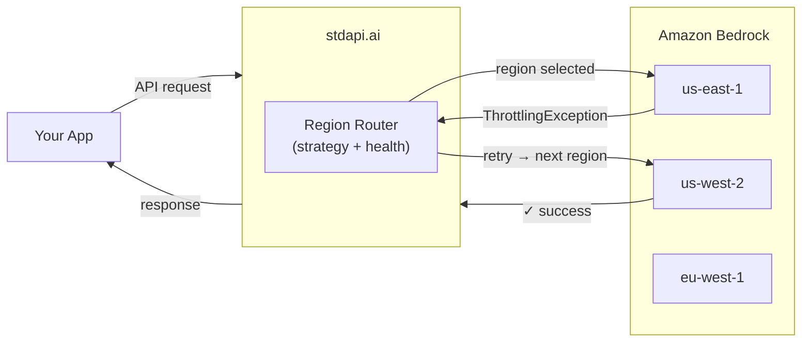
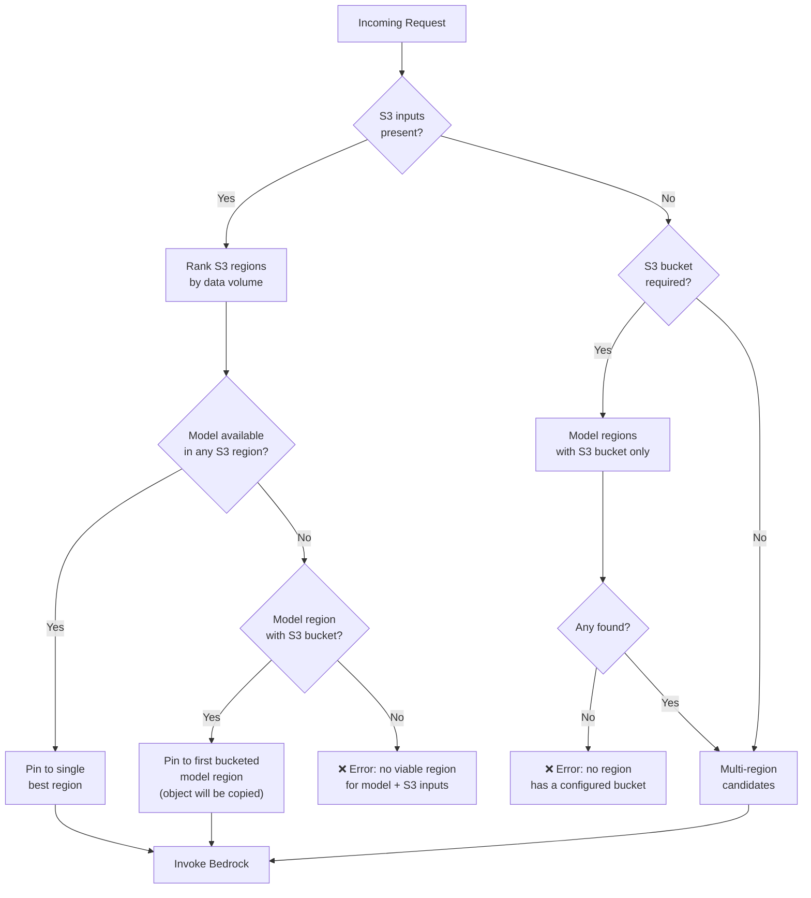
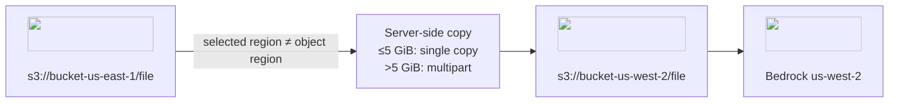
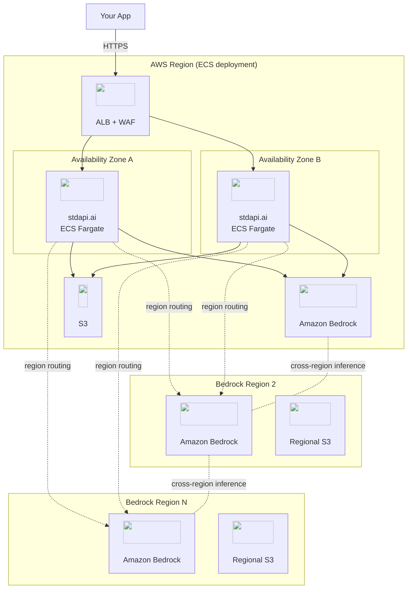
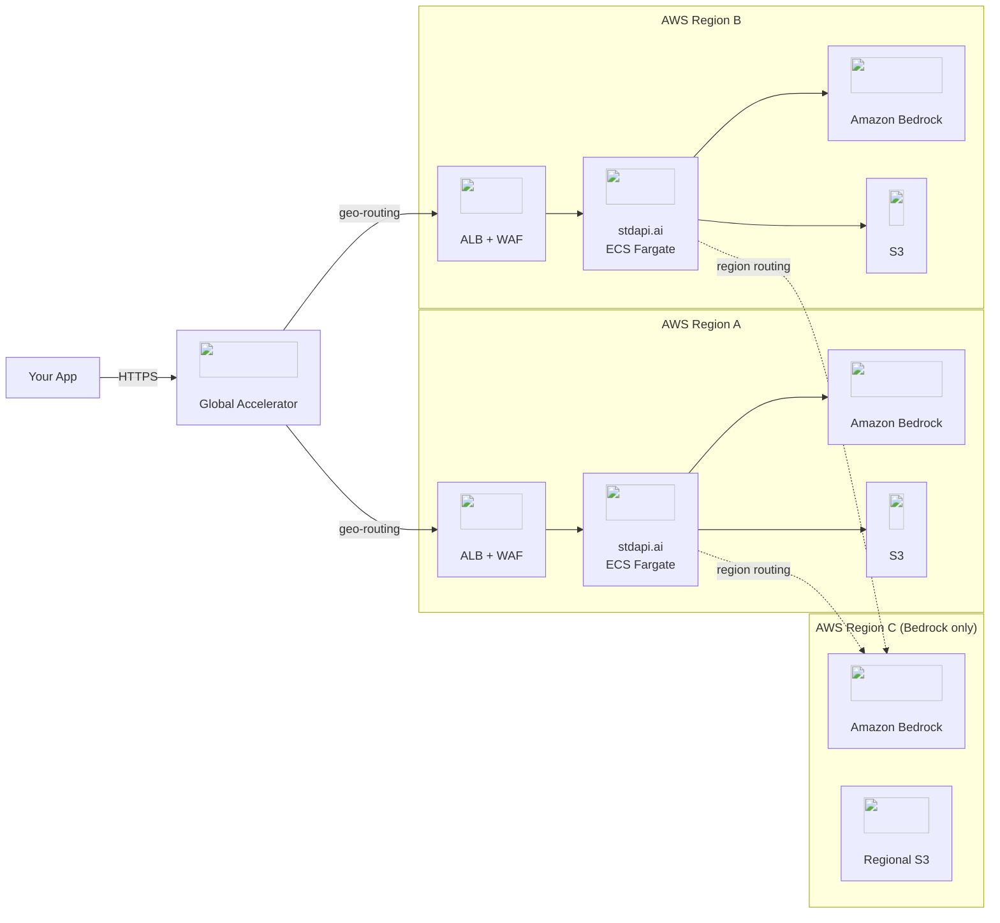

# :material-shield-check: Resilience & Failover

stdapi.ai on AWS is designed for high availability at every layer — from intelligent multi-region request routing to the underlying infrastructure running the service. This page covers both the application-level region routing for Amazon Bedrock and the infrastructure resilience built into the Terraform module.

---

## :material-directions-fork: Region Routing

stdapi.ai can automatically distribute Bedrock requests across your configured AWS regions. When a region becomes temporarily unavailable or hits quota limits, eligible failures are retried in another enabled region — no client changes needed.

!!! tip "Each Region Contributes Its Own Quota"
    Bedrock quotas are per-region: every region you enable adds its own independent tokens-per-minute and requests-per-minute limits, so a multi-region deployment draws on multiple independent quotas rather than one. How much of that headroom a given workload reaches depends on the quotas granted per model in each region and on the routing strategy in use.

!!! info "What failover covers"
    Retrying in another region is conditional, and the carve-outs matter more than the happy path:

    - **Synchronous** requests retry across regions within the same request, each candidate region tried at most once.
    - **Streaming** requests can only fail over **before** the stream opens; once bytes are flowing the region is locked.
    - **Asynchronous** jobs select a region at job start and do not move.
    - **Requests carrying S3 inputs** are pinned to a single region and do not fail over at all.

    See [Failover Scope](#failover-scope) and [S3-Aware Region Selection](#s3-aware-region-selection) for the full behaviour.

### :material-information-outline: Overview

Region routing activates when you have **two or more regions** in `AWS_BEDROCK_REGIONS`. The server tracks the health of each region per model and steers traffic away from regions that are returning errors.

<div class="grid cards" markdown>

- :material-alert-circle-outline: __Quota & Throttling__
  <br>Triggers on `ThrottlingException`, `TooManyRequestsException`, `ServiceQuotaExceededException`

- :material-server-off: __Regional Unavailability__
  <br>Triggers on `ServiceUnavailableException`, `InternalServerException`, `ModelNotReadyException`

- :material-timer-sand: __Exponential Backoff__
  <br>Quota errors: delay doubles per consecutive error, capped at 1 hour

- :material-timer-outline: __Fixed Backoff__
  <br>Unavailability errors: fixed configurable delay, default 30 s

- :material-rotate-right: __Configurable Retry Count__
  <br>Set `AWS_BEDROCK_MAX_RETRIES` to cap the attempts per request; each region is tried at most once

</div>

---

### :material-swap-horizontal: Routing Strategies

Set the strategy with `AWS_BEDROCK_REGION_ROUTING`:

| Strategy | Description | Prompt Caching | Default |
|---|---|---|---|
| `ordered` | Try regions in the order listed in `AWS_BEDROCK_REGIONS`, skipping any that are currently blocked | :material-check: Compatible | :material-check: Yes |
| `lowest_latency` | Prefer the region with the lowest measured round-trip latency | :material-check: Compatible | |
| `round_robin` | Distribute requests evenly across available regions | :material-close: Not compatible | |
| `disabled` | No routing; each model uses its primary region only | :material-check: Compatible | |

#### Ordered (default)

Regions are tried in the order they appear in `AWS_BEDROCK_REGIONS`. The first healthy region wins. This is the best choice when you want predictable routing and prompt caching, since requests for a given model tend to land on the same region as long as it is healthy.

#### Lowest Latency

At startup the server measures round-trip latency to each region and prefers the fastest one. If that region becomes blocked, the next-fastest is used. Good for latency-sensitive workloads where you want the server to pick the closest region automatically.

#### Round Robin

Requests rotate evenly across healthy regions. This maximizes aggregate throughput when you need to spread load, but is **incompatible with prompt caching** because consecutive requests for the same model may land on different regions.

---

### :material-cog-outline: Configuration

```bash
# Required: at least two regions
export AWS_BEDROCK_REGIONS=us-east-1,us-west-2,eu-west-1

# Strategy (default: ordered)
export AWS_BEDROCK_REGION_ROUTING=ordered

# Cap on retries across regions per request (default: 9, i.e. 10 attempts)
# Each region is tried at most once, so with 3 regions a request makes at most 3 attempts: r1, r2, r3
export AWS_BEDROCK_MAX_RETRIES=9

# Enable adaptive retry mode — dynamically throttles back retries under congestion (default: false)
export AWS_ADAPTIVE_RETRY=false

# How long to avoid a region after a quota/throttling error (seconds, default: 60)
# This is the base value — the actual delay doubles on each consecutive quota error,
# up to a hard ceiling of 1 hour.
export AWS_BEDROCK_REGION_ROUTING_QUOTA_BACKOFF_SECONDS=60

# Hard ceiling on quota backoff per region (seconds, default: 3600 = 1 hour)
export AWS_BEDROCK_REGION_ROUTING_MAX_QUOTA_BACKOFF_SECONDS=3600

# Factor × max quota backoff after which the consecutive-error counter resets (default: 2)
export AWS_BEDROCK_REGION_ROUTING_QUOTA_STALE_FACTOR=2

# How long to avoid a region after an unavailability error (seconds, default: 30)
export AWS_BEDROCK_REGION_ROUTING_UNAVAILABLE_BACKOFF_SECONDS=30
```

!!! tip "Single-Region Deployments"
    With only one region configured, routing is automatically disabled regardless of the strategy setting.

---

### :material-transit-connection-variant: How It Works

1. **Model discovery** — At startup, stdapi.ai discovers which models are available in each configured region.
2. **Region selection** — When a request arrives, the router picks the best region for that model based on the active strategy and current region health.
3. **Automatic failover** — For synchronous and streaming requests without S3 inputs, the retry loop walks the regions in priority order and stops once every candidate has been tried, or once `AWS_BEDROCK_MAX_RETRIES` retries are spent — whichever comes first. A region is never attempted twice within the same request: it is still blocked by the backoff its failure just recorded, and a second error there would only deepen that backoff. All retryable errors escalate to the next region immediately, except a read timeout ([`AI_RESPONSE_TIMEOUT`](operations_configuration.md#ai-response-timeout)): the model has already been invoked and is billed by AWS whatever the client does, so the request fails with a `503` rather than paying a second region for the same generation. When S3 inputs are present, the region is pinned and botocore's adaptive retries handle resilience within that region (see [S3-Aware Region Selection](#s3-aware-region-selection)).
4. **Backoff tracking** — Regions that produce errors are temporarily deprioritized. Quota errors use exponential backoff (base interval doubles per consecutive error, capped at 1 hour); unavailability errors use a fixed backoff. Once the backoff expires, regions rejoin the rotation.
5. **Client-side backoff hint** — If every attempt is exhausted, the resulting `429` response carries a `retry-after` header set to the shortest quota backoff applied during the request, i.e. the delay after which the first blocked region rejoins the rotation. OpenAI, Anthropic and Cohere SDKs honour it natively, so clients wait exactly as long as needed instead of applying a blind exponential backoff — note that all three cap a server-supplied delay at 60 s and fall back to their own backoff beyond that, so an escalated quota backoff is only partly respected. The header is omitted when no quota backoff was recorded (for example on a single-region deployment, where no routing state exists).



#### Failover Scope

| API Style | Failover Behavior |
|---|---|
| Synchronous (Converse, InvokeModel) | Automatic failover across regions within the same request, each candidate tried once; S3-pinned requests stay on the pinned region with botocore adaptive retries |
| Streaming (ConverseStream, InvokeModelWithResponseStream) | Failover across regions **before** the stream opens, each candidate tried once; once streaming begins the region is locked. S3-pinned requests stay on the pinned region with botocore adaptive retries. |
| Asynchronous (StartAsyncInvoke) | Region is selected once at job start; no mid-job failover |

---

### :material-text-box-search-outline: Logging

Every request log includes a `model_regions` field (a set) showing which AWS region(s) handled the request. A single request may touch more than one region when failover occurs mid-request.

```json
{
  "type": "request",
  "model_id": "anthropic.claude-sonnet-5",
  "model_regions": ["us-east-1"],
  ...
}
```

!!! info "Elevated Log Level on Failover"
    When a region is skipped due to a quota or unavailability error, the request log level is elevated to warning so these events are visible even when filtering for warnings only.

---

### :material-bucket-outline: S3 Data Handling

Many Bedrock operations accept S3 URIs as input (e.g. images, PDFs) or produce S3 output (e.g. async invocations). stdapi.ai includes several features to handle S3 data seamlessly across regions.

#### S3-Aware Region Selection

When a request references S3 data, the router takes the data location into account:

- **S3 inputs present** — All S3-sourced input files for the request are tracked and their regions are ranked by **descending total data volume**. Only the **single best region** is used — the retry loop is pinned to it. This is required because S3 content blocks are resolved once for a specific region and cannot be re-resolved for a different one; retrying on another region would send a cross-region S3 reference that Bedrock cannot access. If none of the S3 input regions are regions where the model is available, the router falls back to the first model region that has a configured S3 bucket (the object will be copied there before invocation). If no such bucket region exists either, the request is rejected with an error.
- **S3 required, no S3 inputs** — Operations that need an S3 bucket (e.g. async invocations) restrict candidates to model regions that have a configured S3 bucket. If no region has a bucket, the request is rejected with an error.
- **No S3 constraint** — All regions where the model is available are considered.



!!! warning "No Cross-Region Failover with S3 Inputs"
    When S3 input files are present, the region is locked before the request is made. If that region is throttled or unavailable, the request fails rather than retrying on another region with a stale S3 reference.

#### S3 HTTP URL to S3 URI Conversion

If a user passes an S3 HTTP URL (including presigned URLs) as input, stdapi.ai automatically converts it to an `s3://` URI when the bucket is recognized. This avoids unnecessary HTTP round-trips and allows Bedrock to access the object directly.

Recognized buckets include:

- The application's own buckets (`AWS_S3_BUCKET` and `AWS_S3_REGIONAL_BUCKETS`)
- Any bucket listed in `AWS_S3_ACCEPTED_BUCKETS`

Both virtual-hosted style (`https://bucket.s3.region.amazonaws.com/key`) and path-style (`https://s3.region.amazonaws.com/bucket/key`) URLs are supported.

#### Cross-Region S3 Copy

When the selected Bedrock region differs from the region where the input S3 object resides, stdapi.ai copies the object to a bucket in the target region before invoking the model. The copy uses server-side copy for objects up to 5 GiB and multipart copy for larger objects.



#### Accepted S3 Buckets

You can declare external S3 buckets that the application has read access to. These buckets are then recognized for S3 HTTP URL conversion and region-aware routing:

```bash
export AWS_S3_ACCEPTED_BUCKETS='{"my-data-bucket": "us-east-1", "my-eu-bucket": "eu-west-1"}'
```

Keys are bucket names, values are the AWS region where each bucket resides.

#### Regional S3 Buckets

Asynchronous invocations require an S3 bucket in the same region as the Bedrock endpoint. When routing is enabled, configure regional buckets so the router can place async jobs in any eligible region:

```bash
export AWS_S3_REGIONAL_BUCKETS='{"us-east-1": "my-bucket-use1", "us-west-2": "my-bucket-usw2"}'
```

!!! info "Terraform Module"
    When using the Terraform module, regional S3 buckets are configured automatically. Manual `AWS_S3_REGIONAL_BUCKETS` configuration is only needed for direct deployments.

!!! note
    If a region has no configured bucket, it is excluded from async invocation routing but remains available for synchronous and streaming requests.

---

### :material-map-marker-radius-outline: Model Region Restrict

You can restrict specific models to a fixed set of regions. This is useful when a model offers important features only in certain regions (e.g. Nova grounding is only available in `us-east-1`):

```bash
export AWS_BEDROCK_MODEL_REGION_RESTRICT='{"amazon.nova-pro-v1:0": ["us-east-1"]}'
```

Keys are Bedrock model IDs (or prefixes). Values are ordered lists of allowed regions. The model is **only** made available in those regions—no fallback to other regions occurs. The order of the list determines the routing priority when multiple regions are listed (with the default `ordered` routing strategy).

---

### :material-swap-horizontal: Deprecated Model Fallback

When a client sends a request using a model ID that has been retired or superseded, stdapi.ai can transparently reroute it to the recommended replacement — no client changes needed.

This is controlled by [`AWS_BEDROCK_DEPRECATED_MODEL_FALLBACK`](operations_configuration.md#bedrock-deprecated-model-fallback) (default: `true`).

#### How It Works

1. On a cache miss, the deprecation registry is consulted for a replacement.
2. If the replacement is itself deprecated, the chain is followed until a live model is found or the chain ends.
3. If a live replacement is found, the request proceeds with it. A **warning** is recorded in the request log and the log level is elevated to `warning` so the event is visible in monitoring.
4. If no live model is found at the end of the chain, a `404` is returned naming both the original deprecated ID and the last replacement tried.

!!! warning "`AWS_BEDROCK_LEGACY` — Use with caution"
    Setting `AWS_BEDROCK_LEGACY=true` forces stdapi.ai to keep serving legacy (end-of-life) models. AWS may deny requests to such models with an access error if you have not been actively using the model recently, causing failover to break silently. Only set this option if using a legacy model is absolutely required.

#### Legacy Model Warnings

Using a **legacy** model (one AWS has scheduled for end-of-life) also emits a `warning`-level log entry, including the EOL date when known:

```text
Model 'anthropic.claude-haiku-4-5-20251001-v1:0' is legacy and will reach end-of-life on 2027-06-19. Please migrate to a supported model.
```

Models whose EOL date falls within the current cache window are **proactively excluded** at cache refresh time, so they are never served to clients even if AWS has not yet removed them from the available models list.

#### Strict Mode

Set `AWS_BEDROCK_DEPRECATED_MODEL_FALLBACK=false` to disable the fallback. Requests using a deprecated model ID will fail with a `404` that includes the recommended replacement, forcing clients to update their code explicitly:

```text
The model `amazon.titan-text-lite-v1` does not exist or you do not have access to it. This model is deprecated or pending deprecation, please use 'amazon.nova-lite-v1:0' instead. Call the models endpoint to list the models this server provides.
```

#### Extending the Registry

The built-in deprecation registry covers all models listed in the [Amazon Bedrock model lifecycle](https://docs.aws.amazon.com/bedrock/latest/userguide/model-lifecycle.html). Use [`AWS_BEDROCK_DEPRECATED_MODELS`](operations_configuration.md#bedrock-deprecated-models) to add custom mappings or override existing ones.

---

### :material-account-voice: Other AWS Services Failover

Amazon Polly, Transcribe, Translate, and Comprehend follow the same regional-failover pattern as Bedrock. Each service has its own region setting — [`AWS_POLLY_REGION`](operations_configuration.md#aws-polly-region), [`AWS_TRANSCRIBE_REGION`](operations_configuration.md#aws-transcribe-region), [`AWS_TRANSLATE_REGION`](operations_configuration.md#aws-translate-region), [`AWS_COMPREHEND_REGION`](operations_configuration.md#aws-comprehend-region) — and when left unset, every region in `AWS_BEDROCK_REGIONS` becomes a candidate, tried in order with automatic failover on region-level errors:

- **Polly** — voice availability is discovered per engine (Standard, Neural, Long-form, Generative) across all candidate regions at startup; each synthesis call routes to a region offering the requested engine and voice.
- **Transcribe** — candidate regions are restricted to those with a co-located S3 bucket ([`AWS_TRANSCRIBE_S3_BUCKET`](operations_configuration.md#aws-transcribe-s3-bucket) or a regional bucket in [`AWS_S3_REGIONAL_BUCKETS`](operations_configuration.md#aws-s3-regional-buckets)); on a region-level error the audio is copied to the next candidate's bucket and the job restarts there.
- **Translate** and **Comprehend** — calls try each candidate region in order and fail over on throttling, service unavailability, or network errors.

When several regions are candidates, per-region SDK retries are capped by [`AWS_FAILOVER_MAX_RETRIES`](operations_configuration.md#failover-max-retries) so that failover across regions replaces deep in-region retrying.

Setting an explicit region for any of these services pins it to that single region, disabling failover.

### :material-rocket-launch-outline: Fault-Tolerant Startup

A Bedrock region that cannot be reached at startup (invalid region for the account, network issue, throttling) does not block the server from starting: it is skipped with an `unreachable_bedrock_regions` warning, its models are served from the remaining regions, and the region is retried automatically on the next model list refresh ([`MODEL_CACHE_SECONDS`](operations_configuration.md#model-cache-seconds)). Startup only fails when **every** configured region is unreachable, or when **every** per-model availability check errors — see [Unreachable Region Tolerance](operations_configuration.md#aws-bedrock-regions).

---

## :material-server-network: Infrastructure Resilience

The Terraform module deploys stdapi.ai following AWS best practices for high availability and fault tolerance. Every component is designed to handle failures transparently — no additional configuration required.

<div class="grid cards" markdown>

- :material-view-module: __Multi-AZ Fargate Tasks__
  <br>ECS tasks spread across all Availability Zones; a single AZ failure does not interrupt service

- :material-autorenew: __Stateless Service Design__
  <br>stdapi.ai keeps no state on disk — a failed task is replaced without loss of stored data, since all persistent data lives in S3

- :material-heart-pulse: __ALB Health Checks__
  <br>Unhealthy tasks drained and replaced within seconds; traffic rerouted to healthy AZs automatically

- :material-earth: __Bedrock Cross-Region Inference__
  <br>Bedrock-native routing across AWS regions provides an extra failover layer on top of stdapi.ai's own [region routing](#region-routing)

- :material-database-check: __S3 Eleven-Nines Durability__
  <br>99.999999999% object durability; regional buckets co-located with each Bedrock endpoint

- :material-rocket-launch-outline: __Fast Task Startup__
  <br>New tasks become healthy in under 30 seconds, minimizing the recovery window after any failure

- :material-update: __Zero-Downtime Updates__
  <br>Rolling deployments and ALB connection draining let in-flight requests finish on the outgoing task before it is deregistered

</div>



### :material-view-dashboard-variant: Multi-AZ & ECS Service Resilience

**Stateless by design.** stdapi.ai stores no state on disk — all persistent data lives in S3. Each ECS Fargate task is fully replaceable: ECS can terminate and relaunch a failed task without any loss of stored data, and a request interrupted by a task replacement is one the client can retry.

**Multi-AZ spread.** The Terraform module places ECS tasks across all available Availability Zones in the region. If an AZ experiences a partial or full failure, tasks in the remaining AZs continue to process requests without interruption. The default configuration maintains at least one task per Availability Zone, so capacity remains in the other AZs during a task replacement event.

**Auto-scaling.** Task count scales automatically based on CPU utilization, memory utilization, and ALB request count — whichever metric signals pressure first. Fargate Spot is optionally available for cost-sensitive deployments — see [Cost-Optimized Deployment](operations_deploy_advanced.md#cost-optimized-deployment) for the trade-offs.

!!! info "Terraform Module"
    Minimum capacity defaults to the number of deployed Availability Zones (one task per AZ, via `autoscaling_min_capacity`). Maximum capacity is configurable (`autoscaling_max_capacity`, default: `null` — uses the AWS Application Auto Scaling default). Auto-scaling targets CPU and memory utilization as well as ALB request count per target, so the service scales out under any of these pressure signals.

**Fast startup.** The stdapi.ai container image is optimized for minimal startup time — a new task typically becomes healthy in under 30 seconds. Fast startup is critical for recovery: when ECS detects a failed task it launches a replacement immediately, keeping the degraded window short and ensuring the service restores full capacity without manual intervention.

**Zero-downtime updates.** ECS rolling deployments start the new container version and wait for it to pass health checks before draining the old task. The ALB connection draining period lets in-flight requests complete on the outgoing task before it is deregistered, so an application update does not cut off calls that are already under way — provided they finish within the draining window.

#### :material-tray-arrow-down: Work That Outlives Its Request { #vector-store-indexing }

Vector store [indexing](api_openai_vector_stores.md#indexing-is-asynchronous) runs in the background rather than on the request path, so a task replaced while it is in flight interrupts it. A task asked to stop finishes what it can first — under [`SHUTDOWN_DRAIN_TIMEOUT`](operations_configuration.md#shutdown-drain-timeout) — but that grace period is short by design, since ECS sends `SIGKILL` 30 seconds after `SIGTERM` by default, so it is a courtesy rather than a guarantee. Nothing is stranded when it runs out:

-   A file left `in_progress` with nothing indexing it any more is settled as `failed`, with `last_error` saying the indexing was interrupted, the next time the file, the store, or its file list is read. Attach the file again to index it — no store is left reporting `in_progress` for good, and no client polls forever.
-   Deleting a file from a vector store removes its passages from the index **before** the record that names them, so a task lost mid-delete leaves the deletion to be finished by the next read rather than leaving content searchable. Either way the file stops being searchable and stops being listed the moment the API answers.

**Hand the work to a queue instead.** Set [`AWS_SQS_VECTOR_STORE_QUEUE_URL`](operations_configuration.md#aws-sqs-vector-store-queue-url) and indexing stops depending on the task that accepted it: another task finishes the job.

-   Attaching a file records the work on your Amazon SQS queue **before the response is sent**, once every record it names is already durable in S3. There is no window in which the client has been told the file is attached and the work has not been handed over.
-   Every task reads that queue, so the fleet you already run is the pool of consumers — no extra service, no extra container-hour, and consumer redundancy across Availability Zones for free.
-   A task killed mid-job never confirms the message, so Amazon SQS hands it to another task, which finishes it. Work already completed is not redone, so a recovery costs no extra embeddings.
-   A file the gateway genuinely cannot index is retried a bounded number of times, then reported as `failed` exactly as an unqueued deployment reports it, and its message is kept in your dead-letter queue.
-   A task busy serving requests does not take jobs off the queue: indexing yields to the clients that are waiting.

The queue needs a **standard** queue with a dead-letter queue behind it, and the [durable indexing permissions](operations_iam_permissions.md#durable-vector-store-indexing) on it. The Terraform module provisions both when `aws_sqs_vector_store_queue_create` is set.

### :material-connection: ALB Resilience

The Application Load Balancer is a fully managed, natively multi-AZ AWS service:

- **Cross-AZ load balancing** — traffic is distributed evenly across tasks in all healthy AZs.
- **Health check integration** — the ALB polls `/health` on each task; a task is removed from rotation after consecutive failed health checks and readded as soon as it recovers.
- **WAF protection** — when enabled, WAF sits in front of the ALB and mitigates DDoS and rate-limit abuse before requests reach the application.

!!! info "Terraform Module"
    - **Load balancing algorithm** — uses `weighted_random` with **anomaly mitigation enabled**, automatically reducing traffic sent to tasks exhibiting elevated error rates before they are fully drained.
    - **Idle timeout** — set to **3600 s (1 hour)** (`alb_idle_timeout`) to accommodate long-running streaming LLM responses. Without a sufficiently large timeout, the ALB may terminate connections mid-stream for slow or large generations.

!!! tip "ALB is not a single point of failure"
    AWS manages ALB node redundancy across AZs automatically. An AZ failure reduces capacity but does not take the load balancer offline.

### :material-earth: Bedrock Cross-Region Inference

Amazon Bedrock supports [cross-region inference profiles](https://docs.aws.amazon.com/bedrock/latest/userguide/cross-region-inference.html), which allow Bedrock to automatically route a model invocation to another AWS region when the primary region is throttled or temporarily unavailable. stdapi.ai enables cross-region inference by default (`AWS_BEDROCK_CROSS_REGION_INFERENCE_GLOBAL=true`).

This creates two complementary failover layers:

| Layer | Where it operates | When it triggers |
|---|---|---|
| **stdapi.ai region routing** | Application level — across your configured regions | Quota exceeded, throttling, regional unavailability |
| **Bedrock cross-region inference** | Bedrock service level — transparent within AWS | Bedrock-internal capacity events |

Together, they maximize model availability without any client-side changes.

!!! note "Compliance-aware cross-region inference"
    Set `AWS_BEDROCK_CROSS_REGION_INFERENCE_GLOBAL=false` to restrict Bedrock to region-local inference, ensuring data stays within a specific geography (e.g. EU-only for GDPR compliance). See [Data Sovereignty & Compliance](operations_compliance.md) and the [GDPR deployment example](operations_deploy_advanced.md#production-deployment-fully-featured).

### :material-bucket-outline: S3 Resilience

S3 stores multimodal inputs and outputs (images, PDFs, audio) used by Bedrock operations:

- **99.999999999% (11 nines) object durability** — data is stored redundantly across multiple devices and AZs within a region.
- **99.99% availability SLA** — designed for continuous availability with no planned downtime.
- **Regional buckets** — for multi-region deployments, each Bedrock region has a dedicated S3 bucket co-located in the same region. This eliminates cross-region data transfer for async and multimodal operations and satisfies data residency requirements.

---

### :material-shield-star: Ultimate Multi-Region Deployment

For the highest possible resilience, deploy two independent stdapi.ai stacks in separate AWS regions and connect them with **AWS Global Accelerator**. Global Accelerator routes each client to the **nearest healthy region** using geographic proximity — both regions are active simultaneously. If one region's ALB fails health checks, GA automatically reroutes its traffic to the other region within seconds.

Additional Bedrock regions (without ECS) can be added to `AWS_BEDROCK_REGIONS` in each stack to expand model availability and quota without deploying more ECS infrastructure.

!!! tip "No dedicated sample yet"
    There is no ready-to-use Terraform example for this two-stack + Global Accelerator topology. Start from the [Production Deployment](operations_deploy_advanced.md#production-deployment-fully-featured) module configuration and deploy it twice — once per region — then add Global Accelerator in front of both.

**What this adds on top of a single-region deployment:**

| Component | Single region | Multi-region + GA |
|---|---|---|
| ECS Fargate | Multi-AZ in one region | Multi-AZ in **two** regions |
| ALB | One ALB | One ALB per region |
| Entry point | ALB DNS name | **Single Anycast IP via Global Accelerator** |
| Traffic routing | — | Geographic proximity (nearest region wins) |
| Regional failover | None | Automatic, within seconds |
| Bedrock quota | One region's quota | Multiple independent quotas |



**How Global Accelerator integrates:**

- **Geographic proximity routing** — GA resolves each client to the nearest AWS region over the public internet, then carries the traffic over the AWS backbone to the ALB in that region. Both regions serve live traffic simultaneously.
- **Health-based failover** — GA continuously health-checks each ALB endpoint. If a region's ALB stops responding, GA automatically reroutes its traffic to the other region within seconds — with no DNS TTL delay.
- **Single Anycast entry point** — clients always connect to the same two static IPs regardless of which region handles the request. No client reconfiguration is needed during a regional failure.

!!! note "API key synchronization"
    Both ECS stacks must share the same API key so clients can reach either region transparently. Use `api_key_secretsmanager_secret` pointing to a cross-region replicated Secrets Manager secret, or set the same key via `api_key` in both modules.

---

## :material-lightbulb-outline: Best Practices

**Infrastructure:**

- :material-terraform: **Use the Terraform module** — The [stdapi-ai Terraform module](operations_getting_started.md#quick-start) provisions all resilience features out of the box: multi-AZ ECS, ALB health checks, auto-scaling, WAF, and CloudWatch alarms. Deploying manually risks missing critical settings.
- :material-earth: **Run at least two Bedrock regions** — Configure `aws_bedrock_regions` with two or more regions so the deployment draws on more than one independent Bedrock quota and eligible failures can retry elsewhere. A single region is a single point of failure for quota limits. Each additional region is also a cost driver — see [Cost Management](operations_cost_management.md).

**Region routing:**

- :material-check: **Start with `ordered`** — It provides failover without sacrificing prompt caching.
- :material-speedometer: **Use `lowest_latency`** only if your server's network position varies or you want the fastest region chosen automatically.
- :material-rotate-right: **Use `round_robin`** for high-throughput batch workloads where prompt caching is not needed.
- :material-timer-check-outline: **Keep backoff values moderate** — The defaults (60 s for quota, 30 s for unavailability) work well for most workloads. Very short backoffs may cause premature retries against a region that is still overloaded.
- :material-counter: **Tune `AWS_BEDROCK_MAX_RETRIES`** — The default of 9 exceeds any realistic region count, so a routed request already tries every candidate region once. Lower it (e.g. `2`) to give up after fewer regions; raising it only deepens in-region retrying for single-region and S3-pinned requests.
- :material-pulse: **Consider `AWS_ADAPTIVE_RETRY`** — Enable this when many concurrent clients share the same endpoint and sustained congestion is likely. It paces retries based on real-time error signals, reducing the risk of retry storms — at the cost of potentially higher per-request latency under load. Avoid it for latency-sensitive or low-traffic workloads.
- :material-magnify: **Monitor `model_regions` in logs** — If one region consistently appears in error logs, consider adjusting its quota or removing it from the region list.
- :material-bucket-outline: **Declare accepted buckets** — If your users provide S3 URLs from buckets outside the application's own buckets, add them to `AWS_S3_ACCEPTED_BUCKETS` so the router can resolve their region and convert HTTP URLs to S3 URIs.
- :material-pin-outline: **Pin models when needed** — Use `AWS_BEDROCK_MODEL_REGION_RESTRICT` for models that have region-specific features (e.g. grounding) so requests for that model are only served where the feature exists. The model will be restricted exclusively to the listed regions.
- :material-swap-horizontal: **Plan for model deprecations** — Keep `AWS_BEDROCK_DEPRECATED_MODEL_FALLBACK=true` (the default) so clients survive AWS model retirements without downtime. Switch to `false` in environments where you want to enforce explicit client migrations.

---

## :material-arrow-right: Next Steps

<div class="grid cards" markdown>

- :material-rocket-launch: [**Getting Started**](operations_getting_started.md) — Deploy to AWS with two Terraform commands
- :material-server-network: [**Advanced Deployment**](operations_deploy_advanced.md) — Multi-region Terraform examples with resilience configured
- :material-cog: [**Configuration Reference**](operations_configuration.md) — All routing and failover environment variables
- :material-shield-lock: [**Data Sovereignty & Compliance**](operations_compliance.md) — GDPR-compliant region configuration
- :material-cash-multiple: [**Cost Management**](operations_cost_management.md) — What each additional region and task costs
- :material-email-outline: [**Contact**](contact.md) — Discuss a multi-region or high-availability deployment

</div>
