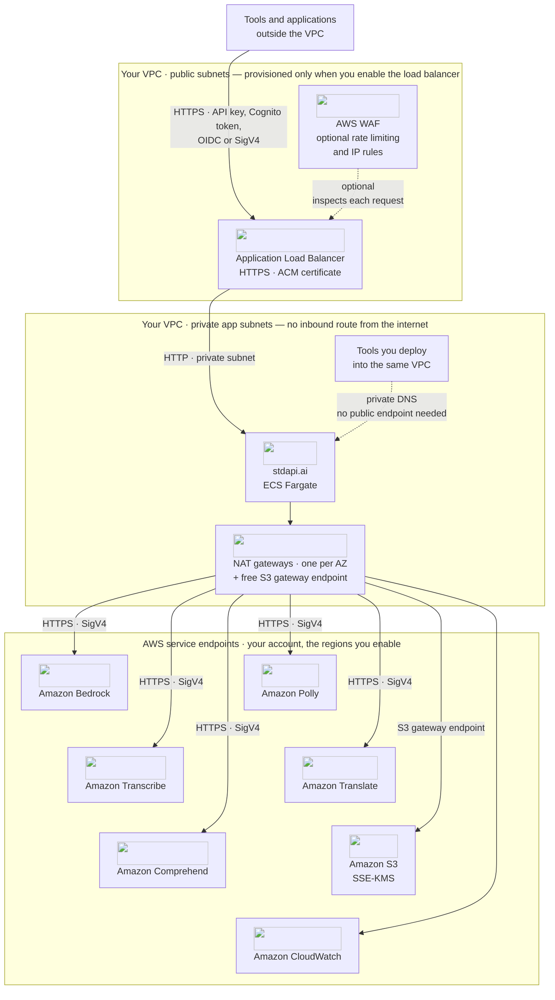

# :material-puzzle: Use Cases

Discover how to integrate stdapi.ai with popular AI applications and tools. stdapi.ai's OpenAI, Anthropic, and Cohere-compatible APIs are already spoken by hundreds of applications and tools, and adopting it takes **two client-side changes**: the API endpoint, and the model name — which you now pick from every provider in the catalogue rather than one vendor's list.

**Why use stdapi.ai for integrations?**

- **Two client-side changes** - Update the API endpoint in your application settings, then name a model this deployment serves
- **Access 100+ models** - Claude, OpenAI GPT, xAI Grok, Kimi, DeepSeek, Qwen, GLM, Nova, Llama, Stability AI, and more
- **Enterprise data control** - The gateway runs in your own AWS account — no third party sits between your users and your models
- **Pay-per-use pricing** - Pay Amazon Bedrock rates for actual usage, with no markup and no per-seat fees
- **AWS-native features** - Leverage prompt caching, reasoning modes, and guardrails through standard OpenAI, Anthropic, and Cohere APIs
- **Three-dialect API compatibility** - Use the OpenAI, Anthropic, or Cohere SDK with the same deployment

!!! tip "Try it before committing to anything"
    Run stdapi.ai on your laptop with the [free community Docker image](operations_getting_started_local.md) — or deploy to AWS with a [14-day free trial](operations_getting_started.md). Both editions expose the same API surface, so the integrations below are configured the same way against either.

## :material-lightning-bolt: How Integration Works

Every integration on this page follows the same four steps, and that's the whole process:

1. **Deploy** stdapi.ai — [on AWS](operations_getting_started.md) or [locally with Docker](operations_getting_started_local.md)
2. **Copy** your endpoint URL and API key
3. **Paste** them into your tool's AI-provider settings (or your SDK's `base_url`)
4. **Name** a model this deployment serves — [`GET /search_models`](api_search_models.md) lists them, and a name the catalogue does not hold returns `404` rather than a lookalike

```python
from openai import OpenAI

client = OpenAI(base_url="https://your-endpoint/v1", api_key="YOUR_KEY")
# Then name a model from the catalogue — the rest of your application is unchanged
```

## :material-sitemap: Reference Architecture

Every guide below plugs a different tool into the same deployment. That deployment is a container on Amazon ECS running with the AWS Fargate launch type, in the private subnets of a VPC the [Terraform module](operations_getting_started.md) creates in your own account.



Two paths reach the gateway, and which one you use decides how much of the diagram you need. A tool running on a laptop or in another account comes in through the load balancer, so the public subnets, the certificate and the optional WAF apply. A tool you deploy into the same VPC — which is what the Open WebUI, LobeHub, n8n, RAGFlow and Home Assistant samples do — resolves the gateway through private DNS, and the deployment then has no public endpoint at all.

### What Each AWS Service Does

| AWS service | Role in a stdapi.ai deployment | Where it is configured |
| --- | --- | --- |
| **Amazon ECS on AWS Fargate** | Runs the gateway container; auto-scales on CPU, memory or request count, with a default minimum of one task per Availability Zone | [`autoscaling_*` inputs](operations_deploy_advanced.md) |
| **Elastic Load Balancing** | Public HTTPS entry point when you enable it, with an ACM certificate and an optional custom domain | `alb_enabled`, `alb_public`, `alb_domain_name` |
| **AWS WAF** | Optional rate limiting per source IP and blocking of known anonymous IPs, in front of the load balancer | `alb_waf_enabled` |
| **Amazon Bedrock** | Every text, image, video, embedding and reranking model the catalogue serves, through Converse and InvokeModel | [`AWS_BEDROCK_REGIONS`](operations_configuration.md#aws-bedrock-regions) |
| **Amazon Bedrock Guardrails** | Content policy applied to requests and responses across routes, natively on chat and through `ApplyGuardrail` elsewhere | [Bedrock Guardrails](operations_configuration.md#bedrock-guardrails) |
| **Amazon Polly** | Speech synthesis behind `/v1/audio/speech` | [Audio Speech API](api_openai_audio_speech.md) |
| **Amazon Transcribe** | Speech recognition, including streaming and speaker diarization, behind `/v1/audio/transcriptions` | [Audio Transcriptions API](api_openai_audio_transcriptions.md) |
| **Amazon Translate** | Turns transcribed speech into English behind `/v1/audio/translations` | [Audio Translations API](api_openai_audio_translations.md) |
| **Amazon Comprehend** | Toxicity detection behind `/v1/moderations` when no guardrail is configured, and language detection for voice routing | [Moderations API](api_openai_moderations.md) |
| **Amazon S3** | Temporary multimodal inputs and outputs, and asynchronous job results; regional buckets are created for the Bedrock regions you enable | [S3 Data Storage](operations_compliance.md#s3-data-storage) |
| **AWS KMS** | Customer-managed keys encrypting every bucket the module creates | [KMS Encryption](operations_compliance.md#kms-encryption) |
| **Amazon CloudWatch** | Container logs, structured request logs, Container Insights, EMF usage metrics and optional alarms | [Logging & monitoring](operations_logging_monitoring.md) |
| **AWS IAM** | The task role the gateway assumes, scoped to the models and services it actually invokes | [IAM permissions](operations_iam_permissions.md) |
| **Amazon Cognito** | Optional user-pool tokens as the client credential, and the identity that per-user cost attribution is derived from | [Cognito tokens](operations_authentication_security.md#amazon-cognito-user-pool-tokens) |

Amazon SQS, Amazon S3 Vectors, AWS Systems Manager and AWS Secrets Manager join the list only when the features that use them are enabled — durable vector-store indexing and externally stored API keys respectively.

### Where the Boundaries Are

The gateway holds request data in memory and writes nothing to disk; it is stateless between requests, so replacing a task loses no user data. Clients authenticate with an [API key, a Cognito token, an OIDC or IAM Identity Center identity, or SigV4](operations_authentication_security.md); traffic is HTTPS from the client to the load balancer and HTTPS with SigV4 from the container to each AWS service, with the hop in between staying inside the VPC. At rest, the buckets are encrypted with KMS keys in your account, and CloudWatch receives request metadata rather than prompt content unless payload logging is turned on for debugging. The full statement of what is stored, where, and for how long is on the [data sovereignty & compliance](operations_compliance.md) page.

## :material-chart-box: What the Deployment Reports

The gateway emits one structured event per request. The table below maps the operational questions a new deployment raises to the place its answer already exists.

| What you want to know | Where the answer is |
| --- | --- |
| What a model costs before you call it | [`GET /model_pricing`](api_model_pricing.md) returns the published AWS price for every model in the catalogue |
| How many requests, and how slow | The `request` event carries `path`, `status_code` and `execution_time_ms`; [three ready-made queries](operations_logging_monitoring.md#cloudwatch-logs-insights-queries) cover request tracing, errors and P95/P99 latency |
| How many tokens, characters or audio seconds AWS billed | The `usage` list on each event, broken down by service, model, operation, region and tier — these are AWS-reported quantities, not estimates |
| The same figures as graphable metrics | [`CLOUDWATCH_METRICS=true`](operations_logging_monitoring.md#cloudwatch-metrics-emf) publishes them as EMF metrics in the `stdapi` namespace, dimensioned by `Model` |
| What a request is estimated to have cost | [`COST_TRACKING=true`](operations_cost_management.md#cost-tracking-real-time-aws-pricing) adds a per-request cost — opt-in, off by default, and estimated from published AWS prices rather than read back from your invoice |
| What it actually cost, per team or per end user | [AWS cost attribution](operations_cost_management.md#aws-cost-attribution) in Cost Explorer, from the invoice |
| Where a request went inside your application | The `x-request-id` response header, plus [OpenTelemetry traces](operations_logging_monitoring.md#opentelemetry-integration) when an exporter endpoint is configured |
| The prompts and completions themselves | [Amazon Bedrock model invocation logging](operations_compliance.md#amazon-bedrock-invocation-logging) — an AWS-side feature, off by default, writing to S3 or CloudWatch Logs |

## :material-view-grid: Choose Your Integration

Pick the category that matches your goal — categories marked :material-book-open-variant: have a dedicated step-by-step guide.

Throughout this page, tools in **bold** are driven end to end by an automated test suite against a real deployment; the others have a documented setup.

<div class="grid cards" markdown>

- :material-code-braces: **[AI Coding Assistants](#coding-assistants)** :material-book-open-variant:
  <br>Frontier coding models in your IDE and terminal
- :material-brain: **[Autonomous Agents](#autonomous-agents)** :material-book-open-variant:
  <br>Self-directed agents on infrastructure you control
- :material-chat: **[Chat Interfaces](#chat-interfaces)** :material-book-open-variant:
  <br>Private ChatGPT alternative for your organization
- :material-graph-outline: **[Workflow Automation](#workflow-automation)** :material-book-open-variant:
  <br>AI steps in business processes, no code required
- :material-microphone-message: **[Voice & Audio](#voice-audio)** :material-book-open-variant:
  <br>Voice agents, transcription, and subtitles
- :material-magnify: **[RAG & Semantic Search](#rag-semantic-search)** :material-book-open-variant:
  <br>Ground AI answers in your own documents
- :material-image-multiple: **[Content & Media Generation](#media-generation)**
  <br>Images and video for creative pipelines
- :material-note-text: **[Knowledge Management](#knowledge-management)**
  <br>Private AI inside your notes and research
- :material-robot: **[Team Chatbots](#team-chatbots)**
  <br>Assistants in Slack, Discord, and Teams

</div>

### :material-code-braces: Developer Tools — AI Coding Assistants { #coding-assistants }

*For teams that want frontier coding models in their IDEs and terminals — without sending code to third-party AI clouds.*

Enhance your development workflow with AI-powered coding assistants. stdapi.ai integrates with popular IDEs and AI development frameworks, allowing you to leverage Amazon Bedrock models (Claude, Kimi thinking, Qwen3 Coder Next) for code completion, generation, and intelligent assistance.

**What you can do:**

- **Code completion** - Real-time suggestions as you type in VS Code, JetBrains IDEs
- **Code generation** - Natural language to code with Claude and specialized coding models
- **Codebase understanding** - Chat with your codebase, explain functions, refactor code

**Popular tools:** **Claude Code**, **Codex**, **Qwen Code**, **pi**, Cline, OpenCode, Zed, JetBrains AI Assistant

**[AI Coding Assistants Guide](use_cases_coding_assistants.md)** — Universal setup for IDEs and development frameworks

---

### :material-brain: Autonomous Agents — Research & Task Automation { #autonomous-agents }

*For builders of agents that must run on infrastructure you control.*

Build self-directed AI agents that can plan, execute, and refine complex tasks autonomously. Integrate stdapi.ai with agent frameworks to create intelligent systems powered by Amazon Bedrock that can conduct research, automate workflows, and solve multi-step problems.

**What you can build:**

- **Personal AI assistants** - Autonomous agents connected to messaging, email, and smart home
- **Research agents** - Autonomous web research, data gathering, and analysis
- **Multi-agent systems** - Collaborative agents for complex problem-solving
- **Task automation** - Self-improving workflows that adapt to results
- **Code agents** - Autonomous development and testing systems
- **Grounded agents** - Retrieval the agent calls for itself, over [vector stores](api_openai_vector_stores.md) holding your own documents
- **Resumable sessions** - Threads kept server-side with the [Conversations API](api_openai_conversations.md) and continued by id, rather than resent every turn
- **Per-caller identity** - Agents that [discover how to authenticate](operations_authentication_security.md#authentication-discovery-for-agents) and whose spend is [reported per end user](operations_cost_management.md#per-user-attribution)

**Compatible frameworks:** **OpenClaw**, **Hermes**, **LangChain**, **Pydantic AI**, **OpenAI Agents SDK**, **Agno**, **LlamaIndex**, **LiteLLM**, LangGraph, CrewAI, Strands Agents

All agent frameworks that support OpenAI or Anthropic SDKs work immediately — point the SDK's base URL to stdapi.ai. See the [API overview](api_overview.md) for connection details.

**[Python Client Libraries Guide](use_cases_python_libraries.md)** — Configuring LangChain, pydantic-ai and the OpenAI Agents SDK directly against stdapi.ai

**[Autonomous Agent CLIs Guide](use_cases_autonomous_agents.md)** — Configuring Hermes and OpenClaw directly against stdapi.ai

!!! tip "Give your agents AI capabilities via MCP"
    stdapi.ai is also a native [MCP server](api_overview.md#mcp-model-context-protocol): agents can call image generation, speech synthesis, transcription, file management, and model discovery as MCP tools — no custom integration code needed.

---

### :material-chat: Chat Interfaces — Private ChatGPT Alternative { #chat-interfaces }

*For organizations replacing per-seat AI subscriptions with a private, pay-per-use assistant.*

Build ChatGPT-like experiences with Amazon Bedrock models and complete privacy control. Deploy feature-rich web interfaces that provide familiar chat experiences while keeping all data within your AWS environment.

**What you can build:**

- **Private team chat** - ChatGPT-style interface for your organization
- **Customer support assistant** - AI-powered help desk with your data
- **Internal knowledge base** - RAG-enabled chat with document search
- **Multi-modal applications** - Process text, voice, images, and documents
- **Voice chat & image generation** - Speech input/output and in-chat image creation through the same endpoint

**Popular tools:** **Open WebUI**, LobeHub, AnythingLLM, LibreChat

**[Open WebUI Integration Guide](use_cases_openwebui.md)** — Complete setup with Terraform deployment examples

**[LobeHub Integration Guide](use_cases_lobehub.md)** — Complete setup with Terraform deployment examples

---

### :material-graph-outline: Workflow Automation — AI-Powered Business Processes { #workflow-automation }

*For teams adding AI steps to business processes without writing code.*

Integrate Amazon Bedrock AI into your business processes and automation workflows. Connect models to hundreds of services and APIs through visual workflow builders, enabling sophisticated AI-powered automation without writing code.

**What you can automate:**

- **Customer support** - Auto-classify tickets, generate responses, route intelligently
- **Content creation** - Automated blog posts, social media, email campaigns
- **Data processing** - Extract, transform, and analyze data with AI
- **Document workflows** - Automated summarization, translation, and classification
- **Bulk runs** - Push a backlog through the [Batch API](api_openai_batches.md) asynchronously, at the Amazon Bedrock batch price
- **Content safety** - Screen user-generated content with the [Moderations API](api_openai_moderations.md)

**Popular tools:** **n8n**, **Haystack**, Langflow, Dify, Flowise

!!! note "Make & Zapier"
    Make and Zapier can call stdapi.ai through their generic HTTP/webhook modules, but their native OpenAI modules do not support custom endpoints.

**[n8n Integration Guide](use_cases_n8n.md)** — Complete setup for AI workflow automation

---

### :material-microphone-message: Voice & Audio — Speech Applications & Voice Agents { #voice-audio }

*For products that need speech in and speech out — without adding a second AI vendor.*

Build voice-first applications on the same OpenAI-compatible endpoint: text-to-speech with Amazon Polly voices, speech-to-text with Amazon Transcribe and Bedrock audio models (including streaming and speaker diarization), and speech translation with subtitle output.

**What you can build:**

- **Speech-to-speech agents** - Hold a spoken conversation over one WebSocket with the [Realtime API](api_openai_realtime.md) — the model handles turn taking and interruption, and a live transcript comes back with the audio
- **Voice agents** - Real-time conversational agents for phone, web, and support lines
- **Meeting intelligence** - Transcription with speaker diarization and AI summaries
- **Live transcription** - Return each phrase as it is recognized instead of after the whole recording, with [streamed transcriptions](api_openai_audio_transcriptions.md#streaming)
- **Subtitles & dubbing** - Transcribe and translate audio with SRT/VTT subtitle output
- **Long-form narration** - Speak up to [100,000 characters](api_openai_audio_speech.md#long-input) per request, streamed as it is synthesized
- **Voice interfaces** - Add speech input/output to chat interfaces and internal tools

**Popular frameworks:** **Pipecat**, **LiveKit Agents**, TEN Framework — all accept a custom OpenAI-compatible base URL for LLM, speech-to-text, and text-to-speech services, and the first two are also what put [WebRTC or a phone line](api_openai_realtime.md#transports) in front of a realtime session

**Popular tools:** Home Assistant Assist (via the **wyoming-openai** proxy)

**[Home Assistant Voice Guide](use_cases_home_assistant.md)** — Complete setup for local voice assistants backed by Amazon Transcribe and Amazon Polly

!!! tip "Getting started"
    Point the framework's OpenAI plugin at your stdapi.ai `/v1` URL. See the [Audio Speech](api_openai_audio_speech.md), [Audio Transcriptions](api_openai_audio_transcriptions.md), and [Audio Translations](api_openai_audio_translations.md) APIs for supported models and formats.

---

### :material-magnify: RAG & Semantic Search — Embeddings and Reranking { #rag-semantic-search }

*For teams grounding AI answers in their own documents and data.*

Build retrieval-augmented generation and semantic search pipelines with Bedrock embedding models and Cohere-compatible reranking — two-stage retrieval (embed, then rerank) through one deployment.

**What you can build:**

- **Managed retrieval** - Attach files to a [vector store](api_openai_vector_stores.md) and search it by meaning, with no chunker, embedder, or vector database of your own to run
- **Retrieval the model runs itself** - Name a store as a `file_search` tool and the model searches it mid-answer, citing the files it drew on
- **Your existing knowledge base** - Address an Amazon Bedrock knowledge base you already operate [as a vector store](api_openai_vector_stores.md#knowledge-base-stores) — searched and extended, never recreated
- **Document ingestion** - Parse PDFs and office documents into Markdown with Docling before embedding
- **RAG pipelines** - Ground model answers in your documents with [embeddings](api_openai_embeddings.md)
- **Two-stage retrieval** - Improve relevance with the [Rerank API](api_cohere_rerank.md) on top of vector search
- **Semantic search** - Search by meaning across documents, tickets, and knowledge bases
- **Multimodal search** - Embed text and images with models like Cohere Embed v4

**Popular tools:** **Docling Serve** for document parsing, **Haystack**, **Agno**, **LlamaIndex**, RAGFlow, LightRAG for retrieval — the managed stores need no vector database, and an assembled pipeline works with any of them (pgvector, Qdrant, and others store the vectors; stdapi.ai serves the embeddings)

**[RAG Pipelines Guide](use_cases_rag.md)** — Configuring document parsing, embeddings, Cohere-compatible reranking, and generation together

**[RAGFlow Integration Guide](use_cases_ragflow.md)** — Complete setup with Terraform deployment examples

---

### :material-image-multiple: Content & Media Generation — Images and Video { #media-generation }

*For creative and marketing pipelines that generate visuals at scale.*

Generate and edit visual content with Amazon Bedrock media models through the standard OpenAI Images and Videos APIs — from marketing assets to fully automated content pipelines.

**What you can build:**

- **Image generation** - Text-to-image with Amazon Nova Canvas and Stability AI models via [Images Generations](api_openai_images_generations.md)
- **Image editing** - Inpainting, outpainting, and style transfer via [Images Edits](api_openai_images_edits.md)
- **Video generation** - Asynchronous text/image-to-video with Amazon Nova Reel and Luma Ray via the [Videos API](api_openai_videos.md)
- **Safe publishing pipelines** - Combine generation with the [Moderations API](api_openai_moderations.md) for automated content review

**Popular tools:** Open WebUI (built-in image generation), n8n media workflows, or the APIs directly

!!! tip "Getting started"
    Any tool that supports the OpenAI Images API works by pointing it at your stdapi.ai `/v1` URL. Video generation requires S3 storage. No dedicated guide yet — see the [Videos API](api_openai_videos.md) for setup and the [API overview](api_overview.md) for connection details.

---

### :material-note-text: Knowledge Management — AI-Enhanced Notes & Research { #knowledge-management }

*For individuals and teams adding private AI to their notes and research.*

Transform your knowledge base with AI-powered insights and generation. Integrate stdapi.ai with note-taking applications to add semantic search, writing assistance, and intelligent content organization.

**What you can do:**

- **AI writing assistance** - Generate, edit, and improve your writing
- **Semantic search** - Find notes by meaning, not just keywords
- **Auto-summarization** - Extract key points from long documents
- **Smart organization** - Automatic tagging, linking, and categorization

**Compatible tools:** Obsidian (Copilot plugin), Khoj (self-hosted), SiYuan

!!! tip "Getting started"
    These tools accept a custom OpenAI-compatible endpoint for both chat and embedding models. Point them to your stdapi.ai `/v1` URL. No dedicated guide yet — [see the API overview](api_overview.md) for connection details.

---

### :material-robot: Team Chatbots & Assistants — Slack, Discord, Teams Integration { #team-chatbots }

*For support and ops teams meeting users where they already chat.*

Deploy intelligent AI assistants to your team's communication platforms powered by Amazon Bedrock models.

**What you can build:**

- **Team Q&A bot** - Answer common questions in Slack or Teams
- **Documentation assistant** - Search and cite internal docs in real-time
- **Task automation** - Create tickets, schedule meetings, update databases via chat
- **Moderated channels** - Screen messages with the [Moderations API](api_openai_moderations.md)

**Compatible platforms:** Dify, Chatwoot (Captain, self-hosted), Typebot — or build directly for Slack, Discord, and Microsoft Teams with the OpenAI or Anthropic SDK

!!! tip "Getting started"
    Build bots using the OpenAI or Anthropic SDK, pointing to your stdapi.ai endpoint. No dedicated guide yet — [see the API overview](api_overview.md) for connection details.

---

## :material-help-circle: Common Questions

- **Where does my data go?** The gateway runs in your own AWS account, so no third party sits between your users and your models: inference runs on the AWS services and regions you enable, and Amazon Bedrock does not share prompts with model providers or use them for training. [Data sovereignty & compliance →](operations_compliance.md)
- **What does it cost?** $0.10/container-hour for the gateway — the Terraform module runs one container per Availability Zone by default — plus Amazon Bedrock rates, with no markup and no per-seat fees. Each end user's share can be reported separately in Cost Explorer, from the invoice rather than an estimate. [Licensing & pricing →](operations_licensing.md) · [Cost management →](operations_cost_management.md)
- **Am I locked in?** No — stdapi.ai speaks the standard OpenAI, Anthropic, and Cohere APIs. Leaving is the same client-side change that got you in.

## :material-arrow-right: Ready to Get Started?

<div class="grid cards" markdown>

- :material-rocket-launch: [**Deploy to AWS**](operations_getting_started.md) — Production-ready with two Terraform commands (14-day free trial)
- :material-docker: [**Try Locally with Docker**](operations_getting_started_local.md) — Free community image for development and testing
- :material-book-open-variant: [**API Overview**](api_overview.md) — Endpoints, parameters, and usage examples
- :material-email-outline: [**Contact**](contact.md) — Integration questions, sales, and private offers

</div>
