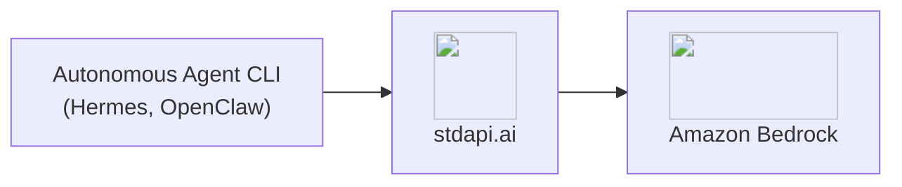
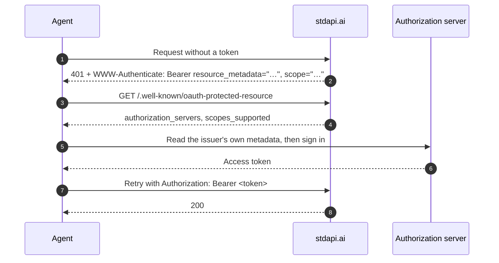

# :material-robot-excited: Autonomous Agent CLIs

Run autonomous agent CLIs against Amazon Bedrock models with stdapi.ai, using the same provider configuration you would point at OpenAI or Anthropic directly—two client-side changes: the base URL, and the model name, which you now pick from every provider in the catalogue rather than one vendor's list.

## :material-information-outline: About Autonomous Agent CLIs

Unlike IDE coding assistants, autonomous agent CLIs plan and execute multi-step tasks on their own—reading files, calling tools, and iterating toward a goal without a human approving each step. They typically run on infrastructure you control (a server, a container, a scheduled job) rather than inside an editor.

**What you can build:**

- **Personal assistants** - Agents that read, search, and act on your behalf from the command line
- **Autonomous research and task loops** - Multi-turn tool-calling sessions that run unattended
- **Self-hosted agent backends** - CLIs wired into cron jobs, CI pipelines, or your own orchestration

## :material-help-circle-outline: Why Autonomous Agent CLIs + stdapi.ai?

<div class="grid cards" markdown>

- :material-swap-horizontal: __No Vendor Lock-In__
  <br>Point the CLI's existing OpenAI- or Anthropic-compatible provider settings at stdapi.ai—no fork, no plugin, no custom integration.

- :material-aws: __Access Amazon Bedrock Models__
  <br>Claude, Nova, DeepSeek, Qwen, and 100+ models, driven through the same agent loop your CLI already runs.

- :material-lock: __No Third-Party AI Cloud__
  <br>Tool calls and model responses are processed by the AWS services you enable, reached through your own deployment — no third-party AI vendor sits in the request path.

- :material-currency-usd-off: __Pay-Per-Use Pricing__
  <br>No per-seat or per-agent licensing. Pay only Amazon Bedrock rates for the calls the agent actually makes.

</div>



## :material-check-circle: Prerequisites

!!! info "What You'll Need"
    - ✓ **stdapi.ai deployed** - [See deployment guide](operations_getting_started.md) or [run locally with Docker](operations_getting_started_local.md)
    - ✓ **Your stdapi.ai URL** - e.g., `https://api.example.com` or `http://localhost:8000` for local
    - ✓ **Your API key** - From Terraform output or configuration (optional for local development)

---

## :material-compass-outline: Bootstrapping Authentication

An agent handed a key in an environment variable is ready to go. An agent handed only a URL is not — and that is the common case for an MCP client, a marketplace agent, or anything a user points at a gateway it has never seen. stdapi.ai answers that case with the standard OAuth 2.0 discovery flow, so the agent works out the rest by itself:



The agent never needs to be told which identity provider you use, where its endpoints are, or which scopes to request — every one of those comes out of step 2 and 4. Enable it by setting [`OAUTH_RESOURCE_IDENTIFIER`](operations_configuration.md#oauth-resource-identifier) and [`OAUTH_AUTHORIZATION_SERVERS`](operations_configuration.md#oauth-authorization-servers) on the deployment.

!!! info "The agent still needs a client identity"
    Discovery tells the agent *where* to authenticate; the authorization server decides *who* may. With an Amazon Cognito user pool, register the agent as an app client in the pool and give it that client ID — Cognito supports neither dynamic client registration nor client-id metadata documents, so it cannot be skipped.

Full walkthrough and the exact document served: [Authentication Discovery for Agents](operations_authentication_security.md#authentication-discovery-for-agents).

---

## :material-robot: Hermes

[Hermes](https://github.com/NousResearch/hermes-agent) (PyPI package `hermes-agent`) is an autonomous agent CLI written in Python.

### :material-cog: Configuration

The simplest setup points Hermes at stdapi.ai through the same environment variables an OpenAI-compatible client would use:

```bash
export OPENAI_API_KEY=YOUR_STDAPI_KEY
export OPENAI_BASE_URL=https://YOUR_STDAPI_URL/v1
```

To select a specific wire format or model, declare a provider in Hermes' `config.yaml` instead:

```yaml
providers:
  stdapi:
    name: stdapi.ai
    api: https://YOUR_STDAPI_URL/v1
    key_env: STDAPI_API_KEY
    transport: chat_completions
    default_model: anthropic.claude-fable-5

model:
  provider: stdapi
  model: anthropic.claude-fable-5
```

`key_env` names the environment variable Hermes reads the API key from—set `STDAPI_API_KEY` (or whatever name you choose) to your stdapi.ai key.

### :material-swap-horizontal: Transport Selection

`transport` is the standout setting: it picks which of stdapi.ai's three chat dialects the provider speaks, and `api` has to match the route serving it:

| `transport` | `api` base URL | API |
|---|---|---|
| `chat_completions` | `https://YOUR_STDAPI_URL/v1` | [Chat Completions](api_openai_chat_completions.md) |
| `codex_responses` | `https://YOUR_STDAPI_URL/v1` | [Responses](api_openai_responses.md) |
| `anthropic_messages` | `https://YOUR_STDAPI_URL/anthropic` | [Anthropic Messages](api_anthropic_messages.md) |

Declare more than one entry under `providers` to reach more than one route side by side.

### :material-cached: Anthropic Prompt-Caching Breakpoints

On the `anthropic_messages` transport, Hermes automatically places [prompt-caching](api_anthropic_messages.md#prompt-caching) breakpoints on the system prompt and recent messages when the target model is Claude-named. Choose the cache lifetime with `prompt_caching.cache_ttl`:

```yaml
prompt_caching:
  cache_ttl: 1h  # or "5m" (the default)
```

Only `5m` and `1h` are accepted—any other value is ignored. This pairs directly with stdapi.ai's own Anthropic Messages prompt-caching support: Hermes' breakpoints arrive as standard `cache_control` markers, which stdapi.ai translates into Bedrock cache points, up to the four the Converse API allows per request.

### :material-rocket-launch: Terraform Deployment

Deploy Hermes + stdapi.ai together on ECS Fargate, with `config.yaml` pre-seeded and ready to run:

**📦 [stdapi-ai/samples/getting_started_hermes](https://github.com/stdapi-ai/samples/tree/main/getting_started_hermes)**

**What's included:**

- Hermes gateway API and web dashboard on ECS Fargate, each behind its own generated credential
- stdapi.ai gateway connected to Amazon Bedrock, registered as a custom OpenAI-compatible provider
- `config.yaml` seeded on first boot with the stdapi.ai URL and API key already filled in
- Persistent state (config, sessions, memories, skills) on EFS, so it survives redeployments
- No local image build — the public `nousresearch/hermes-agent` image is pulled anonymously by Fargate
- ECS Exec enabled for shelling into the container or driving Hermes' interactive CLI directly

!!! warning "Local ECS module source"
    `module "hermes"` currently points at a local relative path (`../../../terraform-aws-ecs`) instead of the published registry module, because it needs S3 Files mount-point support (used to seed `config.yaml`) that isn't in a tagged release yet. Cloning only the samples repository is not enough for `tofu init` to resolve it — see the sample's README for the sibling-checkout layout it currently requires.

**Deploy:**

```bash
git clone https://github.com/stdapi-ai/samples.git
cd samples/getting_started_hermes/terraform
tofu init
tofu apply
```

---

## :material-account-cog: OpenClaw

[OpenClaw](https://github.com/openclaw/openclaw) is a personal-assistant CLI (npm package `openclaw`) that also writes code as part of a task. Custom endpoints are registered through its onboarding wizard, not through the `agent` command itself:

```bash
openclaw onboard \
  --custom-provider-id stdapi \
  --custom-base-url https://YOUR_STDAPI_URL/v1 \
  --custom-model-id anthropic.claude-fable-5 \
  --custom-compatibility openai \
  --custom-api-key YOUR_STDAPI_API_KEY
```

Omit `--custom-api-key` to read the key from `CUSTOM_API_KEY` in the environment instead. Then run the agent with the model qualified by the provider id:

```bash
openclaw agent --model stdapi/anthropic.claude-fable-5
```

`--custom-compatibility` is the standout setting here: one flag picks which of stdapi.ai's three chat dialects OpenClaw speaks, and `--custom-base-url` has to match the route serving it:

| `--custom-compatibility` | `--custom-base-url` | API |
|---|---|---|
| `openai` | `https://YOUR_STDAPI_URL/v1` | [Chat Completions](api_openai_chat_completions.md) |
| `openai-responses` | `https://YOUR_STDAPI_URL/v1` | [Responses](api_openai_responses.md) |
| `anthropic` | `https://YOUR_STDAPI_URL/anthropic` | [Anthropic Messages](api_anthropic_messages.md) |

Re-run `openclaw onboard` with a different `--custom-provider-id` to register more than one route side by side.

### :material-rocket-launch: Terraform Deployment

Deploy OpenClaw + stdapi.ai together on ECS Fargate, with the provider and default model preconfigured:

**📦 [stdapi-ai/samples/getting_started_openclaw](https://github.com/stdapi-ai/samples/tree/main/getting_started_openclaw)**

**What's included:**

- OpenClaw gateway and Control UI on ECS Fargate, authenticated with a generated token
- stdapi.ai gateway connected to Amazon Bedrock, registered as a custom OpenAI-compatible provider (`api: "openai-completions"`)
- `openclaw.json` seeded on first boot with the provider and default model already filled in
- Persistent config, auth material, and workspace on EFS
- No local image build — the public `ghcr.io/openclaw/openclaw` image is pulled anonymously by Fargate

!!! warning "Agent sandboxing is off"
    OpenClaw can run agent tool calls inside a nested sandbox, but Fargate exposes none of the backends that requires (most commonly a host Docker socket), so this sample sets `agents.defaults.sandbox.mode` to `"off"`. Tool calls therefore run directly inside the container itself, with only the container's own boundary as isolation. Do not point this deployment at an agent workload you would not trust to run arbitrary commands there.

!!! warning "Device pairing stays manual"
    OpenClaw's Control UI requires pairing a browser device before use, done through a few `aws ecs execute-command` calls after deployment — see the sample's README for the exact commands. This is not automated by Terraform.

!!! warning "Local ECS module source"
    `module "openclaw"` currently points at a local relative path (`../../../terraform-aws-ecs`) instead of the published registry module, because it needs S3 Files mount-point support (used to seed `openclaw.json`) that isn't in a tagged release yet. Cloning only the samples repository is not enough for `tofu init` to resolve it — see the sample's README for the sibling-checkout layout it currently requires.

**Deploy:**

```bash
git clone https://github.com/stdapi-ai/samples.git
cd samples/getting_started_openclaw/terraform
tofu init
tofu apply
```

---

## :material-arrow-right: Next Steps

<div class="grid cards" markdown>

- :material-rocket-launch: [**Getting Started**](operations_getting_started.md) — Deploy stdapi.ai to AWS with Terraform
- :material-docker: [**Local Development**](operations_getting_started_local.md) — Run stdapi.ai locally with Docker
- :material-language-python: [**Python Client Libraries**](use_cases_python_libraries.md) — Configuring LangChain and pydantic-ai directly against stdapi.ai
- :material-puzzle: [**More Use Cases**](use_cases.md) — Explore other integrations and tools

</div>
