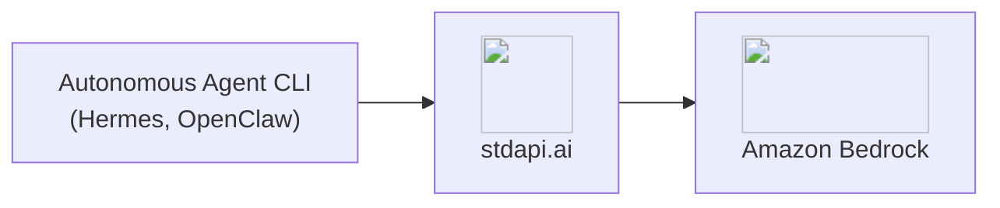
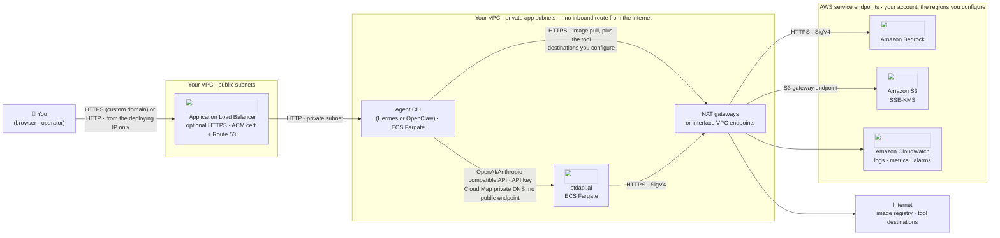
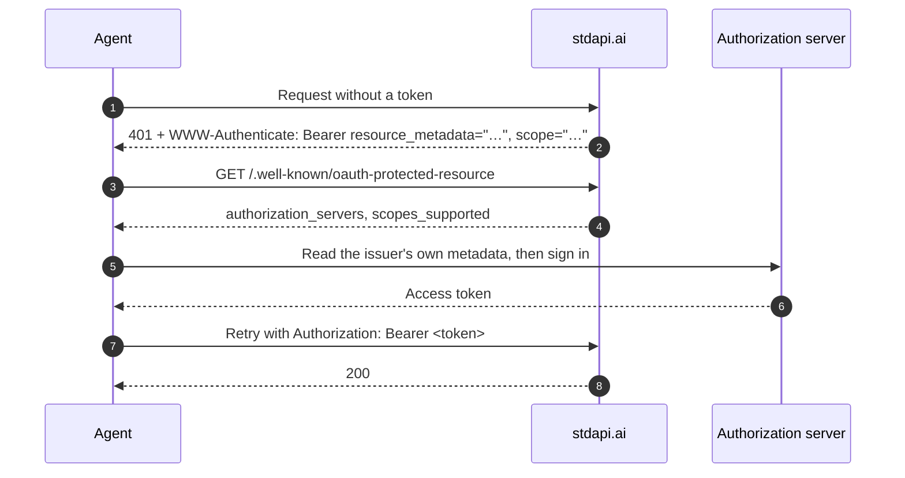

# :material-robot-excited: Autonomous Agent CLIs

Run autonomous agent CLIs against Amazon Bedrock models with stdapi.ai, using the same provider configuration you would point at OpenAI or Anthropic directly—two client-side changes: the base URL, and the model name, which you now pick from every provider in the catalogue rather than one vendor's list.

## :material-information-outline: About Autonomous Agent CLIs

Unlike IDE coding assistants, autonomous agent CLIs plan and execute multi-step tasks on their own—reading files, calling tools, and iterating toward a goal without a human approving each step. They typically run on infrastructure you control (a server, a container, a scheduled job) rather than inside an editor.

**What you can build:**

- **Personal assistants** - Agents that read, search, and act on your behalf from the command line
- **Autonomous research and task loops** - Multi-turn tool-calling sessions that run unattended
- **Self-hosted agent backends** - CLIs wired into cron jobs, CI pipelines, or your own orchestration

## :material-help-circle-outline: Why Autonomous Agent CLIs + stdapi.ai?

<div class="grid cards" markdown>

- :material-swap-horizontal: __No Vendor Lock-In__
  <br>Point the CLI's existing OpenAI- or Anthropic-compatible provider settings at stdapi.ai—no fork, no plugin, no custom integration.

- :material-aws: __Access Amazon Bedrock Models__
  <br>Claude, Nova, DeepSeek, Qwen, and 100+ models, driven through the same agent loop your CLI already runs.

- :material-lock: __No Third-Party AI Cloud__
  <br>Tool calls and model responses are processed by the AWS services you enable, reached through your own deployment — no third-party AI vendor sits in the request path.

- :material-currency-usd-off: __Pay-Per-Use Pricing__
  <br>No per-seat or per-agent licensing. Pay only Amazon Bedrock rates for the calls the agent actually makes.

</div>



## :material-sitemap: Architecture

The diagram below is the shape the [Hermes](https://github.com/stdapi-ai/samples/tree/main/getting_started_hermes) and [OpenClaw](https://github.com/stdapi-ai/samples/tree/main/getting_started_openclaw) Terraform samples share: the agent CLI and the stdapi.ai gateway run as separate ECS Fargate tasks in the same private app subnets, with only the agent's own web surface reachable — through an Application Load Balancer — from outside the VPC. Hermes exposes that ALB as two listeners (gateway API and dashboard); OpenClaw multiplexes both onto one. The diagram collapses either shape into a single listener box.



Two things are worth reading off the picture. stdapi.ai has no listener of its own: the agent reaches it only through AWS Cloud Map private DNS inside the private subnets, so the ALB never forwards to it — only to the agent's own ports. And the agent's egress is a separate path from the gateway's: image pulls and any tool destinations you configure leave as ordinary internet-bound HTTPS, while the gateway's own calls are SigV4-signed and reach AWS service endpoints only. That second path is one of the compensating controls for the sandboxing warning documented under OpenClaw, above — alongside a task dedicated to nothing but this agent, a task role scoped to what it declares, and a private subnet with no inbound route from the internet.

### What Each AWS Service Does Here

| AWS service | Role in this integration | Where it is configured |
| --- | --- | --- |
| **Amazon ECS on AWS Fargate** | Runs the agent CLI and the stdapi.ai gateway as separate tasks, each with its own IAM role | Terraform sample (`module "hermes"`/`module "openclaw"`, `module "stdapi_ai"`) |
| **Elastic Load Balancing** | Public entry point for the agent's own gateway API and dashboard/Control UI; never forwards to stdapi.ai | Terraform sample (`alb.tf`) |
| **AWS Certificate Manager & Amazon Route 53** | Optional TLS certificate and DNS record for the ALB, created only when a custom domain is supplied | Terraform sample (`alb_domain_name`, `alb_route53_zone_name`) |
| **AWS Cloud Map** | Private DNS namespace (`internal`) the agent uses to resolve stdapi.ai without a public endpoint | Terraform sample (`aws_service_discovery_private_dns_namespace "internal"`, `service_discovery_dns_name`) |
| **Amazon Bedrock** | Serves the model calls the agent's chosen wire dialect sends through stdapi.ai | [`AWS_BEDROCK_REGIONS`](operations_configuration.md#aws-bedrock-regions) |
| **Amazon S3** | The gateway's own bucket for generated and temporary files; KMS-encrypted, versioned, lifecycle-managed | Module baseline (`storage.tf`) |
| **AWS KMS** | Customer-managed key encrypting the gateway's S3 bucket; a separate key, created by the ECS module, encrypts the agent's EFS volumes and Fargate ephemeral storage | Terraform module baseline |
| **Amazon EFS** | Persists the agent's own state (config, sessions, workspace) across redeployments. For Hermes it holds *all* state, including every SQLite database, which is why that service runs a single task | Terraform sample (`mount_points` in `hermes.tf`/`openclaw.tf`) |
| **Amazon CloudWatch** | Container logs, gateway request logs, and, when enabled, EMF usage metrics | [Logging & monitoring](operations_logging_monitoring.md) |
| **AWS IAM** | Separate least-privilege task roles per ECS task; the gateway's role grants only the Bedrock/AI-service actions it calls | [IAM permissions](operations_iam_permissions.md) |

### Security Measures in This Flow

- **Credential the agent presents** — in these samples the agent authenticates to the gateway with a generated API key baked into its seeded config file (`config.yaml` for Hermes, `openclaw.json` for OpenClaw); an agent that starts with only a URL instead works out where and how to authenticate through the [OAuth 2.0 protected-resource discovery flow](#bootstrapping-authentication) documented above.
- **Encryption in transit** — HTTPS from the operator's browser to the ALB when a custom domain and ACM certificate are configured, plain HTTP otherwise; plain HTTP from the ALB to the agent container and from the agent to stdapi.ai, both confined to the private subnet; HTTPS with SigV4 from the gateway to Amazon Bedrock.
- **Encryption at rest** — SSE-KMS on the gateway's S3 bucket, and a separate customer-managed key encrypting the EFS volumes that hold the agent's persistent state.
- **Least privilege / task-role scoping** — the agent and the gateway each run under their own ECS task role; the gateway's role carries only the Bedrock/AI-service actions it calls, and the agent's task carries none of it — every model call still goes through the gateway. See [IAM permissions](operations_iam_permissions.md).
- **Content policy** — a [Bedrock guardrail](operations_configuration.md#bedrock-guardrails) configured on the gateway applies to model calls regardless of which wire dialect the agent's provider settings select.
- **Cost / identity attribution** — [per-user cost attribution](operations_cost_management.md#per-user-attribution) turns a caller's declared identity into a billing boundary only under `AUTHENTICATION_MODE=cognito`; the API-key mode these samples use makes that identifier client-declared, so every call from a shared deployment is billed to the gateway's own identity.

## :material-check-circle: Prerequisites

!!! info "What You'll Need"
    - ✓ **stdapi.ai deployed** - [See deployment guide](operations_getting_started.md) or [run locally with Docker](operations_getting_started_local.md)
    - ✓ **Your stdapi.ai URL** - e.g., `https://api.example.com` or `http://localhost:8000` for local
    - ✓ **Your API key** - From Terraform output or configuration (optional for local development)

---

## :material-compass-outline: Bootstrapping Authentication

An agent handed a key in an environment variable is ready to go. An agent handed only a URL is not — and that is the common case for an MCP client, a marketplace agent, or anything a user points at a gateway it has never seen. stdapi.ai answers that case with the standard OAuth 2.0 discovery flow, so the agent works out the rest by itself:



The agent never needs to be told which identity provider you use, where its endpoints are, or which scopes to request — every one of those comes out of step 2 and 4. Enable it by setting [`OAUTH_RESOURCE_IDENTIFIER`](operations_configuration.md#oauth-resource-identifier) and [`OAUTH_AUTHORIZATION_SERVERS`](operations_configuration.md#oauth-authorization-servers) on the deployment.

!!! info "The agent still needs a client identity"
    Discovery tells the agent *where* to authenticate; the authorization server decides *who* may. With an Amazon Cognito user pool, register the agent as an app client in the pool and give it that client ID — Cognito supports neither dynamic client registration nor client-id metadata documents, so it cannot be skipped.

Full walkthrough and the exact document served: [Authentication Discovery for Agents](operations_authentication_security.md#authentication-discovery-for-agents).

!!! tip "An authenticated agent can be billed as itself"
    Once callers arrive with their own identity, [per-user cost attribution](operations_cost_management.md#per-user-attribution) runs each one's model calls under a short-lived role session of their own, and AWS reports their spend separately in Cost Explorer and the Cost and Usage Report — per agent, per tenant or per end user, from the invoice rather than an estimate. Behind a shared API key the same split is available from the identifier the request declares (`safety_identifier`, or `metadata.user_id` on the Messages API), with the caveat that a caller chooses its own: that is cost metadata, not an authorization boundary.

---

## :material-database-search: Giving an Agent Your Own Documents

An agent loop is only as grounded as what it can look up. Two paths reach the same [vector stores](api_openai_vector_stores.md), and neither needs a retrieval feature in the CLI itself:

- **As a tool the model calls** — an agent that composes its own [`/v1/responses`](api_openai_responses.md#file-search) request declares `file_search` with the stores it may read, and the model runs the searches its turn needs and cites the files it answered from.
- **As an MCP tool** — with [MCP](api_overview.md#mcp-model-context-protocol) enabled, `openai_vector_store_search` is one more tool in the agent's list, usable by any MCP client whatever wire format it chats with. This is the path for a CLI that builds its own request bodies — Hermes, below, connects any MCP server this way.

Building the store itself — parsing, chunking, embedding, filters — is covered in the [RAG Pipelines guide](use_cases_rag.md#managed-retrieval); an Amazon Bedrock knowledge base you already run is [addressed as a store too](use_cases_rag.md#knowledge-base).

!!! tip "State the gateway can hold for you"
    An agent that resends its whole history each turn can instead keep the thread server-side with the [Conversations API](api_openai_conversations.md) and continue it by id — useful for long-running or resumable agents, and for handing one session between processes.

---

## :material-robot: Hermes

[Hermes](https://github.com/NousResearch/hermes-agent) (PyPI package `hermes-agent`) is an autonomous agent CLI written in Python.

### :material-cog: Configuration

The simplest setup points Hermes at stdapi.ai through the same environment variables an OpenAI-compatible client would use:

```bash
export OPENAI_API_KEY=YOUR_STDAPI_KEY
export OPENAI_BASE_URL=https://YOUR_STDAPI_URL/v1
```

To select a specific wire format or model, declare a provider in Hermes' `config.yaml` instead:

```yaml
providers:
  stdapi:
    name: stdapi.ai
    api: https://YOUR_STDAPI_URL/v1
    key_env: STDAPI_API_KEY
    transport: chat_completions
    default_model: anthropic.claude-fable-5

model:
  provider: stdapi
  default: anthropic.claude-fable-5
```

`key_env` names the environment variable Hermes reads the API key from—set `STDAPI_API_KEY` (or whatever name you choose) to your stdapi.ai key.

### :material-swap-horizontal: Transport Selection

`transport` is the standout setting: it picks which of stdapi.ai's three chat dialects the provider speaks, and `api` has to match the route serving it:

| `transport` | `api` base URL | API |
|---|---|---|
| `chat_completions` | `https://YOUR_STDAPI_URL/v1` | [Chat Completions](api_openai_chat_completions.md) |
| `codex_responses` | `https://YOUR_STDAPI_URL/v1` | [Responses](api_openai_responses.md) |
| `anthropic_messages` | `https://YOUR_STDAPI_URL/anthropic` | [Anthropic Messages](api_anthropic_messages.md) |

Declare more than one entry under `providers` to reach more than one route side by side.

### :material-cached: Anthropic Prompt-Caching Breakpoints

On the `anthropic_messages` transport, Hermes automatically places [prompt-caching](api_anthropic_messages.md#prompt-caching) breakpoints on the system prompt and recent messages when the target model is Claude-named. Choose the cache lifetime with `prompt_caching.cache_ttl`:

```yaml
prompt_caching:
  cache_ttl: 1h  # or "5m" (the default)
```

Only `5m` and `1h` are accepted—any other value is ignored. This pairs directly with stdapi.ai's own Anthropic Messages prompt-caching support: Hermes' breakpoints arrive as standard `cache_control` markers, which stdapi.ai translates into Bedrock cache points, up to the four the Converse API allows per request.

### :material-rocket-launch: Terraform Deployment

Deploy Hermes + stdapi.ai together on ECS Fargate, with `config.yaml` pre-seeded and ready to run:

**📦 [stdapi-ai/samples/getting_started_hermes](https://github.com/stdapi-ai/samples/tree/main/getting_started_hermes)**

**What's included:**

- Hermes gateway API and web dashboard on ECS Fargate, each behind its own generated credential
- stdapi.ai gateway connected to Amazon Bedrock, registered as a custom OpenAI-compatible provider
- `config.yaml` seeded with the stdapi.ai URL and API key already filled in, and re-seeded whenever the rendered template changes — so a model or key changed in Terraform reaches the deployment, at the cost of overwriting edits made in the dashboard
- Persistent state (config, sessions, memories, skills) on EFS, so it survives redeployments
- **Exactly one task**, because every one of those stores is SQLite with no external backend ([upstream #38185](https://github.com/NousResearch/hermes-agent/issues/38185)). Recovery is a Fargate reschedule, with no failover — see *Single instance by design* in the sample's README
- No local image build — the public `nousresearch/hermes-agent` image is pulled anonymously by Fargate
- ECS Exec enabled for shelling into the container or driving Hermes' interactive CLI directly

!!! warning "Local ECS module source"
    `module "hermes"` currently points at a local relative path (`../../../terraform-aws-ecs`) instead of the published registry module, because it needs S3 Files mount-point support (used to seed `config.yaml`) that isn't in a tagged release yet. Cloning only the samples repository is not enough for `tofu init` to resolve it — see the sample's README for the sibling-checkout layout it currently requires.

**Deploy:**

```bash
git clone https://github.com/stdapi-ai/samples.git
cd samples/getting_started_hermes/terraform
tofu init
tofu apply
```

---

## :material-account-cog: OpenClaw

[OpenClaw](https://github.com/openclaw/openclaw) is a personal-assistant CLI (npm package `openclaw`) that also writes code as part of a task. Custom endpoints are registered through its onboarding wizard, not through the `agent` command itself:

```bash
openclaw onboard \
  --custom-provider-id stdapi \
  --custom-base-url https://YOUR_STDAPI_URL/v1 \
  --custom-model-id anthropic.claude-fable-5 \
  --custom-compatibility openai \
  --custom-api-key YOUR_STDAPI_API_KEY
```

Omit `--custom-api-key` to read the key from `CUSTOM_API_KEY` in the environment instead. Then run the agent with the model qualified by the provider id:

```bash
openclaw agent --model stdapi/anthropic.claude-fable-5
```

`--custom-compatibility` is the standout setting here: one flag picks which of stdapi.ai's three chat dialects OpenClaw speaks, and `--custom-base-url` has to match the route serving it:

| `--custom-compatibility` | `--custom-base-url` | API |
|---|---|---|
| `openai` | `https://YOUR_STDAPI_URL/v1` | [Chat Completions](api_openai_chat_completions.md) |
| `openai-responses` | `https://YOUR_STDAPI_URL/v1` | [Responses](api_openai_responses.md) |
| `anthropic` | `https://YOUR_STDAPI_URL/anthropic` | [Anthropic Messages](api_anthropic_messages.md) |

Re-run `openclaw onboard` with a different `--custom-provider-id` to register more than one route side by side.

### :material-rocket-launch: Terraform Deployment

Deploy OpenClaw + stdapi.ai together on ECS Fargate, with the provider and default model preconfigured:

**📦 [stdapi-ai/samples/getting_started_openclaw](https://github.com/stdapi-ai/samples/tree/main/getting_started_openclaw)**

**What's included:**

- OpenClaw gateway and Control UI on ECS Fargate, authenticated with a generated token
- stdapi.ai gateway connected to Amazon Bedrock, registered as a custom OpenAI-compatible provider (`api: "openai-completions"`)
- `openclaw.json` seeded on first boot with the provider and default model already filled in
- Persistent config, auth material, and workspace on EFS
- No local image build — the public `ghcr.io/openclaw/openclaw` image is pulled anonymously by Fargate

!!! warning "Agent sandboxing is off"
    OpenClaw can run agent tool calls inside a nested sandbox, but Fargate exposes none of the backends that requires (most commonly a host Docker socket), so this sample sets `agents.defaults.sandbox.mode` to `"off"`. Tool calls therefore run directly inside the container itself, with only the container's own boundary as isolation. Do not point this deployment at an agent workload you would not trust to run arbitrary commands there.

!!! warning "Device pairing stays manual"
    OpenClaw's Control UI requires pairing a browser device before use, done through a few `aws ecs execute-command` calls after deployment — see the sample's README for the exact commands. This is not automated by Terraform.

!!! warning "Local ECS module source"
    `module "openclaw"` currently points at a local relative path (`../../../terraform-aws-ecs`) instead of the published registry module, because it needs S3 Files mount-point support (used to seed `openclaw.json`) that isn't in a tagged release yet. Cloning only the samples repository is not enough for `tofu init` to resolve it — see the sample's README for the sibling-checkout layout it currently requires.

**Deploy:**

```bash
git clone https://github.com/stdapi-ai/samples.git
cd samples/getting_started_openclaw/terraform
tofu init
tofu apply
```

---

## :material-gauge: Operating This Integration

### What It Costs to Run

| Charge | Driver |
| --- | --- |
| stdapi.ai licence | $0.10 per gateway container-hour, metered through AWS Marketplace, with a 14-day free trial on the licence |
| ECS Fargate | Two services — the agent CLI and the gateway — each sized independently; the agent's task also runs a short-lived init container on every deployment |
| Load balancing and networking | One ALB fronting the agent's own web surface, plus the NAT gateways the private subnets egress through |
| Amazon EFS | Standing storage and throughput cost for the agent's persistent state |
| Amazon Bedrock usage | AWS rates, billed to your account with no markup — for a long agent loop, how much of each turn's context is served from a cache read rather than fresh input is the dominant lever; see [Anthropic Prompt-Caching Breakpoints](#anthropic-prompt-caching-breakpoints), above |

Read a model's price before sending anything to it with [`GET /model_pricing`](api_model_pricing.md). Setting [`COST_TRACKING=true`](operations_cost_management.md#cost-tracking-real-time-aws-pricing) additionally puts a per-request cost on each usage entry — estimated from published AWS prices, not read back from your invoice.

### What to Watch

Both containers log to CloudWatch: the agent CLI writes its own container logs, and the gateway writes one structured `request` event (or `request_stream` for streamed replies) per call, carrying the request id, path, status code, `execution_time_ms`, and a nested `usage` list with the token counts AWS billed — including `cached_tokens` (cache reads) and `cache_write_tokens` on each entry. Turning on [`CLOUDWATCH_METRICS`](operations_logging_monitoring.md#cloudwatch-metrics-emf) republishes those counts as EMF metrics in the `stdapi` namespace, dimensioned by `Model`.

An agent loop that resends its history every turn should, once the session warms up, read far more input tokens from cache than it pays for fresh. The EMF lines carry each quantity as its own metric field, so the two are directly comparable per model:

```sql
fields Model, InputTokens, CachedTokens, CacheWriteTokens
| filter _aws.CloudWatchMetrics is not null
| stats sum(CachedTokens) as cache_reads, sum(InputTokens) as fresh_input, sum(CacheWriteTokens) as cache_writes by Model
| sort cache_reads desc
```

A model whose `cache_reads` stay near zero mid-session points at breakpoints that are not landing — check that the agent is actually sending `cache_control` markers before assuming the model itself is at fault.

---

## :material-arrow-right: Next Steps

<div class="grid cards" markdown>

- :material-rocket-launch: [**Getting Started**](operations_getting_started.md) — Deploy stdapi.ai to AWS with Terraform
- :material-docker: [**Local Development**](operations_getting_started_local.md) — Run stdapi.ai locally with Docker
- :material-language-python: [**Python Client Libraries**](use_cases_python_libraries.md) — Configuring LangChain, pydantic-ai and the OpenAI Agents SDK directly against stdapi.ai
- :material-puzzle: [**More Use Cases**](use_cases.md) — Explore other integrations and tools

</div>
