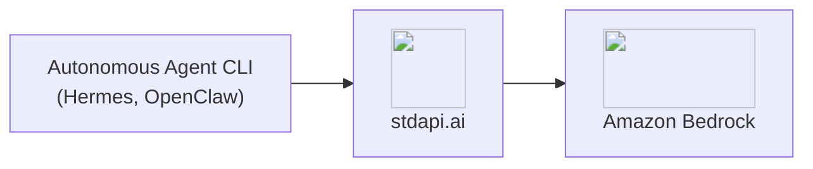

# :material-robot-excited: Autonomous Agent CLIs

Run autonomous agent CLIs against Amazon Bedrock models with stdapi.ai, using the same provider configuration you would point at OpenAI or Anthropic directly—only the base URL changes.

## :material-information-outline: About Autonomous Agent CLIs

Unlike IDE coding assistants, autonomous agent CLIs plan and execute multi-step tasks on their own—reading files, calling tools, and iterating toward a goal without a human approving each step. They typically run on infrastructure you control (a server, a container, a scheduled job) rather than inside an editor.

**What you can build:**

- **Personal assistants** - Agents that read, search, and act on your behalf from the command line
- **Autonomous research and task loops** - Multi-turn tool-calling sessions that run unattended
- **Self-hosted agent backends** - CLIs wired into cron jobs, CI pipelines, or your own orchestration

## :material-help-circle-outline: Why Autonomous Agent CLIs + stdapi.ai?

<div class="grid cards" markdown>

- :material-swap-horizontal: __No Vendor Lock-In__
  <br>Point the CLI's existing OpenAI- or Anthropic-compatible provider settings at stdapi.ai—no fork, no plugin, no custom integration.

- :material-aws: __Access Amazon Bedrock Models__
  <br>Claude, Nova, DeepSeek, Qwen, and 100+ models, driven through the same agent loop your CLI already runs.

- :material-lock: __Data Stays in Your AWS Account__
  <br>Every tool call and model response is processed inside your own Bedrock deployment, never shared with a third-party AI cloud.

- :material-currency-usd-off: __Pay-Per-Use Pricing__
  <br>No per-seat or per-agent licensing. Pay only Amazon Bedrock rates for the calls the agent actually makes.

</div>



## :material-check-circle: Prerequisites

!!! info "What You'll Need"
    - ✓ **stdapi.ai deployed** - [See deployment guide](operations_getting_started.md) or [run locally with Docker](operations_getting_started_local.md)
    - ✓ **Your stdapi.ai URL** - e.g., `https://api.example.com` or `http://localhost:8000` for local
    - ✓ **Your API key** - From Terraform output or configuration (optional for local development)

---

## :material-robot: Hermes

[Hermes](https://github.com/NousResearch/hermes-agent) (PyPI package `hermes-agent`) is an autonomous agent CLI written in Python.

### :material-cog: Configuration

The simplest setup points Hermes at stdapi.ai through the same environment variables an OpenAI-compatible client would use:

```bash
export OPENAI_API_KEY=YOUR_STDAPI_KEY
export OPENAI_BASE_URL=https://YOUR_STDAPI_URL/v1
```

To select a specific wire format or model, declare a provider in Hermes' `config.yaml` instead:

```yaml
providers:
  stdapi:
    name: stdapi.ai
    api: https://YOUR_STDAPI_URL/v1
    key_env: STDAPI_API_KEY
    transport: chat_completions
    default_model: anthropic.claude-fable-5

model:
  provider: stdapi
  model: anthropic.claude-fable-5
```

`key_env` names the environment variable Hermes reads the API key from—set `STDAPI_API_KEY` (or whatever name you choose) to your stdapi.ai key.

### :material-swap-horizontal: Transport Selection

`transport` is the standout setting: it picks which of stdapi.ai's three chat dialects the provider speaks, and `api` has to match the route serving it:

| `transport` | `api` base URL | API |
|---|---|---|
| `chat_completions` | `https://YOUR_STDAPI_URL/v1` | [Chat Completions](api_openai_chat_completions.md) |
| `codex_responses` | `https://YOUR_STDAPI_URL/v1` | [Responses](api_openai_responses.md) |
| `anthropic_messages` | `https://YOUR_STDAPI_URL/anthropic` | [Anthropic Messages](api_anthropic_messages.md) |

Declare more than one entry under `providers` to reach more than one route side by side.

### :material-cached: Anthropic Prompt-Caching Breakpoints

On the `anthropic_messages` transport, Hermes automatically places [prompt-caching](api_anthropic_messages.md#prompt-caching) breakpoints on the system prompt and recent messages when the target model is Claude-named. Choose the cache lifetime with `prompt_caching.cache_ttl`:

```yaml
prompt_caching:
  cache_ttl: 1h  # or "5m" (the default)
```

Only `5m` and `1h` are accepted—any other value is ignored. This pairs directly with stdapi.ai's own Anthropic Messages prompt-caching support: Hermes' breakpoints arrive as standard `cache_control` markers, which stdapi.ai forwards to Bedrock unchanged.

---

## :material-account-cog: OpenClaw

[OpenClaw](https://github.com/openclaw/openclaw) doubles as a personal-assistant CLI and a coding agent. Its stdapi.ai configuration—onboarding wizard, the `--custom-compatibility` wire-format switch, and model selection—is documented once, in the [AI Coding Assistants guide](use_cases_coding_assistants.md#configuration), and applies the same way whether OpenClaw is driving a coding task or a general assistant task.

---

## :material-arrow-right: Next Steps

<div class="grid cards" markdown>

- :material-rocket-launch: [**Getting Started**](operations_getting_started.md) — Deploy stdapi.ai to AWS with Terraform
- :material-docker: [**Local Development**](operations_getting_started_local.md) — Run stdapi.ai locally with Docker
- :material-language-python: [**Python Client Libraries**](use_cases_python_libraries.md) — Configuring LangChain and pydantic-ai directly against stdapi.ai
- :material-puzzle: [**More Use Cases**](use_cases.md) — Explore other integrations and tools

</div>
