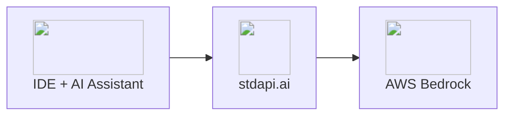

# :material-code-braces: AI Coding Assistants Integration

Connect your favorite AI coding assistants to AWS Bedrock models through stdapi.ai. Get intelligent code completions, chat assistance, and codebase understanding with powerful AWS models like Claude, Kimi K2 thinking, and Qwen Coder Next—no vendor lock-in required.

## :material-information-outline: About AI Coding Assistants

AI coding assistants are IDE extensions and terminal tools that leverage large language models to enhance developer productivity. These tools provide real-time code completions, intelligent suggestions, natural language code generation, and interactive chat capabilities directly within your coding environment—acting as AI pair programmers that understand your codebase context.

**What AI coding assistants can do:**

- **Real-time completions** - Autocomplete code as you type with context awareness
- **Interactive chat** - Ask questions about your codebase, get explanations
- **Code generation** - Natural language to code conversion
- **Refactoring** - Intelligent code improvements and optimization suggestions
- **Documentation** - Auto-generate comments, docstrings, and READMEs
- **Testing** - Create unit tests, debug issues, suggest fixes
- **Git integration** - Generate commit messages, review diffs
- **Multi-language** - Support for Python, JavaScript, TypeScript, Go, Rust, Java, and more

## :material-help-circle-outline: Why AI Coding Assistants + stdapi.ai?

<div class="grid cards" markdown>

- :material-puzzle: __Works with Your IDE__
  <br>Almost any coding assistant that supports OpenAI or Anthropic compatible APIs works with stdapi.ai. Continue.dev, Cursor, Cline, Claude Code, Windsurf, Aider—all compatible with AWS Bedrock models.

- :material-brain: __Best-in-Class Coding Models__
  <br>Claude 4.6+ for reasoning and architecture, Kimi K2 thinking for complex problem-solving, Qwen Coder Next for specialized coding tasks. Choose the right model for each task.

- :material-lock: __Code Privacy Guaranteed__
  <br>Your code never leaves your AWS account. Perfect for proprietary codebases, enterprise security requirements, or compliance-sensitive projects.

- :material-server-network: __Flexible Deployment Options__
  <br>Run stdapi.ai in AWS for production or locally with Docker for development. Test locally, deploy to cloud—same API, same experience.

- :material-currency-usd-off: __Pay-Per-Use, No Subscriptions__
  <br>No per-developer licenses or monthly subscriptions. Pay only AWS Bedrock rates for actual usage. Use powerful models without per-seat costs.

</div>



## :material-check-circle: Prerequisites

!!! info "What You'll Need"
    - ✓ **stdapi.ai deployed** - [See deployment guide](operations_getting_started.md) or [run locally with Docker](operations_getting_started_local.md)
    - ✓ **Your stdapi.ai URL** - e.g., `https://api.example.com` or `http://localhost:8000` for local
    - ✓ **Your API key** - From Terraform output or configuration (optional for local development)
    - ✓ **IDE with AI assistant** - VS Code, JetBrains, Cursor, or your preferred editor with an AI coding extension

---

## { style="height: 1.2em; vertical-align: text-bottom;" } OpenAI-Compatible Coding Assistants

**Popular Tools:** [Cline](https://github.com/cline/cline) | [JetBrains AI Assistant](https://www.jetbrains.com/ai/) | [Continue.dev](https://continue.dev/) | [Cursor](https://cursor.com/) | [Windsurf](https://codeium.com/windsurf)

Most IDE coding assistants use the OpenAI-compatible API. Configure them by pointing to stdapi.ai's `/v1` endpoint.

### :material-cog: Configuration

Most AI coding assistants follow a similar configuration pattern. The exact menu location and field names may vary, but the core settings remain consistent.

!!! example "Generic Configuration Steps"
    **In your coding assistant settings:**

    1. Navigate to **Settings** or **Preferences**
    2. Find the **AI Provider** or **Model Provider** section
    3. Select **"OpenAI Compatible"** or **"Custom OpenAI"** as the provider type
    4. Configure the connection:
        ```
        API Base URL: https://YOUR_STDAPI_URL/v1
        (or sometimes just: https://YOUR_STDAPI_URL)

        API Key: YOUR_STDAPI_KEY

        Model: anthropic.claude-opus-4-6-v1
        (or select from detected models if available)
        ```

!!! tip "Model Selection for Coding"
    **Recommended models for different tasks:**

    - **Advanced reasoning & architecture**: `anthropic.claude-opus-4-6-v1`
    - **Complex problem-solving**: Kimi K2 thinking models
    - **Specialized coding tasks**: `qwen2-coder-next-1-5-instruct-v1:0` (Qwen Coder Next)
    - **Fast completions**: Amazon Nova Micro or Nova Lite

    **Configuration tips:**

    - **Auto-detect**: Some assistants query `/v1/models` and show a dropdown
    - **Manual entry**: Use full Bedrock model ID (e.g., `anthropic.claude-opus-4-6-v1`)
    - **Multi-model setup**: Use fast, cheap models for secondary tasks (autocomplete, summaries) and powerful models for complex generation

### :material-chat-outline: Chat Completions

All coding assistants use chat completions for interactive conversations, code generation, and explanations.

!!! example "How It Works"
    Your coding assistant calls `POST /v1/chat/completions` (see [Chat Completions API](api_openai_chat_completions.md)) to:

    - Answer questions about your code
    - Generate new code from natural language
    - Explain complex functions or algorithms
    - Suggest refactoring and improvements
    - Debug issues and propose fixes

    The model must be a text/chat-capable model from the correct family for your Bedrock region.

### :material-tools: Tool Calling Support

stdapi.ai fully supports tool calling (function calling) through the chat completions API, which is essential for autonomous and efficient coding agents.

!!! success "Advanced Agent Capabilities"
    **Tool calling enables your coding assistant to:**

    - Execute terminal commands and see results
    - Read and write files in your codebase
    - Search through code and documentation
    - Run tests and analyze output
    - Interact with external APIs and services

    Most modern autonomous agents like Cline or Junie rely heavily on tool calling to perform complex, multi-step coding tasks. stdapi.ai's tool calling support (see [Chat Completions API - Tool Calling](api_openai_chat_completions.md#feature-compatibility)) ensures these agents can work at their full potential with Amazon Bedrock models.

### :material-lightning-bolt: Code Completions

Some coding assistants support dedicated code completion endpoints for real-time suggestions as you type.

!!! example "Completion Support"
    Advanced assistants may call `POST /v1/completions` for:

    - Inline code suggestions
    - Auto-completion while typing
    - Context-aware code snippets

    Not all models or assistants support this mode. Chat-based assistants handle completions through the chat API instead.

---

## { style="height: 1.2em; vertical-align: text-bottom;" } Anthropic-Compatible Coding Assistants

**Popular Tools:** [Claude Code](https://docs.anthropic.com/en/docs/claude-code/overview) | [Aider](https://aider.chat/) | [JetBrains AI Assistant (With Claude code ACP)](https://www.jetbrains.com/ai/)

Tools that use the Anthropic messages API natively can be connected to stdapi.ai's `/anthropic` endpoint, enabling them to use Claude models via AWS Bedrock.

### Claude Code

Claude Code is Anthropic's agentic coding tool that runs in the terminal.

#### :material-cog: Configuration

Create or edit `~/.claude/claude.json`:

```json
{
  "env": {
    "ANTHROPIC_AUTH_TOKEN": "YOUR_API_KEY",
    "ANTHROPIC_BASE_URL": "https://YOUR_STDAPI_URL/anthropic",
    "ANTHROPIC_DEFAULT_OPUS_MODEL": "anthropic.claude-opus-4-6-v1",
    "ANTHROPIC_DEFAULT_SONNET_MODEL": "anthropic.claude-sonnet-4-6",
    "ANTHROPIC_DEFAULT_HAIKU_MODEL": "anthropic.claude-haiku-4-5-20251001-v1:0"
  }
}
```

- Replace `YOUR_STDAPI_URL` with your stdapi.ai deployment URL (e.g., `https://api.example.com` or `http://localhost:8000` for local)
- Replace `YOUR_API_KEY` with your stdapi.ai API key
- The `/anthropic` path prefix is configured via the [`ANTHROPIC_ROUTES_PREFIX`](operations_configuration.md#anthropic-routes-prefix) setting (default: `/anthropic`)
- The `ANTHROPIC_DEFAULT_*_MODEL` variables pin each model tier to a specific Bedrock model ID — recommended for production stability. Without them, Claude Code resolves aliases (`opus`, `sonnet`, `haiku`) which may change when Anthropic releases new versions. stdapi.ai also accepts the short alias names (e.g. `claude-sonnet-4-6`) as a convenience.

!!! tip "Beta Flag Compatibility"
    stdapi.ai automatically filters unsupported `anthropic_beta` flags, so Claude Code works without needing `CLAUDE_CODE_DISABLE_EXPERIMENTAL_BETAS=1`. Bedrock-supported flags (like `Interleaved-thinking-2025-05-14` and `token-efficient-tools-2025-02-19`) are preserved while unsupported ones are silently removed. See [`ANTHROPIC_BETA_FILTER`](operations_configuration.md#anthropic-beta-filter) and [`ANTHROPIC_BETA_ALLOWLIST`](operations_configuration.md#anthropic-beta-allowlist) for details.

#### :material-brain: Effort-Based Reasoning

Claude Code supports [effort levels](https://code.claude.com/docs/en/model-config#adjust-effort-level) that control how much reasoning the model applies — lower effort is faster and cheaper; higher effort provides deeper thinking for complex tasks.

**Supported models via stdapi.ai:**

| Model | Effort levels | Notes |
|---|---|---|
| Claude Sonnet 4.6 / Opus 4.6 | `low` `medium` `high` `max` | Full adaptive reasoning; `max` is Opus-only |
| Amazon Nova 2 | `low` `medium` `high` | Maps to `maxReasoningEffort` in Bedrock |
| DeepSeek V3 | `low` `medium` `high` | Passed as a string literal to Bedrock |

**Setting effort level:**

```bash
# Per session at launch
claude --model sonnet --effort high

# Persist across sessions (env var takes precedence over all other settings)
export CLAUDE_CODE_EFFORT_LEVEL=high

# Or add to claude.json
```

```json
{
  "effortLevel": "medium"
}
```

During a session, use `/effort low`, `/effort medium`, `/effort high`, or `/effort max` to change levels on the fly.

#### :material-key: Declaring Model Capabilities

When you pin a non-Claude Bedrock model ID, Claude Code may not recognize it and will silently disable effort and thinking features. Use `ANTHROPIC_DEFAULT_*_MODEL_SUPPORTED_CAPABILITIES` to declare what the model actually supports:

| Capability value | Enables |
|---|---|
| `effort` | Effort levels and the `/effort` command |
| `max_effort` | The `max` effort level (Opus 4.6 only) |
| `thinking` | Extended thinking blocks |
| `adaptive_thinking` | Dynamic token budget allocation |
| `interleaved_thinking` | Thinking between tool calls |

**Example — Nova 2 with effort enabled:**

```json
{
  "env": {
    "ANTHROPIC_AUTH_TOKEN": "YOUR_API_KEY",
    "ANTHROPIC_BASE_URL": "https://YOUR_STDAPI_URL/anthropic",
    "ANTHROPIC_DEFAULT_SONNET_MODEL": "amazon.nova-2-lite-v1:0",
    "ANTHROPIC_DEFAULT_SONNET_MODEL_NAME": "Nova 2 Lite",
    "ANTHROPIC_DEFAULT_SONNET_MODEL_SUPPORTED_CAPABILITIES": "effort",
    "DISABLE_PROMPT_CACHING": "1"
  }
}
```

**Example — Claude with full capabilities declared (e.g. for a Bedrock ARN or inference profile):**

```json
{
  "env": {
    "ANTHROPIC_DEFAULT_OPUS_MODEL": "arn:aws:bedrock:us-east-1:123456789012:application-inference-profile/my-opus",
    "ANTHROPIC_DEFAULT_OPUS_MODEL_NAME": "Opus via Bedrock",
    "ANTHROPIC_DEFAULT_OPUS_MODEL_SUPPORTED_CAPABILITIES": "effort,max_effort,thinking,adaptive_thinking,interleaved_thinking"
  }
}
```

#### :material-robot: Using Non-Claude Models

Claude Code is optimized for Claude models and enables reasoning by default. When routing non-Claude models through stdapi.ai, this can cause API errors if the model does not support reasoning parameters. Configure based on the model's capabilities:

!!! warning "Reasoning Enabled by Default"
    Claude Code sends reasoning parameters to the model by default. If the model does not support them, this causes an API error. Always configure reasoning support explicitly when using non-Claude models.

**Models with effort support** (Nova 2, DeepSeek V3) — declare `effort` capability:

```json
{
  "env": {
    "ANTHROPIC_DEFAULT_SONNET_MODEL": "amazon.nova-2-lite-v1:0",
    "ANTHROPIC_DEFAULT_SONNET_MODEL_SUPPORTED_CAPABILITIES": "effort",
    "DISABLE_PROMPT_CACHING": "1"
  }
}
```

**Models without reasoning support** (Qwen, Kimi K2, Mistral, etc.) — disable all Claude-specific features:

```json
{
  "env": {
    "ANTHROPIC_DEFAULT_SONNET_MODEL": "moonshot.kimi-k2-instruct",
    "DISABLE_PROMPT_CACHING": "1",
    "MAX_THINKING_TOKENS": "0"
  }
}
```

!!! warning "`MAX_THINKING_TOKENS=0` disables all reasoning"
    Setting `MAX_THINKING_TOKENS=0` disables **all** reasoning — including effort-mode thinking. Do **not** use it alongside `effort` capability; it suppresses the model's reasoning even when effort is declared.

Common configuration issues with non-Claude models:

- **Prompt caching** — Claude Code sends `cache_control` headers that can cause errors on models that handle caching differently. Set `DISABLE_PROMPT_CACHING=1` to suppress them.
- **Extended thinking** — Claude Code enables reasoning by default. For models without any reasoning support, set `MAX_THINKING_TOKENS=0` to disable it entirely.

#### :material-format-list-bulleted: Adding a Model to the Picker

Use `ANTHROPIC_CUSTOM_MODEL_OPTION` to add a single custom entry to the `/model` picker without replacing the built-in aliases. Useful for testing a specific Bedrock model ID alongside the standard Claude tiers:

```json
{
  "env": {
    "ANTHROPIC_CUSTOM_MODEL_OPTION": "moonshot.kimi-k2-instruct",
    "ANTHROPIC_CUSTOM_MODEL_OPTION_NAME": "Kimi K2",
    "ANTHROPIC_CUSTOM_MODEL_OPTION_DESCRIPTION": "Moonshot Kimi K2 via stdapi.ai"
  }
}
```

Claude Code skips validation for this model ID, so any Bedrock model ID accepted by stdapi.ai works here.

### Other Anthropic-Compatible Tools

Any tool using the Anthropic SDK or messages API can be configured the same way—set the `ANTHROPIC_BASE_URL` to `https://YOUR_STDAPI_URL/anthropic` and `ANTHROPIC_API_KEY` (or equivalent) to your stdapi.ai API key.

---

## :material-docker: Running stdapi.ai Locally

stdapi.ai works well when running locally with Docker, making it ideal for your development environment.

!!! tip "Running Locally"
    For complete local deployment instructions, see the [Local Development Guide](operations_getting_started_local.md).

    **OpenAI-compatible tools:**
    ```
    API Base URL: http://localhost:8000/v1
    API Key: your_stdapi_key
    ```

    **Anthropic-compatible tools:**
    ```
    ANTHROPIC_BASE_URL: http://localhost:8000/anthropic
    ANTHROPIC_AUTH_TOKEN: your_stdapi_key
    ```

---

## :material-arrow-right: Next Steps

<div class="grid cards" markdown>

- :material-rocket-launch: [**Getting Started**](operations_getting_started.md) — Deploy stdapi.ai to AWS with Terraform
- :material-docker: [**Local Development**](operations_getting_started_local.md) — Run stdapi.ai locally with Docker
- :material-puzzle: [**More Use Cases**](use_cases.md) — Explore other integrations and tools
- :material-cog: [**Configuration Reference**](operations_configuration.md) — Complete list of environment variables

</div>
