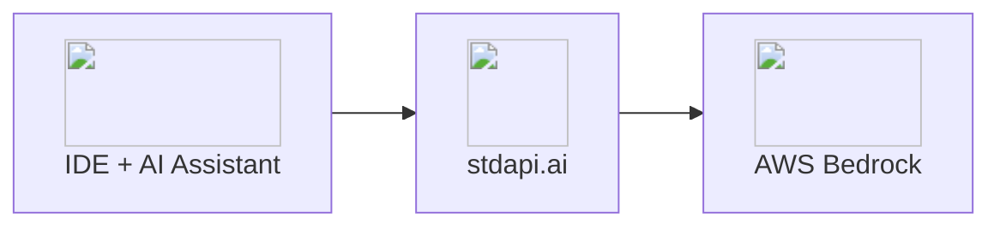

# AI Coding Assistants Integration

Connect your favorite AI coding assistants to Amazon Bedrock models through stdapi.ai's OpenAI-compatible interface. Get intelligent code completions, chat assistance, and codebase understanding with powerful AWS models—no vendor lock-in required.

## About AI Coding Assistants

**Popular Tools:** [Cline](https://github.com/cline/cline) | [JetBrains AI Assistant](https://www.jetbrains.com/ai/) | [Continue.dev](https://continue.dev/) | [Cursor](https://cursor.com/) | [Windsurf](https://codeium.com/windsurf)

AI coding assistants are integrated development environment (IDE) tools that leverage large language models to enhance developer productivity. These assistants provide real-time code completions, intelligent suggestions, natural language code generation, and interactive chat capabilities directly within your coding environment. Whether you're working in VS Code, JetBrains IDEs, or other popular editors, AI coding assistants act as pair programmers that understand your codebase context, help debug issues, explain complex code, and accelerate development workflows while you maintain full control over your development environment.

**Key Features:**

- Real-time code completions and suggestions
- Interactive chat with codebase context
- Code explanation and documentation generation
- Refactoring and optimization suggestions
- Automated git commit message generation
- Unit test creation and debugging assistance
- Code review and security analysis
- Multi-language support across popular programming languages
- IDE integration for seamless workflow

## Why AI Coding Assistants + stdapi.ai?

<div class="grid cards" markdown>

- :material-puzzle: __Universal Compatibility__
  <br>Almost any coding assistant that supports OpenAI-compatible APIs works with stdapi.ai. Use your preferred IDE and tools with Amazon Bedrock models—no vendor lock-in.

- :material-brain: __Superior Models__
  <br>Access Claude for advanced reasoning and coding, Nova for fast completions, and other specialized models. Switch between models based on your task without changing tools.

- :material-server-network: __Flexible Deployment__
  <br>Run stdapi.ai in AWS or locally with Docker. Perfect for development environments where you need local testing or air-gapped setups.

- :material-lock: __Privacy & Control__
  <br>Keep your code private in your AWS environment or local machine. No third-party cloud services, no data leaving your infrastructure.

</div>



## ✅ Prerequisites

!!! info "What You'll Need"
    - ✓ An IDE with AI assistant support (VS Code, JetBrains, Cursor, etc.)
    - ✓ Your stdapi.ai server URL (e.g., `https://api.example.com`)
    - ✓ Your stdapi.ai server API key

---

## ⚙️ Configuration

### 🔑 Universal Setup Guide

Most AI coding assistants follow a similar configuration pattern. The exact menu location and field names may vary, but the core settings remain consistent.

!!! example "Generic Configuration Steps"
    **In your coding assistant settings:**

    1. Navigate to **Settings** or **Preferences**
    2. Find the **AI Provider** or **Model Provider** section
    3. Select **"OpenAI Compatible"** or **"Custom OpenAI"** as the provider type
    4. Configure the connection:
        ```
        API Base URL: https://YOUR_STDAPI_URL/v1
        (or sometimes just: https://YOUR_STDAPI_URL)

        API Key: YOUR_STDAPI_KEY

        Model: anthropic.claude-sonnet-4-5-20250929-v1:0
        (or select from detected models if available)
        ```

!!! tip "Model Selection"
    - **Auto-detect models**: Some assistants can query the `/v1/models` endpoint and show you a list of available models. Simply select your preferred model from the dropdown.
    - **Manual entry**: Other assistants require you to type the exact model ID. Use the full Bedrock model ID like `anthropic.claude-sonnet-4-5-20250929-v1:0`.
    - **Multiple model configuration**: Some agents allow configuring different models for different tasks (e.g., one for chat, another for completions). In this case, consider using fast and cheap models for secondary tasks instead of powerful ones to optimize costs and latency.
    - **Available models**: Many code-efficient models are available including Claude Sonnet, Claude Opus, Qwen Coder, and more.

### 💬 Chat Completions

All coding assistants use chat completions for interactive conversations, code generation, and explanations.

!!! example "How It Works"
    Your coding assistant calls `POST /v1/chat/completions` (see [Chat Completions API](api_openai_chat_completions.md)) to:

    - Answer questions about your code
    - Generate new code from natural language
    - Explain complex functions or algorithms
    - Suggest refactoring and improvements
    - Debug issues and propose fixes

    The model must be a text/chat-capable model from the correct family for your Bedrock region.

### 🛠️ Tool Calling Support

stdapi.ai fully supports tool calling (function calling) through the chat completions API, which is essential for autonomous and efficient coding agents.

!!! success "Advanced Agent Capabilities"
    **Tool calling enables your coding assistant to:**

    - Execute terminal commands and see results
    - Read and write files in your codebase
    - Search through code and documentation
    - Run tests and analyze output
    - Interact with external APIs and services

    Most modern autonomous agents like Cline or Junie rely heavily on tool calling to perform complex, multi-step coding tasks. stdapi.ai's tool calling support (see [Chat Completions API - Tool Calling](api_openai_chat_completions.md#feature-compatibility)) ensures these agents can work at their full potential with Amazon Bedrock models.

### ⚡ Code Completions

Some coding assistants support dedicated code completion endpoints for real-time suggestions as you type.

!!! example "Completion Support"
    Advanced assistants may call `POST /v1/completions` for:

    - Inline code suggestions
    - Auto-completion while typing
    - Context-aware code snippets

    Not all models or assistants support this mode. Chat-based assistants handle completions through the chat API instead.

---

## 🐳 Running stdapi.ai Locally

stdapi.ai works well when running locally with Docker, making it ideal for your development environment.

!!! tip "Running Locally"
    For complete local deployment instructions, see the [Getting Started Guide](operations_getting_started.md).

    **Configure your coding assistant:**
    ```
    API Base URL: http://localhost:8000/v1
    API Key: your_stdapi_key
    ```

    The URL will likely be `http://localhost:8000/v1` depending on your Docker port configuration.

---
