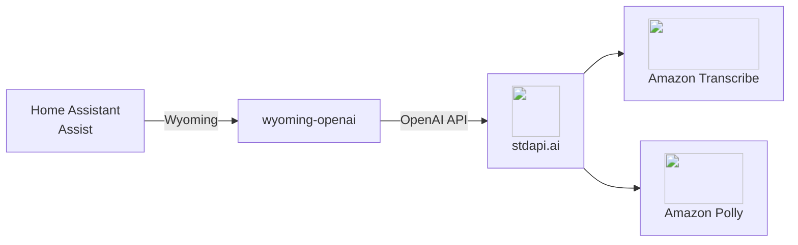

# :material-microphone-message: Home Assistant Voice Integration

Give Home Assistant's Assist voice pipeline speech-to-text and text-to-speech backed by Amazon Transcribe and Amazon Polly, through stdapi.ai's OpenAI-compatible audio routes.

## :material-information-outline: About Home Assistant Assist and Wyoming

**🔗 Links:** [Home Assistant Assist](https://www.home-assistant.io/voice_control/) | [wyoming-openai](https://github.com/roryeckel/wyoming_openai) | [Wyoming protocol](https://github.com/OHF-Voice/wyoming)

Home Assistant's Assist voice pipeline speaks [Wyoming](https://github.com/OHF-Voice/wyoming), a lightweight protocol for local voice satellites and speech services—not the OpenAI or Anthropic APIs directly. [wyoming-openai](https://github.com/roryeckel/wyoming_openai) is an open-source proxy that bridges Wyoming to any OpenAI-compatible speech-to-text and text-to-speech backend, which is what lets Assist reach stdapi.ai.

**What the proxy adds on top of the audio routes:**

- **Wyoming discovery** - Advertises configured speech-to-text models and text-to-speech voices to Assist
- **Streaming synthesis** - Speaks a response as it is generated, in overlapping chunks, rather than waiting for the whole sentence
- **Format translation** - Reassembles the response as raw PCM frames for Assist's audio pipeline

## :material-help-circle-outline: Why Home Assistant + stdapi.ai?

<div class="grid cards" markdown>

- :material-swap-horizontal: __No Cloud Voice Subscription__
  <br>Replace a cloud speech-to-text/text-to-speech subscription with Amazon Transcribe and Amazon Polly, billed at Bedrock/AWS rates.

- :material-lock: __Voice Data Stays in Your AWS Account__
  <br>Spoken audio and transcripts are processed in your account and never shared with a third-party voice assistant vendor.

- :material-home-automation: __Works with Your Existing Assist Setup__
  <br>Assist's speech-to-text and text-to-speech pipeline selection is unchanged—only the backend the proxy talks to is stdapi.ai.

- :material-currency-usd-off: __Pay-Per-Use Pricing__
  <br>No per-satellite or per-minute voice assistant fees. Pay only Amazon Transcribe and Amazon Polly rates for actual usage.

</div>



## :material-check-circle: Prerequisites

!!! info "What You'll Need"
    - ✓ **stdapi.ai deployed** - [See deployment guide](operations_getting_started.md) or [run locally with Docker](operations_getting_started_local.md)
    - ✓ **Your stdapi.ai URL** - reachable from wherever the proxy runs, e.g. `https://api.example.com`
    - ✓ **Your API key** - From Terraform output or configuration
    - ✓ **Home Assistant** - With the Assist voice pipeline set up
    - ✓ **A place to run wyoming-openai** - A container alongside Home Assistant, e.g. as a Home Assistant OS add-on or a standalone container

---

## :material-cog: Configuration

wyoming-openai is configured through environment variables, split into a speech-to-text half and a text-to-speech half. Point both at your stdapi.ai deployment.

!!! example "Environment Variables"
    ```bash
    # Speech to text
    STT_OPENAI_URL=https://YOUR_STDAPI_URL/v1
    STT_OPENAI_KEY=YOUR_STDAPI_KEY
    STT_MODELS=amazon.transcribe

    # Text to speech
    TTS_OPENAI_URL=https://YOUR_STDAPI_URL/v1
    TTS_OPENAI_KEY=YOUR_STDAPI_KEY
    TTS_MODELS=amazon.polly-neural
    TTS_VOICES=alloy

    # Backend selection
    STT_BACKEND=OPENAI
    TTS_BACKEND=OPENAI
    ```

The proxy calls `POST /v1/audio/transcriptions` (see [Audio Transcriptions API](api_openai_audio_transcriptions.md)) for speech to text and `POST /v1/audio/speech` (see [Audio Speech API](api_openai_audio_speech.md)) for text to speech, so `STT_MODELS` must be a speech-to-text-capable model and `TTS_MODELS` a text-to-speech-capable model from the correct family.

!!! tip "Pin the backend"
    Left unset, wyoming-openai probes a few well-known self-hosted backends before falling back to a generic OpenAI-compatible one. Setting `STT_BACKEND=OPENAI` and `TTS_BACKEND=OPENAI` skips that probing and connects directly.

### :material-volume-high: Streaming Text to Speech

Enables: speaking a response as it is generated, instead of waiting for the whole sentence to synthesize.

!!! example "Environment Variables"
    ```bash
    TTS_STREAMING_MODELS=amazon.polly-neural
    ```

Naming the same model in both `TTS_MODELS` and `TTS_STREAMING_MODELS` puts its voice in the proxy's streaming program, so Assist can use it for both a plain synthesis request and a streamed one. The proxy splits a streamed reply into sentences and synthesizes several `/v1/audio/speech` calls concurrently, then replays the audio in the original order.

### :material-tune-vertical: Voice Mapping

`TTS_VOICES` lists OpenAI-style voice names (`alloy`, `echo`, `fable`, and so on); stdapi.ai maps each one to an Amazon Polly voice of matching gender and language. List one entry per voice you want Assist to offer.

---

## :material-alert-outline: Known Issues

The proxy speaks the Wyoming protocol over its own TCP port, not HTTP—there is no `/health` endpoint to check readiness with a plain web request. Wait for a successful Wyoming `describe` exchange (or check the container logs) rather than polling an HTTP path.

## :material-arrow-right: Next Steps

<div class="grid cards" markdown>

- :material-rocket-launch: [**Getting Started**](operations_getting_started.md) — Deploy stdapi.ai to AWS with Terraform
- :material-docker: [**Local Development**](operations_getting_started_local.md) — Run stdapi.ai locally with Docker
- :material-puzzle: [**More Use Cases**](use_cases.md) — Explore other integrations and tools
- :material-api: [**API Overview**](api_overview.md) — Explore supported endpoints

</div>
