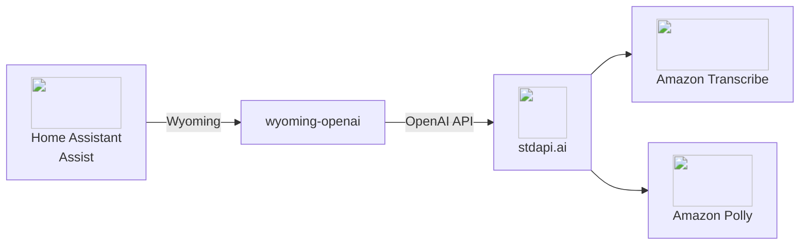
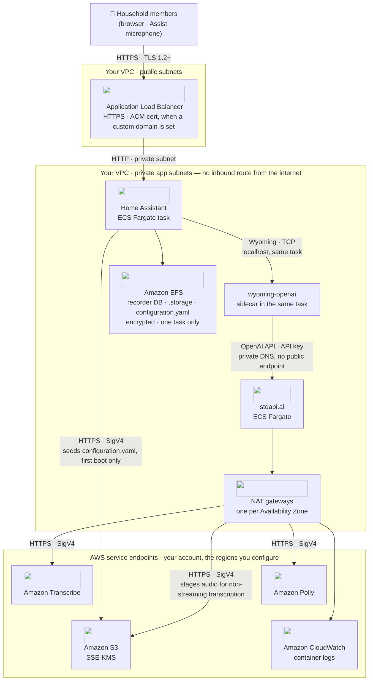

# :material-microphone-message: Home Assistant Voice Integration

Give Home Assistant's Assist voice pipeline speech-to-text and text-to-speech backed by Amazon Transcribe and Amazon Polly, through stdapi.ai's OpenAI-compatible audio routes.

## :material-information-outline: About Home Assistant Assist and Wyoming

**🔗 Links:** [Home Assistant Assist](https://www.home-assistant.io/voice_control/) | [wyoming-openai](https://github.com/roryeckel/wyoming_openai) | [Wyoming protocol](https://github.com/OHF-Voice/wyoming)

Home Assistant's Assist voice pipeline speaks [Wyoming](https://github.com/OHF-Voice/wyoming), a lightweight protocol for local voice satellites and speech services—not the OpenAI or Anthropic APIs directly. [wyoming-openai](https://github.com/roryeckel/wyoming_openai) is an open-source proxy that bridges Wyoming to any OpenAI-compatible speech-to-text and text-to-speech backend, which is what lets Assist reach stdapi.ai.

**What the proxy adds on top of the audio routes:**

- **Wyoming discovery** - Advertises configured speech-to-text models and text-to-speech voices to Assist
- **Streaming synthesis** - Speaks a response as it is generated, in overlapping chunks, rather than waiting for the whole sentence
- **Format translation** - Reassembles the response as raw PCM frames for Assist's audio pipeline

## :material-help-circle-outline: Why Home Assistant + stdapi.ai?

<div class="grid cards" markdown>

- :material-swap-horizontal: __No Cloud Voice Subscription__
  <br>Replace a cloud speech-to-text/text-to-speech subscription with Amazon Transcribe and Amazon Polly, billed at Bedrock/AWS rates.

- :material-lock: __No Third-Party Voice Vendor__
  <br>Spoken audio and transcripts are processed by Amazon Transcribe, Polly and Bedrock in the regions you enable, reached through your own deployment — no consumer voice-assistant vendor in the path.

- :material-home-automation: __Works with Your Existing Assist Setup__
  <br>Assist's speech-to-text and text-to-speech pipeline selection is unchanged—only the backend the proxy talks to is stdapi.ai.

- :material-currency-usd-off: __Pay-Per-Use Pricing__
  <br>No per-satellite or per-minute voice assistant fees. Pay only Amazon Transcribe and Amazon Polly rates for actual usage.

</div>



## :material-connection: Connect Your Own Instance

Point any Home Assistant instance's Wyoming bridge at stdapi.ai — the deployment underneath doesn't matter to Assist.

### :material-check-circle: Prerequisites

!!! info "What You'll Need"
    - ✓ **stdapi.ai deployed** - [See deployment guide](operations_getting_started.md) or [run locally with Docker](operations_getting_started_local.md)
    - ✓ **Your stdapi.ai URL** - reachable from wherever the proxy runs, e.g. `https://api.example.com`
    - ✓ **Your API key** - From Terraform output or configuration
    - ✓ **Home Assistant** - With the Assist voice pipeline set up
    - ✓ **A place to run wyoming-openai** - A container alongside Home Assistant, e.g. as a Home Assistant OS add-on or a standalone container

---

### :material-cog: Configuration

wyoming-openai is configured through environment variables, split into a speech-to-text half and a text-to-speech half. Point both at your stdapi.ai deployment.

!!! example "Environment Variables"
    ```bash
    # Speech to text
    STT_OPENAI_URL=https://YOUR_STDAPI_URL/v1
    STT_OPENAI_KEY=YOUR_STDAPI_KEY
    STT_MODELS=amazon.transcribe

    # Text to speech
    TTS_OPENAI_URL=https://YOUR_STDAPI_URL/v1
    TTS_OPENAI_KEY=YOUR_STDAPI_KEY
    TTS_MODELS=amazon.polly-neural
    TTS_VOICES=alloy

    # Backend selection
    STT_BACKEND=OPENAI
    TTS_BACKEND=OPENAI
    ```

The proxy calls `POST /v1/audio/transcriptions` (see [Audio Transcriptions API](api_openai_audio_transcriptions.md)) for speech to text and `POST /v1/audio/speech` (see [Audio Speech API](api_openai_audio_speech.md)) for text to speech, so `STT_MODELS` must be a speech-to-text-capable model and `TTS_MODELS` a text-to-speech-capable model from the correct family.

!!! tip "Pin the backend"
    Left unset, wyoming-openai probes a few well-known self-hosted backends before falling back to a generic OpenAI-compatible one. Setting `STT_BACKEND=OPENAI` and `TTS_BACKEND=OPENAI` skips that probing and connects directly.

!!! tip "A cheaper speech-to-text model"
    `STT_MODELS=amazon.nova-2-sonic-v1:0` transcribes through [Amazon Nova Sonic](api_openai_audio_transcriptions.md#amazon-nova-sonic) instead of Amazon Transcribe: the lowest-cost transcription available here, punctuated and in the language spoken. It answers `json` and `text` only — which is all the proxy asks for — and caps a recording at 10 minutes, well beyond any voice command. Keep `amazon.transcribe` if the same deployment also serves subtitles, timestamps or speaker labels.

#### :material-waveform: Streaming Speech to Text

Enables: recognizing a spoken command phrase by phrase, instead of after the whole utterance has been recorded.

!!! example "Environment Variables"
    ```bash
    STT_STREAMING_MODELS=amazon.transcribe
    ```

Only the models listed there are called in streaming mode, which is what makes the proxy ask stdapi.ai for a [streamed transcription](api_openai_audio_transcriptions.md#streaming). The gateway returns each phrase as it is recognized whenever the request names the language to expect; if the proxy sends none, set [`AWS_TRANSCRIBE_STREAM_LANGUAGES`](operations_configuration.md#aws-transcribe-stream-languages) on stdapi.ai to the languages your satellites actually speak and those requests take the same fast path. Streamed transcription stages nothing, so it works on a deployment with no S3 bucket configured.

!!! note "This is the streaming option to use, not the realtime one"
    stdapi.ai's [Realtime API](api_openai_realtime.md) serves speech-to-speech sessions, and a transcription-only session is requested through an [ephemeral client secret](api_openai_realtime.md#ephemeral-client-secrets) rather than on the socket — so a client that expects OpenAI's realtime *transcription* socket gets no transcript from it. Assist's pipeline is turn-based anyway: speech to text, then a conversation agent, then text to speech.

#### :material-volume-high: Streaming Text to Speech

Enables: speaking a response as it is generated, instead of waiting for the whole sentence to synthesize.

!!! example "Environment Variables"
    ```bash
    TTS_STREAMING_MODELS=amazon.polly-neural
    ```

Naming the same model in both `TTS_MODELS` and `TTS_STREAMING_MODELS` puts its voice in the proxy's streaming program, so Assist can use it for both a plain synthesis request and a streamed one. The proxy splits a streamed reply into sentences and synthesizes several `/v1/audio/speech` calls concurrently, then replays the audio in the original order.

#### :material-tune-vertical: Voice Mapping

`TTS_VOICES` lists OpenAI-style voice names (`alloy`, `echo`, `fable`, and so on); stdapi.ai maps each one to an Amazon Polly voice of matching gender and language. List one entry per voice you want Assist to offer.

---

### :material-alert-outline: Known Issues

The proxy speaks the Wyoming protocol over its own TCP port, not HTTP—there is no `/health` endpoint to check readiness with a plain web request. Wait for a successful Wyoming `describe` exchange (or check the container logs) rather than polling an HTTP path.

## :material-rocket-launch: Deploy the Full Stack on AWS

The sample below is one worked example of a credible AWS deployment, not the only architecture that works. The gateway is a normal HTTP service, and Home Assistant, wyoming-openai and stdapi.ai itself can run anywhere you like — your own ECS or EKS cluster, EC2, another cloud, or a laptop.

### :material-sitemap: Architecture

The diagram below is the topology the [Terraform sample](#whats-included) builds: a public-facing Home Assistant behind an ALB, wyoming-openai as a sidecar in the same ECS task, and the stdapi.ai gateway as a separate, internally-reachable service in the same VPC.



The ALB is the only public address in the picture, and it forwards only to Home Assistant — stdapi.ai has no listener of its own and is reached exclusively through AWS Cloud Map private DNS from the wyoming-openai sidecar. A household's state (recorder database, `.storage`, `configuration.yaml`) comes to rest on the single EFS volume mounted into the Home Assistant task, never on the gateway; the gateway itself is stateless and only its egress path crosses the VPC boundary, over HTTPS with SigV4, to Amazon Transcribe and Amazon Polly.

#### What Each AWS Service Does Here

| AWS service | Role in this integration | Where it is configured |
| --- | --- | --- |
| **Amazon ECS on AWS Fargate** | Runs Home Assistant and wyoming-openai as containers in one task, and the stdapi.ai gateway as a separate service | Terraform sample (`home_assistant.tf`) |
| **Elastic Load Balancing** | Public entry point for Home Assistant; terminates TLS when a custom domain and certificate are configured | Terraform sample (`alb.tf`) |
| **AWS Cloud Map** | Private DNS name wyoming-openai uses to reach the gateway, with no public endpoint | Terraform sample (`service_discovery_dns_name`) |
| **Amazon Transcribe** | Speech-to-text behind `POST /v1/audio/transcriptions` | `STT_MODELS` (wyoming-openai) |
| **Amazon Polly** | Text-to-speech behind `POST /v1/audio/speech`, streamed as concurrent per-sentence calls | `TTS_MODELS` / `TTS_STREAMING_MODELS` (wyoming-openai) |
| **Amazon EFS** | Home Assistant's recorder database, `.storage`, and `configuration.yaml`; a second concurrent writer would corrupt it, so the task is pinned to exactly one | Terraform sample (`home_assistant.tf`, EFS mount point) |
| **Amazon S3** | Seeds `configuration.yaml` on first boot through a read-only S3 Files mount, and on the gateway side stages audio for non-streaming transcription | Terraform sample (config seed) / gateway module default bucket |
| **AWS KMS** | Customer-managed keys encrypting the EFS volume and the S3 buckets | ECS module and gateway module defaults |
| **Amazon CloudWatch** | Container logs for both ECS services | ECS module and gateway module defaults |
| **AWS IAM** | Separate task roles; the gateway's role grants only the Transcribe and Polly actions it invokes | [IAM permissions](operations_iam_permissions.md) |

#### Security Measures in This Flow

- **Authentication** — wyoming-openai calls the gateway with a stdapi.ai [API key](operations_authentication_security.md#api-key-authentication) that Terraform generates (`api_key_create = true`) and injects as `STT_OPENAI_KEY`/`TTS_OPENAI_KEY` container secrets; the sample's ALB security group additionally restricts inbound traffic to the deploying operator's own IP address.
- **Encryption in transit** — HTTPS from the browser to the ALB when a custom domain and certificate are configured; Wyoming stays inside the ECS task over localhost; HTTPS with SigV4 from the gateway to Amazon Transcribe and Amazon Polly.
- **Encryption at rest** — the EFS volume backing Home Assistant's state and both S3 buckets (config seed, gateway staging) use customer-managed KMS keys.
- **Least privilege** — the gateway's task role grants only the Transcribe and Polly actions it invokes; Home Assistant's task role carries none of them.
- **Content policy** — a [Bedrock guardrail](operations_configuration.md#bedrock-guardrails), if configured on the gateway, checks the text to synthesize as `INPUT` on `/v1/audio/speech` and the produced transcript as `OUTPUT` on `/v1/audio/transcriptions`, through the ApplyGuardrail API rather than a native chat-style integration.
- **Data handling** — the gateway holds request audio in memory, or briefly in its own S3 bucket when staging a non-streaming transcription job, and does not persist it; Home Assistant's own recordings and conversation history stay on the EFS volume in your account.

---

### :material-cube-outline: What's Included

Deploy Home Assistant, wyoming-openai, and stdapi.ai together on ECS Fargate:

**📦 [stdapi-ai/samples/getting_started_home_assistant](https://github.com/stdapi-ai/samples/tree/main/getting_started_home_assistant)**

**What's included:**

- Home Assistant and wyoming-openai in the same ECS Fargate task, talking over `localhost`
- stdapi.ai gateway connected to Amazon Bedrock, Amazon Transcribe, and Amazon Polly
- `configuration.yaml` seeded on first boot with the reverse-proxy trust settings Home Assistant needs behind an ALB
- Both container images pulled directly and anonymously from ghcr.io — no local build, no registry credential
- HTTPS-capable ALB on your own domain (needed for microphone access in the browser)

!!! warning "Demonstration sample, not a production Home Assistant deployment"
    AWS Fargate has no route to your home network, so Zigbee/Z-Wave USB dongles, mDNS device discovery, and other LAN-only integrations do not work here. Use it to try Assist voice through Amazon Transcribe/Polly, or as a starting point for a self-hosted, cloud-reachable instance you administer through the web UI. If you already run Home Assistant at home, the sample's README covers deploying only the cloud-side pieces instead of moving Home Assistant itself.

**Deploy:**

```bash
git clone https://github.com/stdapi-ai/samples.git
cd samples/getting_started_home_assistant/terraform
tofu init
tofu apply
```

Three steps stay manual after `tofu apply`, for reasons specific to Home Assistant: creating the owner account through the onboarding wizard, adding the Wyoming integration (**Settings → Devices & Services**), and pointing an Assist pipeline at it. See the sample's README for the exact steps.

---

### :material-gauge: What It Costs to Run

| Charge | Driver |
| --- | --- |
| stdapi.ai licence | $0.10 per gateway container-hour, metered through AWS Marketplace, with a 14-day free trial on the licence |
| ECS Fargate | Two services — the Home Assistant + wyoming-openai task, pinned to exactly one, and the gateway, sized independently |
| Load balancing and networking | One ALB, plus the NAT gateways — one per Availability Zone — the private subnets egress through |
| Amazon EFS | Standing storage and throughput for the recorder database, `.storage`, and `configuration.yaml` |
| Amazon Polly | Billed per character of text synthesized, not per token |
| Amazon Transcribe | Billed per second of audio transcribed, not per token |

Read a model's price before you send anything to it with [`GET /model_pricing`](api_model_pricing.md). Setting [`COST_TRACKING=true`](operations_cost_management.md#cost-tracking-real-time-aws-pricing) additionally puts a per-request cost on each usage entry — estimated from published AWS prices, not read back from your invoice.

---

### :material-eye-outline: What to Watch

The gateway logs Polly usage — `input_characters`, always on the `request` event — and Transcribe usage — `input_seconds`, on `request` normally or on `request_stream` if you turn on `STT_STREAMING_MODELS` — with `execution_time_ms` on every entry. Turning on [`CLOUDWATCH_METRICS`](operations_logging_monitoring.md#cloudwatch-metrics-emf) republishes those counts as EMF metrics in the `stdapi` namespace, dimensioned by `Model`: `Count` for characters, `Seconds` for audio duration.

```sql
fields path, execution_time_ms
| filter type = "request" and (path = "/v1/audio/transcriptions" or path = "/v1/audio/speech")
| stats count(*) as calls, avg(execution_time_ms) as avg_ms, pct(execution_time_ms, 95) as p95_ms by path
| sort path
```

A rising p95 on either path is what a household notices as a slow turn, before it shows up in any cost report.

## :material-arrow-right: Next Steps

<div class="grid cards" markdown>

- :material-rocket-launch: [**Getting Started**](operations_getting_started.md) — Deploy stdapi.ai to AWS with Terraform
- :material-docker: [**Local Development**](operations_getting_started_local.md) — Run stdapi.ai locally with Docker
- :material-puzzle: [**More Use Cases**](use_cases.md) — Explore other integrations and tools
- :material-api: [**API Overview**](api_overview.md) — Explore supported endpoints

</div>
