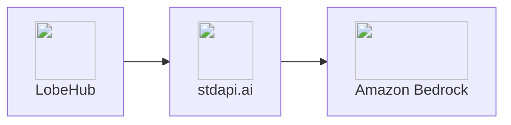
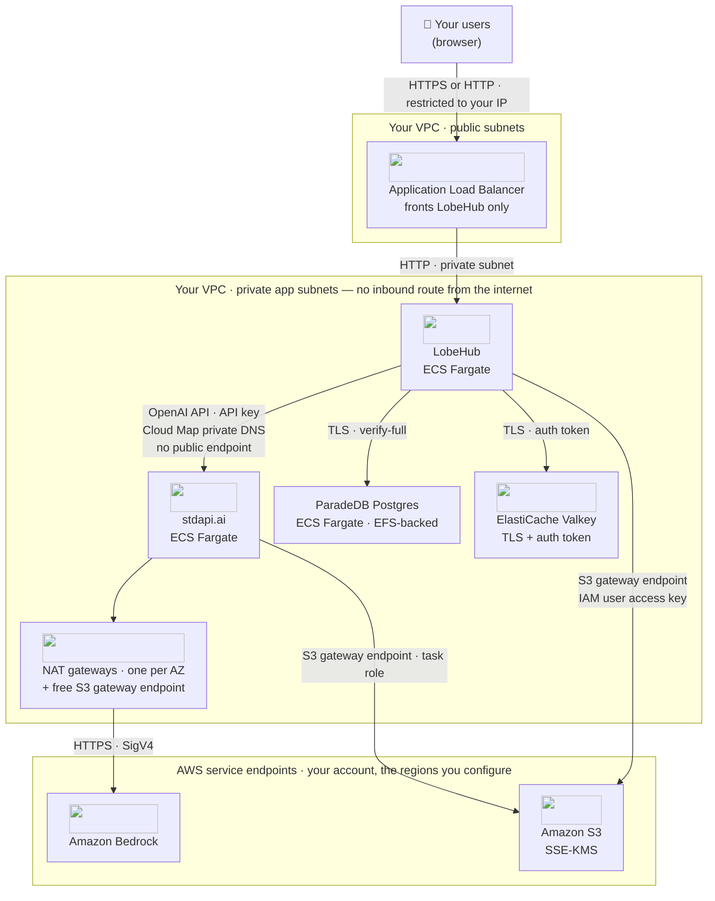

# :material-chat-processing-outline: LobeHub Integration

Connect LobeHub to stdapi.ai as its OpenAI-compatible backend. Chat, vision, image generation, and knowledge-base embeddings all run through Amazon Bedrock with a single connection.

## :material-information-outline: About LobeHub

**🔗 Links:** [Website](https://lobehub.com/) | [GitHub](https://github.com/lobehub/lobehub) | [Documentation](https://lobehub.com/docs/self-hosting/start)

LobeHub (formerly LobeChat) is an open-source, self-hosted AI chat platform with a ChatGPT-like interface, a plugin/agent marketplace, and a built-in knowledge base for retrieval-augmented chat.

**Key Features:**

- **Modern chat UI** - Multi-session, multi-agent chat with Markdown, code, and file rendering
- **Knowledge base** - Upload documents and search them with semantic retrieval
- **Vision and image generation** - Analyze images in chat and generate new ones with the AI Image tool
- **Single provider model** - One "OpenAI" connection covers chat, vision, image generation, and embeddings
- **Real accounts** - Email/password (or SSO) registration, not a shared access code

## :material-help-circle-outline: Why LobeHub + stdapi.ai?

<div class="grid cards" markdown>

- :material-swap-horizontal: __One Connection, Every Modality__
  <br>LobeHub treats "OpenAI" as a single provider. Set one base URL and key, and chat, vision, image generation, and embeddings all reach Amazon Bedrock.

- :material-aws: __Access Amazon Bedrock Models__
  <br>Claude, Nova, Stable Diffusion, Cohere Embed, and 100+ models through LobeHub's chat interface and knowledge base.

- :material-application-cog: __Multi-Modal Chat__
  <br>Text chat, vision, and in-chat image generation, all backed by Bedrock models through the same endpoint.

- :material-lock: __Enterprise Data Privacy__
  <br>All processing stays in your AWS account. Complete infrastructure control with AWS security, compliance, and data sovereignty.

- :material-currency-usd-off: __Pay-Per-Use Pricing__
  <br>No LobeHub Cloud subscription. Pay only Amazon Bedrock rates for actual usage—no monthly minimums or per-user fees.

</div>



## :material-sitemap: Architecture

The diagram below is the topology the [Terraform sample](#terraform-deployment) builds: LobeHub sits behind a public load balancer with its own self-hosted Postgres database, while the stdapi.ai gateway has no public endpoint of its own.



Two things stand out. LobeHub is the only service with a public address — the gateway resolves entirely through AWS Cloud Map private DNS, so no third party, and no public listener of its own, sits between your users and the models. And Amazon S3 is the one destination both applications reach directly through the account's S3 gateway endpoint rather than the NAT gateways, each under its own credential: LobeHub's static IAM user key for its uploads bucket, the gateway's task role for its own bucket of temporary multimodal objects.

### What Each AWS Service Does Here

| AWS service | Role in this integration | Where it is configured |
| --- | --- | --- |
| **Amazon ECS on AWS Fargate** | Runs LobeHub, the stdapi.ai gateway and the self-hosted ParadeDB Postgres task as independent services | Terraform sample |
| **Elastic Load Balancing** | The only public entry point; optionally terminates TLS with an ACM certificate on your domain, otherwise serves plain HTTP; forwards only to LobeHub | Terraform sample (`alb.tf`) |
| **AWS Cloud Map** | Private DNS names LobeHub uses to reach the gateway and its Postgres task — neither is exposed outside the VPC, and the Postgres name is also the one its TLS certificate is issued for | Terraform sample (`service_discovery_dns_name`) |
| **Amazon Bedrock** | Chat, vision, image generation and knowledge-base embeddings | [`AWS_BEDROCK_REGIONS`](operations_configuration.md#aws-bedrock-regions) |
| **Amazon S3** | Two separate buckets: LobeHub's file, avatar and knowledge-base uploads, and the gateway's own temporary multimodal objects | [S3 storage](operations_compliance.md#s3-data-storage) |
| **Amazon ElastiCache (Valkey)** | LobeHub's cache, session state and the stream fan-out that lets a reply generated by one task reach a browser attached to another; reached over `rediss://` with an auth token, and deployed as a primary with a cross-AZ replica, automatic failover and daily snapshots | Terraform sample (`valkey.tf`) |
| **Self-hosted PostgreSQL (ParadeDB)** | LobeHub's application database and the `pg_search`/`pgvector` store behind its knowledge base; not an AWS managed service, see [Postgres, ParadeDB, and RDS](#postgres-paradedb-and-rds) | Terraform sample (`postgres.tf`) |
| **AWS KMS** | Customer-managed keys encrypting the S3 buckets, the Valkey replication group, and the EFS volume behind Postgres | Terraform sample |
| **AWS IAM** | Separate least-privilege ECS task roles per service, plus a dedicated IAM user whose static access key for LobeHub's own S3 client is rotated every 90 days, on the next `tofu apply` after that interval elapses | [IAM permissions](operations_iam_permissions.md) |
| **Amazon CloudWatch** | Container logs, Container Insights, gateway request logs and EMF usage metrics | [Logging & monitoring](operations_logging_monitoring.md) |

### Security Measures in This Flow

- **Authentication** — LobeHub signs in its own users; every call it makes to the gateway carries a stdapi.ai [API key](operations_authentication_security.md#api-key-authentication) that Terraform generates and injects as an ECS `secrets` entry, never a plain environment variable.
- **Encryption in transit** — HTTPS to the ALB when a domain and certificate are configured (plain HTTP otherwise, restricted to the deployer's IP), private-subnet HTTP from the ALB to LobeHub, TLS with an auth token to Valkey, and HTTPS with SigV4 from the gateway to Amazon Bedrock and S3. The Postgres hop is TLS too: Terraform creates a private certificate authority, issues a server certificate for the database's private DNS name — delivered to the container as a KMS-encrypted SSM `SecureString` parameter, never as a file on the shared volume — and LobeHub connects with `sslmode=verify-full` trusting that one authority, which makes the connection authenticated rather than merely encrypted.
- **Encryption at rest** — SSE-KMS on both S3 buckets, an encrypted Valkey replication group, and a KMS-encrypted, transit-encrypted EFS volume behind the self-hosted Postgres.
- **Least privilege** — each ECS task assumes its own role; the ALB's security group admits only the deployer's current IP, not the open internet; LobeHub's S3 access runs through a dedicated IAM user scoped to one bucket and one KMS key, because LobeHub's own S3 client needs a static access key and cannot assume the task role.
- **Content policy** — a [Bedrock guardrail](operations_configuration.md#bedrock-guardrails) configured on the gateway applies to chat, vision and image generation alike, since LobeHub reaches all three through the same connection.
- **Data handling** — the gateway is stateless and holds request bodies in memory only; LobeHub's own content — chat history, uploaded files, knowledge-base embeddings — lives in the Postgres and S3 resources this sample creates, not in a service operated by LobeHub or stdapi.ai.

## :material-check-circle: Prerequisites

!!! info "What You'll Need"
    - ✓ **stdapi.ai deployed** - [See deployment guide](operations_getting_started.md)
    - ✓ **Your stdapi.ai URL** - e.g., `https://api.example.com`
    - ✓ **Your API key** - From Terraform output or configuration
    - ✓ **LobeHub instance** - Running or ready to deploy (see Deployment section below), in **server DB** mode — LobeHub 2.x has no client-storage mode

---

## :material-cog: Configuration

LobeHub is configured through environment variables. Unlike Open WebUI, LobeHub has no per-feature connection settings: one "OpenAI" provider covers chat, vision, image generation, and embeddings.

!!! example "Environment Variables"
    ```bash
    ENABLED_OPENAI    = "1"
    OPENAI_API_KEY    = YOUR_STDAPI_KEY
    OPENAI_PROXY_URL  = https://YOUR_STDAPI_URL/v1
    OPENAI_MODEL_LIST = "-all,+anthropic.claude-sonnet-4-5-20250929-v1:0=Claude Sonnet 4.5<200000:vision:fc>,+stability.stable-image-core-v1:1=Stable Image Core<4096:imageOutput>"
    ```

`OPENAI_MODEL_LIST` both selects which models appear in the UI and tags their capabilities (`vision`, `fc` for tool calling, `imageOutput`), following LobeHub's [model list syntax](https://lobehub.com/docs/self-hosting/advanced/model-list). Any model can be swapped for another Bedrock model available through stdapi.ai, as long as its capability tags match its modality.

Set the default models for chat and background tasks separately:

!!! example "Default Models"
    ```bash
    DEFAULT_AGENT_CONFIG = "model=anthropic.claude-sonnet-4-5-20250929-v1:0;provider=openai"
    SYSTEM_AGENT         = "default=openai/amazon.nova-micro-v1:0"
    DEFAULT_FILES_CONFIG = "embedding_model=openai/cohere.embed-v4:0"
    ```

- `DEFAULT_AGENT_CONFIG` — the default assistant's chat/vision model
- `SYSTEM_AGENT` — a fast, low-cost model for background tasks (topic naming, translation)
- `DEFAULT_FILES_CONFIG` — the embedding model backing the knowledge base

LobeHub calls `POST /v1/chat/completions` for chat and vision (see [Chat Completions API](api_openai_chat_completions.md)), `POST /v1/embeddings` for the knowledge base (see [Embeddings API](api_openai_embeddings.md)), and `POST /v1/images/generations` for the AI Image tool (see [Images Generations API](api_openai_images_generations.md)).

For the full reference, see LobeHub's [environment variables documentation](https://lobehub.com/docs/self-hosting/environment-variables/basic).

### :material-volume-high: Voice (TTS/STT)

LobeHub has no server-side environment variable for the default voice provider. In an agent's settings, under **Text-to-Speech**/**Speech-to-Text**, select **OpenAI Audio** — it reuses the same stdapi.ai connection already configured, with no extra key needed.

Two gateway-side details make that pairing more comfortable than it is upstream:

- **Reading a long answer aloud takes one request.** [`/v1/audio/speech`](api_openai_audio_speech.md#long-input) accepts up to 100,000 characters — 24× the upstream limit — and speaks long input as it is synthesized rather than after the whole job finishes, so an essay-length reply needs no client-side splitting. Past 3,000 characters it needs a bucket for the serving region, except on generative voices, which reach 20,000 without one.
- **Transcription can be cheaper.** Naming `amazon.nova-2-sonic-v1:0` as the speech-to-text model transcribes through [Amazon Nova Sonic](api_openai_audio_transcriptions.md#amazon-nova-sonic), the lowest-cost option here; it returns punctuated text with no timestamps, for recordings up to 10 minutes.

### :material-account-key: SSO and Authentication

LobeHub supports SSO providers (Google, GitHub, Microsoft, AWS Cognito, and others) and restricting registration to specific email domains via `AUTH_ALLOWED_EMAILS` / `AUTH_DISABLE_EMAIL_PASSWORD`. See LobeHub's [authentication environment variables](https://lobehub.com/docs/self-hosting/environment-variables/auth).

---

## :material-rocket-launch: Terraform Deployment

Deploy LobeHub + stdapi.ai together with production infrastructure:

**📦 [stdapi-ai/samples/getting_started_lobehub](https://github.com/stdapi-ai/samples/tree/main/getting_started_lobehub)**

**What's included:**

- LobeHub on ECS Fargate, server DB mode
- stdapi.ai gateway connected to Amazon Bedrock, exposed as LobeHub's single "OpenAI" provider
- Self-hosted ParadeDB PostgreSQL (`pg_search` + `pgvector`) on EFS — see [Postgres, ParadeDB, and RDS](#postgres-paradedb-and-rds) below
- Amazon S3 for file, avatar and knowledge-base uploads, private and SSE-KMS encrypted, served through presigned URLs
- ElastiCache Valkey for cache and sessions
- HTTPS with ALB on your own domain
- All environment variables pre-configured

**Deploy:**

```bash
git clone https://github.com/stdapi-ai/samples.git
cd samples/getting_started_lobehub/terraform
tofu init
tofu apply
```

**Manual steps after apply:**

- **First account** — register through the UI; there is no pre-provisioned admin user, unlike the n8n sample
- **Image generation model** — verify the model appears in the AI Image tool's model picker; this wiring was not exercised against a live deployment while building the sample

### Postgres, ParadeDB, and RDS

LobeHub 2.x dropped its client-storage (PGlite) mode — the current app only supports server DB mode, which requires ParadeDB's `pg_search` Postgres extension. This is not a matter of degraded search: migration `0090_enable_pg_search.sql` runs `CREATE EXTENSION pg_search` unconditionally on every start, and the container exits when it fails, so the application never comes up at all. Amazon RDS and Aurora PostgreSQL do not offer that extension, and it additionally requires `shared_preload_libraries = 'pg_search'`, which RDS only permits for AWS-vetted modules. This sample therefore self-hosts Postgres, running the official `paradedb/paradedb` image on ECS Fargate with its data directory on EFS.

This is the only sample here with a self-hosted datastore, and it exists solely because of that extension. Object storage, cache and every other backing service use managed AWS services.

The data directory sits on EFS because EFS is regional: a replacement task placed in another Availability Zone finds the same files, and the AWS Backup plan the ECS module creates covers them. A task-attached EBS volume is not the block-storage alternative it looks like — volumes attached to tasks a *service* manages "aren't preserved and are always deleted upon task termination", and the service-managed shape of the ECS API has no `terminationPolicy` member to change that, so Postgres would come up on an empty disk after every deployment or AZ event.

Running PostgreSQL over NFS is a supported configuration, not a compromise: the manual's [§18.2.2.1](https://www.postgresql.org/docs/current/creating-cluster.html#CREATING-CLUSTER-NFS) states that PostgreSQL "does not use any functionality that is known to have nonstandard behavior on NFS, such as file locking", and that the only firm requirement is a `hard` mount — the Linux default. EFS acknowledges a write only once it is durable across Availability Zones, which is exactly what the manual asks of the server side.

!!! warning "One postmaster at a time, and nothing enforces it for you"
    The hazard worth knowing about is two postmasters on one data directory, because PostgreSQL fails *open* here rather than refusing to start. `CreateLockFile()` in `miscinit.c` skips its liveness check when the PID in `postmaster.pid` equals its own, and both containers run the postmaster as PID 1 in their own namespace — so each reads `1` from the other's lock file, concludes it is stale, deletes it and starts. The interlock is a PID file, not an OS lock, and it cannot see across hosts.

    Two settings in the sample are what actually keep the single writer single: the Postgres service is pinned to exactly one task, and it deploys stop-then-start (`deployment_minimum_healthy_percent = 0`) so ECS never runs a replacement task beside the one it replaces. The price is a short outage on every deployment and no high availability for the database — acceptable while evaluating LobeHub, worth revisiting before it carries production traffic, where a managed ParadeDB offering or a database you operate yourself is the better target for `DATABASE_URL`.

---

## :material-gauge: Operating This Integration

### What It Costs to Run

| Charge | Driver |
| --- | --- |
| stdapi.ai licence | $0.10 per gateway container-hour, metered through AWS Marketplace, with a 14-day free trial on the licence |
| ECS Fargate | Three services — LobeHub, the gateway, and the self-hosted ParadeDB Postgres task, which is pinned to exactly one instance |
| Load balancing and networking | One ALB fronting LobeHub, plus the NAT gateways the private subnets egress through — the S3 gateway endpoint alongside them carries no charge |
| Amazon EFS | Backing storage for the Postgres data directory |
| ElastiCache Valkey | A standing cost for two nodes — a primary and its failover replica (`cache.t4g.micro` each in the sample) |
| Amazon S3 | Storage for LobeHub's uploads and the gateway's temporary multimodal objects |
| Model and AI-service usage | Amazon Bedrock at AWS rates, billed to your account with no markup |

Check a model's price before routing traffic to it with [`GET /model_pricing`](api_model_pricing.md). Turning on [`COST_TRACKING`](operations_cost_management.md#cost-tracking-real-time-aws-pricing) puts a per-request cost on each usage entry — estimated from published AWS prices, not read back from your invoice — and is off by default.

### What to Watch

The gateway writes one structured `request` (or `request_stream` for streamed chat) event per call, carrying the request id, path, status code, `execution_time_ms`, the model that served it, and the AWS-billed token, character or second counts recorded in its nested `usage` list. Turning on [`CLOUDWATCH_METRICS`](operations_logging_monitoring.md#cloudwatch-metrics-emf) republishes those same counts as flat CloudWatch EMF metrics in the `stdapi` namespace, dimensioned by `Model` — with a second `[Model, Currency]` set for the `Cost` metric — so a dashboard can plot token consumption without parsing the JSON logs.

```sql
fields Model, InputTokens, OutputTokens
| filter _aws.CloudWatchMetrics is not null
| stats sum(InputTokens) as input_tokens, sum(OutputTokens) as output_tokens, count(*) as calls by Model
| sort input_tokens + output_tokens desc
```

For the prompts and completions themselves rather than metadata, turn on Amazon Bedrock's own [model invocation logging](operations_compliance.md#amazon-bedrock-invocation-logging), which stays off by default and is configured entirely on the AWS side.

---

## :material-arrow-right: Next Steps

<div class="grid cards" markdown>

- :material-rocket-launch: [**Getting Started**](operations_getting_started.md) — Deploy stdapi.ai to AWS with Terraform
- :material-docker: [**Local Development**](operations_getting_started_local.md) — Run stdapi.ai locally with Docker
- :material-puzzle: [**More Use Cases**](use_cases.md) — Explore other integrations and tools
- :material-api: [**API Overview**](api_overview.md) — Explore supported endpoints

</div>
