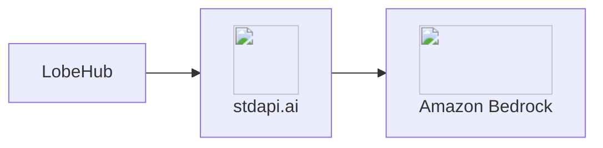

# :material-chat-processing-outline: LobeHub Integration

Connect LobeHub to stdapi.ai as its OpenAI-compatible backend. Chat, vision, image generation, and knowledge-base embeddings all run through Amazon Bedrock with a single connection.

## :material-information-outline: About LobeHub

**🔗 Links:** [Website](https://lobehub.com/) | [GitHub](https://github.com/lobehub/lobehub) | [Documentation](https://lobehub.com/docs/self-hosting/start)

LobeHub (formerly LobeChat) is an open-source, self-hosted AI chat platform with a ChatGPT-like interface, a plugin/agent marketplace, and a built-in knowledge base for retrieval-augmented chat.

**Key Features:**

- **Modern chat UI** - Multi-session, multi-agent chat with Markdown, code, and file rendering
- **Knowledge base** - Upload documents and search them with semantic retrieval
- **Vision and image generation** - Analyze images in chat and generate new ones with the AI Image tool
- **Single provider model** - One "OpenAI" connection covers chat, vision, image generation, and embeddings
- **Real accounts** - Email/password (or SSO) registration, not a shared access code

## :material-help-circle-outline: Why LobeHub + stdapi.ai?

<div class="grid cards" markdown>

- :material-swap-horizontal: __One Connection, Every Modality__
  <br>LobeHub treats "OpenAI" as a single provider. Set one base URL and key, and chat, vision, image generation, and embeddings all reach Amazon Bedrock.

- :material-aws: __Access Amazon Bedrock Models__
  <br>Claude, Nova, Stable Diffusion, Cohere Embed, and 100+ models through LobeHub's chat interface and knowledge base.

- :material-application-cog: __Multi-Modal Chat__
  <br>Text chat, vision, and in-chat image generation, all backed by Bedrock models through the same endpoint.

- :material-lock: __Enterprise Data Privacy__
  <br>All processing stays in your AWS account. Complete infrastructure control with AWS security, compliance, and data sovereignty.

- :material-currency-usd-off: __Pay-Per-Use Pricing__
  <br>No LobeHub Cloud subscription. Pay only Amazon Bedrock rates for actual usage—no monthly minimums or per-user fees.

</div>



## :material-check-circle: Prerequisites

!!! info "What You'll Need"
    - ✓ **stdapi.ai deployed** - [See deployment guide](operations_getting_started.md)
    - ✓ **Your stdapi.ai URL** - e.g., `https://api.example.com`
    - ✓ **Your API key** - From Terraform output or configuration
    - ✓ **LobeHub instance** - Running or ready to deploy (see Deployment section below), in **server DB** mode — LobeHub 2.x has no client-storage mode

---

## :material-cog: Configuration

LobeHub is configured through environment variables. Unlike Open WebUI, LobeHub has no per-feature connection settings: one "OpenAI" provider covers chat, vision, image generation, and embeddings.

!!! example "Environment Variables"
    ```bash
    ENABLED_OPENAI    = "1"
    OPENAI_API_KEY    = YOUR_STDAPI_KEY
    OPENAI_PROXY_URL  = https://YOUR_STDAPI_URL/v1
    OPENAI_MODEL_LIST = "-all,+anthropic.claude-sonnet-4-5-20250929-v1:0=Claude Sonnet 4.5<200000:vision:fc>,+stability.stable-image-core-v1:1=Stable Image Core<4096:imageOutput>"
    ```

`OPENAI_MODEL_LIST` both selects which models appear in the UI and tags their capabilities (`vision`, `fc` for tool calling, `imageOutput`), following LobeHub's [model list syntax](https://lobehub.com/docs/self-hosting/advanced/model-list). Any model can be swapped for another Bedrock model available through stdapi.ai, as long as its capability tags match its modality.

Set the default models for chat and background tasks separately:

!!! example "Default Models"
    ```bash
    DEFAULT_AGENT_CONFIG = "model=anthropic.claude-sonnet-4-5-20250929-v1:0;provider=openai"
    SYSTEM_AGENT         = "default=openai/amazon.nova-micro-v1:0"
    DEFAULT_FILES_CONFIG = "embedding_model=openai/cohere.embed-v4:0"
    ```

- `DEFAULT_AGENT_CONFIG` — the default assistant's chat/vision model
- `SYSTEM_AGENT` — a fast, low-cost model for background tasks (topic naming, translation)
- `DEFAULT_FILES_CONFIG` — the embedding model backing the knowledge base

LobeHub calls `POST /v1/chat/completions` for chat and vision (see [Chat Completions API](api_openai_chat_completions.md)), `POST /v1/embeddings` for the knowledge base (see [Embeddings API](api_openai_embeddings.md)), and `POST /v1/images/generations` for the AI Image tool (see [Images Generations API](api_openai_images_generations.md)).

For the full reference, see LobeHub's [environment variables documentation](https://lobehub.com/docs/self-hosting/environment-variables/basic).

### :material-volume-high: Voice (TTS/STT)

LobeHub has no server-side environment variable for the default voice provider. In an agent's settings, under **Text-to-Speech**/**Speech-to-Text**, select **OpenAI Audio** — it reuses the same stdapi.ai connection already configured, with no extra key needed.

Two gateway-side details make that pairing more comfortable than it is upstream:

- **Reading a long answer aloud takes one request.** [`/v1/audio/speech`](api_openai_audio_speech.md#long-input) accepts up to 100,000 characters — 24× the upstream limit — and speaks long input as it is synthesized rather than after the whole job finishes, so an essay-length reply needs no client-side splitting. Past 3,000 characters it needs a bucket for the serving region, except on generative voices, which reach 20,000 without one.
- **Transcription can be cheaper.** Naming `amazon.nova-2-sonic-v1:0` as the speech-to-text model transcribes through [Amazon Nova Sonic](api_openai_audio_transcriptions.md#amazon-nova-sonic), the lowest-cost option here; it returns punctuated text with no timestamps, for recordings up to 10 minutes.

### :material-account-key: SSO and Authentication

LobeHub supports SSO providers (Google, GitHub, Microsoft, AWS Cognito, and others) and restricting registration to specific email domains via `AUTH_ALLOWED_EMAILS` / `AUTH_DISABLE_EMAIL_PASSWORD`. See LobeHub's [authentication environment variables](https://lobehub.com/docs/self-hosting/environment-variables/auth).

---

## :material-rocket-launch: Terraform Deployment

Deploy LobeHub + stdapi.ai together with production infrastructure:

**📦 [stdapi-ai/samples/getting_started_lobehub](https://github.com/stdapi-ai/samples/tree/main/getting_started_lobehub)**

**What's included:**

- LobeHub on ECS Fargate, server DB mode
- stdapi.ai gateway connected to Amazon Bedrock, exposed as LobeHub's single "OpenAI" provider
- Self-hosted ParadeDB PostgreSQL (`pg_search` + `pgvector`) on EFS — see [Postgres, ParadeDB, and RDS](#postgres-paradedb-and-rds) below
- Amazon S3 for file, avatar and knowledge-base uploads, private and SSE-KMS encrypted, served through presigned URLs
- ElastiCache Valkey for cache and sessions
- HTTPS with ALB on your own domain
- All environment variables pre-configured

!!! warning "Local ECS module source"
    `module "lobehub"` (and the ParadeDB module alongside it) currently point at a local relative path (`../../../terraform-aws-ecs`) instead of the published registry module, because the sample needs S3 Files/public-image support that isn't in a tagged release yet. Cloning only the samples repository is not enough for `tofu init` to resolve it — you need a sibling checkout of `terraform-aws-ecs` next to `samples/`.

**Deploy:**

```bash
git clone https://github.com/stdapi-ai/samples.git
git clone https://github.com/JGoutin/terraform-aws-ecs.git
cd samples/getting_started_lobehub/terraform
tofu init
tofu apply
```

**Manual steps after apply:**

- **First account** — register through the UI; there is no pre-provisioned admin user, unlike the n8n sample
- **Image generation model** — verify the model appears in the AI Image tool's model picker; this wiring was not exercised against a live deployment while building the sample

### Postgres, ParadeDB, and RDS

LobeHub 2.x dropped its client-storage (PGlite) mode — the current app only supports server DB mode, which requires ParadeDB's `pg_search` Postgres extension. This is not a matter of degraded search: migration `0090_enable_pg_search.sql` runs `CREATE EXTENSION pg_search` unconditionally on every start, and the container exits when it fails, so the application never comes up at all. Amazon RDS and Aurora PostgreSQL do not offer that extension, and it additionally requires `shared_preload_libraries = 'pg_search'`, which RDS only permits for AWS-vetted modules. This sample therefore self-hosts Postgres, running the official `paradedb/paradedb` image on ECS Fargate with its data directory on EFS.

This is the only sample here with a self-hosted datastore, and it exists solely because of that extension. Object storage, cache and every other backing service use managed AWS services.

!!! danger "Not suitable for production data"
    Running PostgreSQL on EFS is fine for evaluating LobeHub and is **not suitable for production data you care about**. EFS is NFS, and PostgreSQL's durability guarantees assume a local block device — the failure mode is silent data corruption, not a clear error. The task is pinned to exactly one instance, since two writers against one data directory would corrupt it; that also means no high availability, and a restart during a write is a real risk. If you take LobeHub to production, run Postgres on something durable — EC2 with EBS, or a managed ParadeDB offering — and point `DATABASE_URL` at it. Every other sample in this documentation uses RDS or ElastiCache precisely to avoid this.

---

## :material-arrow-right: Next Steps

<div class="grid cards" markdown>

- :material-rocket-launch: [**Getting Started**](operations_getting_started.md) — Deploy stdapi.ai to AWS with Terraform
- :material-docker: [**Local Development**](operations_getting_started_local.md) — Run stdapi.ai locally with Docker
- :material-puzzle: [**More Use Cases**](use_cases.md) — Explore other integrations and tools
- :material-api: [**API Overview**](api_overview.md) — Explore supported endpoints

</div>
