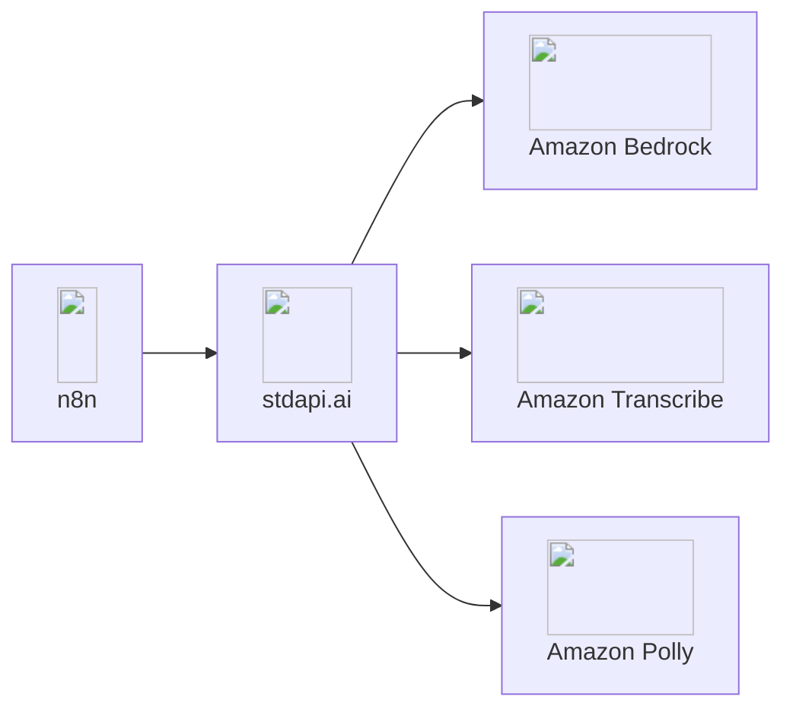

# :material-sitemap: n8n Integration

Connect n8n automation workflows to Amazon Bedrock models through stdapi.ai's OpenAI-compatible or Anthropic-compatible interfaces. Existing OpenAI and Anthropic templates from the n8n marketplace work out of the box—simply point them to your stdapi.ai instance and access Amazon Bedrock models.

## :material-information-outline: About n8n

**🔗 Links:** [Website](https://n8n.io/) | [GitHub](https://github.com/n8n-io/n8n) | [Documentation](https://docs.n8n.io/)

n8n is a powerful workflow automation platform that enables you to connect any app with an API to build intelligent automations. With its intuitive visual interface, you can create complex AI-powered workflows without writing code, connecting Amazon Bedrock models to hundreds of services including Slack, Google Sheets, Salesforce, and more.

**Key Features:**

- ⭐ **190,000+ GitHub stars** - Leading open-source workflow automation platform
- **Hundreds of integrations** - Pre-built nodes for popular services and APIs
- **Visual no-code builder** - Drag-and-drop interface with JavaScript customization
- **Self-hosted or cloud** - Deploy on your infrastructure or use n8n Cloud
- **AI-native platform** - Built-in OpenAI nodes work instantly with Amazon Bedrock via stdapi.ai
- **Template marketplace** - Thousands of pre-built workflows ready to use

## :material-help-circle-outline: Why n8n + stdapi.ai?

<div class="grid cards" markdown>

- :material-puzzle: __Use Existing OpenAI Templates__
  <br>stdapi.ai works with n8n's OpenAI nodes. Thousands of marketplace templates and workflows designed for OpenAI run on Amazon Bedrock—zero modifications needed.

- :material-robot: __Use Existing Anthropic Templates__
  <br>stdapi.ai works with n8n's Anthropic nodes. Templates and workflows designed for Anthropic Claude run on Amazon Bedrock—zero modifications needed.

- :material-aws: __Access Amazon Bedrock Models__
  <br>Claude, Nova, Llama, DeepSeek, Stable Diffusion, and 100+ models available in n8n workflows. Switch models without changing automation logic.

- :material-graph-outline: __Automate Business Processes__
  <br>Connect Amazon Bedrock AI to Slack, Salesforce, Google Workspace, databases, and hundreds of other services. Build intelligent automation with no-code drag-and-drop.

- :material-lock: __Enterprise Data Control__
  <br>All AI processing stays in your AWS account. Self-host n8n and stdapi.ai for complete data sovereignty and compliance.

- :material-currency-usd-off: __Pay-Per-Use Pricing__
  <br>No OpenAI subscriptions or per-automation fees. Pay only Amazon Bedrock rates for actual AI usage in your workflows.

</div>



## :material-check-circle: Prerequisites

!!! info "What You'll Need"
    - ✓ **stdapi.ai deployed** - [See deployment guide](operations_getting_started.md)
    - ✓ **Your stdapi.ai URL** - e.g., `https://api.example.com`
    - ✓ **Your API key** - From Terraform output or configuration
    - ✓ **n8n instance** - Self-hosted or [n8n Cloud](https://n8n.io/cloud/)

---

## :material-cog: Configuration

### { style="height: 1.2em; vertical-align: text-bottom;" } OpenAI Nodes

#### :material-key: Set Up Your Credentials

The foundation of any n8n integration is configuring your API credentials. This one-time setup unlocks all AI capabilities.

!!! example "Creating Your stdapi.ai Credential"
    **In your n8n interface:**

    1. Navigate to **Credentials** menu
    2. Click **Create Credential**
    3. Search and select **"OpenAI"** in the credential list
    4. Configure the following fields:
        ```
        API Key:  YOUR_STDAPI_KEY
        Base URL: https://YOUR_STDAPI_URL/v1
        ```

!!! tip "What This Does"
    By setting a custom Base URL, you redirect all OpenAI API calls to your stdapi.ai instance. n8n will use this credential to authenticate and route requests to Amazon Bedrock models instead of OpenAI's servers.

#### :material-cog-outline: Configure Nodes

For each node, first select the credentials you previously created in the node parameters. Then, select the model you want to use. If you want to use a model that is not listed, you can enter its ID as an expression in the `Model` parameter.

Operation names below match V2 of the n8n OpenAI node (n8n 1.117.0 and later); older versions use slightly different names (e.g. `Message a model` instead of `Generate a Model Response`).

#### :material-chat-outline: Chat Completions

Enables: Text generation and conversational AI in workflows.

!!! example "Supported Node"
    **`OpenAI Chat Model`**

    - Model can be selected directly in the `Model` parameter
    - Sub-node for AI Agent and chain nodes
    - The **Use Responses API** option works either way: enabled calls `POST /v1/responses` (see [Responses API](api_openai_responses.md)), disabled calls `POST /v1/chat/completions` (see [Chat Completions API](api_openai_chat_completions.md))

    In both cases the model must be a text/chat-capable model from the correct family.

#### :material-message-text: Text Generation

Enables: Text generation using the OpenAI Responses or Chat Completions APIs.

!!! example "Supported Nodes"
    **`OpenAI/Generate a Model Response`**

    - Model can be selected directly in the `Model` parameter

    n8n calls `POST /v1/responses` (see [Responses API](api_openai_responses.md)), so the model must be a text/chat-capable model from the correct family.

    ---

    **`OpenAI/Generate a Chat Completion`**

    - Model can be selected directly in the `Model` parameter

    n8n calls `POST /v1/chat/completions` (see [Chat Completions API](api_openai_chat_completions.md)), so the model must be a text/chat-capable model from the correct family.

#### :material-text-box-outline: Legacy Completions

Enables: raw prompt completion in LangChain-based chains, as an alternative to the chat-based nodes above.

!!! example "Supported Node"
    **`OpenAI Model`** (`@n8n/n8n-nodes-langchain.lmOpenAi`)

    - Sub-node feeding a Basic LLM Chain or similar LangChain node — distinct from the **`OpenAI Chat Model`** sub-node above
    - Model can be selected directly in the `Model` parameter

    n8n calls `POST /v1/completions` (see [Completions API](api_openai_completions.md)), so the model must be a text-completion-capable model from the correct family.

#### :material-shield-check: Text Moderation

Enables: Content safety classification in workflows.

!!! example "Supported Node"
    **`OpenAI/Classify Text for Violations`**

    - Works out of the box with OpenAI's default moderation model names
    - `omni-moderation-latest` maps to your configured Bedrock guardrail (or to Amazon Comprehend toxicity detection when no guardrail is set); `text-moderation-latest` maps to Amazon Comprehend toxicity detection

    n8n calls `POST /v1/moderations` (see [Moderations API](api_openai_moderations.md)).

#### :material-database: Embeddings

Enables: Vector embeddings for semantic search and RAG workflows.

!!! example "Supported Node"
    **`Embeddings OpenAI`**

    - Model can be selected directly in the `Model` parameter

    n8n calls `POST /v1/embeddings` (see [Embeddings API](api_openai_embeddings.md)), so the model must be an embeddings-capable model from the correct family.

#### :material-image-search: Image Analysis

Enables: Image understanding and analysis in workflows.

!!! example "Supported Node"
    **`OpenAI/Analyze Image`**

    - Model can be selected directly in the `Model` parameter

    n8n calls `POST /v1/responses` with image input (see [Responses API](api_openai_responses.md)), so the model must be a vision-capable model from the correct family.

#### :material-image: Image Generation

Enables: Text-to-image creation in workflows.

!!! example "Supported Node"
    **`OpenAI/Generate an Image`**

    - Model ID can be entered as expression in the `Model` parameter

    n8n calls `POST /v1/images/generations` (see [Images Generations API](api_openai_images_generations.md)), so the model must be an image-generation model from the correct family.

#### :material-image-edit: Image Editing

Enables: Image transformation and editing in workflows.

!!! example "Supported Node"
    **`OpenAI/Edit an Image`**

    - Model ID can be entered as expression in the `Model` parameter

    n8n calls `POST /v1/images/edits` (see [Images Edits API](api_openai_images_edits.md)), so the model must be an image-editing model from the correct family.

#### :material-video: Video Generation

Enables: Asynchronous text-to-video generation in workflows.

!!! example "Supported Node"
    **`OpenAI/Generate a Video`**

    - Model ID can be entered as expression in the `Model` parameter
    - Set **Wait Time** high enough for the job to finish—the node polls the job until it completes before returning, so the workflow blocks for the full generation time

    n8n calls `POST /v1/videos` (see [Videos API](api_openai_videos.md)), including status polling and content download, so the model must be a video-generation model from the correct family.

#### :material-volume-high: Audio Generation (TTS)

Enables: Text-to-speech audio generation in workflows.

!!! example "Supported Node"
    **`OpenAI/Generate Audio`**

    - Model ID can be entered as expression in the `Model` parameter
    - **Or use OpenAI model names directly:** `tts-1` and `tts-1-hd` work by default thanks to built-in model aliases

    n8n calls `POST /v1/audio/speech` (see [Audio Speech API](api_openai_audio_speech.md)), so the model must match the text-to-speech modality and family.

#### :material-microphone: Audio Transcription (STT)

Enables: Speech-to-text transcription in workflows.

!!! example "Supported Node"
    **`OpenAI/Transcribe a Recording`**

    - Works out of the box with OpenAI's `whisper-1` model name
    - The model alias automatically maps to `amazon.transcribe`

    n8n calls `POST /v1/audio/transcriptions` (see [Audio Transcriptions API](api_openai_audio_transcriptions.md)), so the model must match the speech-to-text modality.

#### :material-translate: Audio Translation

Enables: Translating speech in any supported language into English text.

!!! example "Supported Node"
    **`OpenAI/Translate a Recording`**

    - Works out of the box with OpenAI's `whisper-1` model name
    - The model alias automatically maps to `amazon.transcribe`; Bedrock speech-to-text models (e.g. Mistral Voxtral) also work

    n8n calls `POST /v1/audio/translations` (see [Audio Translations API](api_openai_audio_translations.md)), so the model must match the speech-to-text modality.

#### :material-file-upload: Files

Enables: Upload files once and reference them across multiple chat completion requests without resending the raw bytes each time.

n8n calls the `/v1/files` endpoints (see [Files API](api_openai_files.md)). Set **Resource** to **"Files"** in the OpenAI node for all operations below.

!!! example "Upload a file — `OpenAI/Upload a File`"
    Uploads a file to S3 and returns a `file_id` for use in subsequent requests.

    **Node parameters:**

    - **Resource:** Files
    - **Operation:** Upload a File
    - **Input Data Field Name:** name of the binary field containing the file
    - **Purpose:** intended purpose (e.g. `assistants`, `user_data`)

    **Typical workflow pattern:**

    1. Receive or fetch a file (PDF, image, etc.) in an earlier node
    2. Pass the binary data to this node
    3. Store the returned `file_id` in a variable or database
    4. Pass `file_id` in `OpenAI Chat Model` messages via the `type: "file"` content part for repeated analysis without re-uploading

!!! example "Delete a file — `OpenAI/Delete a File`"
    Permanently deletes a file from S3 by its `file_id`.

    **Node parameters:**

    - **Resource:** Files
    - **Operation:** Delete a File
    - **File ID:** the `file_id` of the file to delete

!!! example "List files — `OpenAI/List Files`"
    Returns a paginated list of uploaded files, optionally filtered by purpose.

    **Node parameters:**

    - **Resource:** Files
    - **Operation:** List Files
    - **Purpose:** _(optional)_ filter results to a specific purpose
    - **Return All / Limit:** control pagination; enable **Return All** or set **Limit** for the first page

    Files are returned in descending order (newest first) by default.

---

### { style="height: 1.2em; vertical-align: text-bottom;" } Anthropic Nodes

#### :material-key: Set Up Your Credentials

!!! example "Creating Your stdapi.ai Anthropic Credential"
    **In your n8n interface:**

    1. Navigate to **Credentials** menu
    2. Click **Create Credential**
    3. Search and select **"Anthropic"** in the credential list
    4. Configure the following fields:
        ```
        API Key:  YOUR_STDAPI_KEY
        Base URL: https://YOUR_STDAPI_URL/anthropic
        ```

!!! tip "Anthropic Base URL"
    By default, all Anthropic-compatible routes are prefixed with `/anthropic`, so the Base URL must end with `/anthropic`. You can customize this prefix using the `ANTHROPIC_ROUTES_PREFIX` configuration variable documented in [Operations Configuration](operations_configuration.md#anthropic-routes-prefix).

#### :material-cog-outline: Configure Nodes

For each node, first select the credentials you previously created in the node parameters. Then, select the model you want to use. The model can be selected directly in the `Model` parameter for all supported nodes.

#### :material-chat-outline: Chat Completions

Enables: Text generation and conversational AI in workflows.

!!! example "Supported Nodes"
    **`Anthropic Chat Model`**

    - Model can be selected directly in the `Model` parameter
    - Sub-node for AI Agent and chain nodes

    ---

    **`Anthropic/Message a Model`**

    - Model can be selected directly in the `Model` parameter

    n8n calls `POST /anthropic/v1/messages` (see [Anthropic Messages API](api_anthropic_messages.md)), so the model must be a text/chat-capable model from the correct family.

#### :material-image-search: Image Analysis

Enables: Image understanding and analysis in workflows.

!!! example "Supported Node"
    **`Anthropic/Analyze Image`**

    - Model can be selected directly in the `Model` parameter

    n8n calls `POST /anthropic/v1/messages` with image content (see [Anthropic Messages API](api_anthropic_messages.md)), so the model must support vision capabilities.

#### :material-file-document: Document Analysis

Enables: Document understanding and extraction in workflows.

!!! example "Supported Node"
    **`Anthropic/Analyze Document`**

    - Model can be selected directly in the `Model` parameter

    n8n calls `POST /anthropic/v1/messages` with document content (see [Anthropic Messages API](api_anthropic_messages.md)), so the model must support document processing capabilities.

#### :material-file-upload: Files

Enables: Upload files once and reference them across multiple Messages requests as document or image sources.

n8n calls the `/anthropic/v1/files` endpoints (see [Anthropic Files API](api_anthropic_files.md)). Set **Resource** to **"Files"** in the Anthropic node for all operations below.

!!! example "Upload a file — `Anthropic/Upload File`"
    Uploads a file to S3 and returns a `file_id` for use in subsequent Messages requests.

    **Node parameters:**

    - **Resource:** Files
    - **Operation:** Upload File
    - **Input Data Field Name:** name of the binary field containing the file

    **Typical workflow pattern:**

    1. Receive or fetch a file (PDF, image, etc.) in an earlier node
    2. Pass the binary data to this node
    3. Store the returned `file_id` in a variable or database
    4. Pass `file_id` as a `source: {type: "file"}` in `Anthropic/Message a Model` document or image blocks

!!! example "Get file metadata — `Anthropic/Get File Metadata`"
    Retrieves metadata (filename, MIME type, size, creation date) for a file by its `file_id`.

    **Node parameters:**

    - **Resource:** Files
    - **Operation:** Get File Metadata
    - **File ID:** the `file_id` of the file to retrieve

!!! example "List files — `Anthropic/List Files`"
    Returns a paginated list of uploaded files.

    **Node parameters:**

    - **Resource:** Files
    - **Operation:** List Files
    - **Return All / Limit:** control pagination; enable **Return All** or set **Limit** for the first page

    Files are returned in ascending order (oldest first). Use `after_id` / `before_id` cursors for bidirectional pagination.

!!! example "Delete a file — `Anthropic/Delete File`"
    Permanently deletes a file from S3 by its `file_id`.

    **Node parameters:**

    - **Resource:** Files
    - **Operation:** Delete File
    - **File ID:** the `file_id` of the file to delete

#### :material-lightbulb-outline: Prompt Resource

The Anthropic node's **Prompt** resource (`Generate Prompt`, `Improve Prompt`, `Templatize Prompt`) calls Anthropic's experimental prompt tools endpoints, which are not part of the Amazon Bedrock API surface and are not available through stdapi.ai. Use a `Message a Model` node with prompt-engineering instructions instead.

## :material-alert-outline: Known Limitations

n8n's **Cohere Reranker** node (used by vector store nodes for hybrid search) cannot be pointed at stdapi.ai: its `cohereApi` credential takes only an API key and always calls Cohere's own endpoint, with no base URL field to redirect. Use an **HTTP Request** node against `POST /cohere/v2/rerank` (see [Cohere Rerank API](api_cohere_rerank.md)) instead, or a framework with a configurable reranker base URL—see [RAG Pipelines](use_cases_rag.md).

## :material-arrow-right: Next Steps

<div class="grid cards" markdown>

- :material-rocket-launch: [**Getting Started**](operations_getting_started.md) — Deploy stdapi.ai to AWS with Terraform
- :material-docker: [**Local Development**](operations_getting_started_local.md) — Run stdapi.ai locally with Docker
- :material-puzzle: [**More Use Cases**](use_cases.md) — Explore other integrations and tools
- :material-api: [**API Overview**](api_overview.md) — Explore supported endpoints

</div>
