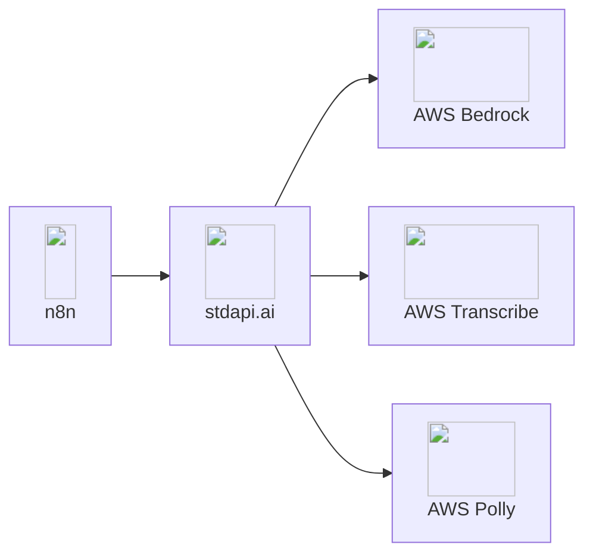

# n8n Integration

Connect n8n automation workflows to Amazon Bedrock models through stdapi.ai's OpenAI-compatible interface. Use any existing OpenAI template from the n8n marketplace without modification—simply point it to your stdapi.ai instance.

## About n8n

**🔗 Links:** [Website](https://n8n.io/) | [GitHub](https://github.com/n8n-io/n8n) | [Documentation](https://docs.n8n.io/)

n8n is a fair-code licensed workflow automation platform that enables you to connect any app with an API to build powerful automations. With its intuitive visual interface, you can create complex workflows without writing code by connecting pre-built nodes for popular services or extending functionality with custom JavaScript. Whether you're automating customer support, data processing, content creation, or business operations, n8n provides the flexibility to self-host or use their cloud platform, making it a popular choice for teams that need control over their automation infrastructure while maintaining the ability to integrate AI capabilities into their workflows.

**Key Features:**

- ⭐ 100,000+ GitHub stars - Open-source workflow automation tool
- 400+ integrations - Connect with services and APIs
- Visual workflow builder - No-code interface with customization
- Self-hosted or cloud - Deploy anywhere
- AI-native - Built-in nodes for OpenAI and other AI providers

## Why n8n + stdapi.ai?

<div class="grid cards" markdown>

- :material-puzzle: __OpenAI Node Compatible__
  <br>stdapi.ai is fully compatible with n8n's OpenAI nodes. Most workflows, templates, and automations designed for OpenAI work with Bedrock—no code changes required.

- :material-graph-outline: __Visual Workflow Builder__
  <br>Build AI-powered automation with n8n's no-code interface. Connect Bedrock models to 400+ services and APIs through drag-and-drop workflows.

- :material-server-network: __Single Entry Point__
  <br>Access multi-region Bedrock models, AWS Translate, AWS Polly, and more through one unified API endpoint for all your workflows.

- :material-lock: __Privacy & Control__
  <br>All data stays in your AWS environment. Self-hosted workflows with complete infrastructure control and enterprise security.

</div>



## ✅ Prerequisites

!!! info "What You'll Need"
    - ✓ A running n8n instance (cloud or self-hosted)
    - ✓ Your stdapi.ai server URL (e.g., `https://api.example.com`)
    - ✓ Your stdapi.ai server API key

---

## ⚙️ Configuration

### 🔑 Set Up Your Credentials

The foundation of any n8n integration is configuring your API credentials. This one-time setup unlocks all AI capabilities.

!!! example "Creating Your stdapi.ai Credential"
    **In your n8n interface:**

    1. Navigate to **Credentials** menu
    2. Click **Create Credential**
    3. Search and select **"OpenAI"** in the credential list
    4. Configure the following fields:
        ```
        API Key:  YOUR_STDAPI_KEY
        Base URL: https://YOUR_STDAPI_URL/v1
        ```

!!! tip "What This Does"
    By setting a custom Base URL, you redirect all OpenAI API calls to your stdapi.ai instance. n8n will use this credential to authenticate and route requests to Amazon Bedrock models instead of OpenAI's servers.

### 🔧 Configure Nodes

For each node, first select the credentials you previously created in the node parameters. Then, select the model you want to use. If you want to use a model that is not listed, you can enter its ID as an expression in the `Model` parameter.

### 💬 Chat completions

Enables: Text generation and conversational AI in workflows.

!!! example "Supported Node"
    **`OpenAI Chat Model`**

    - Model can be selected directly in the `Model` parameter
    - ⚠️ **Important:** `Use Responses API` parameter must be **unchecked** (Responses API is not supported yet by stdapi.ai)

    n8n calls `POST /v1/chat/completions` (see [Chat Completions API](api_openai_chat_completions.md)), so the model must be a text/chat-capable model from the correct family.

### 📚 Embeddings

Enables: Vector embeddings for semantic search and RAG workflows.

!!! example "Supported Node"
    **`Embeddings OpenAI`**

    - Model can be selected directly in the `Model` parameter

    n8n calls `POST /v1/embeddings` (see [Embeddings API](api_openai_embeddings.md)), so the model must be an embeddings-capable model from the correct family.

### 🎨 Image generation

Enables: Text-to-image creation in workflows.

!!! example "Supported Node"
    **`OpenAI/Generate an image`**

    - Model ID can be entered as expression in the `Model` parameter

    n8n calls `POST /v1/images/generations` (see [Images Generations API](api_openai_images_generations.md)), so the model must be an image-generation model from the correct family.

### 🖼️ Image editing

Enables: Image transformation and editing in workflows.

!!! example "Supported Node"
    **`OpenAI/Edit image`**

    - Model ID can be entered as expression in the `Model` parameter

    n8n calls `POST /v1/images/edits` (see [Images Edits API](api_openai_images_edits.md)), so the model must be an image-editing model from the correct family.

### 🔊 Audio generation (TTS)

Enables: Text-to-speech audio generation in workflows.

!!! example "Supported Node"
    **`OpenAI/Generate audio`**

    - Model ID can be entered as expression in the `Model` parameter

    n8n calls `POST /v1/audio/speech` (see [Audio Speech API](api_openai_audio_speech.md)), so the model must match the text-to-speech modality and family.

### ⚠️ Unsupported Nodes

The following nodes are not yet supported:

!!! warning "Known Limitations"
    - **`OpenAI/Message a model`** — Requires Responses API (not supported yet by stdapi.ai). Use `OpenAI Chat Model` instead.
    - **`OpenAI/Analyze image`** — Requires Responses API (not supported yet by stdapi.ai). Use `OpenAI Chat Model` instead.
    - **`OpenAI/Transcribe a recording`** — This node doesn't allow selecting the model
