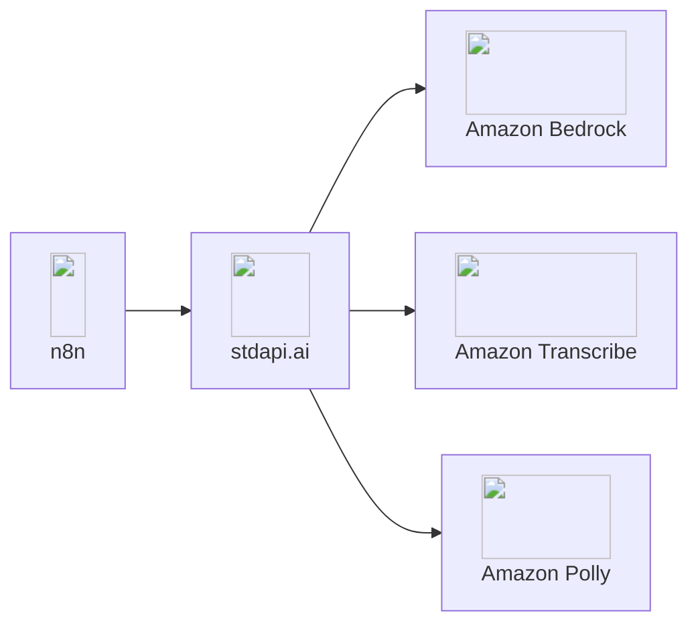
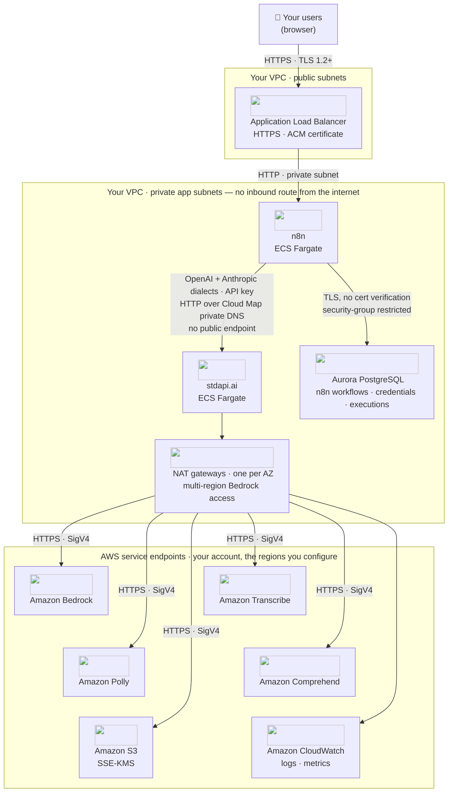

# :material-sitemap: n8n Integration

Connect n8n automation workflows to Amazon Bedrock models through stdapi.ai's OpenAI-compatible or Anthropic-compatible interfaces. Existing OpenAI and Anthropic templates from the n8n marketplace need the credential repointed at your stdapi.ai instance—base URL and API key—and, only where a template's model name isn't one your deployment serves, the node's model changed to one that is, chosen from every provider in the catalogue rather than one vendor's list.

## :material-information-outline: About n8n

**🔗 Links:** [Website](https://n8n.io/) | [GitHub](https://github.com/n8n-io/n8n) | [Documentation](https://docs.n8n.io/)

n8n is a powerful workflow automation platform that enables you to connect any app with an API to build intelligent automations. With its intuitive visual interface, you can create complex AI-powered workflows without writing code, connecting Amazon Bedrock models to hundreds of services including Slack, Google Sheets, Salesforce, and more.

**Key Features:**

- ⭐ **190,000+ GitHub stars** - Leading open-source workflow automation platform
- **Hundreds of integrations** - Pre-built nodes for popular services and APIs
- **Visual no-code builder** - Drag-and-drop interface with JavaScript customization
- **Self-hosted or cloud** - Deploy on your infrastructure or use n8n Cloud
- **AI-native platform** - Built-in OpenAI nodes work instantly with Amazon Bedrock via stdapi.ai
- **Template marketplace** - Thousands of pre-built workflows ready to use

## :material-help-circle-outline: Why n8n + stdapi.ai?

<div class="grid cards" markdown>

- :material-puzzle: __Use Existing OpenAI Templates__
  <br>stdapi.ai works with n8n's OpenAI nodes. Thousands of marketplace templates and workflows designed for OpenAI run on Amazon Bedrock—zero modifications needed.

- :material-robot: __Use Existing Anthropic Templates__
  <br>stdapi.ai works with n8n's Anthropic nodes. Templates and workflows designed for Anthropic Claude run on Amazon Bedrock—zero modifications needed.

- :material-aws: __Access Amazon Bedrock Models__
  <br>Claude, Nova, Llama, DeepSeek, Stable Diffusion, and 100+ models available in n8n workflows. Switch models without changing automation logic.

- :material-graph-outline: __Automate Business Processes__
  <br>Connect Amazon Bedrock AI to Slack, Salesforce, Google Workspace, databases, and hundreds of other services. Build intelligent automation with no-code drag-and-drop.

- :material-lock: __Enterprise Data Control__
  <br>All AI processing stays in your AWS account. Self-host n8n and stdapi.ai for complete data sovereignty and compliance.

- :material-currency-usd-off: __Pay-Per-Use Pricing__
  <br>No OpenAI subscriptions or per-automation fees. Pay only Amazon Bedrock rates for actual AI usage in your workflows.

</div>



## :material-connection: Connect Your Own Instance

Point any running n8n instance—self-hosted or n8n Cloud—at your stdapi.ai gateway. Nothing below requires the AWS sample in [Part 2](#deploy-the-full-stack-on-aws).

### :material-check-circle: Prerequisites

!!! info "What You'll Need"
    - ✓ **stdapi.ai deployed** - [See deployment guide](operations_getting_started.md)
    - ✓ **Your stdapi.ai URL** - e.g., `https://api.example.com`
    - ✓ **Your API key** - From Terraform output or configuration
    - ✓ **n8n instance** - Self-hosted or [n8n Cloud](https://n8n.io/cloud/)

### :material-cog: Configuration

!!! note "Model modality"
    In every section below, the selected model must match the operation's modality — chat nodes need a chat model, embedding nodes an embedding model, and so on.

#### { style="height: 1.2em; vertical-align: text-bottom;" } OpenAI Nodes

##### :material-key: Set Up Your Credentials

The foundation of any n8n integration is configuring your API credentials. This one-time setup unlocks all AI capabilities.

!!! example "Creating Your stdapi.ai Credential"
    **In your n8n interface:**

    1. Navigate to **Credentials** menu
    2. Click **Create Credential**
    3. Search and select **"OpenAI"** in the credential list
    4. Configure the following fields:
        ```
        API Key:  YOUR_STDAPI_KEY
        Base URL: https://YOUR_STDAPI_URL/v1
        ```

!!! tip "What This Does"
    By setting a custom Base URL, you redirect all OpenAI API calls to your stdapi.ai instance. n8n will use this credential to authenticate and route requests to Amazon Bedrock models instead of OpenAI's servers.

##### :material-cog-outline: Configure Nodes

For each node, first select the credentials you previously created in the node parameters. Then, select the model you want to use. If you want to use a model that is not listed, you can enter its ID as an expression in the `Model` parameter.

Operation names below match V2 of the n8n OpenAI node (n8n 1.117.0 and later); older versions use slightly different names (e.g. `Message a model` instead of `Generate a Model Response`).

##### :material-chat-outline: Chat Completions

Enables: Text generation and conversational AI in workflows.

!!! example "Supported Node"
    **`OpenAI Chat Model`**

    - Model can be selected directly in the `Model` parameter
    - Sub-node for AI Agent and chain nodes
    - The **Use Responses API** option works either way: enabled calls `POST /v1/responses` (see [Responses API](api_openai_responses.md)), disabled calls `POST /v1/chat/completions` (see [Chat Completions API](api_openai_chat_completions.md))

##### :material-message-text: Text Generation

Enables: Text generation using the OpenAI Responses or Chat Completions APIs.

!!! example "Supported Nodes"
    **`OpenAI/Generate a Model Response`**

    - Model can be selected directly in the `Model` parameter

    n8n calls `POST /v1/responses` (see [Responses API](api_openai_responses.md)).

    ---

    **`OpenAI/Generate a Chat Completion`**

    - Model can be selected directly in the `Model` parameter

    n8n calls `POST /v1/chat/completions` (see [Chat Completions API](api_openai_chat_completions.md)).

##### :material-text-box-outline: Legacy Completions

Enables: raw prompt completion in LangChain-based chains, as an alternative to the chat-based nodes above.

!!! example "Supported Node"
    **`OpenAI Model`** (`@n8n/n8n-nodes-langchain.lmOpenAi`)

    - Sub-node feeding a Basic LLM Chain or similar LangChain node — distinct from the **`OpenAI Chat Model`** sub-node above
    - Model can be selected directly in the `Model` parameter

    n8n calls `POST /v1/completions` (see [Completions API](api_openai_completions.md)).

##### :material-shield-check: Text Moderation

Enables: Content safety classification in workflows.

!!! example "Supported Node"
    **`OpenAI/Classify Text for Violations`**

    - Works out of the box with OpenAI's default moderation model names
    - `omni-moderation-latest` maps to your configured Bedrock guardrail (or to Amazon Comprehend toxicity detection when no guardrail is set); `text-moderation-latest` maps to Amazon Comprehend toxicity detection

    n8n calls `POST /v1/moderations` (see [Moderations API](api_openai_moderations.md)).

##### :material-database: Embeddings

Enables: Vector embeddings for semantic search and RAG workflows.

!!! example "Supported Node"
    **`Embeddings OpenAI`**

    - Model can be selected directly in the `Model` parameter

    n8n calls `POST /v1/embeddings` (see [Embeddings API](api_openai_embeddings.md)).

##### :material-image-search: Image Analysis

Enables: Image understanding and analysis in workflows.

!!! example "Supported Node"
    **`OpenAI/Analyze Image`**

    - Model can be selected directly in the `Model` parameter

    n8n calls `POST /v1/responses` with image input (see [Responses API](api_openai_responses.md)); the model must support vision.

##### :material-image: Image Generation

Enables: Text-to-image creation in workflows.

!!! example "Supported Node"
    **`OpenAI/Generate an Image`**

    - Model ID can be entered as expression in the `Model` parameter

    n8n calls `POST /v1/images/generations` (see [Images Generations API](api_openai_images_generations.md)).

##### :material-image-edit: Image Editing

Enables: Image transformation and editing in workflows.

!!! example "Supported Node"
    **`OpenAI/Edit an Image`**

    - Model ID can be entered as expression in the `Model` parameter

    n8n calls `POST /v1/images/edits` (see [Images Edits API](api_openai_images_edits.md)).

##### :material-video: Video Generation

Enables: Asynchronous text-to-video generation in workflows.

!!! example "Supported Node"
    **`OpenAI/Generate a Video`**

    - Model ID can be entered as expression in the `Model` parameter
    - Set **Wait Time** high enough for the job to finish—the node polls the job until it completes before returning, so the workflow blocks for the full generation time

    n8n calls `POST /v1/videos` (see [Videos API](api_openai_videos.md)), including status polling and content download.

##### :material-volume-high: Audio Generation (TTS)

Enables: Text-to-speech audio generation in workflows.

!!! example "Supported Node"
    **`OpenAI/Generate Audio`**

    - Model ID can be entered as expression in the `Model` parameter
    - **Or use OpenAI model names directly:** `tts-1` and `tts-1-hd` work by default thanks to built-in model aliases

    n8n calls `POST /v1/audio/speech` (see [Audio Speech API](api_openai_audio_speech.md)).

    A single node call takes up to [100,000 characters](api_openai_audio_speech.md#long-input) — 24× the upstream limit — so a whole article or report becomes one audio file instead of a split-and-concatenate branch. Past 3,000 characters the deployment needs a bucket for the serving region; generative voices reach 20,000 without one.

##### :material-microphone: Audio Transcription (STT)

Enables: Speech-to-text transcription in workflows.

!!! example "Supported Node"
    **`OpenAI/Transcribe a Recording`**

    - Works out of the box with OpenAI's `whisper-1` model name
    - The model alias automatically maps to `amazon.transcribe`

    n8n calls `POST /v1/audio/transcriptions` (see [Audio Transcriptions API](api_openai_audio_transcriptions.md)).

##### :material-translate: Audio Translation

Enables: Translating speech in any supported language into English text.

!!! example "Supported Node"
    **`OpenAI/Translate a Recording`**

    - Works out of the box with OpenAI's `whisper-1` model name
    - The model alias automatically maps to `amazon.transcribe`; Bedrock speech-to-text models (e.g. Mistral Voxtral) also work

    n8n calls `POST /v1/audio/translations` (see [Audio Translations API](api_openai_audio_translations.md)).

##### :material-file-upload: Files

Enables: Upload files once and reference them across multiple chat completion requests without resending the raw bytes each time.

n8n calls the `/v1/files` endpoints (see [Files API](api_openai_files.md)). Set **Resource** to **"Files"** in the OpenAI node for all operations below.

!!! example "Upload a file — `OpenAI/Upload a File`"
    Uploads a file to S3 and returns a `file_id` for use in subsequent requests.

    **Node parameters:**

    - **Resource:** Files
    - **Operation:** Upload a File
    - **Input Data Field Name:** name of the binary field containing the file
    - **Purpose:** intended purpose (e.g. `assistants`, `user_data`)

    **Typical workflow pattern:**

    1. Receive or fetch a file (PDF, image, etc.) in an earlier node
    2. Pass the binary data to this node
    3. Store the returned `file_id` in a variable or database
    4. Pass `file_id` in `OpenAI Chat Model` messages via the `type: "file"` content part for repeated analysis without re-uploading

!!! example "Delete a file — `OpenAI/Delete a File`"
    Permanently deletes a file from S3 by its `file_id`.

    **Node parameters:**

    - **Resource:** Files
    - **Operation:** Delete a File
    - **File ID:** the `file_id` of the file to delete

!!! example "List files — `OpenAI/List Files`"
    Returns a paginated list of uploaded files, optionally filtered by purpose.

    **Node parameters:**

    - **Resource:** Files
    - **Operation:** List Files
    - **Purpose:** _(optional)_ filter results to a specific purpose
    - **Return All / Limit:** control pagination; enable **Return All** or set **Limit** for the first page

    Files are returned in descending order (newest first) by default.

##### :material-package-variant-closed: Bulk Runs (Batch API)

Enables: running thousands of chat completion or embedding requests asynchronously, at the Amazon Bedrock batch price rather than the synchronous one.

n8n ships no node for the [Batch API](api_openai_batches.md) — the OpenAI node's resources stop at text, images, audio and files — so drive it with **HTTP Request** nodes, as the Cohere routes are reached [below](#known-limitations):

1. Build the request set as JSONL, one line per item with its own `custom_id`, and upload it with `purpose=batch` (`OpenAI/Upload a File` when its **Purpose** list offers it, an HTTP Request against `POST /v1/files` otherwise)
2. `POST /v1/batches` with that file id, then poll `GET /v1/batches/{id}` behind a **Wait** node until it reports `completed`
3. Download the output file and match each line back to its `custom_id` — results may arrive in any order

Worth the extra nodes when a workflow classifies, enriches or summarizes a large backlog overnight and nothing is waiting on the answer. Interactive workflows stay on the synchronous nodes above.

---

#### { style="height: 1.2em; vertical-align: text-bottom;" } Anthropic Nodes

##### :material-key: Set Up Your Credentials

!!! example "Creating Your stdapi.ai Anthropic Credential"
    **In your n8n interface:**

    1. Navigate to **Credentials** menu
    2. Click **Create Credential**
    3. Search and select **"Anthropic"** in the credential list
    4. Configure the following fields:
        ```
        API Key:  YOUR_STDAPI_KEY
        Base URL: https://YOUR_STDAPI_URL/anthropic
        ```

!!! tip "Anthropic Base URL"
    By default, all Anthropic-compatible routes are prefixed with `/anthropic`, so the Base URL must end with `/anthropic`. You can customize this prefix using the `ANTHROPIC_ROUTES_PREFIX` configuration variable documented in [Operations Configuration](operations_configuration.md#anthropic-routes-prefix).

##### :material-cog-outline: Configure Nodes

For each node, first select the credentials you previously created in the node parameters. Then, select the model you want to use. The model can be selected directly in the `Model` parameter for all supported nodes.

##### :material-chat-outline: Chat Completions

Enables: Text generation and conversational AI in workflows.

!!! example "Supported Nodes"
    **`Anthropic Chat Model`**

    - Model can be selected directly in the `Model` parameter
    - Sub-node for AI Agent and chain nodes

    ---

    **`Anthropic/Message a Model`**

    - Model can be selected directly in the `Model` parameter

    n8n calls `POST /anthropic/v1/messages` (see [Anthropic Messages API](api_anthropic_messages.md)).

##### :material-image-search: Image Analysis

Enables: Image understanding and analysis in workflows.

!!! example "Supported Node"
    **`Anthropic/Analyze Image`**

    - Model can be selected directly in the `Model` parameter

    n8n calls `POST /anthropic/v1/messages` with image content (see [Anthropic Messages API](api_anthropic_messages.md)); the model must support vision.

##### :material-file-document: Document Analysis

Enables: Document understanding and extraction in workflows.

!!! example "Supported Node"
    **`Anthropic/Analyze Document`**

    - Model can be selected directly in the `Model` parameter

    n8n calls `POST /anthropic/v1/messages` with document content (see [Anthropic Messages API](api_anthropic_messages.md)); the model must support document processing.

##### :material-file-upload: Files

Enables: Upload files once and reference them across multiple Messages requests as document or image sources.

n8n calls the `/anthropic/v1/files` endpoints (see [Anthropic Files API](api_anthropic_files.md)). Set **Resource** to **"Files"** in the Anthropic node for all operations below.

!!! example "Upload a file — `Anthropic/Upload File`"
    Uploads a file to S3 and returns a `file_id` for use in subsequent Messages requests.

    **Node parameters:**

    - **Resource:** Files
    - **Operation:** Upload File
    - **Input Data Field Name:** name of the binary field containing the file

    **Typical workflow pattern:**

    1. Receive or fetch a file (PDF, image, etc.) in an earlier node
    2. Pass the binary data to this node
    3. Store the returned `file_id` in a variable or database
    4. Pass `file_id` as a `source: {type: "file"}` in `Anthropic/Message a Model` document or image blocks

!!! example "Get file metadata — `Anthropic/Get File Metadata`"
    Retrieves metadata (filename, MIME type, size, creation date) for a file by its `file_id`.

    **Node parameters:**

    - **Resource:** Files
    - **Operation:** Get File Metadata
    - **File ID:** the `file_id` of the file to retrieve

!!! example "List files — `Anthropic/List Files`"
    Returns a paginated list of uploaded files.

    **Node parameters:**

    - **Resource:** Files
    - **Operation:** List Files
    - **Return All / Limit:** control pagination; enable **Return All** or set **Limit** for the first page

    Files are returned most recently created first. Use `after_id` / `before_id` cursors for bidirectional pagination.

!!! example "Delete a file — `Anthropic/Delete File`"
    Permanently deletes a file from S3 by its `file_id`.

    **Node parameters:**

    - **Resource:** Files
    - **Operation:** Delete File
    - **File ID:** the `file_id` of the file to delete

##### :material-lightbulb-outline: Prompt Resource

The Anthropic node's **Prompt** resource (`Generate Prompt`, `Improve Prompt`, `Templatize Prompt`) calls Anthropic's experimental prompt tools endpoints, which are not part of the Amazon Bedrock API surface and are not available through stdapi.ai. Use a `Message a Model` node with prompt-engineering instructions instead.

### :material-alert-outline: Known Issues { #known-limitations }

n8n's Cohere sub-nodes—**Cohere Reranker** (used by vector store nodes for hybrid search) and **Embeddings Cohere**—cannot be pointed at stdapi.ai. Their shared `cohereApi` credential exposes only an API key: its base URL is a hidden field pinned to Cohere's own endpoint, and both nodes build their client from the API key and the model alone, so that URL never reaches the request anyway.

- **Reranking:** use an **HTTP Request** node against `POST /cohere/v2/rerank` (see [Cohere Rerank API](api_cohere_rerank.md)), or a framework with a configurable reranker base URL—see [RAG Pipelines](use_cases_rag.md).
- **Embeddings:** use the **Embeddings OpenAI** node described [above](#embeddings), which reaches the same Amazon Bedrock models through `/v1/embeddings`; an **HTTP Request** node against `POST /cohere/v2/embed` (see [Cohere Embed API](api_cohere_embed.md)) works too, but its output cannot be fed to a vector store sub-node.

## :material-rocket-launch: Deploy the Full Stack on AWS

The Terraform sample below is one worked example of a credible AWS deployment, not the only architecture that works. stdapi.ai's gateway is a normal HTTP service, and n8n can run wherever you already operate it—your own ECS, EKS, EC2, another cloud, or a laptop. The sample's README documents where you would reasonably diverge from what it builds (networking, worker capacity, database, queue broker).

### :material-sitemap: Architecture

The diagram below is the topology the [sample](#whats-included) builds: n8n and the stdapi.ai gateway both on ECS Fargate in one VPC you own, with n8n's own workflow state in Aurora PostgreSQL alongside them.



Two properties are worth reading off the picture. n8n is the only service with a public address — the ALB forwards nothing but n8n traffic, and the stdapi.ai gateway has no listener of its own, reachable only through Cloud Map private DNS inside the VPC. Customer data then splits in two: n8n's own workflow definitions, credentials and execution history live in Aurora, inside the account boundary, while whatever a workflow sends to a model passes through the gateway straight to Amazon Bedrock and the other AWS AI services behind it — no third party sits between your workflows and your models.

#### What Each AWS Service Does Here

| AWS service | Role in this integration | Where it is configured |
| --- | --- | --- |
| **Amazon ECS on AWS Fargate** | Runs n8n and the stdapi.ai gateway as separate services, plus a one-shot "import" task that seeds the credential and sample workflows | Terraform sample (`n8n.tf`, `main.tf`) |
| **Elastic Load Balancing** | The single public entry point; terminates TLS with an ACM certificate and forwards only to n8n | Terraform sample (`alb.tf`) |
| **AWS Cloud Map** | Private DNS name that lets n8n reach the gateway without exposing it | Terraform sample (`service_discovery_dns_name`) |
| **Amazon Bedrock** | Chat, text and image generation, embeddings, video generation | [`AWS_BEDROCK_REGIONS`](operations_configuration.md#aws-bedrock-regions) |
| **Amazon Transcribe** | Speech-to-text, behind `POST /v1/audio/transcriptions` and `/v1/audio/translations` | [Audio Transcription (STT)](#audio-transcription-stt) |
| **Amazon Polly** | Spoken replies, behind `POST /v1/audio/speech` | [Audio Generation (TTS)](#audio-generation-tts) |
| **Amazon Comprehend** | Toxicity fallback for `POST /v1/moderations` when no guardrail is configured | [Comprehend Moderation](operations_iam_permissions.md#comprehend-moderation) |
| **Amazon Aurora PostgreSQL** | n8n's own database — workflow definitions, credentials and execution history; Serverless v2, storage encrypted | Terraform sample (`postgres.tf`) |
| **Amazon S3** | The gateway's Files API uploads, long text-to-speech input, and generated image/video output | [S3 storage](operations_compliance.md#s3-data-storage) |
| **AWS KMS** | Two customer-managed keys: one for the gateway's S3 bucket and CloudWatch Logs, another for Aurora storage and the Postgres secret | Terraform sample |
| **AWS Secrets Manager** | Holds the Aurora master password, read only at deploy time — via the RDS Data API — to provision n8n's database role | Terraform sample (`postgres.tf`) |
| **Amazon CloudWatch** | Container logs, gateway request logs and, optionally, EMF usage metrics | [Logging & monitoring](operations_logging_monitoring.md) |
| **AWS IAM** | Separate least-privilege task roles for n8n and the gateway; the gateway's role grants only the AI-service and S3 actions it calls | [IAM permissions](operations_iam_permissions.md) |

#### Security Measures in This Flow

- **Authentication** — n8n reaches the gateway with a stdapi.ai [API key](operations_authentication_security.md#api-key-authentication) that Terraform generates (`api_key_create = true`) and seeds directly into n8n's own credential store at first start.
- **Encryption in transit** — HTTPS with TLS 1.2+ from the browser to the ALB; HTTP from n8n to the gateway, confined to the private subnet and reachable only through Cloud Map private DNS; TLS without certificate verification from n8n to Aurora, a connection that never leaves the VPC and is already restricted by security group; HTTPS with SigV4 from the gateway to each AWS service.
- **Encryption at rest** — SSE-KMS on the gateway's S3 bucket and CloudWatch Logs; separately, encrypted Aurora storage and the Postgres secret under the VPC module's own KMS key.
- **Least privilege** — each ECS task assumes its own role; the gateway's role carries no permission for Aurora or its Secrets Manager secret, and n8n's role carries none for Amazon Bedrock, Transcribe, Polly or Comprehend.
- **Content policy** — a [Bedrock guardrail](operations_configuration.md#bedrock-guardrails) configured on the gateway applies to every route n8n uses, including the mapping [Text Moderation](#text-moderation) already documents for `omni-moderation-latest`.
- **Data handling** — the gateway is stateless and holds request bodies in memory only, so nothing a workflow sends to a model is persisted outside Amazon Bedrock's own call; n8n's own workflow data — credentials, executions — stays in Aurora inside the account boundary.

### :material-cube-outline: What's Included

Deploy n8n + stdapi.ai together, with a credential and thirteen sample workflows already imported:

**📦 [stdapi-ai/samples/getting_started_n8n](https://github.com/stdapi-ai/samples/tree/main/getting_started_n8n)**

**What's included:**

- n8n on ECS Fargate, backed by Aurora PostgreSQL
- stdapi.ai gateway connected to Amazon Bedrock, preconfigured as both an OpenAI and an Anthropic n8n credential
- Thirteen sample workflows — one per stdapi.ai route family — imported automatically on first start
- Owner account pre-provisioned non-interactively, no signup screen to click through
- HTTPS-only ALB on your own domain (required — n8n's session cookie needs it)
- No local image build — the official `n8nio/n8n` image is pulled directly from Docker Hub

**Deploy:**

```bash
git clone https://github.com/stdapi-ai/samples.git
cd samples/getting_started_n8n/terraform
tofu init
tofu apply
```

### :material-gauge: What It Costs to Run

| Charge | Driver |
| --- | --- |
| stdapi.ai licence | $0.10 per gateway container-hour, metered through AWS Marketplace, with a 14-day free trial on the licence |
| ECS Fargate | Two steady services — n8n and the gateway — each sized independently, plus the one-shot import task that seeds credentials and workflows |
| Load balancing and networking | One ALB, plus the NAT gateways the private subnets egress through for multi-region Bedrock access |
| Aurora Serverless v2 | Scales with query load; the sample sets a minimum capacity of zero ACUs |
| Model and AI-service usage | Amazon Bedrock, Transcribe, Polly and Comprehend at AWS rates, billed to your account with no markup |

Read a model's price before a workflow sends anything to it with [`GET /model_pricing`](api_model_pricing.md). Setting [`COST_TRACKING=true`](operations_cost_management.md#cost-tracking-real-time-aws-pricing) additionally puts a per-request cost on each usage entry — estimated from published AWS prices, not read back from your invoice.

### :material-eye-outline: What to Watch

The gateway writes one structured `request` event per call, carrying the request id, path, status code, `execution_time_ms`, the model that served it (`model_id`), and the token, character and second counts AWS billed. A workflow that fires on a schedule has no one watching its output in real time, so whether its calls are succeeding matters more than for an interactive chat session:

```sql
fields model_id, path, status_code
| filter type = "request" and status_code >= 400
| stats count(*) as failures by model_id, path, status_code
| sort failures desc
```

Turning on [`CLOUDWATCH_METRICS`](operations_logging_monitoring.md#cloudwatch-metrics-emf) republishes the same counts as CloudWatch metrics in the `stdapi` namespace, dimensioned by `Model`, so an alarm can fire on a rising failure count without a scheduled query.

## :material-arrow-right: Next Steps

<div class="grid cards" markdown>

- :material-rocket-launch: [**Getting Started**](operations_getting_started.md) — Deploy stdapi.ai to AWS with Terraform
- :material-docker: [**Local Development**](operations_getting_started_local.md) — Run stdapi.ai locally with Docker
- :material-puzzle: [**More Use Cases**](use_cases.md) — Explore other integrations and tools
- :material-api: [**API Overview**](api_overview.md) — Explore supported endpoints

</div>
