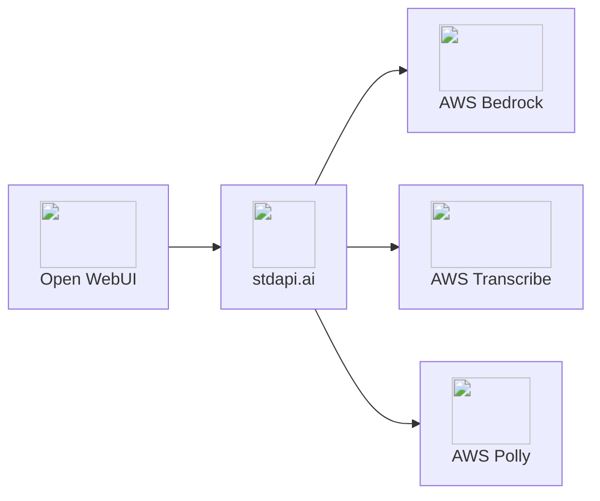

# Open WebUI Integration

Connect Open WebUI to stdapi.ai as an OpenAI-compatible backend. Access Amazon Bedrock models through Open WebUI's chat interface with no code changes required.

## About Open WebUI

**🔗 Links:** [Website](https://openwebui.com/) | [GitHub](https://github.com/open-webui/open-webui) | [Documentation](https://docs.openwebui.com/)

Open WebUI is an extensible, feature-rich, and user-friendly self-hosted web interface designed to operate entirely offline. It serves as a powerful frontend for large language models, offering a ChatGPT-like experience while maintaining complete control over your data and infrastructure. The platform supports multiple AI providers through a unified interface, making it an ideal choice for organizations and individuals who need enterprise-grade AI capabilities without compromising privacy or relying on external cloud services.

**Key Features:**

- ⭐ 100,000+ GitHub stars - Popular open-source AI web interface
- Feature-complete chat interface
- Multi-modal: chat, voice, images, and document RAG
- Extensible: plugins, custom functions, and community tools
- Privacy-focused: self-hosted with no external dependencies

## Why Open WebUI + stdapi.ai?

<div class="grid cards" markdown>

- :material-swap-horizontal: __Drop-in Replacement__
  <br>stdapi.ai acts as an OpenAI-compatible backend. Configure Open WebUI once, then use Amazon Bedrock models through a familiar interface.

- :material-application-cog: __Multi-Modal Experience__
  <br>Familiar chat interface with text, voice, images, and documents. RAG, embeddings, and visual content—all powered by Bedrock.

- :material-server-network: __Single Entry Point__
  <br>Access multi-region Bedrock models, AWS Translate, AWS Polly, and more through one unified API endpoint.

- :material-lock: __Privacy & Control__
  <br>All data stays in your AWS environment. Self-hosted deployment with complete infrastructure control and enterprise security.

</div>



## ✅ Prerequisites

!!! info "What You'll Need"
    - ✓ A running Open WebUI instance
    - ✓ Your stdapi.ai server URL (e.g., `https://api.example.com`)
    - ✓ Your stdapi.ai server API key

---

## ⚙️ Configuration

Open WebUI is configured entirely through environment variables. The sections below focus on the stdapi.ai integration. Use the same stdapi.ai key for all `*_OPENAI_API_KEY` entries. For more details on Open WebUI settings, refer to the official [Open WebUI Environment Variable Configuration](https://docs.openwebui.com/getting-started/env-configuration/) documentation.

### 💬 Core connection

Enables: Chat completions and Open WebUI background tasks (titles, summarization).

!!! example "Environment Variables"
    ```bash
    OPENAI_API_BASE_URL=https://YOUR_STDAPI_URL/v1
    OPENAI_API_KEY=YOUR_STDAPI_KEY
    TASK_MODEL_EXTERNAL=amazon.nova-micro-v1:0
    ```

Use a fast, low-cost chat model for `TASK_MODEL_EXTERNAL`. Open WebUI calls `POST /v1/chat/completions` for chat and background tasks (see [Chat Completions API](api_openai_chat_completions.md)), so the model must be a text/chat-capable model from the correct family for your Bedrock region.

### 📚 RAG embeddings

Enables: Document ingestion and semantic search for RAG.

!!! example "Environment Variables"
    ```bash
    RAG_EMBEDDING_ENGINE=openai
    RAG_OPENAI_API_BASE_URL=https://YOUR_STDAPI_URL/v1
    RAG_OPENAI_API_KEY=YOUR_STDAPI_KEY
    RAG_EMBEDDING_MODEL=cohere.embed-v4:0
    ```

Pick any embedding model you prefer. Open WebUI calls `POST /v1/embeddings` (see [Embeddings API](api_openai_embeddings.md)), so the model must be an embeddings-capable model from the correct family.

### 🎨 Image generation

Enables: Text-to-image creation inside chats.

!!! example "Environment Variables"
    ```bash
    ENABLE_IMAGE_GENERATION=true
    IMAGE_GENERATION_ENGINE=openai
    IMAGES_OPENAI_API_BASE_URL=https://YOUR_STDAPI_URL/v1
    IMAGES_OPENAI_API_KEY=YOUR_STDAPI_KEY
    IMAGE_GENERATION_MODEL=stability.stable-image-core-v1:1
    ```

Choose any image generation model you prefer. Open WebUI calls `POST /v1/images/generations` (see [Images Generations API](api_openai_images_generations.md)), so the model must be an image-generation model from the correct family.

### 🖼️ Image editing

Use Open WebUI's image editor to upload an image and describe the change. Masking is not configured.

Enables: Image edits and transformations in the editor.

!!! example "Environment Variables"
    ```bash
    ENABLE_IMAGE_EDIT=true
    IMAGE_EDIT_ENGINE=openai
    IMAGES_EDIT_OPENAI_API_BASE_URL=https://YOUR_STDAPI_URL/v1
    IMAGES_EDIT_OPENAI_API_KEY=YOUR_STDAPI_KEY
    IMAGE_EDIT_MODEL=stability.stable-image-control-structure-v1:0
    ```

Pick any image-editing model that supports edits without a mask. Open WebUI calls `POST /v1/images/edits` (see [Images Edits API](api_openai_images_edits.md)), so the model must be an image-editing model from the correct family.

### 🎙️ Speech to text (STT)

Enables: Voice input and audio transcription.

!!! example "Environment Variables"
    ```bash
    AUDIO_STT_ENGINE=openai
    AUDIO_STT_OPENAI_API_BASE_URL=https://YOUR_STDAPI_URL/v1
    AUDIO_STT_OPENAI_API_KEY=YOUR_STDAPI_KEY
    AUDIO_STT_MODEL=amazon.transcribe
    ```

Choose any STT model you prefer. Open WebUI calls `POST /v1/audio/transcriptions` (see [Audio Transcriptions API](api_openai_audio_transcriptions.md)), so the model must match the speech-to-text modality and family.

### 🔊 Text to speech (TTS)

Enables: Spoken responses from chat outputs.

!!! example "Environment Variables"
    ```bash
    AUDIO_TTS_ENGINE=openai
    AUDIO_TTS_OPENAI_API_BASE_URL=https://YOUR_STDAPI_URL/v1
    AUDIO_TTS_OPENAI_API_KEY=YOUR_STDAPI_KEY
    AUDIO_TTS_MODEL=amazon.polly-neural
    ```

Choose any TTS model you prefer. Open WebUI calls `POST /v1/audio/speech` (see [Audio Speech API](api_openai_audio_speech.md)), so the model must match the text-to-speech modality and family.

!!! warning "TTS language detection"
    Open WebUI generates audio in small chunks, which makes language auto-detection inconsistent. Disable auto-detection by setting the stdapi.ai environment variable `DEFAULT_TTS_LANGUAGE` to a fixed language (for example, `en-US`).
---

## 🚀 Deployment

We recommend using the Terraform sample for deployment:

- [stdapi-ai/samples/getting_started_openwebui](https://github.com/stdapi-ai/samples/tree/main/getting_started_openwebui)

This sample provisions Open WebUI on ECS Fargate, wires all environment variables above, connects it to stdapi.ai, and includes Elasticache Valkey, Aurora PostgreSQL with vector extension, web search with SearXNG, plus web scraping with Playwright.

---

## ⚠️ Known issues

Open WebUI may list all available models in the chat model selector, including models that do not support chat completions (Like image or embedding models). Disable incompatible models in the Open WebUI admin panel.
