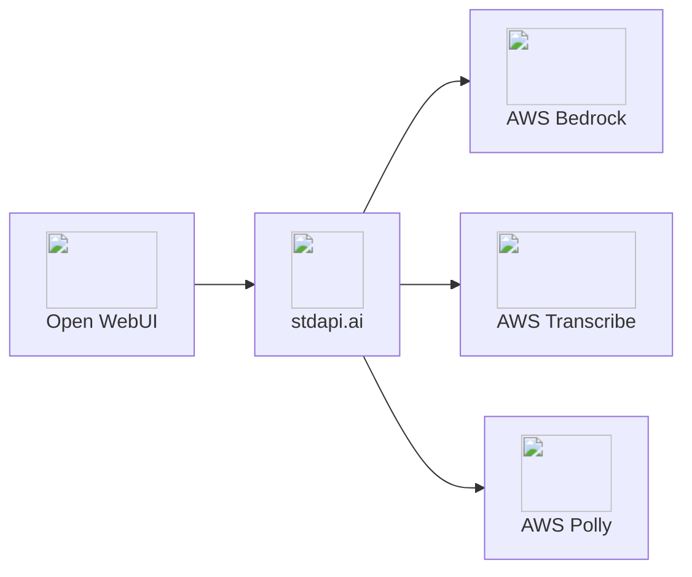

# Open WebUI Integration

Connect Open WebUI to stdapi.ai as an OpenAI-compatible backend. Access AWS Bedrock models through Open WebUI's chat interface with no code changes required—get a private ChatGPT alternative running on your AWS infrastructure.

## About Open WebUI

**🔗 Links:** [Website](https://openwebui.com/) | [GitHub](https://github.com/open-webui/open-webui) | [Documentation](https://docs.openwebui.com/)

Open WebUI is the leading open-source ChatGPT alternative. It provides a feature-rich, self-hosted web interface that operates entirely under your control, offering a ChatGPT-like experience while maintaining complete data privacy.

**Key Features:**

- ⭐ **100,000+ GitHub stars** - Most popular open-source AI chat interface
- **ChatGPT-like UI** - Familiar interface your team already knows
- **Multi-modal capabilities** - Text, voice, images, and document processing
- **RAG & embeddings** - Upload documents, search with semantic understanding
- **Extensible platform** - Plugins, custom functions, and community tools
- **Complete privacy** - Self-hosted, all data stays in your infrastructure

## Why Open WebUI + stdapi.ai?

<div class="grid cards" markdown>

- :material-swap-horizontal: __Zero Configuration Changes__
  <br>stdapi.ai provides OpenAI-compatible API. Just update the endpoint URL—Open WebUI works immediately with AWS Bedrock models.

- :material-aws: __Access AWS Bedrock Models__
  <br>Claude 4.6+ with reasoning, Nova 2, Llama 4, DeepSeek v3.2, Stable Diffusion, and 80+ models through Open WebUI's familiar chat interface.

- :material-application-cog: __Full Multi-Modal Support__
  <br>Text chat, voice input/output, image generation/editing, document RAG—all AWS AI services unified through one interface.

- :material-lock: __Enterprise Data Privacy__
  <br>All processing stays in your AWS account. Complete infrastructure control with AWS security, compliance, and data sovereignty.

- :material-currency-usd-off: __Pay-Per-Use Pricing__
  <br>No ChatGPT subscriptions. Pay only AWS Bedrock rates for actual usage—no monthly minimums or per-user fees.

</div>



## ✅ Prerequisites

!!! info "What You'll Need"
    - ✓ **stdapi.ai deployed** - [See deployment guide](operations_getting_started.md)
    - ✓ **Your stdapi.ai URL** - e.g., `https://api.example.com`
    - ✓ **Your API key** - From Terraform output or configuration
    - ✓ **Open WebUI instance** - Running or ready to deploy (see Deployment section below)

---

## ⚙️ Configuration

Open WebUI is configured entirely through environment variables. The sections below focus on the stdapi.ai integration. Use the same stdapi.ai key for all `*_OPENAI_API_KEY` entries. For more details on Open WebUI settings, refer to the official [Open WebUI Environment Variable Configuration](https://docs.openwebui.com/getting-started/env-configuration/) documentation.

### 💬 Core connection

Enables: Chat completions and Open WebUI background tasks (titles, summarization).

!!! example "Environment Variables"
    ```bash
    OPENAI_API_BASE_URL=https://YOUR_STDAPI_URL/v1
    OPENAI_API_KEY=YOUR_STDAPI_KEY
    TASK_MODEL_EXTERNAL=amazon.nova-micro-v1:0
    ```

Use a fast, low-cost chat model for `TASK_MODEL_EXTERNAL`. Open WebUI calls `POST /v1/chat/completions` for chat and background tasks (see [Chat Completions API](api_openai_chat_completions.md)), so the model must be a text/chat-capable model from the correct family for your Bedrock region.

### 📚 RAG embeddings

Enables: Document ingestion and semantic search for RAG.

!!! example "Environment Variables"
    ```bash
    RAG_EMBEDDING_ENGINE=openai
    RAG_OPENAI_API_BASE_URL=https://YOUR_STDAPI_URL/v1
    RAG_OPENAI_API_KEY=YOUR_STDAPI_KEY
    RAG_EMBEDDING_MODEL=cohere.embed-v4:0
    ```

Pick any embedding model you prefer. Open WebUI calls `POST /v1/embeddings` (see [Embeddings API](api_openai_embeddings.md)), so the model must be an embeddings-capable model from the correct family.

### 🎨 Image generation

Enables: Text-to-image creation inside chats.

!!! example "Environment Variables"
    ```bash
    ENABLE_IMAGE_GENERATION=true
    IMAGE_GENERATION_ENGINE=openai
    IMAGES_OPENAI_API_BASE_URL=https://YOUR_STDAPI_URL/v1
    IMAGES_OPENAI_API_KEY=YOUR_STDAPI_KEY
    IMAGE_GENERATION_MODEL=stability.stable-image-core-v1:1
    ```

Choose any image generation model you prefer. Open WebUI calls `POST /v1/images/generations` (see [Images Generations API](api_openai_images_generations.md)), so the model must be an image-generation model from the correct family.

### 🖼️ Image editing

Use Open WebUI's image editor to upload an image and describe the change. Masking is not configured.

Enables: Image edits and transformations in the editor.

!!! example "Environment Variables"
    ```bash
    ENABLE_IMAGE_EDIT=true
    IMAGE_EDIT_ENGINE=openai
    IMAGES_EDIT_OPENAI_API_BASE_URL=https://YOUR_STDAPI_URL/v1
    IMAGES_EDIT_OPENAI_API_KEY=YOUR_STDAPI_KEY
    IMAGE_EDIT_MODEL=stability.stable-image-control-structure-v1:0
    ```

Pick any image-editing model that supports edits without a mask. Open WebUI calls `POST /v1/images/edits` (see [Images Edits API](api_openai_images_edits.md)), so the model must be an image-editing model from the correct family.

### 🎙️ Speech to text (STT)

Enables: Voice input and audio transcription.

!!! example "Environment Variables"
    ```bash
    AUDIO_STT_ENGINE=openai
    AUDIO_STT_OPENAI_API_BASE_URL=https://YOUR_STDAPI_URL/v1
    AUDIO_STT_OPENAI_API_KEY=YOUR_STDAPI_KEY
    AUDIO_STT_MODEL=amazon.transcribe
    ```

Choose any STT model you prefer. Open WebUI calls `POST /v1/audio/transcriptions` (see [Audio Transcriptions API](api_openai_audio_transcriptions.md)), so the model must match the speech-to-text modality and family.

### 🔊 Text to speech (TTS)

Enables: Spoken responses from chat outputs.

!!! example "Environment Variables"
    ```bash
    AUDIO_TTS_ENGINE=openai
    AUDIO_TTS_OPENAI_API_BASE_URL=https://YOUR_STDAPI_URL/v1
    AUDIO_TTS_OPENAI_API_KEY=YOUR_STDAPI_KEY
    AUDIO_TTS_MODEL=amazon.polly-neural
    ```

Choose any TTS model you prefer. Open WebUI calls `POST /v1/audio/speech` (see [Audio Speech API](api_openai_audio_speech.md)), so the model must match the text-to-speech modality and family.

!!! warning "TTS language detection"
    Open WebUI generates audio in small chunks, which makes language auto-detection inconsistent. Disable auto-detection by setting the stdapi.ai environment variable `DEFAULT_TTS_LANGUAGE` to a fixed language (for example, `en-US`).
---

## 🚀 Deployment

### Option 1: Terraform (Recommended)

Deploy Open WebUI + stdapi.ai together with production infrastructure:

**📦 [stdapi-ai/samples/getting_started_openwebui](https://github.com/stdapi-ai/samples/tree/main/getting_started_openwebui)**

**What's included:**

- Open WebUI on ECS Fargate with auto-scaling
- stdapi.ai gateway connected to AWS Bedrock
- ElastiCache Valkey for caching
- Aurora PostgreSQL with pgvector extension for RAG
- SearXNG for web search integration
- Playwright for web scraping
- HTTPS with ALB and optional WAF
- All environment variables pre-configured

**Deploy:**

```bash
git clone https://github.com/stdapi-ai/samples.git
cd samples/getting_started_openwebui/terraform
terraform init
terraform apply
```

### Option 2: Docker Compose (Local/Development)

For local testing or development:

```bash
# Clone and run
git clone https://github.com/stdapi-ai/samples.git
cd samples/getting_started_openwebui/docker-compose
docker-compose up
```

Access Open WebUI at `http://localhost:3000` with stdapi.ai on `http://localhost:8000`

---

## ⚠️ Known issues

Open WebUI may list all available models in the chat model selector, including models that do not support chat completions (Like image or embedding models). Disable incompatible models in the Open WebUI admin panel.
