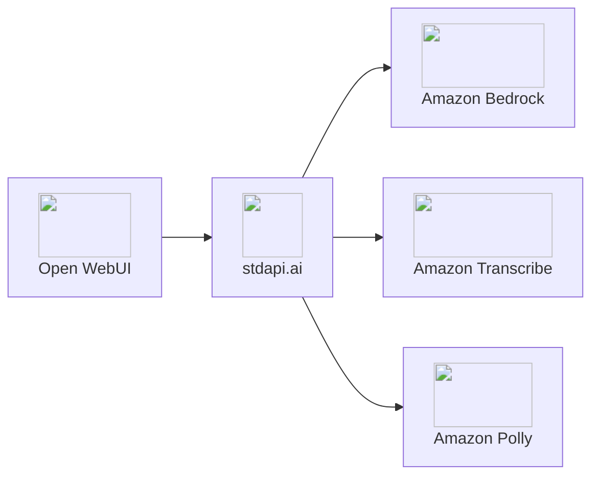

# :material-chat: Open WebUI Integration

Connect Open WebUI to stdapi.ai as an OpenAI-compatible backend. Access Amazon Bedrock models through Open WebUI's chat interface—it works out of the box as a private ChatGPT alternative running on your AWS infrastructure.

## :material-information-outline: About Open WebUI

**🔗 Links:** [Website](https://openwebui.com/) | [GitHub](https://github.com/open-webui/open-webui) | [Documentation](https://docs.openwebui.com/)

Open WebUI is the leading open-source ChatGPT alternative. It provides a feature-rich, self-hosted web interface that operates entirely under your control, offering a ChatGPT-like experience while maintaining complete data privacy.

**Key Features:**

- ⭐ **140,000+ GitHub stars** - Most popular open-source AI chat interface
- **ChatGPT-like UI** - Familiar interface your team already knows
- **Multi-modal capabilities** - Text, voice, images, and document processing
- **RAG & embeddings** - Upload documents, search with semantic understanding
- **Extensible platform** - Plugins, custom functions, and community tools
- **Complete privacy** - Self-hosted, all data stays in your infrastructure

## :material-help-circle-outline: Why Open WebUI + stdapi.ai?

<div class="grid cards" markdown>

- :material-swap-horizontal: __Two Client-Side Changes__
  <br>stdapi.ai provides an OpenAI-compatible API. Update the endpoint URL, then pick a model—Open WebUI's model list is whatever your deployment serves, across every provider in the catalogue.

- :material-aws: __Access Amazon Bedrock Models__
  <br>Claude with reasoning, Nova, Llama, DeepSeek, Stable Diffusion, and 100+ models through Open WebUI's familiar chat interface.

- :material-application-cog: __Full Multi-Modal Support__
  <br>Text chat, voice input/output, image generation/editing, document RAG—all AWS AI services unified through one interface.

- :material-lock: __Enterprise Data Privacy__
  <br>All processing stays in your AWS account. Complete infrastructure control with AWS security, compliance, and data sovereignty.

- :material-currency-usd-off: __Pay-Per-Use Pricing__
  <br>No ChatGPT subscriptions. Pay only Amazon Bedrock rates for actual usage—no monthly minimums or per-user fees.

</div>



## :material-check-circle: Prerequisites

!!! info "What You'll Need"
    - ✓ **stdapi.ai deployed** - [See deployment guide](operations_getting_started.md)
    - ✓ **Your stdapi.ai URL** - e.g., `https://api.example.com`
    - ✓ **Your API key** - From Terraform output or configuration
    - ✓ **Open WebUI instance** - Running or ready to deploy (see Deployment section below)

---

## :material-cog: Configuration

Open WebUI is configured entirely through environment variables. The sections below focus on the stdapi.ai integration. Use the same stdapi.ai key for all `*_OPENAI_API_KEY` entries. For more details on Open WebUI settings, refer to the official [Open WebUI Environment Variable Configuration](https://docs.openwebui.com/getting-started/env-configuration/) documentation.

!!! warning "Each section needs its own connection settings"
    Open WebUI does not fall back from `RAG_OPENAI_*`, `IMAGES_OPENAI_*`, or `AUDIO_*_OPENAI_*` to the core `OPENAI_API_*` pair — a missing pair disables that feature instead of inheriting the Core Connection. Set the base URL, key, and model explicitly for every section you enable.

!!! warning "These settings are read once, on first boot"
    Open WebUI reads its connection settings from the environment only the first time it starts against a given data directory, then stores them in its own database. Changing an environment variable afterwards has no effect until you either update the setting from the admin UI or start from a fresh `DATA_DIR`.

!!! note "Model choice"
    In every section below, pick any Bedrock-available model that matches the operation's modality — a chat model for the Core Connection, an embedding model for RAG Embeddings, and so on.

### :material-connection: Core Connection

Enables: Chat completions and Open WebUI background tasks (titles, summarization).

!!! example "Environment Variables"
    ```bash
    OPENAI_API_BASE_URL=https://YOUR_STDAPI_URL/v1
    OPENAI_API_KEY=YOUR_STDAPI_KEY
    TASK_MODEL_EXTERNAL=amazon.nova-micro-v1:0
    ```

Use a fast, low-cost chat model for `TASK_MODEL_EXTERNAL`. Open WebUI calls `POST /v1/chat/completions` for chat and background tasks (see [Chat Completions API](api_openai_chat_completions.md)).

### :material-database: RAG Embeddings

Enables: Document ingestion and semantic search for RAG.

!!! example "Environment Variables"
    ```bash
    RAG_EMBEDDING_ENGINE=openai
    RAG_OPENAI_API_BASE_URL=https://YOUR_STDAPI_URL/v1
    RAG_OPENAI_API_KEY=YOUR_STDAPI_KEY
    RAG_EMBEDDING_MODEL=cohere.embed-v4:0
    ```

Open WebUI calls `POST /v1/embeddings` (see [Embeddings API](api_openai_embeddings.md)).

### :material-sort-variant: RAG Reranking

Enables: Hybrid search, with retrieved documents reordered by relevance before they reach the model.

!!! example "Environment Variables"
    ```bash
    ENABLE_RAG_HYBRID_SEARCH=true
    RAG_RERANKING_ENGINE=external
    RAG_EXTERNAL_RERANKER_URL=https://YOUR_STDAPI_URL/cohere/v2/rerank
    RAG_EXTERNAL_RERANKER_API_KEY=YOUR_STDAPI_KEY
    RAG_RERANKING_MODEL=cohere.rerank-v3-5:0
    ```

Open WebUI's external reranker speaks the Cohere dialect, so it targets the Cohere-compatible route instead of `/v1` (see [Cohere Rerank API](api_cohere_rerank.md)). Give the full endpoint path: Open WebUI sends the request to the URL as-is and appends nothing.

!!! tip "Regional availability"
    Amazon Bedrock serves reranking from a subset of regions only. Keep at least one of them in [`AWS_BEDROCK_REGIONS`](operations_configuration.md#aws-bedrock-regions); stdapi.ai fails over to it automatically.

Without an external reranker, Open WebUI falls back to a local Sentence-Transformers cross-encoder that it downloads from Hugging Face at startup—unavailable when `OFFLINE_MODE` is enabled.

!!! tip "Chunk size determines whether reranking has anything to do"
    Set `CHUNK_SIZE` small enough that each retrieval chunk covers one self-contained idea. A chunk size large enough to fold a whole document into a single chunk leaves the reranker nothing to reorder—there is only one candidate to rank.

### :material-image: Image Generation

Enables: Text-to-image creation inside chats.

!!! example "Environment Variables"
    ```bash
    ENABLE_IMAGE_GENERATION=true
    IMAGE_GENERATION_ENGINE=openai
    IMAGES_OPENAI_API_BASE_URL=https://YOUR_STDAPI_URL/v1
    IMAGES_OPENAI_API_KEY=YOUR_STDAPI_KEY
    IMAGE_GENERATION_MODEL=stability.stable-image-core-v1:1
    ```

Open WebUI calls `POST /v1/images/generations` (see [Images Generations API](api_openai_images_generations.md)).

### :material-image-edit: Image Editing

Use Open WebUI's image editor to upload an image and describe the change. Masking is not configured.

Enables: Image edits and transformations in the editor.

!!! example "Environment Variables"
    ```bash
    ENABLE_IMAGE_EDIT=true
    IMAGE_EDIT_ENGINE=openai
    IMAGES_EDIT_OPENAI_API_BASE_URL=https://YOUR_STDAPI_URL/v1
    IMAGES_EDIT_OPENAI_API_KEY=YOUR_STDAPI_KEY
    IMAGE_EDIT_MODEL=stability.stable-image-control-structure-v1:0
    ```

Pick any image-editing model that supports edits without a mask. Open WebUI calls `POST /v1/images/edits` (see [Images Edits API](api_openai_images_edits.md)).

### :material-microphone: Speech to Text (STT)

Enables: Voice input and audio transcription.

!!! example "Environment Variables"
    ```bash
    AUDIO_STT_ENGINE=openai
    AUDIO_STT_OPENAI_API_BASE_URL=https://YOUR_STDAPI_URL/v1
    AUDIO_STT_OPENAI_API_KEY=YOUR_STDAPI_KEY
    AUDIO_STT_MODEL=amazon.transcribe
    ```

Open WebUI calls `POST /v1/audio/transcriptions` (see [Audio Transcriptions API](api_openai_audio_transcriptions.md)).

!!! tip "A cheaper transcription model"
    Setting `AUDIO_STT_MODEL=amazon.nova-2-sonic-v1:0` transcribes through [Amazon Nova Sonic](api_openai_audio_transcriptions.md#amazon-nova-sonic), the lowest-cost option here, punctuated and in the language spoken. It returns plain text with no timestamps and takes recordings up to 10 minutes — ample for chat voice input, but keep `amazon.transcribe` if you also transcribe long meeting recordings from the same setting.

### :material-volume-high: Text to Speech (TTS)

Enables: Spoken responses from chat outputs.

!!! example "Environment Variables"
    ```bash
    AUDIO_TTS_ENGINE=openai
    AUDIO_TTS_OPENAI_API_BASE_URL=https://YOUR_STDAPI_URL/v1
    AUDIO_TTS_OPENAI_API_KEY=YOUR_STDAPI_KEY
    AUDIO_TTS_MODEL=amazon.polly-neural
    ```

Open WebUI calls `POST /v1/audio/speech` (see [Audio Speech API](api_openai_audio_speech.md)).

!!! warning "TTS language detection"
    Open WebUI generates audio in small chunks, which makes language auto-detection inconsistent. Disable auto-detection by setting the stdapi.ai environment variable `DEFAULT_TTS_LANGUAGE` to a fixed language (for example, `en-US`).

### :material-tools: MCP Tool Server

Enables: Chat models calling stdapi.ai endpoints as tools, including the ones Open WebUI has no native feature for—such as video generation.

Open WebUI supports MCP servers over Streamable HTTP (v0.6.31 and later), the transport stdapi.ai exposes at `/mcp`. Turn it on with the stdapi.ai environment variables:

!!! example "Environment Variables (stdapi.ai)"
    ```bash
    ENABLE_MCP_STREAMABLE_HTTP=true
    MCP_INCLUDE_TOOLS=openai_video_generation,openai_video_get,search_models
    ```

Every endpoint is exposed as a tool by default. Restrict the list with [`MCP_INCLUDE_TOOLS`](operations_configuration.md#mcp-include-tools) so models see only the tools they need, and keep the ones already wired natively—chat, images, speech, embeddings—out of it.

Then register the server in Open WebUI. MCP connections are admin-only and configured in the interface, not through environment variables:

1. Open **Admin Settings → External Tools**
2. Click **+ (Add Server)** and set **Type** to **MCP (Streamable HTTP)**
3. Set the server URL to `https://YOUR_STDAPI_URL/mcp`
4. Set **Auth** to **Bearer** and paste your stdapi.ai API key
5. Save, then enable the tool in a chat with **+ → Integrations → Tools**

See [MCP tools](api_overview.md#mcp-model-context-protocol) for the full tool list.

---

## :material-rocket-launch: Terraform Deployment

Deploy Open WebUI + stdapi.ai together with production infrastructure:

**📦 [stdapi-ai/samples/getting_started_openwebui](https://github.com/stdapi-ai/samples/tree/main/getting_started_openwebui)**

**What's included:**

- Open WebUI on ECS Fargate with auto-scaling
- stdapi.ai gateway connected to Amazon Bedrock
- ElastiCache Valkey for caching
- Aurora PostgreSQL with pgvector extension for RAG, with hybrid search and reranking
- SearXNG for web search integration
- Playwright for web scraping
- HTTPS with ALB on your own domain
- All environment variables pre-configured
- Official container images used as published — no local Docker build and no registry credential

**Deploy:**

```bash
git clone https://github.com/stdapi-ai/samples.git
cd samples/getting_started_openwebui/terraform
tofu init
tofu apply
```

!!! note "Requires a sibling checkout for now"
    This example pins the ECS module to a local path, because the S3 Files support it relies on is not yet in a published module release. Clone [JGoutin/terraform-aws-ecs](https://github.com/JGoutin/terraform-aws-ecs) next to your `samples` checkout until that release ships.

---

## :material-alert-outline: Known Issues

Open WebUI may list all available models in the chat model selector, including models that do not support chat completions (like image or embedding models). Disable incompatible models in the Open WebUI admin panel.

!!! note "Per-user cost attribution needs an identifier Open WebUI does not send"
    Open WebUI identifies the signed-in user to its backend with `X-OpenWebUI-User-*` headers (`ENABLE_FORWARD_USER_INFO_HEADERS`), not with the OpenAI `safety_identifier` field. [Per-user attribution](operations_cost_management.md#per-user-attribution) reads that field, or an authenticated caller — neither of which one shared connection provides — so every chat is billed to the deployment's own identity. Where the split matters, give each team its own [model alias](operations_configuration.md#model-aliases-configuration) as a separate Open WebUI connection, and read the totals from Amazon Bedrock model invocation logs.

## :material-arrow-right: Next Steps

<div class="grid cards" markdown>

- :material-rocket-launch: [**Getting Started**](operations_getting_started.md) — Deploy stdapi.ai to AWS with Terraform
- :material-docker: [**Local Development**](operations_getting_started_local.md) — Run stdapi.ai locally with Docker
- :material-puzzle: [**More Use Cases**](use_cases.md) — Explore other integrations and tools
- :material-api: [**API Overview**](api_overview.md) — Explore supported endpoints

</div>
