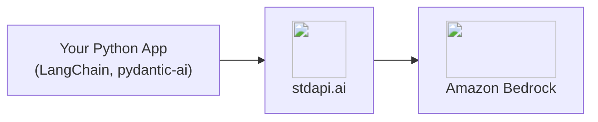

# :material-language-python: Python Client Libraries Integration

Build Python applications and agents directly on Amazon Bedrock models with stdapi.ai, using the same LangChain and pydantic-ai client classes you would use against OpenAI or Anthropic directly—only the base URL changes.

## :material-information-outline: About LangChain and pydantic-ai

**🔗 Links:** [LangChain](https://python.langchain.com/) | [pydantic-ai](https://ai.pydantic.dev/)

LangChain and pydantic-ai are two of the most widely used Python frameworks for building LLM-backed applications and agents. Both ship OpenAI-compatible client classes that accept a custom base URL and API key as constructor arguments—no plugin, wrapper, or extension needed.

**What you can build:**

- **Custom agents** - Tool-calling loops, structured output, and multi-turn conversations in your own Python code
- **RAG applications** - Combine chat models with `OpenAIEmbeddings` for retrieval, see [RAG Pipelines](use_cases_rag.md)
- **Internal services** - Backend applications and scripts that call Bedrock models without a UI or CLI in between

## :material-help-circle-outline: Why Python Libraries + stdapi.ai?

<div class="grid cards" markdown>

- :material-swap-horizontal: __Standard Client Classes, No Fork__
  <br>`ChatOpenAI`, `OpenAIEmbeddings`, `ChatAnthropic`, and pydantic-ai's `OpenAIChatModel` all accept a custom base URL directly—no gateway-specific SDK to install.

- :material-aws: __Access Amazon Bedrock Models__
  <br>Claude, Nova, DeepSeek, Qwen, and 100+ models, called through the same classes your code already imports.

- :material-tools: __Tool Calling and Structured Output__
  <br>`bind_tools`, `with_structured_output`, and pydantic-ai's typed tool registration all work end to end against Bedrock models.

- :material-currency-usd-off: __Pay-Per-Use Pricing__
  <br>No per-request markup. Pay only Amazon Bedrock rates for the calls your application makes.

</div>



## :material-check-circle: Prerequisites

!!! info "What You'll Need"
    - ✓ **stdapi.ai deployed** - [See deployment guide](operations_getting_started.md) or [run locally with Docker](operations_getting_started_local.md)
    - ✓ **Your stdapi.ai URL** - e.g., `https://api.example.com` or `http://localhost:8000` for local
    - ✓ **Your API key** - From Terraform output or configuration (optional for local development)

---

## :material-link-variant: LangChain

### :material-chat: Chat — `langchain-openai`

`ChatOpenAI` takes the gateway's `/v1` base URL directly. `.invoke()`, `.stream()`, `bind_tools()`, and `with_structured_output()` all work unchanged against Bedrock models.

!!! example "ChatOpenAI"
    ```python
    from langchain_openai import ChatOpenAI

    model = ChatOpenAI(
        model="anthropic.claude-fable-5",
        base_url="https://YOUR_STDAPI_URL/v1",
        api_key="YOUR_STDAPI_KEY",
    )

    response = model.invoke("Name the largest planet in the solar system.")
    print(response.content)
    ```

See [Chat Completions API](api_openai_chat_completions.md) for the full parameter and model reference.

### :material-vector-polyline: Embeddings — `langchain-openai`

`OpenAIEmbeddings` also takes the `/v1` base URL, but its default behavior needs one extra setting.

!!! warning "Disable client-side tokenization"
    `OpenAIEmbeddings` tokenizes its input with `tiktoken` by default and sends the gateway a token-ID array instead of text—an artifact the embeddings endpoint rejects with a `400` error rather than silently embedding something other than what was asked for. Set `check_embedding_ctx_length=False` to send plain text instead:

    ```python
    from langchain_openai import OpenAIEmbeddings

    embeddings = OpenAIEmbeddings(
        model="amazon.titan-embed-text-v2:0",
        base_url="https://YOUR_STDAPI_URL/v1",
        api_key="YOUR_STDAPI_KEY",
        check_embedding_ctx_length=False,
    )

    vector = embeddings.embed_query("Your text here")
    ```

    Without this setting, every call to `embed_query` or `embed_documents` fails—this is the first thing to check if `OpenAIEmbeddings` returns a `400` against stdapi.ai but works against OpenAI directly.

See [Embeddings API](api_openai_embeddings.md) for supported models.

### :material-robot: Chat — `langchain-anthropic`

`ChatAnthropic` takes the gateway's `/anthropic` base URL and works with every model the route serves, not only Claude.

!!! example "ChatAnthropic"
    ```python
    from langchain_anthropic import ChatAnthropic

    model = ChatAnthropic(
        model_name="anthropic.claude-fable-5",
        base_url="https://YOUR_STDAPI_URL/anthropic",
        api_key="YOUR_STDAPI_KEY",
    )

    response = model.invoke("Name the largest planet in the solar system.")
    print(response.content)
    ```

See [Anthropic Messages API](api_anthropic_messages.md) for the full parameter and model reference.

---

## :material-robot-outline: pydantic-ai

pydantic-ai's `OpenAIChatModel` reaches the gateway through an `OpenAIProvider` carrying the base URL and API key, and works through the same [Chat Completions API](api_openai_chat_completions.md) route as `ChatOpenAI` above—including reasoning models and multi-turn tool-calling loops.

!!! example "Agent with a custom base URL"
    ```python
    from pydantic_ai import Agent
    from pydantic_ai.models.openai import OpenAIChatModel
    from pydantic_ai.providers.openai import OpenAIProvider

    model = OpenAIChatModel(
        "anthropic.claude-fable-5",
        provider=OpenAIProvider(
            base_url="https://YOUR_STDAPI_URL/v1",
            api_key="YOUR_STDAPI_KEY",
        ),
    )
    agent = Agent(model, system_prompt="You are a helpful assistant.")

    result = agent.run_sync("Name the largest planet in the solar system.")
    print(result.output)
    ```

Reasoning-capable models (Claude, DeepSeek, and others) work through the same agent, including a full tool-calling loop that reasons on one turn and calls a registered tool on the next. Request a reasoning effort level per call with `model_settings`:

```python
from pydantic_ai.models.openai import OpenAIChatModelSettings

result = agent.run_sync(
    "Call the registered tool, then answer.",
    model_settings=OpenAIChatModelSettings(openai_reasoning_effort="low"),
)
```

---

## :material-arrow-right: Next Steps

<div class="grid cards" markdown>

- :material-rocket-launch: [**Getting Started**](operations_getting_started.md) — Deploy stdapi.ai to AWS with Terraform
- :material-docker: [**Local Development**](operations_getting_started_local.md) — Run stdapi.ai locally with Docker
- :material-magnify: [**RAG Pipelines**](use_cases_rag.md) — Combine embeddings and reranking in a retrieval pipeline
- :material-puzzle: [**More Use Cases**](use_cases.md) — Explore other integrations and tools

</div>
