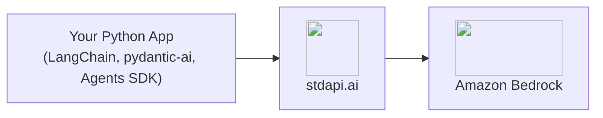
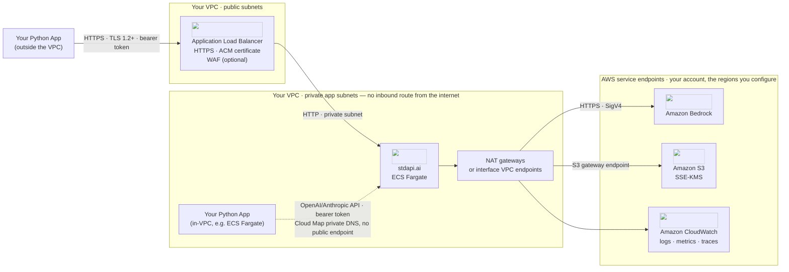

# :material-language-python: Python Client Libraries Integration

Build Python applications and agents directly on Amazon Bedrock models with stdapi.ai, using the same LangChain, pydantic-ai and OpenAI Agents SDK client classes you would use against OpenAI or Anthropic directly—two client-side changes: the base URL, and the model name, which you now pick from every provider in the catalogue rather than one vendor's list.

## :material-information-outline: About These Libraries

**🔗 Links:** [LangChain](https://python.langchain.com/) | [pydantic-ai](https://ai.pydantic.dev/) | [OpenAI Agents SDK](https://openai.github.io/openai-agents-python/)

These are three of the most widely used Python frameworks for building LLM-backed applications and agents. All of them ship OpenAI-compatible client classes that accept a custom base URL and API key as constructor arguments—no plugin, wrapper, or extension needed.

**What you can build:**

- **Custom agents** - Tool-calling loops, structured output, and multi-turn conversations in your own Python code
- **RAG applications** - Combine chat models with `OpenAIEmbeddings` for retrieval, see [RAG Pipelines](use_cases_rag.md)
- **Stateful and voice agents** - Server-side conversations, hosted retrieval and spoken sessions through the OpenAI Agents SDK
- **Internal services** - Backend applications and scripts that call Bedrock models without a UI or CLI in between

## :material-help-circle-outline: Why Python Libraries + stdapi.ai?

<div class="grid cards" markdown>

- :material-swap-horizontal: __Standard Client Classes, No Fork__
  <br>`ChatOpenAI`, `OpenAIEmbeddings`, `ChatAnthropic`, pydantic-ai's `OpenAIChatModel` and the Agents SDK's `OpenAIResponsesModel` all accept a custom base URL directly—no gateway-specific SDK to install.

- :material-aws: __Access Amazon Bedrock Models__
  <br>Claude, Nova, DeepSeek, Qwen, and 100+ models, called through the same classes your code already imports.

- :material-tools: __Tool Calling and Structured Output__
  <br>`bind_tools`, `with_structured_output`, and pydantic-ai's typed tool registration all work end to end against Bedrock models.

- :material-currency-usd-off: __Pay-Per-Use Pricing__
  <br>No per-request markup. Pay only Amazon Bedrock rates for the calls your application makes.

</div>



## :material-sitemap: Architecture

Unlike the other integration guides on this site, there is no application sample to deploy here — your LangChain, pydantic-ai or OpenAI Agents SDK process is code you already own. The decision that shapes everything else is where that process runs relative to the gateway's VPC: deployed as another ECS Fargate service (or any other workload) inside the same VPC, it reaches the gateway over private DNS and needs no public endpoint at all; running anywhere else — a laptop, a different account, another cloud — it reaches the gateway through a public Application Load Balancer instead.



The solid path is the public one: an application outside the VPC has no route to the private subnets, so it can only reach the gateway through the ALB, over HTTPS. The dotted path is the in-VPC alternative: an application co-located in the private app subnets resolves the gateway through AWS Cloud Map private DNS and never touches the ALB — for that path, the ALB, its ACM certificate and any WAF module do not need to exist at all. A deployment picks one path or the other for a given application; both are shown here only because the choice is yours to make, not because both run at once.

### What Each AWS Service Does Here

| AWS service | Role in this integration | Where it is configured |
| --- | --- | --- |
| **Amazon ECS on AWS Fargate** | Runs the stdapi.ai gateway container, and — on the in-VPC path — your Python application as its own service | Terraform module (default) |
| **Elastic Load Balancing** | Public entry point on the out-of-VPC path only; terminates TLS with an ACM certificate | `alb_enabled`, `alb_public` |
| **AWS Cloud Map** | Private DNS name your in-VPC application resolves instead of a public endpoint | `service_discovery_dns_namespace_id`, `service_discovery_dns_name` |
| **Amazon Bedrock** | Chat completions, embeddings, tool calling and reasoning for every client library on this page | [`AWS_BEDROCK_REGIONS`](operations_configuration.md#aws-bedrock-regions) |
| **Amazon S3** | Temporary storage for multimodal request and response payloads | Terraform module (default) |
| **AWS KMS** | Customer-managed key encrypting the S3 bucket | Terraform module (default) |
| **AWS Secrets Manager / SSM Parameter Store** | Holds the API key when one is generated or referenced | `api_key_create`, `api_key_ssm_parameter`, `api_key_secretsmanager_secret` |
| **Amazon CloudWatch** | Gateway request logs, EMF usage metrics, and OpenTelemetry trace export | [Logging & monitoring](operations_logging_monitoring.md) |
| **AWS IAM** | Least-privilege task role for the gateway; scoped to the model and AI-service actions it invokes | [IAM permissions](operations_iam_permissions.md) |

### Security Measures in This Flow

- **Authentication** — every client class on this page sends its `api_key` argument as an `Authorization: Bearer` header, whichever mechanism validates it on the gateway: a stdapi.ai [API key](operations_authentication_security.md#api-key-authentication), an [Amazon Cognito user-pool token](operations_authentication_security.md#amazon-cognito-user-pool-tokens) the gateway verifies itself, or a token from an [OIDC / IAM Identity Center](operations_authentication_security.md#oidc-cognito-iam-identity-center) flow terminated at the ALB before the request reaches stdapi.ai. [AWS IAM SigV4](operations_authentication_security.md#aws-iam) is available only through an API Gateway integration in front of the gateway — these SDKs' bearer-token clients cannot sign a SigV4 request themselves.
- **Encryption in transit** — HTTPS from an out-of-VPC application to the ALB; private-subnet HTTP from the ALB to the gateway container, or Cloud Map DNS with no ALB hop at all on the in-VPC path; HTTPS with SigV4 from the gateway to every AWS service it calls.
- **Encryption at rest** — SSE-KMS on the S3 bucket that holds multimodal payloads, with a customer-managed key.
- **Least privilege** — the gateway's ECS task role carries only the model and AI-service actions its configuration enables, not a blanket Bedrock or S3 grant.
- **Content policy** — a [Bedrock guardrail](operations_configuration.md#bedrock-guardrails) configured on the gateway applies to every chat request your application sends, independent of which client library issued it.
- **Data handling** — the gateway is stateless and holds request bodies in memory only; no third party sits between your application and the models it calls, so a Bedrock request made through stdapi.ai carries no telemetry back to another vendor unless your own client library adds it — see the `set_tracing_disabled(True)` note under [OpenAI Agents SDK](#openai-agents-sdk) above.

## :material-check-circle: Prerequisites

!!! info "What You'll Need"
    - ✓ **stdapi.ai deployed** - [See deployment guide](operations_getting_started.md) or [run locally with Docker](operations_getting_started_local.md)
    - ✓ **Your stdapi.ai URL** - e.g., `https://api.example.com` or `http://localhost:8000` for local
    - ✓ **Your API key** - From Terraform output or configuration (optional for local development)

---

## :material-link-variant: LangChain

### :material-chat: Chat — `langchain-openai`

`ChatOpenAI` takes the gateway's `/v1` base URL directly. `.invoke()`, `.stream()`, `bind_tools()`, and `with_structured_output()` all work unchanged against Bedrock models.

!!! example "ChatOpenAI"
    ```python
    from langchain_openai import ChatOpenAI

    model = ChatOpenAI(
        model="anthropic.claude-fable-5",
        base_url="https://YOUR_STDAPI_URL/v1",
        api_key="YOUR_STDAPI_KEY",
    )

    response = model.invoke("Name the largest planet in the solar system.")
    print(response.content)
    ```

See [Chat Completions API](api_openai_chat_completions.md) for the full parameter and model reference.

### :material-vector-polyline: Embeddings — `langchain-openai`

`OpenAIEmbeddings` also takes the `/v1` base URL, but its default behavior needs one extra setting.

!!! warning "Disable client-side tokenization"
    `OpenAIEmbeddings` tokenizes its input with `tiktoken` by default and sends the gateway a token-ID array instead of text—an artifact the embeddings endpoint rejects with a `400` error rather than silently embedding something other than what was asked for. Set `check_embedding_ctx_length=False` to send plain text instead:

    ```python
    from langchain_openai import OpenAIEmbeddings

    embeddings = OpenAIEmbeddings(
        model="amazon.titan-embed-text-v2:0",
        base_url="https://YOUR_STDAPI_URL/v1",
        api_key="YOUR_STDAPI_KEY",
        check_embedding_ctx_length=False,
    )

    vector = embeddings.embed_query("Your text here")
    ```

    Without this setting, every call to `embed_query` or `embed_documents` fails—this is the first thing to check if `OpenAIEmbeddings` returns a `400` against stdapi.ai but works against OpenAI directly.

See [Embeddings API](api_openai_embeddings.md) for supported models.

### :material-robot: Chat — `langchain-anthropic`

`ChatAnthropic` takes the gateway's `/anthropic` base URL and works with every model the route serves, not only Claude.

!!! example "ChatAnthropic"
    ```python
    from langchain_anthropic import ChatAnthropic

    model = ChatAnthropic(
        model_name="anthropic.claude-fable-5",
        base_url="https://YOUR_STDAPI_URL/anthropic",
        api_key="YOUR_STDAPI_KEY",
    )

    response = model.invoke("Name the largest planet in the solar system.")
    print(response.content)
    ```

See [Anthropic Messages API](api_anthropic_messages.md) for the full parameter and model reference.

---

## :material-robot-outline: pydantic-ai

pydantic-ai's `OpenAIChatModel` reaches the gateway through an `OpenAIProvider` carrying the base URL and API key, and works through the same [Chat Completions API](api_openai_chat_completions.md) route as `ChatOpenAI` above—including reasoning models and multi-turn tool-calling loops.

!!! example "Agent with a custom base URL"
    ```python
    from pydantic_ai import Agent
    from pydantic_ai.models.openai import OpenAIChatModel
    from pydantic_ai.providers.openai import OpenAIProvider

    model = OpenAIChatModel(
        "anthropic.claude-fable-5",
        provider=OpenAIProvider(
            base_url="https://YOUR_STDAPI_URL/v1", api_key="YOUR_STDAPI_KEY"
        ),
    )
    agent = Agent(model, system_prompt="You are a helpful assistant.")

    result = agent.run_sync("Name the largest planet in the solar system.")
    print(result.output)
    ```

Reasoning-capable models (Claude, DeepSeek, and others) work through the same agent, including a full tool-calling loop that reasons on one turn and calls a registered tool on the next. Request a reasoning effort level per call with `model_settings`:

```python
from pydantic_ai.models.openai import OpenAIChatModelSettings

result = agent.run_sync(
    "Call the registered tool, then answer.",
    model_settings=OpenAIChatModelSettings(openai_reasoning_effort="low"),
)
```

---

## :material-account-group: OpenAI Agents SDK

The [OpenAI Agents SDK](https://openai.github.io/openai-agents-python/) speaks the [Responses API](api_openai_responses.md) natively, so pointing its client at the gateway also hands its agents the server-side surfaces the Responses route serves — stored conversations, hosted retrieval and the realtime voice session included.

!!! example "An agent bound to the gateway"
    ```python
    from agents import Agent, Runner, set_tracing_disabled
    from agents.models.openai_responses import OpenAIResponsesModel
    from openai import AsyncOpenAI

    set_tracing_disabled(True)

    client = AsyncOpenAI(base_url="https://YOUR_STDAPI_URL/v1", api_key="YOUR_STDAPI_KEY")
    agent = Agent(
        name="assistant",
        instructions="Answer in one short sentence.",
        model=OpenAIResponsesModel(model="anthropic.claude-fable-5", openai_client=client),
    )

    result = Runner.run_sync(agent, "Name the largest planet in the solar system.")
    print(result.final_output)
    ```

    `set_tracing_disabled(True)` matters here: left on, the SDK exports every run to OpenAI's tracing backend with its own key, which is exactly the third party this deployment exists to remove.

### :material-history: Server-Side Sessions

`OpenAIConversationsSession` keeps an agent's turns in a [conversation](api_openai_conversations.md) on the gateway instead of in the process, so a second run replays what the gateway stored rather than a history you carried:

```python
from agents.memory import OpenAIConversationsSession

session = OpenAIConversationsSession(openai_client=client)
```

Pass it as `Runner.run_sync(..., session=session)`; the conversation id is what makes a run resumable from another process.

### :material-file-search: Hosted Retrieval

`FileSearchTool(vector_store_ids=[...])` attaches a [vector store](api_openai_vector_stores.md) to the agent, and the search happens inside the response — the SDK's own loop never sees a tool call. Build the store first, as in the [RAG Pipelines guide](use_cases_rag.md#managed-retrieval), then:

```python
from agents import FileSearchTool

agent = Agent(
    name="librarian",
    instructions="Answer only from the attached notes.",
    tools=[FileSearchTool(vector_store_ids=["vs_abc123"], include_search_results=True)],
)
```

### :material-microphone: Voice Agents

`RealtimeRunner` opens a spoken session against [`WS /v1/realtime`](api_openai_realtime.md): give its `model_config` the `wss://YOUR_STDAPI_URL/v1/realtime?model=<id>` URL and either the API key or a [minted client secret](api_openai_realtime.md#ephemeral-client-secrets). Sessions last up to 8 minutes and call no tools — see the [Realtime API](api_openai_realtime.md#feature-compatibility) for what a session does and does not emit.

---

## :material-gauge: Operating This Integration

### What It Costs to Run

| Charge | Driver |
| --- | --- |
| stdapi.ai licence | $0.10 per gateway container-hour, metered through AWS Marketplace, with a 14-day free trial on the licence |
| ECS Fargate | The gateway service, sized and auto-scaled independently of your application's own compute |
| Load balancing and networking | An ALB plus the NAT gateways or interface VPC endpoints the private subnets egress through — the ALB drops out entirely when your application runs in the same VPC and reaches the gateway over Cloud Map private DNS |
| Model and AI-service usage | Amazon Bedrock at AWS rates, billed to your account with no markup |

Read a model's price before your application sends anything to it with [`GET /model_pricing`](api_model_pricing.md). Setting [`COST_TRACKING=true`](operations_cost_management.md#cost-tracking-real-time-aws-pricing) additionally puts a per-request cost on each usage entry — estimated from published AWS prices, not read back from your invoice.

### What to Watch

The gateway writes one structured `request` event per call to CloudWatch, carrying the request id, path, status code, `execution_time_ms`, the model that served it, and the token counts AWS billed; streaming calls add a matching `request_stream` event. When [`OTEL_ENABLED=true`](operations_configuration.md#otel-enabled) and [`OTEL_EXPORTER_ENDPOINT`](operations_configuration.md#otel-exporter-endpoint) point at a collector, the gateway also exports OpenTelemetry traces for the same calls. Because your application is the client here, the most direct link between the two is the `x-request-id` response header: read it from every gateway response and log it alongside your own request handling, so a failure your application sees can be traced straight back to the gateway event that produced it.

```sql
fields id, path, model_id, status_code
| filter type = "request" and status_code >= 400
| stats count(*) as errors by path, model_id, status_code
| sort errors desc
```

Pair this with your application's own logs, keyed on the `x-request-id` it received, to tell a gateway-side failure apart from one your code introduced before or after the call.

---

## :material-arrow-right: Next Steps

<div class="grid cards" markdown>

- :material-rocket-launch: [**Getting Started**](operations_getting_started.md) — Deploy stdapi.ai to AWS with Terraform
- :material-docker: [**Local Development**](operations_getting_started_local.md) — Run stdapi.ai locally with Docker
- :material-magnify: [**RAG Pipelines**](use_cases_rag.md) — Combine embeddings and reranking in a retrieval pipeline
- :material-puzzle: [**More Use Cases**](use_cases.md) — Explore other integrations and tools

</div>
