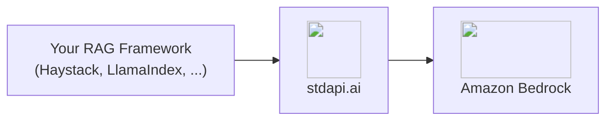

# :material-magnify: RAG Pipelines Integration

Build retrieval-augmented generation and semantic search pipelines on Amazon Bedrock through stdapi.ai's OpenAI-compatible embeddings and Cohere-compatible reranking—one deployment serving every stage of the pipeline.

There are two ways to do it, and they share the same deployment:

- **Managed** — attach your files to a [vector store](api_openai_vector_stores.md) and search it. Chunking, embedding, indexing and retrieval are the gateway's job; you write no pipeline.
- **Assembled** — keep your own framework and vector database, and use stdapi.ai for the embedding, reranking and generation calls.

Start managed, and move to the assembled pipeline when you need a retrieval strategy of your own.

## :material-information-outline: About Retrieval-Augmented Generation

A RAG pipeline grounds a model's answer in your own documents instead of its training data: a retriever finds candidate passages by vector similarity, an optional reranker reorders them by relevance to the actual question, and a chat model answers from the reordered context.

**What a RAG pipeline needs from its backend:**

- **Embeddings** - Vectorize documents and queries into the same space
- **Reranking** - Reorder retrieved candidates by relevance before they reach the model
- **Generation** - Answer from the retrieved context with a chat-capable model

stdapi.ai serves all three from Amazon Bedrock through standard, unmodified client libraries.

## :material-help-circle-outline: Why RAG + stdapi.ai?

<div class="grid cards" markdown>

- :material-database-search: __Managed Vector Stores__
  <br>Attach a file to a [vector store](api_openai_vector_stores.md) and search it by meaning—no chunker, embedder or vector database to run.

- :material-swap-horizontal: __Two Dialects, One Deployment__
  <br>Point your embedder and chat model at the OpenAI-compatible `/v1` route, and your reranker at the Cohere-compatible `/cohere` route—no separate services to run.

- :material-aws: __Bedrock Embedding and Rerank Models__
  <br>Amazon Titan, Cohere Embed, and Cohere Rerank, served through the SDKs your RAG framework already uses.

- :material-lock: __Enterprise Data Privacy__
  <br>Documents, queries, and embeddings never leave your AWS account.

- :material-currency-usd-off: __Pay-Per-Use Pricing__
  <br>No per-query fees or vector-database markup. Pay only Amazon Bedrock rates for the embed, rerank, and generation calls you make.

</div>



## :material-database-search: Managed Retrieval with Vector Stores { #managed-retrieval }

Upload your files, attach them to a vector store, and search it. Nothing else runs.

!!! example "Index and search"
    ```python
    import time

    from openai import OpenAI

    client = OpenAI(base_url="https://YOUR_STDAPI_URL/v1", api_key="YOUR_API_KEY")

    uploaded = client.files.create(file=open("handbook.txt", "rb"), purpose="assistants")
    store = client.vector_stores.create(name="handbook", file_ids=[uploaded.id])

    # Indexing is asynchronous: wait until the store reports it finished.
    while client.vector_stores.retrieve(store.id).status == "in_progress":
        time.sleep(2)

    for result in client.vector_stores.search(
        store.id, query="How much parental leave do I get?"
    ):
        print(result.score, result.filename, result.content[0].text)
    ```

    Feed the returned passages to a chat model as context and you have a complete RAG loop in a dozen lines. Tag files with `attributes` to scope a search to a department, a product or a language.

Only **text** files can be indexed — convert PDFs and office documents first, with the [document parsing](#document-parsing) stage below. See the [Vector Stores API](api_openai_vector_stores.md) for chunking, filters, expiration and the storage it needs in your account.

---

## :material-hammer-screwdriver: Assembling Your Own Pipeline { #assembled-pipeline }

The rest of this page wires stdapi.ai into a pipeline you build yourself, with your own vector database and retrieval strategy.

## :material-check-circle: Prerequisites

!!! info "What You'll Need"
    - ✓ **stdapi.ai deployed** - [See deployment guide](operations_getting_started.md) or [run locally with Docker](operations_getting_started_local.md)
    - ✓ **Your stdapi.ai URL** - e.g., `https://api.example.com`
    - ✓ **Your API key** - From Terraform output or configuration
    - ✓ **A vector store** - for the assembled pipeline only: stdapi.ai serves embeddings and reranking, and the vectors live in your framework's own store (in-memory, pgvector, Qdrant, and others all work). [Managed retrieval](#managed-retrieval) needs none.

---

## :material-cog: Configuration

Every RAG framework that speaks the OpenAI and Cohere SDKs follows the same pattern: the embedder and the generator take the OpenAI-compatible `/v1` base URL, and the reranker takes the Cohere-compatible `/cohere` base URL.

### :material-file-document-outline: Document Parsing { #document-parsing }

Before embedding, a RAG pipeline needs plain text out of PDFs and office documents. [Docling Serve](https://github.com/docling-project/docling-serve) converts them to Markdown/JSON over an HTTP API — deploy it as the ingestion stage in front of the embedder below, not as a standalone gateway showcase.

Docling's default pipeline is classical layout/OCR/table-structure extraction and never calls an LLM. Its optional VLM pipeline additionally routes page images through stdapi.ai to a vision-capable Bedrock model, for documents that benefit from model-assisted layout understanding.

!!! example "Convert a document"
    ```bash
    curl -s -X POST "$DOCLING_URL/v1/convert/source" \
      -H 'Content-Type: application/json' \
      -d '{
        "options": {"to_formats": ["md"]},
        "sources": [{"kind": "http", "url": "https://example.com/document.pdf"}]
      }' | jq -r '.document.md_content'
    ```

    Docling Serve's own usage documentation shows `http_sources` here, but the server's OpenAPI schema requires the `sources` array with a `kind` discriminator shown above.

    Feed the returned Markdown into the embedder below to complete the ingestion stage.

**📦 [stdapi-ai/samples/getting_started_docling](https://github.com/stdapi-ai/samples/tree/main/getting_started_docling)** deploys Docling Serve on ECS Fargate, CPU-only, with the VLM pipeline pre-wired to a Bedrock vision model through stdapi.ai.

!!! warning "Local ECS module source"
    `module "docling"` currently points at a local relative path (`../../../terraform-aws-ecs`) instead of the published registry module, because it needs S3 Files/public-image support that isn't in a tagged release yet. Cloning only the samples repository is not enough for `tofu init` to resolve it — you need a sibling checkout of `terraform-aws-ecs` next to `samples/`.

**Deploy:**

```bash
git clone https://github.com/stdapi-ai/samples.git
git clone https://github.com/JGoutin/terraform-aws-ecs.git
cd samples/getting_started_docling/terraform
tofu init
tofu apply
```

### :material-vector-polyline: Embeddings

Point your framework's OpenAI-compatible embedder at `/v1` with an embeddings-capable model.

!!! example "Haystack"
    ```python
    from haystack.components.embedders import OpenAIDocumentEmbedder, OpenAITextEmbedder
    from haystack.utils import Secret

    document_embedder = OpenAIDocumentEmbedder(
        api_key=Secret.from_env_var("STDAPI_API_KEY"),
        model="amazon.titan-embed-text-v2:0",
        api_base_url="https://YOUR_STDAPI_URL/v1",
    )
    text_embedder = OpenAITextEmbedder(
        api_key=Secret.from_env_var("STDAPI_API_KEY"),
        model="amazon.titan-embed-text-v2:0",
        api_base_url="https://YOUR_STDAPI_URL/v1",
    )
    ```

    Embed your corpus with `OpenAIDocumentEmbedder` and each incoming query with `OpenAITextEmbedder`, using the same model for both so the vectors share a space. See [Embeddings API](api_openai_embeddings.md) for supported models.

### :material-sort-variant: Reranking

Point your framework's Cohere-compatible reranker at `/cohere`, not the full rerank path—the Cohere client appends the operation itself.

!!! example "Haystack"
    ```python
    from haystack_integrations.components.rankers.cohere import CohereRanker
    from haystack.utils import Secret

    ranker = CohereRanker(
        api_key=Secret.from_env_var("STDAPI_API_KEY"),
        model="cohere.rerank-v3-5:0",
        api_base_url="https://YOUR_STDAPI_URL/cohere",
        top_k=3,
    )
    ```

    Requires the `cohere-haystack` integration package alongside `haystack-ai`. Give the ranker the retriever's full candidate set—every retrieved document, not just the top few—so it has something to reorder rather than merely confirm. See [Cohere Rerank API](api_cohere_rerank.md) for supported models.

!!! tip "Regional availability"
    Amazon Bedrock serves reranking from a subset of regions only. Keep at least one of them in [`AWS_BEDROCK_REGIONS`](operations_configuration.md#aws-bedrock-regions); stdapi.ai fails over to it automatically.

### :material-chat: Generation

Point your framework's OpenAI-compatible chat generator at `/v1`, answering from the reranked context.

!!! example "Haystack"
    ```python
    from haystack.components.generators.chat import OpenAIChatGenerator
    from haystack.utils import Secret

    generator = OpenAIChatGenerator(
        api_key=Secret.from_env_var("STDAPI_API_KEY"),
        model="anthropic.claude-haiku-4-5-20251001-v1:0",
        api_base_url="https://YOUR_STDAPI_URL/v1",
    )
    ```

    Any text/chat-capable model works here; it never needs to match the embedding or reranking model. See [Chat Completions API](api_openai_chat_completions.md) for supported models.

### :material-toolbox: Other Frameworks

The same two-route pattern—OpenAI-compatible `/v1` for embedding and generation, Cohere-compatible `/cohere` for reranking—applies to any framework built on those SDKs, including LlamaIndex, RAGFlow, and LightRAG. Set the base URL and API key on the framework's OpenAI and Cohere client configuration; the vector store itself (pgvector, Qdrant, or an in-memory store) is unaffected and stores whatever the embedder returns.

!!! tip "Want the platform instead of the pipeline?"
    This page covers wiring stdapi.ai into a pipeline you assemble yourself. If you would rather run a finished product—a web UI, document parsing, knowledge bases, and grounded chat, with no pipeline code to write—see the [RAGFlow Integration](use_cases_ragflow.md) guide, which deploys RAGFlow with all three stages already bound to Amazon Bedrock.

!!! warning "n8n cannot rerank through stdapi.ai"
    n8n's Cohere Reranker node has no base URL field—see [n8n Integration: Known Limitations](use_cases_n8n.md#known-limitations) for a workaround.

---

## :material-arrow-right: Next Steps

<div class="grid cards" markdown>

- :material-database-search: [**Vector Stores API**](api_openai_vector_stores.md) — The managed retrieval half of this page
- :material-rocket-launch: [**Getting Started**](operations_getting_started.md) — Deploy stdapi.ai to AWS with Terraform
- :material-docker: [**Local Development**](operations_getting_started_local.md) — Run stdapi.ai locally with Docker
- :material-puzzle: [**More Use Cases**](use_cases.md) — Explore other integrations and tools
- :material-api: [**API Overview**](api_overview.md) — Explore supported endpoints

</div>
