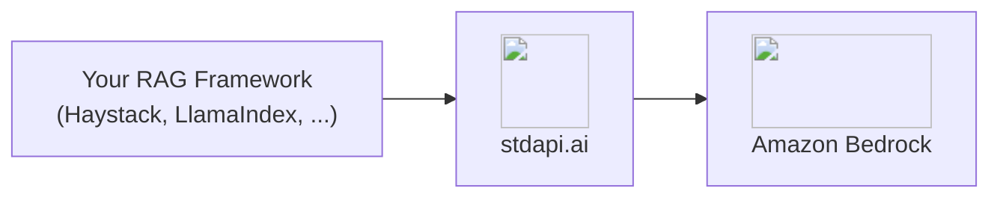
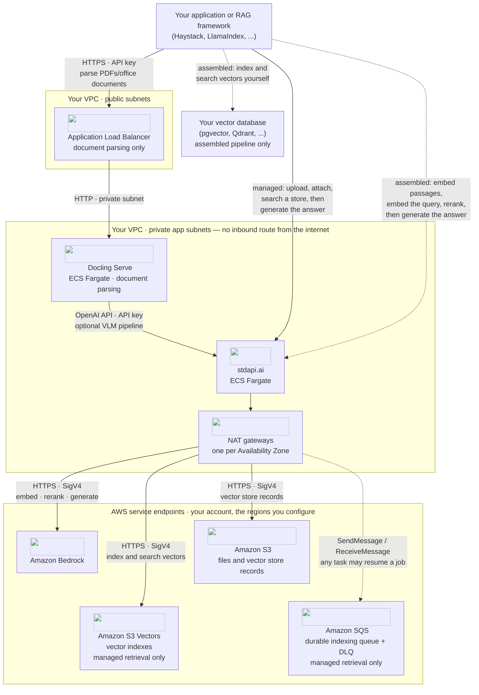

# :material-magnify: RAG Pipelines Integration

Build retrieval-augmented generation and semantic search pipelines on Amazon Bedrock through stdapi.ai's OpenAI-compatible embeddings and Cohere-compatible reranking—one deployment serving every stage of the pipeline.

There are two ways to do it, and they share the same deployment:

- **Managed** — attach your files to a [vector store](api_openai_vector_stores.md) and search it, or let the model search it for itself. Chunking, embedding, indexing and retrieval are the gateway's job; you write no pipeline.
- **Assembled** — keep your own framework and vector database, and use stdapi.ai for the embedding, reranking and generation calls.

Start managed, and move to the assembled pipeline when you need a retrieval strategy of your own.

## :material-information-outline: About Retrieval-Augmented Generation

A RAG pipeline grounds a model's answer in your own documents instead of its training data: a retriever finds candidate passages by vector similarity, an optional reranker reorders them by relevance to the actual question, and a chat model answers from the reordered context.

**What a RAG pipeline needs from its backend:**

- **Embeddings** - Vectorize documents and queries into the same space
- **Reranking** - Reorder retrieved candidates by relevance before they reach the model
- **Generation** - Answer from the retrieved context with a chat-capable model

stdapi.ai serves all three from Amazon Bedrock through standard, unmodified client libraries.

## :material-help-circle-outline: Why RAG + stdapi.ai?

<div class="grid cards" markdown>

- :material-database-search: __Managed Vector Stores__
  <br>Attach a file to a [vector store](api_openai_vector_stores.md) and search it by meaning—no chunker, embedder or vector database to run.

- :material-database-import: __Your Existing Knowledge Base__
  <br>An [Amazon Bedrock knowledge base](api_openai_vector_stores.md#knowledge-base-stores) you already run is addressed as a vector store too—searched and extended, never recreated.

- :material-swap-horizontal: __Two Dialects, One Deployment__
  <br>Point your embedder and chat model at the OpenAI-compatible `/v1` route, and your reranker at the Cohere-compatible `/cohere` route—no separate services to run.

- :material-aws: __Bedrock Embedding and Rerank Models__
  <br>Amazon Titan, Cohere Embed, and Cohere Rerank, served through the SDKs your RAG framework already uses.

- :material-lock: __Enterprise Data Privacy__
  <br>Documents, queries, and embeddings never leave your AWS account.

- :material-currency-usd-off: __Pay-Per-Use Pricing__
  <br>No per-query fees or vector-database markup. Pay only Amazon Bedrock rates for the embed, rerank, and generation calls you make.

</div>



## :material-sitemap: Architecture

The two modes differ in who runs the pipeline and where its state lives. Managed retrieval puts chunking, embedding, indexing and search inside the gateway, backed by a vector bucket and a durable indexing queue in your account; the assembled pipeline keeps your framework in charge of chunking, indexing and search, and calls stdapi.ai only for the embedding, reranking and generation steps in between.



Two things are worth reading off the picture. In managed retrieval, your documents and their vectors come to rest inside your account — the general-purpose bucket holds the vector store's records, the S3 Vectors bucket holds the indexed embeddings, and the SQS queue makes an indexing job outlive the task that accepted it: this is the one deployment shape on this page where the gateway is not stateless. In the assembled pipeline the gateway stays exactly as stateless as everywhere else on this site — it holds no vectors at all, which land wherever your own framework's vector database puts them, never in this picture.

### What Each AWS Service Does Here

| AWS service | Role in this integration | Where it is configured |
| --- | --- | --- |
| **Amazon ECS on AWS Fargate** | Runs the stdapi.ai gateway and, for the document-parsing stage, Docling Serve, as independent services | Terraform sample |
| **Elastic Load Balancing** | Public entry point for Docling Serve's document-parsing API; the gateway itself has no listener of its own | Terraform sample |
| **Amazon Bedrock** | Embedding, reranking and generation models for both modes, plus the vision model behind Docling's optional VLM pipeline | [`AWS_BEDROCK_REGIONS`](operations_configuration.md#aws-bedrock-regions) |
| **Amazon S3** | Holds the Vector Stores API's own records — the stores, their attached files and file batches | [`AWS_S3_BUCKET`](operations_configuration.md#aws-s3-bucket) |
| **Amazon S3 Vectors** | Holds the indexed embeddings of every managed vector store, one index per store | [`AWS_S3_VECTORS_BUCKET`](operations_configuration.md#aws-s3-vectors-bucket) |
| **Amazon SQS** | Carries indexing jobs so an attach survives the task that accepted it, redriving a job that keeps failing to its dead-letter queue | [`AWS_SQS_VECTOR_STORE_QUEUE_URL`](operations_configuration.md#aws-sqs-vector-store-queue-url) |
| **AWS KMS** | Customer-managed keys encrypting the S3 bucket, the S3 Vectors bucket and the SQS queue, each independently | Terraform sample |
| **AWS IAM** | Least-privilege task role for the gateway; the Vector Stores, durable indexing and knowledge base permissions are granted only when their feature is enabled | [IAM permissions](operations_iam_permissions.md#vector-stores-optional) |

### Security Measures in This Flow

- **Authentication** — every call your application or framework makes to the gateway carries a stdapi.ai [API key](operations_authentication_security.md#api-key-authentication); Docling's optional VLM pipeline authenticates the same way when it calls the gateway for vision inference.
- **Encryption in transit** — HTTPS from wherever your application or framework runs to the gateway, and HTTPS with SigV4 from the gateway to Amazon Bedrock, Amazon S3, Amazon S3 Vectors and Amazon SQS.
- **Encryption at rest** — SSE-KMS on the S3 bucket holding vector store records, and on the S3 Vectors bucket and the SQS queue, each behind its own key: `aws_s3_vectors_kms_key_arn` and `aws_sqs_vector_store_queue_kms_key_arn` when you bring your own bucket or queue, a dedicated key created for you otherwise.
- **Least privilege** — the gateway's task role is granted the Vector Stores, durable indexing and knowledge base actions only when the corresponding feature is configured, scoped to the ARNs of the bucket, the queue and the knowledge bases you name.
- **Content policy** — a [Bedrock guardrail](operations_configuration.md#bedrock-guardrails) applies to embeddings and reranking through the ApplyGuardrail API rather than Bedrock's native integration, checking each text input before it is embedded or reranked, and its consumed units are reported — unlike the native integration chat routes use.
- **Data handling** — uploaded files and their [S3 storage](operations_compliance.md#s3-data-storage) stay in your account, and an Amazon Bedrock knowledge base you already operate is [addressed as a vector store](api_openai_vector_stores.md#knowledge-base-stores) — searched and extended, never recreated.

## :material-database-search: Managed Retrieval with Vector Stores { #managed-retrieval }

Upload your files, attach them to a vector store, and search it. Nothing else runs.

!!! example "Index and search"
    ```python
    import time

    from openai import OpenAI

    client = OpenAI(base_url="https://YOUR_STDAPI_URL/v1", api_key="YOUR_API_KEY")

    uploaded = client.files.create(file=open("handbook.txt", "rb"), purpose="assistants")
    store = client.vector_stores.create(name="handbook", file_ids=[uploaded.id])

    # Indexing is asynchronous: wait until the store reports it finished.
    while client.vector_stores.retrieve(store.id).status == "in_progress":
        time.sleep(2)

    for result in client.vector_stores.search(
        store.id, query="How much parental leave do I get?"
    ):
        print(result.score, result.filename, result.content[0].text)
    ```

    Feed the returned passages to a chat model as context and you have a complete RAG loop in a dozen lines. Tag files with `attributes` to scope a search to a department, a product or a language.

Only **text** files can be indexed — convert PDFs and office documents first, with the [document parsing](#document-parsing) stage below. See the [Vector Stores API](api_openai_vector_stores.md) for chunking, filters, expiration and the storage it needs in your account.

!!! tip "Indexing that survives a deployment"
    A file is indexed by the server that accepted it. Point [`AWS_SQS_VECTOR_STORE_QUEUE_URL`](operations_configuration.md#aws-sqs-vector-store-queue-url) at a queue and the job is handed over to it instead, so a bulk ingestion keeps going — and finishes — when that server is replaced mid-way. See [Durable indexing](api_openai_vector_stores.md#durable-indexing).

### :material-file-search: Let the Model Do the Retrieving { #file-search }

Naming a store as a `file_search` tool on the [Responses API](api_openai_responses.md#file-search) moves the whole loop into a single request: the model decides when to search and with which query, answers from the passages it gets back, and annotates the answer with a citation per file it drew on.

!!! example "One request, retrieval included"
    ```python
    response = client.responses.create(
        model="amazon.nova-2-lite-v1:0",
        input="How much parental leave do I get?",
        tools=[{"type": "file_search", "vector_store_ids": [store.id]}],
    )
    print(response.output_text)
    ```

    No retriever to call, no context to assemble, no citation bookkeeping: the searches the turn ran come back as `file_search_call` items when you want to show them, and `include=["file_search_call.results"]` returns the passages themselves. See [File Search](api_openai_responses.md#file-search) for attribute filters, score thresholds and the streamed event order.

### :material-database-import: Searching a Knowledge Base You Already Run { #knowledge-base }

If your documents are already in an **Amazon Bedrock knowledge base**, keep it where it is. Allowlist it in [`AWS_BEDROCK_KNOWLEDGE_BASE_IDS`](operations_configuration.md#aws-bedrock-knowledge-base-ids) and it is addressed as the vector store `vs_kb_<knowledgeBaseId>` — searched, listed, read and (on a custom data source) extended with new documents, through the same client code and the same `file_search` tool as above.

The knowledge base stays yours: it is never created and never deleted here, and a request that would reshape it — renaming, an expiry, a chunking strategy — is refused with the reason rather than half-applied. Its retrieval scores are reported as the backend states them, so a `score_threshold` against such a store is refused instead of meaning something else. See [Knowledge Base Stores](api_openai_vector_stores.md#knowledge-base-stores).

---

## :material-hammer-screwdriver: Assembling Your Own Pipeline { #assembled-pipeline }

The rest of this page wires stdapi.ai into a pipeline you build yourself, with your own vector database and retrieval strategy.

## :material-check-circle: Prerequisites

!!! info "What You'll Need"
    - ✓ **stdapi.ai deployed** - [See deployment guide](operations_getting_started.md) or [run locally with Docker](operations_getting_started_local.md)
    - ✓ **Your stdapi.ai URL** - e.g., `https://api.example.com`
    - ✓ **Your API key** - From Terraform output or configuration
    - ✓ **A vector store** - for the assembled pipeline only: stdapi.ai serves embeddings and reranking, and the vectors live in your framework's own store (in-memory, pgvector, Qdrant, and others all work). [Managed retrieval](#managed-retrieval) needs none.

---

## :material-cog: Configuration

Every RAG framework that speaks the OpenAI and Cohere SDKs follows the same pattern: the embedder and the generator take the OpenAI-compatible `/v1` base URL, and the reranker takes the Cohere-compatible `/cohere` base URL.

### :material-file-document-outline: Document Parsing { #document-parsing }

Before embedding, a RAG pipeline needs plain text out of PDFs and office documents. [Docling Serve](https://github.com/docling-project/docling-serve) converts them to Markdown/JSON over an HTTP API — deploy it as the ingestion stage in front of the embedder below, not as a standalone gateway showcase.

Docling's default pipeline is classical layout/OCR/table-structure extraction and never calls an LLM. Its optional VLM pipeline additionally routes page images through stdapi.ai to a vision-capable Bedrock model, for documents that benefit from model-assisted layout understanding.

!!! example "Convert a document"
    ```bash
    curl -s -X POST "$DOCLING_URL/v1/convert/source" \
      -H 'Content-Type: application/json' \
      -d '{
        "options": {"to_formats": ["md"]},
        "sources": [{"kind": "http", "url": "https://example.com/document.pdf"}]
      }' | jq -r '.document.md_content'
    ```

    Docling Serve's own usage documentation shows `http_sources` here, but the server's OpenAPI schema requires the `sources` array with a `kind` discriminator shown above.

    Feed the returned Markdown into the embedder below to complete the ingestion stage.

**📦 [stdapi-ai/samples/getting_started_docling](https://github.com/stdapi-ai/samples/tree/main/getting_started_docling)** deploys Docling Serve on ECS Fargate, CPU-only, with the VLM pipeline pre-wired to a Bedrock vision model through stdapi.ai.

!!! warning "Local ECS module source"
    `module "docling"` currently points at a local relative path (`../../../terraform-aws-ecs`) instead of the published registry module, because it needs S3 Files/public-image support that isn't in a tagged release yet. Cloning only the samples repository is not enough for `tofu init` to resolve it — you need a sibling checkout of `terraform-aws-ecs` next to `samples/`.

**Deploy:**

```bash
git clone https://github.com/stdapi-ai/samples.git
git clone https://github.com/JGoutin/terraform-aws-ecs.git
cd samples/getting_started_docling/terraform
tofu init
tofu apply
```

### :material-vector-polyline: Embeddings

Point your framework's OpenAI-compatible embedder at `/v1` with an embeddings-capable model.

!!! example "Haystack"
    ```python
    from haystack.components.embedders import OpenAIDocumentEmbedder, OpenAITextEmbedder
    from haystack.utils import Secret

    document_embedder = OpenAIDocumentEmbedder(
        api_key=Secret.from_env_var("STDAPI_API_KEY"),
        model="amazon.titan-embed-text-v2:0",
        api_base_url="https://YOUR_STDAPI_URL/v1",
    )
    text_embedder = OpenAITextEmbedder(
        api_key=Secret.from_env_var("STDAPI_API_KEY"),
        model="amazon.titan-embed-text-v2:0",
        api_base_url="https://YOUR_STDAPI_URL/v1",
    )
    ```

    Embed your corpus with `OpenAIDocumentEmbedder` and each incoming query with `OpenAITextEmbedder`, using the same model for both so the vectors share a space. See [Embeddings API](api_openai_embeddings.md) for supported models.

!!! tip "A first ingestion does not have to run synchronously"
    Embedding a whole corpus is exactly the shape the [Batch API](api_openai_batches.md) is for: write one `/v1/embeddings` request per passage into a JSONL file, submit it, and collect the vectors when it finishes — at the Amazon Bedrock batch price rather than the synchronous one. Queries stay on the synchronous route, where latency matters.

### :material-sort-variant: Reranking

Point your framework's Cohere-compatible reranker at `/cohere`, not the full rerank path—the Cohere client appends the operation itself.

!!! example "Haystack"
    ```python
    from haystack_integrations.components.rankers.cohere import CohereRanker
    from haystack.utils import Secret

    ranker = CohereRanker(
        api_key=Secret.from_env_var("STDAPI_API_KEY"),
        model="cohere.rerank-v3-5:0",
        api_base_url="https://YOUR_STDAPI_URL/cohere",
        top_k=3,
    )
    ```

    Requires the `cohere-haystack` integration package alongside `haystack-ai`. Give the ranker the retriever's full candidate set—every retrieved document, not just the top few—so it has something to reorder rather than merely confirm. See [Cohere Rerank API](api_cohere_rerank.md) for supported models.

!!! tip "Regional availability"
    Amazon Bedrock serves reranking from a subset of regions only. Keep at least one of them in [`AWS_BEDROCK_REGIONS`](operations_configuration.md#aws-bedrock-regions); stdapi.ai fails over to it automatically.

### :material-chat: Generation

Point your framework's OpenAI-compatible chat generator at `/v1`, answering from the reranked context.

!!! example "Haystack"
    ```python
    from haystack.components.generators.chat import OpenAIChatGenerator
    from haystack.utils import Secret

    generator = OpenAIChatGenerator(
        api_key=Secret.from_env_var("STDAPI_API_KEY"),
        model="anthropic.claude-haiku-4-5-20251001-v1:0",
        api_base_url="https://YOUR_STDAPI_URL/v1",
    )
    ```

    Any text/chat-capable model works here; it never needs to match the embedding or reranking model. See [Chat Completions API](api_openai_chat_completions.md) for supported models.

### :material-toolbox: Other Frameworks

The same two-route pattern—OpenAI-compatible `/v1` for embedding and generation, Cohere-compatible `/cohere` for reranking—applies to any framework built on those SDKs, including LlamaIndex, RAGFlow, and LightRAG. Set the base URL and API key on the framework's OpenAI and Cohere client configuration; the vector store itself (pgvector, Qdrant, or an in-memory store) is unaffected and stores whatever the embedder returns.

Frameworks that drive the Responses API can take the [managed](#managed-retrieval) half instead of a store of their own: given a file and a `file_search` tool, **Agno** uploads it, creates the vector store, waits for the indexing and names the store on the turn — all against the base URL it already chats with.

!!! tip "Want the platform instead of the pipeline?"
    This page covers wiring stdapi.ai into a pipeline you assemble yourself. If you would rather run a finished product—a web UI, document parsing, knowledge bases, and grounded chat, with no pipeline code to write—see the [RAGFlow Integration](use_cases_ragflow.md) guide, which deploys RAGFlow with all three stages already bound to Amazon Bedrock.

!!! warning "n8n cannot rerank through stdapi.ai"
    n8n's Cohere Reranker node has no base URL field—see [n8n Integration: Known Limitations](use_cases_n8n.md#known-limitations) for a workaround.

---

## :material-gauge: Operating This Integration

### What It Costs to Run

| Charge | Driver |
| --- | --- |
| stdapi.ai licence | $0.10 per gateway container-hour, metered through AWS Marketplace, with a 14-day free trial on the licence |
| Amazon ECS on AWS Fargate | The gateway, and — for the document-parsing stage — Docling Serve, each sized independently |
| Amazon Bedrock — ingestion | One embedding call per indexed passage, paid once when a file is attached |
| Amazon Bedrock — query | One embedding call per search query; the assembled pipeline adds a reranking call, and either mode adds a generation call whenever a chat model answers from the retrieved passages |
| Amazon S3 Vectors | Storage and request charges for the vector indexes themselves — see [Vector Stores pricing](operations_cost_management.md#vector-stores) for what is and is not in stdapi.ai's usage log |
| Amazon S3 | Standard storage for the vector store's own records and any uploaded files |
| Amazon SQS | No standing charge — billed per request, so an idle queue between indexing jobs costs nothing |

Read a model's price before you send anything to it with [`GET /model_pricing`](api_model_pricing.md). Setting [`COST_TRACKING=true`](operations_cost_management.md#cost-tracking-real-time-aws-pricing) additionally puts a per-request cost on each usage entry — estimated from published AWS prices, not read back from your invoice — though the vector bucket's own storage and request charges never appear in it; read those from AWS Cost Explorer instead.

### What to Watch

The gateway logs one `request` event per call and, for managed indexing, a separate `background` event named `vector_store_indexing` correlated to it by `id` — group on that field to see how long a file's indexing actually took after the attach call returned. The dead-letter queue behind [`AWS_SQS_VECTOR_STORE_QUEUE_URL`](operations_configuration.md#aws-sqs-vector-store-queue-url) is the signal that a document failed to index: a file still failing after its queue's redrive policy exhausts its deliveries lands there instead of being silently dropped, so a non-empty dead-letter queue means a document needs attention. Turning on [`CLOUDWATCH_METRICS`](operations_logging_monitoring.md#cloudwatch-metrics-emf) republishes the same billed quantities as EMF metrics in the `stdapi` namespace, dimensioned by `Model`.

```sql
fields @timestamp, event, execution_time_ms, id
| filter type = "background" and event = "vector_store_indexing"
| sort @timestamp desc
| limit 100
```

Watch the dead-letter queue depth alongside this query — a job that never appears here again after being sent once, with the primary queue's `ApproximateNumberOfMessagesVisible` back at zero, finished; one that keeps reappearing is heading for the dead-letter queue instead.

---

## :material-arrow-right: Next Steps

<div class="grid cards" markdown>

- :material-database-search: [**Vector Stores API**](api_openai_vector_stores.md) — The managed retrieval half of this page
- :material-rocket-launch: [**Getting Started**](operations_getting_started.md) — Deploy stdapi.ai to AWS with Terraform
- :material-docker: [**Local Development**](operations_getting_started_local.md) — Run stdapi.ai locally with Docker
- :material-puzzle: [**More Use Cases**](use_cases.md) — Explore other integrations and tools
- :material-api: [**API Overview**](api_overview.md) — Explore supported endpoints

</div>
