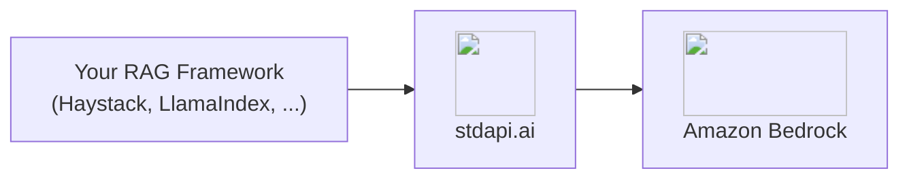

# :material-magnify: RAG Pipelines Integration

Build retrieval-augmented generation and semantic search pipelines on Amazon Bedrock through stdapi.ai's OpenAI-compatible embeddings and Cohere-compatible reranking—one deployment serving every stage of the pipeline.

## :material-information-outline: About Retrieval-Augmented Generation

A RAG pipeline grounds a model's answer in your own documents instead of its training data: a retriever finds candidate passages by vector similarity, an optional reranker reorders them by relevance to the actual question, and a chat model answers from the reordered context.

**What a RAG pipeline needs from its backend:**

- **Embeddings** - Vectorize documents and queries into the same space
- **Reranking** - Reorder retrieved candidates by relevance before they reach the model
- **Generation** - Answer from the retrieved context with a chat-capable model

stdapi.ai serves all three from Amazon Bedrock through standard, unmodified client libraries.

## :material-help-circle-outline: Why RAG + stdapi.ai?

<div class="grid cards" markdown>

- :material-swap-horizontal: __Two Dialects, One Deployment__
  <br>Point your embedder and chat model at the OpenAI-compatible `/v1` route, and your reranker at the Cohere-compatible `/cohere` route—no separate services to run.

- :material-aws: __Bedrock Embedding and Rerank Models__
  <br>Amazon Titan, Cohere Embed, and Cohere Rerank, served through the SDKs your RAG framework already uses.

- :material-lock: __Enterprise Data Privacy__
  <br>Documents, queries, and embeddings never leave your AWS account.

- :material-currency-usd-off: __Pay-Per-Use Pricing__
  <br>No per-query fees or vector-database markup. Pay only Amazon Bedrock rates for the embed, rerank, and generation calls you make.

</div>



## :material-check-circle: Prerequisites

!!! info "What You'll Need"
    - ✓ **stdapi.ai deployed** - [See deployment guide](operations_getting_started.md) or [run locally with Docker](operations_getting_started_local.md)
    - ✓ **Your stdapi.ai URL** - e.g., `https://api.example.com`
    - ✓ **Your API key** - From Terraform output or configuration
    - ✓ **A vector store** - stdapi.ai serves embeddings and reranking; the vectors themselves live in your framework's own store (in-memory, pgvector, Qdrant, and others all work)

---

## :material-cog: Configuration

Every RAG framework that speaks the OpenAI and Cohere SDKs follows the same pattern: the embedder and the generator take the OpenAI-compatible `/v1` base URL, and the reranker takes the Cohere-compatible `/cohere` base URL.

### :material-vector-polyline: Embeddings

Point your framework's OpenAI-compatible embedder at `/v1` with an embeddings-capable model.

!!! example "Haystack"
    ```python
    from haystack.components.embedders import OpenAIDocumentEmbedder, OpenAITextEmbedder
    from haystack.utils import Secret

    document_embedder = OpenAIDocumentEmbedder(
        api_key=Secret.from_env_var("STDAPI_API_KEY"),
        model="amazon.titan-embed-text-v2:0",
        api_base_url="https://YOUR_STDAPI_URL/v1",
    )
    text_embedder = OpenAITextEmbedder(
        api_key=Secret.from_env_var("STDAPI_API_KEY"),
        model="amazon.titan-embed-text-v2:0",
        api_base_url="https://YOUR_STDAPI_URL/v1",
    )
    ```

    Embed your corpus with `OpenAIDocumentEmbedder` and each incoming query with `OpenAITextEmbedder`, using the same model for both so the vectors share a space. See [Embeddings API](api_openai_embeddings.md) for supported models.

### :material-sort-variant: Reranking

Point your framework's Cohere-compatible reranker at `/cohere`, not the full rerank path—the Cohere client appends the operation itself.

!!! example "Haystack"
    ```python
    from haystack_integrations.components.rankers.cohere import CohereRanker
    from haystack.utils import Secret

    ranker = CohereRanker(
        api_key=Secret.from_env_var("STDAPI_API_KEY"),
        model="cohere.rerank-v3-5:0",
        api_base_url="https://YOUR_STDAPI_URL/cohere",
        top_k=3,
    )
    ```

    Requires the `cohere-haystack` integration package alongside `haystack-ai`. Give the ranker the retriever's full candidate set—every retrieved document, not just the top few—so it has something to reorder rather than merely confirm. See [Cohere Rerank API](api_cohere_rerank.md) for supported models.

!!! tip "Regional availability"
    Amazon Bedrock serves reranking from a subset of regions only. Keep at least one of them in [`AWS_BEDROCK_REGIONS`](operations_configuration.md#aws-bedrock-regions); stdapi.ai fails over to it automatically.

### :material-chat: Generation

Point your framework's OpenAI-compatible chat generator at `/v1`, answering from the reranked context.

!!! example "Haystack"
    ```python
    from haystack.components.generators.chat import OpenAIChatGenerator
    from haystack.utils import Secret

    generator = OpenAIChatGenerator(
        api_key=Secret.from_env_var("STDAPI_API_KEY"),
        model="anthropic.claude-haiku-4-5-20251001-v1:0",
        api_base_url="https://YOUR_STDAPI_URL/v1",
    )
    ```

    Any text/chat-capable model works here; it never needs to match the embedding or reranking model. See [Chat Completions API](api_openai_chat_completions.md) for supported models.

### :material-toolbox: Other Frameworks

The same two-route pattern—OpenAI-compatible `/v1` for embedding and generation, Cohere-compatible `/cohere` for reranking—applies to any framework built on those SDKs, including LlamaIndex, RAGFlow, and LightRAG. Set the base URL and API key on the framework's OpenAI and Cohere client configuration; the vector store itself (pgvector, Qdrant, or an in-memory store) is unaffected and stores whatever the embedder returns.

!!! warning "n8n cannot rerank through stdapi.ai"
    n8n's Cohere Reranker node has no base URL field—see [n8n Integration: Known Limitations](use_cases_n8n.md#known-limitations) for a workaround.

---

## :material-arrow-right: Next Steps

<div class="grid cards" markdown>

- :material-rocket-launch: [**Getting Started**](operations_getting_started.md) — Deploy stdapi.ai to AWS with Terraform
- :material-docker: [**Local Development**](operations_getting_started_local.md) — Run stdapi.ai locally with Docker
- :material-puzzle: [**More Use Cases**](use_cases.md) — Explore other integrations and tools
- :material-api: [**API Overview**](api_overview.md) — Explore supported endpoints

</div>
