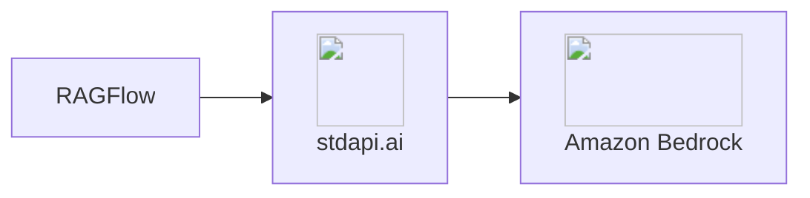

# :material-file-document-multiple-outline: RAGFlow Integration

Run RAGFlow as a complete, self-hosted retrieval-augmented generation platform with Amazon Bedrock behind it. Document parsing, embeddings, reranking, and answer synthesis all reach Bedrock through stdapi.ai — and the models are already bound to the tenant before the first login.

## :material-information-outline: About RAGFlow

**🔗 Links:** [Website](https://ragflow.io/) | [GitHub](https://github.com/infiniflow/ragflow) | [Documentation](https://ragflow.io/docs/dev/)

RAGFlow is an open-source (Apache-2.0) RAG engine built around deep document understanding. Rather than a library you assemble a pipeline from, it is a finished product: a web UI for knowledge bases, a document parser, a retrieval stack, a chat assistant with citations, and an agent builder.

**Key Features:**

- **Deep document parsing** - Layout-aware extraction from PDFs, office documents, and images, with chunk-level visual grounding
- **Knowledge bases** - Upload, parse, chunk, and index documents through the UI, with per-base parsing and embedding settings
- **Hybrid retrieval** - BM25 keyword scoring combined with vector similarity, then reranked before generation
- **Grounded chat** - Answers cite the exact chunks they came from, so every claim is traceable to a source page
- **Agents** - A visual builder for multi-step retrieval and tool workflows on top of the knowledge bases

## :material-help-circle-outline: Why RAGFlow + stdapi.ai?

<div class="grid cards" markdown>

- :material-layers-triple: __Every RAG Stage, One Gateway__
  <br>Chat, embeddings, and reranking are three different API dialects. stdapi.ai serves all three from one deployment, so RAGFlow needs a single endpoint and a single key.

- :material-aws: __Access Amazon Bedrock Models__
  <br>Nova and Claude for synthesis, Cohere Embed and Amazon Titan for indexing, Cohere Rerank for two-stage retrieval — all through Bedrock.

- :material-sort-variant: __Reranking Without a Second Vendor__
  <br>RAGFlow's reranking stage speaks the Cohere API. It reaches Bedrock's `Rerank` through stdapi.ai's [Cohere-compatible route](api_cohere_rerank.md), with no Cohere account involved.

- :material-lock: __Enterprise Data Privacy__
  <br>Your documents, their chunks, and their vectors stay in your AWS account, in services you own.

- :material-currency-usd-off: __Pay-Per-Use Pricing__
  <br>No RAGFlow Cloud subscription and no per-seat fees. Pay Amazon Bedrock rates for the parse, embed, rerank, and chat calls you actually make.

</div>



## :material-check-circle: Prerequisites

!!! info "What You'll Need"
    - ✓ **stdapi.ai deployed** - [See deployment guide](operations_getting_started.md)
    - ✓ **Your stdapi.ai URL** - e.g., `https://api.example.com`
    - ✓ **Your API key** - From Terraform output or configuration
    - ✓ **RAGFlow instance** - Running or ready to deploy (see Deployment section below), on **x86_64** — RAGFlow publishes no arm64 image
    - ✓ **A reranking region** - Bedrock serves `Rerank` from a subset of regions; keep one in [`AWS_BEDROCK_REGIONS`](operations_configuration.md#aws-bedrock-regions) and stdapi.ai fails over to it automatically

---

## :material-cog: Configuration

RAGFlow stores model credentials in its own database, added through **Settings → Model providers** in the web UI. Each entry pairs a *provider* (which decides the HTTP client and the URL layout) with an *instance* (a base URL and an API key). Three entries cover the whole pipeline:

| Stage | RAGFlow provider | Base URL | stdapi.ai route |
| --- | --- | --- | --- |
| Chat | `OpenAI-API-Compatible` | `https://YOUR_STDAPI_URL/v1` | [`/v1/chat/completions`](api_openai_chat_completions.md) |
| Rerank | `OpenAI-API-Compatible` | `https://YOUR_STDAPI_URL/cohere/v2` | [`/cohere/v2/rerank`](api_cohere_rerank.md) |
| Embedding | `OpenAI-API-Compatible` | `https://YOUR_STDAPI_URL/v1` | [`/v1/embeddings`](api_openai_embeddings.md) |

All three use the same stdapi.ai API key. Reranking needs its own entry because RAGFlow derives the request path from the instance's base URL, and reranking is served on the Cohere-compatible routes rather than the OpenAI ones.

Once the entries exist, set them as the tenant defaults under **Settings → Model providers → System model settings**, and RAGFlow uses them for every knowledge base and assistant.

### :material-database-search: Document Engine

RAGFlow defaults to a self-hosted Elasticsearch as its document and vector store, which **cannot run on AWS Fargate**: Elasticsearch requires the host sysctl `vm.max_map_count=262144`, and Fargate exposes no way to set it. Setting `DOC_ENGINE=opensearch` and pointing RAGFlow at an **Amazon OpenSearch Service** domain removes that constraint entirely — and replaces a container you would have to operate with a managed service.

!!! example "Configuration"
    Select the engine with an environment variable, and give it the domain in `service_conf.yaml`:

    ```bash
    DOC_ENGINE=opensearch
    ```

    ```yaml
    os:
      hosts: 'https://YOUR_DOMAIN_ENDPOINT:443'
      username: 'YOUR_MASTER_USER'
      password: 'YOUR_MASTER_USER_PASSWORD'
    ```

    The scheme and port are literals in RAGFlow's shipped template, so a domain endpoint alone is not enough — the file has to be replaced, which is what the sample below does.

Hybrid BM25 + vector retrieval requires OpenSearch 2.10 or later and the `cluster:admin/search/pipeline/put` privilege. RAGFlow creates the search pipeline itself on start-up and silently falls back to vector-only search if the call is refused, so it is worth confirming in the application log which mode you got.

!!! danger "The OpenSearch backend has no upstream CI coverage"
    RAGFlow's own GitHub workflows exercise the `elasticsearch` and `infinity` engines only. Nothing upstream tests `opensearch`, so a working combination is a property of a specific RAGFlow version rather than a supported contract. Pin an exact image tag and re-validate before upgrading — the sample below pins `v0.26.4`.

---

## :material-rocket-launch: Terraform Deployment

Deploy RAGFlow + stdapi.ai together, with the model providers already configured:

**📦 [stdapi-ai/samples/getting_started_ragflow](https://github.com/stdapi-ai/samples/tree/main/getting_started_ragflow)**

**What's included:**

- RAGFlow `v0.26.4` on ECS Fargate (4 vCPU / 16 GB), from the official `infiniflow/ragflow` image
- stdapi.ai gateway connected to Amazon Bedrock, registered as RAGFlow's chat, embedding, and rerank provider
- Amazon OpenSearch Service 2.19 as the document engine — a managed VPC domain with fine-grained access control, enforced HTTPS, and node-to-node and at-rest KMS encryption
- Aurora PostgreSQL Serverless v2 for metadata, initialized over the RDS Data API
- ElastiCache for Valkey with in-transit encryption and an AUTH token, reached through a `socat` TLS sidecar
- Amazon S3 for documents and generated files, accessed with the **ECS task role** — no IAM user and no static access keys
- A superuser account provisioned from a generated password, with self-registration closed

Every backing service is a managed AWS one; the only container in the task besides RAGFlow itself is the TLS sidecar and a short-lived bootstrap container.

!!! warning "Local ECS module source"
    `module "ragflow"` currently points at a local relative path (`../../../terraform-aws-ecs`) instead of the published registry module, because the sample needs S3 Files volume support that isn't in a tagged release yet. Cloning only the samples repository is not enough for `tofu init` to resolve it — you need a sibling checkout of `terraform-aws-ecs` next to `samples/`.

**Deploy:**

```bash
git clone https://github.com/stdapi-ai/samples.git
git clone https://github.com/JGoutin/terraform-aws-ecs.git
cd samples/getting_started_ragflow/terraform
tofu init
tofu apply
```

Then read the URL and the generated superuser credentials from the Terraform outputs and sign in. There is no signup screen and no model-provider dialog to work through.

### :material-account-check: Zero-Touch Model Configuration

Out of the box, RAGFlow is not usable until an administrator opens the UI and adds a model provider by hand — a knowledge base cannot even be created without an embedding model bound to the tenant. Since RAGFlow v0.26 those credentials live in the database rather than in `service_conf.yaml`, so there is no configuration file to preseed them from either.

The sample closes that gap with a **non-essential bootstrap container** in the same task. It waits for RAGFlow's health endpoint, logs in as the generated superuser, creates the three provider instances from the table above, binds them as the tenant's chat, embedding, and rerank defaults, and exits. Every step is idempotent, so it re-runs harmlessly on each task start.

The result is the point of the sample: **the first login lands on a working product**, with a knowledge base ready to accept its first document.

!!! tip "Creating a provider instance calls the model"
    RAGFlow verifies an API key by invoking the model for real, so the bootstrap container retries until the stdapi.ai gateway answers. A failure there is almost always the gateway still starting, and the container's log prints each step and the resulting tenant defaults.

### :material-shield-alert-outline: Security Notes

The sample encrypts every hop and keeps every secret out of plain environment variables, but two application behaviors are worth knowing before you put real documents in it:

- **RAGFlow does not validate the OpenSearch certificate.** Its OpenSearch client hardcodes `verify_certs=False`, with no configuration switch to change it. The connection is still encrypted and the domain still enforces HTTPS and TLS 1.2, but the certificate chain is not checked. The mitigation is placement: the domain has no public endpoint, lives in private subnets, and its security group admits only the RAGFlow task.
- **RAGFlow's Redis client cannot speak TLS.** It builds the client with no `ssl` parameter, and ElastiCache only offers AUTH tokens on encrypted clusters. Rather than disabling encryption, the task runs a `socat` sidecar that terminates TLS on loopback: the cluster keeps in-transit encryption and its AUTH token, and the plaintext hop never leaves the task's own network namespace.

---

## :material-alert-outline: Known Limitations

These are properties of RAGFlow `v0.26.4` on Fargate with the OpenSearch document engine, not of the gateway:

- **Agent Memory is unavailable.** RAGFlow wires a message store for the Elasticsearch and Infinity engines only; with `DOC_ENGINE=opensearch` it stays unset, so the feature raises when used. Startup and every other feature are unaffected.
- **The Agent "Code" component is unavailable.** It runs user code through RAGFlow's sandbox executor, which needs a Docker socket and gVisor — neither exists on Fargate.
- **Pagerank and the resume parser** branch on Elasticsearch upstream and do not apply on the OpenSearch backend.

---

## :material-arrow-right: Next Steps

<div class="grid cards" markdown>

- :material-magnify: [**RAG Pipelines**](use_cases_rag.md) — Wire embeddings and reranking into your own framework
- :material-rocket-launch: [**Getting Started**](operations_getting_started.md) — Deploy stdapi.ai to AWS with Terraform
- :material-puzzle: [**More Use Cases**](use_cases.md) — Explore other integrations and tools
- :material-api: [**API Overview**](api_overview.md) — Explore supported endpoints

</div>
